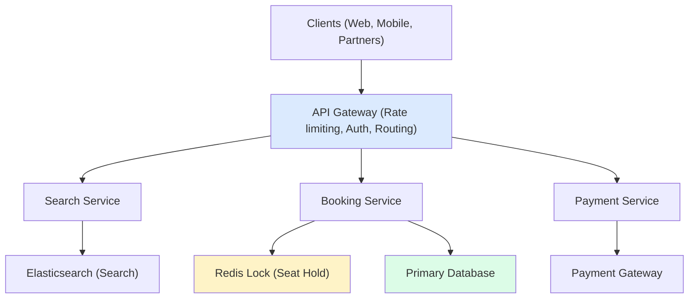
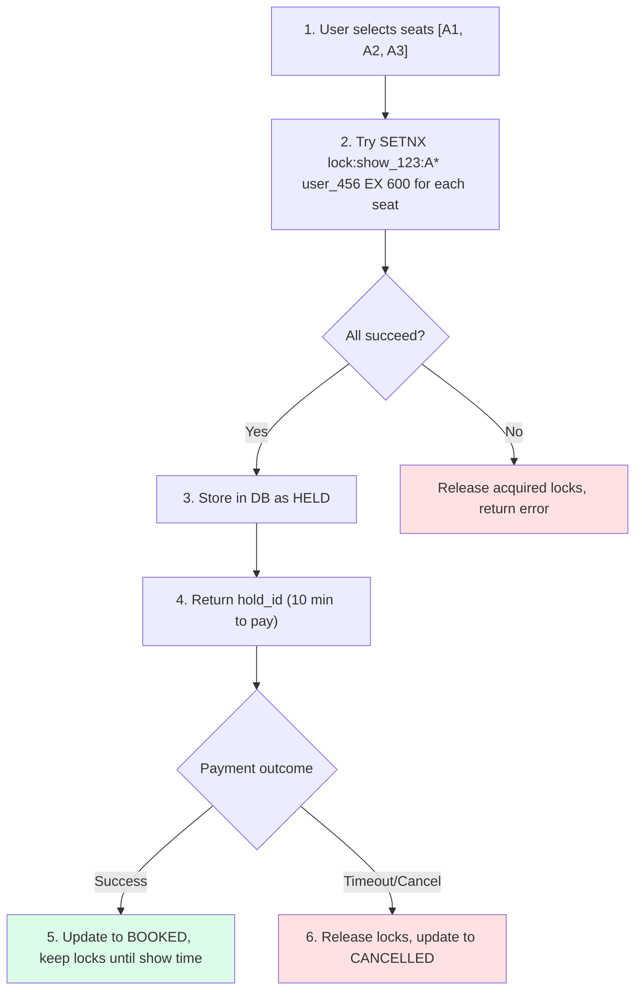
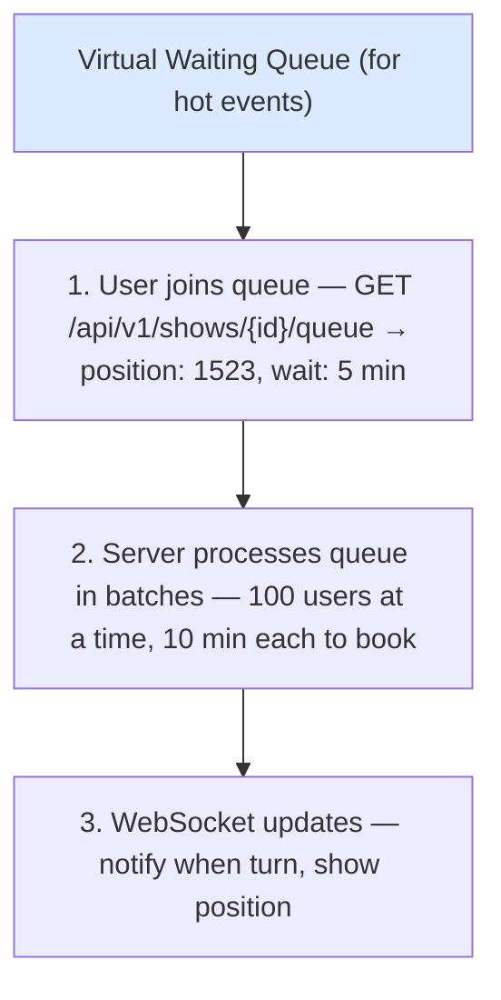
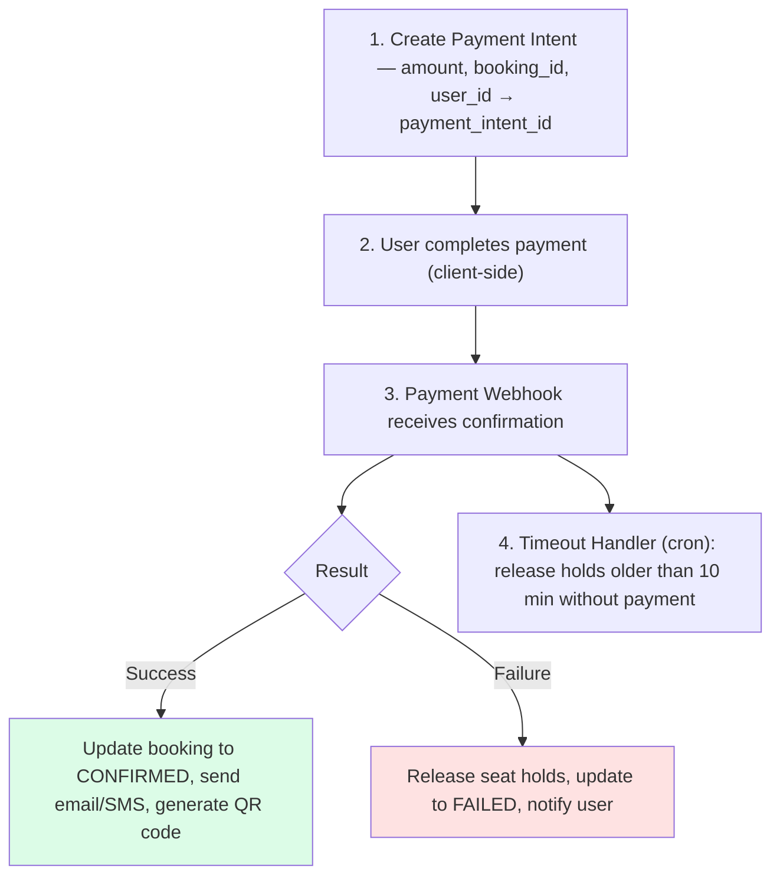
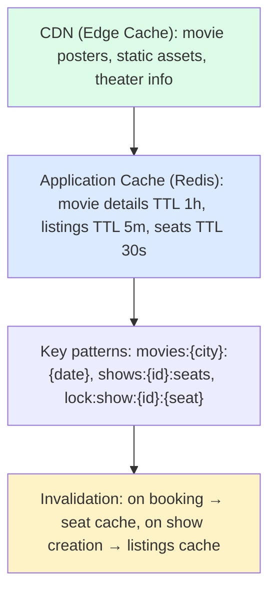
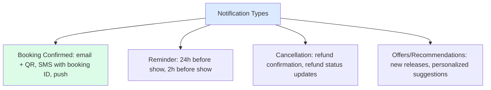

## Problem Statement

Design a movie/event ticket booking system that handles seat selection, booking, and payments.

---

## Requirements

### Functional Requirements
- Browse movies/events by city
- View showtimes and seat availability
- Select and hold seats temporarily
- Book seats with payment
- Handle cancellations and refunds

### Non-Functional Requirements
- Handle concurrent bookings (no double booking)
- Low latency for seat selection
- High availability
- Handle 10K+ concurrent users during popular events

---

## Capacity Estimation

```
Assumptions:
- 500 cities, 10 theaters/city = 5000 theaters
- 5 screens/theater, 200 seats/screen
- 5 shows/day/screen
- Peak: 10 million users during popular movie launch

Daily Scale:
- Shows: 5000 × 5 × 5 = 125,000 shows/day
- Seats: 125,000 × 200 = 25 million seats/day
- Bookings: ~5 million/day (20% occupancy avg)

Traffic:
- Read-heavy: Browse showtimes, check availability
- Write: Seat booking (~60 bookings/sec avg)
- Peak: 1000+ bookings/sec during hot events
```

---

## High-Level Architecture



---

## Database Schema

### Core Tables

```sql
-- Movies/Events
CREATE TABLE movies (
    movie_id UUID PRIMARY KEY,
    title VARCHAR(255),
    description TEXT,
    duration_minutes INT,
    language VARCHAR(50),
    genre VARCHAR(100),
    release_date DATE,
    poster_url VARCHAR(500),
    rating DECIMAL(2,1)
);

-- Theaters
CREATE TABLE theaters (
    theater_id UUID PRIMARY KEY,
    name VARCHAR(255),
    city_id UUID REFERENCES cities(city_id),
    address TEXT,
    total_screens INT
);

-- Screens
CREATE TABLE screens (
    screen_id UUID PRIMARY KEY,
    theater_id UUID REFERENCES theaters(theater_id),
    screen_number INT,
    total_seats INT,
    screen_type VARCHAR(50)  -- IMAX, 3D, Standard
);

-- Shows
CREATE TABLE shows (
    show_id UUID PRIMARY KEY,
    movie_id UUID REFERENCES movies(movie_id),
    screen_id UUID REFERENCES screens(screen_id),
    show_time TIMESTAMP,
    end_time TIMESTAMP,
    price_multiplier DECIMAL(3,2) DEFAULT 1.0,

    INDEX idx_movie_date (movie_id, show_time),
    INDEX idx_screen_date (screen_id, show_time)
);

-- Seats
CREATE TABLE seats (
    seat_id UUID PRIMARY KEY,
    screen_id UUID REFERENCES screens(screen_id),
    row_number VARCHAR(2),
    seat_number INT,
    seat_type VARCHAR(20),  -- REGULAR, PREMIUM, RECLINER
    base_price DECIMAL(10,2)
);

-- Bookings
CREATE TABLE bookings (
    booking_id UUID PRIMARY KEY,
    user_id UUID REFERENCES users(user_id),
    show_id UUID REFERENCES shows(show_id),
    booking_time TIMESTAMP DEFAULT NOW(),
    status VARCHAR(20),  -- PENDING, CONFIRMED, CANCELLED
    total_amount DECIMAL(10,2),
    payment_id UUID
);

-- Booked Seats
CREATE TABLE booked_seats (
    booking_id UUID REFERENCES bookings(booking_id),
    seat_id UUID REFERENCES seats(seat_id),
    show_id UUID REFERENCES shows(show_id),
    status VARCHAR(20),  -- HELD, BOOKED, CANCELLED
    held_until TIMESTAMP,

    PRIMARY KEY (show_id, seat_id),
    INDEX idx_booking (booking_id)
);
```

---

## Seat Booking Flow

### 1. View Available Seats

```
GET /api/v1/shows/{show_id}/seats

┌────────────────────────────────────────────────────────────────┐
│                          SCREEN                                 │
├────────────────────────────────────────────────────────────────┤
│                                                                │
│   A:  [1][2][3][4]    [5][6][7][8]    [9][10][11][12]        │
│   B:  [◉][◉][3][4]    [5][6][7][8]    [9][10][11][12]        │
│   C:  [1][2][◉][◉]    [5][6][7][8]    [9][10][11][12]        │
│   D:  [1][2][3][4]    [◉][◉][◉][◉]    [9][10][11][12]        │
│                                                                │
│   Legend: [ ] Available  [◉] Booked/Held                      │
└────────────────────────────────────────────────────────────────┘

Response:
{
  "show_id": "...",
  "seats": [
    { "seat_id": "A1", "status": "AVAILABLE", "price": 200 },
    { "seat_id": "B1", "status": "BOOKED", "price": 200 },
    ...
  ]
}
```

### 2. Hold Seats (Temporary Lock)

```
POST /api/v1/shows/{show_id}/hold

Request:
{
  "seat_ids": ["A1", "A2", "A3"],
  "user_id": "user123"
}

Response:
{
  "hold_id": "hold_abc123",
  "seats": ["A1", "A2", "A3"],
  "expires_at": "2024-01-15T10:35:00Z",  // 5-10 minutes
  "total_amount": 600
}
```

### 3. Confirm Booking with Payment

```
POST /api/v1/bookings

Request:
{
  "hold_id": "hold_abc123",
  "payment_method": "CARD",
  "payment_details": {...}
}

Response:
{
  "booking_id": "BK123456",
  "status": "CONFIRMED",
  "seats": ["A1", "A2", "A3"],
  "show": {...},
  "total_paid": 600,
  "qr_code": "..."
}
```

---

## Handling Concurrent Bookings

### Distributed Lock with Redis



### Optimistic Locking Alternative

```sql
-- Use database version/timestamp for conflict detection

BEGIN TRANSACTION;

-- Check seats are still available
SELECT seat_id, version
FROM booked_seats
WHERE show_id = ? AND seat_id IN (?, ?, ?)
FOR UPDATE;

-- If no rows or all AVAILABLE, proceed
INSERT INTO booked_seats (show_id, seat_id, status, booking_id)
VALUES (?, 'A1', 'BOOKED', ?),
       (?, 'A2', 'BOOKED', ?),
       (?, 'A3', 'BOOKED', ?);

COMMIT;
-- If constraint violation → seats already booked
```

---

## Handling High Traffic (Hot Shows)



---

## Payment Integration



---

## Caching Strategy



---

## Search & Discovery

```
Elasticsearch Index:

{
  "movie_id": "...",
  "title": "Avengers",
  "title_suggest": {  // For autocomplete
    "input": ["Avengers", "Avengers Endgame", "Marvel Avengers"]
  },
  "genre": ["Action", "Sci-Fi"],
  "language": "English",
  "cities": ["Mumbai", "Delhi", "Bangalore"],
  "release_date": "2024-01-15",
  "rating": 8.5,
  "show_times": [
    { "city": "Mumbai", "time": "10:00", "theater": "PVR" },
    ...
  ]
}

Queries:
- Full text search on title
- Filter by city, date, genre, language
- Sort by rating, release date
- Autocomplete suggestions
```

---

## Notification System



---

## Handling Edge Cases

| **Scenario** | **Solution** |
|-------------|-------------|
| Payment timeout | Release holds, allow re-booking |
| Double payment | Idempotency key, refund duplicate |
| Show cancelled | Full refund, notify all bookers |
| Partial seat hold | All-or-nothing (atomic) |
| High load | Queue system, rate limiting |

---

## Interview Tips

- Focus on seat locking mechanism
- Explain distributed lock with TTL
- Discuss handling concurrent bookings
- Cover payment flow and error handling
- Mention caching but emphasize short TTL for seats
- Discuss virtual queue for hot events
