## High-Level Architecture

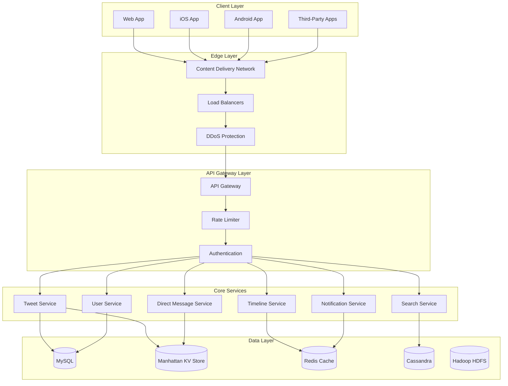

## Core Components

### 1. Tweet Distribution System

Twitter's fanout architecture handles tweet delivery to millions of followers.

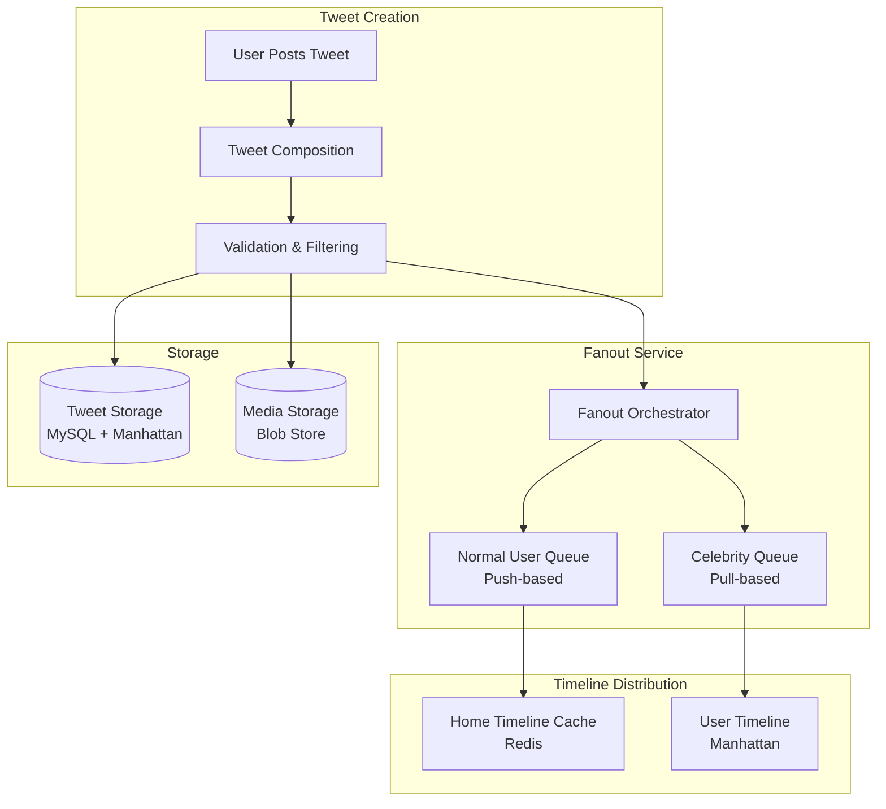

**Fanout Strategy:**
- **Push Fanout** (Normal Users): Tweets pushed to followers' timelines immediately
- **Pull Fanout** (Celebrities): Tweets fetched on-demand due to massive follower counts
- **Hybrid Model**: Combines both strategies based on follower count threshold (~1M followers)

**Key Features:**
- Write operations: ~500,000 tweets/second peak
- Read operations: ~600,000 timeline requests/second
- Fanout to millions of followers in \<5 seconds
- Content filtering and safety checks

### 2. Timeline Service Architecture

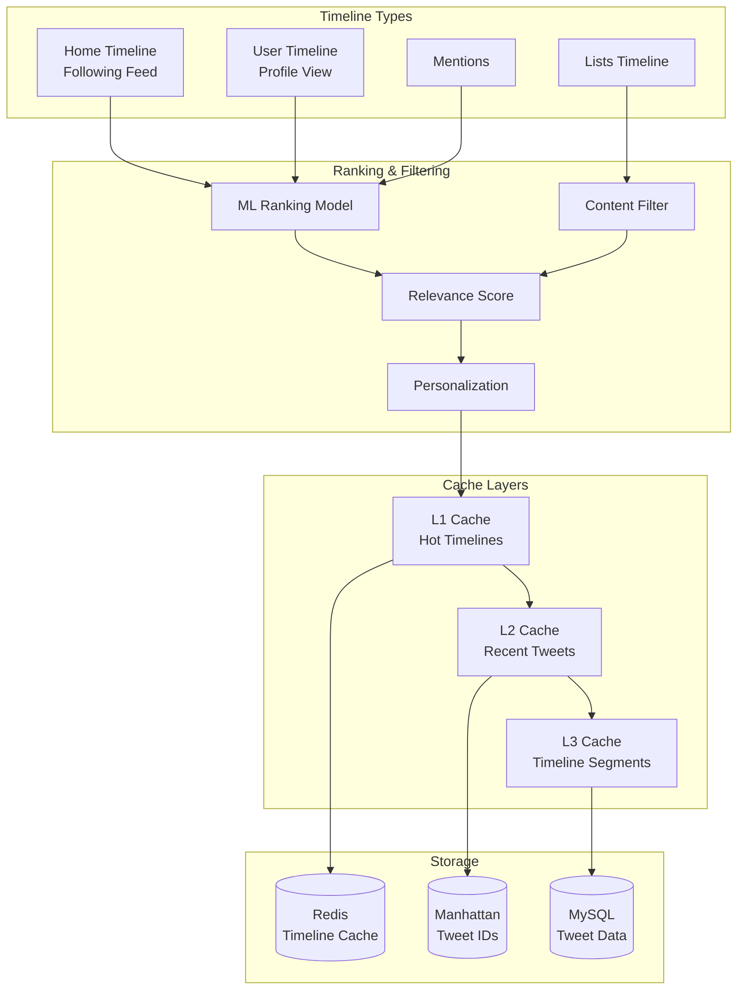

**Timeline Components:**
- **Home Timeline**: Chronological + algorithmic ranking
- **User Timeline**: User's own tweets
- **Mentions Timeline**: Tweets mentioning the user
- **List Timelines**: Curated user lists

**Ranking Signals:**
- Tweet recency and engagement
- User relationship strength
- Content type preferences
- Spam and quality scores

### 3. Real-Time Search Architecture

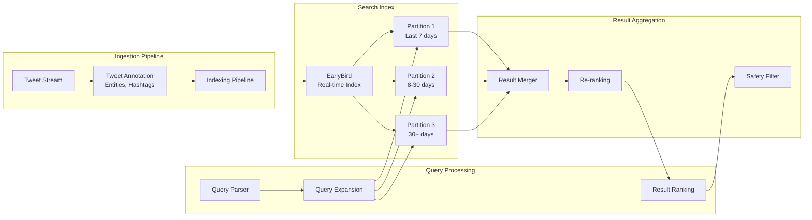

**Search Components:**
- **EarlyBird**: Custom real-time search engine
- **Inverted Index**: Tweet content, hashtags, mentions
- **Time-based Partitioning**: Recent tweets prioritized
- **Distributed Query Execution**: Parallel search across partitions

**Search Features:**
- Real-time indexing (\<10 seconds)
- Full-text search with operators
- Trending topics detection
- Spam and quality filtering

### 4. User Service

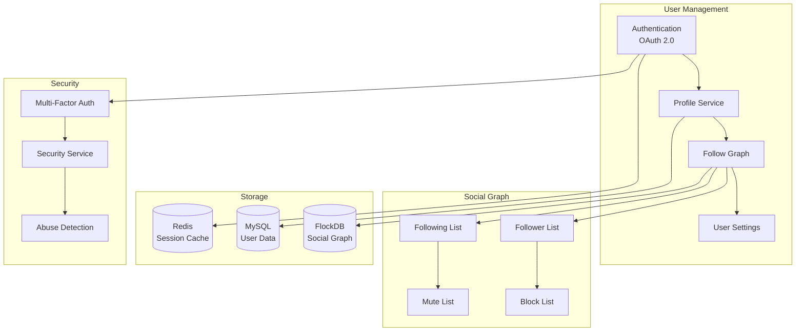

**Key Features:**
- OAuth 2.0 authentication
- Social graph storage (FlockDB)
- Follow/unfollow operations
- User verification system
- Privacy and security settings

### 5. Direct Message Service

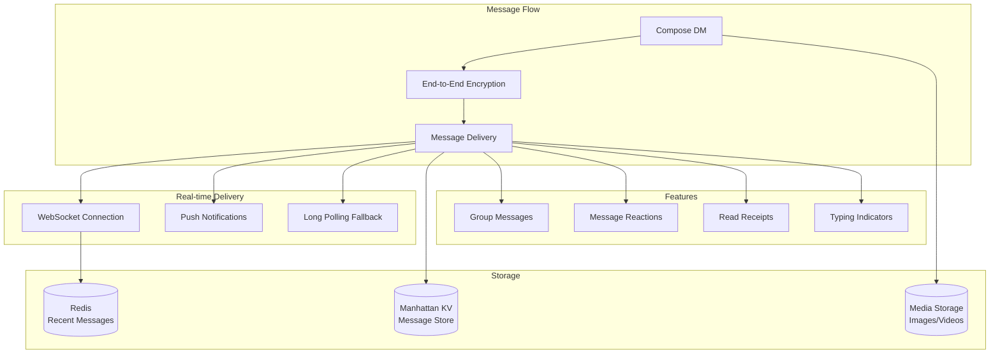

**DM Features:**
- End-to-end encryption option
- Real-time message delivery
- Group conversations
- Media sharing (images, videos, GIFs)
- Read receipts and typing indicators

### 6. Notification Service

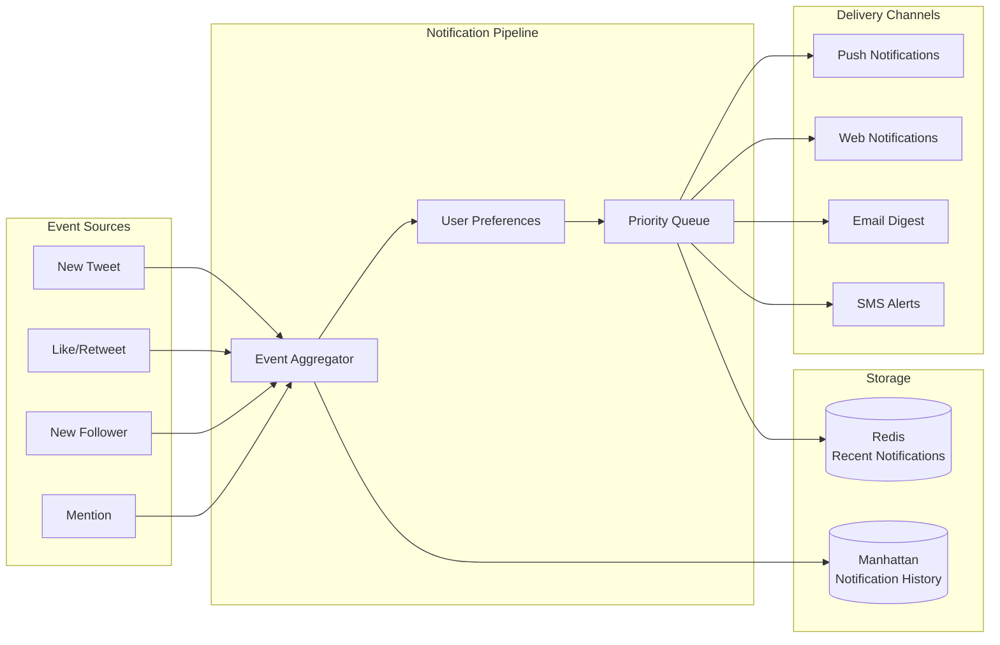

**Notification Types:**
- Engagement notifications (likes, retweets, replies)
- Social notifications (new followers, mentions)
- Direct message notifications
- Trending topic alerts
- Personalized recommendations

## Data Storage Architecture

### 1. Manhattan (Distributed Key-Value Store)

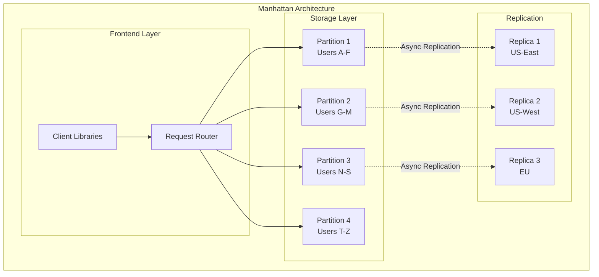

**Manhattan Use Cases:**
- Tweet storage (tweet ID → tweet data)
- Direct messages
- User timelines
- Low-latency key-value operations

**Features:**
- Geo-replicated across data centers
- Strong consistency within datacenter
- Eventual consistency across regions
- Billions of operations per second

### 2. MySQL Clusters

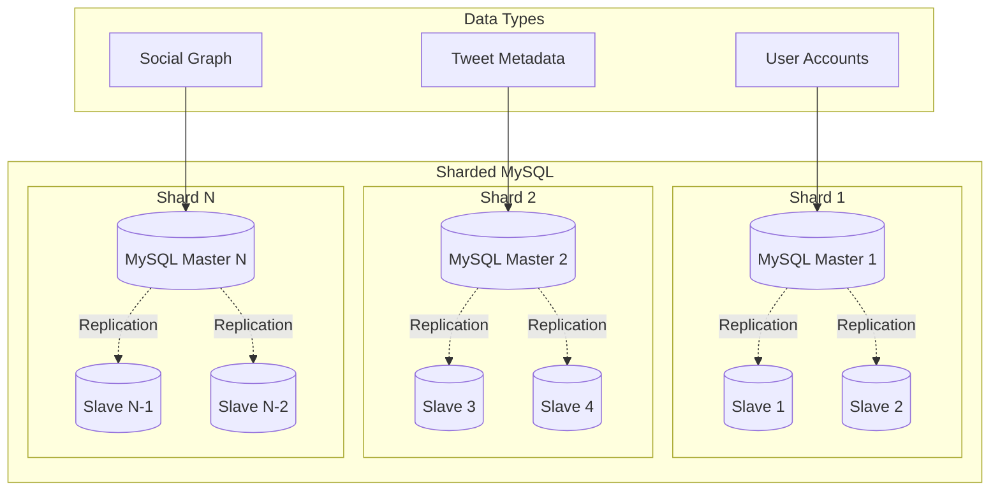

**MySQL Usage:**
- User account data
- Tweet metadata
- Relationships and social graph
- Application configuration

**Sharding Strategy:**
- User ID-based sharding
- Horizontal scaling to 1000+ shards
- Read replicas for query distribution

### 3. Redis Cache Architecture

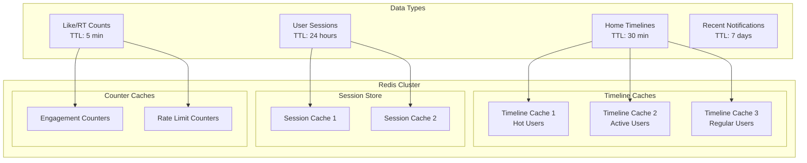

**Redis Use Cases:**
- Timeline caching (home, user, mentions)
- Session storage
- Real-time counters (likes, retweets)
- Rate limiting counters
- Recent notification cache

### 4. Cassandra

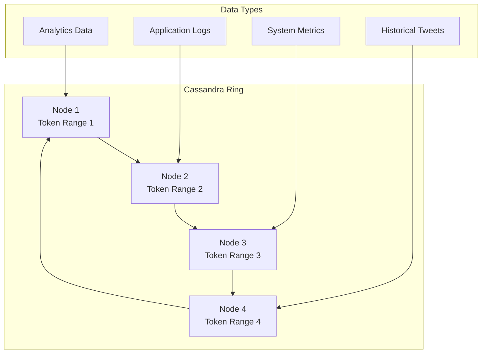

**Cassandra Use Cases:**
- Analytics and metrics
- Application logs
- Historical tweet archives
- Time-series data

### 5. Hadoop HDFS

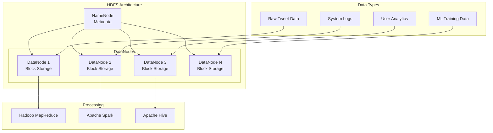

**HDFS Use Cases:**
- Data warehousing
- Batch analytics processing
- Machine learning training data
- Long-term data archival

## Scalability & Performance

### 1. Tweet Write Path

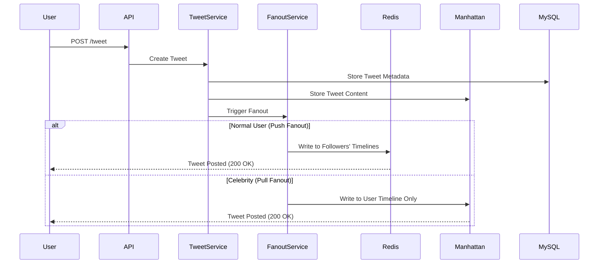

**Write Optimization:**
- Asynchronous fanout processing
- Batch timeline updates
- Parallel writes to multiple storage systems
- Write-through cache strategy

### 2. Timeline Read Path

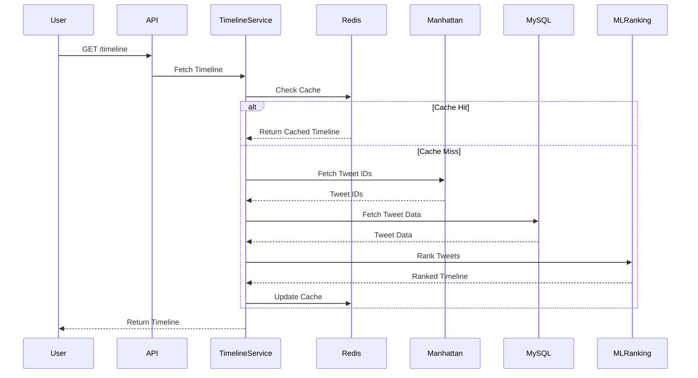

**Read Optimization:**
- Multi-level caching strategy
- Prefetching popular content
- Partial timeline rendering
- Lazy loading of media

### 3. Horizontal Scaling

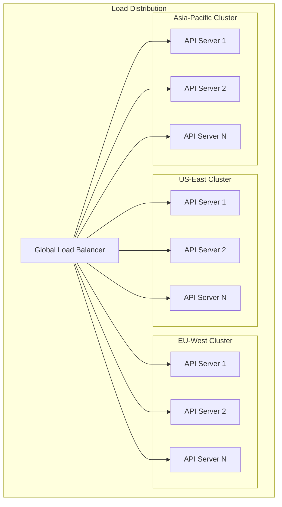

**Scaling Strategies:**
- Geo-distributed data centers
- Auto-scaling based on traffic patterns
- Service mesh for inter-service communication
- Database sharding by user ID

### 4. Caching Strategy

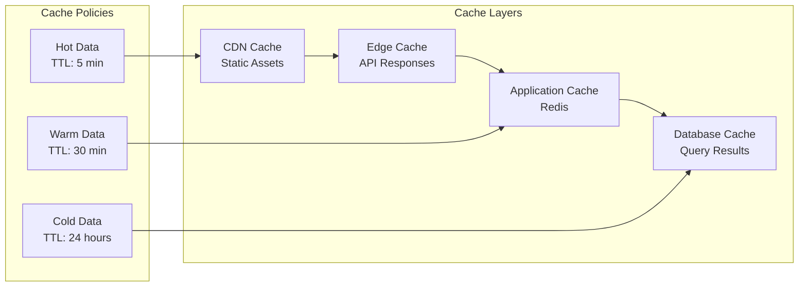

**Cache Hierarchy:**
- **L1**: CDN (static assets, profile images)
- **L2**: Edge cache (API responses)
- **L3**: Redis (timelines, sessions)
- **L4**: Database query cache

## Real-Time Features

### 1. Live Streaming Architecture

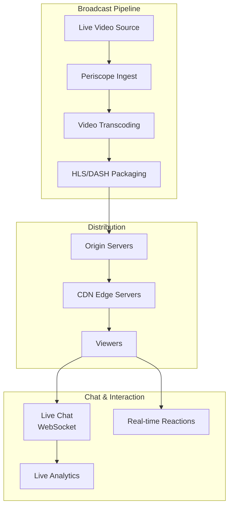

**Live Features:**
- Periscope integration
- Real-time chat
- Live reactions and engagement
- Low-latency streaming (~3-5 seconds)

### 2. Trending Topics

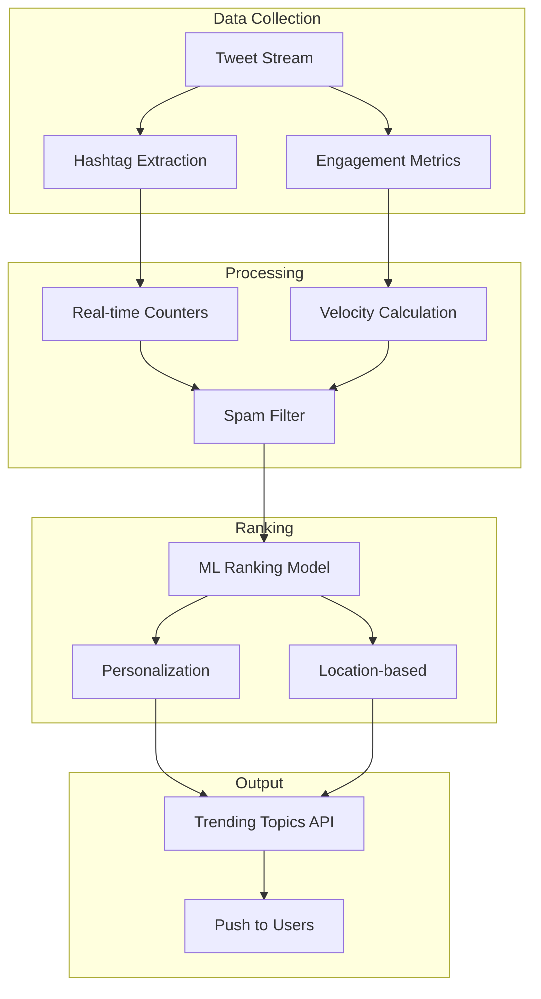

**Trending Algorithm:**
- Real-time tweet velocity tracking
- Engagement-based scoring
- Spam and abuse filtering
- Geographic personalization
- Recency weighting

### 3. Real-Time Recommendations

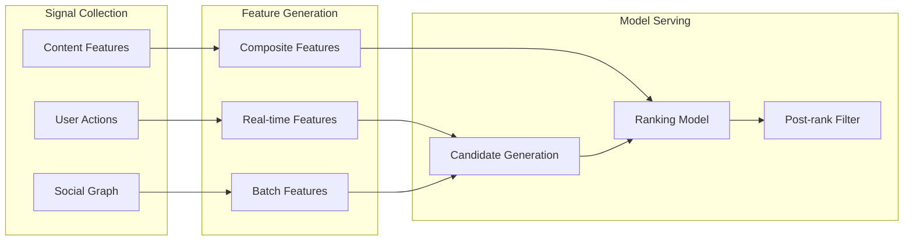

**Recommendation Types:**
- Who to follow suggestions
- Tweet recommendations
- Topic suggestions
- Trending content

## Machine Learning Infrastructure

### 1. ML Pipeline

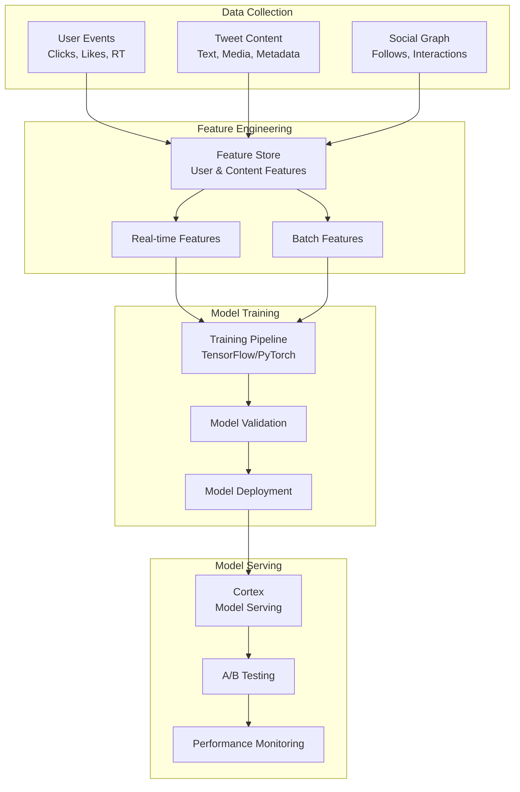

**ML Use Cases:**
- Timeline ranking
- Content recommendations
- Spam detection
- Image/video classification
- Trend prediction
- Ad targeting

### 2. Content Safety & Moderation

```mermaid
graph TD
    subgraph "Detection Pipeline"
        CONTENT[User Content]
        TEXT_ML[Text Classification]
        IMAGE_ML[Image Recognition]
        VIDEO_ML[Video Analysis]
    end
    
    subgraph "Analysis"
        SPAM[Spam Detection]
        ABUSE[Abuse Detection]
        SENSITIVE[Sensitive Content]
        MISINFORMATION[Misinformation]
    end
    
    subgraph "Action"
        AUTO_REMOVE[Auto Remove]
        HUMAN_REVIEW[Human Review Queue]
        LABEL[Content Label]
        RESTRICT[Restrict Reach]
    end
    
    CONTENT --> TEXT_ML
    CONTENT --> IMAGE_ML
    CONTENT --> VIDEO_ML
    
    TEXT_ML --> SPAM
    TEXT_ML --> ABUSE
    IMAGE_ML --> SENSITIVE
    VIDEO_ML --> MISINFORMATION
    
    SPAM --> AUTO_REMOVE
    ABUSE --> HUMAN_REVIEW
    SENSITIVE --> LABEL
    MISINFORMATION --> RESTRICT
```

**Safety Features:**
- Automated spam detection
- Abusive content filtering
- Sensitive media detection
- Misinformation labeling
- Human-in-the-loop review

## Security Architecture

```mermaid
graph TB
    subgraph "Client Security"
        HTTPS[HTTPS/TLS 1.3]
        CERT_PIN[Certificate Pinning]
        OAUTH[OAuth 2.0]
    end
    
    subgraph "API Security"
        RATE_LIMIT[Rate Limiting]
        API_KEY[API Keys]
        TOKEN[JWT Tokens]
        CORS[CORS Policy]
    end
    
    subgraph "Infrastructure Security"
        FIREWALL[WAF & Firewall]
        DDOS_PROTECT[DDoS Protection]
        VPC[Virtual Private Cloud]
        IAM[Identity Management]
    end
    
    subgraph "Data Security"
        ENCRYPTION[Data Encryption<br/>At Rest]
        KEY_MGMT[Key Management]
        AUDIT[Audit Logging]
        BACKUP[Encrypted Backups]
    end
    
    subgraph "Account Security"
        MFA[Multi-Factor Auth]
        PASSWORD[Password Policy]
        SESSION[Session Management]
        DEVICE[Device Verification]
    end
    
    HTTPS --> RATE_LIMIT
    CERT_PIN --> API_KEY
    OAUTH --> TOKEN
    TOKEN --> CORS
    
    RATE_LIMIT --> FIREWALL
    API_KEY --> DDOS_PROTECT
    FIREWALL --> VPC
    DDOS_PROTECT --> IAM
    
    VPC --> ENCRYPTION
    IAM --> KEY_MGMT
    ENCRYPTION --> AUDIT
    KEY_MGMT --> BACKUP
    
    TOKEN --> MFA
    MFA --> PASSWORD
    PASSWORD --> SESSION
    SESSION --> DEVICE
```

### Security Measures:
- **Authentication**: OAuth 2.0, JWT tokens
- **Encryption**: TLS 1.3, AES-256 at rest
- **DDoS Protection**: Multi-layered defense
- **API Security**: Rate limiting, key rotation
- **Account Security**: MFA, login verification

## Monitoring & Observability

```mermaid
graph LR
    subgraph "Data Collection"
        APPS[Applications]
        INFRA[Infrastructure]
        NETWORK[Network]
        SECURITY[Security Events]
    end
    
    subgraph "Aggregation"
        LOG[Log Aggregation<br/>Splunk]
        METRICS[Metrics Collection<br/>Prometheus]
        TRACES[Distributed Tracing<br/>Zipkin]
        ALERTS[Alert Manager]
    end
    
    subgraph "Analysis"
        DASH[Dashboards<br/>Grafana]
        ANOMALY[Anomaly Detection<br/>ML-based]
        FORECASTING[Capacity Planning]
    end
    
    subgraph "Action"
        ONCALL[On-Call Teams]
        AUTO_SCALE[Auto-Remediation]
        INCIDENT[Incident Response]
    end
    
    APPS --> LOG
    INFRA --> METRICS
    NETWORK --> TRACES
    SECURITY --> ALERTS
    
    LOG --> DASH
    METRICS --> ANOMALY
    TRACES --> FORECASTING
    ALERTS --> DASH
    
    DASH --> ONCALL
    ANOMALY --> AUTO_SCALE
    FORECASTING --> INCIDENT
```

### Monitoring Metrics:
- **System Metrics**: CPU, memory, disk, network
- **Application Metrics**: Request latency, error rates
- **Business Metrics**: Tweet volume, user engagement
- **Custom Metrics**: Timeline generation time, fanout latency

### Alerting:
- **Critical Alerts**: Service outages, data loss
- **Warning Alerts**: High latency, resource saturation
- **Anomaly Alerts**: Unusual traffic patterns
- **SLA Monitoring**: 99.9% uptime target

## Infrastructure & DevOps

### 1. Multi-Cloud Architecture

```mermaid
graph TD
    subgraph "Google Cloud Platform"
        GCP_COMPUTE[Compute Engine]
        GCP_STORAGE[Cloud Storage]
        GCP_ML[ML Services]
    end
    
    subgraph "AWS"
        AWS_EC2[EC2 Instances]
        AWS_S3[S3 Storage]
        AWS_RDS[RDS Databases]
    end
    
    subgraph "On-Premise"
        BARE_METAL[Bare Metal Servers]
        PRIVATE_CLOUD[Private Cloud]
    end
    
    subgraph "Edge Locations"
        CDN_EDGE[CDN Edge Servers]
        POP[Points of Presence]
    end
    
    subgraph "Global Load Balancer"
        GLB[Traffic Manager]
    end
    
    GLB --> GCP_COMPUTE
    GLB --> AWS_EC2
    GLB --> BARE_METAL
    GLB --> CDN_EDGE
    
    GCP_COMPUTE --> GCP_STORAGE
    GCP_COMPUTE --> GCP_ML
    AWS_EC2 --> AWS_S3
    AWS_EC2 --> AWS_RDS
    BARE_METAL --> PRIVATE_CLOUD
```

**Infrastructure Strategy:**
- Multi-cloud approach (AWS, GCP)
- Hybrid cloud with on-premise data centers
- Global CDN presence
- Cost optimization across providers

### 2. Deployment Pipeline

```mermaid
flowchart LR
    subgraph "Development"
        CODE[Code Commit<br/>Git]
        BUILD[Build & Test<br/>CI Pipeline]
        ARTIFACT[Container Image<br/>Docker Registry]
    end
    
    subgraph "Staging"
        STAGING_DEPLOY[Deploy to Staging]
        INTEGRATION_TEST[Integration Tests]
        PERF_TEST[Performance Tests]
    end
    
    subgraph "Production"
        CANARY[Canary Deployment<br/>1% Traffic]
        MONITOR[Monitor Metrics]
        GRADUAL[Gradual Rollout<br/>10% → 50% → 100%]
    end
    
    subgraph "Rollback"
        ALERT_TRIGGER[Alert Triggered]
        AUTO_ROLLBACK[Automatic Rollback]
        POSTMORTEM[Post-Mortem]
    end
    
    CODE --> BUILD
    BUILD --> ARTIFACT
    ARTIFACT --> STAGING_DEPLOY
    STAGING_DEPLOY --> INTEGRATION_TEST
    INTEGRATION_TEST --> PERF_TEST
    PERF_TEST --> CANARY
    CANARY --> MONITOR
    MONITOR --> GRADUAL
    MONITOR --> ALERT_TRIGGER
    ALERT_TRIGGER --> AUTO_ROLLBACK
    AUTO_ROLLBACK --> POSTMORTEM
```

**Deployment Strategy:**
- Continuous Integration/Continuous Deployment (CI/CD)
- Canary deployments for risk mitigation
- Blue-green deployments for zero downtime
- Automated rollback on failures
- Feature flags for controlled rollouts

### 3. Infrastructure as Code

```mermaid
graph TD
    subgraph "IaC Tools"
        TERRAFORM[Terraform<br/>Infrastructure Provisioning]
        ANSIBLE[Ansible<br/>Configuration Management]
        K8S[Kubernetes<br/>Container Orchestration]
    end
    
    subgraph "Version Control"
        GIT[Git Repository]
        REVIEW[Code Review]
        APPROVAL[Approval Process]
    end
    
    subgraph "Automation"
        PROVISION[Auto Provision]
        CONFIGURE[Auto Configure]
        SCALE[Auto Scale]
    end
    
    GIT --> REVIEW
    REVIEW --> APPROVAL
    APPROVAL --> TERRAFORM
    APPROVAL --> ANSIBLE
    APPROVAL --> K8S
    
    TERRAFORM --> PROVISION
    ANSIBLE --> CONFIGURE
    K8S --> SCALE
```

**IaC Components:**
- Terraform for cloud resource provisioning
- Ansible for server configuration
- Kubernetes for container orchestration
- GitOps workflow for changes

### 4. Disaster Recovery

```mermaid
flowchart TD
    subgraph "Primary Region (US-East)"
        PRIMARY_API[API Services]
        PRIMARY_DB[(Primary Databases)]
        PRIMARY_CACHE[Cache Layer]
    end
    
    subgraph "Secondary Region (US-West)"
        SECONDARY_API[Standby API Services]
        SECONDARY_DB[(Replica Databases)]
        SECONDARY_CACHE[Standby Cache]
    end
    
    subgraph "Backup Region (EU)"
        BACKUP_API[Backup API Services]
        BACKUP_DB[(Backup Databases)]
        BACKUP_STORAGE[Cold Storage]
    end
    
    subgraph "Failover Process"
        DETECT[Outage Detection<br/>< 1 minute]
        DNS_SWITCH[DNS Failover<br/>< 5 minutes]
        TRAFFIC_ROUTE[Traffic Rerouting<br/>< 10 minutes]
        VALIDATE[Service Validation<br/>< 30 minutes]
    end
    
    PRIMARY_DB -.->|Real-time Replication| SECONDARY_DB
    PRIMARY_DB -.->|Async Backup| BACKUP_DB
    PRIMARY_CACHE -.->|Sync| SECONDARY_CACHE
    
    DETECT --> DNS_SWITCH
    DNS_SWITCH --> TRAFFIC_ROUTE
    TRAFFIC_ROUTE --> SECONDARY_API
    TRAFFIC_ROUTE --> VALIDATE
```

**DR Metrics:**
- **RTO** (Recovery Time Objective): < 1 hour
- **RPO** (Recovery Point Objective): < 5 minutes
- **Data Backup**: Multiple geographic locations
- **Automated Failover**: Cross-region redundancy

## Performance Optimization

### 1. Timeline Generation Performance

```mermaid
graph LR
    subgraph "Optimization Techniques"
        PREFETCH[Prefetch Following<br/>Users' Tweets]
        PARALLEL[Parallel Fetch<br/>Multiple Sources]
        CACHE[Aggressive Caching<br/>Redis + CDN]
        LAZY[Lazy Load<br/>Media Content]
    end
    
    subgraph "Performance Targets"
        P50[P50: < 100ms]
        P95[P95: < 300ms]
        P99[P99: < 1000ms]
    end
    
    PREFETCH --> P50
    PARALLEL --> P95
    CACHE --> P50
    LAZY --> P99
```

**Performance Techniques:**
- Predictive prefetching based on user behavior
- Parallel data fetching from multiple sources
- Edge caching for frequently accessed timelines
- Progressive rendering for faster perceived load time

### 2. Media Optimization

```mermaid
flowchart TD
    subgraph "Upload Pipeline"
        UPLOAD[User Upload]
        VALIDATE[Validation & Virus Scan]
        COMPRESS[Compression]
    end
    
    subgraph "Processing"
        RESIZE[Multi-Size Generation<br/>Thumb, Medium, Large]
        FORMAT[Format Conversion<br/>WebP, JPEG, PNG]
        CDN_PUSH[Push to CDN]
    end
    
    subgraph "Delivery"
        DETECT[Device Detection]
        ADAPT[Adaptive Format]
        SERVE[Serve Optimized Image]
    end
    
    UPLOAD --> VALIDATE
    VALIDATE --> COMPRESS
    COMPRESS --> RESIZE
    RESIZE --> FORMAT
    FORMAT --> CDN_PUSH
    CDN_PUSH --> DETECT
    DETECT --> ADAPT
    ADAPT --> SERVE
```

**Media Features:**
- Automatic image compression (up to 85% size reduction)
- Multiple format support (WebP, AVIF, JPEG)
- Responsive images based on device
- Video transcoding for multiple bitrates
- Lazy loading for off-screen media

### 3. Database Query Optimization

```mermaid
graph TD
    subgraph "Query Strategies"
        INDEX[Strategic Indexing]
        DENORM[Denormalization]
        MATERIALIZE[Materialized Views]
        PARTITION[Table Partitioning]
    end
    
    subgraph "Caching"
        QUERY_CACHE[Query Result Cache]
        PREPARED[Prepared Statements]
        CONNECTION_POOL[Connection Pooling]
    end
    
    subgraph "Monitoring"
        SLOW_LOG[Slow Query Log]
        EXPLAIN[Query Analysis]
        OPTIMIZE[Query Optimization]
    end
    
    INDEX --> QUERY_CACHE
    DENORM --> PREPARED
    MATERIALIZE --> CONNECTION_POOL
    
    QUERY_CACHE --> SLOW_LOG
    PREPARED --> EXPLAIN
    CONNECTION_POOL --> OPTIMIZE
```

**Optimization Strategies:**
- Strategic indexing on high-traffic queries
- Denormalization for read-heavy operations
- Connection pooling to reduce overhead
- Query result caching with TTL
- Database sharding for horizontal scaling

## Content Delivery

### 1. CDN Architecture

```mermaid
graph TD
    subgraph "Origin Servers"
        ORIGIN[Origin Storage<br/>S3/GCS]
    end
    
    subgraph "CDN Edge Network"
        EDGE_US_E[US East Edge]
        EDGE_US_W[US West Edge]
        EDGE_EU[Europe Edge]
        EDGE_ASIA[Asia Edge]
        EDGE_LATAM[Latin America Edge]
    end
    
    subgraph "Content Types"
        STATIC[Static Assets<br/>JS, CSS, Fonts]
        IMAGES[Profile Images<br/>Thumbnails]
        MEDIA[Videos & GIFs]
        AVATARS[User Avatars]
    end
    
    ORIGIN --> EDGE_US_E
    ORIGIN --> EDGE_US_W
    ORIGIN --> EDGE_EU
    ORIGIN --> EDGE_ASIA
    ORIGIN --> EDGE_LATAM
    
    STATIC --> EDGE_US_E
    IMAGES --> EDGE_US_W
    MEDIA --> EDGE_EU
    AVATARS --> EDGE_ASIA
```

**CDN Features:**
- Global edge network (100+ locations)
- Smart routing based on geography
- Cache hit ratio > 95%
- Image optimization and transformation
- Video streaming with adaptive bitrate

### 2. Asset Pipeline

```mermaid
flowchart LR
    subgraph "Development"
        SOURCE[Source Assets]
        MINIFY[Minification]
        BUNDLE[Bundling]
    end
    
    subgraph "Optimization"
        COMPRESS[Compression<br/>Gzip, Brotli]
        HASH[Content Hashing]
        SPRITE[Image Sprites]
    end
    
    subgraph "Distribution"
        UPLOAD[Upload to CDN]
        INVALIDATE[Cache Invalidation]
        MONITOR[Performance Monitor]
    end
    
    SOURCE --> MINIFY
    MINIFY --> BUNDLE
    BUNDLE --> COMPRESS
    COMPRESS --> HASH
    HASH --> SPRITE
    SPRITE --> UPLOAD
    UPLOAD --> INVALIDATE
    INVALIDATE --> MONITOR
```

**Asset Optimization:**
- JavaScript/CSS minification
- Module bundling and code splitting
- Brotli compression for text assets
- Image sprites for icons
- Content hashing for cache busting

## Analytics & Business Intelligence

### 1. Analytics Pipeline

```mermaid
flowchart TD
    subgraph "Data Sources"
        CLIENT_EVENTS[Client Events<br/>Clicks, Scrolls, Views]
        SERVER_EVENTS[Server Events<br/>API Calls, Errors]
        BUSINESS_EVENTS[Business Events<br/>Tweets, Follows, Likes]
    end
    
    subgraph "Collection"
        KAFKA_STREAM[Kafka Streams]
        BATCH_IMPORT[Batch Import]
    end
    
    subgraph "Processing"
        REAL_TIME[Real-time Processing<br/>Apache Flink]
        BATCH_PROCESS[Batch Processing<br/>Apache Spark]
        ETL[ETL Pipeline]
    end
    
    subgraph "Storage"
        DATA_WAREHOUSE[Data Warehouse<br/>Snowflake/BigQuery]
        DATA_LAKE[Data Lake<br/>HDFS/S3]
    end
    
    subgraph "Visualization"
        DASHBOARDS[Business Dashboards]
        REPORTS[Analytics Reports]
        ML_FEATURES[ML Feature Store]
    end
    
    CLIENT_EVENTS --> KAFKA_STREAM
    SERVER_EVENTS --> KAFKA_STREAM
    BUSINESS_EVENTS --> BATCH_IMPORT
    
    KAFKA_STREAM --> REAL_TIME
    BATCH_IMPORT --> BATCH_PROCESS
    REAL_TIME --> ETL
    BATCH_PROCESS --> ETL
    
    ETL --> DATA_WAREHOUSE
    ETL --> DATA_LAKE
    
    DATA_WAREHOUSE --> DASHBOARDS
    DATA_WAREHOUSE --> REPORTS
    DATA_LAKE --> ML_FEATURES
```

**Analytics Use Cases:**
- User engagement metrics
- Tweet performance analytics
- Revenue and business metrics
- A/B testing analysis
- Fraud detection

### 2. Key Performance Indicators

```mermaid
graph TD
    subgraph "User Metrics"
        DAU[Daily Active Users]
        MAU[Monthly Active Users]
        RETENTION[User Retention Rate]
        ENGAGEMENT[Engagement Rate]
    end
    
    subgraph "Content Metrics"
        TWEETS_DAY[Tweets per Day]
        RETWEET_RATE[Retweet Rate]
        REPLY_RATE[Reply Rate]
        LIKE_RATE[Like Rate]
    end
    
    subgraph "Technical Metrics"
        LATENCY[API Latency P95]
        AVAILABILITY[System Availability]
        ERROR_RATE[Error Rate]
        THROUGHPUT[Requests/Second]
    end
    
    subgraph "Business Metrics"
        REVENUE[Ad Revenue]
        ARPU[Avg Revenue Per User]
        GROWTH[User Growth Rate]
        CHURN[Churn Rate]
    end
```

**Target Metrics:**
- **DAU**: 250+ million daily active users
- **Tweets/Day**: 500+ million tweets
- **API Latency**: P95 < 200ms
- **Availability**: 99.9% uptime SLA

## Mobile Architecture

### 1. Mobile App Architecture

```mermaid
graph TD
    subgraph "Client Layer"
        IOS_APP[iOS App<br/>Swift]
        ANDROID_APP[Android App<br/>Kotlin]
    end
    
    subgraph "Networking"
        REST[REST API Client]
        WEBSOCKET[WebSocket Client]
        GRAPHQL[GraphQL Client]
    end
    
    subgraph "Local Storage"
        CORE_DATA[CoreData/Room]
        CACHE[Local Cache]
        MEDIA_CACHE[Media Cache]
    end
    
    subgraph "Features"
        TIMELINE[Timeline View]
        COMPOSE[Tweet Composer]
        NOTIFICATIONS[Push Notifications]
        DM[Direct Messages]
    end
    
    IOS_APP --> REST
    ANDROID_APP --> REST
    IOS_APP --> WEBSOCKET
    ANDROID_APP --> GRAPHQL
    
    REST --> CORE_DATA
    WEBSOCKET --> CACHE
    GRAPHQL --> MEDIA_CACHE
    
    CORE_DATA --> TIMELINE
    CACHE --> COMPOSE
    MEDIA_CACHE --> NOTIFICATIONS
    CORE_DATA --> DM
```

**Mobile Features:**
- Offline timeline caching
- Background tweet synchronization
- Image/video compression before upload
- Progressive image loading
- Battery and data optimization

### 2. Push Notification System

```mermaid
flowchart LR
    subgraph "Event Triggers"
        MENTION[New Mention]
        DM_NOTIF[New DM]
        FOLLOWER[New Follower]
        LIKE_NOTIF[Tweet Liked]
    end
    
    subgraph "Processing"
        AGGREGATOR[Notification Aggregator]
        PERSONALIZE[Personalization Engine]
        PRIORITY[Priority Ranking]
    end
    
    subgraph "Delivery"
        APNS[Apple Push<br/>Notification Service]
        FCM[Firebase Cloud<br/>Messaging]
        WEB_PUSH[Web Push API]
    end
    
    subgraph "Client"
        IOS[iOS Device]
        ANDROID[Android Device]
        WEB[Web Browser]
    end
    
    MENTION --> AGGREGATOR
    DM_NOTIF --> AGGREGATOR
    FOLLOWER --> AGGREGATOR
    LIKE_NOTIF --> AGGREGATOR
    
    AGGREGATOR --> PERSONALIZE
    PERSONALIZE --> PRIORITY
    
    PRIORITY --> APNS
    PRIORITY --> FCM
    PRIORITY --> WEB_PUSH
    
    APNS --> IOS
    FCM --> ANDROID
    WEB_PUSH --> WEB
```

**Notification Strategy:**
- Intelligent notification batching
- User preference-based filtering
- Quiet hours and do-not-disturb
- Rich notifications with media
- Deep linking to relevant content

## Cost Optimization

```mermaid
pie title Twitter Infrastructure Cost Distribution
    "Compute (Servers)" : 35
    "Storage" : 20
    "Network/Bandwidth" : 25
    "Data Processing" : 10
    "Security & Monitoring" : 10
```

### Optimization Strategies

```mermaid
graph TD
    subgraph "Compute Optimization"
        RIGHT_SIZE[Right-sizing Instances]
        SPOT[Spot/Preemptible Instances]
        AUTO_SCALE[Autoscaling Policies]
    end
    
    subgraph "Storage Optimization"
        LIFECYCLE[Data Lifecycle Policies]
        COMPRESSION[Data Compression]
        TIERING[Storage Tiering]
    end
    
    subgraph "Network Optimization"
        CDN_CACHE[CDN Caching]
        COMPRESSION_NET[Content Compression]
        SMART_ROUTING[Smart Routing]
    end
    
    subgraph "Monitoring"
        COST_TRACK[Cost Tracking]
        BUDGET_ALERT[Budget Alerts]
        OPTIMIZATION[Continuous Optimization]
    end
    
    RIGHT_SIZE --> COST_TRACK
    SPOT --> COST_TRACK
    AUTO_SCALE --> BUDGET_ALERT
    
    LIFECYCLE --> COST_TRACK
    COMPRESSION --> BUDGET_ALERT
    TIERING --> OPTIMIZATION
    
    CDN_CACHE --> COST_TRACK
    COMPRESSION_NET --> BUDGET_ALERT
    SMART_ROUTING --> OPTIMIZATION
```

**Cost Reduction Tactics:**
- Reserved instances for stable workloads (30-50% savings)
- Spot instances for batch processing (up to 90% savings)
- Aggressive caching to reduce compute load
- Data compression and deduplication
- Multi-cloud strategy for competitive pricing

## API Architecture

### 1. REST API

```mermaid
graph TD
    subgraph "API Versions"
        V1[API v1.1<br/>Legacy]
        V2[API v2<br/>Current]
    end
    
    subgraph "Endpoints"
        TWEETS_EP["/tweets"]
        USERS_EP["/users"]
        TIMELINE_EP["/timeline"]
        SEARCH_EP["/search"]
    end
    
    subgraph "Features"
        PAGINATION[Cursor Pagination]
        FILTERING[Field Filtering]
        EXPANSION[Object Expansion]
        RATE[Rate Limiting]
    end
    
    V1 --> TWEETS_EP
    V2 --> USERS_EP
    V2 --> TIMELINE_EP
    V2 --> SEARCH_EP
    
    TWEETS_EP --> PAGINATION
    USERS_EP --> FILTERING
    TIMELINE_EP --> EXPANSION
    SEARCH_EP --> RATE
```

**API Features:**
- RESTful design principles
- OAuth 2.0 authentication
- Rate limiting (per endpoint, per user)
- Webhook support for real-time updates
- Comprehensive error handling

### 2. GraphQL API

```mermaid
graph LR
    subgraph "Client Request"
        QUERY[GraphQL Query]
        VARIABLES[Query Variables]
    end
    
    subgraph "GraphQL Server"
        PARSE[Query Parser]
        VALIDATE[Validation]
        RESOLVE[Resolver Functions]
    end
    
    subgraph "Data Sources"
        TWEET_SERVICE[Tweet Service]
        USER_SERVICE[User Service]
        MEDIA_SERVICE[Media Service]
    end
    
    subgraph "Response"
        SHAPE[Response Shaping]
        CACHE_RESP[Response Caching]
        RETURN[JSON Response]
    end
    
    QUERY --> PARSE
    VARIABLES --> PARSE
    PARSE --> VALIDATE
    VALIDATE --> RESOLVE
    
    RESOLVE --> TWEET_SERVICE
    RESOLVE --> USER_SERVICE
    RESOLVE --> MEDIA_SERVICE
    
    TWEET_SERVICE --> SHAPE
    USER_SERVICE --> SHAPE
    MEDIA_SERVICE --> SHAPE
    SHAPE --> CACHE_RESP
    CACHE_RESP --> RETURN
```

**GraphQL Benefits:**
- Flexible data fetching (request only needed fields)
- Single request for multiple resources
- Strong typing and schema validation
- Efficient for mobile clients (reduced bandwidth)

## Ads Platform Architecture

```mermaid
graph TD
    subgraph "Ad Creation"
        ADVERTISER[Advertisers]
        CAMPAIGN[Campaign Setup]
        CREATIVE[Ad Creative]
        TARGET[Targeting Rules]
    end
    
    subgraph "Ad Serving"
        REQUEST[Ad Request]
        AUCTION[Real-time Auction]
        RANK[Ad Ranking]
        SELECT[Ad Selection]
    end
    
    subgraph "Delivery"
        INJECT[Timeline Injection]
        TRACK[Impression Tracking]
        CLICK[Click Tracking]
        CONVERSION[Conversion Tracking]
    end
    
    subgraph "Optimization"
        PERFORMANCE[Performance Analysis]
        BID_OPTIMIZE[Bid Optimization]
        TARGET_OPT[Target Optimization]
        REPORT[Reporting Dashboard]
    end
    
    ADVERTISER --> CAMPAIGN
    CAMPAIGN --> CREATIVE
    CREATIVE --> TARGET
    
    TARGET --> REQUEST
    REQUEST --> AUCTION
    AUCTION --> RANK
    RANK --> SELECT
    
    SELECT --> INJECT
    INJECT --> TRACK
    TRACK --> CLICK
    CLICK --> CONVERSION
    
    CONVERSION --> PERFORMANCE
    PERFORMANCE --> BID_OPTIMIZE
    BID_OPTIMIZE --> TARGET_OPT
    TARGET_OPT --> REPORT
```

**Ad Features:**
- Promoted tweets
- Promoted accounts
- Promoted trends
- Real-time bidding (RTB)
- Sophisticated targeting (demographics, interests, behaviors)
- Performance analytics and reporting

## Future Architecture Evolution

### Emerging Technologies

```mermaid
graph TD
    subgraph "AI/ML Enhancements"
        GPT[Large Language Models<br/>Content Moderation]
        RECOMMEND_AI[Advanced Recommendations<br/>Deep Learning]
        VISION[Computer Vision<br/>Image Understanding]
    end
    
    subgraph "Infrastructure"
        EDGE_COMPUTE[Edge Computing<br/>Reduced Latency]
        SERVERLESS[Serverless Architecture<br/>Cost Optimization]
        QUANTUM[Quantum Computing<br/>Complex Algorithms]
    end
    
    subgraph "Features"
        LONG_FORM[Long-form Content<br/>Articles, Newsletters]
        AUDIO_SPACES[Enhanced Spaces<br/>Live Audio]
        VIDEO[Short-form Video<br/>TikTok-style]
        COMMERCE[Social Commerce<br/>In-app Shopping]
    end
    
    subgraph "Privacy & Security"
        ZERO_KNOWLEDGE[Zero-knowledge Proofs]
        DECENTRALIZED[Decentralized Identity]
        ENCRYPTED[End-to-end Encryption]
    end
```

### Scalability Roadmap

- **User Growth**: Support 1 billion+ users
- **Real-time Processing**: Sub-second global propagation
- **AI Integration**: Smarter recommendations and moderation
- **New Content Types**: Audio, long-form, video
- **Global Expansion**: Low-latency access worldwide

## Conclusion

Twitter/X's architecture demonstrates expertise in building ultra-scalable, real-time social networking platforms. The combination of intelligent caching, efficient fanout mechanisms, robust data storage, and advanced machine learning enables Twitter to handle billions of interactions daily while maintaining sub-second response times.

Key architectural principles:
- **Real-time First**: Optimized for immediate content distribution
- **Horizontal Scalability**: Services scale independently
- **Data Locality**: Cache and store data near users
- **Fault Tolerance**: Graceful degradation and quick recovery
- **Continuous Evolution**: Adapting to new technologies and user needs

The platform continues to evolve, incorporating new features and optimizations to meet growing demands while maintaining the speed and reliability users expect from a real-time social network.

> This architecture represents Twitter/X's known systems and best practices. Actual implementation details may vary as the platform continues to evolve.