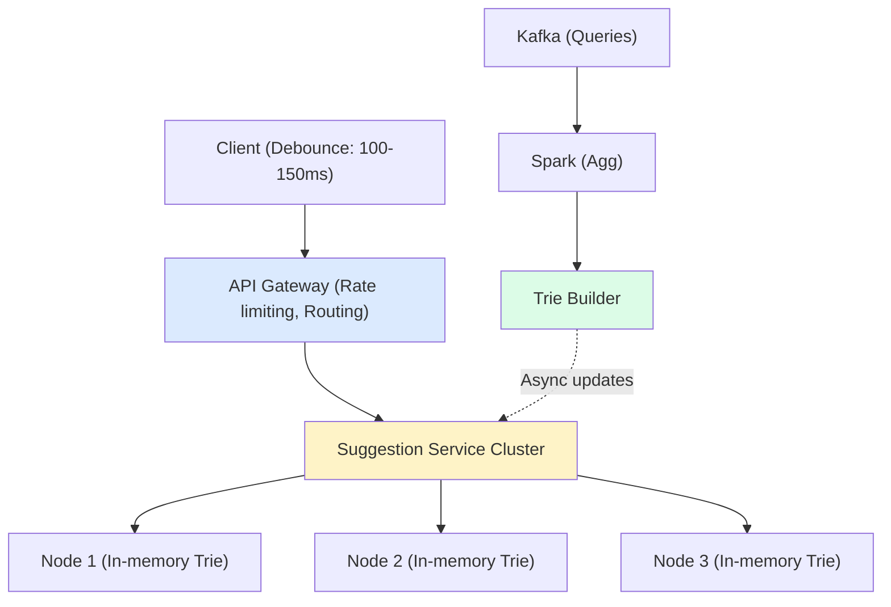
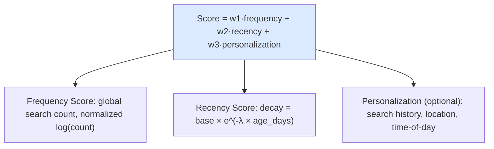
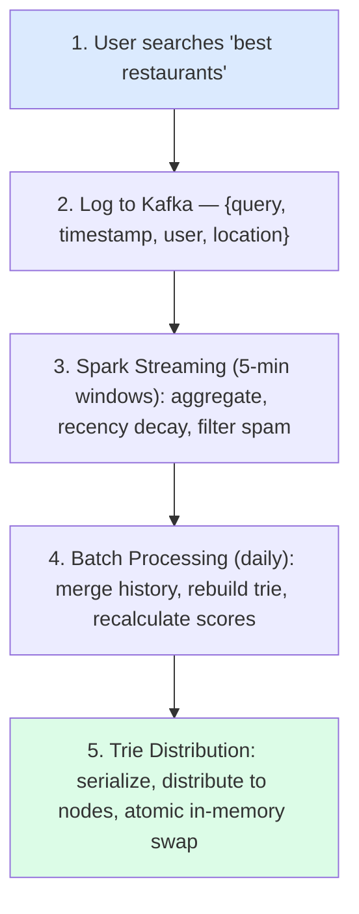
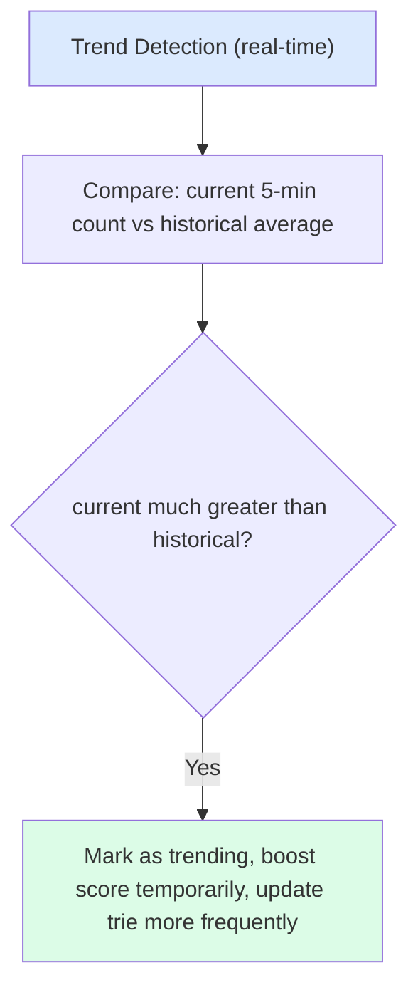
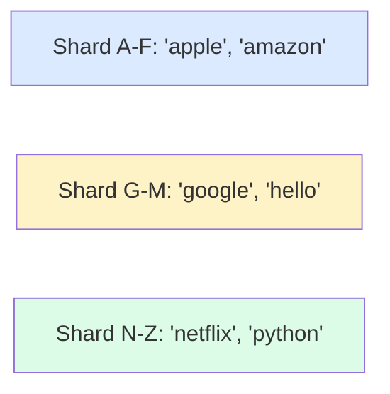
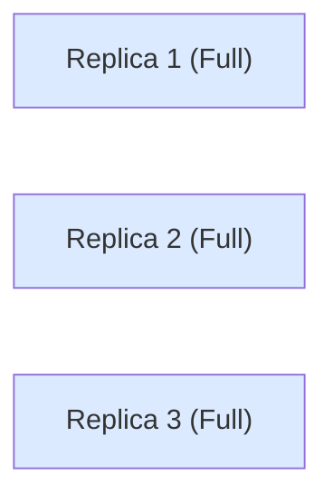
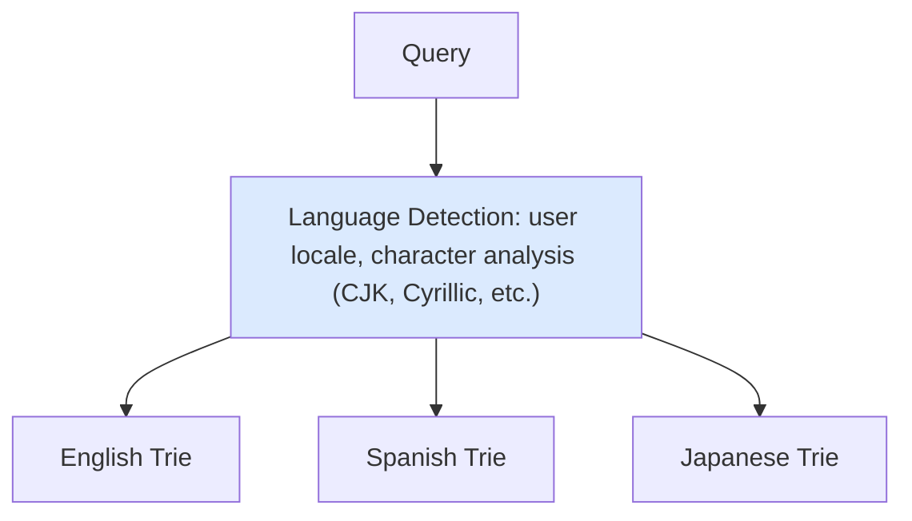
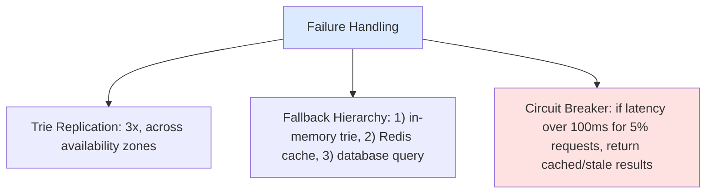

## Problem Statement

Design a typeahead/autocomplete system that suggests search queries as users type.

---

## Requirements

### Functional Requirements
- Return top N suggestions for prefix
- Suggestions based on popularity/relevance
- Support personalization (optional)
- Handle multiple languages

### Non-Functional Requirements
- Ultra-low latency: under 100ms
- High availability
- Handle 100K+ QPS
- Update suggestions based on trends

---

## Capacity Estimation

```
Assumptions:
- 5 billion searches/day
- Average 4 characters typed per search
- 20 billion typeahead requests/day
- Top 10 suggestions per request

Traffic:
- 20B / 86400 ≈ 230K QPS (average)
- Peak: 500K QPS

Storage:
- 1 billion unique search terms
- Average term: 20 characters = 20 bytes
- Metadata: 30 bytes
- Total: 1B × 50 bytes = 50 GB
```

---

## High-Level Architecture



---

## Trie Data Structure

### Basic Trie

```
Search terms: ["cat", "car", "card", "care", "dog"]

           (root)
           /    \
          c      d
          |      |
          a      o
         /|\     |
        t r e    g
          |
          d

Node structure:
{
  children: Map<char, Node>,
  isWord: boolean,
  suggestions: ["car", "card", "care"]  // Top N cached
}
```

### Optimized Trie with Caching

```
┌─────────────────────────────────────────────────────────┐
│                    Trie Node                             │
├─────────────────────────────────────────────────────────┤
│  char: 'c'                                              │
│  children: { 'a': Node, 'o': Node }                     │
│  isEndOfWord: false                                     │
│  topSuggestions: [                                      │
│    { term: "car", score: 10000 },                       │
│    { term: "cat", score: 8000 },                        │
│    { term: "camera", score: 5000 },                     │
│    ...                                                   │
│  ]                                                       │
└─────────────────────────────────────────────────────────┘

Pre-computed top suggestions at each node!
Query time: O(prefix length) instead of O(all descendants)
```

---

## Scoring & Ranking

`Score = w1 × frequency + w2 × recency + w3 × personalization`



---

## API Design

### Get Suggestions

```
GET /api/v1/suggestions?q=car&limit=10

Response:
{
  "suggestions": [
    { "text": "car insurance", "score": 0.95 },
    { "text": "car rental", "score": 0.90 },
    { "text": "car dealership", "score": 0.85 },
    { "text": "cartoon", "score": 0.80 },
    { "text": "carpet cleaning", "score": 0.75 }
  ],
  "query_time_ms": 5
}
```

---

## Client-Side Optimization

```javascript
// Debouncing - Don't send request for every keystroke
let debounceTimer;

function onInputChange(input) {
  clearTimeout(debounceTimer);
  debounceTimer = setTimeout(() => {
    fetchSuggestions(input);
  }, 150);  // Wait 150ms after last keystroke
}

// Client-side caching
const suggestionCache = new LRUCache(1000);

async function fetchSuggestions(prefix) {
  // Check cache first
  if (suggestionCache.has(prefix)) {
    return suggestionCache.get(prefix);
  }

  const suggestions = await api.getSuggestions(prefix);
  suggestionCache.set(prefix, suggestions);
  return suggestions;
}

// Prefetch next characters
function prefetchNext(prefix) {
  const likely = ['a', 'e', 'i', 'o', ' '];
  likely.forEach(char => {
    fetchSuggestions(prefix + char);
  });
}
```

---

## Data Collection Pipeline



### Trend Detection



---

## Trie Sharding

Strategy 1: Shard by First Character



Strategy 2: Shard by Hash (all replicas have full trie)



- Load balance across replicas
- 50 GB fits in memory on modern servers

---

## Handling Multi-Language



---

## Fault Tolerance



---

## Interview Tips

- Explain trie structure and why it's optimal
- Discuss pre-computed top suggestions per node
- Cover scoring: frequency + recency + personalization
- Mention client-side optimizations (debounce, cache)
- Discuss real-time updates for trending topics
- Cover sharding strategies for scale
