## High-Level Architecture

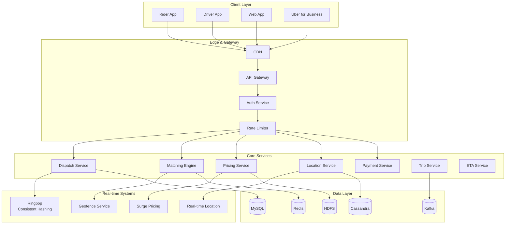
```mermaid
graph TB
    subgraph "Client Layer"
        RIDER_APP[Rider App]
        DRIVER_APP[Driver App]
        WEB[Web App]
        ENTERPRISE[Uber for Business]
    end

    subgraph "Edge & Gateway"
        CDN[CDN]
        API_GATEWAY[API Gateway]
        AUTH[Auth Service]
        RATE_LIMIT[Rate Limiter]
    end

    subgraph "Core Services"
        DISPATCH[Dispatch Service]
        MATCHING[Matching Engine]
        PRICING[Pricing Service]
        LOCATION[Location Service]
        PAYMENT[Payment Service]
        TRIP[Trip Service]
        ETA[ETA Service]
    end

    subgraph "Real-time Systems"
        RINGPOP[Ringpop<br/>Consistent Hashing]
        GEOFENCE[Geofence Service]
        SURGE[Surge Pricing]
        REALTIME_LOC[Real-time Location]
    end

    subgraph "Data Layer"
        MYSQL[(MySQL)]
        CASSANDRA[(Cassandra)]
        REDIS[(Redis)]
        KAFKA[(Kafka)]
        HDFS[(HDFS)]
    end

    RIDER_APP --> CDN
    DRIVER_APP --> CDN
    WEB --> CDN
    ENTERPRISE --> CDN

    CDN --> API_GATEWAY
    API_GATEWAY --> AUTH
    AUTH --> RATE_LIMIT

    RATE_LIMIT --> DISPATCH
    RATE_LIMIT --> MATCHING
    RATE_LIMIT --> PRICING
    RATE_LIMIT --> LOCATION
    RATE_LIMIT --> PAYMENT

    DISPATCH --> RINGPOP
    MATCHING --> GEOFENCE
    PRICING --> SURGE
    LOCATION --> REALTIME_LOC

    DISPATCH --> MYSQL
    MATCHING --> REDIS
    LOCATION --> CASSANDRA
    TRIP --> KAFKA
    PRICING --> HDFS
```

## Core Components

### 1. Dispatch System

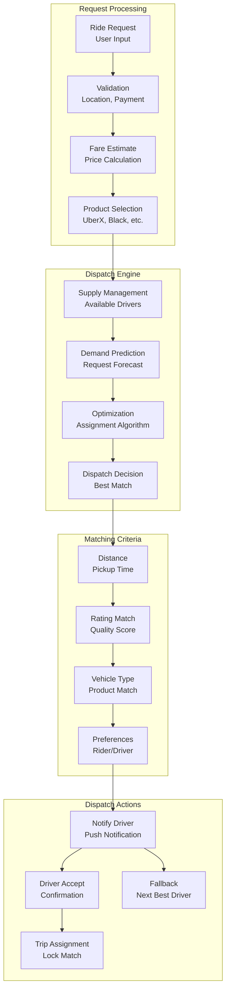
```mermaid
graph TD
    subgraph "Request Processing"
        RIDE_REQ[Ride Request<br/>User Input]
        VALIDATE[Validation<br/>Location, Payment]
        FARE_EST[Fare Estimate<br/>Price Calculation]
        PRODUCT[Product Selection<br/>UberX, Black, etc.]
    end

    subgraph "Dispatch Engine"
        SUPPLY[Supply Management<br/>Available Drivers]
        DEMAND[Demand Prediction<br/>Request Forecast]
        OPTIMIZE[Optimization<br/>Assignment Algorithm]
        DISPATCH_DECIDE[Dispatch Decision<br/>Best Match]
    end

    subgraph "Matching Criteria"
        DISTANCE[Distance<br/>Pickup Time]
        RATING[Rating Match<br/>Quality Score]
        VEHICLE[Vehicle Type<br/>Product Match]
        PREFERENCES[Preferences<br/>Rider/Driver]
    end

    subgraph "Dispatch Actions"
        NOTIFY_DRIVER[Notify Driver<br/>Push Notification]
        DRIVER_ACCEPT[Driver Accept<br/>Confirmation]
        ASSIGN[Trip Assignment<br/>Lock Match]
        FALLBACK[Fallback<br/>Next Best Driver]
    end

    RIDE_REQ --> VALIDATE
    VALIDATE --> FARE_EST
    FARE_EST --> PRODUCT

    PRODUCT --> SUPPLY
    SUPPLY --> DEMAND
    DEMAND --> OPTIMIZE
    OPTIMIZE --> DISPATCH_DECIDE

    DISPATCH_DECIDE --> DISTANCE
    DISTANCE --> RATING
    RATING --> VEHICLE
    VEHICLE --> PREFERENCES

    PREFERENCES --> NOTIFY_DRIVER
    NOTIFY_DRIVER --> DRIVER_ACCEPT
    DRIVER_ACCEPT --> ASSIGN
    NOTIFY_DRIVER --> FALLBACK
```

**Dispatch Features:**
- Real-time driver availability
- Multi-factor matching algorithm
- Batched dispatch for efficiency
- Fallback and retry mechanisms
- Technologies: Golang, Ringpop, Redis

### 2. Location Service (H3 & Geospatial)

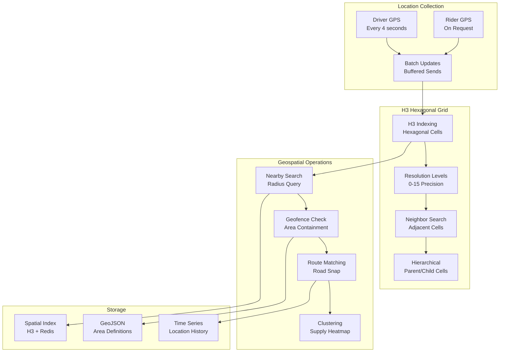
```mermaid
graph TD
    subgraph "Location Collection"
        DRIVER_GPS[Driver GPS<br/>Every 4 seconds]
        RIDER_GPS[Rider GPS<br/>On Request]
        BATCH_LOC[Batch Updates<br/>Buffered Sends]
    end

    subgraph "H3 Hexagonal Grid"
        H3_INDEX[H3 Indexing<br/>Hexagonal Cells]
        RESOLUTION[Resolution Levels<br/>0-15 Precision]
        NEIGHBOR[Neighbor Search<br/>Adjacent Cells]
        HIERARCHY[Hierarchical<br/>Parent/Child Cells]
    end

    subgraph "Geospatial Operations"
        NEARBY[Nearby Search<br/>Radius Query]
        GEOFENCE_OP[Geofence Check<br/>Area Containment]
        ROUTE[Route Matching<br/>Road Snap]
        CLUSTER[Clustering<br/>Supply Heatmap]
    end

    subgraph "Storage"
        SPATIAL_INDEX[Spatial Index<br/>H3 + Redis]
        TIME_SERIES[Time Series<br/>Location History]
        GEOJSON[GeoJSON<br/>Area Definitions]
    end

    DRIVER_GPS --> BATCH_LOC
    RIDER_GPS --> BATCH_LOC
    BATCH_LOC --> H3_INDEX

    H3_INDEX --> RESOLUTION
    RESOLUTION --> NEIGHBOR
    NEIGHBOR --> HIERARCHY

    H3_INDEX --> NEARBY
    NEARBY --> GEOFENCE_OP
    GEOFENCE_OP --> ROUTE
    ROUTE --> CLUSTER

    NEARBY --> SPATIAL_INDEX
    ROUTE --> TIME_SERIES
    GEOFENCE_OP --> GEOJSON
```

**H3 Indexing Benefits:**
- Efficient neighbor lookups
- Hierarchical aggregation
- Uniform cell shapes
- Fast geospatial queries
- Edge case handling at boundaries

### 3. Pricing Engine (Surge Pricing)

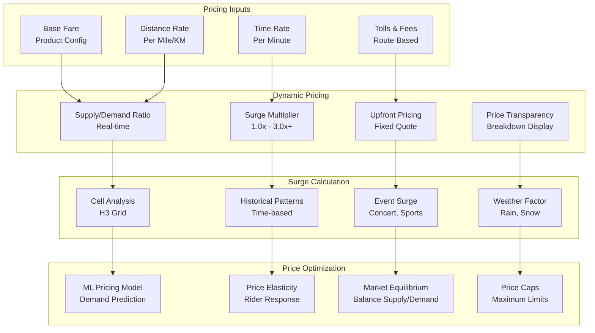
```mermaid
graph TD
    subgraph "Pricing Inputs"
        BASE_FARE[Base Fare<br/>Product Config]
        DISTANCE_FARE[Distance Rate<br/>Per Mile/KM]
        TIME_FARE[Time Rate<br/>Per Minute]
        TOLLS[Tolls & Fees<br/>Route Based]
    end

    subgraph "Dynamic Pricing"
        SUPPLY_DEMAND[Supply/Demand Ratio<br/>Real-time]
        SURGE_MULT[Surge Multiplier<br/>1.0x - 3.0x+]
        UPFRONT[Upfront Pricing<br/>Fixed Quote]
        TRANSPARENCY[Price Transparency<br/>Breakdown Display]
    end

    subgraph "Surge Calculation"
        CELL_ANALYSIS[Cell Analysis<br/>H3 Grid]
        HISTORICAL[Historical Patterns<br/>Time-based]
        EVENT_SURGE[Event Surge<br/>Concert, Sports]
        WEATHER[Weather Factor<br/>Rain, Snow]
    end

    subgraph "Price Optimization"
        ML_PRICING[ML Pricing Model<br/>Demand Prediction]
        ELASTICITY[Price Elasticity<br/>Rider Response]
        EQUILIBRIUM[Market Equilibrium<br/>Balance Supply/Demand]
        CAP[Price Caps<br/>Maximum Limits]
    end

    BASE_FARE --> SUPPLY_DEMAND
    DISTANCE_FARE --> SUPPLY_DEMAND
    TIME_FARE --> SURGE_MULT
    TOLLS --> UPFRONT

    SUPPLY_DEMAND --> CELL_ANALYSIS
    SURGE_MULT --> HISTORICAL
    UPFRONT --> EVENT_SURGE
    TRANSPARENCY --> WEATHER

    CELL_ANALYSIS --> ML_PRICING
    HISTORICAL --> ELASTICITY
    EVENT_SURGE --> EQUILIBRIUM
    WEATHER --> CAP
```

**Surge Pricing Algorithm:**
- Real-time supply/demand analysis per H3 cell
- Historical pattern recognition
- Event-based surge triggers
- Price elasticity modeling
- Regulatory compliance caps

### 4. ETA Prediction Service

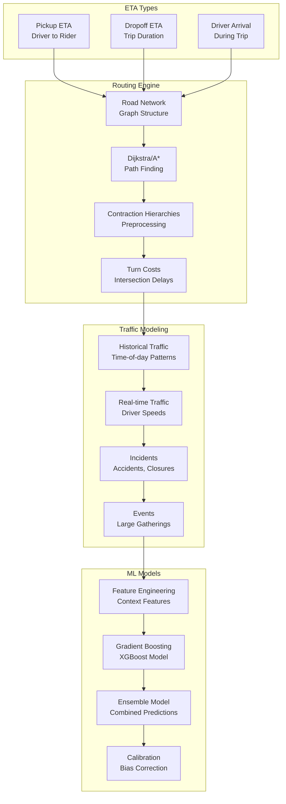
```mermaid
graph TD
    subgraph "ETA Types"
        PICKUP_ETA[Pickup ETA<br/>Driver to Rider]
        DROPOFF_ETA[Dropoff ETA<br/>Trip Duration]
        ARRIVAL_ETA[Driver Arrival<br/>During Trip]
    end

    subgraph "Routing Engine"
        ROAD_NETWORK[Road Network<br/>Graph Structure]
        DIJKSTRA[Dijkstra/A*<br/>Path Finding]
        CONTRACTION[Contraction Hierarchies<br/>Preprocessing]
        TURN_COSTS[Turn Costs<br/>Intersection Delays]
    end

    subgraph "Traffic Modeling"
        HISTORICAL_TRAFFIC[Historical Traffic<br/>Time-of-day Patterns]
        REALTIME_TRAFFIC[Real-time Traffic<br/>Driver Speeds]
        INCIDENT[Incidents<br/>Accidents, Closures]
        EVENTS[Events<br/>Large Gatherings]
    end

    subgraph "ML Models"
        FEATURE_ENG[Feature Engineering<br/>Context Features]
        GRADIENT_BOOST[Gradient Boosting<br/>XGBoost Model]
        ENSEMBLE[Ensemble Model<br/>Combined Predictions]
        CALIBRATION[Calibration<br/>Bias Correction]
    end

    PICKUP_ETA --> ROAD_NETWORK
    DROPOFF_ETA --> ROAD_NETWORK
    ARRIVAL_ETA --> ROAD_NETWORK

    ROAD_NETWORK --> DIJKSTRA
    DIJKSTRA --> CONTRACTION
    CONTRACTION --> TURN_COSTS

    TURN_COSTS --> HISTORICAL_TRAFFIC
    HISTORICAL_TRAFFIC --> REALTIME_TRAFFIC
    REALTIME_TRAFFIC --> INCIDENT
    INCIDENT --> EVENTS

    EVENTS --> FEATURE_ENG
    FEATURE_ENG --> GRADIENT_BOOST
    GRADIENT_BOOST --> ENSEMBLE
    ENSEMBLE --> CALIBRATION
```

### 5. Payment Service

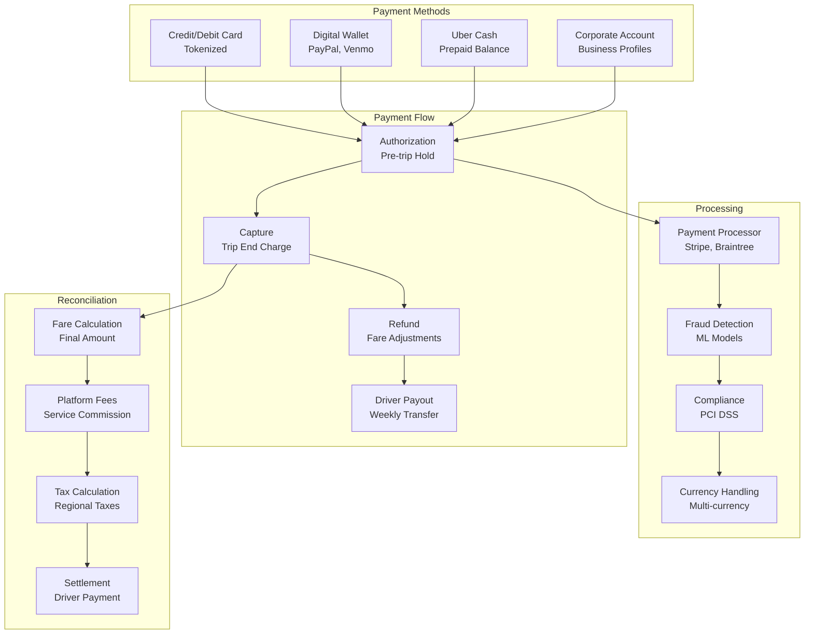
```mermaid
graph TD
    subgraph "Payment Methods"
        CARD[Credit/Debit Card<br/>Tokenized]
        DIGITAL_WALLET[Digital Wallet<br/>PayPal, Venmo]
        UBER_CASH[Uber Cash<br/>Prepaid Balance]
        CORPORATE[Corporate Account<br/>Business Profiles]
    end

    subgraph "Payment Flow"
        AUTHORIZE[Authorization<br/>Pre-trip Hold]
        CAPTURE[Capture<br/>Trip End Charge]
        REFUND[Refund<br/>Fare Adjustments]
        PAYOUT[Driver Payout<br/>Weekly Transfer]
    end

    subgraph "Processing"
        PSP[Payment Processor<br/>Stripe, Braintree]
        FRAUD_CHECK[Fraud Detection<br/>ML Models]
        COMPLIANCE_PAY[Compliance<br/>PCI DSS]
        CURRENCY[Currency Handling<br/>Multi-currency]
    end

    subgraph "Reconciliation"
        FARE_CALC[Fare Calculation<br/>Final Amount]
        FEES[Platform Fees<br/>Service Commission]
        TAXES[Tax Calculation<br/>Regional Taxes]
        SETTLEMENT[Settlement<br/>Driver Payment]
    end

    CARD --> AUTHORIZE
    DIGITAL_WALLET --> AUTHORIZE
    UBER_CASH --> AUTHORIZE
    CORPORATE --> AUTHORIZE

    AUTHORIZE --> CAPTURE
    CAPTURE --> REFUND
    REFUND --> PAYOUT

    AUTHORIZE --> PSP
    PSP --> FRAUD_CHECK
    FRAUD_CHECK --> COMPLIANCE_PAY
    COMPLIANCE_PAY --> CURRENCY

    CAPTURE --> FARE_CALC
    FARE_CALC --> FEES
    FEES --> TAXES
    TAXES --> SETTLEMENT
```

### 6. Trip Lifecycle Management

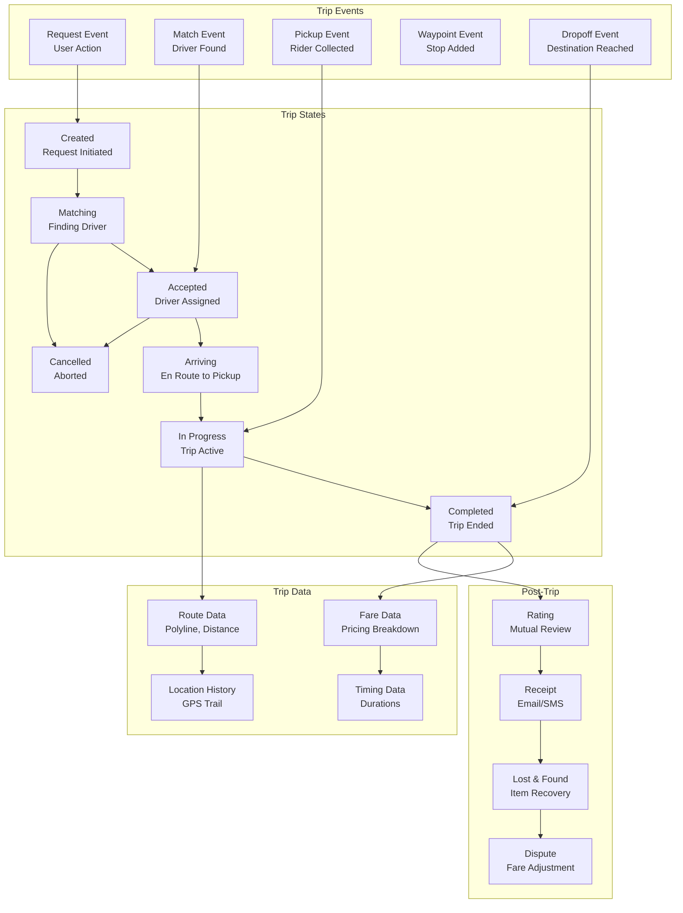
```mermaid
graph TD
    subgraph "Trip States"
        CREATED[Created<br/>Request Initiated]
        MATCHING[Matching<br/>Finding Driver]
        ACCEPTED[Accepted<br/>Driver Assigned]
        ARRIVING[Arriving<br/>En Route to Pickup]
        IN_PROGRESS[In Progress<br/>Trip Active]
        COMPLETED[Completed<br/>Trip Ended]
        CANCELLED[Cancelled<br/>Aborted]
    end

    subgraph "Trip Events"
        REQUEST_EVENT[Request Event<br/>User Action]
        MATCH_EVENT[Match Event<br/>Driver Found]
        PICKUP_EVENT[Pickup Event<br/>Rider Collected]
        WAYPOINT_EVENT[Waypoint Event<br/>Stop Added]
        DROPOFF_EVENT[Dropoff Event<br/>Destination Reached]
    end

    subgraph "Trip Data"
        ROUTE_DATA[Route Data<br/>Polyline, Distance]
        FARE_DATA[Fare Data<br/>Pricing Breakdown]
        LOCATION_DATA[Location History<br/>GPS Trail]
        TIMING_DATA[Timing Data<br/>Durations]
    end

    subgraph "Post-Trip"
        RATING[Rating<br/>Mutual Review]
        RECEIPT[Receipt<br/>Email/SMS]
        LOST_FOUND[Lost & Found<br/>Item Recovery]
        DISPUTE[Dispute<br/>Fare Adjustment]
    end

    CREATED --> MATCHING
    MATCHING --> ACCEPTED
    ACCEPTED --> ARRIVING
    ARRIVING --> IN_PROGRESS
    IN_PROGRESS --> COMPLETED
    MATCHING --> CANCELLED
    ACCEPTED --> CANCELLED

    REQUEST_EVENT --> CREATED
    MATCH_EVENT --> ACCEPTED
    PICKUP_EVENT --> IN_PROGRESS
    DROPOFF_EVENT --> COMPLETED

    IN_PROGRESS --> ROUTE_DATA
    COMPLETED --> FARE_DATA
    ROUTE_DATA --> LOCATION_DATA
    FARE_DATA --> TIMING_DATA

    COMPLETED --> RATING
    RATING --> RECEIPT
    RECEIPT --> LOST_FOUND
    LOST_FOUND --> DISPUTE
```

## Data Architecture

### 1. Schemaless (MySQL Sharding)

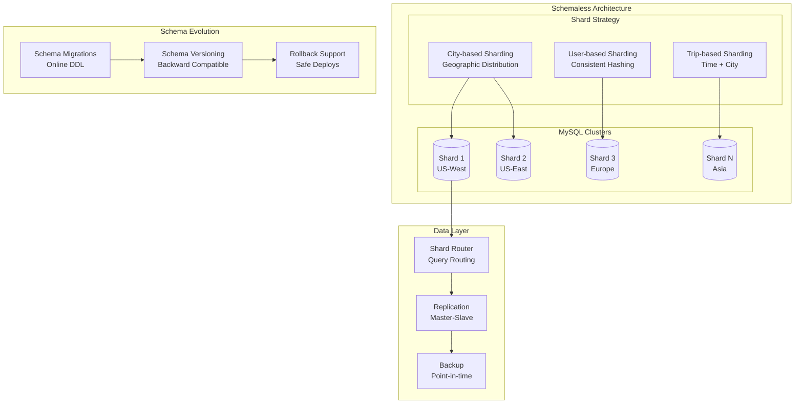
```mermaid
graph TD
    subgraph "Schemaless Architecture"
        subgraph "Shard Strategy"
            CITY_SHARD[City-based Sharding<br/>Geographic Distribution]
            USER_SHARD[User-based Sharding<br/>Consistent Hashing]
            TRIP_SHARD[Trip-based Sharding<br/>Time + City]
        end

        subgraph "MySQL Clusters"
            SHARD1[(Shard 1<br/>US-West)]
            SHARD2[(Shard 2<br/>US-East)]
            SHARD3[(Shard 3<br/>Europe)]
            SHARDN[(Shard N<br/>Asia)]
        end
    end

    subgraph "Data Layer"
        ROUTING[Shard Router<br/>Query Routing]
        REPLICATION[Replication<br/>Master-Slave]
        BACKUP[Backup<br/>Point-in-time]
    end

    subgraph "Schema Evolution"
        MIGRATIONS[Schema Migrations<br/>Online DDL]
        VERSIONING[Schema Versioning<br/>Backward Compatible]
        ROLLBACK[Rollback Support<br/>Safe Deploys]
    end

    CITY_SHARD --> SHARD1
    CITY_SHARD --> SHARD2
    USER_SHARD --> SHARD3
    TRIP_SHARD --> SHARDN

    SHARD1 --> ROUTING
    ROUTING --> REPLICATION
    REPLICATION --> BACKUP

    MIGRATIONS --> VERSIONING
    VERSIONING --> ROLLBACK
```

### 2. Cassandra (Location & Events)

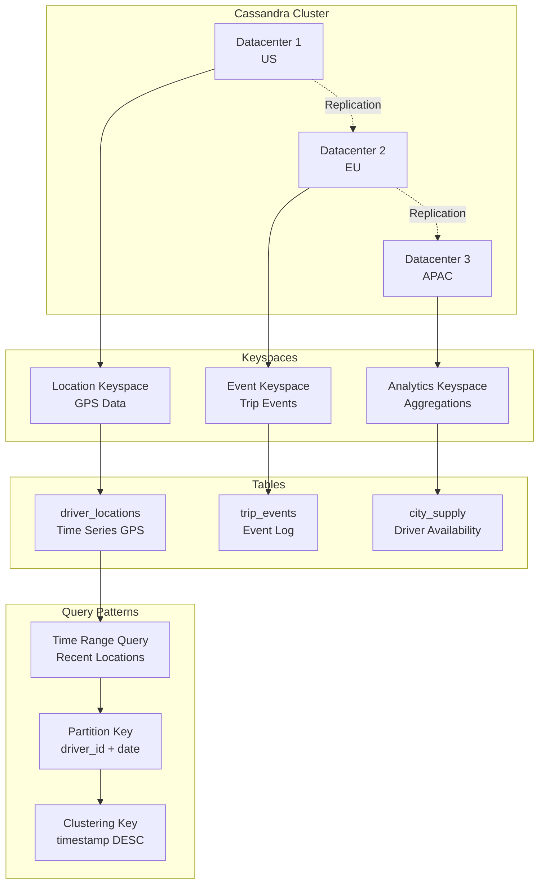
```mermaid
graph TD
    subgraph "Cassandra Cluster"
        DC1[Datacenter 1<br/>US]
        DC2[Datacenter 2<br/>EU]
        DC3[Datacenter 3<br/>APAC]
    end

    subgraph "Keyspaces"
        LOCATION_KS[Location Keyspace<br/>GPS Data]
        EVENT_KS[Event Keyspace<br/>Trip Events]
        ANALYTICS_KS[Analytics Keyspace<br/>Aggregations]
    end

    subgraph "Tables"
        DRIVER_LOCATION[driver_locations<br/>Time Series GPS]
        TRIP_EVENTS[trip_events<br/>Event Log]
        CITY_SUPPLY[city_supply<br/>Driver Availability]
    end

    subgraph "Query Patterns"
        TIME_RANGE[Time Range Query<br/>Recent Locations]
        PARTITION_KEY[Partition Key<br/>driver_id + date]
        CLUSTERING[Clustering Key<br/>timestamp DESC]
    end

    DC1 -.->|Replication| DC2
    DC2 -.->|Replication| DC3

    DC1 --> LOCATION_KS
    DC2 --> EVENT_KS
    DC3 --> ANALYTICS_KS

    LOCATION_KS --> DRIVER_LOCATION
    EVENT_KS --> TRIP_EVENTS
    ANALYTICS_KS --> CITY_SUPPLY

    DRIVER_LOCATION --> TIME_RANGE
    TIME_RANGE --> PARTITION_KEY
    PARTITION_KEY --> CLUSTERING
```

### 3. Redis (Real-time State)

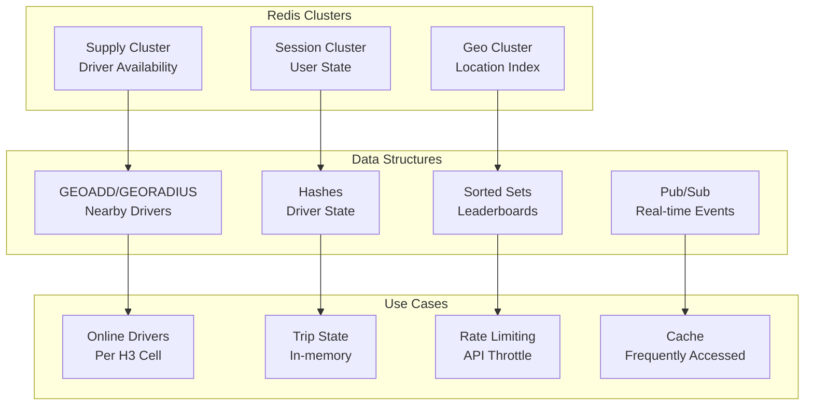
```mermaid
graph TD
    subgraph "Redis Clusters"
        SUPPLY_CLUSTER[Supply Cluster<br/>Driver Availability]
        SESSION_CLUSTER[Session Cluster<br/>User State]
        GEO_CLUSTER[Geo Cluster<br/>Location Index]
    end

    subgraph "Data Structures"
        GEOSPATIAL[GEOADD/GEORADIUS<br/>Nearby Drivers]
        SORTED_SET[Sorted Sets<br/>Leaderboards]
        HASH[Hashes<br/>Driver State]
        PUBSUB[Pub/Sub<br/>Real-time Events]
    end

    subgraph "Use Cases"
        DRIVER_ONLINE[Online Drivers<br/>Per H3 Cell]
        TRIP_STATE[Trip State<br/>In-memory]
        RATE_LIMIT_DATA[Rate Limiting<br/>API Throttle]
        CACHE_DATA[Cache<br/>Frequently Accessed]
    end

    SUPPLY_CLUSTER --> GEOSPATIAL
    SESSION_CLUSTER --> HASH
    GEO_CLUSTER --> SORTED_SET

    GEOSPATIAL --> DRIVER_ONLINE
    HASH --> TRIP_STATE
    SORTED_SET --> RATE_LIMIT_DATA
    PUBSUB --> CACHE_DATA
```

### 4. Kafka (Event Streaming)

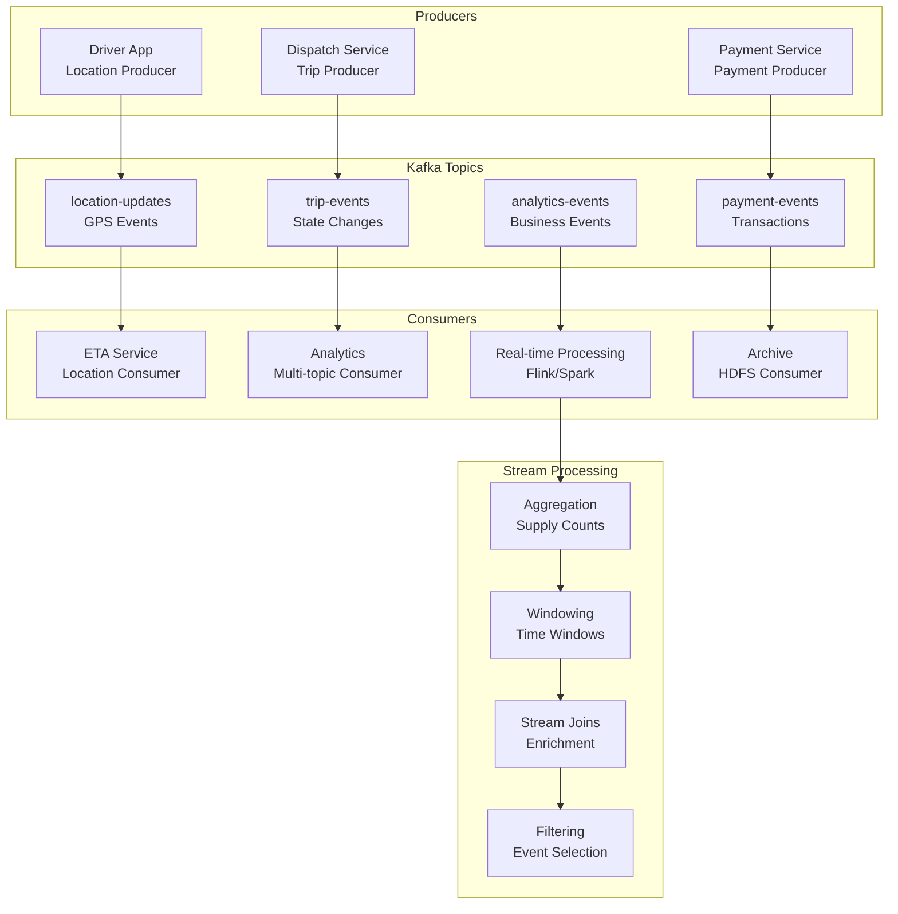
```mermaid
graph TD
    subgraph "Kafka Topics"
        LOCATION_TOPIC[location-updates<br/>GPS Events]
        TRIP_TOPIC[trip-events<br/>State Changes]
        PAYMENT_TOPIC[payment-events<br/>Transactions]
        ANALYTICS_TOPIC[analytics-events<br/>Business Events]
    end

    subgraph "Producers"
        DRIVER_APP_PROD[Driver App<br/>Location Producer]
        DISPATCH_PROD[Dispatch Service<br/>Trip Producer]
        PAYMENT_PROD[Payment Service<br/>Payment Producer]
    end

    subgraph "Consumers"
        ETA_CONSUMER[ETA Service<br/>Location Consumer]
        ANALYTICS_CONSUMER[Analytics<br/>Multi-topic Consumer]
        REALTIME_CONSUMER[Real-time Processing<br/>Flink/Spark]
        ARCHIVE_CONSUMER[Archive<br/>HDFS Consumer]
    end

    subgraph "Stream Processing"
        AGGREGATION[Aggregation<br/>Supply Counts]
        WINDOWING[Windowing<br/>Time Windows]
        JOIN[Stream Joins<br/>Enrichment]
        FILTER[Filtering<br/>Event Selection]
    end

    DRIVER_APP_PROD --> LOCATION_TOPIC
    DISPATCH_PROD --> TRIP_TOPIC
    PAYMENT_PROD --> PAYMENT_TOPIC

    LOCATION_TOPIC --> ETA_CONSUMER
    TRIP_TOPIC --> ANALYTICS_CONSUMER
    ANALYTICS_TOPIC --> REALTIME_CONSUMER
    PAYMENT_TOPIC --> ARCHIVE_CONSUMER

    REALTIME_CONSUMER --> AGGREGATION
    AGGREGATION --> WINDOWING
    WINDOWING --> JOIN
    JOIN --> FILTER
```

## Real-time Architecture

### 1. Ringpop (Consistent Hashing)

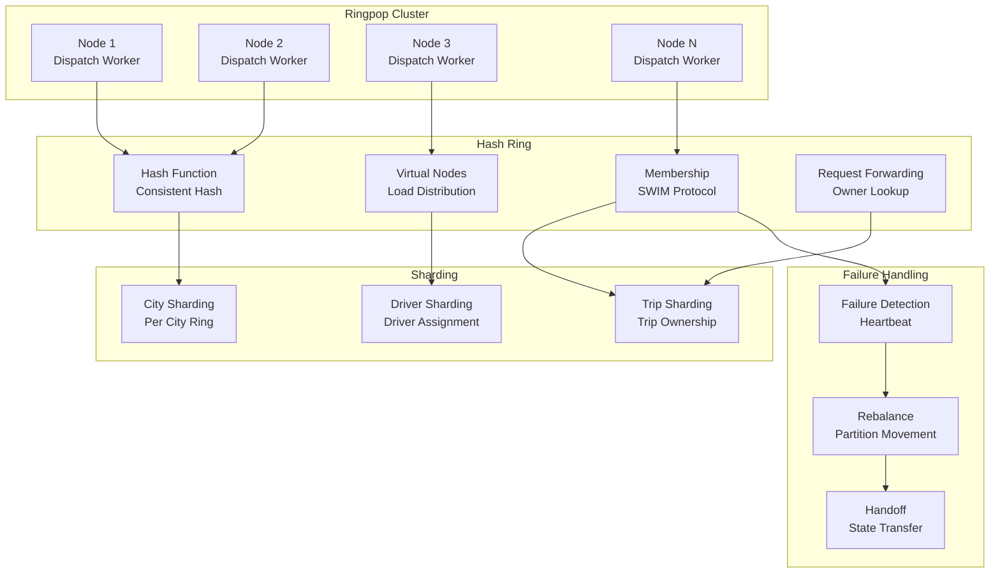
```mermaid
graph TD
    subgraph "Ringpop Cluster"
        NODE1[Node 1<br/>Dispatch Worker]
        NODE2[Node 2<br/>Dispatch Worker]
        NODE3[Node 3<br/>Dispatch Worker]
        NODEN[Node N<br/>Dispatch Worker]
    end

    subgraph "Hash Ring"
        HASH_FUNC[Hash Function<br/>Consistent Hash]
        VIRTUAL_NODES[Virtual Nodes<br/>Load Distribution]
        MEMBERSHIP[Membership<br/>SWIM Protocol]
        FORWARDING[Request Forwarding<br/>Owner Lookup]
    end

    subgraph "Sharding"
        CITY_RING[City Sharding<br/>Per City Ring]
        DRIVER_RING[Driver Sharding<br/>Driver Assignment]
        TRIP_RING[Trip Sharding<br/>Trip Ownership]
    end

    subgraph "Failure Handling"
        DETECT[Failure Detection<br/>Heartbeat]
        REBALANCE[Rebalance<br/>Partition Movement]
        HANDOFF[Handoff<br/>State Transfer]
    end

    NODE1 --> HASH_FUNC
    NODE2 --> HASH_FUNC
    NODE3 --> VIRTUAL_NODES
    NODEN --> MEMBERSHIP

    HASH_FUNC --> CITY_RING
    VIRTUAL_NODES --> DRIVER_RING
    MEMBERSHIP --> TRIP_RING
    FORWARDING --> TRIP_RING

    MEMBERSHIP --> DETECT
    DETECT --> REBALANCE
    REBALANCE --> HANDOFF
```

### 2. Real-time Location Tracking

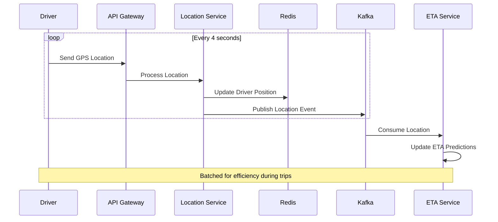
```mermaid
sequenceDiagram
    participant Driver
    participant Gateway as API Gateway
    participant Location as Location Service
    participant Redis
    participant Kafka
    participant ETA as ETA Service

    loop Every 4 seconds
        Driver->>Gateway: Send GPS Location
        Gateway->>Location: Process Location
        Location->>Redis: Update Driver Position
        Location->>Kafka: Publish Location Event
    end

    Kafka->>ETA: Consume Location
    ETA->>ETA: Update ETA Predictions

    Note over Driver,ETA: Batched for efficiency during trips
```

## Scalability & Performance

### 1. City-based Isolation

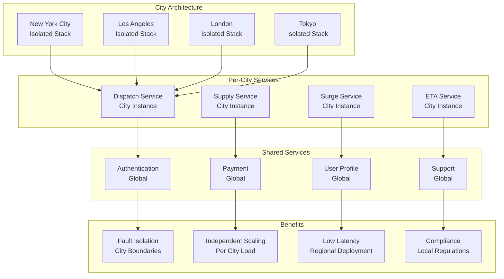
```mermaid
graph TD
    subgraph "City Architecture"
        NYC[New York City<br/>Isolated Stack]
        LA[Los Angeles<br/>Isolated Stack]
        LONDON[London<br/>Isolated Stack]
        TOKYO[Tokyo<br/>Isolated Stack]
    end

    subgraph "Per-City Services"
        CITY_DISPATCH[Dispatch Service<br/>City Instance]
        CITY_SUPPLY[Supply Service<br/>City Instance]
        CITY_SURGE[Surge Service<br/>City Instance]
        CITY_ETA[ETA Service<br/>City Instance]
    end

    subgraph "Shared Services"
        AUTH_SHARED[Authentication<br/>Global]
        PAYMENT_SHARED[Payment<br/>Global]
        USER_SHARED[User Profile<br/>Global]
        SUPPORT_SHARED[Support<br/>Global]
    end

    subgraph "Benefits"
        ISOLATION[Fault Isolation<br/>City Boundaries]
        SCALING[Independent Scaling<br/>Per City Load]
        LATENCY[Low Latency<br/>Regional Deployment]
        COMPLIANCE[Compliance<br/>Local Regulations]
    end

    NYC --> CITY_DISPATCH
    LA --> CITY_DISPATCH
    LONDON --> CITY_DISPATCH
    TOKYO --> CITY_DISPATCH

    CITY_DISPATCH --> AUTH_SHARED
    CITY_SUPPLY --> PAYMENT_SHARED
    CITY_SURGE --> USER_SHARED
    CITY_ETA --> SUPPORT_SHARED

    AUTH_SHARED --> ISOLATION
    PAYMENT_SHARED --> SCALING
    USER_SHARED --> LATENCY
    SUPPORT_SHARED --> COMPLIANCE
```

### 2. Performance Optimization

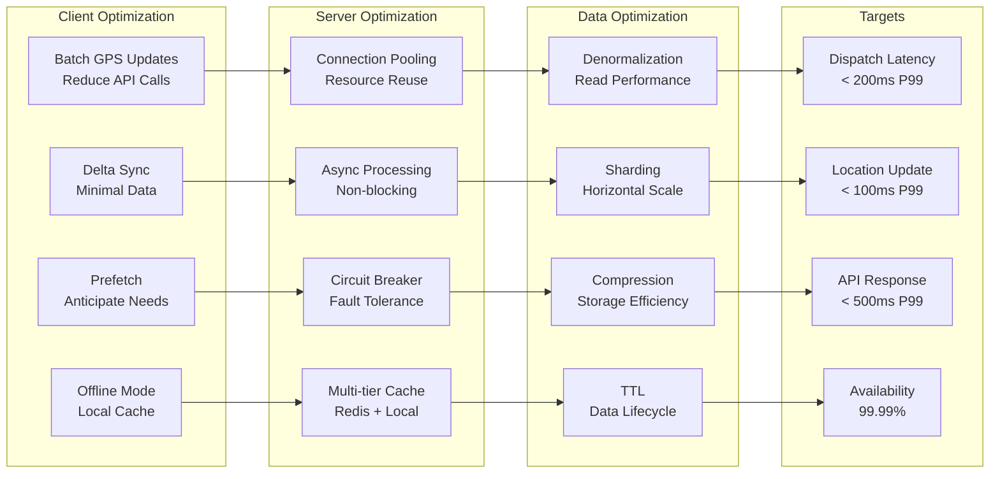
```mermaid
graph LR
    subgraph "Client Optimization"
        BATCH_GPS[Batch GPS Updates<br/>Reduce API Calls]
        DELTA_SYNC[Delta Sync<br/>Minimal Data]
        PREFETCH[Prefetch<br/>Anticipate Needs]
        OFFLINE[Offline Mode<br/>Local Cache]
    end

    subgraph "Server Optimization"
        CONNECTION_POOL[Connection Pooling<br/>Resource Reuse]
        ASYNC_PROC[Async Processing<br/>Non-blocking]
        CIRCUIT_BREAKER[Circuit Breaker<br/>Fault Tolerance]
        CACHE_LAYER[Multi-tier Cache<br/>Redis + Local]
    end

    subgraph "Data Optimization"
        DENORMALIZE[Denormalization<br/>Read Performance]
        SHARDING_OPT[Sharding<br/>Horizontal Scale]
        COMPRESSION[Compression<br/>Storage Efficiency]
        TTL[TTL<br/>Data Lifecycle]
    end

    subgraph "Targets"
        DISPATCH_TARGET[Dispatch Latency<br/>< 200ms P99]
        LOCATION_TARGET[Location Update<br/>< 100ms P99]
        API_TARGET[API Response<br/>< 500ms P99]
        AVAILABILITY[Availability<br/>99.99%]
    end

    BATCH_GPS --> CONNECTION_POOL
    DELTA_SYNC --> ASYNC_PROC
    PREFETCH --> CIRCUIT_BREAKER
    OFFLINE --> CACHE_LAYER

    CONNECTION_POOL --> DENORMALIZE
    ASYNC_PROC --> SHARDING_OPT
    CIRCUIT_BREAKER --> COMPRESSION
    CACHE_LAYER --> TTL

    DENORMALIZE --> DISPATCH_TARGET
    SHARDING_OPT --> LOCATION_TARGET
    COMPRESSION --> API_TARGET
    TTL --> AVAILABILITY
```

## Safety & Security

### 1. Safety Features

```mermaid
graph TD
    subgraph "Rider Safety"
        SHARE_TRIP[Share Trip<br/>Live Location]
        TRUSTED_CONTACTS[Trusted Contacts<br/>Emergency Share]
        SAFETY_CHECK[Safety Check<br/>Trip Status]
        EMERGENCY[Emergency Button<br/>911 Integration]
    end

    subgraph "Driver Safety"
        BACKGROUND_CHECK[Background Check<br/>Verification]
        FACE_VERIFY[Face Verification<br/>Real-time Check]
        SPEED_ALERT[Speed Alerts<br/>Driving Behavior]
        FATIGUE[Fatigue Detection<br/>Drive Time Limits]
    end

    subgraph "Trip Safety"
        GPS_TRACKING[GPS Tracking<br/>Route Monitoring]
        ROUTE_DEVIATION[Route Deviation<br/>Alert System]
        AUDIO_RECORD[Audio Recording<br/>Opt-in Safety]
        CRASH_DETECT[Crash Detection<br/>Accelerometer]
    end

    subgraph "Platform Safety"
        FRAUD_DETECT[Fraud Detection<br/>Account Security]
        CONTENT_MOD[Content Moderation<br/>Report System]
        COMMUNITY[Community Guidelines<br/>Policy Enforcement]
        DEACTIVATION[Deactivation<br/>Violations]
    end

    SHARE_TRIP --> GPS_TRACKING
    TRUSTED_CONTACTS --> GPS_TRACKING
    SAFETY_CHECK --> ROUTE_DEVIATION
    EMERGENCY --> CRASH_DETECT

    BACKGROUND_CHECK --> FRAUD_DETECT
    FACE_VERIFY --> FRAUD_DETECT
    SPEED_ALERT --> CONTENT_MOD
    FATIGUE --> DEACTIVATION
```

### 2. Security Architecture

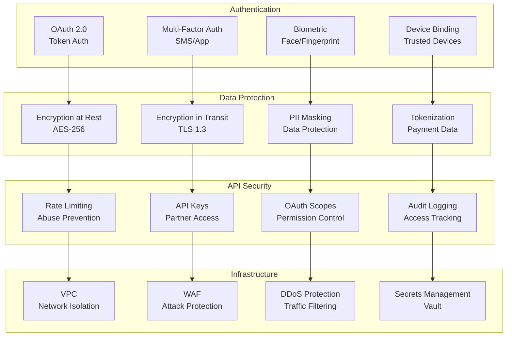
```mermaid
graph TB
    subgraph "Authentication"
        OAUTH[OAuth 2.0<br/>Token Auth]
        MFA[Multi-Factor Auth<br/>SMS/App]
        BIOMETRIC[Biometric<br/>Face/Fingerprint]
        DEVICE[Device Binding<br/>Trusted Devices]
    end

    subgraph "Data Protection"
        ENCRYPT_REST[Encryption at Rest<br/>AES-256]
        ENCRYPT_TRANSIT[Encryption in Transit<br/>TLS 1.3]
        PII_MASK[PII Masking<br/>Data Protection]
        TOKENIZE[Tokenization<br/>Payment Data]
    end

    subgraph "API Security"
        RATE_LIMIT_SEC[Rate Limiting<br/>Abuse Prevention]
        API_KEY[API Keys<br/>Partner Access]
        SCOPE[OAuth Scopes<br/>Permission Control]
        AUDIT[Audit Logging<br/>Access Tracking]
    end

    subgraph "Infrastructure"
        VPC[VPC<br/>Network Isolation]
        WAF_SEC[WAF<br/>Attack Protection]
        DDOS[DDoS Protection<br/>Traffic Filtering]
        SECRETS[Secrets Management<br/>Vault]
    end

    OAUTH --> ENCRYPT_REST
    MFA --> ENCRYPT_TRANSIT
    BIOMETRIC --> PII_MASK
    DEVICE --> TOKENIZE

    ENCRYPT_REST --> RATE_LIMIT_SEC
    ENCRYPT_TRANSIT --> API_KEY
    PII_MASK --> SCOPE
    TOKENIZE --> AUDIT

    RATE_LIMIT_SEC --> VPC
    API_KEY --> WAF_SEC
    SCOPE --> DDOS
    AUDIT --> SECRETS
```

## Monitoring & Observability

### 1. Metrics & Dashboards

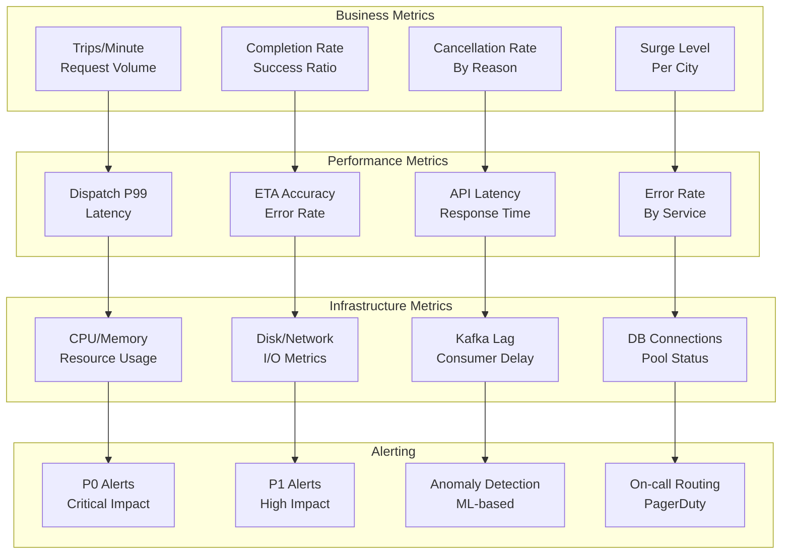
```mermaid
graph TD
    subgraph "Business Metrics"
        TRIPS_MIN[Trips/Minute<br/>Request Volume]
        COMPLETION_RATE[Completion Rate<br/>Success Ratio]
        CANCEL_RATE[Cancellation Rate<br/>By Reason]
        SURGE_LEVEL[Surge Level<br/>Per City]
    end

    subgraph "Performance Metrics"
        DISPATCH_P99[Dispatch P99<br/>Latency]
        ETA_ACCURACY[ETA Accuracy<br/>Error Rate]
        API_LATENCY[API Latency<br/>Response Time]
        ERROR_RATE[Error Rate<br/>By Service]
    end

    subgraph "Infrastructure Metrics"
        CPU_MEM[CPU/Memory<br/>Resource Usage]
        DISK_NET[Disk/Network<br/>I/O Metrics]
        KAFKA_LAG[Kafka Lag<br/>Consumer Delay]
        DB_CONNECTIONS[DB Connections<br/>Pool Status]
    end

    subgraph "Alerting"
        P0_ALERTS[P0 Alerts<br/>Critical Impact]
        P1_ALERTS[P1 Alerts<br/>High Impact]
        ANOMALY_ALERT[Anomaly Detection<br/>ML-based]
        ONCALL[On-call Routing<br/>PagerDuty]
    end

    TRIPS_MIN --> DISPATCH_P99
    COMPLETION_RATE --> ETA_ACCURACY
    CANCEL_RATE --> API_LATENCY
    SURGE_LEVEL --> ERROR_RATE

    DISPATCH_P99 --> CPU_MEM
    ETA_ACCURACY --> DISK_NET
    API_LATENCY --> KAFKA_LAG
    ERROR_RATE --> DB_CONNECTIONS

    CPU_MEM --> P0_ALERTS
    DISK_NET --> P1_ALERTS
    KAFKA_LAG --> ANOMALY_ALERT
    DB_CONNECTIONS --> ONCALL
```

## Deployment and DevOps

### 1. Continuous Deployment Pipeline

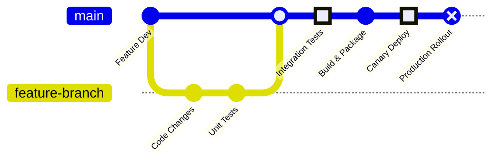
```mermaid
gitGraph
    commit id: "Feature Dev"
    branch feature-branch
    checkout feature-branch
    commit id: "Code Changes"
    commit id: "Unit Tests"
    checkout main
    merge feature-branch
    commit id: "Integration Tests" type: HIGHLIGHT
    commit id: "Build & Package"
    commit id: "Canary Deploy" type: HIGHLIGHT
    commit id: "Production Rollout" type: REVERSE
```

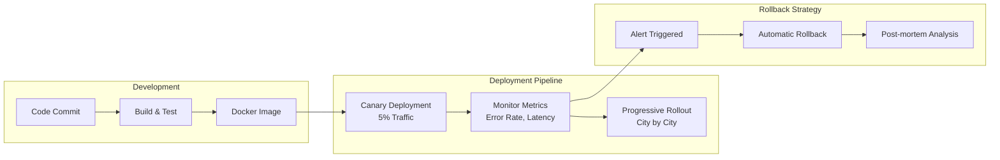
```mermaid
flowchart LR
    subgraph "Development"
        CODE[Code Commit]
        BUILD[Build & Test]
        ARTIFACT[Docker Image]
    end

    subgraph "Deployment Pipeline"
        CANARY[Canary Deployment<br/>5% Traffic]
        MONITOR[Monitor Metrics<br/>Error Rate, Latency]
        ROLLOUT[Progressive Rollout<br/>City by City]
    end

    subgraph "Rollback Strategy"
        ALERT[Alert Triggered]
        ROLLBACK[Automatic Rollback]
        POSTMORTEM[Post-mortem Analysis]
    end

    CODE --> BUILD
    BUILD --> ARTIFACT
    ARTIFACT --> CANARY
    CANARY --> MONITOR
    MONITOR --> ROLLOUT
    MONITOR --> ALERT
    ALERT --> ROLLBACK
    ROLLBACK --> POSTMORTEM
```

- **uDeploy**: Uber's internal deployment system
- **Canary releases**: City-level progressive rollout
- **Feature flags**: LaunchDarkly for controlled releases
- **Automated rollback**: Metric-triggered reversal

### 2. Infrastructure as Code
- **Terraform**: Infrastructure provisioning
- **Kubernetes**: Container orchestration (Peloton)
- **Helm charts**: Service deployment templates

### 3. Chaos Engineering

```mermaid
flowchart TD
    subgraph "Chaos Tools"
        CITY_OUTAGE[City Outage<br/>Regional Failure]
        SERVICE_KILL[Service Kill<br/>Random Termination]
        NETWORK_CHAOS[Network Chaos<br/>Latency Injection]
        DB_FAILOVER[DB Failover<br/>Primary Switch]
    end

    subgraph "Target Systems"
        DISPATCH[Dispatch Service]
        PRICING[Pricing Service]
        PAYMENT[Payment Service]
        LOCATION[Location Service]
    end

    subgraph "Monitoring"
        METRICS[System Metrics]
        BUSINESS_METRICS[Business Metrics]
        ALERTS[Alert System]
    end

    subgraph "Response"
        AUTO_RECOVERY[Auto-Recovery]
        MANUAL[Manual Intervention]
        IMPROVEMENT[System Improvement]
    end

    CITY_OUTAGE --> DISPATCH
    SERVICE_KILL --> PRICING
    NETWORK_CHAOS --> PAYMENT
    DB_FAILOVER --> LOCATION

    DISPATCH --> METRICS
    PRICING --> BUSINESS_METRICS
    PAYMENT --> ALERTS

    ALERTS --> AUTO_RECOVERY
    ALERTS --> MANUAL
    AUTO_RECOVERY --> IMPROVEMENT
```

- **City-level drills**: Simulated city outages
- **Service injection**: Random service failures
- **Database failover**: Primary/replica switches
- **Network partition**: Cross-datacenter latency

## Analytics and Machine Learning

### 1. ML Platform (Michelangelo)

```mermaid
flowchart TD
    subgraph "Data Collection"
        TRIP_DATA[Trip Data<br/>GPS, Duration, Fare]
        USER_DATA[User Data<br/>Behavior, Preferences]
        DRIVER_DATA[Driver Data<br/>Ratings, Acceptance]
        MARKET_DATA[Market Data<br/>Supply, Demand]
    end

    subgraph "Feature Engineering"
        FEATURE_STORE[Feature Store<br/>Centralized Features]
        REAL_TIME[Real-time Features<br/>Streaming]
        BATCH[Batch Features<br/>Historical]
    end

    subgraph "Model Training"
        TRAIN[Distributed Training<br/>Spark, TensorFlow]
        EVALUATE[Model Evaluation<br/>Metrics, A/B]
        REGISTRY[Model Registry<br/>Version Control]
    end

    subgraph "Model Serving"
        ONLINE[Online Serving<br/>Low Latency]
        BATCH_SERVE[Batch Serving<br/>Pre-compute]
        STREAMING[Streaming<br/>Real-time Updates]
    end

    TRIP_DATA --> FEATURE_STORE
    USER_DATA --> FEATURE_STORE
    DRIVER_DATA --> FEATURE_STORE
    MARKET_DATA --> FEATURE_STORE

    FEATURE_STORE --> REAL_TIME
    FEATURE_STORE --> BATCH

    REAL_TIME --> TRAIN
    BATCH --> TRAIN
    TRAIN --> EVALUATE
    EVALUATE --> REGISTRY

    REGISTRY --> ONLINE
    REGISTRY --> BATCH_SERVE
    REGISTRY --> STREAMING
```

### 2. ML Use Cases
- **ETA Prediction**: Route time estimation with traffic
- **Surge Pricing**: Dynamic pricing based on demand
- **Fraud Detection**: Payment and account fraud
- **Driver Matching**: Optimal driver-rider pairing
- **Demand Forecasting**: Supply positioning

## Cost Optimization

### 1. Infrastructure Cost Distribution

```mermaid
pie title Uber Infrastructure Cost Distribution
    "Compute (Containers, VMs)" : 35
    "Database & Storage" : 25
    "Mapping & Location" : 15
    "Network & CDN" : 10
    "Machine Learning" : 10
    "Monitoring & Observability" : 5
```

### 2. Cost Optimization Strategies

```mermaid
graph TD
    subgraph "Compute Optimization"
        SPOT[Spot Instances<br/>Batch Processing]
        RESERVED[Reserved Capacity<br/>Core Services]
        AUTOSCALE[Auto-scaling<br/>Demand-based]
        CONTAINER[Container Efficiency<br/>Resource Limits]
    end

    subgraph "Data Optimization"
        TIERED[Tiered Storage<br/>Hot/Warm/Cold]
        COMPRESSION[Compression<br/>Reduced Storage]
        TTL[Data TTL<br/>Auto Cleanup]
        ARCHIVE[Archival<br/>Historical Data]
    end

    subgraph "Network Optimization"
        EDGE_CACHE[Edge Caching<br/>Map Tiles]
        BATCHING[Request Batching<br/>GPS Updates]
        COMPRESSION_NET[Compression<br/>Protocol Buffers]
        REGIONAL[Regional Processing<br/>Data Locality]
    end

    SPOT --> TIERED
    RESERVED --> COMPRESSION
    AUTOSCALE --> TTL
    CONTAINER --> ARCHIVE

    TIERED --> EDGE_CACHE
    COMPRESSION --> BATCHING
    TTL --> COMPRESSION_NET
    ARCHIVE --> REGIONAL
```

## Future Architecture Considerations

### 1. Emerging Technologies

```mermaid
graph TD
    subgraph "Autonomous Vehicles"
        SELF_DRIVING[Self-Driving Cars<br/>Uber ATG]
        SENSOR_FUSION[Sensor Fusion<br/>Lidar, Camera, Radar]
        HD_MAPS[HD Maps<br/>Centimeter Precision]
        SIMULATION[Simulation<br/>Virtual Testing]
    end

    subgraph "New Modalities"
        UBER_AIR[Uber Air<br/>Urban Air Mobility]
        MICROMOBILITY[Micromobility<br/>Bikes, Scooters]
        FREIGHT[Uber Freight<br/>Logistics]
        DELIVERY[Uber Eats<br/>Food Delivery]
    end

    subgraph "Platform Evolution"
        SUPER_APP[Super App<br/>Multi-service]
        AI_DISPATCH[AI Dispatch<br/>Autonomous Matching]
        PREDICTIVE[Predictive Demand<br/>Pre-positioning]
        CARBON_NEUTRAL[Carbon Neutral<br/>EV Fleet]
    end

    subgraph "Technical Evolution"
        EDGE_ML[Edge ML<br/>On-device AI]
        REAL_TIME_ML[Real-time ML<br/>Streaming Models]
        FEDERATED[Federated Learning<br/>Privacy-preserving]
        QUANTUM[Quantum Optimization<br/>Routing Problems]
    end

    SELF_DRIVING --> UBER_AIR
    SENSOR_FUSION --> MICROMOBILITY
    HD_MAPS --> FREIGHT
    SIMULATION --> DELIVERY

    UBER_AIR --> SUPER_APP
    MICROMOBILITY --> AI_DISPATCH
    FREIGHT --> PREDICTIVE
    DELIVERY --> CARBON_NEUTRAL

    SUPER_APP --> EDGE_ML
    AI_DISPATCH --> REAL_TIME_ML
    PREDICTIVE --> FEDERATED
    CARBON_NEUTRAL --> QUANTUM
```

## Conclusion

Uber's architecture demonstrates expertise in building real-time, location-based services at massive global scale. The system successfully manages:

- **Real-time Matching**: Sub-second driver-rider matching
- **Global Scale**: 10,000+ cities, millions of trips daily
- **Dynamic Pricing**: Real-time supply/demand balancing
- **High Availability**: 99.99% uptime with graceful degradation
- **Safety**: Comprehensive safety features for riders and drivers

### Key Architectural Principles:

1. **City-based Isolation**
   - Independent scaling per city
   - Fault isolation boundaries
   - Regulatory compliance
   - Local optimization

2. **Real-time Systems**
   - H3 hexagonal grid for geospatial
   - Ringpop for consistent hashing
   - Kafka for event streaming
   - Redis for real-time state

3. **Data Architecture**
   - MySQL Schemaless for flexibility
   - Cassandra for time-series data
   - Redis for hot data
   - HDFS for analytics

4. **Reliability**
   - Circuit breakers
   - Graceful degradation
   - Multi-region deployment
   - Automated recovery

5. **Machine Learning**
   - ETA prediction
   - Surge pricing
   - Fraud detection
   - Demand forecasting

The platform continues to evolve with autonomous vehicles, drone delivery, and multimodal transportation, while maintaining the core principles of reliability and real-time responsiveness.

> This architecture represents Uber's known systems and best practices. Actual implementation details may vary.
