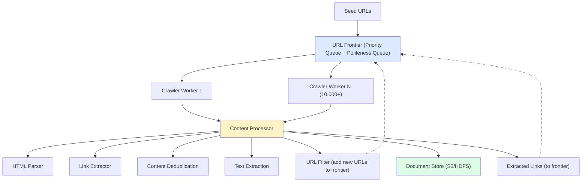
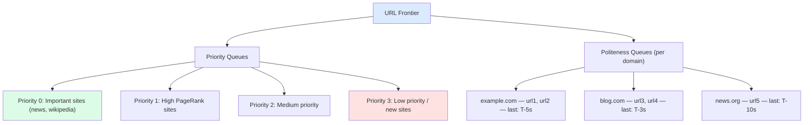
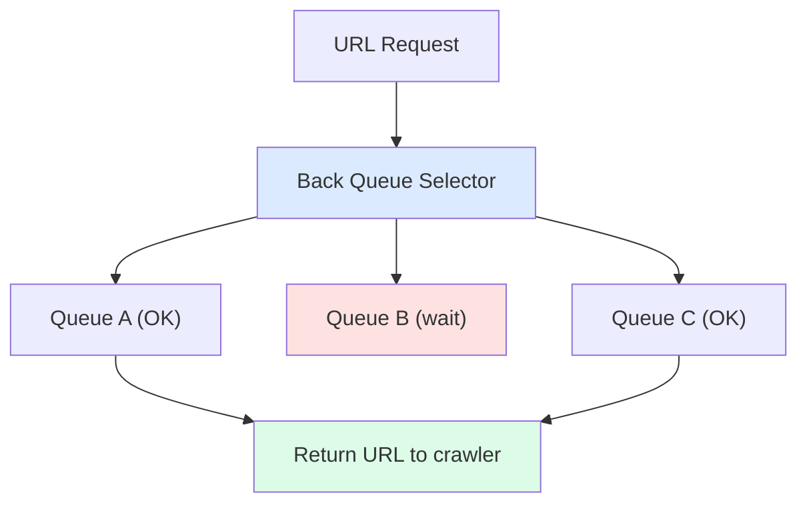
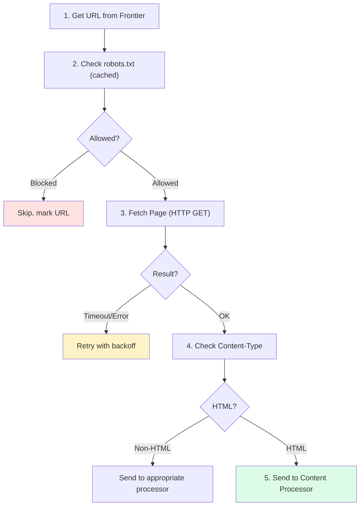
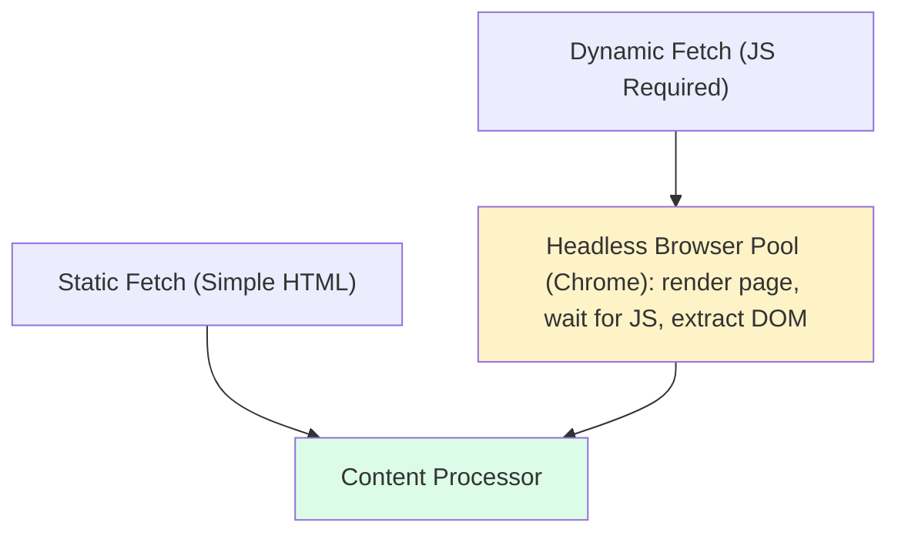

## Problem Statement

Design a web crawler that systematically browses the web to index pages for a search engine.

---

## Requirements

### Functional Requirements
- Crawl billions of web pages
- Extract text, links, and metadata
- Respect robots.txt and rate limits
- Handle dynamic content (JavaScript)
- Detect and skip duplicate content

### Non-Functional Requirements
- Scalability: 1 billion pages/day
- Politeness: Don't overwhelm servers
- Robustness: Handle failures gracefully
- Extensibility: Support different content types

---

## Capacity Estimation

```
Assumptions:
- Target: 1 billion pages/day
- Average page size: 500 KB (with assets)
- Store HTML + extracted text: 100 KB avg

Crawl Rate:
- 1B pages / 86400 sec ≈ 11,500 pages/sec
- Per crawler: 1 page/sec → 11,500 crawlers

Storage:
- Daily: 1B × 100 KB = 100 TB/day
- Monthly: 3 PB (with duplicates, versions)

Bandwidth:
- Download: 11,500 × 500 KB = 5.75 GB/sec
- Upload to storage: 11,500 × 100 KB = 1.15 GB/sec
```

---

## High-Level Architecture



---

## URL Frontier Design

### Priority-Based Crawling



### Back Queue Selector



---

## Crawler Worker Design



---

## robots.txt Handling

```
robots.txt example:
User-agent: *
Disallow: /admin/
Disallow: /private/
Crawl-delay: 10

User-agent: Googlebot
Allow: /
Crawl-delay: 1

Handling:
┌─────────────────────────────────────────────────────────┐
│              robots.txt Cache                            │
├─────────────────────────────────────────────────────────┤
│  Key: domain                                            │
│  Value: {                                               │
│    rules: [...],                                        │
│    crawl_delay: 10,                                     │
│    fetched_at: timestamp,                               │
│    expires_at: timestamp + 24h                          │
│  }                                                       │
└─────────────────────────────────────────────────────────┘

Check before every fetch:
1. Get robots.txt from cache (or fetch if expired)
2. Check if URL path is allowed
3. Respect crawl-delay between requests
```

---

## Content Deduplication

### URL-Level Dedup

```
Before adding to frontier:

Normalize URL:
- Remove trailing slash
- Lowercase domain
- Remove default ports
- Sort query parameters
- Remove fragments (#)

Example:
HTTP://Example.COM:80/Path/?b=2&a=1#section
→ http://example.com/path/?a=1&b=2

Check in Bloom Filter:
- If possibly seen → Check exact match in DB
- If definitely not seen → Add to frontier
```

### Content-Level Dedup

```
SimHash / MinHash for near-duplicate detection:

Document A: "The quick brown fox jumps"
Document B: "The quick brown fox leaps"

SimHash:
- Generate n-grams
- Hash each n-gram
- Combine with weighted sum
- Result: 64-bit fingerprint

Hamming Distance:
- If distance < 3 → Likely duplicate
- If distance >= 3 → Different documents

┌─────────────────────────────────────────────────────────┐
│            Content Fingerprint Store                     │
├─────────────────────────────────────────────────────────┤
│  simhash: 0x1234567890ABCDEF → [url1, url2, url3]      │
│  simhash: 0x2345678901BCDEF0 → [url4]                  │
└─────────────────────────────────────────────────────────┘
```

---

## Link Extraction & Filtering

```
Extracted Links Processing:

1. Parse HTML
   <a href="/page2">Link</a>
   → /page2

2. Resolve relative URLs
   Base: https://example.com/dir/page1
   /page2 → https://example.com/page2

3. Filter
   ✓ Same domain or allowed external
   ✗ Blocked extensions (.pdf, .jpg unless needed)
   ✗ Already in frontier
   ✗ Blocked by domain blacklist

4. Assign Priority
   - PageRank estimate
   - Domain authority
   - URL depth
   - Content type hints
```

---

## DNS Resolution

```
DNS Caching Layer:

┌─────────────────────────────────────────────────────────┐
│              Custom DNS Resolver                         │
├─────────────────────────────────────────────────────────┤
│  Local Cache:                                           │
│  ┌─────────────────────────────────────────────────┐   │
│  │ example.com → 93.184.216.34 (TTL: 3600)         │   │
│  │ blog.com → 104.21.234.56 (TTL: 1800)           │   │
│  └─────────────────────────────────────────────────┘   │
│                                                          │
│  Benefits:                                               │
│  - Reduce DNS lookup latency                            │
│  - Batch resolve for same domain                        │
│  - Handle DNS failures gracefully                       │
└─────────────────────────────────────────────────────────┘
```

---

## Handling JavaScript-Rendered Content



Detection: If initial HTML has JS frameworks (React, Angular, Vue) → Use headless browser

---

## Distributed Coordination

```
┌─────────────────────────────────────────────────────────┐
│              Crawler Coordinator (ZooKeeper)             │
├─────────────────────────────────────────────────────────┤
│  /crawlers                                              │
│  ├── /crawler-001 (alive)                               │
│  ├── /crawler-002 (alive)                               │
│  └── /crawler-003 (dead)                                │
│                                                          │
│  /domains                                                │
│  ├── /example.com → crawler-001                         │
│  ├── /blog.com → crawler-002                            │
│  └── /news.org → crawler-001                            │
│                                                          │
│  Domain Assignment:                                      │
│  - Consistent hashing for domain → crawler mapping      │
│  - Rebalance on crawler failure                         │
└─────────────────────────────────────────────────────────┘
```

---

## Monitoring & Metrics

```
Key Metrics:
- Pages crawled/second
- Frontier size
- Error rate by type
- Average fetch time
- Domain coverage
- Duplicate ratio

Alerts:
- Crawl rate drop > 20%
- Error rate > 5%
- Frontier growing too fast
- Specific domain failures
```

---

## Interview Tips

- Explain URL frontier with politeness
- Discuss BFS vs DFS crawling
- Cover duplicate detection (URL + content)
- Mention robots.txt compliance
- Discuss scaling to billions of pages
- Handle JavaScript-rendered content
