## High-Level Architecture

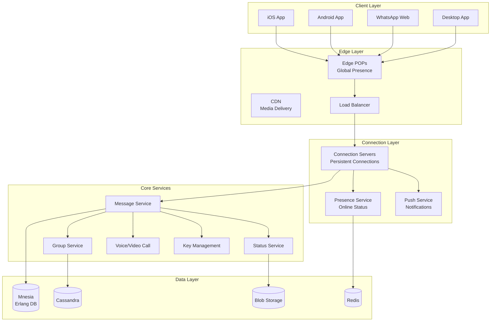
```mermaid
graph TB
    subgraph "Client Layer"
        IOS[iOS App]
        ANDROID[Android App]
        WEB[WhatsApp Web]
        DESKTOP[Desktop App]
    end

    subgraph "Edge Layer"
        CDN[CDN<br/>Media Delivery]
        EDGE_POP[Edge POPs<br/>Global Presence]
        LOAD_BAL[Load Balancer]
    end

    subgraph "Connection Layer"
        CONN_SERVER[Connection Servers<br/>Persistent Connections]
        PRESENCE_SVC[Presence Service<br/>Online Status]
        PUSH_SVC[Push Service<br/>Notifications]
    end

    subgraph "Core Services"
        MSG_SERVICE[Message Service]
        GROUP_SERVICE[Group Service]
        STATUS_SERVICE[Status Service]
        CALL_SERVICE[Voice/Video Call]
        KEY_SERVICE[Key Management]
    end

    subgraph "Data Layer"
        MNESIA[(Mnesia<br/>Erlang DB)]
        CASSANDRA[(Cassandra)]
        BLOB[(Blob Storage)]
        REDIS[(Redis)]
    end

    IOS --> EDGE_POP
    ANDROID --> EDGE_POP
    WEB --> EDGE_POP
    DESKTOP --> EDGE_POP

    EDGE_POP --> LOAD_BAL
    LOAD_BAL --> CONN_SERVER

    CONN_SERVER --> MSG_SERVICE
    CONN_SERVER --> PRESENCE_SVC
    CONN_SERVER --> PUSH_SVC

    MSG_SERVICE --> GROUP_SERVICE
    MSG_SERVICE --> STATUS_SERVICE
    MSG_SERVICE --> CALL_SERVICE
    MSG_SERVICE --> KEY_SERVICE

    MSG_SERVICE --> MNESIA
    GROUP_SERVICE --> CASSANDRA
    STATUS_SERVICE --> BLOB
    PRESENCE_SVC --> REDIS
```

## Core Components

### 1. Connection Management

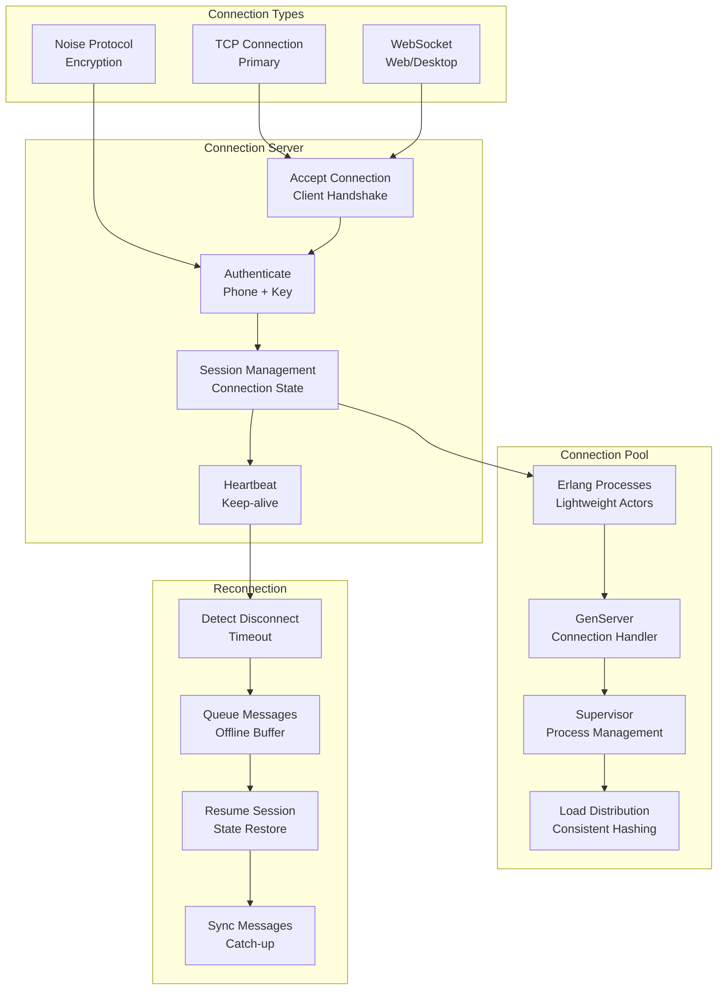
```mermaid
graph TD
    subgraph "Connection Types"
        TCP[TCP Connection<br/>Primary]
        WEBSOCKET[WebSocket<br/>Web/Desktop]
        NOISE[Noise Protocol<br/>Encryption]
    end

    subgraph "Connection Server"
        ACCEPT[Accept Connection<br/>Client Handshake]
        AUTH_CONN[Authenticate<br/>Phone + Key]
        SESSION[Session Management<br/>Connection State]
        HEARTBEAT_CONN[Heartbeat<br/>Keep-alive]
    end

    subgraph "Connection Pool"
        ERLANG_PROC[Erlang Processes<br/>Lightweight Actors]
        GEN_SERVER[GenServer<br/>Connection Handler]
        SUPERVISOR[Supervisor<br/>Process Management]
        LOAD_DIST[Load Distribution<br/>Consistent Hashing]
    end

    subgraph "Reconnection"
        DETECT_DROP[Detect Disconnect<br/>Timeout]
        QUEUE_MSG[Queue Messages<br/>Offline Buffer]
        RESUME[Resume Session<br/>State Restore]
        SYNC[Sync Messages<br/>Catch-up]
    end

    TCP --> ACCEPT
    WEBSOCKET --> ACCEPT
    NOISE --> AUTH_CONN

    ACCEPT --> AUTH_CONN
    AUTH_CONN --> SESSION
    SESSION --> HEARTBEAT_CONN

    SESSION --> ERLANG_PROC
    ERLANG_PROC --> GEN_SERVER
    GEN_SERVER --> SUPERVISOR
    SUPERVISOR --> LOAD_DIST

    HEARTBEAT_CONN --> DETECT_DROP
    DETECT_DROP --> QUEUE_MSG
    QUEUE_MSG --> RESUME
    RESUME --> SYNC
```

**Connection Features:**
- 2M+ concurrent connections per server
- Erlang/OTP for lightweight processes
- Sub-second reconnection
- Offline message queuing
- Technologies: Erlang, FreeBSD, Noise Protocol

### 2. Message Delivery System

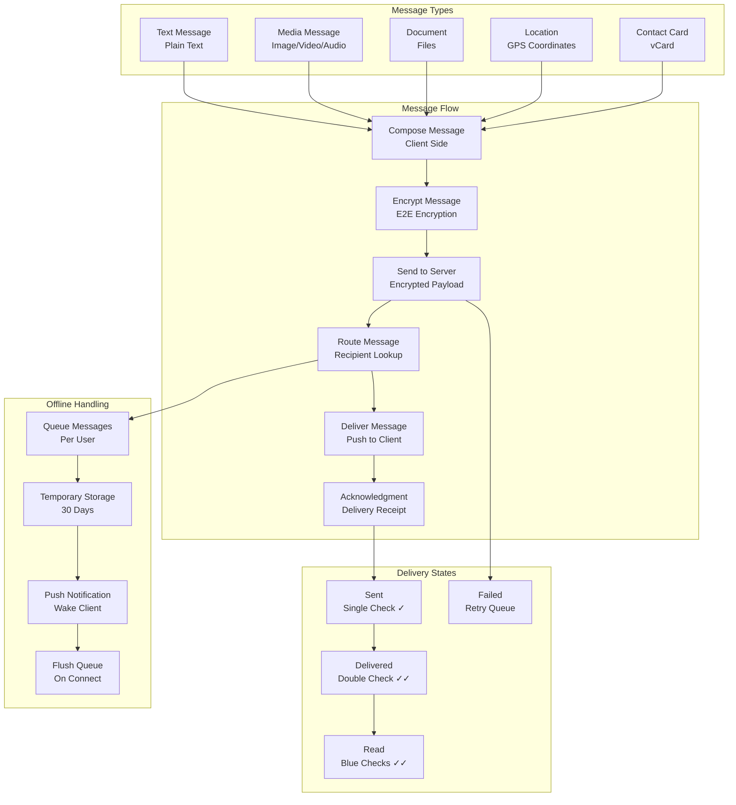
```mermaid
graph TD
    subgraph "Message Flow"
        COMPOSE[Compose Message<br/>Client Side]
        ENCRYPT[Encrypt Message<br/>E2E Encryption]
        SEND[Send to Server<br/>Encrypted Payload]
        ROUTE[Route Message<br/>Recipient Lookup]
        DELIVER[Deliver Message<br/>Push to Client]
        ACK[Acknowledgment<br/>Delivery Receipt]
    end

    subgraph "Delivery States"
        SENT[Sent<br/>Single Check ✓]
        DELIVERED[Delivered<br/>Double Check ✓✓]
        READ[Read<br/>Blue Checks ✓✓]
        FAILED[Failed<br/>Retry Queue]
    end

    subgraph "Offline Handling"
        QUEUE_OFFLINE[Queue Messages<br/>Per User]
        STORE_TEMP[Temporary Storage<br/>30 Days]
        NOTIFY[Push Notification<br/>Wake Client]
        FLUSH[Flush Queue<br/>On Connect]
    end

    subgraph "Message Types"
        TEXT[Text Message<br/>Plain Text]
        MEDIA_MSG[Media Message<br/>Image/Video/Audio]
        DOCUMENT[Document<br/>Files]
        LOCATION[Location<br/>GPS Coordinates]
        CONTACT[Contact Card<br/>vCard]
    end

    COMPOSE --> ENCRYPT
    ENCRYPT --> SEND
    SEND --> ROUTE
    ROUTE --> DELIVER
    DELIVER --> ACK

    ACK --> SENT
    SENT --> DELIVERED
    DELIVERED --> READ
    SEND --> FAILED

    ROUTE --> QUEUE_OFFLINE
    QUEUE_OFFLINE --> STORE_TEMP
    STORE_TEMP --> NOTIFY
    NOTIFY --> FLUSH

    TEXT --> COMPOSE
    MEDIA_MSG --> COMPOSE
    DOCUMENT --> COMPOSE
    LOCATION --> COMPOSE
    CONTACT --> COMPOSE
```

**Message Delivery Features:**
- At-least-once delivery guarantee
- 30-day offline message storage
- Read receipts tracking
- Multi-device sync
- Retry with exponential backoff

### 3. End-to-End Encryption (Signal Protocol)

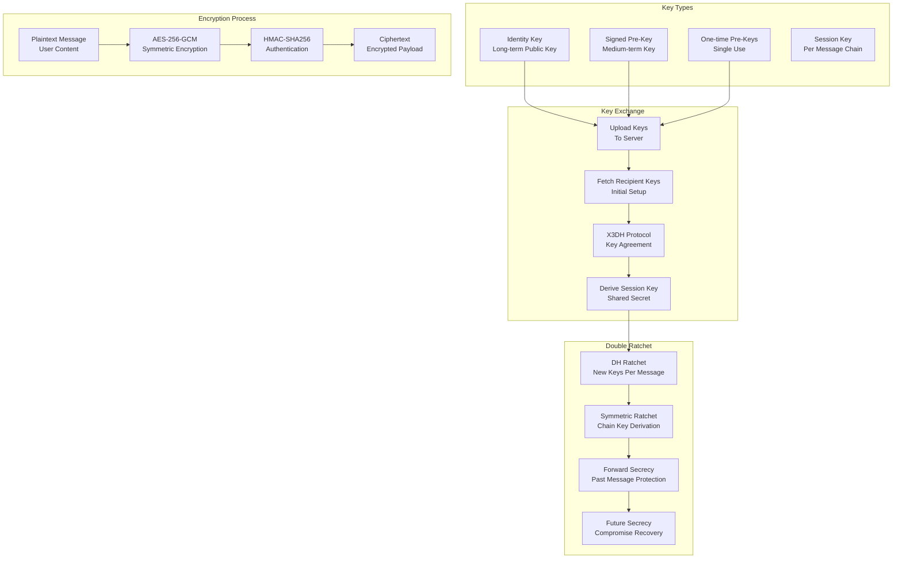
```mermaid
graph TD
    subgraph "Key Types"
        IDENTITY[Identity Key<br/>Long-term Public Key]
        SIGNED_PRE[Signed Pre-Key<br/>Medium-term Key]
        ONE_TIME[One-time Pre-Keys<br/>Single Use]
        SESSION_KEY[Session Key<br/>Per Message Chain]
    end

    subgraph "Key Exchange"
        UPLOAD_KEYS[Upload Keys<br/>To Server]
        FETCH_KEYS[Fetch Recipient Keys<br/>Initial Setup]
        X3DH[X3DH Protocol<br/>Key Agreement]
        DERIVE[Derive Session Key<br/>Shared Secret]
    end

    subgraph "Double Ratchet"
        DH_RATCHET[DH Ratchet<br/>New Keys Per Message]
        SYMMETRIC_RATCHET[Symmetric Ratchet<br/>Chain Key Derivation]
        FORWARD_SECRECY[Forward Secrecy<br/>Past Message Protection]
        FUTURE_SECRECY[Future Secrecy<br/>Compromise Recovery]
    end

    subgraph "Encryption Process"
        PLAINTEXT[Plaintext Message<br/>User Content]
        AES_GCM[AES-256-GCM<br/>Symmetric Encryption]
        HMAC[HMAC-SHA256<br/>Authentication]
        CIPHERTEXT[Ciphertext<br/>Encrypted Payload]
    end

    IDENTITY --> UPLOAD_KEYS
    SIGNED_PRE --> UPLOAD_KEYS
    ONE_TIME --> UPLOAD_KEYS

    UPLOAD_KEYS --> FETCH_KEYS
    FETCH_KEYS --> X3DH
    X3DH --> DERIVE

    DERIVE --> DH_RATCHET
    DH_RATCHET --> SYMMETRIC_RATCHET
    SYMMETRIC_RATCHET --> FORWARD_SECRECY
    FORWARD_SECRECY --> FUTURE_SECRECY

    PLAINTEXT --> AES_GCM
    AES_GCM --> HMAC
    HMAC --> CIPHERTEXT
```

**Signal Protocol Features:**
- Forward secrecy (past messages protected)
- Future secrecy (recovery from compromise)
- Deniability (no proof of sender)
- Asynchronous key exchange
- Multi-device support

### 4. Group Messaging

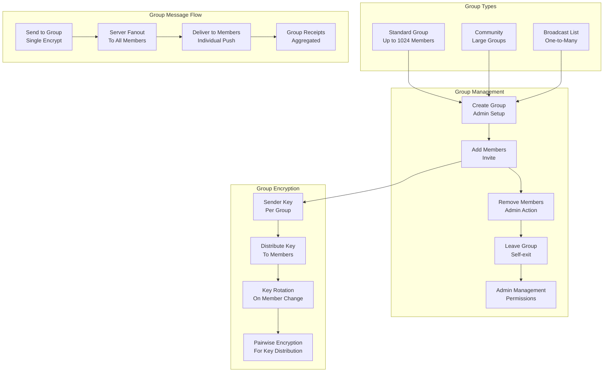
```mermaid
graph TD
    subgraph "Group Types"
        STANDARD[Standard Group<br/>Up to 1024 Members]
        COMMUNITY[Community<br/>Large Groups]
        BROADCAST[Broadcast List<br/>One-to-Many]
    end

    subgraph "Group Management"
        CREATE[Create Group<br/>Admin Setup]
        ADD_MEMBER[Add Members<br/>Invite]
        REMOVE_MEMBER[Remove Members<br/>Admin Action]
        LEAVE[Leave Group<br/>Self-exit]
        ADMIN_MGMT[Admin Management<br/>Permissions]
    end

    subgraph "Group Encryption"
        SENDER_KEY[Sender Key<br/>Per Group]
        DISTRIBUTE[Distribute Key<br/>To Members]
        ROTATE[Key Rotation<br/>On Member Change]
        PAIRWISE[Pairwise Encryption<br/>For Key Distribution]
    end

    subgraph "Group Message Flow"
        SEND_GROUP[Send to Group<br/>Single Encrypt]
        FANOUT[Server Fanout<br/>To All Members]
        MEMBER_DELIVER[Deliver to Members<br/>Individual Push]
        GROUP_ACK[Group Receipts<br/>Aggregated]
    end

    STANDARD --> CREATE
    COMMUNITY --> CREATE
    BROADCAST --> CREATE

    CREATE --> ADD_MEMBER
    ADD_MEMBER --> REMOVE_MEMBER
    REMOVE_MEMBER --> LEAVE
    LEAVE --> ADMIN_MGMT

    ADD_MEMBER --> SENDER_KEY
    SENDER_KEY --> DISTRIBUTE
    DISTRIBUTE --> ROTATE
    ROTATE --> PAIRWISE

    SEND_GROUP --> FANOUT
    FANOUT --> MEMBER_DELIVER
    MEMBER_DELIVER --> GROUP_ACK
```

**Group Features:**
- Sender Key protocol for efficiency
- Single encryption for all members
- Key rotation on membership changes
- Admin controls and permissions

### 5. Voice & Video Calling

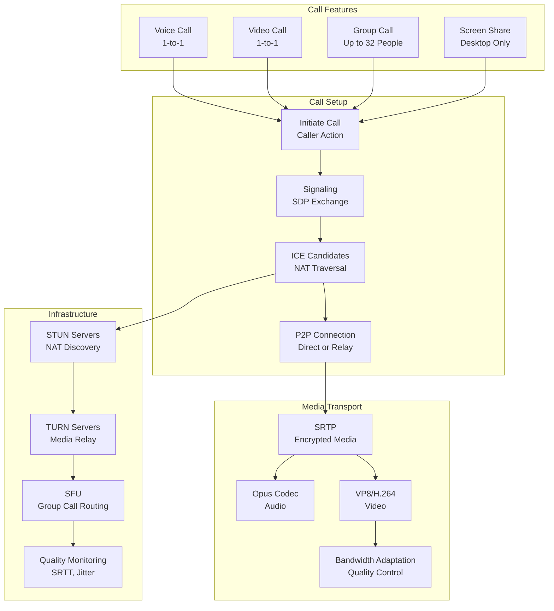
```mermaid
graph TD
    subgraph "Call Setup"
        INITIATE[Initiate Call<br/>Caller Action]
        SIGNAL[Signaling<br/>SDP Exchange]
        ICE[ICE Candidates<br/>NAT Traversal]
        CONNECT[P2P Connection<br/>Direct or Relay]
    end

    subgraph "Media Transport"
        SRTP[SRTP<br/>Encrypted Media]
        OPUS[Opus Codec<br/>Audio]
        VP8[VP8/H.264<br/>Video]
        BANDWIDTH[Bandwidth Adaptation<br/>Quality Control]
    end

    subgraph "Call Features"
        VOICE[Voice Call<br/>1-to-1]
        VIDEO[Video Call<br/>1-to-1]
        GROUP_CALL[Group Call<br/>Up to 32 People]
        SCREEN_SHARE[Screen Share<br/>Desktop Only]
    end

    subgraph "Infrastructure"
        STUN[STUN Servers<br/>NAT Discovery]
        TURN[TURN Servers<br/>Media Relay]
        SFU[SFU<br/>Group Call Routing]
        QUALITY[Quality Monitoring<br/>SRTT, Jitter]
    end

    INITIATE --> SIGNAL
    SIGNAL --> ICE
    ICE --> CONNECT

    CONNECT --> SRTP
    SRTP --> OPUS
    SRTP --> VP8
    VP8 --> BANDWIDTH

    VOICE --> INITIATE
    VIDEO --> INITIATE
    GROUP_CALL --> INITIATE
    SCREEN_SHARE --> INITIATE

    ICE --> STUN
    STUN --> TURN
    TURN --> SFU
    SFU --> QUALITY
```

**Calling Features:**
- Peer-to-peer with TURN fallback
- End-to-end encrypted media
- Adaptive bitrate streaming
- Group calls up to 32 participants

### 6. Status (Stories) System

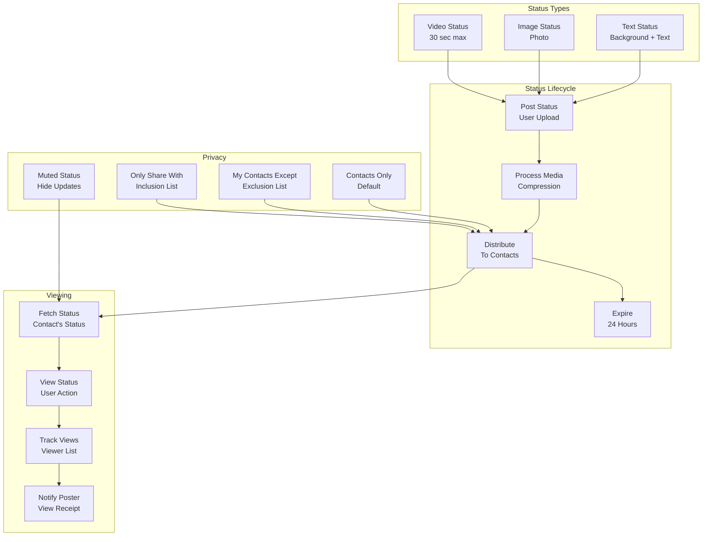
```mermaid
graph TD
    subgraph "Status Types"
        TEXT_STATUS[Text Status<br/>Background + Text]
        IMAGE_STATUS[Image Status<br/>Photo]
        VIDEO_STATUS[Video Status<br/>30 sec max]
    end

    subgraph "Status Lifecycle"
        POST[Post Status<br/>User Upload]
        PROCESS[Process Media<br/>Compression]
        DISTRIBUTE_STATUS[Distribute<br/>To Contacts]
        EXPIRE[Expire<br/>24 Hours]
    end

    subgraph "Viewing"
        FETCH_STATUS[Fetch Status<br/>Contact's Status]
        VIEW_STATUS[View Status<br/>User Action]
        TRACK_VIEW[Track Views<br/>Viewer List]
        NOTIFY_VIEW[Notify Poster<br/>View Receipt]
    end

    subgraph "Privacy"
        CONTACTS_ONLY[Contacts Only<br/>Default]
        EXCEPT[My Contacts Except<br/>Exclusion List]
        CUSTOM[Only Share With<br/>Inclusion List]
        MUTE[Muted Status<br/>Hide Updates]
    end

    TEXT_STATUS --> POST
    IMAGE_STATUS --> POST
    VIDEO_STATUS --> POST

    POST --> PROCESS
    PROCESS --> DISTRIBUTE_STATUS
    DISTRIBUTE_STATUS --> EXPIRE

    DISTRIBUTE_STATUS --> FETCH_STATUS
    FETCH_STATUS --> VIEW_STATUS
    VIEW_STATUS --> TRACK_VIEW
    TRACK_VIEW --> NOTIFY_VIEW

    CONTACTS_ONLY --> DISTRIBUTE_STATUS
    EXCEPT --> DISTRIBUTE_STATUS
    CUSTOM --> DISTRIBUTE_STATUS
    MUTE --> FETCH_STATUS
```

## Data Architecture

### 1. Mnesia (Erlang Database)

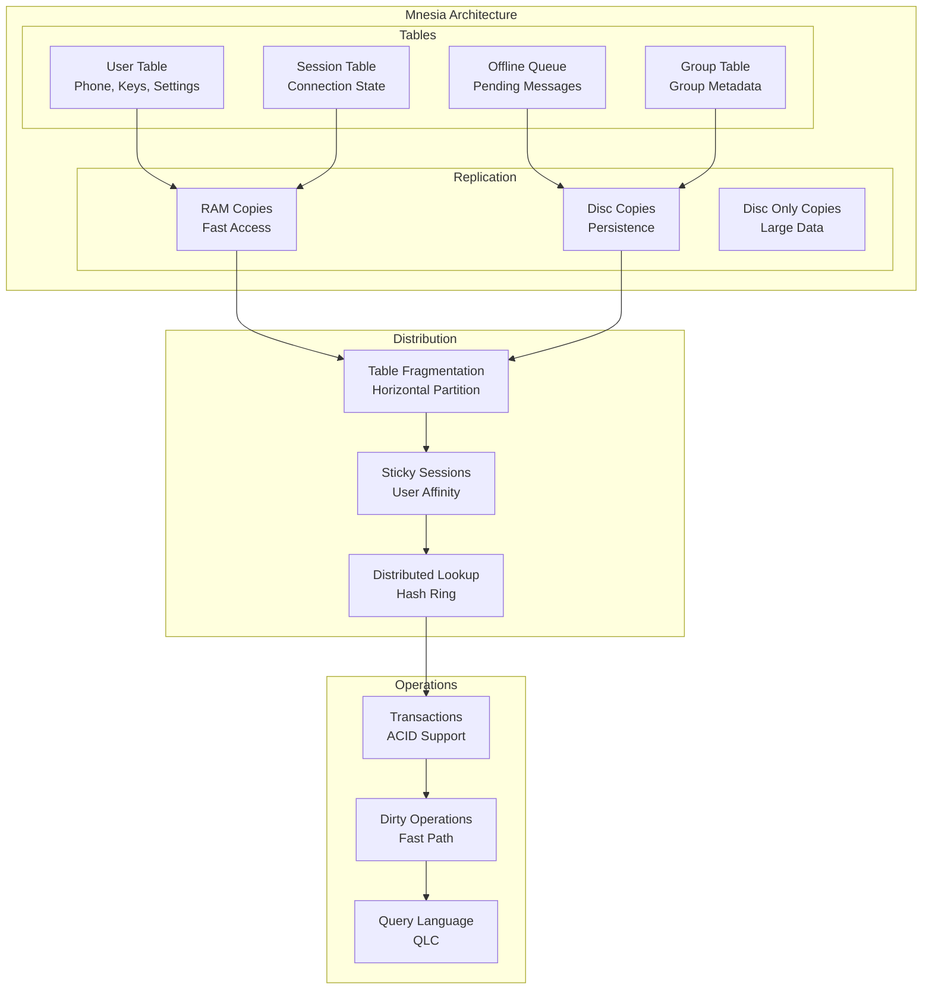
```mermaid
graph TD
    subgraph "Mnesia Architecture"
        subgraph "Tables"
            USER_TABLE[User Table<br/>Phone, Keys, Settings]
            SESSION_TABLE[Session Table<br/>Connection State]
            OFFLINE_TABLE[Offline Queue<br/>Pending Messages]
            GROUP_TABLE[Group Table<br/>Group Metadata]
        end

        subgraph "Replication"
            RAM_COPY[RAM Copies<br/>Fast Access]
            DISC_COPY[Disc Copies<br/>Persistence]
            DISC_ONLY[Disc Only Copies<br/>Large Data]
        end
    end

    subgraph "Distribution"
        FRAGMENT[Table Fragmentation<br/>Horizontal Partition]
        STICKY[Sticky Sessions<br/>User Affinity]
        LOOKUP[Distributed Lookup<br/>Hash Ring]
    end

    subgraph "Operations"
        TRANSACTION[Transactions<br/>ACID Support]
        DIRTY[Dirty Operations<br/>Fast Path]
        QUERY[Query Language<br/>QLC]
    end

    USER_TABLE --> RAM_COPY
    SESSION_TABLE --> RAM_COPY
    OFFLINE_TABLE --> DISC_COPY
    GROUP_TABLE --> DISC_COPY

    RAM_COPY --> FRAGMENT
    DISC_COPY --> FRAGMENT
    FRAGMENT --> STICKY
    STICKY --> LOOKUP

    LOOKUP --> TRANSACTION
    TRANSACTION --> DIRTY
    DIRTY --> QUERY
```

### 2. Cassandra (Message Storage)

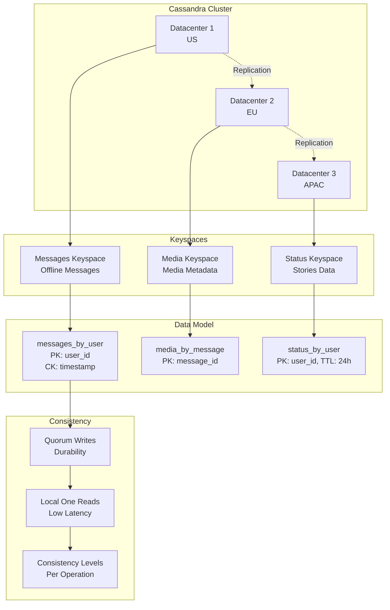
```mermaid
graph TD
    subgraph "Cassandra Cluster"
        DC1[Datacenter 1<br/>US]
        DC2[Datacenter 2<br/>EU]
        DC3[Datacenter 3<br/>APAC]
    end

    subgraph "Keyspaces"
        MSG_KS[Messages Keyspace<br/>Offline Messages]
        MEDIA_KS[Media Keyspace<br/>Media Metadata]
        STATUS_KS[Status Keyspace<br/>Stories Data]
    end

    subgraph "Data Model"
        MSG_BY_USER[messages_by_user<br/>PK: user_id<br/>CK: timestamp]
        MEDIA_BY_MSG[media_by_message<br/>PK: message_id]
        STATUS_BY_USER[status_by_user<br/>PK: user_id, TTL: 24h]
    end

    subgraph "Consistency"
        QUORUM[Quorum Writes<br/>Durability]
        LOCAL_ONE[Local One Reads<br/>Low Latency]
        CL_CONFIG[Consistency Levels<br/>Per Operation]
    end

    DC1 -.->|Replication| DC2
    DC2 -.->|Replication| DC3

    DC1 --> MSG_KS
    DC2 --> MEDIA_KS
    DC3 --> STATUS_KS

    MSG_KS --> MSG_BY_USER
    MEDIA_KS --> MEDIA_BY_MSG
    STATUS_KS --> STATUS_BY_USER

    MSG_BY_USER --> QUORUM
    QUORUM --> LOCAL_ONE
    LOCAL_ONE --> CL_CONFIG
```

### 3. Blob Storage (Media)

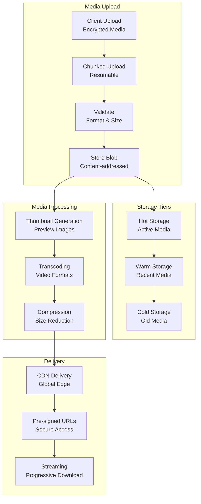
```mermaid
graph TD
    subgraph "Media Upload"
        CLIENT_UPLOAD[Client Upload<br/>Encrypted Media]
        CHUNK[Chunked Upload<br/>Resumable]
        VALIDATE[Validate<br/>Format & Size]
        STORE[Store Blob<br/>Content-addressed]
    end

    subgraph "Storage Tiers"
        HOT[Hot Storage<br/>Active Media]
        WARM[Warm Storage<br/>Recent Media]
        COLD[Cold Storage<br/>Old Media]
    end

    subgraph "Media Processing"
        THUMBNAIL[Thumbnail Generation<br/>Preview Images]
        TRANSCODE[Transcoding<br/>Video Formats]
        COMPRESS[Compression<br/>Size Reduction]
    end

    subgraph "Delivery"
        CDN_MEDIA[CDN Delivery<br/>Global Edge]
        PRESIGNED[Pre-signed URLs<br/>Secure Access]
        STREAM[Streaming<br/>Progressive Download]
    end

    CLIENT_UPLOAD --> CHUNK
    CHUNK --> VALIDATE
    VALIDATE --> STORE

    STORE --> HOT
    HOT --> WARM
    WARM --> COLD

    STORE --> THUMBNAIL
    THUMBNAIL --> TRANSCODE
    TRANSCODE --> COMPRESS

    COMPRESS --> CDN_MEDIA
    CDN_MEDIA --> PRESIGNED
    PRESIGNED --> STREAM
```

## Scalability & Performance

### 1. Erlang/OTP Architecture

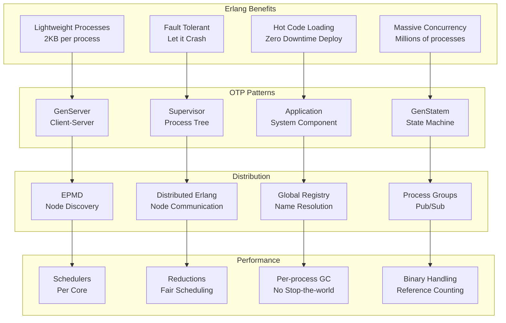
```mermaid
graph TD
    subgraph "Erlang Benefits"
        LIGHTWEIGHT[Lightweight Processes<br/>2KB per process]
        CONCURRENT[Massive Concurrency<br/>Millions of processes]
        FAULT_TOLERANT[Fault Tolerant<br/>Let it Crash]
        HOT_CODE[Hot Code Loading<br/>Zero Downtime Deploy]
    end

    subgraph "OTP Patterns"
        GEN_SERVER_OTP[GenServer<br/>Client-Server]
        GEN_STATEM[GenStatem<br/>State Machine]
        SUPERVISOR_OTP[Supervisor<br/>Process Tree]
        APPLICATION[Application<br/>System Component]
    end

    subgraph "Distribution"
        EPMD[EPMD<br/>Node Discovery]
        DISTERL[Distributed Erlang<br/>Node Communication]
        GLOBAL[Global Registry<br/>Name Resolution]
        PG[Process Groups<br/>Pub/Sub]
    end

    subgraph "Performance"
        SCHEDULER[Schedulers<br/>Per Core]
        REDUCTION[Reductions<br/>Fair Scheduling]
        GC[Per-process GC<br/>No Stop-the-world]
        BINARY[Binary Handling<br/>Reference Counting]
    end

    LIGHTWEIGHT --> GEN_SERVER_OTP
    CONCURRENT --> GEN_STATEM
    FAULT_TOLERANT --> SUPERVISOR_OTP
    HOT_CODE --> APPLICATION

    GEN_SERVER_OTP --> EPMD
    SUPERVISOR_OTP --> DISTERL
    APPLICATION --> GLOBAL
    GEN_STATEM --> PG

    EPMD --> SCHEDULER
    DISTERL --> REDUCTION
    GLOBAL --> GC
    PG --> BINARY
```

### 2. Global Infrastructure

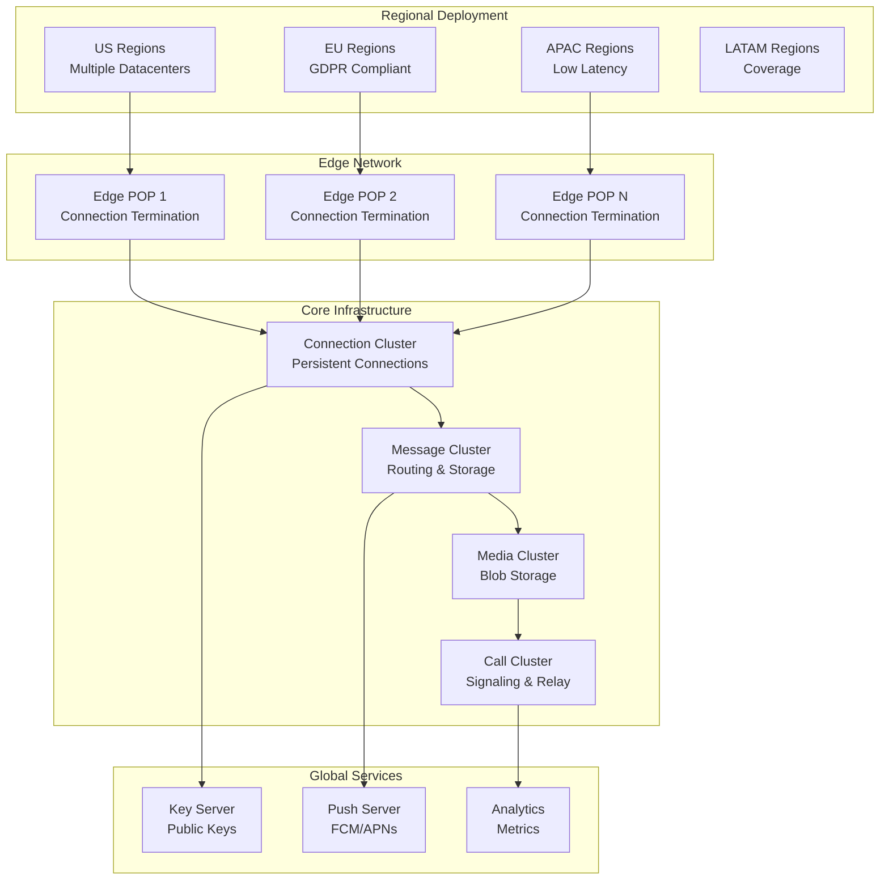
```mermaid
graph TB
    subgraph "Regional Deployment"
        US_REGION[US Regions<br/>Multiple Datacenters]
        EU_REGION[EU Regions<br/>GDPR Compliant]
        APAC_REGION[APAC Regions<br/>Low Latency]
        LATAM_REGION[LATAM Regions<br/>Coverage]
    end

    subgraph "Edge Network"
        POP1[Edge POP 1<br/>Connection Termination]
        POP2[Edge POP 2<br/>Connection Termination]
        POPN[Edge POP N<br/>Connection Termination]
    end

    subgraph "Core Infrastructure"
        CONN_CLUSTER[Connection Cluster<br/>Persistent Connections]
        MSG_CLUSTER[Message Cluster<br/>Routing & Storage]
        MEDIA_CLUSTER[Media Cluster<br/>Blob Storage]
        CALL_CLUSTER[Call Cluster<br/>Signaling & Relay]
    end

    subgraph "Global Services"
        KEY_SERVER[Key Server<br/>Public Keys]
        PUSH_SERVER[Push Server<br/>FCM/APNs]
        ANALYTICS[Analytics<br/>Metrics]
    end

    US_REGION --> POP1
    EU_REGION --> POP2
    APAC_REGION --> POPN

    POP1 --> CONN_CLUSTER
    POP2 --> CONN_CLUSTER
    POPN --> CONN_CLUSTER

    CONN_CLUSTER --> MSG_CLUSTER
    MSG_CLUSTER --> MEDIA_CLUSTER
    MEDIA_CLUSTER --> CALL_CLUSTER

    CONN_CLUSTER --> KEY_SERVER
    MSG_CLUSTER --> PUSH_SERVER
    CALL_CLUSTER --> ANALYTICS
```

### 3. Performance Optimization

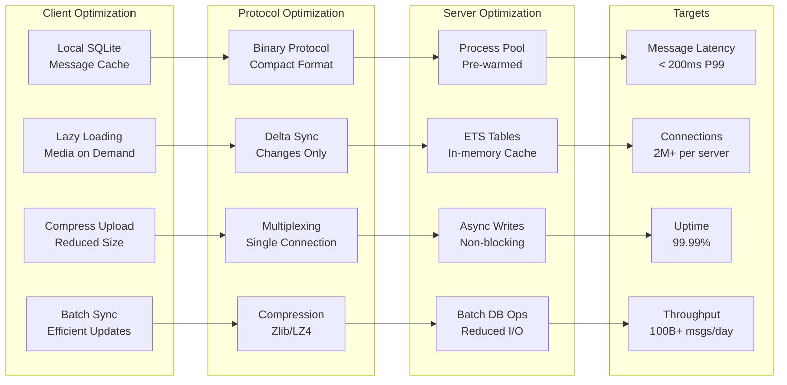
```mermaid
graph LR
    subgraph "Client Optimization"
        LOCAL_DB[Local SQLite<br/>Message Cache]
        LAZY_LOAD[Lazy Loading<br/>Media on Demand]
        COMPRESS_UPLOAD[Compress Upload<br/>Reduced Size]
        BATCH_SYNC[Batch Sync<br/>Efficient Updates]
    end

    subgraph "Protocol Optimization"
        BINARY_PROTO[Binary Protocol<br/>Compact Format]
        DELTA_SYNC[Delta Sync<br/>Changes Only]
        MULTIPLEXING[Multiplexing<br/>Single Connection]
        COMPRESS_PROTO[Compression<br/>Zlib/LZ4]
    end

    subgraph "Server Optimization"
        PROCESS_POOL[Process Pool<br/>Pre-warmed]
        ETS[ETS Tables<br/>In-memory Cache]
        ASYNC_WRITE[Async Writes<br/>Non-blocking]
        BATCH_DB[Batch DB Ops<br/>Reduced I/O]
    end

    subgraph "Targets"
        MSG_LATENCY[Message Latency<br/>< 200ms P99]
        CONN_SCALE[Connections<br/>2M+ per server]
        UPTIME[Uptime<br/>99.99%]
        THROUGHPUT[Throughput<br/>100B+ msgs/day]
    end

    LOCAL_DB --> BINARY_PROTO
    LAZY_LOAD --> DELTA_SYNC
    COMPRESS_UPLOAD --> MULTIPLEXING
    BATCH_SYNC --> COMPRESS_PROTO

    BINARY_PROTO --> PROCESS_POOL
    DELTA_SYNC --> ETS
    MULTIPLEXING --> ASYNC_WRITE
    COMPRESS_PROTO --> BATCH_DB

    PROCESS_POOL --> MSG_LATENCY
    ETS --> CONN_SCALE
    ASYNC_WRITE --> UPTIME
    BATCH_DB --> THROUGHPUT
```

## Security & Privacy

### 1. Privacy Architecture

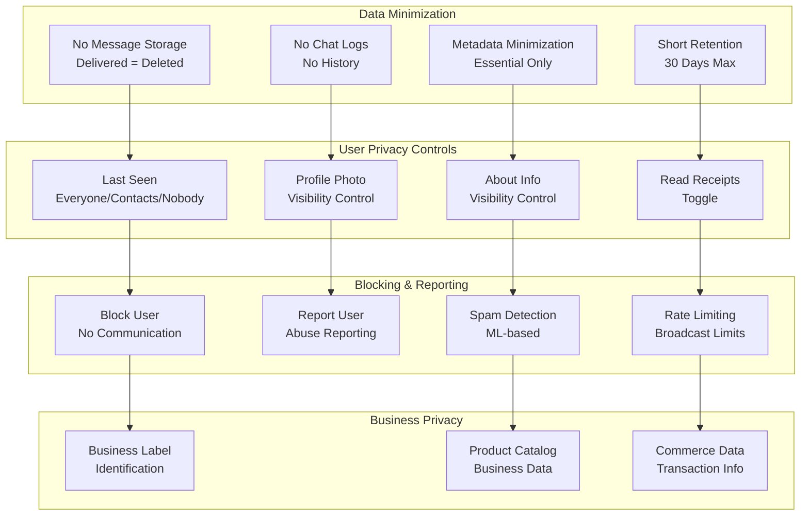
```mermaid
graph TD
    subgraph "Data Minimization"
        NO_MSG_STORE[No Message Storage<br/>Delivered = Deleted]
        NO_LOGS[No Chat Logs<br/>No History]
        METADATA_MIN[Metadata Minimization<br/>Essential Only]
        RETENTION[Short Retention<br/>30 Days Max]
    end

    subgraph "User Privacy Controls"
        LAST_SEEN[Last Seen<br/>Everyone/Contacts/Nobody]
        PROFILE_PHOTO[Profile Photo<br/>Visibility Control]
        ABOUT[About Info<br/>Visibility Control]
        READ_RECEIPTS[Read Receipts<br/>Toggle]
    end

    subgraph "Blocking & Reporting"
        BLOCK_USER[Block User<br/>No Communication]
        REPORT[Report User<br/>Abuse Reporting]
        SPAM_DETECT[Spam Detection<br/>ML-based]
        RATE_LIMIT_PRIVACY[Rate Limiting<br/>Broadcast Limits]
    end

    subgraph "Business Privacy"
        BUSINESS_LABEL[Business Label<br/>Identification]
        PRODUCT_CATALOG[Product Catalog<br/>Business Data]
        COMMERCE_DATA[Commerce Data<br/>Transaction Info]
    end

    NO_MSG_STORE --> LAST_SEEN
    NO_LOGS --> PROFILE_PHOTO
    METADATA_MIN --> ABOUT
    RETENTION --> READ_RECEIPTS

    LAST_SEEN --> BLOCK_USER
    PROFILE_PHOTO --> REPORT
    ABOUT --> SPAM_DETECT
    READ_RECEIPTS --> RATE_LIMIT_PRIVACY

    BLOCK_USER --> BUSINESS_LABEL
    SPAM_DETECT --> PRODUCT_CATALOG
    RATE_LIMIT_PRIVACY --> COMMERCE_DATA
```

### 2. Security Measures

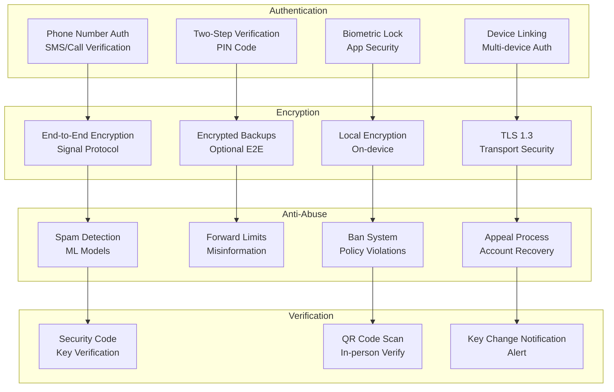
```mermaid
graph TB
    subgraph "Authentication"
        PHONE_AUTH[Phone Number Auth<br/>SMS/Call Verification]
        TWO_STEP[Two-Step Verification<br/>PIN Code]
        BIOMETRIC_AUTH[Biometric Lock<br/>App Security]
        DEVICE_LINK[Device Linking<br/>Multi-device Auth]
    end

    subgraph "Encryption"
        E2E[End-to-End Encryption<br/>Signal Protocol]
        ENCRYPTED_BACKUP[Encrypted Backups<br/>Optional E2E]
        LOCAL_ENCRYPT[Local Encryption<br/>On-device]
        TLS_SEC[TLS 1.3<br/>Transport Security]
    end

    subgraph "Anti-Abuse"
        SPAM_ML[Spam Detection<br/>ML Models]
        FORWARD_LIMIT[Forward Limits<br/>Misinformation]
        BAN_SYSTEM[Ban System<br/>Policy Violations]
        APPEAL[Appeal Process<br/>Account Recovery]
    end

    subgraph "Verification"
        SECURITY_CODE[Security Code<br/>Key Verification]
        QR_VERIFY[QR Code Scan<br/>In-person Verify]
        KEY_CHANGE[Key Change Notification<br/>Alert]
    end

    PHONE_AUTH --> E2E
    TWO_STEP --> ENCRYPTED_BACKUP
    BIOMETRIC_AUTH --> LOCAL_ENCRYPT
    DEVICE_LINK --> TLS_SEC

    E2E --> SPAM_ML
    ENCRYPTED_BACKUP --> FORWARD_LIMIT
    LOCAL_ENCRYPT --> BAN_SYSTEM
    TLS_SEC --> APPEAL

    SPAM_ML --> SECURITY_CODE
    BAN_SYSTEM --> QR_VERIFY
    APPEAL --> KEY_CHANGE
```

## Monitoring & Operations

### 1. Monitoring Stack

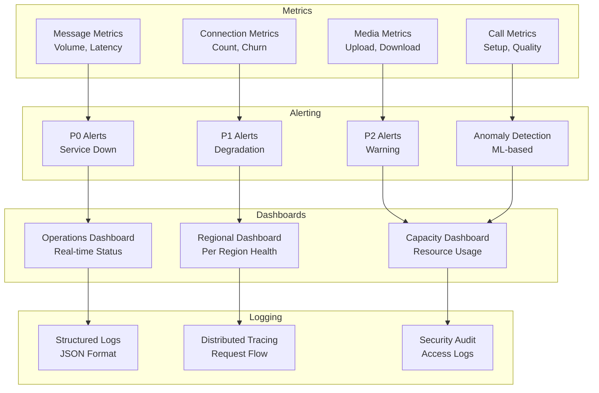
```mermaid
graph TD
    subgraph "Metrics"
        MSG_METRICS[Message Metrics<br/>Volume, Latency]
        CONN_METRICS[Connection Metrics<br/>Count, Churn]
        MEDIA_METRICS[Media Metrics<br/>Upload, Download]
        CALL_METRICS[Call Metrics<br/>Setup, Quality]
    end

    subgraph "Alerting"
        P0[P0 Alerts<br/>Service Down]
        P1[P1 Alerts<br/>Degradation]
        P2[P2 Alerts<br/>Warning]
        ANOMALY[Anomaly Detection<br/>ML-based]
    end

    subgraph "Dashboards"
        OPS_DASH[Operations Dashboard<br/>Real-time Status]
        REGION_DASH[Regional Dashboard<br/>Per Region Health]
        CAPACITY_DASH[Capacity Dashboard<br/>Resource Usage]
    end

    subgraph "Logging"
        STRUCTURED_LOG[Structured Logs<br/>JSON Format]
        TRACE[Distributed Tracing<br/>Request Flow]
        AUDIT_SEC[Security Audit<br/>Access Logs]
    end

    MSG_METRICS --> P0
    CONN_METRICS --> P1
    MEDIA_METRICS --> P2
    CALL_METRICS --> ANOMALY

    P0 --> OPS_DASH
    P1 --> REGION_DASH
    P2 --> CAPACITY_DASH
    ANOMALY --> CAPACITY_DASH

    OPS_DASH --> STRUCTURED_LOG
    REGION_DASH --> TRACE
    CAPACITY_DASH --> AUDIT_SEC
```

## Deployment and DevOps

### 1. Continuous Deployment Pipeline

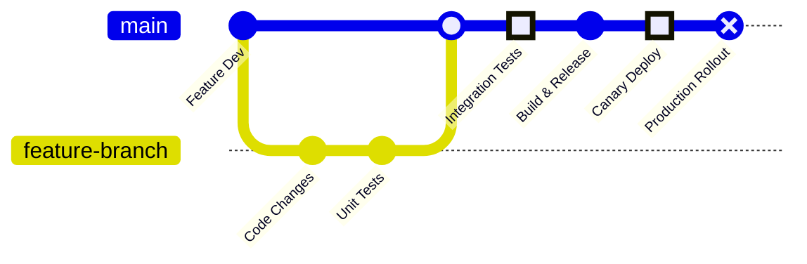
```mermaid
gitGraph
    commit id: "Feature Dev"
    branch feature-branch
    checkout feature-branch
    commit id: "Code Changes"
    commit id: "Unit Tests"
    checkout main
    merge feature-branch
    commit id: "Integration Tests" type: HIGHLIGHT
    commit id: "Build & Release"
    commit id: "Canary Deploy" type: HIGHLIGHT
    commit id: "Production Rollout" type: REVERSE
```

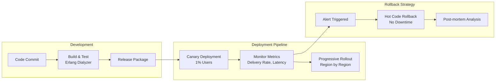
```mermaid
flowchart LR
    subgraph "Development"
        CODE[Code Commit]
        BUILD[Build & Test<br/>Erlang Dialyzer]
        ARTIFACT[Release Package]
    end

    subgraph "Deployment Pipeline"
        CANARY[Canary Deployment<br/>1% Users]
        MONITOR[Monitor Metrics<br/>Delivery Rate, Latency]
        ROLLOUT[Progressive Rollout<br/>Region by Region]
    end

    subgraph "Rollback Strategy"
        ALERT[Alert Triggered]
        HOT_ROLLBACK[Hot Code Rollback<br/>No Downtime]
        POSTMORTEM[Post-mortem Analysis]
    end

    CODE --> BUILD
    BUILD --> ARTIFACT
    ARTIFACT --> CANARY
    CANARY --> MONITOR
    MONITOR --> ROLLOUT
    MONITOR --> ALERT
    ALERT --> HOT_ROLLBACK
    HOT_ROLLBACK --> POSTMORTEM
```

- **Erlang hot code loading**: Zero-downtime deployments
- **Regional rollout**: Country-by-country deployment
- **Canary analysis**: Automated metric comparison
- **Instant rollback**: Hot code swap capability

### 2. Infrastructure Management
- **Configuration management**: Centralized config distribution
- **Erlang releases**: OTP release handling
- **Container orchestration**: Custom clustering

### 3. Chaos Engineering

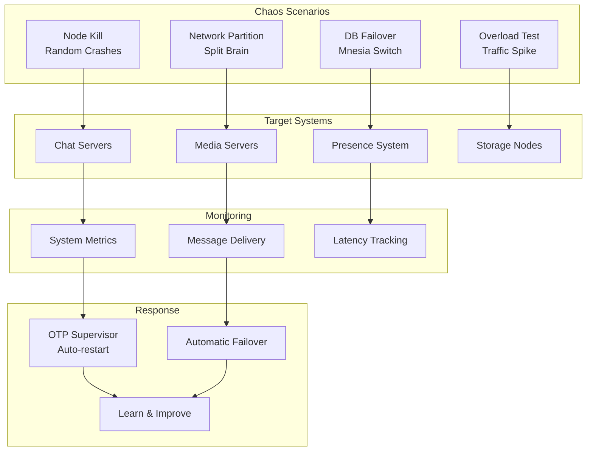
```mermaid
flowchart TD
    subgraph "Chaos Scenarios"
        NODE_KILL[Node Kill<br/>Random Crashes]
        NETWORK_PART[Network Partition<br/>Split Brain]
        DB_FAILOVER[DB Failover<br/>Mnesia Switch]
        OVERLOAD[Overload Test<br/>Traffic Spike]
    end

    subgraph "Target Systems"
        CHAT_SERVERS[Chat Servers]
        MEDIA_SERVERS[Media Servers]
        PRESENCE_SYS[Presence System]
        STORAGE[Storage Nodes]
    end

    subgraph "Monitoring"
        METRICS[System Metrics]
        MSG_DELIVERY[Message Delivery]
        LATENCY[Latency Tracking]
    end

    subgraph "Response"
        SUPERVISOR[OTP Supervisor<br/>Auto-restart]
        FAILOVER[Automatic Failover]
        LEARN[Learn & Improve]
    end

    NODE_KILL --> CHAT_SERVERS
    NETWORK_PART --> MEDIA_SERVERS
    DB_FAILOVER --> PRESENCE_SYS
    OVERLOAD --> STORAGE

    CHAT_SERVERS --> METRICS
    MEDIA_SERVERS --> MSG_DELIVERY
    PRESENCE_SYS --> LATENCY

    METRICS --> SUPERVISOR
    MSG_DELIVERY --> FAILOVER
    SUPERVISOR --> LEARN
    FAILOVER --> LEARN
```

- **Erlang "let it crash"**: Built-in fault tolerance
- **Supervisor trees**: Automatic process recovery
- **Network partition testing**: Split-brain scenarios
- **Load testing**: Peak traffic simulation

## Analytics and Machine Learning

### 1. Data Pipeline

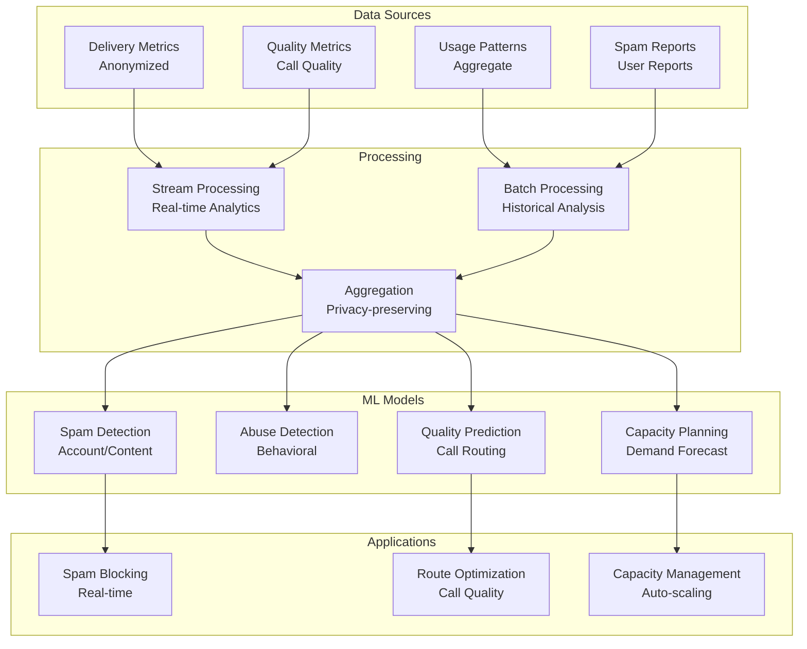
```mermaid
flowchart TD
    subgraph "Data Sources"
        DELIVERY[Delivery Metrics<br/>Anonymized]
        QUALITY[Quality Metrics<br/>Call Quality]
        USAGE[Usage Patterns<br/>Aggregate]
        SPAM_DATA[Spam Reports<br/>User Reports]
    end

    subgraph "Processing"
        STREAM[Stream Processing<br/>Real-time Analytics]
        BATCH[Batch Processing<br/>Historical Analysis]
        AGGREGATE[Aggregation<br/>Privacy-preserving]
    end

    subgraph "ML Models"
        SPAM_ML[Spam Detection<br/>Account/Content]
        ABUSE_ML[Abuse Detection<br/>Behavioral]
        QUALITY_ML[Quality Prediction<br/>Call Routing]
        CAPACITY_ML[Capacity Planning<br/>Demand Forecast]
    end

    subgraph "Applications"
        SPAM_BLOCK[Spam Blocking<br/>Real-time]
        ROUTE_OPT[Route Optimization<br/>Call Quality]
        CAPACITY[Capacity Management<br/>Auto-scaling]
    end

    DELIVERY --> STREAM
    QUALITY --> STREAM
    USAGE --> BATCH
    SPAM_DATA --> BATCH

    STREAM --> AGGREGATE
    BATCH --> AGGREGATE

    AGGREGATE --> SPAM_ML
    AGGREGATE --> ABUSE_ML
    AGGREGATE --> QUALITY_ML
    AGGREGATE --> CAPACITY_ML

    SPAM_ML --> SPAM_BLOCK
    QUALITY_ML --> ROUTE_OPT
    CAPACITY_ML --> CAPACITY
```

### 2. ML Use Cases (Privacy-Preserving)
- **Spam detection**: Account and content spam without reading messages
- **Abuse prevention**: Behavioral pattern detection
- **Quality optimization**: Call routing and media server selection
- **Capacity planning**: Regional demand forecasting
- **Note**: All ML is done on metadata, never on message content

## Cost Optimization

### 1. Infrastructure Cost Distribution

```mermaid
pie title WhatsApp Infrastructure Cost Distribution
    "Compute (Erlang Servers)" : 30
    "Network & Bandwidth" : 25
    "Storage (Media)" : 20
    "Database (Mnesia, Cassandra)" : 15
    "CDN & Edge" : 7
    "Monitoring & Operations" : 3
```

### 2. Cost Efficiency Strategies

```mermaid
graph TD
    subgraph "Compute Efficiency"
        ERLANG[Erlang Efficiency<br/>Millions of Processes]
        SMALL_TEAM[Small Team<br/>50 Engineers]
        HIGH_DENSITY[High Density<br/>More Users per Server]
        CUSTOM_OPT[Custom Optimizations<br/>Protocol Efficiency]
    end

    subgraph "Network Efficiency"
        BINARY_PROTO[Binary Protocol<br/>Minimal Overhead]
        COMPRESSION[Compression<br/>Data Reduction]
        PERSISTENT_CONN[Persistent Connections<br/>Reduced Handshakes]
        BATCHING[Message Batching<br/>Reduced RTTs]
    end

    subgraph "Storage Efficiency"
        MEDIA_EXPIRE[Media Expiration<br/>Auto-delete]
        NO_MSG_STORE[No Message Storage<br/>Delete After Delivery]
        DEDUPE[Media Deduplication<br/>Shared Storage]
        TIERED[Tiered Storage<br/>Hot/Cold]
    end

    subgraph "Operational Efficiency"
        AUTOMATION[Full Automation<br/>No Manual Ops]
        SELF_HEALING[Self-healing<br/>OTP Supervisors]
        MINIMAL_OVERHEAD[Minimal Overhead<br/>Lean Operations]
    end

    ERLANG --> BINARY_PROTO
    SMALL_TEAM --> COMPRESSION
    HIGH_DENSITY --> PERSISTENT_CONN
    CUSTOM_OPT --> BATCHING

    BINARY_PROTO --> MEDIA_EXPIRE
    COMPRESSION --> NO_MSG_STORE
    PERSISTENT_CONN --> DEDUPE
    BATCHING --> TIERED

    MEDIA_EXPIRE --> AUTOMATION
    NO_MSG_STORE --> SELF_HEALING
    DEDUPE --> MINIMAL_OVERHEAD
```

## Future Architecture Considerations

### 1. Emerging Technologies

```mermaid
graph TD
    subgraph "Multi-Device"
        LINKED_DEVICES[Linked Devices<br/>Multi-device Sync]
        DEVICE_SYNC[Device Sync<br/>Cross-platform]
        WEB_COMPANION[Web Companion<br/>Browser Access]
        DESKTOP[Desktop Apps<br/>Native Experience]
    end

    subgraph "Privacy Evolution"
        VIEW_ONCE[View Once<br/>Self-destructing]
        DISAPPEARING[Disappearing Messages<br/>Auto-delete]
        PRIVATE_GROUPS[Private Groups<br/>Invite Links]
        BACKUP_ENCRYPT[Backup Encryption<br/>E2E Cloud Backup]
    end

    subgraph "Business Platform"
        WHATSAPP_BIZ[WhatsApp Business<br/>Enterprise API]
        CATALOG[Product Catalogs<br/>Shopping]
        PAYMENTS[WhatsApp Pay<br/>In-chat Payments]
        AI_BOT[AI Chatbots<br/>Customer Service]
    end

    subgraph "Technical Evolution"
        WEBRTC_NEXT[WebRTC Evolution<br/>AV1 Codec]
        MLS[MLS Protocol<br/>Group Encryption]
        INTEROP[Interoperability<br/>Cross-platform Messages]
        QUANTUM_SAFE[Quantum-safe<br/>Post-quantum Crypto]
    end

    LINKED_DEVICES --> VIEW_ONCE
    DEVICE_SYNC --> DISAPPEARING
    WEB_COMPANION --> PRIVATE_GROUPS
    DESKTOP --> BACKUP_ENCRYPT

    VIEW_ONCE --> WHATSAPP_BIZ
    DISAPPEARING --> CATALOG
    PRIVATE_GROUPS --> PAYMENTS
    BACKUP_ENCRYPT --> AI_BOT

    WHATSAPP_BIZ --> WEBRTC_NEXT
    CATALOG --> MLS
    PAYMENTS --> INTEROP
    AI_BOT --> QUANTUM_SAFE
```

## Conclusion

WhatsApp's architecture demonstrates expertise in building secure, reliable messaging at unprecedented scale. The system successfully manages:

- **Massive Scale**: 2B+ users, 100B+ messages daily
- **End-to-End Encryption**: Signal Protocol for all messages
- **High Availability**: 99.99% uptime globally
- **Low Latency**: Sub-200ms message delivery
- **Efficiency**: Small engineering team, minimal infrastructure

### Key Architectural Principles:

1. **Erlang/OTP Foundation**
   - Lightweight processes (millions per node)
   - Fault tolerance (let it crash)
   - Hot code loading (zero downtime)
   - Distributed by design

2. **Security First**
   - End-to-end encryption by default
   - Minimal data retention
   - Forward and future secrecy
   - User privacy controls

3. **Simplicity**
   - Single-purpose focus
   - Minimal features, maximum reliability
   - Small team, high impact
   - Avoid premature optimization

4. **Global Scale**
   - Edge presence worldwide
   - Regional data handling
   - Offline-first design
   - Efficient protocols

5. **Data Minimization**
   - No message storage after delivery
   - Minimal metadata
   - Short retention periods
   - Privacy by design

The platform continues to evolve with features like multi-device support, disappearing messages, and business messaging, while maintaining the core principles of security, privacy, and simplicity.

> This architecture represents WhatsApp's known systems and best practices. Actual implementation details may vary.
