## High-Level Architecture

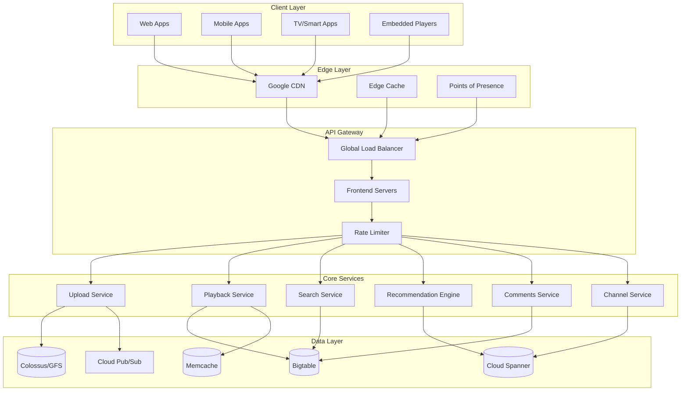
```mermaid
graph TB
    subgraph "Client Layer"
        WEB[Web Apps]
        MOBILE[Mobile Apps]
        TV[TV/Smart Apps]
        EMBEDDED[Embedded Players]
    end

    subgraph "Edge Layer"
        CDN[Google CDN]
        EDGE[Edge Cache]
        POP[Points of Presence]
    end

    subgraph "API Gateway"
        LB[Global Load Balancer]
        FRONTEND[Frontend Servers]
        RATE[Rate Limiter]
    end

    subgraph "Core Services"
        UPLOAD[Upload Service]
        PLAYBACK[Playback Service]
        SEARCH[Search Service]
        RECOMMEND[Recommendation Engine]
        COMMENTS[Comments Service]
        CHANNEL[Channel Service]
    end

    subgraph "Data Layer"
        BIGTABLE[(Bigtable)]
        SPANNER[(Cloud Spanner)]
        COLOSSUS[(Colossus/GFS)]
        MEMCACHE[(Memcache)]
        PUBSUB[Cloud Pub/Sub]
    end

    WEB --> CDN
    MOBILE --> CDN
    TV --> CDN
    EMBEDDED --> CDN

    CDN --> LB
    EDGE --> LB
    POP --> LB

    LB --> FRONTEND
    FRONTEND --> RATE
    RATE --> UPLOAD
    RATE --> PLAYBACK
    RATE --> SEARCH
    RATE --> RECOMMEND
    RATE --> COMMENTS
    RATE --> CHANNEL

    UPLOAD --> COLOSSUS
    PLAYBACK --> BIGTABLE
    SEARCH --> BIGTABLE
    RECOMMEND --> SPANNER
    COMMENTS --> BIGTABLE
    CHANNEL --> SPANNER

    UPLOAD --> PUBSUB
    PLAYBACK --> MEMCACHE
```

## Core Components

### 1. Video Upload Pipeline

YouTube's upload system processes over 500 hours of content every minute.

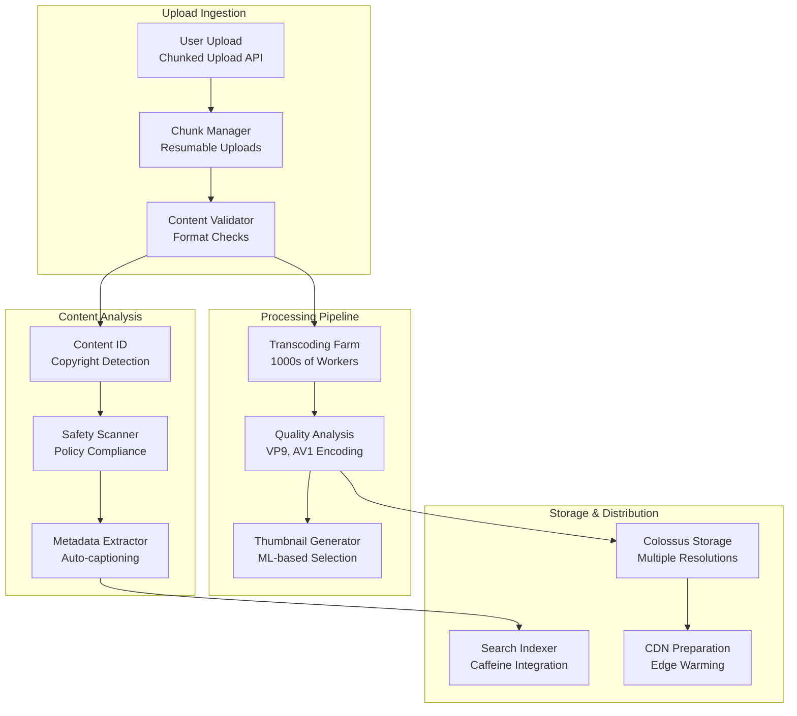
```mermaid
flowchart TD
    subgraph "Upload Ingestion"
        UPLOAD[User Upload<br/>Chunked Upload API]
        CHUNK[Chunk Manager<br/>Resumable Uploads]
        VALIDATE[Content Validator<br/>Format Checks]
    end

    subgraph "Processing Pipeline"
        TRANSCODE[Transcoding Farm<br/>1000s of Workers]
        QUALITY[Quality Analysis<br/>VP9, AV1 Encoding]
        THUMBNAIL[Thumbnail Generator<br/>ML-based Selection]
    end

    subgraph "Content Analysis"
        CONTENT_ID[Content ID<br/>Copyright Detection]
        SAFETY[Safety Scanner<br/>Policy Compliance]
        METADATA[Metadata Extractor<br/>Auto-captioning]
    end

    subgraph "Storage & Distribution"
        STORE[Colossus Storage<br/>Multiple Resolutions]
        INDEX[Search Indexer<br/>Caffeine Integration]
        CDN_PUSH[CDN Preparation<br/>Edge Warming]
    end

    UPLOAD --> CHUNK
    CHUNK --> VALIDATE
    VALIDATE --> TRANSCODE
    TRANSCODE --> QUALITY
    QUALITY --> THUMBNAIL

    VALIDATE --> CONTENT_ID
    CONTENT_ID --> SAFETY
    SAFETY --> METADATA

    QUALITY --> STORE
    METADATA --> INDEX
    STORE --> CDN_PUSH
```

**Components:**
- **Chunked Upload API**: Supports resumable uploads up to 256GB
- **Transcoding Farm**: Parallel encoding to 40+ format/resolution combinations
- **Content ID**: Fingerprint matching against 100M+ reference files
- **Auto-captioning**: Speech-to-text in 10+ languages

**Key Features:**
- Resumable uploads with automatic retry
- Parallel transcoding across distributed workers
- Real-time progress notifications
- Automatic quality optimization per device

### 2. Video Playback Service

Delivers billions of video streams daily with adaptive bitrate streaming.

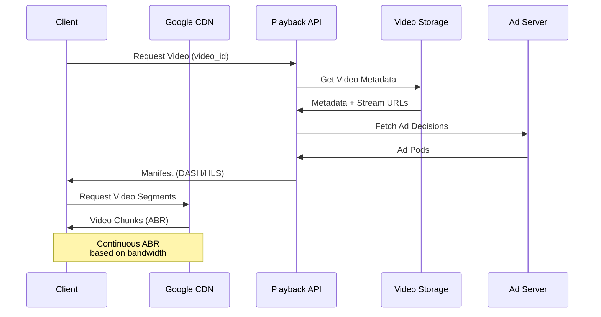
```mermaid
sequenceDiagram
    participant Client
    participant CDN as Google CDN
    participant PlaybackAPI as Playback API
    participant VideoStore as Video Storage
    participant AdServer as Ad Server

    Client->>PlaybackAPI: Request Video (video_id)
    PlaybackAPI->>VideoStore: Get Video Metadata
    VideoStore->>PlaybackAPI: Metadata + Stream URLs
    PlaybackAPI->>AdServer: Fetch Ad Decisions
    AdServer->>PlaybackAPI: Ad Pods
    PlaybackAPI->>Client: Manifest (DASH/HLS)
    Client->>CDN: Request Video Segments
    CDN->>Client: Video Chunks (ABR)
    Note over Client,CDN: Continuous ABR<br/>based on bandwidth
```

**Responsibilities:**
- Adaptive bitrate streaming (144p to 8K)
- DRM protection (Widevine)
- Live streaming with ultra-low latency
- 360° and VR video support
- HDR and Dolby Vision delivery

### 3. Search and Discovery

YouTube's search processes billions of queries daily.

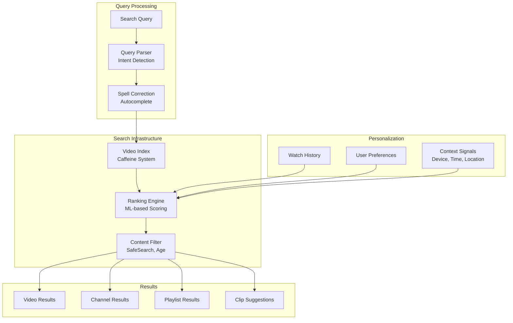
```mermaid
graph TD
    subgraph "Query Processing"
        QUERY[Search Query]
        PARSE[Query Parser<br/>Intent Detection]
        SPELL[Spell Correction<br/>Autocomplete]
    end

    subgraph "Search Infrastructure"
        INDEX[Video Index<br/>Caffeine System]
        RANK[Ranking Engine<br/>ML-based Scoring]
        FILTER[Content Filter<br/>SafeSearch, Age]
    end

    subgraph "Personalization"
        HISTORY[Watch History]
        PREFS[User Preferences]
        CONTEXT[Context Signals<br/>Device, Time, Location]
    end

    subgraph "Results"
        VIDEOS[Video Results]
        CHANNELS[Channel Results]
        PLAYLISTS[Playlist Results]
        CLIPS[Clip Suggestions]
    end

    QUERY --> PARSE
    PARSE --> SPELL
    SPELL --> INDEX

    INDEX --> RANK
    HISTORY --> RANK
    PREFS --> RANK
    CONTEXT --> RANK

    RANK --> FILTER
    FILTER --> VIDEOS
    FILTER --> CHANNELS
    FILTER --> PLAYLISTS
    FILTER --> CLIPS
```

**Search Features:**
- Real-time index updates within minutes
- Multi-modal search (voice, image, text)
- Timestamp-based search within videos
- Trending and autocomplete suggestions

### 4. Recommendation Engine

Powers 70% of watch time through personalized recommendations.

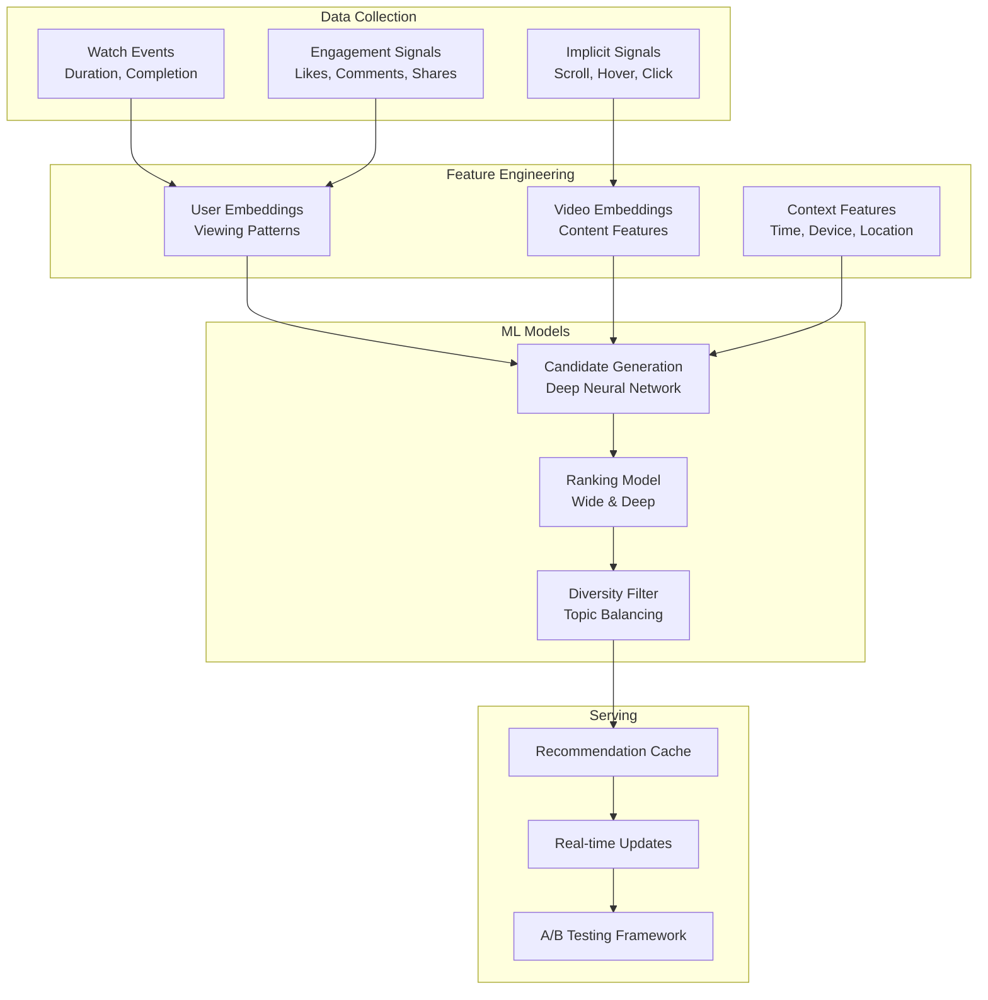
```mermaid
graph TD
    subgraph "Data Collection"
        WATCH[Watch Events<br/>Duration, Completion]
        ENGAGE[Engagement Signals<br/>Likes, Comments, Shares]
        IMPLICIT[Implicit Signals<br/>Scroll, Hover, Click]
    end

    subgraph "Feature Engineering"
        USER_EMB[User Embeddings<br/>Viewing Patterns]
        VIDEO_EMB[Video Embeddings<br/>Content Features]
        CONTEXT_EMB[Context Features<br/>Time, Device, Location]
    end

    subgraph "ML Models"
        CANDIDATE[Candidate Generation<br/>Deep Neural Network]
        RANKING[Ranking Model<br/>Wide & Deep]
        DIVERSITY[Diversity Filter<br/>Topic Balancing]
    end

    subgraph "Serving"
        CACHE[Recommendation Cache]
        REALTIME[Real-time Updates]
        AB_TEST[A/B Testing Framework]
    end

    WATCH --> USER_EMB
    ENGAGE --> USER_EMB
    IMPLICIT --> VIDEO_EMB

    USER_EMB --> CANDIDATE
    VIDEO_EMB --> CANDIDATE
    CONTEXT_EMB --> CANDIDATE

    CANDIDATE --> RANKING
    RANKING --> DIVERSITY
    DIVERSITY --> CACHE
    CACHE --> REALTIME
    REALTIME --> AB_TEST
```

**ML Technologies:**
- **Two-Tower Model**: Candidate generation at scale
- **Wide & Deep Learning**: Combines memorization and generalization
- **Reinforcement Learning**: Long-term user satisfaction optimization
- **Multi-task Learning**: Balances multiple objectives (watch time, satisfaction)

## Data Storage Architecture

### Bigtable (Primary NoSQL)

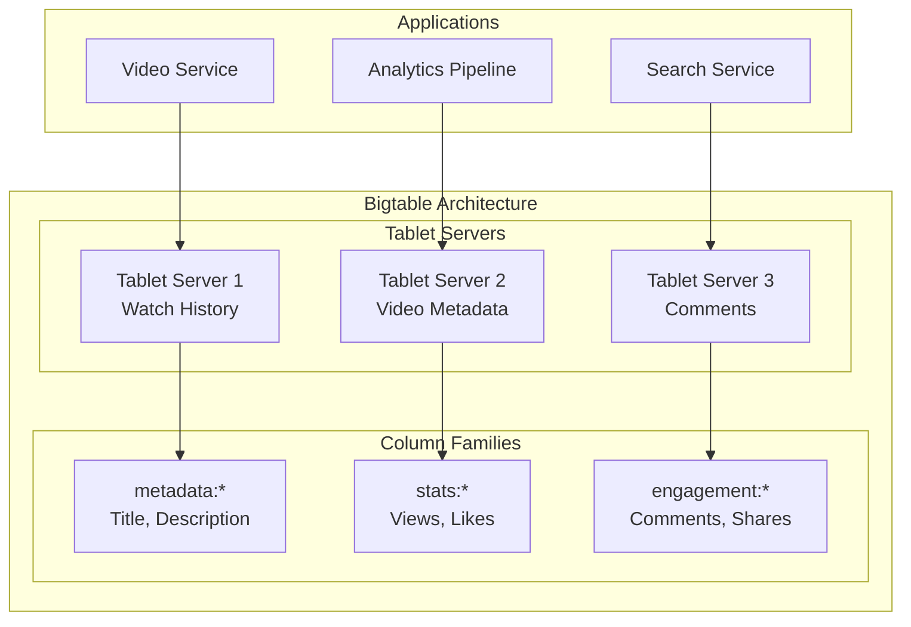
```mermaid
graph TD
    subgraph "Bigtable Architecture"
        subgraph "Tablet Servers"
            T1[Tablet Server 1<br/>Watch History]
            T2[Tablet Server 2<br/>Video Metadata]
            T3[Tablet Server 3<br/>Comments]
        end

        subgraph "Column Families"
            CF1[metadata:*<br/>Title, Description]
            CF2[stats:*<br/>Views, Likes]
            CF3[engagement:*<br/>Comments, Shares]
        end
    end

    subgraph "Applications"
        VIDEO_SVC[Video Service]
        ANALYTICS[Analytics Pipeline]
        SEARCH_SVC[Search Service]
    end

    VIDEO_SVC --> T1
    ANALYTICS --> T2
    SEARCH_SVC --> T3

    T1 --> CF1
    T2 --> CF2
    T3 --> CF3
```

**Use Cases:**
- Video metadata and statistics
- User watch history (petabytes of data)
- Comments and engagement data
- Billions of rows with millisecond access

### Cloud Spanner (Global Transactions)

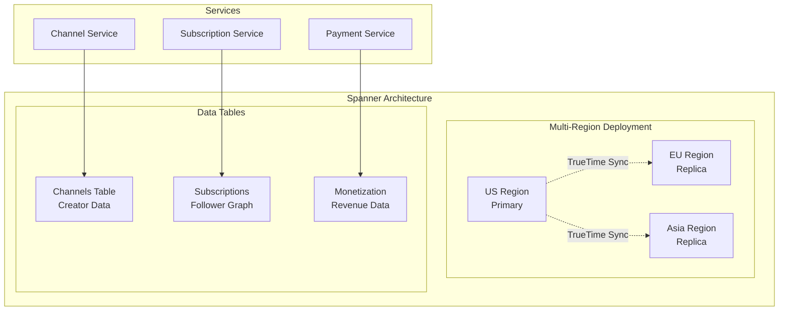
```mermaid
graph TD
    subgraph "Spanner Architecture"
        subgraph "Multi-Region Deployment"
            US[US Region<br/>Primary]
            EU[EU Region<br/>Replica]
            ASIA[Asia Region<br/>Replica]
        end

        subgraph "Data Tables"
            CHANNELS[Channels Table<br/>Creator Data]
            SUBS[Subscriptions<br/>Follower Graph]
            MONETIZE[Monetization<br/>Revenue Data]
        end
    end

    subgraph "Services"
        CHANNEL_SVC[Channel Service]
        SUB_SVC[Subscription Service]
        PAYMENT[Payment Service]
    end

    US -.->|TrueTime Sync| EU
    US -.->|TrueTime Sync| ASIA

    CHANNEL_SVC --> CHANNELS
    SUB_SVC --> SUBS
    PAYMENT --> MONETIZE
```

**Use Cases:**
- Channel and creator data
- Subscription relationships
- Monetization and payment data
- Strong consistency for financial transactions

### Colossus (Distributed File System)

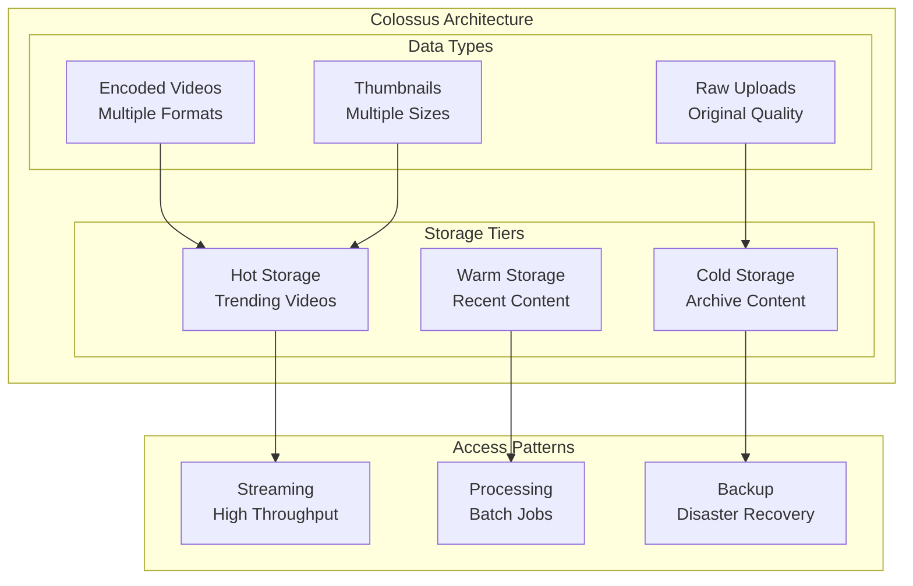
```mermaid
graph TD
    subgraph "Colossus Architecture"
        subgraph "Storage Tiers"
            HOT[Hot Storage<br/>Trending Videos]
            WARM[Warm Storage<br/>Recent Content]
            COLD[Cold Storage<br/>Archive Content]
        end

        subgraph "Data Types"
            RAW[Raw Uploads<br/>Original Quality]
            ENCODED[Encoded Videos<br/>Multiple Formats]
            THUMBS[Thumbnails<br/>Multiple Sizes]
        end
    end

    subgraph "Access Patterns"
        STREAM[Streaming<br/>High Throughput]
        PROCESS[Processing<br/>Batch Jobs]
        BACKUP[Backup<br/>Disaster Recovery]
    end

    HOT --> STREAM
    WARM --> PROCESS
    COLD --> BACKUP

    RAW --> COLD
    ENCODED --> HOT
    THUMBS --> HOT
```

**Features:**
- Exabyte-scale video storage
- Erasure coding for durability
- Automatic tiering based on access patterns
- Global replication for availability

## Stream Processing Architecture

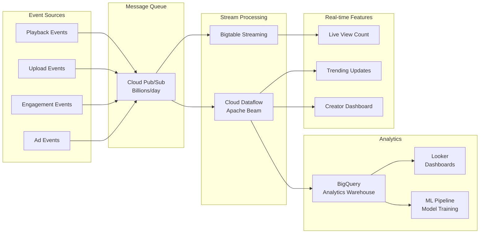
```mermaid
graph LR
    subgraph "Event Sources"
        PLAY[Playback Events]
        UPLOAD[Upload Events]
        ENGAGE[Engagement Events]
        ADS[Ad Events]
    end

    subgraph "Message Queue"
        PUBSUB[Cloud Pub/Sub<br/>Billions/day]
    end

    subgraph "Stream Processing"
        DATAFLOW[Cloud Dataflow<br/>Apache Beam]
        BIGTABLE_STREAM[Bigtable Streaming]
    end

    subgraph "Analytics"
        BQ[BigQuery<br/>Analytics Warehouse]
        LOOKER[Looker<br/>Dashboards]
        ML[ML Pipeline<br/>Model Training]
    end

    subgraph "Real-time Features"
        LIVE_COUNT[Live View Count]
        TRENDING[Trending Updates]
        CREATOR_DASH[Creator Dashboard]
    end

    PLAY --> PUBSUB
    UPLOAD --> PUBSUB
    ENGAGE --> PUBSUB
    ADS --> PUBSUB

    PUBSUB --> DATAFLOW
    PUBSUB --> BIGTABLE_STREAM

    DATAFLOW --> BQ
    BQ --> LOOKER
    BQ --> ML

    BIGTABLE_STREAM --> LIVE_COUNT
    DATAFLOW --> TRENDING
    DATAFLOW --> CREATOR_DASH
```

### Cloud Pub/Sub
- Handles billions of events per day
- At-least-once delivery guarantee
- Global message routing
- Real-time analytics pipeline

### Cloud Dataflow
- Apache Beam unified batch/stream processing
- Auto-scaling based on backlog
- Exactly-once processing semantics
- Integration with BigQuery and ML services

## Scalability Patterns

### 1. Global Load Balancing

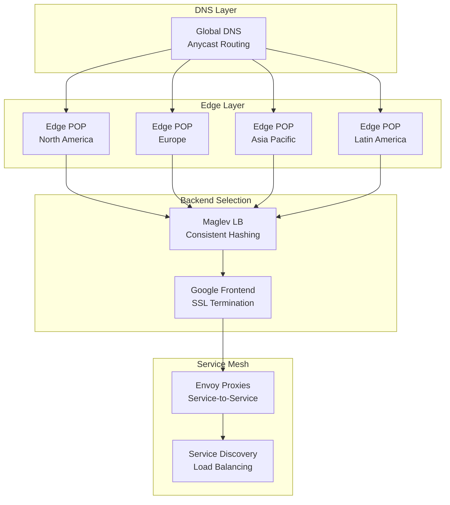
```mermaid
graph TD
    subgraph "DNS Layer"
        DNS[Global DNS<br/>Anycast Routing]
    end

    subgraph "Edge Layer"
        EDGE1[Edge POP<br/>North America]
        EDGE2[Edge POP<br/>Europe]
        EDGE3[Edge POP<br/>Asia Pacific]
        EDGE4[Edge POP<br/>Latin America]
    end

    subgraph "Backend Selection"
        MAGLEV[Maglev LB<br/>Consistent Hashing]
        GFE[Google Frontend<br/>SSL Termination]
    end

    subgraph "Service Mesh"
        ENVOY[Envoy Proxies<br/>Service-to-Service]
        ISTIO[Service Discovery<br/>Load Balancing]
    end

    DNS --> EDGE1
    DNS --> EDGE2
    DNS --> EDGE3
    DNS --> EDGE4

    EDGE1 --> MAGLEV
    EDGE2 --> MAGLEV
    EDGE3 --> MAGLEV
    EDGE4 --> MAGLEV

    MAGLEV --> GFE
    GFE --> ENVOY
    ENVOY --> ISTIO
```

**Components:**
- **Anycast DNS**: Routes users to nearest edge
- **Maglev**: Software load balancer with consistent hashing
- **Google Frontend (GFE)**: SSL termination, DDoS protection
- **Envoy**: Service mesh for internal traffic

### 2. Caching Strategy

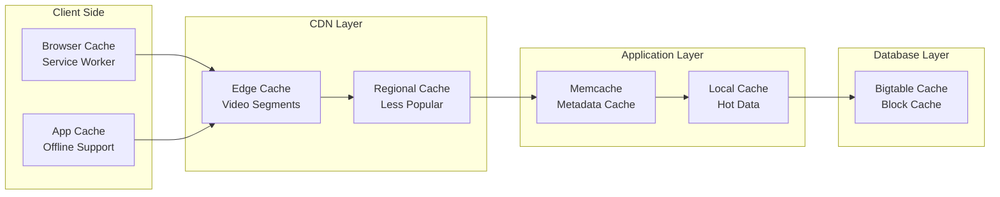
```mermaid
graph LR
    subgraph "Client Side"
        BROWSER[Browser Cache<br/>Service Worker]
        APP[App Cache<br/>Offline Support]
    end

    subgraph "CDN Layer"
        EDGE_CACHE[Edge Cache<br/>Video Segments]
        REGIONAL[Regional Cache<br/>Less Popular]
    end

    subgraph "Application Layer"
        MEMCACHE[Memcache<br/>Metadata Cache]
        LOCAL[Local Cache<br/>Hot Data]
    end

    subgraph "Database Layer"
        BT_CACHE[Bigtable Cache<br/>Block Cache]
    end

    BROWSER --> EDGE_CACHE
    APP --> EDGE_CACHE
    EDGE_CACHE --> REGIONAL
    REGIONAL --> MEMCACHE
    MEMCACHE --> LOCAL
    LOCAL --> BT_CACHE
```

**Cache Tiers:**
- **L1 (Client)**: Browser/app cache, service workers
- **L2 (Edge)**: CDN edge caches globally
- **L3 (Application)**: Memcache clusters
- **L4 (Database)**: Bigtable block cache

### 3. Video Segment Caching

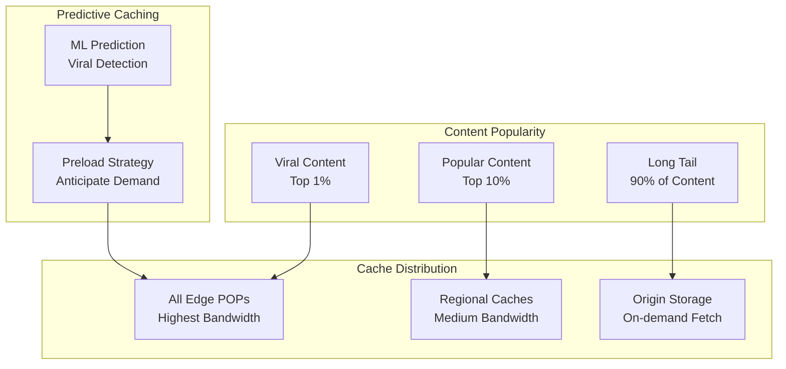
```mermaid
flowchart TD
    subgraph "Content Popularity"
        VIRAL[Viral Content<br/>Top 1%]
        POPULAR[Popular Content<br/>Top 10%]
        LONG_TAIL[Long Tail<br/>90% of Content]
    end

    subgraph "Cache Distribution"
        EDGE_ALL[All Edge POPs<br/>Highest Bandwidth]
        REGIONAL_CACHE[Regional Caches<br/>Medium Bandwidth]
        ORIGIN[Origin Storage<br/>On-demand Fetch]
    end

    subgraph "Predictive Caching"
        ML_PREDICT[ML Prediction<br/>Viral Detection]
        PRELOAD[Preload Strategy<br/>Anticipate Demand]
    end

    VIRAL --> EDGE_ALL
    POPULAR --> REGIONAL_CACHE
    LONG_TAIL --> ORIGIN

    ML_PREDICT --> PRELOAD
    PRELOAD --> EDGE_ALL
```

## Security Architecture

```mermaid
graph TB
    subgraph "Content Security"
        DRM[Widevine DRM<br/>Content Protection]
        ENCRYPT[AES-128 Encryption<br/>Stream Protection]
        WATERMARK[Forensic Watermarking<br/>Piracy Tracking]
    end

    subgraph "Platform Security"
        OAUTH[OAuth 2.0<br/>Authentication]
        API_KEY[API Keys<br/>Rate Limiting]
        CAPTCHA[reCAPTCHA<br/>Bot Prevention]
    end

    subgraph "Infrastructure Security"
        BEYONDCORP[BeyondCorp<br/>Zero Trust]
        KMS[Cloud KMS<br/>Key Management]
        IAM[Cloud IAM<br/>Access Control]
    end

    subgraph "Content Safety"
        ML_SAFETY[ML Safety Models<br/>Policy Violation]
        HUMAN[Human Review<br/>Appeals Process]
        HASH_MATCH[Hash Matching<br/>Known Bad Content]
    end

    DRM --> ENCRYPT
    ENCRYPT --> WATERMARK

    OAUTH --> API_KEY
    API_KEY --> CAPTCHA

    BEYONDCORP --> KMS
    KMS --> IAM

    ML_SAFETY --> HUMAN
    HUMAN --> HASH_MATCH
```

### Content Protection
- **Widevine DRM**: Multi-platform content protection
- **Signed URLs**: Time-limited access to video segments
- **Geo-blocking**: Regional content licensing compliance
- **Forensic watermarking**: Track piracy sources

### Platform Security
- **OAuth 2.0/OIDC**: Secure authentication
- **API quotas**: Protection against abuse
- **Bot detection**: ML-based bot identification
- **Abuse detection**: Real-time threat analysis

## Monitoring and Observability

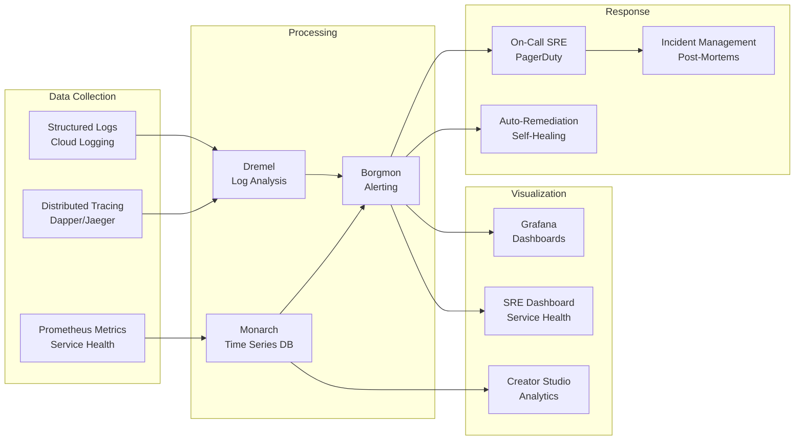
```mermaid
graph LR
    subgraph "Data Collection"
        METRICS[Prometheus Metrics<br/>Service Health]
        TRACES[Distributed Tracing<br/>Dapper/Jaeger]
        LOGS[Structured Logs<br/>Cloud Logging]
    end

    subgraph "Processing"
        MONARCH[Monarch<br/>Time Series DB]
        DREMEL[Dremel<br/>Log Analysis]
        BORGMON[Borgmon<br/>Alerting]
    end

    subgraph "Visualization"
        GRAFANA[Grafana<br/>Dashboards]
        SRE_DASH[SRE Dashboard<br/>Service Health]
        CREATOR_STUDIO[Creator Studio<br/>Analytics]
    end

    subgraph "Response"
        ONCALL[On-Call SRE<br/>PagerDuty]
        AUTO_HEAL[Auto-Remediation<br/>Self-Healing]
        INCIDENT[Incident Management<br/>Post-Mortems]
    end

    METRICS --> MONARCH
    TRACES --> DREMEL
    LOGS --> DREMEL

    MONARCH --> BORGMON
    DREMEL --> BORGMON

    BORGMON --> GRAFANA
    BORGMON --> SRE_DASH
    MONARCH --> CREATOR_STUDIO

    BORGMON --> ONCALL
    BORGMON --> AUTO_HEAL
    ONCALL --> INCIDENT
```

### Key Metrics
- **Video Start Time (VST)**: Time to first frame
- **Rebuffering Rate**: Playback interruptions
- **Video Quality**: Resolution and bitrate metrics
- **Error Rates**: Upload and playback failures

## Deployment and DevOps

### Continuous Integration/Continuous Deployment

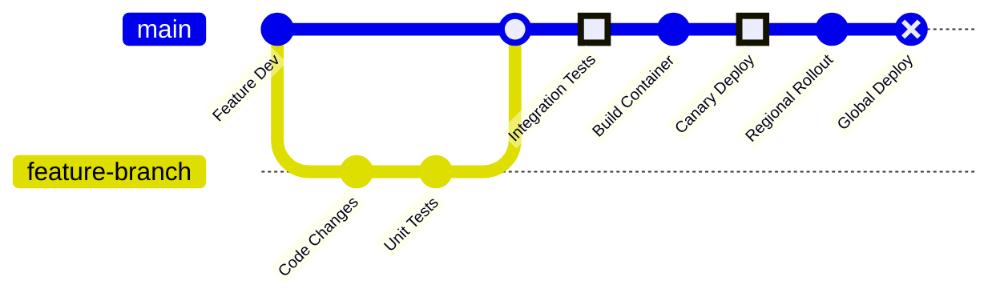
```mermaid
gitGraph
    commit id: "Feature Dev"
    branch feature-branch
    checkout feature-branch
    commit id: "Code Changes"
    commit id: "Unit Tests"
    checkout main
    merge feature-branch
    commit id: "Integration Tests" type: HIGHLIGHT
    commit id: "Build Container"
    commit id: "Canary Deploy" type: HIGHLIGHT
    commit id: "Regional Rollout"
    commit id: "Global Deploy" type: REVERSE
```

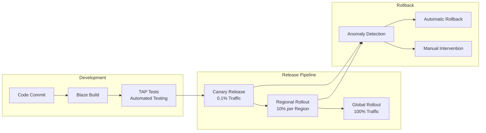
```mermaid
flowchart LR
    subgraph "Development"
        CODE[Code Commit]
        BUILD[Blaze Build]
        TEST[TAP Tests<br/>Automated Testing]
    end

    subgraph "Release Pipeline"
        CANARY[Canary Release<br/>0.1% Traffic]
        REGIONAL[Regional Rollout<br/>10% per Region]
        GLOBAL[Global Rollout<br/>100% Traffic]
    end

    subgraph "Rollback"
        DETECT[Anomaly Detection]
        AUTO_ROLLBACK[Automatic Rollback]
        MANUAL[Manual Intervention]
    end

    CODE --> BUILD
    BUILD --> TEST
    TEST --> CANARY
    CANARY --> REGIONAL
    REGIONAL --> GLOBAL

    CANARY --> DETECT
    REGIONAL --> DETECT
    DETECT --> AUTO_ROLLBACK
    DETECT --> MANUAL
```

### Infrastructure as Code
- **Borg**: Container orchestration platform
- **Kubernetes (GKE)**: Open-source deployments
- **Terraform**: Infrastructure provisioning
- **Config-as-Code**: Centralized configuration management

### Chaos Engineering

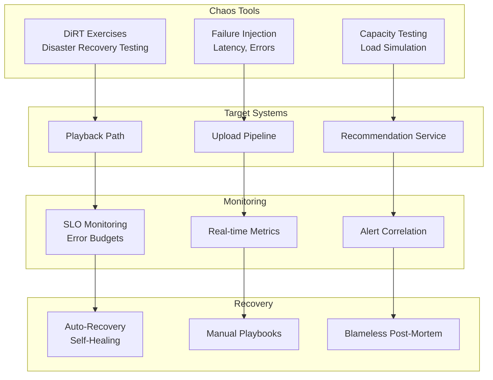
```mermaid
flowchart TD
    subgraph "Chaos Tools"
        DIASTER[DiRT Exercises<br/>Disaster Recovery Testing]
        INJECT[Failure Injection<br/>Latency, Errors]
        CAPACITY[Capacity Testing<br/>Load Simulation]
    end

    subgraph "Target Systems"
        PLAYBACK[Playback Path]
        UPLOAD[Upload Pipeline]
        RECOMMEND[Recommendation Service]
    end

    subgraph "Monitoring"
        SLO[SLO Monitoring<br/>Error Budgets]
        METRICS[Real-time Metrics]
        ALERTS[Alert Correlation]
    end

    subgraph "Recovery"
        AUTO[Auto-Recovery<br/>Self-Healing]
        MANUAL[Manual Playbooks]
        POSTMORTEM[Blameless Post-Mortem]
    end

    DIASTER --> PLAYBACK
    INJECT --> UPLOAD
    CAPACITY --> RECOMMEND

    PLAYBACK --> SLO
    UPLOAD --> METRICS
    RECOMMEND --> ALERTS

    SLO --> AUTO
    METRICS --> MANUAL
    ALERTS --> POSTMORTEM
```

**Practices:**
- **DiRT (Disaster Recovery Testing)**: Annual large-scale disaster simulations
- **Failure Injection**: Controlled service degradation
- **Capacity Testing**: Simulate viral content scenarios
- **Blameless Post-Mortems**: Learning from incidents

## Analytics and Machine Learning

### Data Pipeline

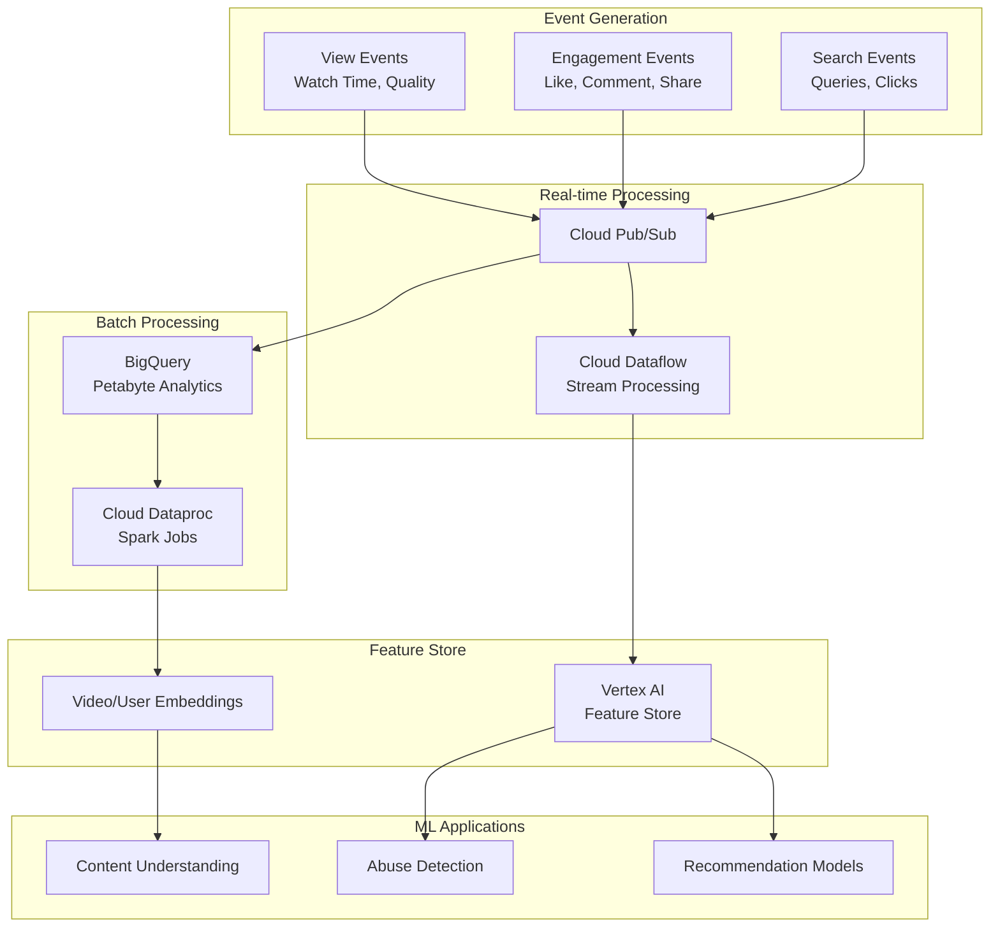
```mermaid
flowchart TD
    subgraph "Event Generation"
        VIEW[View Events<br/>Watch Time, Quality]
        ENGAGE[Engagement Events<br/>Like, Comment, Share]
        SEARCH[Search Events<br/>Queries, Clicks]
    end

    subgraph "Real-time Processing"
        PUBSUB[Cloud Pub/Sub]
        DATAFLOW[Cloud Dataflow<br/>Stream Processing]
    end

    subgraph "Batch Processing"
        BQ[BigQuery<br/>Petabyte Analytics]
        DATAPROC[Cloud Dataproc<br/>Spark Jobs]
    end

    subgraph "Feature Store"
        VERTEX[Vertex AI<br/>Feature Store]
        EMBEDDINGS[Video/User Embeddings]
    end

    subgraph "ML Applications"
        RECOMMEND_ML[Recommendation Models]
        CONTENT_ML[Content Understanding]
        ABUSE_ML[Abuse Detection]
    end

    VIEW --> PUBSUB
    ENGAGE --> PUBSUB
    SEARCH --> PUBSUB

    PUBSUB --> DATAFLOW
    PUBSUB --> BQ

    DATAFLOW --> VERTEX
    BQ --> DATAPROC
    DATAPROC --> EMBEDDINGS

    VERTEX --> RECOMMEND_ML
    EMBEDDINGS --> CONTENT_ML
    VERTEX --> ABUSE_ML
```

### ML Use Cases
- **Recommendations**: 70% of watch time driven by ML
- **Content Understanding**: Auto-categorization, thumbnail selection
- **Abuse Detection**: Policy violation identification
- **Quality Optimization**: Encoding decisions per content type
- **Ad Targeting**: Contextual and behavioral targeting

## Cost Optimization

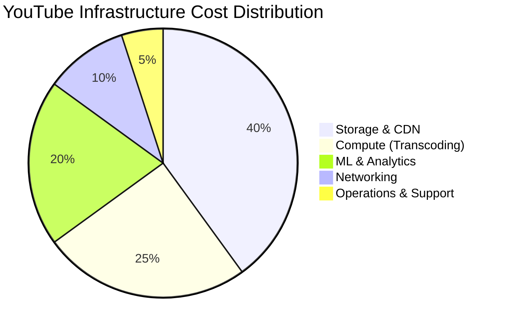
```mermaid
pie title YouTube Infrastructure Cost Distribution
    "Storage & CDN" : 40
    "Compute (Transcoding)" : 25
    "ML & Analytics" : 20
    "Networking" : 10
    "Operations & Support" : 5
```

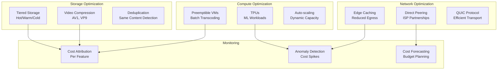
```mermaid
graph TD
    subgraph "Storage Optimization"
        TIERED[Tiered Storage<br/>Hot/Warm/Cold]
        COMPRESS[Video Compression<br/>AV1, VP9]
        DEDUP[Deduplication<br/>Same Content Detection]
    end

    subgraph "Compute Optimization"
        PREEMPTIBLE[Preemptible VMs<br/>Batch Transcoding]
        CUSTOM_SILICON[TPUs<br/>ML Workloads]
        AUTOSCALE[Auto-scaling<br/>Dynamic Capacity]
    end

    subgraph "Network Optimization"
        EDGE[Edge Caching<br/>Reduced Egress]
        PEERING[Direct Peering<br/>ISP Partnerships]
        QUIC[QUIC Protocol<br/>Efficient Transport]
    end

    subgraph "Monitoring"
        COST_TRACK[Cost Attribution<br/>Per Feature]
        ANOMALY[Anomaly Detection<br/>Cost Spikes]
        FORECAST[Cost Forecasting<br/>Budget Planning]
    end

    TIERED --> COST_TRACK
    COMPRESS --> COST_TRACK
    PREEMPTIBLE --> COST_TRACK
    CUSTOM_SILICON --> ANOMALY
    EDGE --> ANOMALY
    PEERING --> FORECAST
```

### Key Strategies
- **AV1 Codec Adoption**: 30% bandwidth savings over VP9
- **Predictive Transcoding**: Only encode likely-to-be-watched resolutions
- **Edge Caching**: 90%+ cache hit ratio for popular content
- **Preemptible VMs**: 80% cost reduction for batch processing
- **TPU Usage**: Efficient ML inference at scale

## Future Architecture Considerations

### Emerging Technologies
- **AV1 Everywhere**: Complete codec migration for bandwidth efficiency
- **Edge Computing**: Local processing for live streaming
- **WebCodecs**: Native browser video processing
- **WebGPU**: Client-side ML for personalization

### Scalability Roadmap
- **8K Content**: Infrastructure for next-gen resolutions
- **Immersive Video**: VR/AR content delivery at scale
- **Live Shopping**: Real-time commerce integration
- **Short-Form Optimization**: Shorts-specific infrastructure

### AI Integration
- **Generative AI**: Auto-generated thumbnails, chapters, descriptions
- **Multi-modal Search**: Search by image, audio, or video clip
- **Real-time Translation**: Live dubbing and subtitles
- **Content Generation Tools**: AI-assisted video editing

## Conclusion

YouTube's architecture represents one of the most complex and scaled video delivery systems in the world. The combination of Google's infrastructure (Borg, Bigtable, Colossus), advanced ML systems, and global CDN enables YouTube to serve billions of users with high availability and low latency.

The architecture continues to evolve with emerging technologies like AV1, edge computing, and generative AI, while maintaining the reliability and performance that creators and viewers depend on.

> There might be iterations needed, current data is as close I could get.
