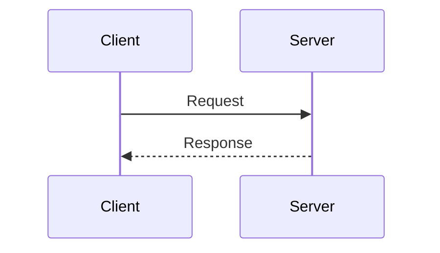
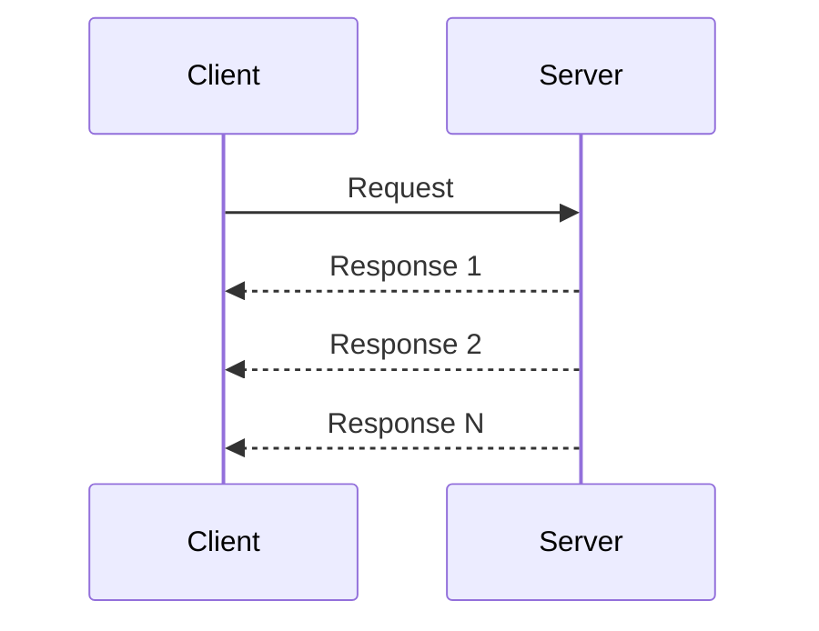
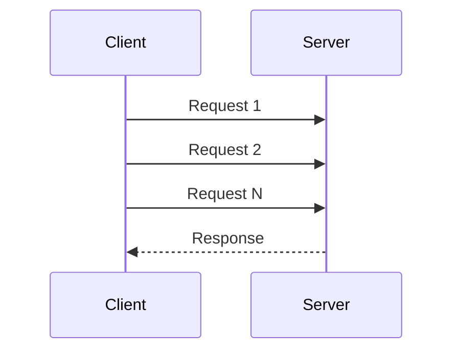
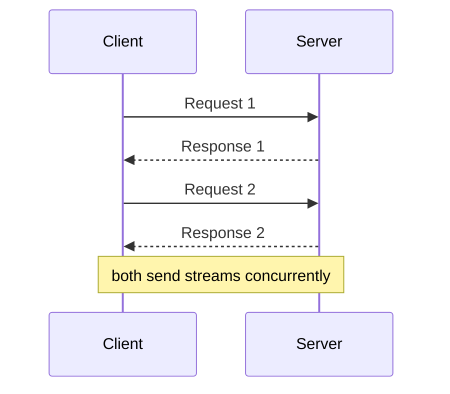

## What is gRPC?

**gRPC** is a high-performance RPC (Remote Procedure Call) framework developed by Google. It uses Protocol Buffers for serialization and HTTP/2 for transport.

---

## gRPC vs REST

| **Aspect** | **gRPC** | **REST** |
|-----------|---------|---------|
| Protocol | HTTP/2 | HTTP/1.1 or HTTP/2 |
| Serialization | Protocol Buffers (binary) | JSON (text) |
| Contract | Strict (.proto files) | Loose (OpenAPI optional) |
| Streaming | Built-in | Requires WebSocket/SSE |
| Browser support | Limited | Native |
| Performance | Faster | Slower |

---

## Protocol Buffers

Define your service and messages in `.proto` files:

```protobuf
syntax = "proto3";

service UserService {
  rpc GetUser (GetUserRequest) returns (User);
  rpc ListUsers (ListUsersRequest) returns (stream User);
}

message GetUserRequest {
  int32 id = 1;
}

message User {
  int32 id = 1;
  string name = 2;
  string email = 3;
}
```

---

## Communication Patterns

### Unary RPC


### Server Streaming


### Client Streaming


### Bidirectional Streaming


---

## Benefits

| **Benefit** | **Description** |
|------------|-----------------|
| Performance | Binary format, HTTP/2 multiplexing |
| Type safety | Generated code from proto files |
| Streaming | Native support for all patterns |
| Code generation | Auto-generate client/server code |
| Language agnostic | Support for many languages |

---

## When to Use gRPC

**Good for:**
- Microservices communication
- Low-latency, high-throughput systems
- Streaming data
- Polyglot environments

**Not ideal for:**
- Browser clients (limited support)
- Simple CRUD APIs
- When human-readable format needed

---

## Interview Tips

- Explain Protocol Buffers and binary serialization
- Know the four communication patterns
- Compare performance with REST
- Discuss when to choose gRPC vs REST
- Mention HTTP/2 benefits (multiplexing)
