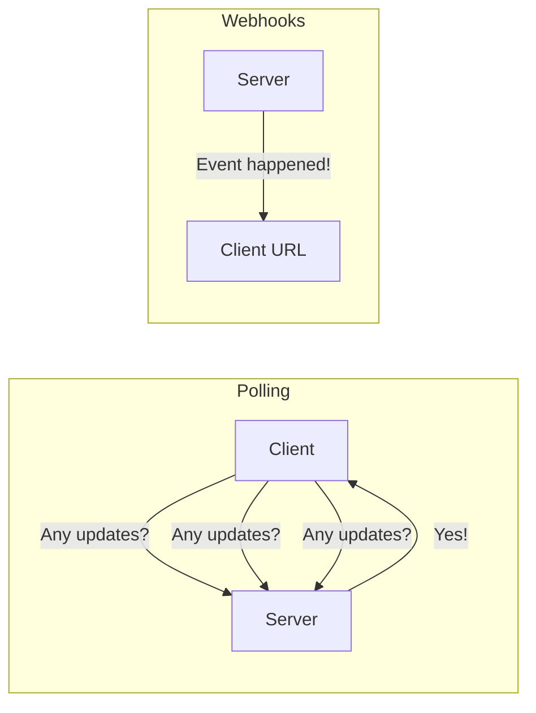
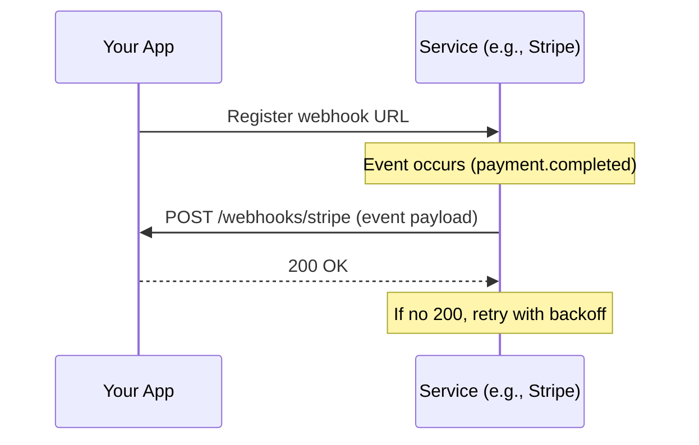
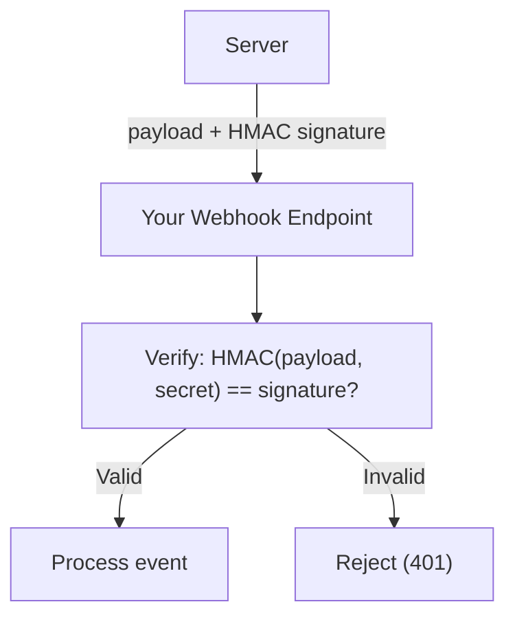
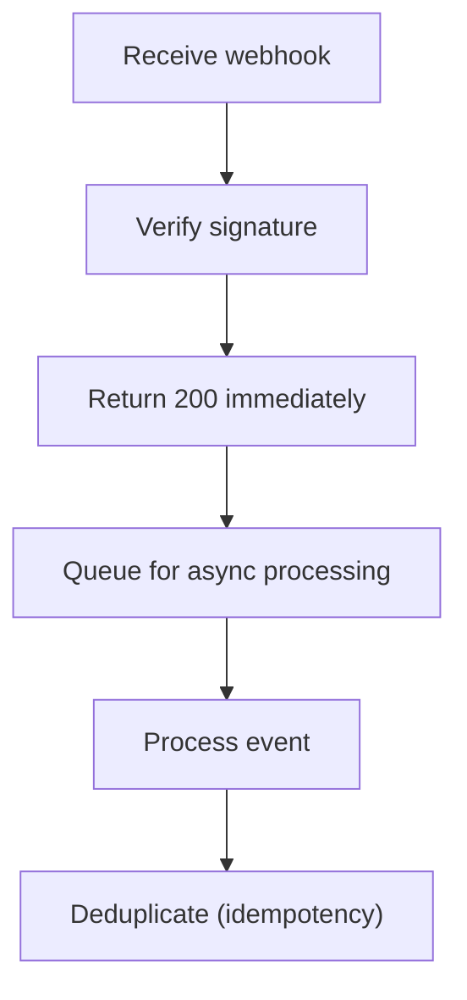
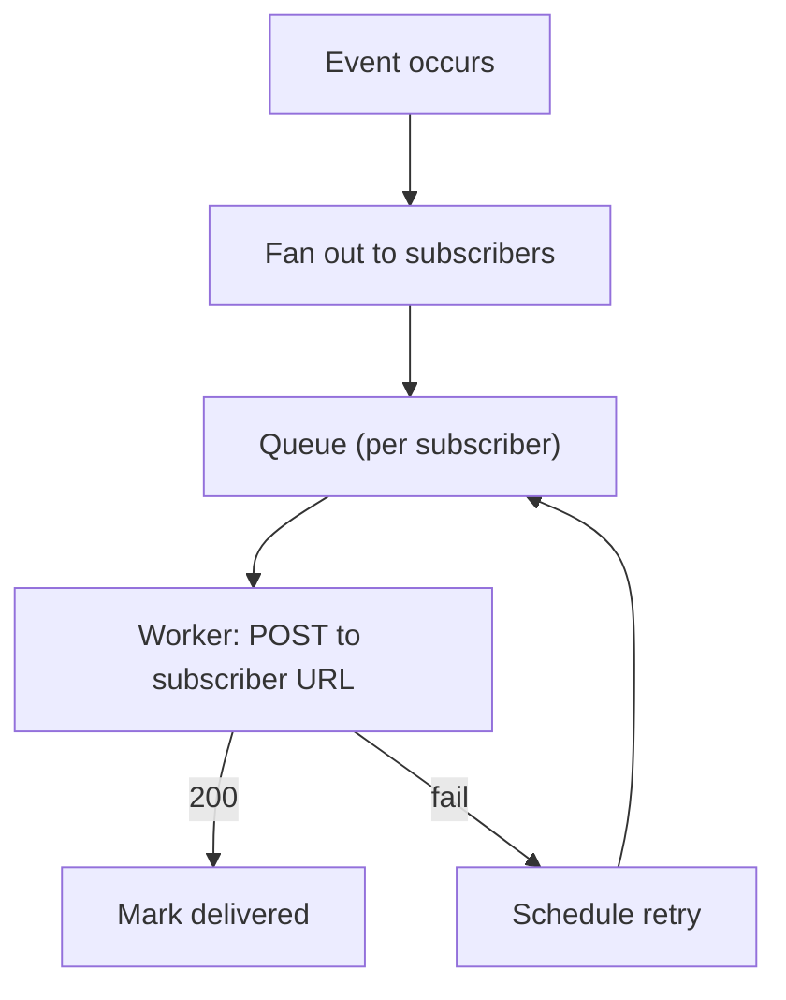

## What are Webhooks?

**Webhooks** are HTTP callbacks that notify external systems when an event occurs. Instead of polling for changes, the server pushes data to a registered URL when something happens.

---

## Polling vs Webhooks



| **Aspect** | **Polling** | **Webhooks** |
|-----------|------------|-------------|
| Direction | Client → Server | Server → Client |
| Latency | Depends on interval | Near real-time |
| Efficiency | Wasteful (many empty responses) | Efficient (only on events) |
| Complexity | Simple | Requires endpoint |

---

## How Webhooks Work



---

## Webhook Payload

```json
{
  "id": "evt_123abc",
  "type": "payment.completed",
  "created": 1710432000,
  "data": {
    "object": {
      "id": "pay_456def",
      "amount": 2000,
      "currency": "usd",
      "status": "succeeded"
    }
  }
}
```

---

## Security

### Signature Verification



```javascript
const crypto = require('crypto');

function verifyWebhook(payload, signature, secret) {
  const expected = crypto
    .createHmac('sha256', secret)
    .update(payload)
    .digest('hex');

  return crypto.timingSafeEqual(
    Buffer.from(signature),
    Buffer.from(expected)
  );
}
```

### Best Practices

| **Practice** | **Why** |
|-------------|---------|
| Verify signatures | Prevent spoofed events |
| Use HTTPS | Encrypt in transit |
| Validate timestamps | Prevent replay attacks |
| Use secrets rotation | Limit exposure |

---

## Reliability

### Retry Strategy

Most webhook providers retry on failure:

```
Attempt 1: Immediate
Attempt 2: 5 minutes
Attempt 3: 30 minutes
Attempt 4: 2 hours
Attempt 5: 24 hours
```

### Handling on Your End



**Key rule**: Return 200 quickly, process asynchronously.

---

## Common Webhook Providers

| **Provider** | **Events** |
|-------------|-----------|
| Stripe | payment.succeeded, invoice.paid |
| GitHub | push, pull_request, issues |
| Twilio | message.received, call.completed |
| Shopify | orders/create, products/update |
| Slack | message, reaction_added |

---

## Building a Webhook System

### As a Provider



| **Component** | **Purpose** |
|--------------|-----------|
| Event store | Record all events |
| Subscription table | URL + event types per subscriber |
| Delivery queue | Reliable, ordered delivery |
| Retry scheduler | Exponential backoff |
| Dead letter queue | Failed after max retries |

---

## Webhooks vs Other Patterns

| **Pattern** | **Best For** |
|------------|-------------|
| Webhooks | Cross-service notifications, third-party integrations |
| WebSockets | Real-time bidirectional communication |
| SSE | Server-to-client streaming |
| Message Queues | Internal service-to-service |
| Polling | Simple, no public endpoint |

---

## Interview Tips

- Compare webhooks vs polling (efficiency, latency)
- Explain signature verification (HMAC)
- Discuss reliability: quick ACK + async processing
- Mention retry strategy and idempotency
- Know real-world examples (Stripe, GitHub)
