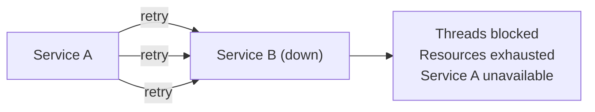
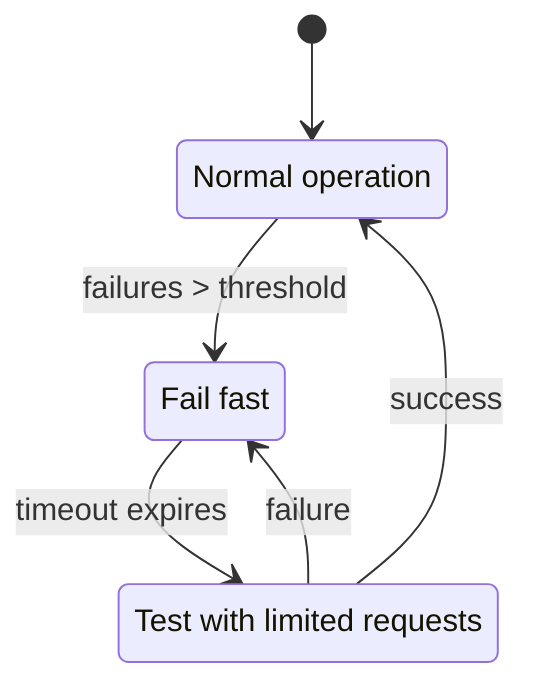
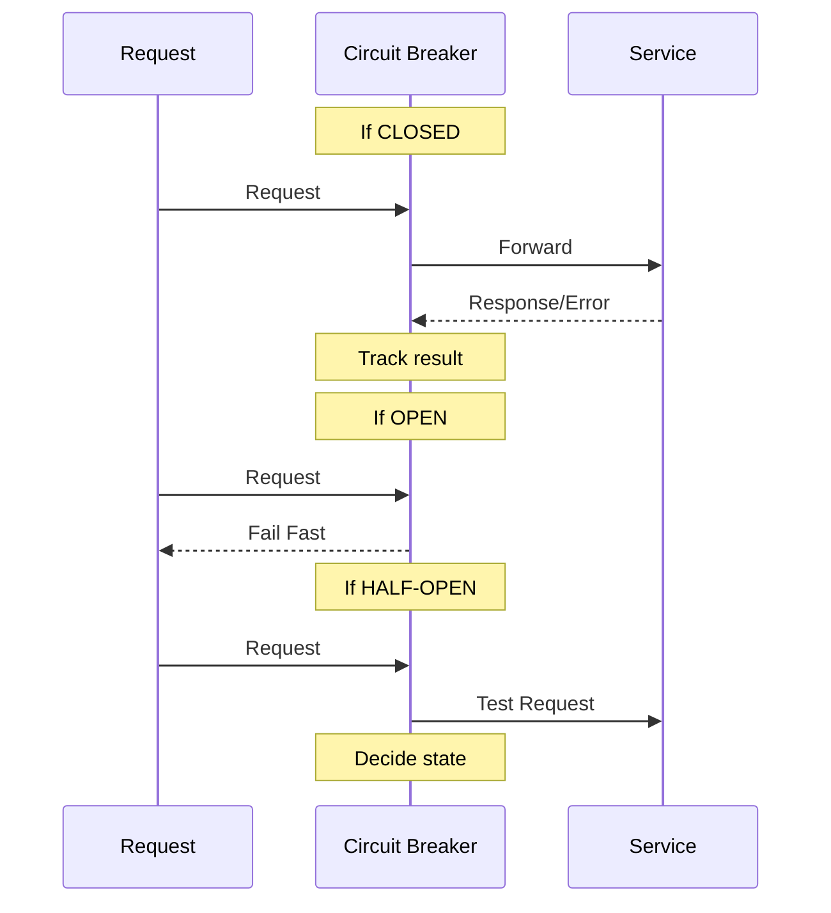

## What is Circuit Breaker?

The **Circuit Breaker** pattern prevents an application from repeatedly trying to execute an operation that's likely to fail. Like an electrical circuit breaker, it "trips" when failures exceed a threshold.

---

## The Problem

Without circuit breaker, cascading failures occur:



---

## Circuit Breaker States



| **State** | **Behavior** |
|----------|-------------|
| Closed | Normal operation, requests pass through |
| Open | Fail immediately, don't call service |
| Half-Open | Allow limited requests to test recovery |

---

## How It Works



---

## Configuration Parameters

| **Parameter** | **Description** | **Typical Value** |
|--------------|-----------------|-------------------|
| Failure threshold | Failures to trip | 5-10 |
| Success threshold | Successes to close | 3-5 |
| Timeout | Time before half-open | 30-60 seconds |
| Sliding window | Time window for counting | 10-60 seconds |

---

## Code Example

```javascript
class CircuitBreaker {
  constructor(options) {
    this.failureThreshold = options.failureThreshold || 5;
    this.resetTimeout = options.resetTimeout || 30000;
    this.state = 'CLOSED';
    this.failures = 0;
    this.lastFailure = null;
  }

  async call(fn) {
    if (this.state === 'OPEN') {
      if (Date.now() - this.lastFailure > this.resetTimeout) {
        this.state = 'HALF-OPEN';
      } else {
        throw new Error('Circuit is OPEN');
      }
    }

    try {
      const result = await fn();
      this.onSuccess();
      return result;
    } catch (error) {
      this.onFailure();
      throw error;
    }
  }

  onSuccess() {
    this.failures = 0;
    this.state = 'CLOSED';
  }

  onFailure() {
    this.failures++;
    this.lastFailure = Date.now();
    if (this.failures >= this.failureThreshold) {
      this.state = 'OPEN';
    }
  }
}
```

---

## Libraries

| **Language** | **Library** |
|-------------|------------|
| Java | Resilience4j, Hystrix |
| JavaScript | opossum |
| .NET | Polly |
| Go | gobreaker |

---

## Interview Tips

- Explain the three states and transitions
- Discuss failure thresholds and timeouts
- Mention fallback strategies
- Compare with retry pattern (complementary)
- Give use cases: external API calls, database connections
