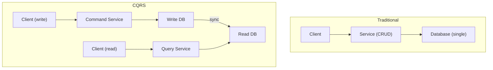
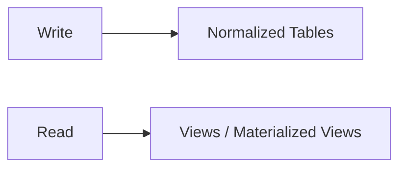
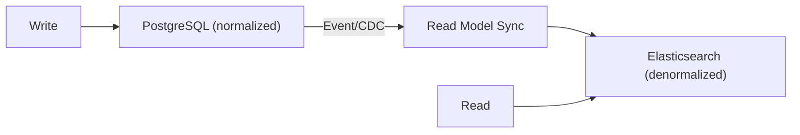

## What is CQRS?

**CQRS (Command Query Responsibility Segregation)** separates read and write operations into different models. Commands (writes) and Queries (reads) use different data models optimized for their specific purpose.

---

## Traditional vs CQRS



---

## Key Concepts

| **Concept** | **Description** |
|------------|-----------------|
| Command | Write operation (create, update, delete) |
| Query | Read operation (no side effects) |
| Write Model | Optimized for writes (normalized) |
| Read Model | Optimized for reads (denormalized) |

---

## Why CQRS?

| **Benefit** | **Description** |
|------------|-----------------|
| Optimized models | Each optimized for its purpose |
| Scalability | Scale reads and writes independently |
| Performance | Read model can be denormalized |
| Flexibility | Different storage technologies |
| Complexity isolation | Separate concerns |

---

## Implementation Patterns

### Simple CQRS

Same database, different models:



### Separate Databases

Different databases for read/write:



---

## Synchronization Strategies

| **Strategy** | **Consistency** | **Latency** |
|-------------|-----------------|-------------|
| Synchronous | Strong | Higher write latency |
| Asynchronous | Eventual | Lower write latency |
| Event-based | Eventual | Decoupled |

---

## Code Example

```javascript
// Command side
class OrderCommandService {
  async createOrder(command) {
    const order = new Order(command);
    await this.orderRepository.save(order);
    await this.eventBus.publish(new OrderCreatedEvent(order));
  }
}

// Query side
class OrderQueryService {
  async getOrderSummary(orderId) {
    // Read from denormalized read model
    return await this.readModelRepository.findById(orderId);
  }
}

// Event handler to sync read model
class OrderProjection {
  async handle(event: OrderCreatedEvent) {
    await this.readModel.create({
      orderId: event.orderId,
      customerName: event.customerName,
      totalAmount: event.totalAmount,
      itemCount: event.items.length
    });
  }
}
```

---

## When to Use CQRS

**Good fit:**
- Read/write ratio is very different
- Complex queries on read side
- Need to scale reads independently
- Different teams for read/write
- Using event sourcing

**Avoid when:**
- Simple CRUD application
- Single model suffices
- Team unfamiliar with pattern
- Overhead not justified

---

## Interview Tips

- Explain separation of commands and queries
- Discuss eventual consistency trade-off
- Know synchronization strategies
- Mention combination with event sourcing
- Give use cases: reporting, dashboards, analytics
