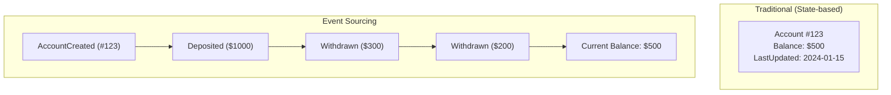
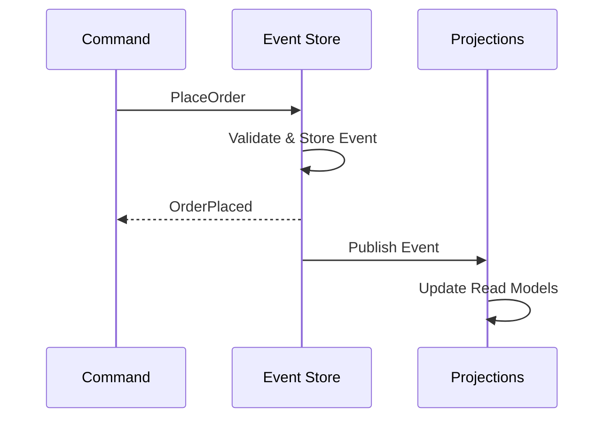
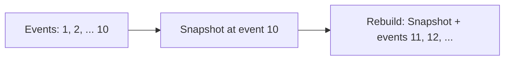
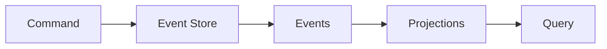

## What is Event Sourcing?

**Event Sourcing** stores state changes as a sequence of events rather than storing current state. The current state is derived by replaying all events.

---

## Traditional vs Event Sourcing



---

## Core Concepts

| **Concept** | **Description** |
|------------|-----------------|
| Event | Immutable record of something that happened |
| Event Store | Append-only log of events |
| Aggregate | Domain object rebuilt from events |
| Projection | Read model derived from events |
| Snapshot | Cached state to avoid replaying all events |

---

## How It Works



---

## Event Structure

```json
{
  "eventId": "uuid-123",
  "eventType": "OrderPlaced",
  "aggregateId": "order-456",
  "timestamp": "2024-01-15T10:30:00Z",
  "version": 1,
  "data": {
    "customerId": "cust-789",
    "items": [...],
    "total": 99.99
  },
  "metadata": {
    "userId": "user-123",
    "correlationId": "req-abc"
  }
}
```

---

## Benefits

| **Benefit** | **Description** |
|------------|-----------------|
| Complete audit trail | Every change is recorded |
| Temporal queries | Query state at any point in time |
| Debug and replay | Reproduce issues by replaying events |
| Event-driven | Natural fit for event-driven architecture |
| Undo/redo | Can reverse by applying compensating events |

---

## Challenges

| **Challenge** | **Mitigation** |
|--------------|---------------|
| Event schema evolution | Versioning, upcasters |
| Performance (replay) | Snapshots |
| Eventual consistency | Accept or design around |
| Complexity | Only use when benefits outweigh |

---

## Snapshots

Avoid replaying all events by periodically saving state:



---

## Event Sourcing + CQRS

Often used together:



- Events are the source of truth
- Projections create optimized read models
- Different projections for different query needs

---

## Interview Tips

- Explain events as source of truth
- Discuss rebuild from events
- Know when to use snapshots
- Mention schema evolution challenges
- Compare with traditional CRUD
- Give use cases: banking, audit systems
