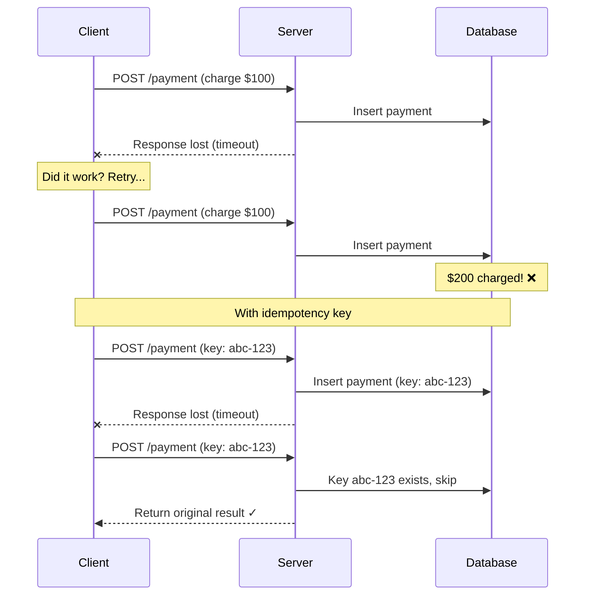
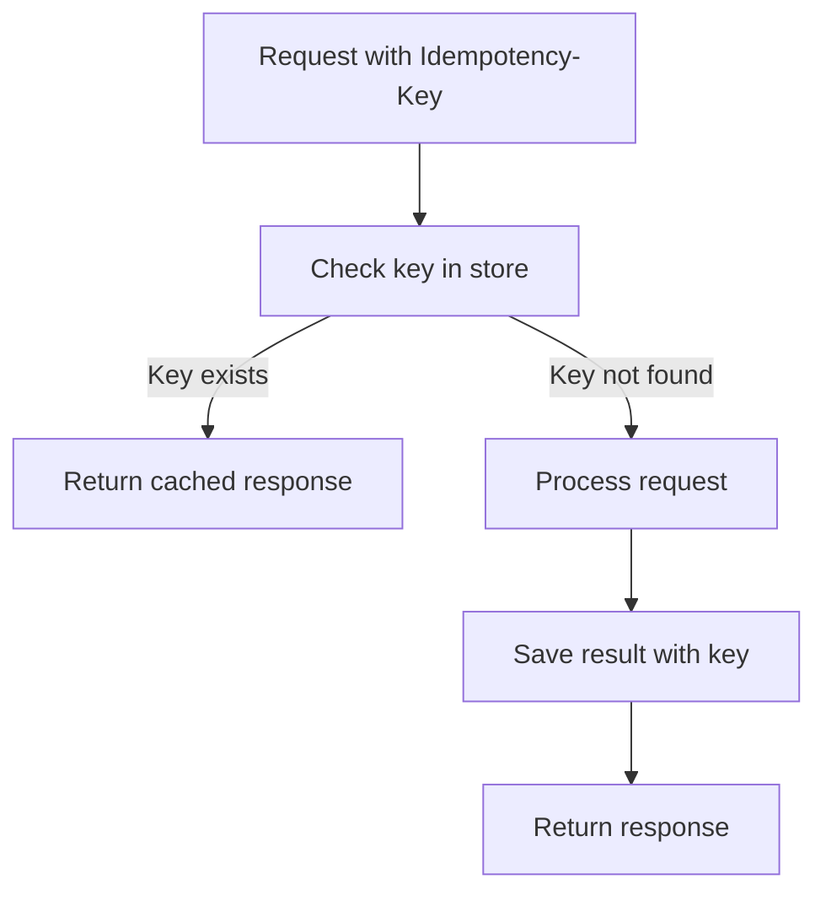
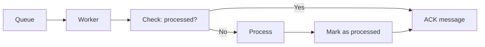
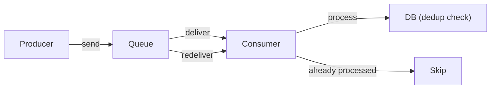

## What is Idempotency?

An operation is **idempotent** if performing it multiple times produces the same result as performing it once. This is critical for building reliable distributed systems where retries and duplicate messages are common.

---

## Examples

| **Operation** | **Idempotent?** | **Why** |
|--------------|-----------------|---------|
| GET /users/123 | Yes | Reading doesn't change state |
| DELETE /users/123 | Yes | Deleting twice = same result |
| PUT /users/123 (name: "Alice") | Yes | Sets to same value each time |
| POST /orders | No | Creates new order each time |
| Increment counter | No | Each call changes the value |

---

## Why Idempotency Matters



---

## Idempotency Keys

### How It Works



### Implementation

```javascript
async function handlePayment(req, res) {
  const idempotencyKey = req.headers['idempotency-key'];

  // Check if we've seen this request before
  const existing = await redis.get(`idem:${idempotencyKey}`);
  if (existing) {
    return res.json(JSON.parse(existing));
  }

  // Process the payment
  const result = await processPayment(req.body);

  // Store the result (TTL: 24 hours)
  await redis.set(
    `idem:${idempotencyKey}`,
    JSON.stringify(result),
    'EX', 86400
  );

  return res.json(result);
}
```

---

## Making Operations Idempotent

### Database Writes

```sql
-- Non-idempotent: creates duplicate
INSERT INTO payments (user_id, amount) VALUES (1, 100);

-- Idempotent: uses unique constraint
INSERT INTO payments (user_id, amount, idempotency_key)
VALUES (1, 100, 'abc-123')
ON CONFLICT (idempotency_key) DO NOTHING;
```

### Message Processing



---

## Strategies

| **Strategy** | **How** | **Best For** |
|-------------|---------|-------------|
| Idempotency Key | Client-generated unique key | API requests |
| Natural Key | Use business identifier | Order processing |
| Upsert | INSERT ON CONFLICT UPDATE | Database writes |
| Deduplication table | Track processed IDs | Message consumers |
| Conditional write | Check version/ETag | Concurrent updates |

---

## Common Patterns

### Stripe's Approach

```http
POST /v1/charges
Idempotency-Key: unique-key-123
Content-Type: application/json

{
    "amount": 2000,
    "currency": "usd"
}
```

- Keys expire after 24 hours
- Responses are cached and replayed
- Different request body with same key returns error

### At-Least-Once + Idempotency



Guarantees **exactly-once semantics** even with at-least-once delivery.

---

## Best Practices

1. **Generate keys client-side** using UUIDs
2. **Store results with TTL** (don't keep forever)
3. **Validate request body matches** for same key
4. **Make the check atomic** with the operation
5. **Use natural keys** when available (order ID, transaction ID)

---

## Interview Tips

- Explain why idempotency matters for retries
- Know HTTP method idempotency (GET, PUT, DELETE = yes; POST = no)
- Describe idempotency key pattern (Stripe example)
- Discuss at-least-once + deduplication = exactly-once
- Mention database strategies (upsert, unique constraints)
