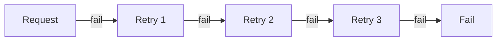
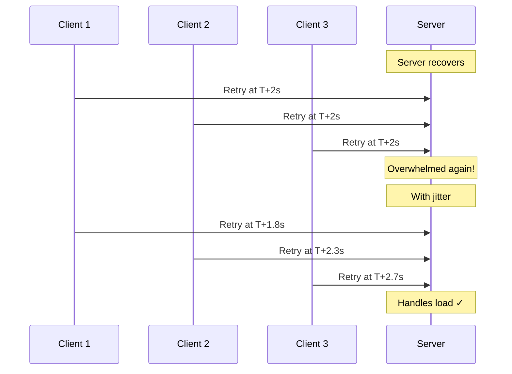
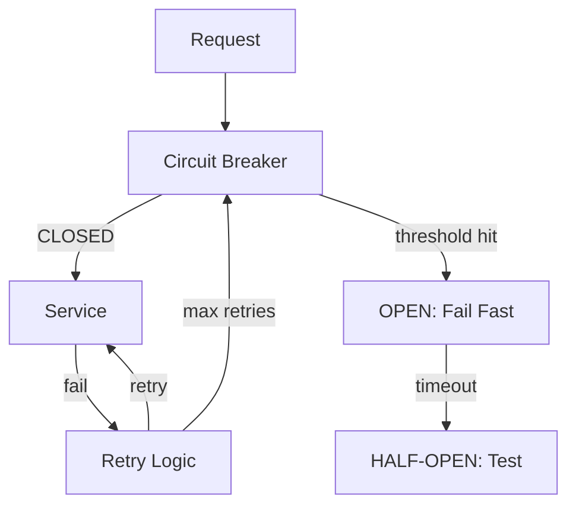

## What is the Retry Pattern?

The **Retry Pattern** automatically re-attempts a failed operation, assuming the failure is transient (temporary). Network blips, timeouts, and brief service outages often resolve themselves within seconds.

---

## When to Retry

| **Retry** | **Don't Retry** |
|-----------|-----------------|
| Network timeout | 400 Bad Request |
| 503 Service Unavailable | 401 Unauthorized |
| 429 Too Many Requests | 404 Not Found |
| Connection reset | Business logic error |
| DNS resolution failure | Data validation error |

---

## Retry Strategies

### Immediate Retry



Simple but can overwhelm an already struggling service.

### Fixed Delay

```
Attempt 1 → fail → wait 2s
Attempt 2 → fail → wait 2s
Attempt 3 → fail → wait 2s
Attempt 4 → fail → give up
```

### Exponential Backoff

```
Attempt 1 → fail → wait 1s
Attempt 2 → fail → wait 2s
Attempt 3 → fail → wait 4s
Attempt 4 → fail → wait 8s
Attempt 5 → fail → give up
```

### Exponential Backoff with Jitter

```
Attempt 1 → fail → wait 1s + random(0-500ms)
Attempt 2 → fail → wait 2s + random(0-500ms)
Attempt 3 → fail → wait 4s + random(0-500ms)
```

Jitter prevents the **thundering herd** problem where all clients retry simultaneously.

---

## Comparison

| **Strategy** | **Delay** | **Best For** |
|-------------|-----------|-------------|
| Immediate | None | Very transient failures |
| Fixed | Constant | Known recovery times |
| Exponential | Increasing | Unknown recovery times |
| Exponential + Jitter | Increasing + random | High-concurrency systems |

---

## The Thundering Herd Problem



---

## Code Example

```javascript
async function retryWithBackoff(fn, options = {}) {
  const {
    maxRetries = 3,
    baseDelay = 1000,
    maxDelay = 30000,
    jitter = true
  } = options;

  for (let attempt = 0; attempt <= maxRetries; attempt++) {
    try {
      return await fn();
    } catch (error) {
      if (attempt === maxRetries || !isRetryable(error)) {
        throw error;
      }

      let delay = Math.min(baseDelay * Math.pow(2, attempt), maxDelay);
      if (jitter) {
        delay += Math.random() * delay * 0.5;
      }

      await new Promise(resolve => setTimeout(resolve, delay));
    }
  }
}

function isRetryable(error) {
  const retryableCodes = [408, 429, 500, 502, 503, 504];
  return retryableCodes.includes(error.statusCode);
}
```

---

## Retry + Circuit Breaker

These patterns complement each other:



---

## Retry Budgets

Limit total retries across all clients:

| **Approach** | **Description** |
|-------------|-----------------|
| Per-request limit | Max 3 retries per request |
| Per-client limit | Max 10 retries per second |
| System-wide budget | Total retries < 10% of requests |

---

## Best Practices

1. **Only retry idempotent operations** (or use idempotency keys)
2. **Set a maximum retry count** to avoid infinite loops
3. **Use exponential backoff with jitter** for distributed systems
4. **Log retry attempts** for debugging
5. **Combine with circuit breaker** to fail fast when service is down

---

## Interview Tips

- Explain exponential backoff with jitter
- Discuss which errors are retryable vs permanent
- Mention thundering herd problem
- Combine with circuit breaker pattern
- Know retry budgets for system-wide protection
