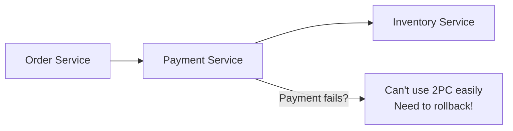
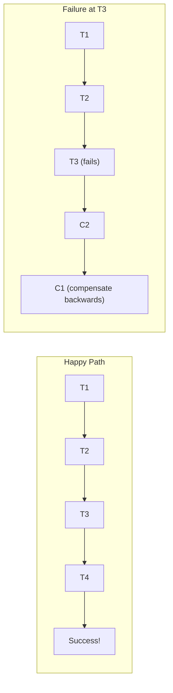
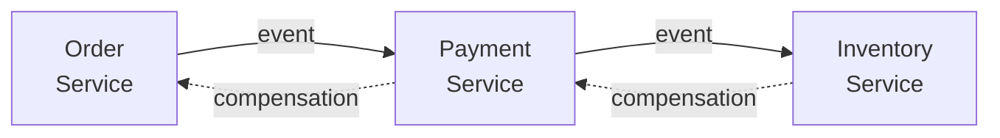
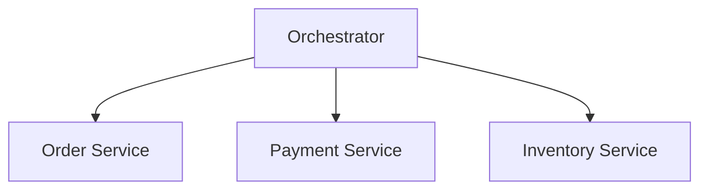
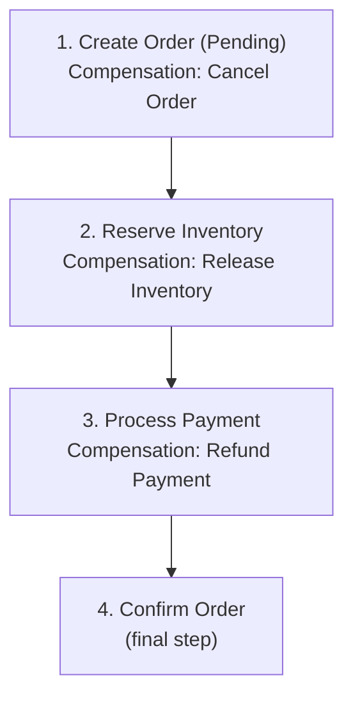
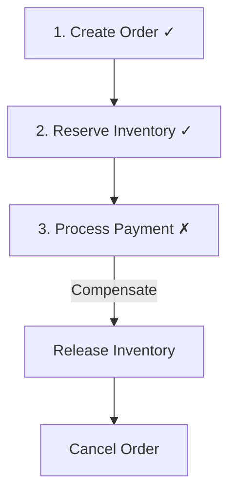

## What is the Saga Pattern?

The **Saga Pattern** manages distributed transactions across multiple services by breaking them into a sequence of local transactions. Each step has a compensating transaction to undo its work if a later step fails.

---

## The Problem

Distributed transactions are hard:

---

## How Sagas Work

| **Concept** | **Description** |
|------------|-----------------|
| Transaction (T) | Local transaction in a service |
| Compensation (C) | Undo action for a transaction |
| Saga | Sequence of T₁, T₂, ..., Tₙ with compensations C₁, C₂, ..., Cₙ |

---

## Saga Types

### Choreography

Services react to events, no central coordinator:

**Pros**: Decoupled, simple for few steps
**Cons**: Hard to track, complex flows

### Orchestration

Central coordinator manages the flow:

**Pros**: Easy to understand, centralized logic
**Cons**: Orchestrator can be bottleneck

---

## Example: Order Saga

### Failure Scenario

---

## Implementation Tips

| **Consideration** | **Approach** |
|------------------|-------------|
| Idempotency | Make operations repeatable safely |
| Correlation ID | Track saga instance across services |
| Timeout | Handle stuck sagas |
| Monitoring | Track saga state and failures |

---

## Saga vs 2PC

| **Aspect** | **Saga** | **2PC** |
|-----------|---------|---------|
| Consistency | Eventual | Strong |
| Availability | Higher | Lower |
| Complexity | Business logic | Protocol |
| Scalability | Better | Worse |
| Recovery | Compensation | Rollback |

---

## Interview Tips

- Explain choreography vs orchestration
- Describe compensation transactions
- Discuss idempotency requirement
- Know trade-offs vs 2PC
- Give examples: e-commerce order flow
