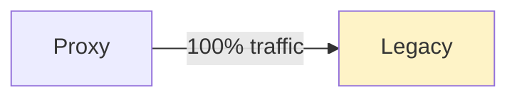
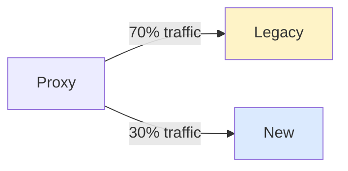
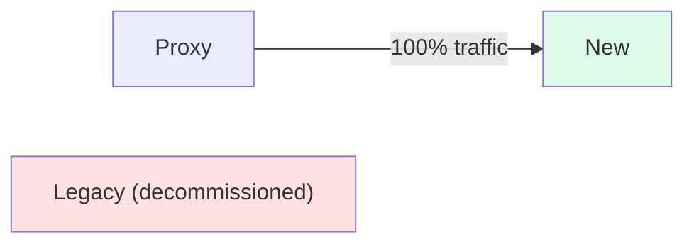
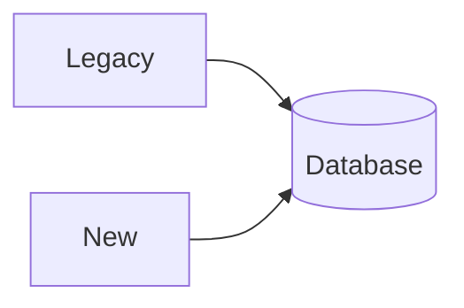
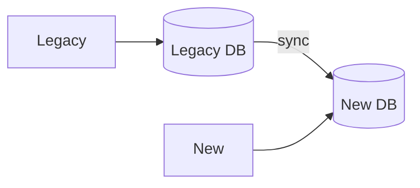
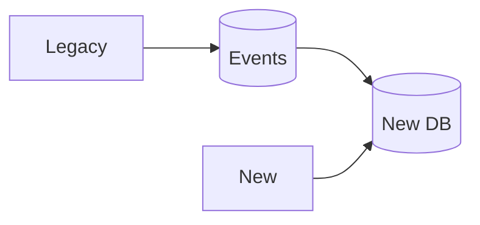

## What is Strangler Fig?

The **Strangler Fig** pattern incrementally replaces a legacy system by gradually routing traffic to new components until the old system can be decommissioned. Named after strangler fig trees that grow around host trees.

---

## The Pattern

**Phase 1: New component alongside legacy**



**Phase 2: Gradual migration**



**Phase 3: Complete migration**



---

## How It Works

1. **Identify**: Find functionality to migrate
2. **Build**: Create new implementation
3. **Route**: Proxy routes traffic based on rules
4. **Migrate**: Gradually increase new system traffic
5. **Remove**: Decommission legacy when complete

---

## Implementation Strategies

### By Feature

Migrate feature by feature:

```
/users/*     → New service
/orders/*    → Legacy (next)
/products/*  → Legacy
```

### By User Segment

Route specific users to new system:

```
Beta users    → New system
Regular users → Legacy
```

### By Percentage

Gradual rollout:

```
5% traffic  → New system (test)
50% traffic → New system (validate)
100% traffic → New system (complete)
```

---

## Proxy/Router Patterns

### URL-Based Routing

```nginx
location /api/v2/users {
    proxy_pass http://new-service;
}

location /api/users {
    proxy_pass http://legacy;
}
```

### Header-Based Routing

```
X-Use-New-System: true → New system
(no header)           → Legacy
```

---

## Benefits

| **Benefit** | **Description** |
|------------|-----------------|
| Reduced risk | Incremental, rollback possible |
| Continuous delivery | Deploy without big bang |
| Learn and adapt | Adjust based on feedback |
| Team productivity | Work on new while legacy runs |

---

## Challenges

| **Challenge** | **Mitigation** |
|--------------|---------------|
| Data synchronization | Shared database or sync mechanism |
| Feature parity | Prioritize critical features |
| Testing both systems | Comprehensive test coverage |
| Extended timeline | Plan milestones, track progress |

---

## Data Migration

Options for handling data during migration:

**Option 1: Shared Database**



**Option 2: Data Sync**



**Option 3: Event-Based**



---

## Real-World Example

**E-commerce migration**:

```
Week 1-4:   Product catalog → New system
Week 5-8:   User profiles → New system
Week 9-12:  Shopping cart → New system
Week 13-16: Checkout → New system
Week 17+:   Decommission legacy
```

---

## Interview Tips

- Explain incremental migration concept
- Discuss routing strategies (URL, header, percentage)
- Mention data synchronization challenges
- Compare with big bang rewrite risks
- Give use cases: monolith to microservices migration
