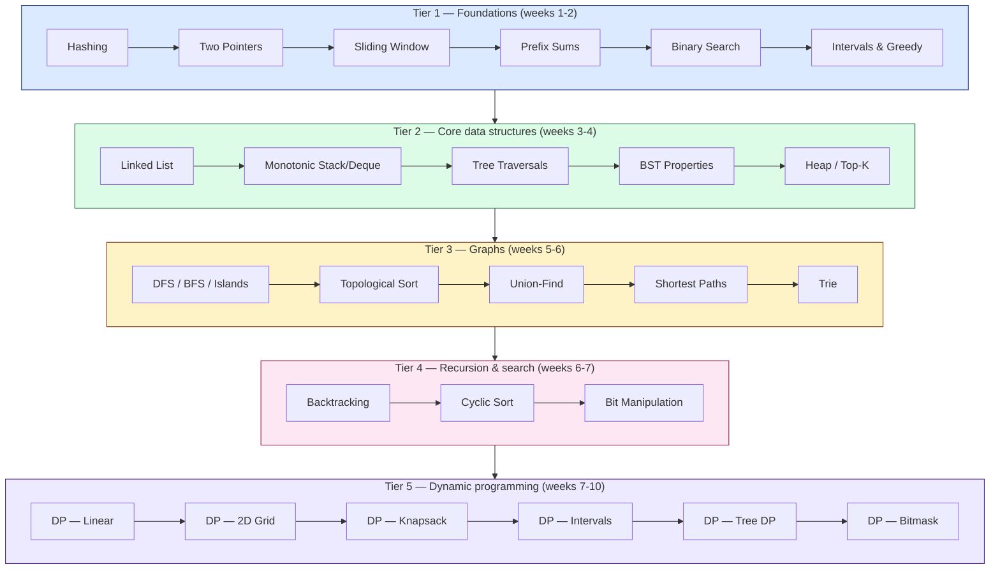
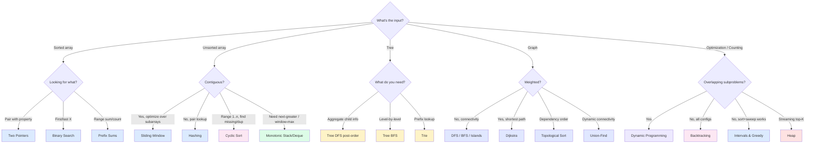

import { Cards, Card } from 'fumadocs-ui/components/card';

You don't memorize 3,000 LeetCode problems. You learn ~25 **patterns** and a *checklist for recognizing which pattern matches a given problem.*

This is a curated reference, not a solution archive. Every page teaches:
1. **What to look for** in the problem statement to know this pattern applies
2. **The invariant** the pattern preserves (the "why it works")
3. **A canonical template** you can adapt to any problem in the family
4. **A worked example** showing the template applied end-to-end
5. **Variants, pitfalls, and curated practice problems** linked to LeetCode

---

## The 25 patterns

<Cards>
  <Card title="Arrays & Strings" href="/dsa/patterns/arrays-strings" description="Two Pointers, Sliding Window, Prefix Sums, Binary Search, Hashing, Intervals & Greedy" />
  <Card title="Stacks & Queues" href="/dsa/patterns/stacks-queues" description="Monotonic Stack and Deque" />
  <Card title="Linked List" href="/dsa/patterns/linked-list" description="Reverse, merge, fast/slow, cycle detection" />
  <Card title="Trees" href="/dsa/patterns/trees" description="Traversals, BST, Trie" />
  <Card title="Graphs" href="/dsa/patterns/graphs" description="DFS/BFS, Topological Sort, Union-Find, Shortest Paths" />
  <Card title="Heaps" href="/dsa/patterns/heaps" description="Top-K, K-way Merge, Two Heaps" />
  <Card title="Recursion & Search" href="/dsa/patterns/recursion" description="Backtracking and Cyclic Sort" />
  <Card title="Dynamic Programming" href="/dsa/patterns/dp" description="Linear, 2D Grid, Knapsack, Intervals, Tree DP, Bitmask" />
  <Card title="Bit Tricks" href="/dsa/patterns/bit" description="XOR, masks-as-sets, n & (n-1)" />
</Cards>

---

## How to learn DSA in 10 weeks

The order matters. The Tier 1 patterns unlock ~40% of interview problems. Tier 3 (graphs) and Tier 5 (DP) are the gates that block most candidates — earn them last, after you're fluent in the basics.

---

## Pattern recognition cheat sheet

The single most useful skill in DSA interviews is **mapping problem phrasing → pattern** in the first 30 seconds. Here's the decision tree:

---

## What's covered (and what's not)

### Covered (the 25 patterns above)

These cover roughly **85% of problems** asked in FAANG-style interviews. They're the patterns NeetCode, takeUforward, Grokking, and AlgoMonster all agree are essential.

### Deliberately skipped

- **String matching algorithms** (KMP, Z, Manacher, Aho-Corasick, Suffix Arrays) — virtually never asked at FAANG SWE level
- **Segment Tree, Fenwick/BIT, Sparse Table** — competitive programming territory
- **Bridges, Articulation Points, Tarjan / Kosaraju (SCC)** — rare in interviews
- **DP optimizations** (convex hull trick, divide-and-conquer optimization, Knuth) — competitive programming
- **Digit DP, Game Theory / Minimax, Geometry** — < 1% of FAANG questions

If you're prepping for ICPC or Codeforces Div 1, you'll want a separate reference for these. For SWE interviews, the 25 patterns here are enough.

---

## How to use this section

**Mode A — learning from scratch.** Follow the Tier 1 → Tier 5 order. Each page is self-contained, takes ~20 minutes to read, and links to 8–15 curated LeetCode problems. Do at least 3 problems per pattern before moving on.

**Mode B — refreshing before a problem.** Each page has a TL;DR card at the top with the template and trigger conditions. 30 seconds gets you back into the pattern.

**Mode C — pattern recognition during interview prep.** Use the decision tree above + the "Trigger Conditions" section on each page. Practice mapping a problem statement to a pattern in 30 seconds before you write any code.

---

## Related sections

- [System Design (HLD)](/sd) — the architecture layer
- [HLD Case Studies](/hld) — real systems like Netflix, Uber, WhatsApp
- [LLD & Patterns](/lld) — OOP, GoF patterns, machine coding

DSA shows up inside many LLD case studies — [LRU Cache](/lld/case-studies/cache-lru-lfu) uses a linked list, [LinkedIn Connections](/lld/case-studies/linkedin-connections) uses BFS, [Movie Booking](/lld/case-studies/movie-booking) uses interval reasoning. The cross-links go both ways.
