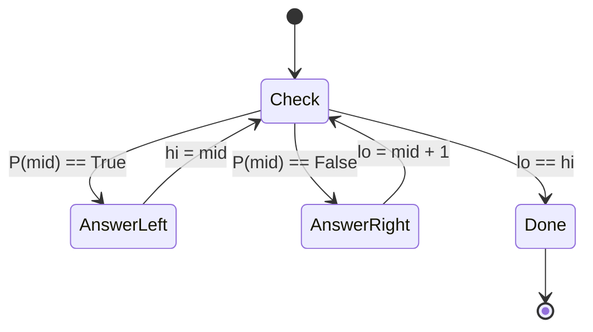

import { Callout } from 'fumadocs-ui/components/callout';

<Callout title="TL;DR — Binary Search">

**Use when**: the search space is *monotonic* — sorted, or has a property that flips from `false` to `true` exactly once.

**Trigger phrases**: "sorted array", "find target", "first/last that satisfies P", "minimum X such that ...", "maximize the minimum", "minimize the maximum", "can we ... in K time?".

**One algorithm, three setups**:
1. Search a sorted array for an exact match
2. Find the *first* index where a predicate becomes true
3. Binary search on the *answer* (when answer-space is bounded and monotonic)

**Complexity**: O(log n) per search; if the predicate is O(n), total O(n log n) or O(n log answer-range).

</Callout>

---

## The problem that motivates this pattern

> **Find First and Last Position of Element in Sorted Array.** Given a sorted array `nums` and a `target`, return `[first_index, last_index]` of `target`, or `[-1, -1]` if not found.

Brute force: linear scan, O(n). For 10⁵ elements per query × 10⁵ queries, that's 10¹⁰ operations — way over the limit.

Insight: the array is **sorted**. We can ask "is `target` in the left half or the right half?" at each step, halving the search space. log₂(10⁵) ≈ 17 — so each query takes ~17 comparisons. 10⁵ queries × 17 = 1.7 × 10⁶ ops. *Five orders of magnitude faster.*

That's the bargain. **Sortedness is information, and binary search is how you spend it logarithmically.**

But here's where most people stumble. "Find target" is *easy*. The hard binary-search problems aren't "is X in the array?" — they're things like:

- *Find the smallest capacity that can ship all packages within D days.* (Search over capacities, not over an array.)
- *Find the median of two sorted arrays.* (Search over partition points.)
- *Find the smallest divisor that keeps the sum below a threshold.*

These don't *look* like binary search problems. The unifying principle: **whenever you can frame "does X work?" as a monotonic predicate on a numeric range, binary search applies**.

---

## The core insight

**Binary search is about a monotonic predicate, not about sorted arrays.**

Picture a boolean function `P(x)` defined on integers in some range `[lo, hi]`. If `P` is monotonic — i.e., once it becomes True, it stays True — then there's a *single boundary* between the False region and the True region. Binary search locates that boundary in O(log(hi - lo)).

```
P:  F F F F F T T T T T T
    ↑         ↑           ↑
    lo      boundary     hi
```

The boundary is the *first* index where `P` becomes `True`. (Or, depending on how you set it up, the *last* index where it's `False` — symmetric.)

For a sorted-array search, `P(i) = (nums[i] >= target)`. The boundary is the first index ≥ target — exactly `lower_bound`.

For "smallest capacity that ships in D days," `P(cap) = canShipIn(cap) <= D`. As capacity grows, eventually it becomes feasible. We want the smallest True.

For "find peak element," `P(i) = (nums[i] > nums[i+1])`. The first True marks where the array starts going down — i.e., a peak.

**Recognize this pattern: most binary-search problems boil down to "find the boundary of a monotonic predicate."** Once you see this, you stop memorizing templates per problem.

The invariant we maintain:

> **The answer (the boundary) is in `[lo, hi]`. We narrow `[lo, hi]` by half each step without ever excluding the answer.**



---

## Visual walkthrough

Let's find the **first index ≥ 6** in `nums = [1, 3, 5, 7, 9, 11]`.

We're looking for the boundary of `P(i) = (nums[i] >= 6)`. The predicate values are:

```
nums[i]:  1  3  5  7  9  11
P(i):     F  F  F  T  T  T
```

The answer is index `3`.

**Step 1.** `lo = 0`, `hi = 6` (one past the end). `mid = 3`. `nums[3] = 7 >= 6` → True. *Answer is in `[lo, mid]`.* Set `hi = 3`.

```
[1, 3, 5, 7, 9, 11]
 ↑        ↑      ↑
 lo      mid    hi-1
 lo=0, hi=6, mid=3 → True → hi=3
```

**Step 2.** `lo = 0`, `hi = 3`. `mid = 1`. `nums[1] = 3 >= 6` → False. *Answer is in `[mid+1, hi]`.* Set `lo = 2`.

```
[1, 3, 5, 7, 9, 11]
 ↑  ↑     ↑
 lo mid  hi
 lo=0, hi=3, mid=1 → False → lo=2
```

**Step 3.** `lo = 2`, `hi = 3`. `mid = 2`. `nums[2] = 5 >= 6` → False. Set `lo = 3`.

**Step 4.** `lo = hi = 3`. Exit loop. **Answer: 3** ✓.

Notice:
- `hi` is *exclusive* (one past the answer range).
- The loop condition is `lo < hi`, not `lo <= hi`.
- When `P(mid)` is True, `hi = mid` (NOT `mid - 1`) — because `mid` itself might be the answer.
- When `P(mid)` is False, `lo = mid + 1` — we ruled `mid` out.

These conventions seem fussy but they make the template **off-by-one-proof**. Use the same conventions everywhere and you'll never write a wrong binary search again.

---

## The template

The single template that works for every binary-search problem: **find the first index where `P` is True, where `P` is a user-defined monotonic predicate.**

```python
def lower_bound(lo: int, hi: int, p) -> int:
    """Return the first index in [lo, hi) where p(i) is True.
    Returns hi if no such index exists.
    Assumes p is monotonic: once True, stays True.
    """
    while lo < hi:
        mid = lo + (hi - lo) // 2     # avoids overflow in C++/Java
        if p(mid):
            hi = mid
        else:
            lo = mid + 1
    return lo
```

That's it. Three lines of logic. Memorize this and every binary-search problem becomes "what's the predicate?"

**The four conventions that make it bulletproof:**

1. **`hi` is exclusive.** Initialize `hi = n` or `hi = max_possible_answer + 1`.
2. **Loop condition: `lo < hi`.** (Not `<=`.)
3. **When `p(mid)` is True: `hi = mid`.** (Not `mid - 1`.)
4. **When `p(mid)` is False: `lo = mid + 1`.**

If you remember these four lines, you'll never write `mid + 1 / mid - 1` confusion again.

### Finding the **last** True (instead of first)

Flip: find the first False (after the last True), then subtract 1. Or define `p'(x) = !p(x)` and find `lower_bound - 1`. Don't write a new template — convert your problem to first-True.

---

## Three modes, one template

### Mode 1 — Exact match in a sorted array

```python
def search(nums, target):
    i = lower_bound(0, len(nums), lambda i: nums[i] >= target)
    return i if i < len(nums) and nums[i] == target else -1
```

The predicate: `nums[i] >= target`. The first True is the *insertion point*. Check if it's actually equal.

### Mode 2 — First/last satisfying a custom predicate

```python
# Find peak element
def find_peak(nums):
    # P(i) = nums[i] > nums[i+1] (going down starts here)
    return lower_bound(0, len(nums) - 1, lambda i: nums[i] > nums[i+1])
```

The predicate doesn't have to compare with a target value. It just has to be **monotonic** over the search range.

### Mode 3 — Binary search on the answer

This is the *hard* mode. The search space isn't an array — it's a *numeric range of possible answers*. You binary-search by asking "does answer `x` work?" via a feasibility check.

```python
def koko_eating_bananas(piles, h):
    # P(speed) = "can finish all piles in <= h hours at this speed?"
    # Monotonic: if speed=5 works, speed=6 also works.
    def can_finish(speed):
        return sum((p + speed - 1) // speed for p in piles) <= h

    lo, hi = 1, max(piles) + 1
    return lower_bound(lo, hi, can_finish)
```

The predicate `can_finish` is O(n). Total complexity: O(n log(max(piles))).

**The "answer" can be anything**: a capacity, a divisor, a partition point, a time. The pattern is: binary-search the answer space, and for each candidate, check feasibility.

---

## Worked example: Koko Eating Bananas (LC 875)

> **Problem.** Koko has `n` piles of bananas. She eats at speed `k` bananas/hour (integer). Each hour she picks a pile and eats `min(k, pile_size)` bananas. Given `piles` and a time limit `h` hours, return the smallest `k` such that she finishes all piles in ≤ `h` hours.

**Why this is binary search on answer.** No sorted array in the input. But:
- The answer (speed `k`) is a positive integer in `[1, max(piles)]`.
- The predicate "can finish in ≤ h hours at speed k" is **monotonic**: if `k = 5` works, `k = 6` also works.

So there's a boundary in the speed range — slow speeds can't finish, fast speeds can. We want the smallest True. Binary search.

**What changes from the template.** Three slots:

1. **Search space**: speeds from 1 to `max(piles)`.
2. **Predicate**: `can_finish(speed)` — sum the per-pile hours `ceil(pile / speed)` and check against `h`.
3. **Convention**: `hi = max(piles) + 1` (exclusive). The answer is `lower_bound(...)`.

```python
def min_eating_speed(piles: list[int], h: int) -> int:
    def can_finish(speed: int) -> bool:
        hours = 0
        for pile in piles:
            hours += (pile + speed - 1) // speed       # ceiling division
        return hours <= h

    lo, hi = 1, max(piles) + 1
    while lo < hi:
        mid = lo + (hi - lo) // 2
        if can_finish(mid):
            hi = mid
        else:
            lo = mid + 1
    return lo
```

**Dry-run on `piles = [3, 6, 7, 11], h = 8`:**

| lo | hi | mid | can_finish(mid)? | Action |
|----|-----|-----|---------|--------|
| 1 | 12 | 6 | hours=1+1+2+2=6 ≤ 8 ✓ | hi = 6 |
| 1 | 6 | 3 | hours=1+2+3+4=10 > 8 ✗ | lo = 4 |
| 4 | 6 | 5 | hours=1+2+2+3=8 ≤ 8 ✓ | hi = 5 |
| 4 | 5 | 4 | hours=1+2+2+3=8 ≤ 8 ✓ | hi = 4 |
| 4 | 4 | — | exit | — |

**Answer: 4** ✓.

**Complexity.** O(n log(max(piles))) — the predicate is O(n), and we run it log(max) times.

---

## Variants

### Variant 1 — Exact-match search

The vanilla case. Use `lower_bound` to find where the value should be; verify equality.

**Canonical problems**: 704 Binary Search, 34 First and Last Position, 35 Search Insert Position.

### Variant 2 — Rotated sorted array

The array isn't fully sorted but has one rotation point. The trick: at each `mid`, decide which half is sorted; check if `target` lies in that half. If yes, search there; otherwise search the other.

```python
def search_rotated(nums, target):
    lo, hi = 0, len(nums) - 1
    while lo <= hi:
        mid = (lo + hi) // 2
        if nums[mid] == target: return mid
        if nums[lo] <= nums[mid]:               # left half sorted
            if nums[lo] <= target < nums[mid]:
                hi = mid - 1
            else:
                lo = mid + 1
        else:                                    # right half sorted
            if nums[mid] < target <= nums[hi]:
                lo = mid + 1
            else:
                hi = mid - 1
    return -1
```

**Canonical problems**: 33 Search in Rotated Sorted Array, 153 Find Minimum in Rotated Sorted Array, 154 (with duplicates — degenerates to O(n) worst case).

### Variant 3 — Find peak / valley

Use the local-slope predicate. Works on unsorted arrays as long as the local property is monotonic in the search range.

**Canonical problems**: 162 Find Peak Element, 852 Peak Index in a Mountain Array, 1095 Find in Mountain Array.

### Variant 4 — Binary search on a 2D matrix

If the matrix is row-major sorted, treat it as a flat 1D array of length `m × n` and convert `mid` to `(row, col)`.

```python
def search_matrix(matrix, target):
    m, n = len(matrix), len(matrix[0])
    lo, hi = 0, m * n
    while lo < hi:
        mid = (lo + hi) // 2
        r, c = mid // n, mid % n
        if matrix[r][c] >= target:
            hi = mid
        else:
            lo = mid + 1
    return lo < m * n and matrix[lo // n][lo % n] == target
```

**Canonical problems**: 74 Search a 2D Matrix, 240 Search a 2D Matrix II (saddleback search — different pattern).

### Variant 5 — Binary search on the answer (the hardest mode)

The pattern's most powerful application. Recognize the trigger: "smallest X such that...", "maximize the minimum...", "minimize the maximum...".

**Canonical problems**: 875 Koko Eating Bananas (worked above), 1011 Capacity to Ship Packages, 410 Split Array Largest Sum, 1283 Find the Smallest Divisor, 668 Kth Smallest Number in Multiplication Table, 1539 Kth Missing Positive Number, 1482 Minimum Days to Make M Bouquets.

### Variant 6 — Binary search on real numbers

When the answer is continuous (not integer), run a fixed number of iterations or use a precision threshold.

```python
def search_real(p, lo, hi, eps=1e-7):
    for _ in range(100):
        mid = (lo + hi) / 2
        if p(mid): hi = mid
        else: lo = mid
    return lo
```

**Canonical problems**: 644 Maximum Average Subarray II.

---

## Common pitfalls

| Trap | Fix |
|------|-----|
| Using `lo <= hi` with `hi = n` | Causes off-by-one. Use `lo < hi` with `hi = n` exclusive |
| Using `lo < hi` with `hi = n - 1` | Misses the last element. Use `hi = n` exclusive |
| Writing `mid = (lo + hi) / 2` in Java/C++ | Overflow when `lo + hi > INT_MAX`. Use `lo + (hi - lo) / 2` |
| Setting `hi = mid - 1` when `p(mid)` is True | Wrong! `mid` could be the answer. Use `hi = mid` |
| Infinite loop when forgetting `lo = mid + 1` | Using `lo = mid` on the False branch loops forever when `mid == lo` |
| Predicate isn't monotonic | Binary search will return *some* boundary but not the right one. Verify monotonicity first. |
| Forgetting to handle "not found" | After loop, check `lo < n` AND `nums[lo] == target` before returning |
| Wrong `hi` bound on answer-search | The answer must be in `[lo, hi]`. Be generous on the upper bound — even 10¹⁸ is only 60 iterations |
| Confusing "first True" with "last True" | Convert "last True" to "first False, then subtract 1". Don't write a new template |

---

## Complexity

**Time: O(log(hi - lo))** for the search itself. If the predicate is O(k), the total is **O(k · log(range))**.

For mode 1 (sorted array, predicate is O(1)): O(log n).
For mode 3 (binary search on answer with O(n) predicate): O(n log(answer_range)).

The key thing: **log of 10¹⁸ is ~60**. You can afford absurdly wide answer ranges. People are sometimes scared to use binary search on `[1, 10¹⁸]` thinking it'll be slow. It won't.

**Space: O(1)** for iterative; O(log n) recursion depth if you wrote it recursively (don't).

---

## When NOT to use binary search

- **The search space isn't monotonic.** This is the #1 way binary search fails silently. Always verify: if `p(x)` is True, is `p(x+1)` also True? If not, binary search will return *something* but it won't be what you want.
- **The array isn't sorted (for mode 1).** Sort first if you can afford O(n log n); otherwise use a different approach.
- **The predicate is more expensive than the linear scan it replaces.** If the predicate is O(n) and the linear search is also O(n), binary search adds a `log n` factor for no benefit. Common error in answer-search: a predicate that itself involves nested loops.
- **You can compute the answer directly.** "Find the index where nums[i] = target in a sorted array of distinct integers, given that nums[i] = 2i" → just compute `target / 2`. Don't binary search what you can solve algebraically.
- **The data is small.** Linear search is faster than binary search for n < ~50 due to constant factors (cache, branch prediction). Don't optimize for log n when n is 10.

### Decision rule

| Symptom | Likely pattern |
|---------|---------------|
| "Sorted array, find target" | **Binary Search (Mode 1)** |
| "First/last index satisfying P (monotonic)" | **Binary Search (Mode 2 — lower_bound)** |
| "Smallest X such that feasibility(X)" | **Binary Search on Answer (Mode 3)** |
| "Maximize min / Minimize max" | **Binary Search on Answer (Mode 3)** |
| "Find peak/valley" | **Binary Search on local slope** |
| "Rotated sorted array" | **Modified Binary Search** |
| "Unsorted array, pair-sum" | [Hashing](/dsa/patterns/arrays-strings/hashing) |
| "Sorted array, pair-sum" | [Two Pointers](/dsa/patterns/arrays-strings/two-pointers) |

---

## Real-world applications

- **Database B+ trees.** Index lookups in databases are binary searches over sorted index pages.
- **Library functions.** `std::lower_bound`, `bisect.bisect_left`, `Arrays.binarySearch` — all instances of mode 2.
- **Version control bisecting.** `git bisect` is literally binary search over commits to find the first "bad" commit. Mode 2.
- **Auto-scaling / capacity planning.** "What's the minimum number of replicas to handle this load?" — binary search on the answer with a load-test predicate.
- **Compiler optimizations.** Many compiler passes binary-search over thresholds (loop unrolling factor, inlining size, etc.) to find optimal settings.
- **TCP congestion control.** Some variants binary-search the optimal send rate.

---

## Curated practice problems

| # | Problem | Difficulty | Variant | Note |
|---|---------|-----------|---------|------|
| 1 | ★ 704 Binary Search | Easy | Mode 1 | The textbook problem |
| 2 | 35 Search Insert Position | Easy | Mode 2 (lower_bound) | First-True boundary |
| 3 | 34 First and Last Position | Medium | Mode 2 | Two lower_bound calls |
| 4 | 278 First Bad Version | Easy | Mode 2 | Custom predicate, no array |
| 5 | ★ 33 Search in Rotated Sorted Array | Medium | Variant 2 | Half-decides which side is sorted |
| 6 | 153 Find Minimum in Rotated Sorted | Medium | Variant 2 | Predicate: `nums[mid] > nums[hi]` |
| 7 | ★ 162 Find Peak Element | Medium | Local slope | First index where it goes down |
| 8 | 74 Search 2D Matrix | Medium | 2D, treat as flat | (mid // n, mid % n) |
| 9 | 240 Search 2D Matrix II | Medium | Saddleback | Not really binary search — O(m+n) |
| 10 | ★ 875 Koko Eating Bananas | Medium | Mode 3 | This page's worked example |
| 11 | ★ 1011 Capacity to Ship Packages | Medium | Mode 3 | Min capacity feasible in D days |
| 12 | 410 Split Array Largest Sum | Hard | Mode 3 | Minimize the maximum subarray sum |
| 13 | 1283 Find Smallest Divisor | Medium | Mode 3 | Smallest divisor with sum ≤ threshold |
| 14 | 1482 Min Days to Make M Bouquets | Medium | Mode 3 | Predicate over time |
| 15 | 4 Median of Two Sorted Arrays | Hard | Binary search on partition | The famous one — O(log min(m,n)) |
| 16 | 668 Kth Smallest in Multiplication Table | Hard | Mode 3 | Predicate: count of values ≤ x |

---

## Related patterns

- [Two Pointers](/dsa/patterns/arrays-strings/two-pointers) — when both ends move (vs halving)
- [Sliding Window](/dsa/patterns/arrays-strings/sliding-window) — when the search is over contiguous windows, not a single index
- [Sorting + Intervals/Greedy](/dsa/patterns/arrays-strings/intervals-greedy) — binary search often follows a sort
- [Hashing](/dsa/patterns/arrays-strings/hashing) — the alternative when you can't sort and don't need sorted order

---

## Quick-reference card

```python
# THE template — find first index where p(i) is True
def lower_bound(lo, hi, p):
    while lo < hi:
        mid = lo + (hi - lo) // 2
        if p(mid): hi = mid
        else:      lo = mid + 1
    return lo

# Mode 1: search sorted array
i = lower_bound(0, n, lambda i: nums[i] >= target)
found = i < n and nums[i] == target

# Mode 3: binary search on answer
ans = lower_bound(min_ans, max_ans + 1, can_solve_with)
```

Triggers: sorted, "first/last X", "smallest/largest X such that", "maximize the minimum". Complexity: O(log range) · O(predicate).
