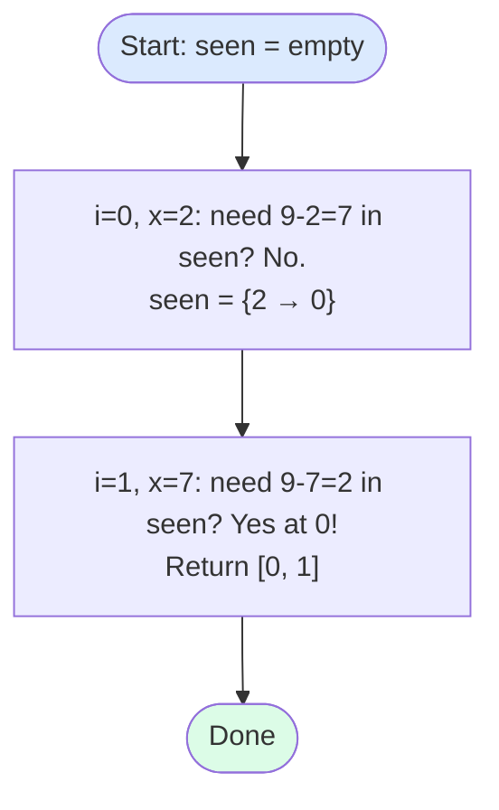

import { Callout } from 'fumadocs-ui/components/callout';

<Callout title="TL;DR — Hashing">

**Use when**: you need O(1) lookup, frequency counts, seen-state ("have I seen this before?"), grouping by a derived key, or to trade O(n) space for O(n²) → O(n) time.

**Trigger phrases**: "two sum" (unsorted), "anagram", "contains duplicate", "longest consecutive sequence", "group by", "first non-repeating", "subarray sum equals K".

**Three flavors**: hash *set* (membership), hash *map* (key → value or key → count), hash map keyed by a *derived signature* (sorted string, char count tuple, etc.).

**Complexity**: O(n) average time, O(n) space.

</Callout>

---

## The problem that motivates this pattern

> **Two Sum (LC 1).** Given an integer array `nums` and an integer `target`, return indices `i, j` such that `nums[i] + nums[j] = target`. The array is *not sorted*.

Brute force: try every pair. O(n²). For n = 10⁵, that's 10¹⁰ — too slow.

[Two Pointers](/dsa/patterns/arrays-strings/two-pointers) won't work directly — sorting destroys the indices we're asked to return.

Insight: as we walk the array, for each element `x` at index `i`, the *complement* we need is `target - x`. If we've seen `target - x` before (at some earlier index `j`), we have our answer: `(j, i)`. So:

- Keep a hash map of *value → index* for what we've seen so far.
- At each new `x`, check if `target - x` is in the map.

O(n) time, O(n) space. **The hash map turned the inner loop into a single lookup.**

```python
def two_sum(nums, target):
    seen = {}                              # value → index
    for i, x in enumerate(nums):
        if target - x in seen:
            return [seen[target - x], i]
        seen[x] = i
```

This is the canonical hashing trade: **spend O(n) space to drop time from O(n²) to O(n)**. The pattern shows up everywhere.

---

## The core insight

**A hash map is a tool for converting "have I seen this?" from O(n) to O(1).**

That's it. That's the whole pattern. Once you internalize this, you see hash-map problems everywhere:

- *"Have I seen this exact number before?"* → contains-duplicate.
- *"Have I seen this character before in this window?"* → longest-substring-without-repeating.
- *"Have I seen this sorted-string before?"* → group-anagrams.
- *"Have I seen this prefix sum before?"* → subarray-sum-equals-K.
- *"Have I seen this number's neighbor before?"* → longest-consecutive-sequence.

The art is choosing the **right key**. Sometimes the key is the value itself. Sometimes it's a *derived signature* — a sorted string, a char-count tuple, a prefix sum, a `(row, col)` of the same value seen earlier.

The invariant we maintain:

> **At any point in the iteration, the hash map encodes everything relevant from the prefix we've already processed, in a form that makes the current question O(1).**

Hashing isn't a single algorithm — it's a *primitive* that powers dozens of patterns. The skill is recognizing "this problem reduces to repeated O(1) lookup of a derived key."

---

## Visual walkthrough

Let's trace **Two Sum** on `nums = [2, 7, 11, 15]`, `target = 9`.



Two iterations. Two hash lookups (each O(1)). Found.

Now let's trace **Group Anagrams** on `["eat", "tea", "tan", "ate", "nat", "bat"]`.

The key insight: anagrams have the *same sorted string*. So `"eat"` and `"tea"` and `"ate"` all hash to `"aet"`. Group by that key.

```
"eat" → sorted = "aet" → groups["aet"] = ["eat"]
"tea" → sorted = "aet" → groups["aet"] = ["eat", "tea"]
"tan" → sorted = "ant" → groups["ant"] = ["tan"]
"ate" → sorted = "aet" → groups["aet"] = ["eat", "tea", "ate"]
"nat" → sorted = "ant" → groups["ant"] = ["tan", "nat"]
"bat" → sorted = "abt" → groups["abt"] = ["bat"]

Result: [["eat","tea","ate"], ["tan","nat"], ["bat"]]
```

The derived signature `"aet"` is the **key**. Anything that has the same anagram-signature ends up in the same bucket. One pass, O(n · k log k) where k = max string length.

---

## The template

There are three template shapes, depending on what you're storing.

### Template A — Hash set (membership only)

```python
def has_duplicate(nums):
    seen = set()
    for x in nums:
        if x in seen:
            return True
        seen.add(x)
    return False
```

Used for: contains-duplicate, longest-consecutive-sequence (seed by set membership), happy-number (cycle detection via seen-set).

### Template B — Hash map (key → value or count)

```python
def two_sum(nums, target):
    seen = {}                              # value → first index
    for i, x in enumerate(nums):
        if target - x in seen:
            return [seen[target - x], i]
        seen[x] = i
```

For frequency counting:

```python
from collections import Counter
counts = Counter(nums)                     # value → count
most_common = counts.most_common(k)        # top-k by frequency
```

Used for: two-sum, frequency-based problems, first-non-repeating, top-K frequent.

### Template C — Hash map with derived signature key

```python
from collections import defaultdict

def group_anagrams(strs):
    groups = defaultdict(list)
    for s in strs:
        key = ''.join(sorted(s))           # signature
        groups[key].append(s)
    return list(groups.values())
```

The key isn't the input — it's something you *compute* from the input that makes equivalent items collide.

Used for: group-anagrams, valid-sudoku (key = "row 3", "col 5", "box 1"), longest-substring-without-repeating (key = char → last-index), prefix-sum-equals-K.

---

## Worked example: Longest Consecutive Sequence (LC 128)

> **Problem.** Given an unsorted array of integers `nums`, return the length of the longest consecutive elements sequence. Algorithm must run in O(n). Example: `[100, 4, 200, 1, 3, 2]` → `4` (the sequence `[1, 2, 3, 4]`).

**Why this is hashing.** The "O(n)" constraint immediately rules out sorting (O(n log n)). What we need: O(1) check for "is this number's neighbor in the set?"

**The naive O(n)-attempt that doesn't work**: put all numbers in a set, then for each `x` iterate `x+1, x+2, ...` until you fall off. This is O(n²) worst case (sequence `[1..n]` starts a walk from every element).

**The fix**: only start a walk from the *smallest* number in each sequence. We can detect "this is the smallest" by checking: is `x - 1` NOT in the set? If `x - 1` isn't in the set, then `x` is the start of a streak; walk forward. Otherwise, skip — we'll count this number when we walk from its predecessor.

```python
def longest_consecutive(nums: list[int]) -> int:
    s = set(nums)
    best = 0
    for x in s:
        if x - 1 in s:
            continue                       # not the start of a streak
        # x is a streak start; walk forward
        length = 1
        while x + length in s:
            length += 1
        best = max(best, length)
    return best
```

**Why this is O(n).** Each number is touched **at most twice**: once by the outer `for` loop, and at most once by some inner `while` walk (only the streak's start walks; no element is visited by multiple walks).

**Dry-run on `[100, 4, 200, 1, 3, 2]`:**

| x | x - 1 in s? | Skip? | Walk | Length |
|---|---|---|---|---|
| 100 | 99? No | start | 100, (101? no) | 1 |
| 4 | 3? Yes | skip | — | — |
| 200 | 199? No | start | 200, (201? no) | 1 |
| 1 | 0? No | start | 1, 2, 3, 4, (5? no) | 4 |
| 3 | 2? Yes | skip | — | — |
| 2 | 1? Yes | skip | — | — |

**Answer: 4** ✓.

**Complexity.** O(n) time, O(n) space. The `x - 1 in s` check is what makes this work — without it, you'd revisit numbers.

---

## Variants

### Variant 1 — Hash set for "have I seen this?"

The simplest case. Used to detect duplicates, cycles, or membership in a set.

**Canonical problems**: 217 Contains Duplicate, 219 Contains Duplicate II, 202 Happy Number, 268 Missing Number.

### Variant 2 — Hash map for frequency counting

Map each element to its count. Often used with `most_common(k)` or sorting by frequency.

```python
from collections import Counter
def top_k_frequent(nums, k):
    counts = Counter(nums)
    return [val for val, _ in counts.most_common(k)]
```

**Canonical problems**: 347 Top K Frequent Elements, 451 Sort Characters by Frequency, 387 First Unique Character, 169 Majority Element (Boyer-Moore is faster, but Counter works).

### Variant 3 — Hash map keyed by sorted/canonical signature

The "anagram trick." Group items that map to the same canonical key.

```python
def group_anagrams(strs):
    groups = defaultdict(list)
    for s in strs:
        key = ''.join(sorted(s))           # or tuple of char counts
        groups[key].append(s)
    return list(groups.values())
```

For very long strings, replace `sorted(s)` with a 26-tuple of character counts (`tuple(Counter(s).get(c, 0) for c in 'abcdefghijklmnopqrstuvwxyz')`) for O(n) per key instead of O(n log n).

**Canonical problems**: 49 Group Anagrams, 242 Valid Anagram, 438 Find All Anagrams in a String.

### Variant 4 — Hash map for index lookup ("have I seen this value before?")

The two-sum shape: map value → index, query "is the complement in the map?"

**Canonical problems**: 1 Two Sum, 167 Two Sum II (use two-pointers instead), 15 3Sum (use two-pointers + hash), 18 4Sum, 454 4Sum II (split into pairs and hash partial sums).

### Variant 5 — Hash map for derived running state

The most powerful variant. Combine with [Prefix Sums](/dsa/patterns/arrays-strings/prefix-sum), [Sliding Window](/dsa/patterns/arrays-strings/sliding-window), or other patterns. The hash map stores "running signature → count or index."

```python
# Subarray sum equals K — prefix_sum is the key
def subarray_sum(nums, k):
    seen = {0: 1}                          # empty prefix
    cum = count = 0
    for x in nums:
        cum += x
        count += seen.get(cum - k, 0)
        seen[cum] = seen.get(cum, 0) + 1
    return count
```

**Canonical problems**: 560 Subarray Sum Equals K, 974 Subarray Sums Divisible by K, 525 Contiguous Array (treat 0 as -1; find longest with sum=0), 437 Path Sum III (DFS + prefix hash).

### Variant 6 — Hash map for graph / 2D coordinates

Hash maps keyed by tuples (or stringified coordinates) for sparse 2D data or graph adjacency.

```python
visited = set()
visited.add((row, col))                    # tuples are hashable in Python
```

**Canonical problems**: 36 Valid Sudoku (hash sets per row/col/box), 149 Max Points on a Line (hash slopes), 36-like Sudoku validators.

---

## Common pitfalls

| Trap | Fix |
|------|-----|
| Using a mutable type as a hash key (Python list, JS Object) | Convert to tuple / use string / use object identity carefully |
| Forgetting to handle the "value equals its own complement" case | `target - x == x`, need to check index ≠ i (Two Sum: harmless since you add `x` *after* the check) |
| Mutating during iteration of a Python dict | Iterate over `list(d.items())` or use a separate list to collect mutations |
| Comparing floating-point keys | Hash maps don't tolerate floating-point precision errors; round or scale to int first |
| Worst-case O(n) per operation under adversarial input | Rare in practice, but real for malicious inputs. Use a different structure if security matters |
| Forgetting to seed the prefix-sum hash with `{0: 1}` | Causes off-by-one (misses subarrays starting at index 0) |
| Re-computing the signature inside a loop | Compute once per element; store the result |
| Choosing the wrong key | Group-anagrams with `len(s)` as key groups wrong things. Pick the *minimal-information* key that makes equivalent items collide |
| Using HashMap when sorting is faster for small N | For n < 100, sorting (O(n log n)) often beats hashing in cache friendliness |

---

## Complexity

**Average case: O(1) per insert/lookup, O(n) total.**

**Worst case: O(n) per operation** if hash collisions degenerate to a linked list. In practice this only happens under adversarial input or with a *terrible* hash function. Most language standard libraries (Python `dict`, Java `HashMap`, C++ `unordered_map`) randomize their hashes to prevent this.

**Space: O(n)** for the map/set.

The pattern's appeal: hashing trades space for time. If you have memory to spare, the conversion from O(n²) → O(n) is often free.

---

## When NOT to use hashing

- **You need ordered iteration.** Hash maps don't preserve order (except `OrderedDict` / Java `LinkedHashMap`, which preserve *insertion order* but not sorted order). For "iterate keys in sorted order," use a `TreeMap` / `SortedSet` (O(log n) per op).
- **Memory is tight.** Hash maps have significant overhead (often 2-4× the data size). For very large inputs in memory-constrained environments, sorting or bit manipulation may be better.
- **The keys are floats or complex types with imprecise equality.** Round to integers or use a different data structure (`SortedList` with comparator).
- **You'd be re-hashing the same key on every query.** If the key derivation is expensive, cache the result.
- **The problem requires sortedness for the algorithm.** Two-Sum-II works with [Two Pointers](/dsa/patterns/arrays-strings/two-pointers) on a sorted array using O(1) space. Hashing would be O(n) space for no benefit.
- **Range queries (sum/count over [l, r]).** Hash maps support point lookup, not range lookup. Use [Prefix Sums](/dsa/patterns/arrays-strings/prefix-sum) or a tree.

### Decision rule

| Symptom | Likely pattern |
|---------|---------------|
| "Have I seen this exact thing?" | **Hash Set** |
| "How many times does X appear?" | **Counter / Hash Map** |
| "Group by some property" | **Hash Map with derived key** |
| "Pair / triplet sum (unsorted)" | **Hash Map** for pair; for triplet, sort + two-pointers |
| "Subarray sum equals K (with negatives)" | **Prefix Sum + Hash Map** |
| "Longest substring without repeating" | [Sliding Window](/dsa/patterns/arrays-strings/sliding-window) + Hash Map |
| "Top-K most frequent" | **Counter** + sort, or [Heap](/dsa/patterns/heaps/heap) |
| "Sorted iteration" | TreeMap / sorted list (not hash) |
| "Range queries" | [Prefix Sum](/dsa/patterns/arrays-strings/prefix-sum) / Segment Tree (not hash) |

---

## Real-world applications

- **Databases.** Hash indexes for equality lookups; B-trees for range. Every database has both.
- **Caching layers.** Redis, Memcached, browser caches, CPU caches — all hash tables under the hood.
- **Compilers / interpreters.** Symbol tables mapping identifier → declaration are hash maps. Python's local-variable lookup is a dict.
- **Bloom filters.** A space-efficient probabilistic hash structure for "definitely not seen" queries (cache layer in front of an expensive store).
- **Consistent hashing.** Used in distributed databases (DynamoDB, Cassandra) to assign keys to shards without massive rebalancing.
- **Content-addressable storage.** Git stores objects keyed by SHA-1 hash of their content; HashMap of `hash → blob`.

---

## Curated practice problems

| # | Problem | Difficulty | Variant | Note |
|---|---------|-----------|---------|------|
| 1 | ★ 1 Two Sum | Easy | Map value → index | The canonical hashing problem |
| 2 | 217 Contains Duplicate | Easy | Set membership | The simplest case |
| 3 | 219 Contains Duplicate II | Easy | Map value → most-recent index | "Within K distance" variant |
| 4 | 242 Valid Anagram | Easy | Counter equality | Two ways: sort or count |
| 5 | ★ 49 Group Anagrams | Medium | Derived key (sorted string) | Bucket by signature |
| 6 | 387 First Unique Character | Easy | Counter | Two passes |
| 7 | 169 Majority Element | Easy | Counter (or Boyer-Moore) | Hash is the easy way |
| 8 | 347 Top K Frequent Elements | Medium | Counter + heap | Combines with [Heap](/dsa/patterns/heaps/heap) |
| 9 | ★ 128 Longest Consecutive Sequence | Medium | Set + smart start | This page's worked example |
| 10 | 202 Happy Number | Easy | Cycle via seen-set | Or use [Floyd's](/dsa/patterns/arrays-strings/two-pointers) |
| 11 | 36 Valid Sudoku | Medium | 3 sets per row/col/box | Hash sets for constraint check |
| 12 | ★ 560 Subarray Sum Equals K | Medium | Prefix sum + hash | The killer combo |
| 13 | 525 Contiguous Array | Medium | Prefix sum (0→-1) + hash | Longest with sum=0 |
| 14 | 454 4Sum II | Medium | Hash pair sums | Split into two halves |
| 15 | 149 Max Points on a Line | Hard | Hash slopes | Slopes as tuples (dx, dy) reduced |

---

## Related patterns

- [Sliding Window](/dsa/patterns/arrays-strings/sliding-window) — uses hash map for window state
- [Prefix Sums](/dsa/patterns/arrays-strings/prefix-sum) — combines with hash map for subarray-sum problems
- [Two Pointers](/dsa/patterns/arrays-strings/two-pointers) — the alternative when input is sorted
- [Heap](/dsa/patterns/heaps/heap) — when you need top-K and ordering matters
- [DFS/BFS](/dsa/patterns/graphs/dfs-bfs) — use hash set for `visited`

---

## Quick-reference card

```python
# Hash set
seen = set()
for x in items:
    if x in seen: return True
    seen.add(x)

# Hash map: value → index
seen = {}
for i, x in enumerate(items):
    if want - x in seen: return [seen[want - x], i]
    seen[x] = i

# Frequency counter
from collections import Counter
c = Counter(items); c.most_common(k)

# Group by derived signature
from collections import defaultdict
groups = defaultdict(list)
for x in items:
    groups[signature(x)].append(x)
```

Triggers: "have I seen this", "count of", "group by", "pair-sum unsorted". Complexity: O(n) avg, O(n) space.
