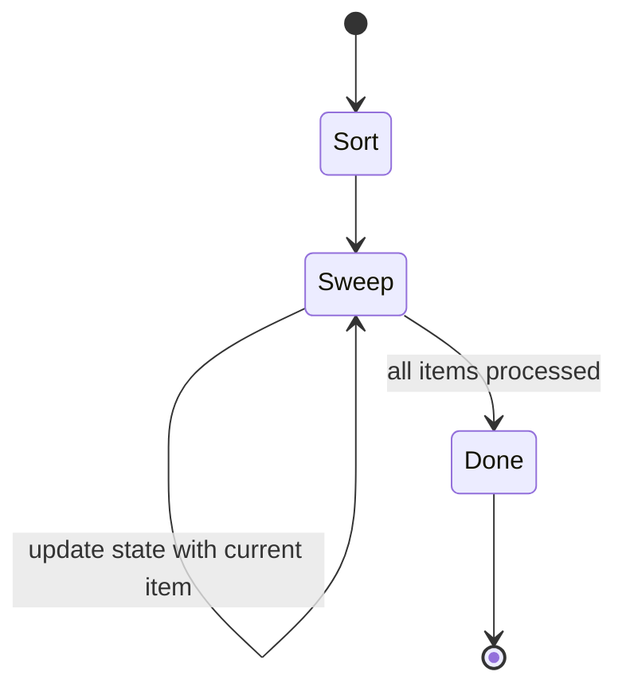

import { Callout } from 'fumadocs-ui/components/callout';

<Callout title="TL;DR — Intervals & Greedy">

**Use when**: you can sort the input by some key and the optimal choice at each step depends only on what you've seen so far (no need to look ahead).

**Trigger phrases**: "merge intervals", "non-overlapping", "minimum number of meeting rooms", "schedule jobs", "earliest deadline", "minimum platforms", "jump game", "gas station", "candy".

**Two flavors**: *interval problems* (sort by start/end, sweep) and *exchange-argument greedy* (sort by a key that proves correctness via local swaps).

**Complexity**: O(n log n) — dominated by the sort.

</Callout>

---

## The problem that motivates this pattern

> **Merge Intervals (LC 56).** Given an array of intervals `[start_i, end_i]`, merge all overlapping intervals and return non-overlapping intervals covering the same range. Example: `[[1,3],[2,6],[8,10],[15,18]]` → `[[1,6],[8,10],[15,18]]`.

Brute force: for each pair of intervals, check if they overlap; if yes, merge; repeat until no changes. That's O(n²) at minimum, often O(n³) with naive implementations.

Insight: **if we sort intervals by start time, an overlap can only occur between consecutive intervals**. Once you walk past `(1,6)` to `(8,10)`, you know nothing earlier can overlap `(8,10)` because their starts were all `< 8`.

So: sort by start. Walk linearly. Merge consecutive overlaps. O(n log n).

```python
def merge(intervals):
    intervals.sort(key=lambda x: x[0])
    merged = [intervals[0]]
    for start, end in intervals[1:]:
        if start <= merged[-1][1]:
            merged[-1][1] = max(merged[-1][1], end)
        else:
            merged.append([start, end])
    return merged
```

**The sort is the pattern.** Once sorted, the problem becomes O(n). Everything else — non-overlapping, meeting rooms, balloon arrows — is variations on this theme.

For pure greedy (no intervals), the trick is the same: **find a sort order that makes the locally-optimal choice provably globally optimal.** When you can do that, you replace dynamic programming or backtracking with a single O(n log n) pass.

---

## The core insight

**There are two flavors that share one principle.**

### Flavor 1 — Sort + Sweep (interval problems)

Sort intervals by some key (usually start, sometimes end). Walk through them; maintain a small piece of state (last-merged interval, count of active intervals, etc.); make a local decision at each step.

The invariant:

> **After processing the first `k` intervals (in sorted order), our running state is the optimal solution for those `k`.**

Sortedness guarantees that future intervals can only affect future decisions, never past ones.

### Flavor 2 — Exchange-argument greedy

Sort by a key such that the locally-optimal choice is provably globally optimal. Example: in *interval scheduling* (max non-overlapping intervals), sort by **end time** — the interval ending earliest leaves the most room for others. You can prove this by *exchange argument*: any optimal solution can be swapped to start with the earliest-ending interval without losing optimality.

The invariant:

> **At each step, the greedy choice is at least as good as any other choice for the remaining problem.**

Both flavors collapse to: **sort, then sweep with a one-pass state machine.**



The art is picking the right sort key. **Sort by start** for merging. **Sort by end** for maximum non-overlapping. **Sort by deadline** for earliest-deadline-first. **Sort by ratio** for fractional knapsack. The sort key encodes the greedy strategy.

---

## Visual walkthrough — Merge Intervals

Input: `[[1,3], [2,6], [8,10], [15,18]]` (already sorted by start).

```
Initial:  intervals sorted by start
          [1,3]  [2,6]  [8,10]  [15,18]
          ─────  ─────  ──────  ───────

Step 1:   start with [1,3]
          merged = [[1,3]]

Step 2:   next = [2,6]. start(2) <= end(3)? Yes — overlap.
          Merge: [1, max(3, 6)] = [1, 6]
          merged = [[1,6]]

Step 3:   next = [8,10]. start(8) <= end(6)? No — disjoint.
          Append.
          merged = [[1,6], [8,10]]

Step 4:   next = [15,18]. start(15) <= end(10)? No — disjoint.
          Append.
          merged = [[1,6], [8,10], [15,18]]

Done.
```

One pass after the sort. O(n log n) total.

## Visual walkthrough — Interval Scheduling (Maximum Non-Overlapping)

Input: 5 jobs with `[start, end]`: `[1,3], [2,5], [4,7], [6,8], [3,4]`.

**Naive (sort by start):** Greedy would pick `[1,3]`, then `[4,7]`, then nothing more — 2 jobs. But optimal is 3.

**Correct (sort by end):**

Sort by end time: `[1,3], [3,4], [2,5], [4,7], [6,8]`.

```
Step 1:  pick [1,3] (ends earliest).  Last end = 3.
Step 2:  [3,4]: start 3 >= 3. Pick it. Last end = 4.
Step 3:  [2,5]: start 2 < 4. Skip.
Step 4:  [4,7]: start 4 >= 4. Pick it. Last end = 7.
Step 5:  [6,8]: start 6 < 7. Skip.

Selected: [1,3], [3,4], [4,7] — 3 jobs. ✓
```

Why does sorting by end work? **Exchange argument**: suppose the optimal solution doesn't start with the earliest-ending interval `e`. Swap its first interval for `e`; the rest of the solution is still valid (since `e` ends *earlier*, it can only *help* future picks). So the greedy choice is no worse than any alternative.

---

## The template

### Template A — Sort + Sweep (interval problems)

```python
def interval_sweep(intervals):
    intervals.sort(key=lambda x: x[0])     # or x[1] depending on problem
    result = init()
    for interval in intervals:
        result = update(result, interval)
    return result
```

The slots:

1. **Sort key** — start, end, or a derived value.
2. **Initial state** — usually empty list or accumulator.
3. **Update** — how each new interval modifies state. For merging, peek at the last and either extend or append.

### Template B — Greedy choice (no intervals, just an order)

```python
def greedy(items):
    items.sort(key=greedy_key)
    state = init()
    for item in items:
        state = take_locally_best(state, item)
    return state
```

The slot is `greedy_key`. The *insight* is finding what to sort by. That's the hard part; the code is trivial.

### Template C — Sweep line (events at coordinates)

For "max active intervals at any point" (meeting rooms), use a sweep line: convert each interval into two events (`+1` at start, `-1` at end), sort all events by time, sweep counting active.

```python
def min_meeting_rooms(intervals):
    events = []
    for s, e in intervals:
        events.append((s, +1))             # start
        events.append((e, -1))             # end (process before starts at same time)
    events.sort(key=lambda x: (x[0], x[1]))  # ties: end first
    active = max_active = 0
    for _, delta in events:
        active += delta
        max_active = max(max_active, active)
    return max_active
```

This is conceptually the same as a [Difference Array](/dsa/patterns/arrays-strings/prefix-sum) on the time axis.

---

## Worked example: Non-Overlapping Intervals (LC 435)

> **Problem.** Given an array of intervals, return the minimum number of intervals you need to remove to make the rest non-overlapping. Example: `[[1,2],[2,3],[3,4],[1,3]]` → `1` (remove `[1,3]`).

**Why this is greedy.** The dual problem is "maximum number of non-overlapping intervals" — remove the fewest = keep the most. The classic interval-scheduling greedy says: **sort by end, greedily pick the earliest-ending interval that doesn't conflict with the last picked**.

**What changes from the template.** Three slots:

1. **Sort key**: `end` (the magic ingredient).
2. **State**: `last_end` — the end time of the most recently kept interval.
3. **Update**: if `start >= last_end`, keep it; else discard (count one removal).

```python
def erase_overlap_intervals(intervals: list[list[int]]) -> int:
    intervals.sort(key=lambda x: x[1])     # sort by end
    last_end = float('-inf')
    removed = 0
    for start, end in intervals:
        if start >= last_end:
            last_end = end                  # keep this interval
        else:
            removed += 1                    # overlap — discard
    return removed
```

**Dry-run on `[[1,2],[2,3],[3,4],[1,3]]`:**

After sort by end: `[[1,2],[2,3],[1,3],[3,4]]`.

| start | end | last_end before | start ≥ last_end? | Action | last_end after | removed |
|-------|-----|-----------------|-------------------|--------|----------------|---------|
| 1 | 2 | -∞ | yes | keep | 2 | 0 |
| 2 | 3 | 2 | yes | keep | 3 | 0 |
| 1 | 3 | 3 | no | remove | 3 | 1 |
| 3 | 4 | 3 | yes | keep | 4 | 1 |

**Answer: 1** ✓.

**Complexity.** O(n log n) for the sort, O(n) for the sweep. O(1) extra space.

**Why sort by end (not start)?** Try sorting by start: `[[1,2],[1,3],[2,3],[3,4]]`. We'd keep `[1,2]`, then conflict with `[1,3]` and `[2,3]` (both removed), then `[3,4]` kept — 2 removed. Worse. **The exchange argument**: among any two overlapping intervals, the one ending later is *strictly worse* to keep (it blocks more future intervals). So always pick the earlier-ending one.

---

## Variants

### Variant 1 — Merge intervals

The canonical sort-by-start sweep. Update: extend if overlapping, else append.

**Canonical problems**: 56 Merge Intervals, 57 Insert Interval, 252 Meeting Rooms (just check for any overlap).

### Variant 2 — Maximum non-overlapping (interval scheduling)

Sort by **end**. Greedily pick if it doesn't conflict. The classic.

**Canonical problems**: 435 Non-Overlapping Intervals (this page's worked example), 452 Minimum Arrows to Burst Balloons (same shape — burst at earliest end).

### Variant 3 — Sweep line / event counting

Convert intervals to `+1` start / `-1` end events. Sweep to count active.

**Canonical problems**: 253 Meeting Rooms II, 1851 Min Interval to Include Each Query (advanced), 218 The Skyline Problem (sweep + heap).

### Variant 4 — Pure greedy (no intervals)

Sort by a clever key, sweep, make local choice. The trick: proving the sort key gives global optimality.

```python
# Jump Game II — minimum jumps to reach end
def jump(nums):
    jumps = current_end = farthest = 0
    for i in range(len(nums) - 1):
        farthest = max(farthest, i + nums[i])
        if i == current_end:                # exhausted current jump's reach
            jumps += 1
            current_end = farthest
    return jumps
```

**Canonical problems**: 55 Jump Game (can you reach?), 45 Jump Game II (min jumps), 134 Gas Station (greedy reset), 121 Best Time to Buy & Sell Stock (greedy track minimum), 122 Stock II (sum all positive deltas).

### Variant 5 — Two-axis greedy (sort by one key, optimize the other)

Sort by one dimension, then run greedy/another structure on the second.

```python
# Russian Doll Envelopes — LC 354
def max_envelopes(envelopes):
    envelopes.sort(key=lambda x: (x[0], -x[1]))     # ascending width, descending height
    # Now problem becomes LIS on heights
    return length_of_lis([h for _, h in envelopes])
```

**Canonical problems**: 354 Russian Doll Envelopes, 406 Queue Reconstruction by Height, 1235 Maximum Profit in Job Scheduling (sort + DP with binary search).

### Variant 6 — Fractional knapsack / ratio greedy

Sort items by value-per-unit-weight (ratio). Take as much of the highest-ratio item as fits, then the next, etc.

```python
def fractional_knapsack(items, capacity):
    items.sort(key=lambda x: -x.value / x.weight)
    total = 0
    for item in items:
        if capacity >= item.weight:
            total += item.value
            capacity -= item.weight
        else:
            total += item.value * capacity / item.weight
            break
    return total
```

This is **not** 0/1 knapsack — that one requires DP because you can't take fractions.

---

## Common pitfalls

| Trap | Fix |
|------|-----|
| Sorting by the wrong key | Most "this greedy doesn't work" bugs are wrong sort key. Try sort-by-end vs sort-by-start vs sort-by-difference |
| Greedy + DP confusion | Greedy works when the *local* choice is provably *globally* optimal. If you need to compare alternatives, it's DP, not greedy |
| Forgetting strict vs non-strict overlap | Does `[1,3]` and `[3,5]` overlap? Depends on the problem — read the spec |
| In sweep line, ties between start and end events | At the same time, *end* events should fire first (`(time, +1)` after `(time, -1)`). Sort ties carefully |
| Not proving the greedy choice is correct | Always sketch an exchange argument. If you can't, it might not be greedy |
| Sorting mutates the input when the caller doesn't expect it | Use `sorted(...)` instead of `.sort()` if the caller needs the original |
| Using greedy on a problem that needs DP | "Min cost" with branching choices → usually DP. Pure greedy is rare; most "greedy" problems hide in interval form |
| Off-by-one on inclusive vs exclusive end | "Intervals [1,3] and [3,5] overlap" — half-open vs closed makes a difference; spec it |

---

## Complexity

**Time: O(n log n)** dominated by the sort. The sweep itself is O(n).

**Space: O(1)** for in-place sweep (excluding the sort's stack space, which is O(log n) for most algorithms).

For sweep line: O(n) extra space for the events list.

The pattern's appeal: **n log n is the speed limit**. You can't beat it without exploiting more structure. So if the problem accepts n log n, sort-then-sweep is usually optimal.

---

## When NOT to use intervals & greedy

- **The greedy choice isn't provably correct.** Many problems *look* greedy but aren't. "Coin change with arbitrary denominations" is famous: greedy works for US coins but fails for `[1, 7, 10]` (greedy says 4 coins for 14, but `7+7` is 2 coins). Use [DP](/dsa/patterns/dp/knapsack) when the greedy claim isn't airtight.
- **You need to compare multiple paths.** If at each step you have to look ahead more than one step, it's not greedy — it's DP or BFS.
- **The intervals are dynamic (added/removed online).** Sort + sweep is offline. For online interval problems, use a balanced BST or segment tree.
- **The problem requires the actual list of removed/kept items, not a count.** Sometimes a count is easy but recovery is hard; you may need to keep auxiliary indices.
- **The "intervals" are on a circular axis** (e.g., days of the week wrapping). Standard sweep needs adjustment.
- **The optimal solution involves backtracking choices.** Greedy commits at each step. If the optimal solution sometimes requires un-doing a decision, DP wins.

### Decision rule

| Symptom | Likely pattern |
|---------|---------------|
| "Merge overlapping intervals" | **Sort by start, sweep** |
| "Maximum non-overlapping" | **Sort by end, greedy** |
| "Minimum X to remove for no overlaps" | **Sort by end, greedy** (complement) |
| "How many concurrent / meeting rooms" | **Sweep line** (`+1`/`-1` events) |
| "Burst balloons / arrows" | **Sort by end, greedy** |
| "Schedule jobs to maximize profit" | DP + binary search (often) |
| "Knapsack-like with branching choices" | [DP](/dsa/patterns/dp/knapsack) (not greedy) |
| "Jump game" | **Greedy with reach tracking** |
| "Coin change (min coins)" | [DP](/dsa/patterns/dp/knapsack) (greedy fails for arbitrary denoms) |

---

## Real-world applications

- **Calendar systems.** Detecting meeting conflicts, finding free slots, computing busy/free time — all interval-merge problems.
- **OS process scheduling.** Earliest-deadline-first (EDF) scheduling is a greedy: schedule the job with the closest deadline.
- **Network routing.** Many routing algorithms (OSPF, BGP path selection) are greedy on locally-known link costs.
- **Compiler register allocation.** Linear-scan register allocation is interval-sweep: sort live ranges by start, allocate registers greedily.
- **Memory allocator.** Free-list-based allocators often greedily pick the smallest fitting block (best-fit) or the first fitting block (first-fit).
- **Geographic/satellite coverage planning.** Choosing minimum tower locations to cover an area is interval scheduling in disguise.
- **CDN cache eviction.** LRU is greedy on time-of-last-access; LFU is greedy on frequency.

---

## Curated practice problems

| # | Problem | Difficulty | Variant | Note |
|---|---------|-----------|---------|------|
| 1 | ★ 56 Merge Intervals | Medium | Sort by start, sweep | The canonical merge |
| 2 | 57 Insert Interval | Medium | Variant of 56 | Sorted input + one insertion |
| 3 | 252 Meeting Rooms | Easy | Sweep for any overlap | Just check sorted neighbors |
| 4 | ★ 253 Meeting Rooms II | Medium | Sweep line | `+1`/`-1` events, max active |
| 5 | ★ 435 Non-Overlapping Intervals | Medium | Sort by end, greedy | This page's worked example |
| 6 | 452 Min Arrows to Burst Balloons | Medium | Sort by end, greedy | Same shape as 435 |
| 7 | 1288 Remove Covered Intervals | Medium | Sort + sweep | Sort by start ascending, end descending |
| 8 | 986 Interval List Intersections | Medium | Two-pointer on two sorted | Different shape — pointer over each list |
| 9 | ★ 55 Jump Game | Medium | Greedy reach | Track farthest reachable |
| 10 | 45 Jump Game II | Medium | Greedy reach + counter | Each "jump" extends reach |
| 11 | 134 Gas Station | Medium | Greedy reset | If total ≥ 0, answer exists; reset on deficit |
| 12 | 121 Best Time to Buy/Sell Stock | Easy | Greedy min-tracker | One pass tracking min seen |
| 13 | 122 Best Time to Buy/Sell Stock II | Easy | Greedy sum-positives | Take every uphill |
| 14 | 406 Queue Reconstruction by Height | Medium | Two-axis greedy | Sort by height desc, insert by k |
| 15 | 1851 Minimum Interval to Include Each Query | Hard | Sort + heap | Offline: sort intervals and queries |

---

## Related patterns

- [Prefix Sums / Difference Arrays](/dsa/patterns/arrays-strings/prefix-sum) — sweep-line for "count at any point" is structurally identical
- [Sliding Window](/dsa/patterns/arrays-strings/sliding-window) — when the "interval" is dynamic over a single array
- [Heap](/dsa/patterns/heaps/heap) — sweep line often pairs with a heap (skyline, K closest)
- [DP — Linear](/dsa/patterns/dp/linear) — when greedy isn't enough; many DP problems are "greedy with memoization to handle alternatives"

---

## Quick-reference card

```python
# Merge intervals
intervals.sort(key=lambda x: x[0])
merged = []
for s, e in intervals:
    if merged and s <= merged[-1][1]:
        merged[-1][1] = max(merged[-1][1], e)
    else:
        merged.append([s, e])

# Max non-overlapping (interval scheduling)
intervals.sort(key=lambda x: x[1])    # SORT BY END
last_end, count = -inf, 0
for s, e in intervals:
    if s >= last_end:
        count += 1; last_end = e

# Sweep line for max active
events = [(s, +1) for s, _ in intervals] + [(e, -1) for _, e in intervals]
events.sort(key=lambda x: (x[0], x[1]))    # ends before starts at same time
active = best = 0
for _, d in events:
    active += d; best = max(best, active)
```

Triggers: "merge", "overlapping", "meeting rooms", "minimum arrows", "schedule". Complexity: O(n log n).
