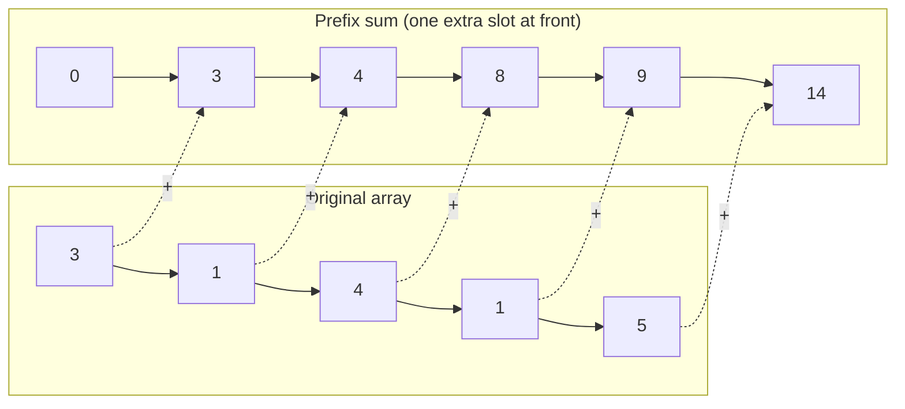
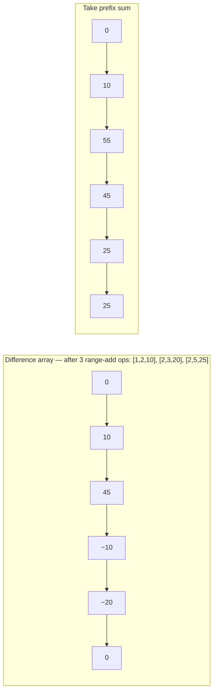

import { Callout } from 'fumadocs-ui/components/callout';

<Callout title="TL;DR — Prefix Sums & Difference Arrays">

**Use when**: many range *queries* (prefix sum) or many range *updates* (difference array), or "count subarrays with sum X" (prefix sum + hashmap).

**Trigger phrases**: "sum of range [i, j]", "subarray sum equals K", "range updates then a final read", "increment range [l, r] by v many times".

**Two duals**:
- **Prefix sum** turns O(n) range queries into O(1), at the cost of O(n) one-time preprocessing.
- **Difference array** turns O(n) range updates into O(1), at the cost of O(n) one-time finalization.

**Complexity**: O(n) preprocessing + O(1) per operation.

</Callout>

---

## The problem that motivates this pattern

> **Range Sum Query — Immutable.** Given an integer array `nums`, design a class that supports `sumRange(left, right)` returning the sum of elements from index `left` to `right` inclusive. The array doesn't change.

Naive: each `sumRange` call loops from `left` to `right`. O(n) per query. With Q queries, O(Q · n). For Q = n = 10⁵, that's 10¹⁰ — too slow.

Insight: if we precompute `prefix[i] = nums[0] + nums[1] + ... + nums[i-1]` (sum of the first `i` elements), then the sum of `[left, right]` is just `prefix[right + 1] - prefix[left]`. **One subtraction. O(1) per query, after O(n) preprocessing.**

```
nums   = [3, 1, 4, 1, 5, 9, 2, 6]
prefix = [0, 3, 4, 8, 9, 14, 23, 25, 31]
         ↑                            ↑
       prefix[0]=0               prefix[8]=sum of all 8
```

`sumRange(2, 5) = prefix[6] - prefix[2] = 23 - 4 = 19`. Verify: `4 + 1 + 5 + 9 = 19` ✓.

**This is the pain prefix sums relieve**: turning O(n) range work into O(1) by paying O(n) upfront.

The dual problem motivates the **difference array**:

> **Corporate Flight Bookings.** Given `n` flights numbered 1..n and a list of bookings `[first, last, seats]` meaning "add `seats` to every flight in `[first, last]`", return the seat count for each flight.

Naive: each booking loops from `first` to `last` adding seats. O(B · n) for B bookings. For B = n = 10⁵, again 10¹⁰.

Insight: instead of writing to every cell in the range, write **only the endpoints**: `+seats` at `first`, `-seats` at `last+1`. Take a prefix sum at the end. Each booking is O(1); finalization is O(n).

```
n=5, bookings = [[1,2,10], [2,3,20], [2,5,25]]
diff = [0, 0, 0, 0, 0, 0]

booking [1,2,10]:  diff[1]+=10, diff[3]-=10  →  [0, 10, 0, -10, 0, 0]
booking [2,3,20]:  diff[2]+=20, diff[4]-=20  →  [0, 10, 20, -10, -20, 0]
booking [2,5,25]:  diff[2]+=25, diff[6]-=25  →  [0, 10, 45, -10, -20, 0]   (idx 6 out of range, ignored)

prefix sum   →  [0, 10, 55, 45, 25, 25]
answer (1..5) → [10, 55, 45, 25, 25]
```

The same `prefix[i+1] - prefix[i] = original[i]` relationship that powers prefix sums runs *the other way* in a difference array. They're duals.

---

## The core insight

**Prefix sums and difference arrays are the same idea, run in opposite directions.**

Let `P` be the prefix-sum array of `A`. Then:
- `P[i] = A[0] + A[1] + ... + A[i-1]` *(forward)*
- `A[i] = P[i+1] - P[i]` *(inverse)*

So prefix-sum is *integration* and difference is *differentiation*. The invariant powering both:

> **At every index `i`, the cumulative effect of all operations on cell `i` is encoded in O(1) bookkeeping.**

For prefix sums: that bookkeeping is `P[i+1] - P[L]`, the cumulative-sum delta over a range. For difference arrays: that bookkeeping is the sum of `+v` and `-v` markers at the range endpoints, finalized by one sweep.

The deeper insight: **range queries and range updates are dual problems**, and the choice of which to make O(1) depends on which is more frequent.

| Read-heavy | Update-heavy | Both heavy |
|------------|--------------|-----------|
| Prefix sum | Difference array | Segment Tree / Fenwick (out of scope here) |

---

## Visual walkthrough — prefix sums



**Query: sum of `[1, 3]` (elements `1, 4, 1`).**

`P[4] - P[1] = 9 - 3 = 6`. Verify: `1 + 4 + 1 = 6` ✓.

The off-by-one: `P[i]` is the sum of *the first i elements*. So `P[right+1] - P[left]` gives `[left, right]` inclusive. The "+1" matters; people get this wrong constantly.

## Visual walkthrough — difference array



Each range update `[L, R] += v` touches **two cells**: `+v` at `L` and `-v` at `R+1`. After all updates, run a single prefix-sum pass to materialize the actual values.

---

## The template

### Template A — Prefix sum (for range queries)

```python
class PrefixSum:
    def __init__(self, nums):
        n = len(nums)
        self.prefix = [0] * (n + 1)
        for i in range(n):
            self.prefix[i + 1] = self.prefix[i] + nums[i]

    def sum_range(self, left, right):
        return self.prefix[right + 1] - self.prefix[left]
```

### Template B — Difference array (for range updates)

```python
def apply_range_updates(n, updates):
    diff = [0] * (n + 1)            # +1 for the right boundary
    for left, right, val in updates:
        diff[left] += val
        diff[right + 1] -= val

    # Take prefix sum to recover the final array
    result = [0] * n
    result[0] = diff[0]
    for i in range(1, n):
        result[i] = result[i - 1] + diff[i]
    return result
```

### Template C — Prefix sum + hash map (for "subarrays with sum K")

The combo. Use prefix sum to express "sum of `[i+1, j]` equals K" as `P[j+1] - P[i+1] = K`, then ask "how many `P[i+1]` equal `P[j+1] - K`?" — a hash-map lookup.

```python
def subarray_sum_equals_k(nums, k):
    count = 0
    cumsum = 0
    seen = {0: 1}                    # prefix=0 occurs once (empty prefix)
    for x in nums:
        cumsum += x
        count += seen.get(cumsum - k, 0)
        seen[cumsum] = seen.get(cumsum, 0) + 1
    return count
```

This is the most-tested variant in interviews.

---

## Worked example: Subarray Sum Equals K (LC 560)

> **Problem.** Given an array `nums` and integer `k`, return the total number of subarrays whose sum equals `k`. Example: `nums = [1, 1, 1]`, `k = 2` → `2`.

**Why this is prefix sum.** "Subarray sum equals K" is the canonical trigger. Brute force is O(n²) (try every `(i, j)`). Prefix sum + hash map drops it to O(n).

**The reformulation.** Let `P[i]` be the prefix sum after the first `i` elements. The sum of subarray `nums[i..j]` is `P[j+1] - P[i]`. We want `P[j+1] - P[i] = k`, i.e., for each `j`, count the number of earlier prefix sums equal to `P[j+1] - k`.

```python
def subarray_sum(nums: list[int], k: int) -> int:
    count = 0
    cumsum = 0
    seen = {0: 1}                          # empty prefix has sum 0
    for x in nums:
        cumsum += x
        count += seen.get(cumsum - k, 0)
        seen[cumsum] = seen.get(cumsum, 0) + 1
    return count
```

**Dry-run on `nums = [1, 1, 1], k = 2`:**

| i | nums[i] | cumsum | want = cumsum - k | seen.get(want)? | count | seen after |
|---|---------|--------|------|------|-------|--------|
| 0 | 1 | 1 | -1 | 0 | 0 | `{0:1, 1:1}` |
| 1 | 1 | 2 | 0 | 1 | 1 | `{0:1, 1:1, 2:1}` |
| 2 | 1 | 3 | 1 | 1 | 2 | `{0:1, 1:1, 2:1, 3:1}` |

Final: **2** (the subarrays `[1,1]` at indices 0..1 and 1..2).

**Why `seen = {0: 1}` initially?** Because of the empty prefix. A subarray starting at index 0 has its "earlier prefix sum" equal to 0. Without this seed, we'd miss subarrays whose own prefix equals exactly `k`.

**Complexity.** O(n) time, O(n) space.

---

## Variants

### Variant 1 — 1D prefix sum (the basic case)

Range-sum queries on an immutable array. Build once, query many times.

**Canonical problems**: 303 Range Sum Query — Immutable, 1480 Running Sum of 1D Array.

### Variant 2 — 2D prefix sum

Same idea, two dimensions. `P[i][j]` = sum of the rectangle from `(0,0)` to `(i-1, j-1)`. Range sum of rectangle `(r1, c1)` to `(r2, c2)`:

```
sum = P[r2+1][c2+1] - P[r1][c2+1] - P[r2+1][c1] + P[r1][c1]
```

(Inclusion-exclusion: subtract the two strips, add back the corner counted twice.)

**Canonical problem**: 304 Range Sum Query 2D — Immutable, 1314 Matrix Block Sum.

### Variant 3 — Prefix XOR

Same template, replace `+` with `^`. The identity `A ^ A = 0` makes XOR perfect for "subarray XOR equals K" problems.

```python
prefix_xor = 0
seen = {0: 1}
count = 0
for x in nums:
    prefix_xor ^= x
    count += seen.get(prefix_xor ^ k, 0)
    seen[prefix_xor] = seen.get(prefix_xor, 0) + 1
```

**Canonical problem**: 1310 XOR Queries of a Subarray.

### Variant 4 — Difference array (1D)

The dual: O(1) range updates, O(n) finalization. Used when updates dominate queries.

**Canonical problems**: 1109 Corporate Flight Bookings, 1854 Maximum Population Year, 252/253 Meeting Rooms II (sweep-line variant), 370 Range Addition.

### Variant 5 — Difference array (2D / imos method)

For range updates on a 2D grid. Mark four corners per update:

```
diff[r1][c1]   += v
diff[r1][c2+1] -= v
diff[r2+1][c1] -= v
diff[r2+1][c2+1] += v
```

Then run 2D prefix sum to finalize. O(updates) + O(rows × cols).

**Canonical problem**: 2536 Increment Submatrices by One.

### Variant 6 — Prefix sum + modular arithmetic

For "subarrays with sum divisible by K," use `prefix mod K` as the hash key instead of `prefix - k`.

**Canonical problem**: 974 Subarray Sums Divisible by K, 523 Continuous Subarray Sum.

---

## Common pitfalls

| Trap | Fix |
|------|-----|
| Off-by-one: writing `P[right] - P[left]` instead of `P[right+1] - P[left]` | Always allocate `prefix` with `n+1` slots; cleaner indexing |
| Forgetting to seed `seen = {0: 1}` in the hash-map variant | Without it, you miss subarrays starting at index 0 |
| In difference array, writing `diff[right]` instead of `diff[right+1]` | Subtract at `right+1` so the cumulative effect ends *after* `right` |
| Allocating `diff` with size `n` instead of `n+1` for difference array | Need the extra slot for the `right+1` sentinel |
| Building prefix sum every query instead of once | Build O(n) once; query O(1) many times |
| Using subtraction on `int` types that overflow | In languages without arbitrary precision (Java, C++), use `long` |
| 2D off-by-one: forgetting the inclusion-exclusion correction | The 4-term formula is `P[r2+1][c2+1] - P[r1][c2+1] - P[r2+1][c1] + P[r1][c1]` |
| Confusing prefix-sum-of-difference-array with original | They're inverses: prefix-sum the diff array to recover; differentiate the prefix array to revert |

---

## Complexity

**Prefix sum.** O(n) build, O(1) query. O(n) space.

**Difference array.** O(1) per update, O(n) finalization. O(n) space.

**Prefix sum + hash map** (subarray-sum-equals-K variants). O(n) time, O(n) space.

**2D variants.** O(rows × cols) build/finalize, O(1) per query/update.

The pattern shines when the number of queries (or updates) is at least Θ(n). If you only have a constant number of range operations, just do them naively.

---

## When NOT to use prefix sums / difference arrays

- **The array is mutable and you have both range updates AND range queries interleaved.** Prefix sum invalidates on every update (O(n) to rebuild). Use a [Segment Tree or Fenwick Tree (BIT)](https://en.wikipedia.org/wiki/Fenwick_tree) — out of scope here but the next step up.
- **The operation isn't associative / invertible.** Prefix sum works because `+` has an inverse (`-`). For "min of range" or "GCD of range," you can't use prefix-sum — you need a Sparse Table or Segment Tree.
- **You need to compute a range product but the values can be zero.** Prefix product fails: dividing by zero is undefined. Use a different approach.
- **The constraint is non-monotonic in the prefix array.** "Longest subarray with sum at most K" on an array with negatives — the prefix sums aren't monotonic, so [Sliding Window](/dsa/patterns/arrays-strings/sliding-window) breaks too. Use a monotonic deque or different framing.
- **Single query only.** Just sum directly — no need for the precomputation overhead.

### Decision rule

| Symptom | Likely pattern |
|---------|---------------|
| "Range sum, many queries, immutable" | **Prefix Sum** |
| "Range sum, many updates AND queries" | Segment Tree / Fenwick (advanced) |
| "Range update, single final read" | **Difference Array** |
| "Count subarrays with sum = K" (signed integers) | **Prefix Sum + Hash Map** |
| "Count subarrays with sum = K" (only positives) | [Sliding Window](/dsa/patterns/arrays-strings/sliding-window) |
| "Range XOR" | **Prefix XOR + Hash Map** |
| "Range max/min" | Sparse Table (out of scope) |

---

## Real-world applications

- **Image processing — integral images.** 2D prefix sums (called "summed-area tables") let you compute the sum of any rectangle in O(1). Used in face detection (Viola-Jones), image filtering, and OpenCV's `integral()` function.
- **Database analytics.** Cumulative-sum aggregates (`SUM(...) OVER (ORDER BY ...)` in SQL) are exactly prefix sums precomputed for fast range queries.
- **Time series.** Computing "average over the last K seconds" in a streaming system uses a sliding prefix sum.
- **CDN cache analytics.** "Number of requests in [t1, t2]" → 1D prefix sum over request counts per second.
- **Sweep-line algorithms in computational geometry.** Difference-array-like markers at event boundaries.

---

## Curated practice problems

| # | Problem | Difficulty | Variant | Note |
|---|---------|-----------|---------|------|
| 1 | ★ 303 Range Sum Query — Immutable | Easy | 1D prefix | The canonical problem |
| 2 | 1480 Running Sum of 1D Array | Easy | 1D prefix | Just build the prefix |
| 3 | ★ 560 Subarray Sum Equals K | Medium | Prefix + Hash | This page's worked example |
| 4 | 974 Subarray Sums Divisible by K | Medium | Prefix mod K + Hash | Use remainders as keys |
| 5 | 523 Continuous Subarray Sum | Medium | Prefix mod K + Hash | Same trick, different output |
| 6 | 525 Contiguous Array | Medium | Prefix + Hash | Treat 0s as -1s, find subarray sum = 0 |
| 7 | ★ 304 Range Sum Query 2D — Immutable | Medium | 2D prefix | Inclusion-exclusion |
| 8 | 1314 Matrix Block Sum | Medium | 2D prefix | Sum of K×K neighborhood |
| 9 | ★ 1109 Corporate Flight Bookings | Medium | 1D difference | The canonical diff-array problem |
| 10 | 1854 Maximum Population Year | Easy | 1D difference | Diff-array on a small range |
| 11 | 370 Range Addition | Medium | 1D difference | The textbook diff-array problem |
| 12 | 2536 Increment Submatrices by One | Medium | 2D difference (imos) | 4-corner trick |
| 13 | 1310 XOR Queries of a Subarray | Medium | Prefix XOR | XOR instead of sum |
| 14 | 1248 Count Number of Nice Subarrays | Medium | Prefix + Hash | "Exactly K odds" → count of odd-prefix-counts |
| 15 | 437 Path Sum III | Medium | Prefix on tree | DFS with a running prefix-sum hashmap |

---

## Related patterns

- [Sliding Window](/dsa/patterns/arrays-strings/sliding-window) — when the constraint is monotonic in window size; faster for "longest contiguous"
- [Hashing](/dsa/patterns/arrays-strings/hashing) — the hash map is the engine in "subarray-sum-equals-K" variants
- [Binary Search](/dsa/patterns/arrays-strings/binary-search) — combined with prefix sums for "smallest subarray with sum ≥ K"
- [Monotonic Deque](/dsa/patterns/stacks-queues/monotonic-stack) — for max/min over windows when prefix sum doesn't apply

---

## Quick-reference card

```python
# Range sum (immutable)
prefix = [0] * (n + 1)
for i in range(n): prefix[i+1] = prefix[i] + nums[i]
sum_range = lambda l, r: prefix[r+1] - prefix[l]

# Subarray sum == K
cum, count, seen = 0, 0, {0: 1}
for x in nums:
    cum += x
    count += seen.get(cum - k, 0)
    seen[cum] = seen.get(cum, 0) + 1

# Range updates (difference array)
diff = [0] * (n + 1)
for l, r, v in updates: diff[l] += v; diff[r+1] -= v
for i in range(1, n): diff[i] += diff[i-1]
```

Triggers: range sum, subarray sum = K, many range updates. Complexity: O(n) preprocess, O(1) per op.
