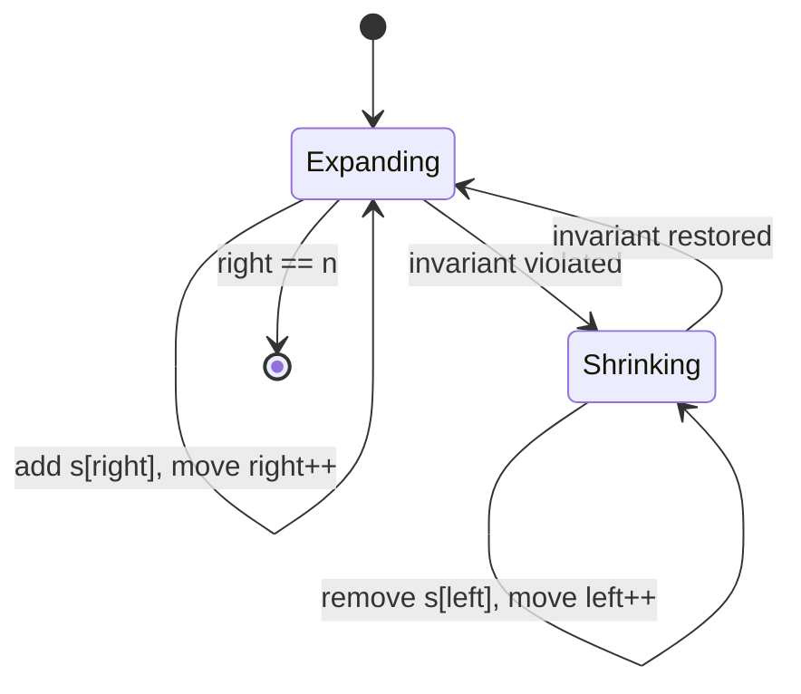
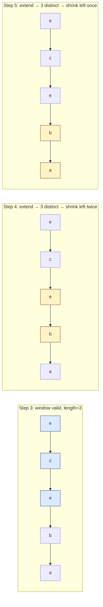

import { Callout } from 'fumadocs-ui/components/callout';

<Callout title="TL;DR — Sliding Window">

**Use when**: you need to optimize *over all contiguous subarrays* of an input — find the *longest*, *shortest*, *max-sum*, or *count* satisfying a constraint.

**Trigger phrases**: "longest substring", "shortest subarray", "at most K distinct", "exactly K", "max sum of K elements", "smallest window containing".

**Template**: expand `right`, shrink `left` while invariant violated, update answer.

**Complexity**: O(n) time, O(1) or O(window-state) space.

</Callout>

---

## The problem that motivates this pattern

> **Longest Substring with At Most K Distinct Characters.** Given a string `s` and an integer `k`, return the length of the longest substring of `s` that contains **at most k distinct characters**.

You think: "easy, I'll check every substring." Two nested loops generate every `(left, right)` pair; for each one you check how many distinct characters it has and keep the max. That's O(n²) substrings × O(n) to count distinct = **O(n³)**.

You can do better: precompute distinct-count incrementally. As you extend `right` by 1, you only need to update a counter. That brings it to O(n²).

But there's still a problem. Most of those n² windows are *useless*. If you found a valid window from index 2 to index 7, you don't need to also check windows from 3 to 6, 3 to 7, 4 to 7, etc. — they're all subsets you already know are valid. The brute force is **wasting work checking subsets of windows you've already validated**.

**This is the pain that the sliding window pattern relieves.** Once you internalize that every valid window contains valid sub-windows, you realize: we only need to track the *maximal* valid window ending at each position. And we can maintain it incrementally as `right` moves forward.

---

## The core insight

**The window is a contract, not a region.**

Naively, we picture the window as "the chunk we're currently looking at." That framing is useless. The useful framing is: *the window from `left` to `right` is the longest valid suffix ending at `right`*. Every iteration of the outer loop has one job: extend that suffix by one. If extending it violates the constraint, contract from the left until it's valid again.

The invariant we maintain — and you should be able to recite this in an interview — is:

> **After every iteration, `[left, right]` is a valid window, and `left` is the smallest index for which `[left, right]` is valid.**

Because of this invariant:

1. We never need to look "inside" the window. The answer at step `right` is simply `right - left + 1`.
2. We never need to backtrack `right` — it only moves forward.
3. `left` also only moves forward. It never goes back.
4. So the total work is O(n): each index is visited at most twice (once when `right` passes it, once when `left` passes it).



The state machine has two states: expanding (right is moving) and shrinking (left is catching up). The transition happens precisely when the invariant is violated.

---

## Visual walkthrough

Let's trace the algorithm on `s = "eceba"`, `k = 2`. The window is shown in brackets; below each step is the character counter.

**Step 1.** `right = 0`. Add `'e'`. Window: `[e]ceba`. Counter: `{e: 1}`. 1 distinct ≤ 2 ✓. Length 1.

**Step 2.** `right = 1`. Add `'c'`. Window: `[ec]eba`. Counter: `{e: 1, c: 1}`. 2 distinct ≤ 2 ✓. Length 2.

**Step 3.** `right = 2`. Add `'e'`. Window: `[ece]ba`. Counter: `{e: 2, c: 1}`. 2 distinct ≤ 2 ✓. Length 3. *(Best so far.)*

**Step 4.** `right = 3`. Add `'b'`. Window: `[eceb]a`. Counter: `{e: 2, c: 1, b: 1}`. **3 distinct > 2 — invariant violated.** Shrink.

**Step 4a.** Remove `s[0] = 'e'`. Counter: `{e: 1, c: 1, b: 1}`. `left = 1`. Still 3 distinct. Shrink more.

**Step 4b.** Remove `s[1] = 'c'`. Counter: `{e: 1, b: 1}`. `left = 2`. 2 distinct ≤ 2 ✓. Window: `ec[eb]a`. Length 2.

**Step 5.** `right = 4`. Add `'a'`. Window: `ec[eba]`. Counter: `{e: 1, b: 1, a: 1}`. **3 distinct > 2 — shrink.**

**Step 5a.** Remove `s[2] = 'e'`. Counter: `{b: 1, a: 1}`. `left = 3`. 2 distinct ✓. Window: `ece[ba]`. Length 2.

**Final answer: 3** (from step 3, the window `"ece"`).

Notice what happened:
- `right` moved from 0 to 4 — exactly 5 steps.
- `left` moved from 0 to 3 — exactly 3 steps.
- Total work: 8 increments. That's **O(n)** amortized, not O(n²).



---

## The template

This is the shape you should be able to write from memory. Every variable-size sliding-window problem instantiates this template by customizing **three slots**: `expand`, `invariant_violated`, `shrink`.

```python
def sliding_window(s):
    left = 0
    window_state = ...   # whatever you need to track the constraint
    ans = 0

    for right in range(len(s)):
        # 1. Expand: include s[right] in the window
        window_state = include(window_state, s[right])

        # 2. Shrink while the window is invalid
        while invariant_violated(window_state):
            window_state = exclude(window_state, s[left])
            left += 1

        # 3. Update the answer
        ans = max(ans, right - left + 1)

    return ans
```

The three slots:

1. **`include` / `exclude`** — how you update window state when an element enters or leaves. Usually a counter, sum, or set.
2. **`invariant_violated`** — the predicate that tells you when to shrink. For "at most K distinct": `len(counter) > k`. For "sum > target": `current_sum > target`.
3. **`update ans`** — what to compute from `(left, right)`. Usually `right - left + 1` (length) or the window's sum.

<Callout type="info" title="Why a while loop, not an if">

The shrink step is a `while`, not an `if`, because **a single expansion may require multiple shrinks**. In our walkthrough, adding `'b'` at step 4 required removing both `'e'` and `'c'` before the invariant held again. Using `if` would be a bug that silently passes most test cases but fails on inputs with long runs of distinct characters.

</Callout>

---

## Worked example: Longest Substring with At Most K Distinct

> **Problem.** Given a string `s` and an integer `k`, return the length of the longest substring that contains at most `k` distinct characters. Example: `s = "eceba"`, `k = 2` → output `3` (the substring `"ece"`).

**Why this is a sliding-window problem.** The keywords are *"longest substring"* (contiguous + extremal) and *"at most k distinct"* (a constraint that becomes harder as the window grows and easier as it shrinks). That monotonicity in the constraint is the signal.

**What changes from the template.** Three slots:

1. **State**: a `Counter` of character → frequency inside the window.
2. **Invariant violated**: `len(counter) > k` — too many distinct chars.
3. **Shrink**: decrement the leftmost character's count; if it drops to zero, remove it from the counter (so `len(counter)` reflects the actual distinct count).

```python
def longest_k_distinct(s: str, k: int) -> int:
    counter, left, ans = {}, 0, 0

    for right, ch in enumerate(s):
        counter[ch] = counter.get(ch, 0) + 1           # expand

        while len(counter) > k:                         # invariant violated
            counter[s[left]] -= 1                       # shrink
            if counter[s[left]] == 0:
                del counter[s[left]]
            left += 1

        ans = max(ans, right - left + 1)                # update

    return ans
```

**Dry-run on `s = "eceba", k = 2`:**

| right | ch  | counter             | shrink? | left | ans |
|-------|-----|---------------------|---------|------|-----|
| 0     | 'e' | `{e:1}`             | no      | 0    | 1   |
| 1     | 'c' | `{e:1, c:1}`        | no      | 0    | 2   |
| 2     | 'e' | `{e:2, c:1}`        | no      | 0    | 3   |
| 3     | 'b' | `{e:2, c:1, b:1}`   | yes ×2  | 2    | 3   |
| 4     | 'a' | `{e:0→del, b:1, a:1}` | yes ×1 | 3    | 3   |

Final: **3**.

**Complexity.** O(n) time — each character is added to and removed from `counter` at most once, so the total work across all expand and shrink steps is bounded by 2n. O(k) space — the counter holds at most `k + 1` entries at any time.

---

## Variants

Sliding window comes in two main flavors. Knowing both lets you pattern-match faster.

### Variant 1 — Fixed-size window

The window has a *known* width `k`. No shrink loop is needed; you slide the window forward one step at a time, updating state by adding the new right element and subtracting the leaving left element.

```python
def max_sum_k(arr, k):
    window_sum = sum(arr[:k])
    ans = window_sum
    for right in range(k, len(arr)):
        window_sum += arr[right] - arr[right - k]      # add new, remove old
        ans = max(ans, window_sum)
    return ans
```

**Trigger phrases**: "maximum sum of any subarray of size k", "average of every k-window", "number of anagrams of p in s".

**Canonical problems**: 643 Max Avg Subarray I, 567 Permutation in String, 438 Find All Anagrams in a String.

### Variant 2 — Variable-size window (the template above)

The window grows from the right and shrinks from the left until a constraint is satisfied. This is the version that does most of the heavy lifting in interviews.

**Trigger phrases**: "longest substring with X", "shortest subarray sum ≥ target", "smallest window containing all chars of T".

**Canonical problems**: 3 Longest Substring Without Repeating, 76 Minimum Window Substring, 209 Min Size Subarray Sum, 159 Longest Substring with At Most 2 Distinct.

### Variant 3 — "Exactly K" via "At Most K minus At Most K-1"

Some problems ask for *exactly* K (not at most). Direct sliding window doesn't work because the constraint isn't monotonic — adding a character can *fix* an "exactly K" condition (by adding the missing distinct char) and adding another can *break* it.

The trick: compute `atMost(K)` and `atMost(K-1)`. Their difference is `exactly(K)`.

```python
def exactly_k(s, k):
    return at_most(s, k) - at_most(s, k - 1)
```

**Canonical problem**: 992 Subarrays with K Different Integers, 930 Binary Subarrays With Sum.

### Variant 4 — Sliding window with auxiliary structure

When the constraint involves *more than just count or sum* — e.g., "max of every K-window" — a plain counter isn't enough. You use an auxiliary structure (often a monotonic deque) to maintain the aggregate efficiently.

```python
# Sliding window maximum — uses a monotonic deque (next pattern)
from collections import deque
def max_sliding_window(nums, k):
    dq, ans = deque(), []
    for i, x in enumerate(nums):
        while dq and dq[0] <= i - k: dq.popleft()      # evict expired
        while dq and nums[dq[-1]] < x: dq.pop()         # maintain decreasing
        dq.append(i)
        if i >= k - 1: ans.append(nums[dq[0]])
    return ans
```

This composes Sliding Window with [Monotonic Stack/Deque](/dsa/patterns/stacks-queues/monotonic-stack).

**Canonical problem**: 239 Sliding Window Maximum, 480 Sliding Window Median (uses two heaps instead).

---

## Common pitfalls

| Trap | Fix |
|------|-----|
| Using `if` instead of `while` for the shrink step | Always `while` — a single expand can require multiple shrinks |
| Updating `ans` outside the shrink loop on the wrong iteration | Update after the loop so `[left, right]` is guaranteed valid |
| Forgetting to remove the count from the dict when it hits 0 | `len(counter) > k` is wrong if you leave zero-count entries in |
| Off-by-one on window length | Length = `right - left + 1`, not `right - left` |
| Using `<=` vs `<` in the invariant check | "at most k" → check `> k`; "more than k" → check `<= k` |
| Trying to shrink before expanding | Always expand first, then shrink. Otherwise the new element isn't accounted for in the invariant. |
| Reusing the template on non-contiguous problems | Sliding window requires contiguity. "Longest *subsequence*" is DP, not sliding window. |

---

## Complexity

**Time: O(n).** Each index is visited at most twice — once when `right` reaches it, and once when `left` passes it. The total work in the shrink `while` loop is amortized: across the entire run of the algorithm, `left` cannot move more than `n` times.

**Space: O(W)** where `W` is the size of the auxiliary state. For "at most k distinct," that's O(k). For a sum-based variant, it's O(1). For "Min Window Substring," it's O(|alphabet|) = O(1) for ASCII.

The amortized analysis is the part that makes sliding window feel like magic. People mistakenly think "outer loop + inner loop = O(n²)." The reason it's not: the inner loop's total iterations across the whole outer loop are bounded by `n`, not by `n` *per outer iteration*.

---

## When NOT to use sliding window

Sliding window is the wrong tool when:

- **The selection isn't contiguous.** "Longest *subsequence* with property X" is almost always [DP](/dsa/patterns/dp/linear) or a hash map, not sliding window. The pattern relies on contiguity to make the amortized argument; if you can skip elements, that argument collapses.
- **You need to access an arbitrary element inside the window.** Sliding window gives you O(1) access to the boundaries, not the middle. "Find the median of every k-sized window" needs an auxiliary structure (two heaps) — it's not classic sliding window.
- **The constraint is non-monotonic.** Sliding window's correctness hinges on: *if a window is valid, growing it can only make it invalid (and shrinking can only make it valid again).* If your constraint can flip-flop as the window grows — e.g., "the window's XOR equals K" — sliding window won't terminate the inner shrink loop correctly. Use [Prefix Sums + Hash Map](/dsa/patterns/arrays-strings/prefix-sum) instead.
- **The window is over a different structure (tree, graph).** Sliding window is for linear sequences. The analogous pattern on a tree is "sliding window on a path," which is its own niche.

### Decision rule

| Symptom | Likely pattern |
|---------|---------------|
| "Longest/shortest contiguous X with constraint Y" | **Sliding Window** |
| "Pair in sorted array summing to T" | [Two Pointers](/dsa/patterns/arrays-strings/two-pointers) |
| "Pair in unsorted array summing to T" | [Hashing](/dsa/patterns/arrays-strings/hashing) |
| "Number of subarrays with sum = K" | [Prefix Sum + HashMap](/dsa/patterns/arrays-strings/prefix-sum) |
| "Longest subsequence (non-contiguous)" | [DP](/dsa/patterns/dp/linear) |
| "Max in every K-window" | Sliding Window + [Monotonic Deque](/dsa/patterns/stacks-queues/monotonic-stack) |

---

## Real-world applications

- **Rate limiters.** Token bucket / sliding-window log algorithms in production rate limiters maintain a window over recent request timestamps. See [Rate Limiter (LLD)](/lld/case-studies/rate-limiter-lld) for a full implementation.
- **Network packet aggregation.** Routers maintain a sliding window of packets in flight (TCP congestion control uses exactly this).
- **Stream analytics.** "Compute the moving average of CPU usage over the last 60 seconds" is a fixed-size sliding window over time-stamped events.
- **DNA/protein sequence analysis.** K-mer counting in bioinformatics is sliding window over a string.

---

## Curated practice problems

Order by difficulty. Star ★ = must-do for interview prep.

| # | Problem | Difficulty | Variant | Note |
|---|---------|-----------|---------|------|
| 1 | ★ 643 Max Avg Subarray I | Easy | Fixed-size | The simplest possible window |
| 2 | ★ 3 Longest Substring Without Repeating | Medium | Variable | The canonical variable-size problem |
| 3 | 567 Permutation in String | Medium | Fixed | Compare counter to target |
| 4 | 438 Find All Anagrams in a String | Medium | Fixed | Sliding fingerprint comparison |
| 5 | 209 Min Size Subarray Sum | Medium | Variable | Shortest instead of longest |
| 6 | 159 Longest Substring with At Most 2 Distinct | Medium | Variable | Generalizes to *k* distinct |
| 7 | ★ 76 Minimum Window Substring | Hard | Variable | The classic "shrink to minimal" problem |
| 8 | 340 Longest Substring with At Most K Distinct | Medium | Variable | This page's worked example |
| 9 | 904 Fruit Into Baskets | Medium | Variable | "At most 2 distinct" in disguise |
| 10 | 1004 Max Consecutive Ones III | Medium | Variable | "At most K zeros" — recognize the rewording |
| 11 | 424 Longest Repeating Character Replacement | Medium | Variable | Window valid when `(length - max_freq) ≤ k` |
| 12 | ★ 239 Sliding Window Maximum | Hard | Window + Deque | Composes with Monotonic Deque |
| 13 | 480 Sliding Window Median | Hard | Window + Two Heaps | Composes with Two Heaps |
| 14 | 992 Subarrays with K Different Integers | Hard | Variable | Use "At Most K - At Most K-1" trick |
| 15 | 1248 Count Number of Nice Subarrays | Medium | Variable | Same "exactly K" trick |

---

## Related patterns

- [Two Pointers](/dsa/patterns/arrays-strings/two-pointers) — when both ends move independently toward each other (not a window)
- [Prefix Sums](/dsa/patterns/arrays-strings/prefix-sum) — when the constraint is non-monotonic
- [Monotonic Stack / Deque](/dsa/patterns/stacks-queues/monotonic-stack) — when you need window-max or next-greater
- [Hashing](/dsa/patterns/arrays-strings/hashing) — used inside sliding window for state (counters, sets)

---

## Quick-reference card

```python
left, state, ans = 0, init(), 0
for right in range(len(s)):
    state = include(state, s[right])
    while violated(state):
        state = exclude(state, s[left])
        left += 1
    ans = max(ans, right - left + 1)
```

Triggers: "longest", "shortest", "at most K", "max sum of size K". Complexity: O(n) time, O(window state) space.
