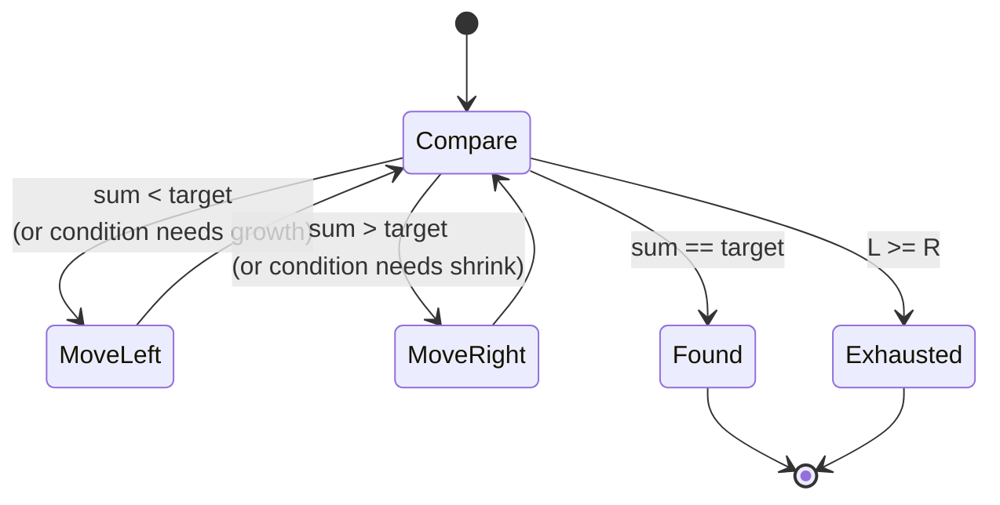

import { Callout } from 'fumadocs-ui/components/callout';

<Callout title="TL;DR — Two Pointers">

**Use when**: you'd otherwise need two nested loops over an array, and the input has *structure you can exploit* — sortedness, palindromic symmetry, in-place partitioning, or a linked-list cycle.

**Trigger phrases**: "sorted array", "pair sum equals", "remove duplicates in place", "palindrome", "cycle in linked list", "container with most water".

**Two flavors**: *opposing* (left/right close in toward each other) and *same-direction* (slow/fast move forward, often at different speeds).

**Complexity**: O(n) time, O(1) space.

</Callout>

---

## The problem that motivates this pattern

> **Two Sum II — Input Array is Sorted.** Given a 1-indexed sorted array of integers and a target sum, return the indices of the two numbers that add to the target.

Brute force is the same as plain Two Sum: every pair, O(n²). With hashing you can do it in O(n) time and O(n) space. But because the array is **sorted**, you can do it in O(n) time and **O(1) space** — no hash map needed.

That's the trade. Sortedness is information. The two-pointers pattern is how you *spend* it.

The idea: put one pointer at the start, one at the end. Read off the sum. If too small, *increase it* by moving the left pointer right (next-larger element). If too large, *decrease it* by moving the right pointer left. The pointers converge in O(n) total moves.

```
array = [2, 7, 11, 15], target = 9
        L           R       sum = 2 + 15 = 17 > 9   → R--
        L      R            sum = 2 + 11 = 13 > 9   → R--
        L  R                sum = 2 + 7 = 9          ✓ found
```

The brute force checked all 6 pairs. Two-pointers checked 3. On a million-element array, it's a million vs a trillion.

---

## The core insight

**Two pointers works when monotonicity lets us discard half the search space at every step.**

In Two Sum II, when `sum > target` we *know* every pair `(i, R')` for any `R' < R` (with `i = L`) is also too small **only if we'd already moved L** — but more importantly, every pair `(L, R)` with the current `L` and larger `R` would only be larger. So the only pair worth checking with `L` is one where `R` is smaller. By moving `R` left, we discard `R` itself and all bigger-R combinations from consideration. Symmetrically when `sum < target`.

The invariant we maintain — and you should be able to say this out loud — is:

> **At every step, the answer (if one exists) is in the unexplored slice `[L, R]`. Pointers never skip over a possible answer.**

That invariant is what lets us terminate in O(n). Each iteration moves *exactly one* pointer by one step. The pointers meet in at most `n` iterations. We never revisit indices.

The same invariant powers the **same-direction** variant (Floyd's tortoise and hare, or in-place partitioning) — even though both pointers move in the same direction, the *relative* monotonicity ("slow lags fast by a known amount" or "everything before slow is partitioned") plays the role of the search-space shrink.



---

## Visual walkthrough

Let's trace **3Sum** on `nums = [-1, 0, 1, 2, -1, -4]`, target `0`.

**Step 1.** Sort: `[-4, -1, -1, 0, 1, 2]`.

**Step 2.** Fix the first element at each index `i`. For each `i`, run two-pointers on the suffix to find pairs summing to `-nums[i]`.

**Iteration: `i = 0`, target = `4`.** Pointers `L = 1`, `R = 5`.

```
[-4, -1, -1, 0, 1, 2]
     L              R     sum = -1 + 2 = 1 < 4   → L++
[-4, -1, -1, 0, 1, 2]
         L          R     sum = -1 + 2 = 1 < 4   → L++
[-4, -1, -1, 0, 1, 2]
            L       R     sum = 0 + 2 = 2 < 4    → L++
[-4, -1, -1, 0, 1, 2]
               L    R     sum = 1 + 2 = 3 < 4    → L++
[-4, -1, -1, 0, 1, 2]
                  LR      L >= R, exit
```

No triplet with `-4`.

**Iteration: `i = 1`, target = `1`.** Pointers `L = 2`, `R = 5`.

```
[-4, -1, -1, 0, 1, 2]
         L          R     sum = -1 + 2 = 1 ✓ found [-1, -1, 2]
```

Move both: `L = 3`, `R = 4`. `sum = 0 + 1 = 1` ✓ found `[-1, 0, 1]`. Move both: `L = R`, exit.

**Result:** `[[-1, -1, 2], [-1, 0, 1]]`.

The point: at iteration `i = 1`, we found *both* triplets in 2 moves — not in O(n²) checks. That's two-pointers paying off.

---

## The template

There are two distinct two-pointer templates. Use **opposing** when the array is sorted; **same-direction** when you're scanning forward maintaining an invariant.

### Template A — Opposing pointers (most common)

```python
def opposing(arr):
    left, right = 0, len(arr) - 1
    while left < right:
        if condition(arr[left], arr[right]):
            return found(arr[left], arr[right])
        elif should_grow(arr[left], arr[right]):
            left += 1
        else:
            right -= 1
    return not_found
```

The three slots:

1. **`condition`** — when the pair satisfies the target (e.g., `arr[left] + arr[right] == target`).
2. **`should_grow`** — when to move `left` rightward to *increase* the candidate value.
3. **`else`** — implicitly, move `right` leftward.

### Template B — Same-direction pointers (slow + fast)

```python
def same_direction(arr):
    slow = 0
    for fast in range(len(arr)):
        if should_advance_slow(arr[fast]):
            arr[slow] = arr[fast]      # or some other update
            slow += 1
    return slow                         # often returns the new length
```

This is the *in-place partitioning* shape: `slow` marks the next slot to write into, `fast` reads through the array. Used for "Remove Duplicates from Sorted Array", "Move Zeroes", "Sort Colors" (Dutch flag), etc.

### Template C — Floyd's Tortoise and Hare (same direction, different speeds)

```python
def has_cycle(head):
    slow = fast = head
    while fast and fast.next:
        slow = slow.next            # 1 step
        fast = fast.next.next       # 2 steps
        if slow == fast:
            return True             # cycle detected
    return False
```

This is the cycle-detection specialization. Fast moves twice as fast as slow; if there's a cycle, they meet inside it within O(n) steps. Used in Linked List Cycle (141), Find Duplicate Number (287), Happy Number (202).

---

## Worked example: 3Sum

> **Problem.** Given an integer array `nums`, return all unique triplets `[a, b, c]` where `a + b + c = 0`. The solution set must not contain duplicate triplets. Example: `nums = [-1, 0, 1, 2, -1, -4]` → `[[-1, -1, 2], [-1, 0, 1]]`.

**Why this is two-pointers.** Brute force is O(n³) — three nested loops. Hashing gets you to O(n²) with O(n) space. Two-pointers gets you O(n²) time with **O(1)** extra space (ignoring sort), and the "no duplicate triplets" requirement is much easier to handle on sorted input.

**What changes from the template.** Three slots:

1. **Outer loop**: fix `nums[i]` and run two-pointers on the suffix `[i+1, n-1]` to find pairs summing to `-nums[i]`.
2. **Dedup**: after finding a triplet, skip duplicates of `nums[left]` and `nums[right]`. Also skip duplicates of `nums[i]` in the outer loop.
3. **Early exit**: if `nums[i] > 0`, no triplet can sum to 0 (since the suffix is sorted ≥ `nums[i]`). Break.

```python
def three_sum(nums: list[int]) -> list[list[int]]:
    nums.sort()
    ans = []
    n = len(nums)

    for i in range(n - 2):
        if nums[i] > 0:                              # early exit
            break
        if i > 0 and nums[i] == nums[i - 1]:         # skip outer dups
            continue

        left, right = i + 1, n - 1
        target = -nums[i]

        while left < right:
            s = nums[left] + nums[right]
            if s == target:
                ans.append([nums[i], nums[left], nums[right]])
                left += 1
                right -= 1
                while left < right and nums[left] == nums[left - 1]:
                    left += 1                         # skip inner dups
                while left < right and nums[right] == nums[right + 1]:
                    right -= 1
            elif s < target:
                left += 1
            else:
                right -= 1

    return ans
```

**Dry-run on `[-4, -1, -1, 0, 1, 2]`:**

| i | nums[i] | target | L→R trace | Found |
|---|---------|--------|-----------|-------|
| 0 | -4 | 4 | Sum range = -1+2..1+2 = 1..3, never reaches 4 | none |
| 1 | -1 | 1 | (-1,2)=1✓, (0,1)=1✓ | [-1,-1,2], [-1,0,1] |
| 2 | -1 | — | skipped (dup of i=1) | — |
| 3 | 0 | 0 | (1,2)=3 too big, exit | none |

**Complexity.** O(n²) time — outer loop is O(n), inner two-pointer scan is O(n). O(log n) extra space (for the sort), O(1) ignoring sort.

---

## Variants

### Variant 1 — Opposing pointers on sorted array

The canonical shape. Used for *pair-sum* and *triplet-sum* problems on sorted input. Container With Most Water (11) is a clever variant where the "value" being computed is `min(h[L], h[R]) * (R - L)` — same shrink-the-smaller-side logic.

**Canonical problems**: 167 Two Sum II, 15 3Sum, 16 3Sum Closest, 11 Container With Most Water, 977 Squares of Sorted Array (merge from outside in).

### Variant 2 — Same-direction (slow + fast) for in-place partitioning

Slow points to the next "write" slot; fast scans the array. Used to compact, deduplicate, or partition in place with O(1) extra space.

```python
# Remove duplicates from sorted array
def remove_dups(nums):
    slow = 0
    for fast in range(len(nums)):
        if fast == 0 or nums[fast] != nums[fast - 1]:
            nums[slow] = nums[fast]
            slow += 1
    return slow
```

**Canonical problems**: 26 Remove Duplicates, 27 Remove Element, 283 Move Zeroes, 75 Sort Colors (Dutch national flag — three pointers, but same idea).

### Variant 3 — Floyd's Tortoise and Hare (cycle detection)

Same-direction with *different speeds*. The classic application of two-pointers to linked lists or implicit-graph cycle detection.

**Canonical problems**: 141 Linked List Cycle, 142 Linked List Cycle II, 287 Find the Duplicate Number, 202 Happy Number.

Floyd's also detects the **cycle start**: after fast and slow meet, reset slow to the head; both move one step at a time; they meet at the cycle start. This is non-obvious — see [Linked List](/dsa/patterns/linked-list/linked-list) for the proof.

### Variant 4 — Meeting in the middle (palindrome check)

Opposing pointers, no sort needed — just symmetric comparison.

```python
def is_palindrome(s):
    left, right = 0, len(s) - 1
    while left < right:
        if s[left] != s[right]:
            return False
        left += 1
        right -= 1
    return True
```

**Canonical problems**: 125 Valid Palindrome, 680 Valid Palindrome II (allow one deletion).

---

## Common pitfalls

| Trap | Fix |
|------|-----|
| Using two-pointers on an unsorted array for pair-sum | Sort first (O(n log n)) or switch to hashing |
| Forgetting to skip duplicates after finding a triplet | Always advance both pointers and skip equal neighbors |
| Off-by-one with `left <= right` vs `left < right` | `left < right` for "two distinct indices"; `left <= right` for "include same index" (rare) |
| Moving both pointers when the condition fails | Move only one — the one that brings the sum closer to target |
| Same-direction template overwriting before reading | If `fast` and `slow` could alias, read first, then write |
| In Floyd's, checking `fast.next != null` but not `fast` itself | Always check both `fast` and `fast.next` before `fast = fast.next.next` |
| Mistakenly thinking two-pointers needs sortedness | It doesn't — palindrome check, partitioning, and Floyd's don't sort |

---

## Complexity

**Time: O(n)** for a single two-pointer pass. With an outer loop (3Sum), it becomes O(n²). With sort, add O(n log n) — but that's still dominated by the n² when present.

**Space: O(1)** auxiliary. This is the pattern's superpower over hashing: hash-based two-sum is O(n) time but O(n) space; sorted two-pointers is O(n log n) total but **O(1) extra**.

The amortized argument: each pointer moves at most `n` times total across the algorithm. They never revisit indices. So all work is bounded by `2n = O(n)`.

---

## When NOT to use two pointers

- **The array is unsorted and you can't sort.** If sorting destroys the indexing the problem requires (e.g., "return indices into the original array"), and you need O(n), use hashing instead.
- **You need to find triplets/k-tuples with constraints across all three.** Two-pointers handles pair-sum after fixing one element. For "find four numbers that multiply to X," you may need a different approach.
- **The condition isn't monotonic in pointer movement.** If moving `left` right or `right` left doesn't predictably grow/shrink your target value, the pattern's invariant collapses. Use a different approach.
- **You need access to arbitrary indices inside the window.** Two pointers exposes only the endpoints. For "median of window" or other interior queries, use heaps or another structure.

### Decision rule

| Symptom | Likely pattern |
|---------|---------------|
| "Pair summing to target, sorted array" | **Two Pointers — opposing** |
| "Pair summing to target, unsorted, return indices" | [Hashing](/dsa/patterns/arrays-strings/hashing) |
| "Triplet / quadruplet sum" | **Two Pointers** (fix one, two-point the rest) |
| "Container with most water" | **Two Pointers — opposing** |
| "Remove duplicates / partition in place" | **Two Pointers — slow/fast** |
| "Cycle in linked list" | **Floyd's tortoise & hare** |
| "Longest contiguous subarray with property" | [Sliding Window](/dsa/patterns/arrays-strings/sliding-window) |
| "Palindrome check" | **Two Pointers — opposing** |

---

## Real-world applications

- **Database join algorithms.** Sort-merge join uses two pointers walking through two sorted indexes — exactly the same shape.
- **Mergesort merge step.** The classic merge of two sorted arrays is two pointers.
- **DNA sequence comparison.** Pairwise alignment scans use two-pointer walks across sequences.
- **Garbage collectors.** Mark-and-sweep compactors use a "scan" pointer (read) and a "free" pointer (write) — that's slow/fast.

---

## Curated practice problems

| # | Problem | Difficulty | Variant | Note |
|---|---------|-----------|---------|------|
| 1 | ★ 167 Two Sum II — Sorted | Easy | Opposing | The canonical pair-sum |
| 2 | 125 Valid Palindrome | Easy | Opposing | Skip non-alphanumerics |
| 3 | 26 Remove Duplicates from Sorted Array | Easy | Slow/Fast | In-place |
| 4 | 283 Move Zeroes | Easy | Slow/Fast | Variant of partition |
| 5 | ★ 11 Container With Most Water | Medium | Opposing | "Shrink the smaller side" trick |
| 6 | ★ 15 3Sum | Medium | Opposing + outer loop | Dedup is the gotcha |
| 7 | 16 3Sum Closest | Medium | Opposing + outer loop | Track best, don't require equality |
| 8 | 18 4Sum | Medium | Opposing + 2 outer loops | Same template, one more nest |
| 9 | 75 Sort Colors | Medium | Three-pointer (Dutch flag) | Generalizes slow/fast |
| 10 | 680 Valid Palindrome II | Easy | Opposing | One-deletion allowance |
| 11 | ★ 141 Linked List Cycle | Easy | Floyd's | The classic |
| 12 | 142 Linked List Cycle II | Medium | Floyd's | Find cycle start |
| 13 | 287 Find the Duplicate Number | Medium | Floyd's on implicit graph | Treat array as linked list |
| 14 | 202 Happy Number | Easy | Floyd's on number sequence | |
| 15 | 977 Squares of Sorted Array | Easy | Opposing, build outward in | Merge from extremes |

---

## Related patterns

- [Sliding Window](/dsa/patterns/arrays-strings/sliding-window) — when both pointers move in the same direction maintaining a *contract*
- [Binary Search](/dsa/patterns/arrays-strings/binary-search) — when the search space is monotonic and you halve it (not walk it)
- [Linked List Manipulation](/dsa/patterns/linked-list/linked-list) — Floyd's lives here for cycle problems
- [Hashing](/dsa/patterns/arrays-strings/hashing) — the alternative when you can't sort

---

## Quick-reference card

```python
# Opposing
left, right = 0, len(arr) - 1
while left < right:
    if cond(arr[left], arr[right]): return found
    elif should_grow: left += 1
    else: right -= 1

# Same-direction (slow/fast)
slow = 0
for fast in range(len(arr)):
    if keep(arr[fast]):
        arr[slow] = arr[fast]; slow += 1

# Floyd's
slow = fast = head
while fast and fast.next:
    slow, fast = slow.next, fast.next.next
    if slow == fast: return True
```

Triggers: sorted array + pair, in-place partition, palindrome, linked list cycle. Complexity: O(n) time, O(1) extra space.
