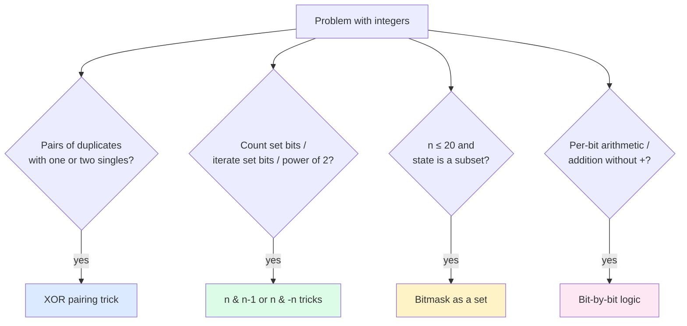

import { Callout } from 'fumadocs-ui/components/callout';

<Callout title="TL;DR — Bit Manipulation">

**Use when**: the problem operates on integers but the "interesting" structure is in the bits — pairing identical values, counting set bits, enumerating subsets, or doing per-bit reasoning.

**Trigger phrases**: "single number", "missing number", "count set bits", "power of two", "subsets via bitmask", "reverse bits", "swap without temporary".

**Five must-know tricks**:
1. **XOR pairs cancel**: `a ^ a = 0` and `a ^ 0 = a`. Used for "find the unpaired number."
2. **`n & (n-1)` clears the lowest set bit.** Used for popcount and "is power of 2."
3. **`n & -n` isolates the lowest set bit.**
4. **`1 << k` gives the k-th bit; `n | (1<<k)` sets, `n & ~(1<<k)` clears, `n ^ (1<<k)` toggles.**
5. **Bitmask as a set**: iterate `for sub = (sub - 1) & mask` to walk subsets.

**Complexity**: usually O(n) time, O(1) extra space — but only for the right class of problems.

</Callout>

---

## The problem that motivates this pattern

> **Single Number (LC 136).** Given a non-empty array where every element appears *twice* except for one, find that single one. Your algorithm should have linear time complexity and use only constant extra space.
>
> Example: `[4, 1, 2, 1, 2]` → `4`.

Hash-set approach: O(n) time, O(n) space. We're told *constant* space.

Sort then scan adjacent: O(n log n) — too slow.

**The XOR trick**: XOR every element together. Because `a ^ a = 0`, every pair cancels to 0. The remaining value is the unpaired one.

```python
def single_number(nums):
    result = 0
    for x in nums:
        result ^= x
    return result
```

**O(n) time, O(1) space.** That's it.

Why this works:
- `0 ^ 0 = 0`, `1 ^ 1 = 0` → identical bits cancel.
- `0 ^ 1 = 1`, `1 ^ 0 = 1` → different bits stay.
- XOR is associative and commutative, so the order of operations doesn't matter.

For `[4, 1, 2, 1, 2]`: `4 ^ 1 ^ 2 ^ 1 ^ 2 = 4 ^ (1 ^ 1) ^ (2 ^ 2) = 4 ^ 0 ^ 0 = 4`. ✓

The deeper insight: **bit manipulation isn't a single algorithm — it's a toolbox of identities you compose**. When the right identity matches your problem, you get O(n)/O(1) solutions that hash sets and sorting can't match. The hard part is recognizing the trigger.

---

## The core insight

**Bit-level operations work because integers, viewed as bits, support fast set/clear/toggle/test operations and a powerful identity: `a ^ a = 0`.**

### The four-tools mental model

Every bit-manipulation problem maps onto one of these tools:

1. **XOR cancellation** — pairs of identical values vanish. Use when there's a "find the odd one out" or "find the difference" structure.
2. **Lowest-bit operations** — `n & (n-1)` clears the lowest set bit; `n & -n` extracts it. Use for popcount, power-of-2 checks, iterating set bits.
3. **Single-bit set/clear/toggle/test** — `1 << k` is your friend. Use for explicit bit-by-bit work.
4. **Bitmask as a set** — for `n ≤ ~20`, you can encode "subset of n elements" as an integer. Use for subset enumeration and [Bitmask DP](/dsa/patterns/dp/bitmask).

The invariant for XOR-based tricks:

> **XOR preserves "what's been seen an odd number of times" and discards "what's been seen an even number of times."**

That's the entire theory behind the Single Number family of problems. Variations:
- **Single Number II** (every number appears 3 times except one): need a 3-counter trick (count bits mod 3 across all numbers).
- **Single Number III** (two singles, rest appear twice): XOR all → result = `a ^ b`; partition by any set bit in the XOR; XOR each partition separately.

The invariant for `n & (n-1)`:

> **`n & (n-1)` always clears the lowest set bit, producing a strictly smaller number with one fewer set bit.**

This is the basis for:
- **Popcount** in O(set-bit count) — loop while `n`, do `n &= n-1`, count.
- **Power of 2 check** — `n > 0 and (n & (n-1)) == 0`.
- **Counting Bits (LC 338)** — DP: `dp[n] = dp[n & (n-1)] + 1`.



---

## Visual walkthrough — XOR pairing

Trace XOR on `[2, 3, 5, 4, 5, 3, 4]` (every value appears twice except `2`).

```
Step-by-step XOR (cumulative):

Initial:   result = 0  (binary: 000)
^= 2:      result = 0 ^ 010 = 010  (= 2)
^= 3:      result = 010 ^ 011 = 001  (= 1)
^= 5:      result = 001 ^ 101 = 100  (= 4)
^= 4:      result = 100 ^ 100 = 000  (= 0)
^= 5:      result = 000 ^ 101 = 101  (= 5)
^= 3:      result = 101 ^ 011 = 110  (= 6)
^= 4:      result = 110 ^ 100 = 010  (= 2)

Final: 2 ✓
```

The path is wild — the intermediate values jump around — but every pair cancels eventually, leaving only `2`. **The order doesn't matter; the result is deterministic.**

For "two unique numbers" (Single Number III), XOR everything → result = `a ^ b`. Both bits of `a` and `b` are different where this XOR has a 1. Pick any such bit (e.g., the lowest, via `result & -result`). Partition the array by that bit: numbers with the bit set go to group A, others to group B. XOR each group separately → you get `a` and `b`.

---

## Visual walkthrough — `n & (n - 1)` for popcount

Count set bits in `n = 12` (binary `1100`).

```
n = 1100, count = 0
n & (n-1) = 1100 & 1011 = 1000.   (cleared the rightmost set bit)
count = 1, n = 1000.

n & (n-1) = 1000 & 0111 = 0000.   (cleared the other set bit)
count = 2, n = 0000.

Loop ends. Result: 2 set bits. ✓
```

**Each iteration clears exactly one set bit**, so the loop runs once per set bit — O(popcount(n)) iterations, not O(log n). For sparse-bit integers this is much faster than naive "shift and test."

```python
def popcount(n):
    count = 0
    while n:
        n &= n - 1
        count += 1
    return count
```

The full `n & -n` trick (isolating the lowest set bit) is the dual: `12 & -12 = 1100 & ...0100 = 0100 = 4` (the lowest set bit as a power of 2). Used in Fenwick trees (BIT).

---

## The template

### Template A — XOR cancellation

```python
def single_number(nums):
    result = 0
    for x in nums:
        result ^= x
    return result
```

For two unique numbers in a sea of pairs:

```python
def single_number_iii(nums):
    xor_all = 0
    for x in nums:
        xor_all ^= x                                   # xor_all = a ^ b

    diff_bit = xor_all & -xor_all                      # lowest differing bit

    a = b = 0
    for x in nums:
        if x & diff_bit:
            a ^= x
        else:
            b ^= x
    return [a, b]
```

### Template B — Popcount / power-of-2 check

```python
def hamming_weight(n):
    count = 0
    while n:
        n &= n - 1
        count += 1
    return count

def is_power_of_two(n):
    return n > 0 and (n & (n - 1)) == 0
```

### Template C — Set / Clear / Toggle / Test bit k

```python
set_bit(n, k)    = n | (1 << k)
clear_bit(n, k)  = n & ~(1 << k)
toggle_bit(n, k) = n ^ (1 << k)
test_bit(n, k)   = (n >> k) & 1
```

### Template D — Iterate all subsets of a bitmask

```python
sub = mask
while sub > 0:
    process(sub)
    sub = (sub - 1) & mask                            # next smaller subset
# Don't forget the empty subset (sub = 0)
process(0)
```

This iterates the subsets in **decreasing numeric order**, hitting each subset exactly once. Used in advanced bitmask DP — see [Bitmask DP](/dsa/patterns/dp/bitmask).

### Template E — Generate all subsets via bitmask

For an array of length `n`, iterate `mask` from `0` to `2^n - 1`. Each bit of `mask` corresponds to "include this element."

```python
def all_subsets(nums):
    n = len(nums)
    result = []
    for mask in range(1 << n):
        subset = [nums[i] for i in range(n) if mask & (1 << i)]
        result.append(subset)
    return result
```

This is the iterative version of [Backtracking subsets](/dsa/patterns/recursion/backtracking) — no recursion needed.

---

## Worked example: Counting Bits (LC 338)

> **Problem.** Given an integer `n`, return an array `ans` of length `n + 1` where `ans[i]` is the number of `1` bits in the binary representation of `i`. Solve in O(n) total time.
>
> Example: `n = 5` → `[0, 1, 1, 2, 1, 2]` (binary: `0=0, 1=1, 10=1, 11=2, 100=1, 101=2`).

**Naive**: for each `i`, compute popcount in O(log i). Total: O(n log n).

**Better with bit manipulation**: notice the recurrence `popcount(i) = popcount(i & (i-1)) + 1`. We've already computed `popcount(i & (i-1))` since `i & (i-1) < i`. So `dp[i] = dp[i & (i-1)] + 1`. O(n) total time, O(n) space.

```python
def count_bits(n: int) -> list[int]:
    dp = [0] * (n + 1)
    for i in range(1, n + 1):
        dp[i] = dp[i & (i - 1)] + 1
    return dp
```

**Dry-run on `n = 5`:**

| i | binary | i & (i-1) | dp[i & (i-1)] | dp[i] |
|---|--------|-----------|---------------|-------|
| 0 | 0 | — | — | 0 |
| 1 | 1 | 0 | 0 | 1 |
| 2 | 10 | 0 | 0 | 1 |
| 3 | 11 | 10 (= 2) | 1 | 2 |
| 4 | 100 | 0 | 0 | 1 |
| 5 | 101 | 100 (= 4) | 1 | 2 |

**Result: `[0, 1, 1, 2, 1, 2]`** ✓.

**Why does this work?** `i & (i-1)` removes the lowest set bit of `i`. So `popcount(i)` is exactly `popcount(i with lowest bit removed) + 1`. Since `i & (i-1) < i`, we always have the answer cached.

**Alternative recurrence**: `dp[i] = dp[i >> 1] + (i & 1)`. Both work, both O(n).

**Complexity.** O(n) time, O(n) space.

---

## Variants

### Variant 1 — XOR Pairing (Single Number family)

The canonical: every value appears twice except one — XOR them all.

**Canonical problems**: 136 Single Number, 137 Single Number II (every value thrice except one — 3-counter or per-bit mod 3), 260 Single Number III (two singles — partition by differing bit), 268 Missing Number (XOR all indices and values).

### Variant 2 — Popcount and Power-of-Two

`n & (n-1)` for popcount and "is exact power of 2."

**Canonical problems**: 191 Number of 1 Bits (Hamming weight), 338 Counting Bits (this page's worked example), 231 Power of Two, 342 Power of Four.

### Variant 3 — Bit-by-Bit Arithmetic

Implement addition / subtraction / multiplication / division without using the operators. Use XOR for "sum without carry" and AND-shift for the carry.

```python
# Add two integers without + or -
def add(a, b):
    while b != 0:
        carry = (a & b) << 1
        a = a ^ b
        b = carry
    return a
```

**Canonical problems**: 371 Sum of Two Integers, 29 Divide Two Integers (use bit shifts).

### Variant 4 — Reverse Bits / Bit Reversal

```python
def reverse_bits(n):
    result = 0
    for _ in range(32):
        result = (result << 1) | (n & 1)
        n >>= 1
    return result
```

**Canonical problems**: 190 Reverse Bits, 7 Reverse Integer.

### Variant 5 — Bitmask as a Set (subset enumeration)

For `n ≤ 20`, encode subsets as integers; iterate via `for mask in range(1 << n)`.

```python
# Generate all subsets of nums
for mask in range(1 << len(nums)):
    subset = [nums[i] for i in range(len(nums)) if mask & (1 << i)]
```

**Canonical problems**: 78 Subsets (iterative bitmask version), 1239 Maximum Length of Concatenated String with Unique Characters (bitmask + DP).

### Variant 6 — Bitmask DP

State = subset of "used" items as a bitmask. Transition: pick the next item to add.

This is its own pattern — see [DP — Bitmask](/dsa/patterns/dp/bitmask).

**Canonical problems**: 1879 Min XOR Sum of Two Arrays, 698 Partition to K Equal Sum Subsets, 847 Shortest Path Visiting All Nodes, TSP.

### Variant 7 — Hamming Distance

Hamming distance between two integers = popcount of their XOR.

```python
def hamming_distance(x, y):
    return bin(x ^ y).count('1')                       # or use n & (n-1) loop
```

**Canonical problems**: 461 Hamming Distance, 477 Total Hamming Distance.

### Variant 8 — Bit Trie (Maximum XOR)

A binary trie supporting "find the integer that XORs to maximum with a given query." See [Trie](/dsa/patterns/trees/trie) for the structure.

**Canonical problems**: 421 Maximum XOR of Two Numbers in an Array, 1707 Maximum XOR With Element ≤ M.

---

## Common pitfalls

| Trap | Fix |
|------|-----|
| Confusing `&` with `&&` (or `|` with `\|\|`) | C/Java pitfall — `&` is bitwise; `&&` is logical. Be careful in those langs |
| Forgetting that XOR with 0 is identity | Initialize `result = 0` for cumulative XOR |
| Sign-extension on right-shift of negative integers | In Java, use `>>>` for unsigned right shift. In Python, integers are arbitrary precision; right-shift of negatives is implementation-defined |
| Off-by-one in shifts (`1 << n` vs `1 << (n-1)`) | Bit `k` is `1 << k`, not `1 << (k-1)` |
| Overflow on `1 << 31` in Java/C | Use `1L << 31` (long) or be explicit about integer width |
| Using `n % 2` for "is even" then `if n / 2`-style logic when `n & 1` and `n >> 1` would be cleaner | Both work; the bit version is sometimes faster and signals intent |
| Iterating bits of huge numbers | Set bit count via `bin(n).count('1')` is fine for one-off; loop with `n &= n-1` is faster for many calls |
| Confusing `n & -n` with `n & (n-1)` | `n & -n` *isolates* the lowest set bit; `n & (n-1)` *clears* it |
| Trying to use bitmask for n > 30 | 2^30 ≈ 10^9 — feasible in time but memory explodes. Bitmask techniques cap at n ≈ 20 |
| Using XOR for sorting / comparison | XOR doesn't preserve order; it's not a comparison primitive |

---

## Complexity

**XOR cumulative:** O(n) time, O(1) space.

**Popcount via `n & (n-1)` loop:** O(popcount(n)) per call. Always ≤ O(log n).

**Counting bits up to n via DP:** O(n) total time.

**Bitmask subset enumeration:** O(2^n) for all subsets; O(3^n) for all (subset, sub-subset) pairs (e.g., bitmask DP over sub-subsets).

**Bit-by-bit arithmetic:** O(width) per operation (typically 32 or 64 iterations).

The patterns are usually fast — the question is whether your problem has the *shape* that admits them.

---

## When NOT to use bit manipulation

- **The bit-level structure isn't load-bearing.** If you don't have pairs, sets, or powers of 2 in your problem, bit tricks usually add complexity without benefit. Use straightforward arithmetic.
- **The integers are too wide for bitmasks.** `n > 30` means `2^n > 10^9` — generating all subsets is infeasible.
- **You need ordering / range queries.** XOR doesn't preserve order. Don't use it for "max", "min", or "sort."
- **The problem requires precise arithmetic on signed numbers.** Bit shifts on negative integers have language-specific semantics; tread carefully.
- **You're not comfortable with two's complement.** Some tricks (`n & -n`) rely on two's complement representation. Verify before using in languages with arbitrary-precision integers (Python).
- **The constant factor matters and you're not benchmarking.** Sometimes clever bit tricks are *slower* in modern CPUs due to branch prediction and pipelining of simpler arithmetic.

### Decision rule

| Symptom | Likely pattern |
|---------|---------------|
| "Find single / unpaired number" | **XOR pairing** |
| "Count set bits / popcount" | **`n & (n-1)` loop** |
| "Power of 2 / 4 check" | **`n & (n-1) == 0`** |
| "Generate all subsets" | **Bitmask** (or [Backtracking](/dsa/patterns/recursion/backtracking)) |
| "Subset enumeration with constraints" | [DP — Bitmask](/dsa/patterns/dp/bitmask) |
| "Hamming distance / XOR sum" | **XOR + popcount** |
| "Maximum XOR pair / subset" | [Trie](/dsa/patterns/trees/trie) (binary trie) |
| "Add / subtract without operators" | **Bit-by-bit arithmetic** |
| "Reverse bits" | **Shift-and-OR** |
| "Random integer / hash duplicates" | [Hashing](/dsa/patterns/arrays-strings/hashing) (not bit tricks) |

---

## Real-world applications

- **Hash functions.** Bitwise operations are the foundation of every fast hash function (FNV, MurmurHash, SipHash).
- **Compression algorithms.** Huffman coding, LZ77 — all manipulate bit-level encodings.
- **Cryptography.** Block ciphers (AES), stream ciphers, hash functions — bit operations everywhere.
- **Networking — IP routing.** Subnet masks, CIDR notation, route aggregation — all bit operations on 32-bit addresses.
- **Database query optimizers.** Bloom filters use bit arrays; bitmap indexes use word-level AND/OR for fast filtering.
- **Compilers.** Constant folding, peephole optimizations, register allocation often use bitmasks.
- **Operating systems.** File permissions (rwx), CPU feature flags, scheduler priorities — all bit fields.
- **Computer graphics.** Color manipulation (ARGB packing), z-buffer operations, blend modes.
- **Game engines.** Collision detection (bitmask layers), state machines, save-state compaction.

---

## Curated practice problems

| # | Problem | Difficulty | Variant | Note |
|---|---------|-----------|---------|------|
| 1 | ★ 136 Single Number | Easy | XOR all | The canonical |
| 2 | 137 Single Number II | Medium | Every value × 3 except one | Per-bit mod 3 |
| 3 | 260 Single Number III | Medium | Two singles | Partition by differing bit |
| 4 | 268 Missing Number | Easy | XOR indices + values | Or sum trick / cyclic sort |
| 5 | ★ 191 Number of 1 Bits | Easy | Popcount | `n & (n-1)` loop |
| 6 | ★ 338 Counting Bits | Medium | DP on bits | This page's worked example |
| 7 | 231 Power of Two | Easy | One-liner | `n > 0 and (n & (n-1)) == 0` |
| 8 | 342 Power of Four | Easy | Power of 2 + bit position | Even position check |
| 9 | 461 Hamming Distance | Easy | XOR + popcount | Trivial composition |
| 10 | 190 Reverse Bits | Easy | Shift-and-OR | 32 iterations |
| 11 | 371 Sum of Two Integers | Medium | Add without `+` | XOR + carry-shift loop |
| 12 | ★ 78 Subsets (bitmask version) | Medium | Bitmask iteration | `for mask in range(2^n)` |
| 13 | 1239 Max Length of Concat Strings | Medium | Bitmask + DP | Each string ↔ bitmask of chars |
| 14 | 421 Maximum XOR of Two Numbers | Medium | Binary trie | See [Trie](/dsa/patterns/trees/trie) |
| 15 | 477 Total Hamming Distance | Medium | Count per-bit contributions | Per-bit count of 0s × 1s |

---

## Related patterns

- [Cyclic Sort](/dsa/patterns/recursion/cyclic-sort) — alternative for "missing/duplicate in 1..n" problems
- [Hashing](/dsa/patterns/arrays-strings/hashing) — alternative when you have memory
- [Trie](/dsa/patterns/trees/trie) — binary trie for max-XOR problems
- [DP — Bitmask](/dsa/patterns/dp/bitmask) — bitmask as DP state for subset-based problems
- [Backtracking](/dsa/patterns/recursion/backtracking) — bitmask iteration is the iterative form of subset backtracking

---

## Quick-reference card

```python
# XOR all → cancels pairs
result = 0
for x in nums: result ^= x

# Popcount with n & (n-1) — O(popcount) iterations
count = 0
while n: n &= n - 1; count += 1

# Power of 2
n > 0 and (n & (n - 1)) == 0

# Lowest set bit
n & -n                                      # isolates: 12 → 4
n & (n - 1)                                  # clears: 12 → 8

# Single bit at position k
n |  (1 << k)                                # set
n & ~(1 << k)                                # clear
n ^  (1 << k)                                # toggle
(n >> k) & 1                                 # test

# Iterate all subsets of mask (decreasing order)
sub = mask
while sub > 0:
    process(sub)
    sub = (sub - 1) & mask
process(0)                                   # don't forget empty subset

# Generate all subsets of array
for mask in range(1 << n):
    subset = [arr[i] for i in range(n) if mask & (1 << i)]
```

Triggers: "single number", "popcount", "power of 2", "subsets via bitmask", "max XOR", "swap without temp". Complexity: O(n) time, O(1) extra (usually).
