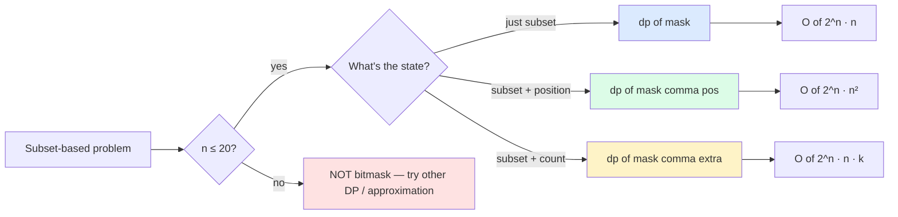

import { Callout } from 'fumadocs-ui/components/callout';

<Callout title="TL;DR — DP — Bitmask">

**Use when**: the state of your problem is "which subset of n items has been used / visited / picked," and `n ≤ 20`. Beyond `n ≈ 20`, 2^n becomes infeasible.

**Trigger phrases**: "traveling salesman", "shortest path visiting all nodes", "partition to k equal sum subsets", "min cost to assign n tasks to n workers", "minimum incompatibility", "find shortest superstring".

**The shape**: `dp[mask]` or `dp[mask][extra_state]`. A bit set in `mask` means "this item is used/visited/picked."

**Two operations**:
- **Iterate all masks**: `for mask in range(1 << n)`.
- **Iterate sub-masks**: `sub = mask; while sub > 0: ...; sub = (sub - 1) & mask`.

**Complexity**: O(2^n · n) typical; O(3^n) for sub-mask enumeration over all masks.

</Callout>

---

## The problem that motivates this pattern

> **Shortest Path Visiting All Nodes (LC 847).** An undirected, connected graph of `n` nodes. Return the length of the shortest path that visits every node. You may start and stop at any node, may revisit, and may reuse edges.

Brute force: try every permutation of node visits as a starting order. O(n!) — for n=12, that's ~500 million.

Insight: the state we care about is **(current node, set of nodes visited so far)**. The "set of visited" can have up to 2^n values; the current node has `n`. State space = `n · 2^n` — for n=12, ~50K states. Feasible.

Transition: from state `(u, mask)`, move to any neighbor `v`. New state: `(v, mask | (1 << v))`. Each edge contributes 1 step.

```python
from collections import deque

def shortest_path_length(graph):
    n = len(graph)
    target = (1 << n) - 1                            # all bits set
    visited = set()
    queue = deque()

    for i in range(n):
        queue.append((i, 1 << i, 0))                 # (node, mask, distance)
        visited.add((i, 1 << i))

    while queue:
        node, mask, dist = queue.popleft()
        if mask == target: return dist
        for nb in graph[node]:
            new_mask = mask | (1 << nb)
            if (nb, new_mask) not in visited:
                visited.add((nb, new_mask))
                queue.append((nb, new_mask, dist + 1))
```

BFS-on-bitmask-state. **`n · 2^n` states, each visited once**. O(n · 2^n · degree).

The deeper insight: **bitmask DP turns combinatorial "which subset" problems into polynomial-in-2^n algorithms**. The trade: only works for `n ≤ 20`. But for small n with combinatorial structure (TSP, assignment, set cover), it's the *only* way to get an exact answer in reasonable time.

---

## The core insight

**A bitmask is an integer where each bit represents "is this element in the set?" Set operations become bit operations.**

The invariant we maintain:

> **`dp[mask]` (or `dp[mask][extra]`) is the optimal answer for any way of arriving at the state where `mask`'s bits represent which elements are used.**

Three things to identify:

1. **What does the bitmask represent?** Almost always "which elements have been processed/used/visited." Bit `i` set ⇒ element `i` is in the subset.
2. **What's the extra state, if any?** Sometimes you need "(current_position, mask)" — like TSP, where you also track the current city. Sometimes just `dp[mask]`.
3. **Transition**: how do you extend the subset by one element?

### The fundamental operations

```python
# Test if bit i is set in mask
mask & (1 << i)

# Add element i to mask
mask | (1 << i)

# Remove element i from mask
mask & ~(1 << i)

# Toggle element i
mask ^ (1 << i)

# Iterate all elements in mask
i = 0
while (1 << i) <= mask:
    if mask & (1 << i):
        process(i)
    i += 1

# Iterate all subsets of mask (smaller-first by numeric value, decreasing)
sub = mask
while sub > 0:
    process(sub)
    sub = (sub - 1) & mask
process(0)                                           # empty subset
```

See [Bit Manipulation](/dsa/patterns/bit/bit-manipulation) for more on these.



For n = 20: 2^n ≈ 10⁶. With another factor of n = 20: 20 million ops. Fast.
For n = 25: 2^n ≈ 33M. With n = 25: nearly a billion. Slow but doable.
For n = 30: 2^n ≈ 10⁹. Infeasible without massive optimization.

---

## Visual walkthrough — Shortest Path Visiting All Nodes

3-node graph: `0—1—2`.

States: `(current_node, visited_mask)`. We start with `(i, 1 << i, 0)` for each `i`.

```
Initial queue: [(0, 001, 0), (1, 010, 0), (2, 100, 0)]

Step 1: pop (0, 001, 0). target = 111. Not target.
  Neighbors of 0: [1]. new state (1, 011, 1). Add.

Step 2: pop (1, 010, 0). Neighbors: [0, 2].
  (0, 011, 1) — already visited via different path, skip.
  (2, 110, 1). Add.

Step 3: pop (2, 100, 0). Neighbors: [1].
  (1, 110, 1). Add.

Step 4: pop (1, 011, 1). Neighbors: [0, 2].
  (0, 011) already visited (but we don't track (0, 011) explicitly — well we'd want to, but new visit changes mask). Actually (0, 011, 2) would be slower than going to 2.
  (2, 111, 2). 111 = target! Return 2.
```

**Answer: 2** ✓.

The key: we visit each (node, mask) pair at most once. So we don't re-explore unproductive paths. The state space is `n · 2^n`, BFS visits each at most once → O(n · 2^n · degree).

---

## The template

### Template A — TSP (Traveling Salesman, Held-Karp)

```python
def tsp(dist, n):
    """dist[i][j] = distance from city i to j. Returns shortest tour
    starting and ending at city 0."""
    INF = float('inf')
    # dp[mask][i] = min cost to start at 0, visit cities in mask, end at i
    dp = [[INF] * n for _ in range(1 << n)]
    dp[1][0] = 0                                      # start at 0, only 0 visited

    for mask in range(1 << n):
        if not (mask & 1): continue                   # must include city 0
        for u in range(n):
            if not (mask & (1 << u)): continue
            if dp[mask][u] == INF: continue
            for v in range(n):
                if mask & (1 << v): continue          # v already visited
                new_mask = mask | (1 << v)
                dp[new_mask][v] = min(dp[new_mask][v], dp[mask][u] + dist[u][v])

    full = (1 << n) - 1
    return min(dp[full][i] + dist[i][0] for i in range(1, n))
```

O(2^n · n²). For n = 15, ~7M ops. For n = 20, ~400M — slow but doable.

**Three slots:**

1. **State**: `dp[mask][last_city]`.
2. **Transition**: from `(mask, u)` to `(mask | (1 << v), v)` for unvisited `v`.
3. **Final answer**: minimize over all ending cities, adding the cost to return to start.

### Template B — Partition / Assignment

```python
# Min sum of max-per-group when partitioning into K groups (LC 1986-flavored)
def can_partition_k(nums, k):
    n = len(nums)
    if sum(nums) % k != 0: return False
    target = sum(nums) // k

    # dp[mask] = "after using items in mask, the current group's sum modulo target"
    # If we can make all bins, then dp[full] == 0 (we just completed a group).
    dp = [-1] * (1 << n)
    dp[0] = 0

    for mask in range(1 << n):
        if dp[mask] == -1: continue
        for i in range(n):
            if mask & (1 << i): continue
            if dp[mask] + nums[i] > target: continue
            new_mask = mask | (1 << i)
            dp[new_mask] = (dp[mask] + nums[i]) % target

    return dp[(1 << n) - 1] == 0
```

The trick: track *current group's sum modulo target*. When a group is "full" (sum == target), it wraps to 0; we implicitly start a new group.

### Template C — Sub-mask enumeration (DP over subsets of subsets)

When the transition involves "split mask into two non-empty submasks," iterate sub-masks.

```python
for mask in range(1, 1 << n):
    sub = mask
    while sub > 0:
        complement = mask ^ sub
        # process the partition (sub, complement)
        sub = (sub - 1) & mask
```

Total complexity: **O(3^n)** (the sum over all masks of 2^popcount(mask) is 3^n by the binomial theorem).

For n ≤ 16, 3^n ≈ 43M — feasible.

---

## Worked example: Find the Shortest Superstring (LC 943)

> **Problem.** Given an array of strings, find the shortest string that contains each `words[i]` as a substring. If multiple answers, return any.
>
> Example: `words = ["catg", "ctaagt", "gcta", "ttca", "atgcatc"]` → `"gctaagttcatgcatc"`.

**Why this is bitmask DP.** We want to chain the words so each can overlap with the next, minimizing total length. The natural state: `(last_word_used, set_of_words_in_chain)`.

For n words, state space is `n · 2^n`. For n=12, that's ~50K states. Workable.

**Setup**:
1. Precompute `overlap[i][j]` = length of longest suffix of `words[i]` that matches a prefix of `words[j]`. (This is the "savings" from joining them.)
2. `dp[mask][i]` = (cost, parent) of the best way to reach the state "words in mask used, last word = i."
3. Cost = total length of resulting superstring.

```python
def shortest_superstring(words: list[str]) -> str:
    n = len(words)

    # Precompute overlap[i][j]
    overlap = [[0] * n for _ in range(n)]
    for i in range(n):
        for j in range(n):
            if i == j: continue
            max_ov = min(len(words[i]), len(words[j]))
            for k in range(max_ov, 0, -1):
                if words[i].endswith(words[j][:k]):
                    overlap[i][j] = k
                    break

    # dp[mask][i] = (cost, parent_word_index)
    INF = float('inf')
    dp = [[INF] * n for _ in range(1 << n)]
    parent = [[-1] * n for _ in range(1 << n)]

    # Base case: only word i used
    for i in range(n):
        dp[1 << i][i] = len(words[i])

    # Build up
    for mask in range(1, 1 << n):
        for i in range(n):
            if not (mask & (1 << i)): continue
            if dp[mask][i] == INF: continue
            for j in range(n):
                if mask & (1 << j): continue          # word j not yet used
                new_mask = mask | (1 << j)
                new_cost = dp[mask][i] + len(words[j]) - overlap[i][j]
                if new_cost < dp[new_mask][j]:
                    dp[new_mask][j] = new_cost
                    parent[new_mask][j] = i

    # Find best ending state
    full = (1 << n) - 1
    last = min(range(n), key=lambda i: dp[full][i])

    # Reconstruct the path of word indices
    path = []
    mask = full
    while last != -1:
        path.append(last)
        prev_last = parent[mask][last]
        mask ^= (1 << last)
        last = prev_last
    path.reverse()

    # Build the superstring by concatenating with overlap
    result = words[path[0]]
    for i in range(1, len(path)):
        result += words[path[i]][overlap[path[i-1]][path[i]]:]
    return result
```

**Complexity.** O(2^n · n²) DP + O(n² · L²) overlap precomputation. For n=12, totals to ~50M ops — fast.

The trick that makes this work: encoding the "which words used" as a bitmask. Without it, we'd be tracking permutations (n!) — for n=12, 500M, *and* without subproblem sharing.

---

## Variants

### Variant 1 — Iterate Sets, Pick One Element to Add

The base case. `dp[mask]` builds from `dp[mask without i]` for each `i in mask`.

**Canonical problems**: 1986 Min Sessions to Finish Tasks, 698 Partition to K Equal Sum Subsets (with the modulo trick).

### Variant 2 — TSP-style (Held-Karp)

State: `dp[mask][last_position]`. Transition: add a new city.

**Canonical problems**: 943 Find Shortest Superstring (this page's worked example — TSP in disguise), 1659 Max Grid Happiness (state is mask of row positions), 847 Shortest Path Visiting All Nodes (BFS over `(node, mask)`).

### Variant 3 — Assignment Problem

Each of n people can be assigned to one of n tasks, with some cost. Find the min total cost.

```python
# Assignment via bitmask DP
# dp[mask] = min cost to assign people 0..popcount(mask)-1 to the tasks in mask
def assignment(cost):
    n = len(cost)
    INF = float('inf')
    dp = [INF] * (1 << n)
    dp[0] = 0
    for mask in range(1 << n):
        if dp[mask] == INF: continue
        i = bin(mask).count('1')                     # which person is next?
        if i == n: continue
        for j in range(n):
            if mask & (1 << j): continue              # task j taken
            new_mask = mask | (1 << j)
            dp[new_mask] = min(dp[new_mask], dp[mask] + cost[i][j])
    return dp[(1 << n) - 1]
```

**Canonical problems**: 1879 Min XOR Sum of Two Arrays, 1947 Maximum Compatibility Score Sum.

### Variant 4 — Sub-mask DP (3^n)

When the transition splits `mask` into two parts. Iterate sub-masks of each mask.

```python
for mask in range(1, 1 << n):
    sub = mask
    while sub > 0:
        # process (sub, mask ^ sub)
        sub = (sub - 1) & mask
```

**Canonical problems**: 1494 Parallel Courses II, 1879 Min XOR Sum (sub-mask iteration optional), 2403 Minimum Time to Kill All Monsters (variant).

### Variant 5 — Bitmask + Multiple Dimensions

Sometimes bitmask alone isn't enough — combine with another dimension.

```python
# dp[i][mask] = min cost considering first i rows, with state mask for the current row
```

**Canonical problems**: 1659 Maximum Grid Happiness (state = mask of last row), 1601 Maximum Number of Achievable Transfer Requests (mask of selected requests).

### Variant 6 — Profile DP (bitmask on grid rows)

For grid problems where the "state" of a row affects the next row. Bitmask the row.

```python
# dp[i][mask] = ways to tile first i rows with the i-th row's filled cells = mask
```

**Canonical problems**: 1349 Maximum Students Taking Exam (mask of seated students per row), 1494 Parallel Courses II.

### Variant 7 — Bitmask for "Visited So Far" in Graph

When the graph has ≤ 20 nodes and you need to track visited.

**Canonical problems**: 847 Shortest Path Visiting All Nodes, 1066 Campus Bikes II (mask of used bikes).

---

## Common pitfalls

| Trap | Fix |
|------|-----|
| Using bitmask DP with n > 20 | 2^20 = 1M is the practical limit. n=25 already pushes memory limits |
| Forgetting that `mask & (1 << i)` returns the bit value, not a boolean | Use `if mask & (1 << i)` (Python implicit truthy) or `!= 0` (explicit) |
| Off-by-one in `1 << n` vs `(1 << n) - 1` | `1 << n` is the count of masks; `(1 << n) - 1` is the all-bits-set mask |
| Iterating outer loop in wrong order | If `dp[mask]` depends on `dp[smaller mask]`, iterate masks ascending. Iterating descending breaks DP |
| Reverse-iterating mask but reading the wrong transition | Read carefully; bottom-up bitmask DP usually goes ascending |
| Trying to enumerate sub-masks via `range(mask)` | That's O(2^n) per mask, total O(4^n). Use `(sub - 1) & mask` for O(3^n) total |
| Forgetting the empty subset in sub-mask iteration | `while sub > 0` stops before sub=0. If you need empty, handle it explicitly |
| Bitmask over the wrong dimension | If items are 30 and dependencies are 10, bitmask the 10 (dependencies), not 30 |
| Mistaking "popcount of mask" for "value of mask" | Different! `popcount(0b101) = 2` but `value = 5` |
| Using `bin(mask).count('1')` in a tight loop | Slow. Cache popcounts, or use math: `bin(mask).count('1')` is O(n) per call |

---

## Complexity

**Time**: depends on the shape.

- **Plain dp[mask]**: O(2^n · n) — visit each mask, try each transition. For n=20, ~20M ops.
- **dp[mask][k]** (extra state): O(2^n · n · k).
- **TSP-style (dp[mask][last])**: O(2^n · n²). For n=15, ~7M.
- **Sub-mask iteration**: O(3^n). For n=15, ~14M.

**Space**: O(2^n) typical. For n=20, ~8 MB of integers — at the memory limit but workable.

**Beyond n=22**: memory and time both become problems.

---

## When NOT to use bitmask DP

- **n is too large.** Above 20-22, 2^n is infeasible. Look for problem structure that allows polynomial DP, or use approximation algorithms.
- **The state isn't really a subset.** If your "state" is too high-dimensional (e.g., a partition of items into K groups with K ≥ 4), bitmask might not capture it.
- **A polynomial DP exists.** Sometimes a TSP-like problem has tree or DAG structure that allows O(n^k) solutions. Check first.
- **Greedy or specialized algorithms work.** Min-cost assignment has a polynomial Hungarian algorithm O(n³). Use it if you can.
- **Memory is tight.** 2^n integers = 4n MB for 32-bit. For n=22, that's 16 MB. May not fit in stack.
- **You need exact solution but want average-case fast.** Sometimes branch-and-bound with good pruning is much faster than bitmask DP.

### Decision rule

| Symptom | Likely pattern |
|---------|---------------|
| "Traveling Salesman / shortest tour" | **Bitmask DP** (Held-Karp) |
| "Visit all nodes / cover all" | **Bitmask DP** |
| "Assign n tasks to n workers" | **Bitmask DP** (or Hungarian O(n³)) |
| "Partition into K subsets, n ≤ 20" | **Bitmask DP** |
| "Find shortest superstring" | **Bitmask DP** (TSP-like) |
| "Maximum students per row" | **Bitmask DP** (profile DP) |
| "n > 25" | NOT bitmask — use polynomial DP or approximation |
| "Subset sum (just by total)" | [Knapsack DP](/dsa/patterns/dp/knapsack), not bitmask |
| "Subset query (max XOR)" | [Trie](/dsa/patterns/trees/trie) (binary trie), not bitmask |

---

## Real-world applications

- **Traveling salesman variants.** Vehicle routing, last-mile delivery, drone path planning — Held-Karp is the gold-standard exact algorithm for small instances.
- **Compiler instruction scheduling.** Selecting an optimal order of instructions with dependencies.
- **Resource assignment.** Assigning jobs to machines, professors to courses, tasks to time slots.
- **Bioinformatics — set cover.** Selecting probes to cover all genes; minimum spanning hypergraph.
- **Optimal coding / compression.** Some specialized compression algorithms use bitmask DP for offline optimization.
- **VLSI design.** Layout optimization sometimes uses bitmask DP for small cell groups.
- **AI planning.** STRIPS-style classical planning with small state spaces.

---

## Curated practice problems

| # | Problem | Difficulty | Variant | Note |
|---|---------|-----------|---------|------|
| 1 | ★ 847 Shortest Path Visiting All Nodes | Hard | BFS over (node, mask) | This page's intro |
| 2 | ★ 943 Find the Shortest Superstring | Hard | TSP-like with overlap | This page's worked example |
| 3 | 1659 Maximum Grid Happiness | Hard | Profile DP (bitmask per row) | n_rows × n_cols ≤ 25 |
| 4 | 1494 Parallel Courses II | Hard | Sub-mask iteration | Pick K courses per semester |
| 5 | 698 Partition to K Equal Sum Subsets | Medium | Bitmask + modulo trick | Or backtracking |
| 6 | 1986 Minimum Number of Work Sessions | Medium | Bitmask DP | Pack tasks into sessions |
| 7 | ★ 1879 Min XOR Sum of Two Arrays | Hard | Assignment-style | dp[mask] = min XOR sum |
| 8 | 1947 Maximum Compatibility Score Sum | Medium | Assignment | dp[mask] over students |
| 9 | 1066 Campus Bikes II | Medium | Bitmask of used bikes | Hungarian also works |
| 10 | 1239 Max Length of Concat Strings | Medium | Bitmask of letters | Per-string letter set |
| 11 | 1255 Maximum Score Words | Hard | Backtracking + bitmask | Subset sum-flavored |
| 12 | 1349 Maximum Students Taking Exam | Hard | Profile DP | Each row's mask of seated |
| 13 | 691 Stickers to Spell Word | Hard | Bitmask + BFS/DP | mask = letters remaining to spell |
| 14 | 996 Number of Squareful Arrays | Hard | TSP-flavored | DP[mask][last_index] = count |
| 15 | 1681 Minimum Incompatibility | Hard | Bitmask partition into K bins | k × (2^n) state |

---

## Related patterns

- [Bit Manipulation](/dsa/patterns/bit/bit-manipulation) — bitmask DP uses bit operations heavily
- [DP — Knapsack](/dsa/patterns/dp/knapsack) — alternative when you only care about total weight, not which items
- [Backtracking](/dsa/patterns/recursion/backtracking) — when state space is too large for bitmask
- [DP — Linear](/dsa/patterns/dp/linear) — when state is index, not subset
- [Shortest Paths](/dsa/patterns/graphs/shortest-paths) — Dijkstra on (node, mask) state

---

## Quick-reference card

```python
# Iterate all masks
for mask in range(1 << n):
    ...

# Iterate all bits in mask
for i in range(n):
    if mask & (1 << i):
        process(i)

# Iterate all subsets of mask (O(3^n) total over all masks)
sub = mask
while sub > 0:
    process(sub)
    sub = (sub - 1) & mask
process(0)                                          # don't forget empty

# TSP template
dp = [[INF] * n for _ in range(1 << n)]
dp[1 << start][start] = 0
for mask in range(1 << n):
    for u in range(n):
        if not (mask & (1 << u)): continue
        if dp[mask][u] == INF: continue
        for v in range(n):
            if mask & (1 << v): continue
            new_mask = mask | (1 << v)
            dp[new_mask][v] = min(dp[new_mask][v], dp[mask][u] + cost[u][v])

# Useful tricks
mask | (1 << i)           # add i
mask & ~(1 << i)          # remove i
mask ^ (1 << i)           # toggle i
mask & -mask              # isolate lowest bit
bin(mask).count('1')      # popcount (slow in tight loop)
```

Triggers: "TSP", "visit all nodes", "assign n tasks", "partition into K subsets", "find shortest superstring". Complexity: O(2^n · n) typical.
