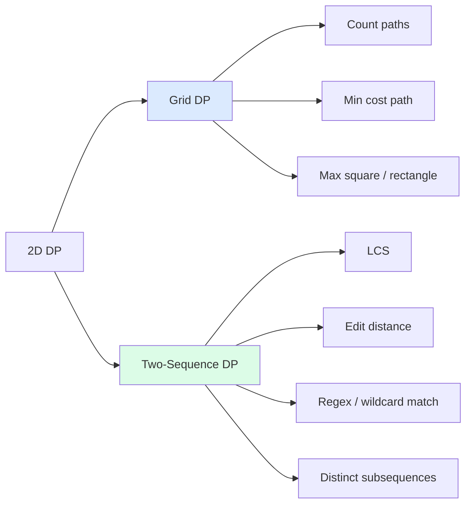
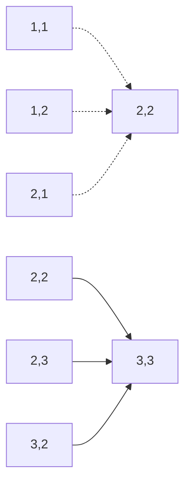

import { Callout } from 'fumadocs-ui/components/callout';

<Callout title="TL;DR — DP — 2D Grid / Two-Sequence">

**Use when**: the state requires *two* indices — either `(row, col)` of a grid, or `(i, j)` indexing into two different sequences.

**Trigger phrases**: "unique paths in a grid", "minimum path sum", "longest common subsequence", "edit distance", "interleaving strings", "regular expression matching", "distinct subsequences".

**The shape**: `dp[i][j] = f(dp[i-1][j], dp[i][j-1], dp[i-1][j-1], arr[i], arr[j])`.

**Two main flavors**:
- **Grid DP** — `dp[i][j]` over a 2D matrix; usually depends on neighbors above and left.
- **Two-Sequence DP** — `dp[i][j]` = answer for prefixes `s1[:i]` and `s2[:j]`; depends on shorter-prefix subproblems.

**Complexity**: O(m·n) time, O(m·n) or O(min(m,n)) space (with rolling).

</Callout>

---

## The problem that motivates this pattern

> **Unique Paths (LC 62).** A robot is at the top-left of an `m × n` grid. It can only move down or right. How many unique paths reach the bottom-right corner?
>
> Example: `m = 3, n = 7` → `28`.

Naive recursion: from `(0, 0)`, branch right or down at each cell. Count paths reaching `(m-1, n-1)`. Exponential — for a 10×10 grid, that's 2^20 = a million paths to check, and it grows fast.

Insight: paths reaching `(i, j)` are exactly **paths reaching `(i-1, j)` plus paths reaching `(i, j-1)`** — since you arrived from one of those two cells. So `dp[i][j] = dp[i-1][j] + dp[i][j-1]`. **Two-cell lookup, O(m·n) total.**

Base case: the entire top row and left column have exactly one path (you can only go straight).

```python
def unique_paths(m, n):
    dp = [[1] * n for _ in range(m)]
    for i in range(1, m):
        for j in range(1, n):
            dp[i][j] = dp[i-1][j] + dp[i][j-1]
    return dp[m-1][n-1]
```

**O(m·n) time, O(m·n) space** (and easy to reduce to O(n) with a rolling row).

This is the canonical 2D grid DP. The recurrence is one line; the work is in *naming the state correctly*.

The deeper insight: **2D DP is what powers most string-matching and grid-traversal algorithms in production** — edit distance (used in spell-check, diff, DNA alignment), LCS (used in git diff, bioinformatics), regex matching. Once you internalize the 2D-table-fill pattern, these problems are *the same problem* with different transitions.

---

## The core insight

**2D DP is when the state needs two indices. The table is a grid; each cell's value depends on a constant number of neighbors.**

The invariant we maintain:

> **By the time we compute `dp[i][j]`, every `dp[a][b]` for `a < i` or (`a == i` and `b < j`) has already been computed correctly.**

Filling order matters. Most 2D DPs fill row-by-row, left-to-right — which makes sure top, left, and top-left neighbors are ready before we compute the current cell.

Three things to identify in any 2D DP:

1. **State**: what does `dp[i][j]` *mean*? "Number of paths to (i,j)." "Min cost to reach (i,j)." "LCS of `s1[:i]` and `s2[:j]`." "Edit distance from `s1[:i]` to `s2[:j]`."
2. **Transition**: which `dp[a][b]` cells does `dp[i][j]` depend on? Usually `dp[i-1][j]`, `dp[i][j-1]`, and/or `dp[i-1][j-1]`.
3. **Base cases**: the first row and first column, or `dp[0][0]`.

### Two flavors



- **Grid DP**: state = `(row, col)` in a 2D matrix. Transition: neighbors in the matrix.
- **Two-Sequence DP**: state = `(i, j)` representing prefix lengths into two strings. Transition: based on whether `s1[i-1]` equals `s2[j-1]`.

Both have the same code shape — a doubly-nested loop and an `O(1)` transition per cell. The semantic interpretation differs.

---

## Visual walkthrough — Unique Paths on 3×3

Start:
```
dp =  [1, 1, 1]
      [1, ?, ?]
      [1, ?, ?]
```

Fill row 1:
- `dp[1][1] = dp[0][1] + dp[1][0] = 1 + 1 = 2`
- `dp[1][2] = dp[0][2] + dp[1][1] = 1 + 2 = 3`

Fill row 2:
- `dp[2][1] = dp[1][1] + dp[2][0] = 2 + 1 = 3`
- `dp[2][2] = dp[1][2] + dp[2][1] = 3 + 3 = 6`

```
Final dp:
      [1, 1, 1]
      [1, 2, 3]
      [1, 3, 6]

Answer: dp[2][2] = 6.
```



Each cell sums its top and left neighbors. The grid fills itself.

---

## Visual walkthrough — Longest Common Subsequence

`s1 = "ABCBDAB"`, `s2 = "BDCAB"`. LCS = `"BCAB"` (or `"BDAB"`), length 4.

We build a `(len(s1)+1) × (len(s2)+1)` table. `dp[i][j]` = LCS of `s1[:i]` and `s2[:j]`.

Recurrence:
- If `s1[i-1] == s2[j-1]`: `dp[i][j] = dp[i-1][j-1] + 1` (extend the LCS).
- Else: `dp[i][j] = max(dp[i-1][j], dp[i][j-1])` (take the better of skipping a char from either).

```
       ""  B  D  C  A  B
   ""   0  0  0  0  0  0
    A   0  0  0  0  1  1
    B   0  1  1  1  1  2
    C   0  1  1  2  2  2
    B   0  1  1  2  2  3
    D   0  1  2  2  2  3
    A   0  1  2  2  3  3
    B   0  1  2  2  3  4   ← dp[7][5] = 4
```

The bottom-right cell is the answer: **LCS = 4**.

The diagonal vs row/col distinction is what makes this beautiful: when characters match, you "go diagonal" (use both). When they don't, you "go up or left" (skip one char from one string).

---

## The template

### Template A — Grid DP

```python
def grid_dp(grid):
    m, n = len(grid), len(grid[0])
    dp = [[0] * n for _ in range(m)]
    dp[0][0] = grid[0][0]                            # base

    # First row and first column
    for j in range(1, n): dp[0][j] = combine(dp[0][j-1], grid[0][j])
    for i in range(1, m): dp[i][0] = combine(dp[i-1][0], grid[i][0])

    # Fill the rest
    for i in range(1, m):
        for j in range(1, n):
            dp[i][j] = best_of(dp[i-1][j], dp[i][j-1]) + cost(grid[i][j])

    return dp[m-1][n-1]
```

Space optimization: since each row only depends on the previous row, you can rolling-array down to O(n).

### Template B — Two-Sequence DP

```python
def two_seq_dp(s1, s2):
    m, n = len(s1), len(s2)
    dp = [[0] * (n + 1) for _ in range(m + 1)]

    # Base cases (typically dp[0][j] and dp[i][0])
    for j in range(n + 1): dp[0][j] = base_func(j)
    for i in range(m + 1): dp[i][0] = base_func(i)

    for i in range(1, m + 1):
        for j in range(1, n + 1):
            if s1[i-1] == s2[j-1]:
                dp[i][j] = match_transition(dp[i-1][j-1])
            else:
                dp[i][j] = mismatch_transition(dp[i-1][j], dp[i][j-1], dp[i-1][j-1])

    return dp[m][n]
```

**Three slots:**

1. **Base case (empty prefix)**: `dp[0][j]` and `dp[i][0]` — what's the answer when one string is empty?
2. **Match transition**: what do we do when `s1[i-1] == s2[j-1]`?
3. **Mismatch transition**: what do we do when they differ?

### Template C — Rolling array (O(min(m, n)) space)

```python
def lcs_rolling(s1, s2):
    if len(s1) < len(s2): s1, s2 = s2, s1            # ensure shorter is s2
    n = len(s2)
    prev = [0] * (n + 1)
    for c1 in s1:
        curr = [0] * (n + 1)
        for j, c2 in enumerate(s2, 1):
            if c1 == c2:
                curr[j] = prev[j-1] + 1
            else:
                curr[j] = max(prev[j], curr[j-1])
        prev = curr
    return prev[n]
```

Two arrays (`prev` and `curr`) instead of the full table. Critical for huge sequences where O(m·n) memory is too much.

---

## Worked example: Edit Distance (LC 72)

> **Problem.** Given two strings `word1` and `word2`, return the minimum number of operations (insert, delete, replace) to convert `word1` into `word2`.
>
> Example: `word1 = "horse"`, `word2 = "ros"` → `3` (horse → rorse → rose → ros).

**Why this is 2D DP.** State `(i, j)` represents "we've processed `word1[:i]` and produced `word2[:j]`." The answer at `(i, j)` depends on three smaller subproblems:
- Delete from `word1`: `dp[i-1][j] + 1`.
- Insert into `word1`: `dp[i][j-1] + 1`.
- Replace (or skip if characters match): `dp[i-1][j-1] + (0 if match else 1)`.

Take the min.

**The state**: `dp[i][j]` = min operations to transform `word1[:i]` into `word2[:j]`.

**Base cases**:
- `dp[0][j] = j` (need `j` insertions to build `word2[:j]` from empty).
- `dp[i][0] = i` (need `i` deletions to clear `word1[:i]`).

```python
def min_distance(word1: str, word2: str) -> int:
    m, n = len(word1), len(word2)
    dp = [[0] * (n + 1) for _ in range(m + 1)]

    # Base cases
    for i in range(m + 1): dp[i][0] = i
    for j in range(n + 1): dp[0][j] = j

    for i in range(1, m + 1):
        for j in range(1, n + 1):
            if word1[i-1] == word2[j-1]:
                dp[i][j] = dp[i-1][j-1]              # no op needed
            else:
                dp[i][j] = 1 + min(
                    dp[i-1][j],                       # delete from word1
                    dp[i][j-1],                       # insert into word1
                    dp[i-1][j-1]                      # replace
                )

    return dp[m][n]
```

**Dry-run on `word1 = "horse"`, `word2 = "ros"`:**

```
        ""  r   o   s
    ""   0  1   2   3
    h    1  1   2   3
    o    2  2   1   2
    r    3  2   2   2
    s    4  3   3   2
    e    5  4   4   3   ← dp[5][3] = 3
```

Reading off the path:
- `dp[5][3] = 3` (final answer).
- Came from `dp[4][3] + 1` (insert 'e'? actually from delete in this case — moves go down).
- Continue: it's 3 operations total.

**Answer: 3** ✓.

**Complexity.** O(m·n) time, O(m·n) space (reducible to O(min(m, n)) with rolling).

---

## Variants

### Variant 1 — Count Paths in a Grid

The Unique Paths shape. Sum predecessors.

**Canonical problems**: 62 Unique Paths (this page's intro), 63 Unique Paths II (with obstacles), 980 Unique Paths III (must visit every empty cell — needs backtracking, not pure DP).

### Variant 2 — Min/Max Path Cost in a Grid

Same recurrence shape, with `min` or `max` instead of `+`. Each cell adds its cost.

```python
# Minimum Path Sum (LC 64)
def min_path_sum(grid):
    m, n = len(grid), len(grid[0])
    for i in range(m):
        for j in range(n):
            if i == 0 and j == 0: continue
            top  = grid[i-1][j] if i > 0 else float('inf')
            left = grid[i][j-1] if j > 0 else float('inf')
            grid[i][j] += min(top, left)
    return grid[m-1][n-1]
```

**Canonical problems**: 64 Minimum Path Sum, 120 Triangle (1D variant within rows), 174 Dungeon Game (DP from bottom-right backward), 931 Minimum Falling Path Sum.

### Variant 3 — Longest Common Subsequence (LCS)

Two-sequence DP. The canonical "match → diagonal+1, else max of up/left."

**Canonical problems**: 1143 Longest Common Subsequence, 1035 Uncrossed Lines (LCS in disguise), 583 Delete Operation for Two Strings (m + n - 2·LCS), 712 Minimum ASCII Delete Sum.

### Variant 4 — Edit Distance

Three operations: insert, delete, replace. The most-studied 2D DP.

**Canonical problems**: 72 Edit Distance (this page's worked example), 583 Delete Operation, 161 One Edit Distance.

### Variant 5 — String Matching (Wildcards, Regex)

`dp[i][j]` = "does `p[:j]` match `s[:i]`?" Special handling for `*`, `.`, `?`.

```python
# Wildcard Matching (LC 44): ? matches any single char, * matches any sequence
def is_match(s, p):
    m, n = len(s), len(p)
    dp = [[False] * (n + 1) for _ in range(m + 1)]
    dp[0][0] = True
    for j in range(1, n + 1):
        if p[j-1] == '*': dp[0][j] = dp[0][j-1]

    for i in range(1, m + 1):
        for j in range(1, n + 1):
            if p[j-1] == '*':
                dp[i][j] = dp[i-1][j] or dp[i][j-1]
            elif p[j-1] == '?' or p[j-1] == s[i-1]:
                dp[i][j] = dp[i-1][j-1]
    return dp[m][n]
```

**Canonical problems**: 44 Wildcard Matching, 10 Regular Expression Matching (harder — `*` operates on the *previous character*), 97 Interleaving String, 115 Distinct Subsequences.

### Variant 6 — Maximum Square / Rectangle

`dp[i][j]` = side length of the largest all-1 square ending at `(i, j)`.

```python
# Maximal Square (LC 221)
def maximal_square(matrix):
    m, n = len(matrix), len(matrix[0])
    dp = [[0] * n for _ in range(m)]
    best = 0
    for i in range(m):
        for j in range(n):
            if matrix[i][j] == '1':
                if i == 0 or j == 0:
                    dp[i][j] = 1
                else:
                    dp[i][j] = min(dp[i-1][j], dp[i][j-1], dp[i-1][j-1]) + 1
                best = max(best, dp[i][j])
    return best * best
```

The "min of three neighbors + 1" trick is elegant.

**Canonical problems**: 221 Maximal Square, 1277 Count Square Submatrices with All Ones, 85 Maximal Rectangle (per-row Largest Rectangle in Histogram).

### Variant 7 — Interleaving / Subsequence Counting

Track `dp[i][j]` = "can `s3` be formed by interleaving `s1[:i]` and `s2[:j]`?" or "count distinct ways."

**Canonical problems**: 97 Interleaving String, 115 Distinct Subsequences, 87 Scramble String.

### Variant 8 — Grid with Multiple Robots / Two Paths

`dp[i1][j1][i2][j2]` — 4D state for two simultaneous walkers. Often reduces to 3D by exploiting `i1 + j1 == i2 + j2` (synchronized steps).

```python
# Cherry Pickup (LC 741)
def cherry_pickup(grid):
    n = len(grid)
    # dp[i1][j1][i2] — j2 derived from i1+j1-i2 (sync step count)
    # ... (full implementation is intricate)
```

**Canonical problems**: 741 Cherry Pickup, 1463 Cherry Pickup II, 174 Dungeon Game (reverse direction).

---

## Common pitfalls

| Trap | Fix |
|------|-----|
| Forgetting to allocate `(m+1) × (n+1)` for two-sequence DP | The extra row/column handles empty-prefix base cases cleanly |
| Indexing off-by-one between string and DP table | `dp[i][j]` uses `s1[i-1]` and `s2[j-1]` (because `dp[0]` = empty prefix) |
| Wrong base cases | `dp[0][0]`, the first row, and the first column all need explicit values |
| Using `+= 1` when you should `+= 0` on match | Edit distance: on match, *no operation needed*; on mismatch, add 1 |
| Confusing LCS with "Longest Common Substring" | Substring is contiguous (`dp[i][j] = 0` on mismatch). Subsequence is not |
| Filling in wrong order | Each cell's predecessors must already be filled. Row-by-row, left-to-right works for most cases |
| O(m·n) memory when O(n) would do | If `dp[i][j]` only depends on `dp[i-1][*]` and `dp[i][j-1]`, roll down to 1D |
| Returning the wrong cell | LCS returns `dp[m][n]`. Some grid problems return `dp[m-1][n-1]`. Read carefully |
| Forgetting that `dp[i][j-1]` might not be set yet when rolling | If you use a 1D rolling array, be careful about overwriting cells you still need |
| Mistreating `*` in regex vs wildcard | LC 44 (wildcard) `*` = any sequence; LC 10 (regex) `*` = previous char repeated 0+ times |

---

## Complexity

**Time: O(m · n)** — every cell of the table is computed in O(1).

**Space: O(m · n)** for the full table. With rolling, O(min(m, n)).

For grids: m and n are the dimensions of the grid. For two-sequence: m and n are string lengths.

For 4D variants (Cherry Pickup), O(m · n²) or O(m² · n²) — these problems are at the limit of what 2D DP can handle.

---

## When NOT to use 2D DP

- **One dimension suffices.** If `dp[i]` works (state is a single index), don't add a second dimension. See [DP — Linear](/dsa/patterns/dp/linear).
- **State is a subset.** If you need to track "which subset of items has been used," that's [Bitmask DP](/dsa/patterns/dp/bitmask), not 2D.
- **No overlapping subproblems.** If `dp[i][j]` is only computed once and never reused, plain recursion or backtracking is fine.
- **Greedy works.** "Min cost to reach (m, n) where you can only move right or down" might have a greedy answer if costs are monotonic.
- **The grid is small enough for exhaustive search.** A 3×3 grid? Just enumerate.
- **You need to enumerate solutions, not count/optimize.** Use [Backtracking](/dsa/patterns/recursion/backtracking).

### Decision rule

| Symptom | Likely pattern |
|---------|---------------|
| "Number of paths in a grid" | **Grid DP** |
| "Min/max cost path in a grid" | **Grid DP** |
| "LCS / common subsequence" | **Two-Sequence DP** |
| "Edit distance" | **Two-Sequence DP** |
| "Regex / wildcard match" | **Two-Sequence DP** |
| "Maximal square / rectangle in 0/1 matrix" | **Grid DP** (or [Monotonic Stack](/dsa/patterns/stacks-queues/monotonic-stack) for max rectangle) |
| "Interleaving two strings" | **Two-Sequence DP** |
| "Take or leave with limited capacity" | [Knapsack DP](/dsa/patterns/dp/knapsack) |
| "On a tree" | [Tree DP](/dsa/patterns/dp/tree-dp) |
| "Pick which subset" | [Bitmask DP](/dsa/patterns/dp/bitmask) |

---

## Real-world applications

- **Spell checkers.** Edit distance powers "did you mean?" suggestions in every search engine and text editor.
- **DNA / protein sequence alignment.** Bioinformatics (Needleman-Wunsch, Smith-Waterman) is *exactly* edit distance with custom scoring.
- **Diff tools.** `git diff`, `diff -u`, file comparison — all built on LCS.
- **Version control merges.** Three-way merge algorithms rely on LCS-flavored DP.
- **Speech recognition.** Dynamic time warping aligns audio sequences — 2D DP with stretching.
- **Natural language processing.** Word alignment in machine translation.
- **Optical character recognition (OCR).** Matching scanned characters to dictionaries via edit-distance variants.
- **Data quality / fuzzy join.** Detecting "John Smith" vs "Jon Smyth" as the same person.
- **Plagiarism detection.** Text similarity via LCS / edit-distance.

---

## Curated practice problems

| # | Problem | Difficulty | Variant | Note |
|---|---------|-----------|---------|------|
| 1 | ★ 62 Unique Paths | Medium | Grid count | This page's intro |
| 2 | 63 Unique Paths II | Medium | + obstacles | Skip obstacle cells |
| 3 | ★ 64 Minimum Path Sum | Medium | Grid min | Add costs as you fill |
| 4 | 120 Triangle | Medium | Grid-like | Top-down or bottom-up |
| 5 | 174 Dungeon Game | Hard | Grid backward | Fill from end |
| 6 | 931 Minimum Falling Path Sum | Medium | Grid with 3 predecessors | Top-left, top, top-right |
| 7 | ★ 1143 Longest Common Subsequence | Medium | LCS | The canonical two-sequence |
| 8 | 583 Delete Operation for Two Strings | Medium | LCS-derived | m + n − 2·LCS |
| 9 | 1035 Uncrossed Lines | Medium | LCS in disguise | Same algorithm |
| 10 | ★ 72 Edit Distance | Hard | Three operations | This page's worked example |
| 11 | 161 One Edit Distance | Medium | Edit distance ≤ 1 | Greedy O(n) check |
| 12 | ★ 221 Maximal Square | Medium | Min of three neighbors + 1 | Track running max |
| 13 | 85 Maximal Rectangle | Hard | Per-row histogram | LRH per row |
| 14 | 1277 Count Square Submatrices | Medium | Sum of all square counts | Same DP, sum it |
| 15 | 44 Wildcard Matching | Hard | DP with `?` and `*` | `*` matches any sequence |
| 16 | 10 Regular Expression Matching | Hard | DP with `.` and `*` | `*` repeats previous char |
| 17 | 97 Interleaving String | Medium | Two-pointer DP | dp[i][j] = "can interleave s1[:i] and s2[:j]" |
| 18 | 115 Distinct Subsequences | Hard | Count occurrences | dp[i][j] = "ways s[:i] forms t[:j]" |
| 19 | 741 Cherry Pickup | Hard | 4D → 3D state | Two walkers, synchronized |
| 20 | 87 Scramble String | Hard | Recursive 2D | Memoized recursion |

---

## Related patterns

- [DP — Linear](/dsa/patterns/dp/linear) — 1D version; if state is a single index, use that
- [DP — Knapsack](/dsa/patterns/dp/knapsack) — state is `(item, capacity)` — also 2D but with a specific structure
- [DP — Intervals](/dsa/patterns/dp/intervals) — state is `(i, j)` as an interval, processed by length
- [Monotonic Stack](/dsa/patterns/stacks-queues/monotonic-stack) — alternative for Maximal Rectangle
- [Backtracking](/dsa/patterns/recursion/backtracking) — when you need to enumerate paths

---

## Quick-reference card

```python
# Grid DP (with O(n) rolling)
prev = [grid[0][0]] + [...]                          # first row
for i in range(1, m):
    curr = [grid[i][0] + prev[0]]                    # first column
    for j in range(1, n):
        curr.append(grid[i][j] + best(prev[j], curr[j-1]))
    prev = curr
return prev[n-1]

# Two-Sequence DP (LCS template)
dp = [[0] * (n + 1) for _ in range(m + 1)]
for i in range(1, m + 1):
    for j in range(1, n + 1):
        if s1[i-1] == s2[j-1]:
            dp[i][j] = dp[i-1][j-1] + 1              # match → diagonal+1
        else:
            dp[i][j] = max(dp[i-1][j], dp[i][j-1])   # max of up, left
return dp[m][n]

# Edit Distance
for i in range(1, m + 1):
    for j in range(1, n + 1):
        if word1[i-1] == word2[j-1]:
            dp[i][j] = dp[i-1][j-1]
        else:
            dp[i][j] = 1 + min(dp[i-1][j], dp[i][j-1], dp[i-1][j-1])
```

Triggers: "grid paths", "LCS", "edit distance", "interleaving", "maximal square". Complexity: O(m · n).
