import { Cards, Card } from 'fumadocs-ui/components/card';

DP isn't one technique — it's a family of techniques sharing a single insight: **overlapping subproblems + optimal substructure → memoize.** Splitting DP by *state shape* (1D? 2D? on a tree? on a bitmask?) makes it teachable. Lump them together and DP is mysticism.

Six pages, in roughly the order you should learn them:

<Cards>
  <Card title="DP — Linear / 1D" href="/dsa/patterns/dp/linear" description="dp[i] from constant previous indices. Climbing Stairs, House Robber, LIS, Decode Ways." />
  <Card title="DP — 2D Grid / Two-Sequence" href="/dsa/patterns/dp/grid-2d" description="dp[i][j] over a matrix or pair of sequences. LCS, edit distance, min path sum." />
  <Card title="DP — Knapsack Family" href="/dsa/patterns/dp/knapsack" description="0/1, unbounded, subset-sum, coin change, partition equal subsets." />
  <Card title="DP — Intervals / Partition / MCM" href="/dsa/patterns/dp/intervals" description="dp[i][j] by trying every split k. Burst balloons, palindrome partitioning." />
  <Card title="DP — Tree DP" href="/dsa/patterns/dp/tree-dp" description="Post-order DP where child results compose into parent. Diameter, house robber III." />
  <Card title="DP — Bitmask" href="/dsa/patterns/dp/bitmask" description="Use bits as set-of-used. dp[mask] over 2^n states. TSP, assignment." />
</Cards>

---

## How to think about a DP problem

```mermaid
flowchart TD
    A[See a problem] --> B{Optimal substructure?}
    B -->|No| Z[Not DP — try greedy or brute force]
    B -->|Yes| C{Overlapping subproblems?}
    C -->|No| Z2[Probably divide & conquer]
    C -->|Yes| D[It's DP]
    D --> E{What's the state?}

    E -->|1 index over an array| L[Linear DP]
    E -->|2 indices, matrix or 2 sequences| G[Grid / Two-Seq DP]
    E -->|Items + capacity| K[Knapsack family]
    E -->|Interval i..j, split k| I[Interval DP]
    E -->|Subtree result| T[Tree DP]
    E -->|Subset of n items, n<=20| BM[Bitmask DP]

    style L fill:#dbeafe
    style G fill:#dbeafe
    style K fill:#dcfce7
    style I fill:#fef3c7
    style T fill:#fce7f3
    style BM fill:#ede9fe
```

The state shape is the question. Once you know the state shape, the transition usually writes itself.
