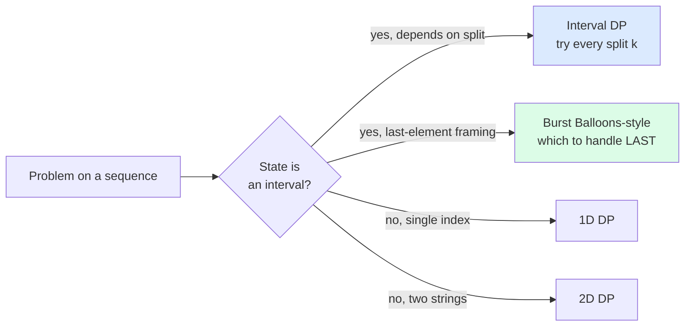

import { Callout } from 'fumadocs-ui/components/callout';

<Callout title="TL;DR — DP — Intervals">

**Use when**: the state is an *interval* `[i, j]` of an array or string, and the answer involves choosing a *split point* `k` between `i` and `j` to partition the problem.

**Trigger phrases**: "burst balloons", "matrix chain multiplication", "min/max cost to merge", "palindrome partitioning II", "scramble string", "stone game", "minimum cost tree from leaf values".

**The shape**: `dp[i][j] = min/max over k of (dp[i][k] + dp[k+1][j] + cost(i, k, j))`.

**The trick**: fill the table by **interval length**, not by `(i, j)` directly. Smaller intervals computed before larger ones.

**Complexity**: O(n³) typical — n² states × n splits per state.

</Callout>

---

## The problem that motivates this pattern

> **Matrix Chain Multiplication.** Given dimensions of `n` matrices in sequence, find the minimum number of scalar multiplications to compute their product. Matrix `M_i` has dimensions `dims[i] × dims[i+1]`.
>
> Example: matrices `M_1 (10×20)`, `M_2 (20×30)`, `M_3 (30×40)`, `M_4 (40×30)` → dims `[10, 20, 30, 40, 30]`. The cost depends on the order of multiplication; we want the cheapest.

Multiplying `M_1 × M_2 × M_3 × M_4` can be parenthesized in many ways:
- `((M_1 × M_2) × M_3) × M_4` → costs `10·20·30 + 10·30·40 + 10·40·30 = 6000 + 12000 + 12000 = 30000`.
- `M_1 × ((M_2 × M_3) × M_4)` → costs `20·30·40 + 20·40·30 + 10·20·30 = 24000 + 24000 + 6000 = 54000`.

The order matters a lot. The optimal parenthesization for 4 matrices isn't obvious.

The DP insight: **to compute the optimal cost over interval `[i..j]`, try every split point `k`**. The cost is `dp[i][k] + dp[k+1][j] + cost_of_merging_at_k`. The split point `k` divides the chain into two halves; the optimal way to combine each half is already solved.

```python
def matrix_chain_order(dims):
    n = len(dims) - 1                                # number of matrices
    dp = [[0] * n for _ in range(n)]

    for length in range(2, n + 1):                   # interval length
        for i in range(n - length + 1):
            j = i + length - 1
            dp[i][j] = float('inf')
            for k in range(i, j):                    # try every split
                cost = dp[i][k] + dp[k+1][j] + dims[i] * dims[k+1] * dims[j+1]
                dp[i][j] = min(dp[i][j], cost)

    return dp[0][n-1]
```

O(n³) total — n² intervals × n splits each.

The deeper insight: **interval DP is for problems where the "natural" recursion is "pick a split point and recurse on both halves"**. The order of operations *within* the interval is what we're optimizing. This shape appears in surprising places — burst balloons (which to burst LAST in an interval), palindrome partitioning II (where to cut), stone games (which stones to take).

---

## The core insight

**Interval DP is when state is `(i, j)` meaning "the problem restricted to subarray/substring i..j." Transitions try every split point k in i..j.**

The invariant we maintain:

> **By the time we compute `dp[i][j]`, every `dp[a][b]` with `b - a < j - i` has already been computed.**

That's why we iterate by **interval length** in the outer loop. Smaller intervals first → larger intervals depend on already-solved smaller ones.

Three things to identify:

1. **State**: what does `dp[i][j]` mean? "Min cost to merge stones i..j into one pile." "Max coins from bursting balloons in interval i..j." "Min cuts to partition s[i..j] into palindromes."
2. **Split point k**: at which index do we partition? Usually `k` is chosen from `[i, j-1]` (the boundary between two halves) or it represents *which element to handle last* in the interval.
3. **Cost of merging at k**: what's the cost added when combining the two halves?

### The "what happens last" perspective

For some interval DPs (especially Burst Balloons), the right framing isn't "where to split" but **"which element is processed LAST"**. The element processed last is the one that determines the cost between the two halves.

For Burst Balloons:
- Brute-force thinking: which to burst *first*? Bad — the coins from bursting balloon `i` depend on its current neighbors, which change as we burst.
- DP thinking: which to burst *last*? Genius — when balloon `k` is last in interval `[i, j]`, its left neighbor is `nums[i-1]` and right is `nums[j+1]` (the *boundaries*, which don't change). The coins from `k` are `nums[i-1] · nums[k] · nums[j+1]`.

This perspective shift is what makes interval DP unintuitive but powerful.



---

## Visual walkthrough — Matrix Chain Multiplication

`dims = [10, 20, 30, 40, 30]` (4 matrices: 10×20, 20×30, 30×40, 40×30).

Fill table by interval length.

**Length 1**: `dp[i][i] = 0` (single matrix has zero multiplications).
```
dp = [0, 0, 0, 0]
       0  0  0
          0  0
             0
```

**Length 2** (pairs):
- `dp[0][1] = dims[0] · dims[1] · dims[2] = 10·20·30 = 6000`.
- `dp[1][2] = dims[1] · dims[2] · dims[3] = 20·30·40 = 24000`.
- `dp[2][3] = dims[2] · dims[3] · dims[4] = 30·40·30 = 36000`.

**Length 3** (try each split):
- `dp[0][2]`:
  - k=0: `dp[0][0] + dp[1][2] + dims[0]·dims[1]·dims[3] = 0 + 24000 + 8000 = 32000`.
  - k=1: `dp[0][1] + dp[2][2] + dims[0]·dims[2]·dims[3] = 6000 + 0 + 12000 = 18000`. ✓
  - `dp[0][2] = 18000`.
- `dp[1][3]`:
  - k=1: `dp[1][1] + dp[2][3] + dims[1]·dims[2]·dims[4] = 0 + 36000 + 18000 = 54000`.
  - k=2: `dp[1][2] + dp[3][3] + dims[1]·dims[3]·dims[4] = 24000 + 0 + 24000 = 48000`. ✓
  - `dp[1][3] = 48000`.

**Length 4** (the full chain):
- `dp[0][3]`:
  - k=0: `0 + 48000 + dims[0]·dims[1]·dims[4] = 48000 + 6000 = 54000`.
  - k=1: `6000 + 36000 + dims[0]·dims[2]·dims[4] = 6000 + 36000 + 9000 = 51000`.
  - k=2: `18000 + 0 + dims[0]·dims[3]·dims[4] = 18000 + 12000 = 30000`. ✓
  - `dp[0][3] = 30000`.

**Answer: 30000** — multiply `(M_1 × M_2 × M_3)` first, then `× M_4`. That matches our earlier hand-calculation.

---

## The template

### Template A — Interval DP, length-by-length

```python
def interval_dp(arr):
    n = len(arr)
    dp = [[0] * n for _ in range(n)]

    # Base case: length-1 intervals (or whatever the problem says)
    for i in range(n):
        dp[i][i] = base_case(arr[i])

    # Build by interval length
    for length in range(2, n + 1):
        for i in range(n - length + 1):
            j = i + length - 1
            dp[i][j] = initial_value()                # often inf or -inf
            for k in range(i, j):                     # split at k
                cost = dp[i][k] + dp[k+1][j] + merge_cost(i, k, j)
                dp[i][j] = best(dp[i][j], cost)

    return dp[0][n-1]
```

**Three slots:**

1. **Base case** — `dp[i][i]`.
2. **Merge cost** — `merge_cost(i, k, j)` is what the problem charges (or rewards) for combining `[i..k]` and `[k+1..j]`.
3. **Best operator** — `min` or `max`.

### Template B — "Which is LAST" interval DP (Burst Balloons)

```python
def burst_balloons(nums):
    # Pad with 1s at both ends (virtual neighbors)
    nums = [1] + nums + [1]
    n = len(nums)
    dp = [[0] * n for _ in range(n)]

    # length: distance between i and j (i.e., j - i)
    for length in range(2, n):                       # length is at least 2 (one balloon between)
        for i in range(n - length):
            j = i + length
            # try each k in (i, j) as the LAST balloon to burst
            for k in range(i + 1, j):
                # bursting k last means its neighbors are nums[i] and nums[j]
                coins = nums[i] * nums[k] * nums[j]
                dp[i][j] = max(dp[i][j], dp[i][k] + dp[k][j] + coins)

    return dp[0][n-1]
```

The padding with `1`s simulates the "no balloon to the left/right" case mentioned in the spec.

### Template C — Memoized recursion (when bottom-up is awkward)

```python
from functools import cache

def solve(arr):
    @cache
    def helper(i, j):
        if i >= j: return 0                          # or whatever base case
        best = float('inf')
        for k in range(i, j):
            best = min(best, helper(i, k) + helper(k+1, j) + cost(i, k, j))
        return best
    return helper(0, len(arr) - 1)
```

`@cache` handles memoization automatically. Sometimes the top-down version makes the state and transition clearer.

---

## Worked example: Burst Balloons (LC 312)

> **Problem.** `n` balloons indexed `0` to `n-1`. Each balloon has a number on it (`nums[i]`). When you burst balloon `i`, you earn `nums[i-1] * nums[i] * nums[i+1]` coins. After bursting, `i-1` and `i+1` become adjacent. Return the maximum coins you can earn.
>
> Example: `nums = [3, 1, 5, 8]` → `167`. (Best order: burst 1, 5, 3, 8 → coins `3·1·5 + 3·5·8 + 1·3·8 + 1·8·1 = 15 + 120 + 24 + 8 = 167`.)

**Why this is interval DP — and why "which is last" matters.** If you tried "which balloon to burst *first*?", you'd have to track which balloons remain — exponential state. The brilliant reframe: **fix `k` as the LAST balloon to burst in interval `[i, j]`**. Then balloon `k`'s neighbors at burst time are the boundary balloons `nums[i-1]` and `nums[j+1]` — they never change during the recursion!

**The state**: `dp[i][j]` = max coins from bursting balloons strictly between `i` and `j` (exclusive boundaries).

**Pad with 1s**: `nums = [1] + nums + [1]`. Now balloon `i-1` and `j+1` always exist.

**Recurrence**: `dp[i][j] = max over k in (i, j) of dp[i][k] + dp[k][j] + nums[i] * nums[k] * nums[j]`.

```python
def max_coins(nums: list[int]) -> int:
    nums = [1] + nums + [1]
    n = len(nums)
    dp = [[0] * n for _ in range(n)]

    for length in range(2, n):                       # interval span (must enclose at least 1 balloon)
        for i in range(n - length):
            j = i + length
            for k in range(i + 1, j):
                coins = nums[i] * nums[k] * nums[j]
                dp[i][j] = max(dp[i][j], dp[i][k] + dp[k][j] + coins)

    return dp[0][n-1]
```

**Dry-run on `nums = [3, 1, 5, 8]` (padded to `[1, 3, 1, 5, 8, 1]`, n=6):**

Length 2 (one balloon between):
- dp[0][2]: only k=1. coins = 1·3·1 = 3. dp[0][2] = 3.
- dp[1][3]: only k=2. coins = 3·1·5 = 15. dp[1][3] = 15.
- dp[2][4]: only k=3. coins = 1·5·8 = 40. dp[2][4] = 40.
- dp[3][5]: only k=4. coins = 5·8·1 = 40. dp[3][5] = 40.

Length 3 (two balloons between):
- dp[0][3]: k=1 (coins 1·3·5=15, +dp[1][3]=15) → 30. k=2 (1·1·5=5, +dp[0][2]=3+0) → 8. Max=30.
- dp[1][4]: k=2 (3·1·8=24, +dp[2][4]=40) → 64. k=3 (3·5·8=120, +dp[1][3]=15) → 135. Max=135.
- dp[2][5]: k=3 (1·5·1=5, +dp[3][5]=40) → 45. k=4 (1·8·1=8, +dp[2][4]=40) → 48. Max=48.

Length 4:
- dp[0][4]: k=1 (1·3·8=24, +0+dp[1][4]=135) → 159. k=2 (1·1·8=8, +dp[0][2]=3+dp[2][4]=40) → 51. k=3 (1·5·8=40, +dp[0][3]=30+0) → 70. Max=159.
- dp[1][5]: k=2 (3·1·1=3, +0+dp[2][5]=48) → 51. k=3 (3·5·1=15, +dp[1][3]=15+dp[3][5]=40) → 70. k=4 (3·8·1=24, +dp[1][4]=135+0) → 159. Max=159.

Length 5 (full):
- dp[0][5]: k=1 (1·3·1=3, +0+dp[1][5]=159) → 162. k=2 (1·1·1=1, +dp[0][2]=3+dp[2][5]=48) → 52. k=3 (1·5·1=5, +dp[0][3]=30+dp[3][5]=40) → 75. k=4 (1·8·1=8, +dp[0][4]=159+0) → 167. **Max=167** ✓.

**Answer: 167** ✓.

**Complexity.** O(n³) time, O(n²) space.

The "which is last" framing is the *single insight* that makes this problem solvable. Without it, you'd try bursting orderings — exponential.

---

## Variants

### Variant 1 — Matrix Chain Multiplication

The canonical. Try every split.

**Canonical problems**: not directly on LC, but underlies 1039 Minimum Score Triangulation of Polygon (same shape).

### Variant 2 — Burst Balloons-style (which is LAST)

When the "obvious" framing (which first) gives a state-explosion problem. Pad boundaries.

**Canonical problems**: 312 Burst Balloons (this page's worked example), 546 Remove Boxes (harder — also tracks "how many same-color in a row before this segment").

### Variant 3 — Palindrome Partitioning II (Min Cuts)

`dp[i]` = min cuts for prefix `s[:i]`. Use a precomputed `is_palindrome[i][j]` table (also an interval DP).

```python
def min_cut(s):
    n = len(s)
    # is_palin[i][j] = "is s[i..j] a palindrome?"
    is_palin = [[False] * n for _ in range(n)]
    for i in range(n): is_palin[i][i] = True
    for length in range(2, n + 1):
        for i in range(n - length + 1):
            j = i + length - 1
            if s[i] == s[j] and (length == 2 or is_palin[i+1][j-1]):
                is_palin[i][j] = True

    # dp[i] = min cuts for s[0..i]
    dp = [0] * n
    for i in range(n):
        if is_palin[0][i]: dp[i] = 0
        else:
            dp[i] = i                                  # worst case: cut every char
            for j in range(1, i + 1):
                if is_palin[j][i]:
                    dp[i] = min(dp[i], dp[j-1] + 1)
    return dp[n-1]
```

**Canonical problems**: 132 Palindrome Partitioning II, 5 Longest Palindromic Substring (interval DP for `is_palin`), 1278 Palindrome Partitioning III.

### Variant 4 — Min Cost to Merge / Stone Game

Each merge combines two adjacent groups. The cost depends on the merge.

```python
# Min Cost to Merge Stones (LC 1000) — k-way merge
# Each turn merges k consecutive piles into 1.
# dp[i][j][p] = min cost to merge piles i..j into p piles.
```

**Canonical problems**: 1000 Minimum Cost to Merge Stones, 877 Stone Game, 1690 Stone Game VII.

### Variant 5 — Triangulation / MCM-like

Polygon triangulation: pick one edge, then triangulate the two sub-polygons.

**Canonical problems**: 1039 Minimum Score Triangulation of Polygon — direct MCM.

### Variant 6 — Boolean Parenthesization

Count the number of ways to parenthesize a boolean expression to evaluate to true.

```python
def count_ways(symbols, operators):
    n = len(symbols)
    # T[i][j] = number of ways s[i..j] evaluates to True
    # F[i][j] = number of ways s[i..j] evaluates to False
    T = [[0] * n for _ in range(n)]
    F = [[0] * n for _ in range(n)]
    for i in range(n):
        T[i][i] = 1 if symbols[i] == 'T' else 0
        F[i][i] = 1 if symbols[i] == 'F' else 0
    for length in range(2, n + 1):
        for i in range(n - length + 1):
            j = i + length - 1
            for k in range(i, j):
                op = operators[k]
                # Compose T[i][j] and F[i][j] based on T[i][k], F[i][k], T[k+1][j], F[k+1][j]
                # ... (depends on op: &, |, ^)
```

**Canonical problems**: GeeksforGeeks "Boolean Parenthesization Problem", 1130 Minimum Cost Tree From Leaf Values (related shape).

---

## Common pitfalls

| Trap | Fix |
|------|-----|
| Iterating by `(i, j)` directly instead of by length | The recurrence depends on smaller intervals. Iterate by length first |
| For Burst Balloons, trying "which first" framing | Doesn't decompose. Try "which LAST" instead |
| Forgetting to pad with sentinels (Burst Balloons) | Without `[1] + nums + [1]`, boundary balloons cause off-by-one errors |
| Confusing `dp[i][k] + dp[k+1][j]` (split at k) with `dp[i][k] + dp[k][j]` (k itself isolated) | Read the problem. MCM splits at k (k+1 starts the next half). Burst Balloons isolates k (so both halves go to k itself) |
| Off-by-one on length range | For "split at k": length goes 2..n. For "isolate k": length goes 2..n-1 (need room on both sides) |
| Using O(n²) space when memoized recursion is cleaner | `@cache` on a recursive helper is sometimes more readable |
| Initializing `dp[i][i]` to wrong base | `dp[i][i] = 0` is common; sometimes it's a specific cost from the problem |
| Forgetting the answer's location | Usually `dp[0][n-1]`. For Burst Balloons with padding, `dp[0][n-1]` of the *padded* array |
| Confusing interval DP with knapsack | Knapsack: `(items, capacity)`. Interval: `(left, right)`. Different state shapes |
| Using O(n³) when better algorithms exist | For specific subproblems (e.g., LCS), 2D DP is enough. Interval DP is overkill |

---

## Complexity

**Time: O(n³)** — n² intervals × n splits per interval. This is the *worst* common DP complexity (after O(n²)) but still polynomial.

**Space: O(n²)** for the DP table. For specific problems (Min Cut, Longest Palindromic Substring), you can sometimes reduce to O(n) but the trick depends on the problem.

**Cubic time is the bound to expect**. For `n = 200`, that's 8 million operations — fast. For `n = 1000`, that's 10⁹ — at the edge. For `n = 10000`, infeasible.

If your interval DP has *additional* state (e.g., Remove Boxes has a third dimension), complexity rises to O(n⁴) or O(n³ · k).

---

## When NOT to use interval DP

- **The state is a single index.** Use [1D DP](/dsa/patterns/dp/linear).
- **The state is `(item, capacity)`.** Use [Knapsack DP](/dsa/patterns/dp/knapsack).
- **Two indices but they're from different sequences.** Use [2D Grid / Two-Sequence DP](/dsa/patterns/dp/grid-2d).
- **n is too large** (`n > 1000`). O(n³) won't fit. Look for clever structure (Knuth's optimization, divide-and-conquer DP optimization) or a different algorithm.
- **The problem is fundamentally greedy.** Some "partition" problems are solvable greedily.
- **The answer doesn't depend on split points.** If the partition is unique (or doesn't matter), DP isn't needed.

### Decision rule

| Symptom | Likely pattern |
|---------|---------------|
| "Min/max cost to merge / parenthesize" | **Interval DP** (MCM-style) |
| "Burst balloons / remove boxes" | **Interval DP** ("which is last") |
| "Palindrome partitioning II (min cuts)" | **Interval DP** (precompute is_palin) |
| "Longest palindromic substring" | **Interval DP** for is_palin, then max |
| "Stone game / merge stones" | **Interval DP** |
| "Polygon triangulation" | **Interval DP** (MCM-shape) |
| "Boolean parenthesization" | **Interval DP** (two tables: T, F) |
| "Partition into k groups" | **Knapsack** or **Bitmask DP** (not interval) |
| "Two-sequence problem" | **2D DP** (not interval) |

---

## Real-world applications

- **Compiler optimization.** Optimal expression evaluation order, common subexpression elimination — interval DP shapes.
- **Database query optimization.** Order of joins (left-deep vs bushy trees) — analogous to matrix chain.
- **Parsing / syntax analysis.** CYK algorithm for context-free grammars is interval DP.
- **Bioinformatics — RNA secondary structure.** The classic Nussinov algorithm for predicting RNA folds is interval DP.
- **Game theory / minimax over intervals.** Some adversarial games have interval-DP solutions.
- **Image segmentation.** Some pixel-grouping algorithms use interval DP on 1D scanlines.
- **Optimal coding (Huffman-like).** Some optimal-merge problems are interval DP.

---

## Curated practice problems

| # | Problem | Difficulty | Variant | Note |
|---|---------|-----------|---------|------|
| 1 | ★ 312 Burst Balloons | Hard | "Which is last" | This page's worked example |
| 2 | ★ 1039 Min Score Triangulation | Medium | MCM | Try every diagonal triangle |
| 3 | 1547 Minimum Cost to Cut a Stick | Hard | MCM-like | Pad with 0 and n at boundaries |
| 4 | 1000 Min Cost to Merge Stones | Hard | k-way merge | 3D state: dp[i][j][p] |
| 5 | ★ 132 Palindrome Partitioning II | Hard | Min cuts | Precompute is_palindrome |
| 6 | 5 Longest Palindromic Substring | Medium | is_palindrome table | Or expand-around-center |
| 7 | 647 Palindromic Substrings | Medium | Same is_palindrome | Count instead of length |
| 8 | 516 Longest Palindromic Subsequence | Medium | Two-Sequence-like | dp[i][j] = LPS of s[i..j] |
| 9 | 877 Stone Game | Medium | Game theory + interval | dp[i][j] = max diff achievable |
| 10 | 486 Predict the Winner | Medium | Stone Game variant | Same algorithm |
| 11 | 546 Remove Boxes | Hard | Interval + extra state | 3D state: dp[i][j][k] |
| 12 | 1130 Minimum Cost Tree From Leaf Values | Medium | MCM-shape | Or monotonic stack O(n) |
| 13 | 87 Scramble String | Hard | Memoized recursion | (s1, s2) state, split point |
| 14 | 1255 Maximum Score Words | Hard | Backtracking + interval scoring | Subset-flavored |

---

## Related patterns

- [DP — 2D Grid / Two-Sequence](/dsa/patterns/dp/grid-2d) — different 2D shape; intervals are 2D too but with a different recurrence
- [DP — Linear](/dsa/patterns/dp/linear) — when state is single index
- [DP — Knapsack](/dsa/patterns/dp/knapsack) — different 2D structure
- [Monotonic Stack](/dsa/patterns/stacks-queues/monotonic-stack) — sometimes solves Min Cost Tree From Leaf Values in O(n)
- [Backtracking](/dsa/patterns/recursion/backtracking) — when you need to enumerate parenthesizations, not optimize

---

## Quick-reference card

```python
# Interval DP template (iterate by length)
n = len(arr)
dp = [[0] * n for _ in range(n)]
# base case: dp[i][i]
for length in range(2, n + 1):
    for i in range(n - length + 1):
        j = i + length - 1
        dp[i][j] = initial                            # inf or -inf
        for k in range(i, j):
            dp[i][j] = best(dp[i][j], dp[i][k] + dp[k+1][j] + cost(i, k, j))
return dp[0][n-1]

# Burst Balloons (which is LAST)
nums = [1] + nums + [1]; n = len(nums)
dp = [[0] * n for _ in range(n)]
for length in range(2, n):
    for i in range(n - length):
        j = i + length
        for k in range(i + 1, j):
            dp[i][j] = max(dp[i][j], dp[i][k] + dp[k][j] + nums[i]*nums[k]*nums[j])

# Palindrome partitioning min cuts
is_palin = [[True] * n for _ in range(n)]
for length in range(2, n + 1):
    for i in range(n - length + 1):
        j = i + length - 1
        is_palin[i][j] = s[i] == s[j] and (length == 2 or is_palin[i+1][j-1])
```

Triggers: "burst balloons", "merge stones", "matrix chain", "palindrome partitioning II", "stone game". Complexity: O(n³).
