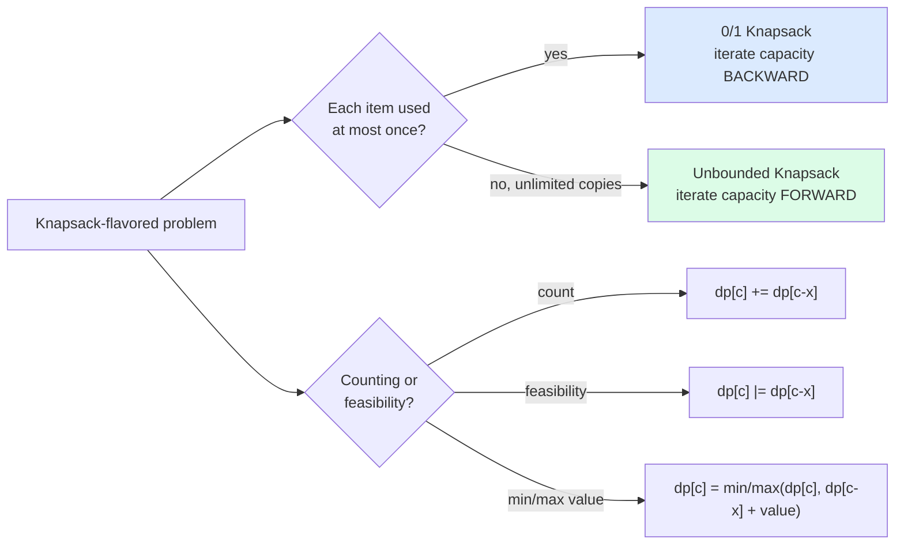

import { Callout } from 'fumadocs-ui/components/callout';

<Callout title="TL;DR — DP — Knapsack Family">

**Use when**: you have a set of "items" and a numeric "capacity" (or target). Decide whether to take each item (or how many copies) to optimize value, count combinations, or check feasibility.

**Trigger phrases**: "can we make target sum X", "min coins to make amount", "partition into equal subsets", "knapsack", "number of ways to reach sum", "target sum with +/-".

**Two flavors**:
- **0/1 knapsack** — each item can be taken at most once.
- **Unbounded knapsack** — each item can be taken any number of times.

**The key state**: `dp[i][c]` = best value using first `i` items with remaining capacity `c`. Often reducible to 1D via careful iteration order.

**Complexity**: O(n · C) time, O(n · C) or O(C) space (with rolling). C = capacity / target sum.

</Callout>

---

## The problem that motivates this pattern

> **Partition Equal Subset Sum (LC 416).** Given a non-empty array of positive integers, return `True` if you can partition it into two subsets with equal sum.
>
> Example: `nums = [1, 5, 11, 5]` → `True` (subsets `[1, 5, 5]` and `[11]`).

If the total sum is odd, impossible. Otherwise, we need a subset summing to `total / 2`. That's "**Subset Sum**" — exactly the 0/1 knapsack feasibility problem.

Brute force: try every subset, 2^n options. For n = 20, that's a million; for n = 30, a billion. Doesn't scale.

DP insight: `dp[i][c]` = "can the first `i` items form a subset summing to `c`?"

Recurrence:
- **Don't take item `i`**: `dp[i-1][c]`.
- **Take item `i`** (if it fits): `dp[i-1][c - nums[i-1]]`.

Combine with `or`. Answer is `dp[n][target]`.

```python
def can_partition(nums):
    total = sum(nums)
    if total % 2 == 1: return False
    target = total // 2

    n = len(nums)
    # 1D rolling: dp[c] = "can we make sum c using items seen so far?"
    dp = [False] * (target + 1)
    dp[0] = True                                      # always make 0 (empty subset)

    for x in nums:
        # Iterate capacity in REVERSE for 0/1 knapsack
        for c in range(target, x - 1, -1):
            dp[c] = dp[c] or dp[c - x]

    return dp[target]
```

O(n · target) time, O(target) space. For `n = 200, target = 10000`, that's 2M operations — fast.

The deeper insight: **the knapsack family is the canonical "take or don't take" DP**. Once you internalize the recurrence and the iteration-order trick, you can solve subset sum, coin change, partition, target sum — all variations on the same template.

---

## The core insight

**Knapsack DP is `(item, capacity)`-state DP. The recurrence is "include this item or skip it." The iteration order distinguishes 0/1 from unbounded.**

The invariant we maintain:

> **By the time we compute `dp[i][c]`, we've correctly computed every state involving the first `i-1` items (for 0/1) or every state with smaller `c` (for unbounded).**

Three things to identify:

1. **State**: usually `dp[c]` (with the item dimension implicit in the loop order) = answer for capacity `c`.
2. **Transition**: for each item, update `dp[c]` from `dp[c - weight]`.
3. **Iteration order**: this is the magic. **0/1 iterates capacity backward; unbounded iterates forward.**

### Why iteration order matters

For 0/1 (each item at most once), if we iterate capacity *forward*, we might use the same item twice in one pass:

```
Items: [3]
dp = [T, F, F, F, F, F, F]    (capacity 0..6)

Forward iteration with x = 3:
  c=3: dp[3] |= dp[0]  → dp[3] = T   (used item 3 once: good)
  c=6: dp[6] |= dp[3]  → dp[6] = T   (used item 3 twice: BAD for 0/1)

Backward iteration with x = 3:
  c=6: dp[6] |= dp[3]  → dp[3] is still F, dp[6] = F   (correct)
  c=5: dp[5] |= dp[2]  → F
  c=4: dp[4] |= dp[1]  → F
  c=3: dp[3] |= dp[0]  → T
```

**Backward iteration ensures dp[c - x] still reflects the previous item's state, not the current.** That's the 0/1 trick.

For unbounded, we *want* to reuse, so we iterate forward.



---

## Visual walkthrough — 0/1 Subset Sum

`nums = [1, 5, 11, 5]`, target = 11.

Start: `dp = [T, F, F, F, F, F, F, F, F, F, F, F]` (capacities 0..11).

**Process item 1:**
- Iterate `c` from 11 down to 1.
- `dp[1] |= dp[0]` → `dp[1] = T`.
- `dp = [T, T, F, F, F, F, F, F, F, F, F, F]`.

**Process item 5:**
- `dp[11] |= dp[6]` → F.
- `dp[10] |= dp[5]` → F.
- `dp[9] |= dp[4]` → F.
- `dp[8] |= dp[3]` → F.
- `dp[7] |= dp[2]` → F.
- `dp[6] |= dp[1]` → T.
- `dp[5] |= dp[0]` → T.
- `dp = [T, T, F, F, F, T, T, F, F, F, F, F]`.

**Process item 11:**
- `dp[11] |= dp[0]` → T! Already done — early exit possible.
- `dp = [T, T, F, F, F, T, T, F, F, F, F, T]`.

**Result: `dp[11] = True`** → answer is `True`. ✓

We don't even need to process the last item (`5`). The pattern often allows early exit when `dp[target]` becomes `True`.

---

## The template

### Template A — 0/1 Knapsack (each item at most once)

```python
def knapsack_01(items, capacity):
    """items: list of (weight, value). Returns max value within capacity."""
    dp = [0] * (capacity + 1)
    for w, v in items:
        for c in range(capacity, w - 1, -1):          # BACKWARD
            dp[c] = max(dp[c], dp[c - w] + v)
    return dp[capacity]
```

**Three slots:**

1. **State semantic** — `dp[c]` = best achievable with capacity `c`.
2. **Transition** — `dp[c] = max(dp[c], dp[c - w] + v)`. Choose between "skip" (old `dp[c]`) and "take" (`dp[c - w] + v`).
3. **Iteration order** — **backward** capacity for 0/1. This is non-negotiable.

### Template B — Unbounded Knapsack (each item any number of times)

```python
def unbounded_knapsack(items, capacity):
    dp = [0] * (capacity + 1)
    for w, v in items:
        for c in range(w, capacity + 1):              # FORWARD
            dp[c] = max(dp[c], dp[c - w] + v)
    return dp[capacity]
```

The only difference from 0/1: **iterate capacity forward**, allowing the same item to be reused.

### Template C — Subset Sum (feasibility)

```python
def can_sum_to(nums, target):
    dp = [False] * (target + 1)
    dp[0] = True
    for x in nums:
        for c in range(target, x - 1, -1):
            dp[c] = dp[c] or dp[c - x]
    return dp[target]
```

### Template D — Count Ways

```python
def count_ways(nums, target):
    dp = [0] * (target + 1)
    dp[0] = 1                                          # one way: empty
    for x in nums:
        for c in range(target, x - 1, -1):            # 0/1: backward
            dp[c] += dp[c - x]
    return dp[target]
```

For unbounded (combinations vs permutations distinction):
```python
# Combinations (order doesn't matter): outer loop coins, inner forward
for coin in coins:
    for c in range(coin, target + 1):
        dp[c] += dp[c - coin]

# Permutations (order matters): outer loop capacity, inner coins
for c in range(1, target + 1):
    for coin in coins:
        if c >= coin: dp[c] += dp[c - coin]
```

The **loop nesting** controls whether you count combinations or permutations. Brutal subtlety but central.

---

## Worked example: Coin Change (LC 322)

> **Problem.** Given coin denominations and an amount, return the *minimum* number of coins to make the amount. You can use each coin any number of times. Return `-1` if impossible.
>
> Example: `coins = [1, 2, 5]`, `amount = 11` → `3` (use 5 + 5 + 1).

**Why this is unbounded knapsack.** Coins can be reused (unbounded), and we want the minimum count (optimization).

**The state**: `dp[c]` = min coins to make amount `c`.

**The transition**: `dp[c] = min(dp[c], dp[c - coin] + 1)` for each coin.

**Base case**: `dp[0] = 0` (0 coins make 0). All others initialized to infinity.

**Iteration order**: **forward** (unbounded — we want to reuse coins).

```python
def coin_change(coins: list[int], amount: int) -> int:
    dp = [float('inf')] * (amount + 1)
    dp[0] = 0

    for coin in coins:
        for c in range(coin, amount + 1):
            dp[c] = min(dp[c], dp[c - coin] + 1)

    return dp[amount] if dp[amount] != float('inf') else -1
```

**Dry-run on `coins = [1, 2, 5], amount = 11`:**

After processing coin = 1:
`dp = [0, 1, 2, 3, 4, 5, 6, 7, 8, 9, 10, 11]` (use 1 a lot).

After processing coin = 2:
- `dp[2] = min(2, dp[0]+1) = 1`.
- `dp[3] = min(3, dp[1]+1) = 2`.
- `dp[4] = min(4, dp[2]+1) = 2`.
- `dp[5] = min(5, dp[3]+1) = 3`.
- ... and so on.

After processing coin = 5:
- `dp[5] = min(3, dp[0]+1) = 1`.
- `dp[6] = min(4, dp[1]+1) = 2`.
- ...
- `dp[10] = min(?, dp[5]+1) = 2`.
- `dp[11] = min(?, dp[6]+1) = 3`.

**Answer: 3** ✓.

**Why forward iteration is correct here.** When updating `dp[c]` from `dp[c - coin]`, we *want* `dp[c - coin]` to potentially already use this coin (since coins are reusable). Forward iteration ensures we see the updated `dp[c - coin]` from this same coin pass.

**Complexity.** O(n · amount) time, O(amount) space.

---

## Variants

### Variant 1 — 0/1 Knapsack (max value within capacity)

The textbook problem: items with weights and values, capacity W, maximize total value taking each item at most once.

**Canonical problems**: not directly on LC, but underlies 416 Partition Equal Subset Sum, 494 Target Sum, 474 Ones and Zeroes (2D capacity).

### Variant 2 — Subset Sum (feasibility)

"Can we make sum X?" Use `dp` of booleans.

**Canonical problems**: 416 Partition Equal Subset Sum (this page's intro), 698 Partition to K Equal Sum Subsets (harder — needs bitmask DP or backtracking), 1981 Minimize the Difference Between Two Sums.

### Variant 3 — Count Ways (combinations)

"How many subsets sum to X?"

**Canonical problems**: 494 Target Sum (transform: P − N = target where P + N = total → P = (total + target) / 2 = a knapsack target), 518 Coin Change II (unbounded count).

### Variant 4 — Unbounded Knapsack (Coin Change-style)

Reuse items unlimited times. Min count, max count, or feasibility.

**Canonical problems**: 322 Coin Change (this page's worked example), 518 Coin Change II (count combinations), 279 Perfect Squares (smallest count of squares summing to N), 377 Combination Sum IV (permutations — different loop nesting!).

### Variant 5 — Multi-Dimensional Capacity

When the "capacity" is a tuple. E.g., `dp[i][j]` = "max items using ≤ i zeros and ≤ j ones."

**Canonical problems**: 474 Ones and Zeroes (2D capacity: count zeros and ones), 879 Profitable Schemes (2D capacity: profit and people).

### Variant 6 — Bounded Knapsack (each item k times)

Generalization: each item has a multiplicity bound. Two approaches:
1. Expand each item into k copies → reduce to 0/1.
2. Binary decomposition: replace `k` copies with copies of `1, 2, 4, ...` units summing to k. Reduces from O(n · k · W) to O(n · log(k) · W).

**Canonical problems**: rare in interviews; common in competitive programming.

### Variant 7 — Knapsack with Bitmask State

When you also need to track *which* items have been taken (not just total weight), use bitmask DP.

**Canonical problems**: 698 Partition to K Equal Sum Subsets (bitmask version), 1655 Distribute Repeating Integers.

### Variant 8 — Target Sum (with +/- signs)

`target = P - N` where `P + N = total`. Reframes to finding subset summing to `(total + target) / 2`.

```python
def find_target_sum_ways(nums, target):
    total = sum(nums)
    if (total + target) % 2 != 0 or abs(target) > total:
        return 0
    s = (total + target) // 2
    dp = [0] * (s + 1)
    dp[0] = 1
    for x in nums:
        for c in range(s, x - 1, -1):
            dp[c] += dp[c - x]
    return dp[s]
```

**Canonical problem**: 494 Target Sum.

---

## Common pitfalls

| Trap | Fix |
|------|-----|
| Iterating capacity FORWARD for 0/1 knapsack | Allows reuse. Always iterate BACKWARD for 0/1 |
| Iterating capacity BACKWARD for unbounded | Disallows reuse. Iterate FORWARD for unbounded |
| Forgetting `dp[0] = True` / `dp[0] = 1` / `dp[0] = 0` | Base case for "empty subset / zero amount." Forgetting it breaks everything |
| Confusing combinations vs permutations in coin counting | Outer-loop coins → combinations; outer-loop capacity → permutations. They're different! |
| Initializing `dp[c]` to 0 when you want `inf` (min problem) | `min(0, anything+1) = 0`. Use `float('inf')` and check at the end |
| Reading "subset sum" when problem says "subsequence" or "subarray" | Subarray is contiguous → not knapsack. Subsequence is non-contiguous → could be knapsack |
| Using O(n · C) memory when O(C) rolling works | Both 0/1 and unbounded rolling are well-known. Use them |
| Off-by-one in inner loop range | 0/1 backward: `range(capacity, w-1, -1)`. Unbounded forward: `range(w, capacity+1)` |
| Treating coin change as 0/1 (which is wrong) | Coin Change is *unbounded* — coins reusable. Read the spec |
| Forgetting that capacity may not be exactly reachable | If `dp[amount] == inf`, return `-1` |

---

## Complexity

**Time: O(n · C)** where `n` = number of items, `C` = capacity / target sum. This is **pseudo-polynomial** — it depends on the *value* of C, not just on log(C). For C up to ~10^4, fine. For C = 10^9, infeasible — knapsack hits its limit.

**Space: O(C)** with rolling. The full 2D table is O(n · C); rolling collapses it.

Knapsack is famously **NP-hard in general** (when capacity isn't bounded). The DP gives pseudo-polynomial complexity by exploiting integer constraints.

---

## When NOT to use knapsack DP

- **The "capacity" is huge** (`C > 10^8` or so). The pseudo-polynomial complexity isn't enough. Use meet-in-the-middle, branch-and-bound, or approximation algorithms.
- **The items have real-valued (float) weights or capacities.** DP needs integer states. Switch to a different paradigm.
- **You need to enumerate subsets, not optimize/count.** Use [Backtracking](/dsa/patterns/recursion/backtracking).
- **The problem is fractional knapsack** (can take part of an item). Sort by value/weight ratio and take greedily. See [Intervals & Greedy](/dsa/patterns/arrays-strings/intervals-greedy).
- **The problem isn't really "take or don't take."** Some problems look knapsack-flavored but are actually about ordering or paths — recheck the structure.
- **n is small enough for exhaustive search.** `n ≤ 20` allows `2^n ≈ 10^6` brute force.

### Decision rule

| Symptom | Likely pattern |
|---------|---------------|
| "Pick subset summing to target" | **0/1 Knapsack** (feasibility / count) |
| "Min coins to make amount, unlimited supply" | **Unbounded Knapsack** |
| "Partition into equal subsets" | **0/1 Knapsack** (subset sum = total/2) |
| "Target sum with +/-" | **0/1 Knapsack** (transform target) |
| "Permutations of summing combinations" | **Unbounded** with capacity-outer loop |
| "Fractional take allowed" | Greedy by ratio (not DP) |
| "Multi-dim capacity (0s and 1s)" | **2D Knapsack** |
| "Bounded copies per item (k times)" | **Bounded Knapsack** (binary decompose) |
| "n is huge (10^5+) but values are bounded" | Knapsack OK if capacity is small enough |
| "Real-valued weights / huge capacity" | NOT knapsack — try branch-and-bound or approximation |

---

## Real-world applications

- **Budget allocation.** "Maximize ROI given a budget" is 0/1 knapsack.
- **Cargo loading.** Optimizing what to ship in a truck with weight limits — classic knapsack.
- **Investment portfolio optimization.** Fractional version → greedy; integer version → 0/1 knapsack.
- **Resource scheduling in cloud systems.** "Fit jobs onto machines with capacity" — bin packing (knapsack's cousin).
- **Cutting stock problems.** Manufacturing optimization with material constraints.
- **Set cover and similar NP-hard problems.** Many reduce to or use knapsack as a subroutine.
- **Currency conversion / change-making.** ATMs and POS systems use coin change DP for change dispensing.
- **Memory allocation / placement.** Some allocators use knapsack DP for offline optimization.

---

## Curated practice problems

| # | Problem | Difficulty | Variant | Note |
|---|---------|-----------|---------|------|
| 1 | ★ 416 Partition Equal Subset Sum | Medium | Subset sum (0/1) | This page's intro |
| 2 | ★ 322 Coin Change | Medium | Unbounded, min | This page's worked example |
| 3 | 518 Coin Change II | Medium | Unbounded, count | Outer-coins gives combinations |
| 4 | ★ 494 Target Sum | Medium | Transform to subset sum | Or memoized recursion |
| 5 | 474 Ones and Zeroes | Medium | 2D capacity (zeros, ones) | Per-string knapsack |
| 6 | 1049 Last Stone Weight II | Medium | Partition close to half | Subset sum variant |
| 7 | 879 Profitable Schemes | Hard | 2D capacity (people, profit) | + count of ways |
| 8 | 377 Combination Sum IV | Medium | Permutations | Outer-capacity loop |
| 9 | ★ 279 Perfect Squares | Medium | Unbounded min | Items = squares ≤ n |
| 10 | 983 Min Cost for Tickets | Medium | DP over days w/ pricing | Knapsack-ish 1D |
| 11 | 1230 Toss Strange Coins | Medium | Probability DP | Knapsack-style but real values |
| 12 | 1981 Minimize Difference Between Two Sums | Hard | Subset sum + binary search | Meet-in-the-middle for huge n |
| 13 | 698 Partition to K Equal Sum Subsets | Medium | Subset sum × K | Backtracking + bitmask DP |
| 14 | 343 Integer Break | Medium | Unbounded product | dp[n] = max product of parts |
| 15 | 1986 Min Number of Work Sessions | Medium | Bitmask DP (related) | Subset assignment |

---

## Related patterns

- [DP — Linear](/dsa/patterns/dp/linear) — 1D DP; subset sum is *2D* but rolled into 1D via the capacity loop
- [DP — 2D Grid](/dsa/patterns/dp/grid-2d) — different 2D shape (not knapsack)
- [DP — Bitmask](/dsa/patterns/dp/bitmask) — when you need to track *which* items, not just total weight
- [DP — Intervals](/dsa/patterns/dp/intervals) — different DP family
- [Backtracking](/dsa/patterns/recursion/backtracking) — when you need to enumerate subsets, not count

---

## Quick-reference card

```python
# 0/1 Knapsack — iterate capacity BACKWARD
dp = [0] * (cap + 1)
for w, v in items:
    for c in range(cap, w - 1, -1):
        dp[c] = max(dp[c], dp[c - w] + v)

# Subset Sum / Partition — feasibility
dp = [False] * (target + 1); dp[0] = True
for x in nums:
    for c in range(target, x - 1, -1):
        dp[c] = dp[c] or dp[c - x]

# Unbounded Knapsack — iterate capacity FORWARD
dp = [0] * (cap + 1)
for w, v in items:
    for c in range(w, cap + 1):
        dp[c] = max(dp[c], dp[c - w] + v)

# Coin Change (min count, unbounded)
dp = [float('inf')] * (amount + 1); dp[0] = 0
for coin in coins:
    for c in range(coin, amount + 1):
        dp[c] = min(dp[c], dp[c - coin] + 1)

# Combinations: outer coins, inner forward
# Permutations: outer capacity, inner coins
```

Triggers: "subset sum", "partition", "coin change", "knapsack", "target sum", "perfect squares". Complexity: O(n · C).
