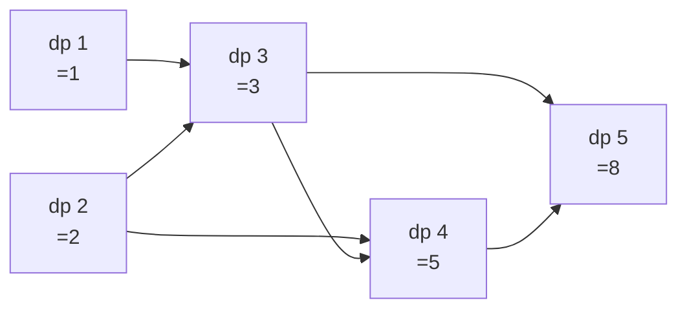

import { Callout } from 'fumadocs-ui/components/callout';

<Callout title="TL;DR — DP — Linear / 1D">

**Use when**: the state is a *single index* into an array or sequence, and the answer at `i` depends on a constant number of previous values (usually `dp[i-1]` and/or `dp[i-2]`).

**Trigger phrases**: "climbing stairs", "house robber", "decode ways", "longest increasing subsequence", "min/max with one decision per step", "fibonacci-like recurrence".

**The shape**: `dp[i] = some_function(dp[i-1], dp[i-2], ..., arr[i])`.

**Two views**:
- **Top-down with memo** — write the recursion naturally, add `@cache`.
- **Bottom-up tabulation** — explicit loop from `0` to `n`, often with O(1) rolling space.

**Complexity**: O(n) time, O(n) or O(1) space depending on rolling.

</Callout>

---

## The problem that motivates this pattern

> **Climbing Stairs (LC 70).** You're climbing a staircase with `n` steps. Each time you can climb either 1 or 2 steps. How many distinct ways can you reach the top?
>
> Example: `n = 3` → `3` (1+1+1, 1+2, 2+1).

Naive brute force: enumerate every sequence of `1`s and `2`s summing to `n`. Exponential — for `n = 45`, it's billions of combinations.

The insight: to reach step `n`, you either came from step `n-1` (took a 1-step) or from step `n-2` (took a 2-step). So `ways(n) = ways(n-1) + ways(n-2)`. **It's Fibonacci.**

Each subproblem depends only on the previous two. We can solve them all in one pass:

```python
def climb_stairs(n):
    if n <= 2: return n
    prev2, prev1 = 1, 2
    for i in range(3, n + 1):
        prev2, prev1 = prev1, prev1 + prev2
    return prev1
```

O(n) time, **O(1) space**. From exponential to linear, no extra memory.

This is the canonical 1D DP. **Once you see the "depends on a few previous indices" structure, the algorithm writes itself.**

The deeper insight: **1D DP is the simplest shape of dynamic programming**. It teaches the two core ideas — overlapping subproblems and optimal substructure — without any of the index gymnastics that come with 2D DP. Master this and you have a foothold for everything else.

---

## The core insight

**1D DP is when the state is a single index, and each state depends on a constant number of previous states.**

The invariant we maintain:

> **By the time we compute `dp[i]`, the value of `dp[j]` for every `j < i` has already been computed correctly.**

That's the entire structure. Build `dp[]` left-to-right. Each cell's recurrence references only earlier cells.

Three things to identify in any 1D DP problem:

1. **State**: what does `dp[i]` *mean*? "Number of ways to reach step `i`." "Maximum money robbed up to house `i`." "Length of longest increasing subsequence ending at `i`."
2. **Transition**: how do you compute `dp[i]` from earlier `dp` values?
3. **Base case**: what's `dp[0]`? `dp[1]`?

If those three are clear, the implementation is trivial. If they're murky, the implementation will be a mess.

```mermaid
flowchart LR
    Q[Sequence problem]
    Q --> A{State is<br/>single index?}
    A -->|yes| B{Depends on<br/>O(1) previous states?}
    B -->|yes, just i-1 or i-2| Fib[Fibonacci-like<br/>House Robber, Climb Stairs]
    B -->|yes, but ALL previous| LIS[LIS-like<br/>scan back to find best]
    A -->|no, two indices| Grid[2D DP - see grid-2d]
    A -->|no, subset state| Bitmask[Bitmask DP]

    style Fib fill:#dbeafe
    style LIS fill:#dcfce7
    style Grid fill:#fef3c7
    style Bitmask fill:#fce7f3
```

### Two sub-flavors

- **Fibonacci-style** — `dp[i] = f(dp[i-1], dp[i-2])`. O(n) time, O(1) rolling space.
- **LIS-style** — `dp[i]` requires scanning *all* previous `dp[j]` for `j < i`. O(n²) time, O(n) space. The "best" answer at `i` doesn't come from just the immediate neighbors.

Both are 1D, but the inner loop's complexity differs.

---

## Visual walkthrough — Climbing Stairs

For `n = 5`:

```
Base:   dp[1] = 1  (one way: [1])
        dp[2] = 2  (two ways: [1,1], [2])

dp[3] = dp[2] + dp[1] = 2 + 1 = 3
        Ways: [1,1,1], [1,2], [2,1]

dp[4] = dp[3] + dp[2] = 3 + 2 = 5
        Ways: [1,1,1,1], [1,1,2], [1,2,1], [2,1,1], [2,2]

dp[5] = dp[4] + dp[3] = 5 + 3 = 8
        Ways: 8 distinct sequences.
```



Each cell depends on the previous two. The data flow is the diagram.

---

## Visual walkthrough — Longest Increasing Subsequence

For `nums = [10, 9, 2, 5, 3, 7, 101, 18]`, compute LIS *ending at each index*.

```
i=0 (10): dp[0] = 1  (just [10])
i=1 (9):  10 > 9, can't extend. dp[1] = 1  ([9])
i=2 (2):  no prior smaller. dp[2] = 1  ([2])
i=3 (5):  2 < 5, can extend dp[2]+1=2. dp[3] = 2  ([2,5])
i=4 (3):  2 < 3, dp[2]+1=2. dp[4] = 2  ([2,3])
i=5 (7):  Check all prior. 2<7→dp[2]+1=2; 5<7→dp[3]+1=3; 3<7→dp[4]+1=3.
          dp[5] = 3  ([2,5,7] or [2,3,7])
i=6 (101): All smaller. Best extends from dp[5]=3. dp[6] = 4  ([2,5,7,101])
i=7 (18):  All smaller. Best extends from dp[5]=3. dp[7] = 4  ([2,5,7,18])

LIS = max(dp) = 4.
```

The inner "scan all previous" loop gives **O(n²)** total. There's a clever **O(n log n)** version using binary search (see Variant 4), but the O(n²) version is canonical and easier to derive.

---

## The template

### Template A — Fibonacci-style (rolling, O(1) space)

```python
def fib_style(n, arr):
    if n <= 1: return base_for(n)
    prev2 = base_0
    prev1 = base_1
    for i in range(2, n + 1):
        curr = f(prev1, prev2, arr[i])
        prev2, prev1 = prev1, curr
    return prev1
```

**Three slots:**

1. **State meaning** — what does `prev1` and `prev2` represent?
2. **Transition `f`** — how to combine them with the current element.
3. **Base cases** — `prev2` and `prev1` at the start.

### Template B — Full DP table (when you need to look further back)

```python
def full_table(n, arr):
    dp = [0] * n                                     # or initialize per problem
    dp[0] = base_case(arr[0])
    for i in range(1, n):
        dp[i] = best_over_previous(arr, dp, i)
    return max(dp)                                   # or dp[n-1], depends on problem
```

### Template C — Top-down with memoization

When the recurrence is awkward to express bottom-up, write it recursively + memoize.

```python
from functools import cache

def solve(n):
    @cache
    def f(i):
        if i <= 1: return base
        return transition(f(i - 1), f(i - 2), arr[i])
    return f(n)
```

`@cache` (Python 3.9+) is the easy button. For non-Python, build a manual `memo` dict.

---

## Worked example: House Robber (LC 198)

> **Problem.** You're a robber planning to rob houses along a street. Each house has some amount of money. You cannot rob two adjacent houses. Return the maximum amount you can rob.
>
> Example: `nums = [2, 7, 9, 3, 1]` → `12` (rob houses 0, 2, 4: 2+9+1).

**Why this is 1D DP.** At each house `i`, you make a binary decision: rob it (and skip `i-1`) or skip it. The "best so far" at each index depends only on the best at `i-1` and `i-2`.

**The state**: `dp[i]` = maximum money robbable from houses `0..i`.

**The transition**:
- If we rob house `i`: we get `nums[i] + dp[i-2]` (since `i-1` is forbidden).
- If we skip house `i`: we get `dp[i-1]`.
- Take the max: `dp[i] = max(dp[i-1], dp[i-2] + nums[i])`.

**Base cases**:
- `dp[0] = nums[0]` (only one house).
- `dp[1] = max(nums[0], nums[1])` (pick the bigger of two).

```python
def rob(nums: list[int]) -> int:
    if not nums: return 0
    if len(nums) == 1: return nums[0]

    prev2 = nums[0]
    prev1 = max(nums[0], nums[1])
    for i in range(2, len(nums)):
        curr = max(prev1, prev2 + nums[i])
        prev2, prev1 = prev1, curr
    return prev1
```

**Dry-run on `[2, 7, 9, 3, 1]`:**

| i | nums[i] | prev2 | prev1 | curr = max(prev1, prev2 + nums[i]) |
|---|---------|-------|-------|-------------------------------------|
| init | — | 2 | 7 | — |
| 2 | 9 | 2 | 7 | max(7, 2+9)=11 |
| 3 | 3 | 7 | 11 | max(11, 7+3)=11 |
| 4 | 1 | 11 | 11 | max(11, 11+1)=12 |

**Answer: 12** ✓.

**Complexity.** O(n) time, **O(1) space** (rolling).

The key abstraction: **at each step, you only need the best-with-rob-i and best-without-rob-i.** Two variables suffice.

---

## Variants

### Variant 1 — Fibonacci-like (state from i-1 and i-2)

The simplest case. Used when the decision at step `i` depends only on the immediate predecessors.

**Canonical problems**: 70 Climbing Stairs (this page's intro), 198 House Robber (this page's worked example), 213 House Robber II (circular — run twice, excluding first or last), 746 Min Cost Climbing Stairs, 91 Decode Ways, 91-like Fibonacci variants.

### Variant 2 — Constant lookback (O(k) per state)

Extend Fibonacci to "depends on the last `k` indices." Still O(n·k) which is O(n) for small constant `k`.

```python
# Tribonacci (LC 1137): T(n) = T(n-1) + T(n-2) + T(n-3)
def tribonacci(n):
    if n == 0: return 0
    if n <= 2: return 1
    a, b, c = 0, 1, 1
    for _ in range(3, n + 1):
        a, b, c = b, c, a + b + c
    return c
```

**Canonical problems**: 1137 N-th Tribonacci Number, 873 Length of Longest Fibonacci-like Subsequence.

### Variant 3 — Look-all-previous (LIS-style, O(n²))

Each `dp[i]` requires scanning every `j < i`. O(n²) time, O(n) space.

```python
def length_of_lis(nums):
    n = len(nums)
    dp = [1] * n
    for i in range(1, n):
        for j in range(i):
            if nums[j] < nums[i]:
                dp[i] = max(dp[i], dp[j] + 1)
    return max(dp)
```

**Canonical problems**: 300 Longest Increasing Subsequence, 673 Number of LIS, 354 Russian Doll Envelopes (sort + LIS), 1048 Longest String Chain.

### Variant 4 — LIS in O(n log n) (patience sorting)

Maintain `tails[k]` = smallest possible tail of an increasing subsequence of length `k+1`. Binary-search-and-replace.

```python
from bisect import bisect_left
def length_of_lis_fast(nums):
    tails = []
    for x in nums:
        i = bisect_left(tails, x)
        if i == len(tails):
            tails.append(x)
        else:
            tails[i] = x
    return len(tails)
```

This is the O(n log n) version — combines 1D DP intuition with [Binary Search](/dsa/patterns/arrays-strings/binary-search). Not strictly DP anymore but the same problem.

**Canonical problems**: 300 LIS (revisited), 354 Russian Doll Envelopes (with the binary-search trick).

### Variant 5 — Multiple choices per step

When at each index you have more than 2 options.

```python
# Decode Ways (LC 91)
def num_decodings(s):
    if not s or s[0] == '0': return 0
    n = len(s)
    prev2, prev1 = 1, 1
    for i in range(1, n):
        curr = 0
        if s[i] != '0':
            curr += prev1                              # decode single digit
        two = int(s[i-1:i+1])
        if 10 <= two <= 26:
            curr += prev2                              # decode two digits
        prev2, prev1 = prev1, curr
    return prev1
```

**Canonical problems**: 91 Decode Ways, 639 Decode Ways II (with `*` wildcards), 96 Unique Binary Search Trees (Catalan numbers).

### Variant 6 — State with extra dimension (still "1D" but augmented)

Sometimes you need to carry extra info per index — e.g., `dp[i][0]` and `dp[i][1]` for "is the current element included?"

```python
# Best Time to Buy and Sell Stock with Cooldown (LC 309)
def max_profit(prices):
    n = len(prices)
    # hold[i] = max profit if holding a stock at end of day i
    # sold[i] = max profit if just sold today
    # rest[i] = max profit if resting (no stock, didn't just sell)
    hold = -prices[0]; sold = 0; rest = 0
    for i in range(1, n):
        new_hold = max(hold, rest - prices[i])
        new_sold = hold + prices[i]
        new_rest = max(rest, sold)
        hold, sold, rest = new_hold, new_sold, new_rest
    return max(sold, rest)
```

**Canonical problems**: 198 House Robber (rob/skip state), 309 Stock with Cooldown, 714 Stock with Fee, 740 Delete and Earn (transform into House Robber).

### Variant 7 — Maximum subarray (Kadane's algorithm)

A famous 1D DP. `dp[i]` = max sum subarray *ending at* `i`. Transition: `dp[i] = max(nums[i], dp[i-1] + nums[i])`.

```python
def max_subarray(nums):
    best = curr = nums[0]
    for x in nums[1:]:
        curr = max(x, curr + x)
        best = max(best, curr)
    return best
```

**Canonical problems**: 53 Maximum Subarray (Kadane's), 152 Maximum Product Subarray (track both min and max — products of negatives flip), 918 Maximum Sum Circular Subarray.

### Variant 8 — Word Break (DP + dictionary check)

`dp[i]` = "is `s[:i]` segmentable?" Check every cut point.

```python
def word_break(s, words):
    word_set = set(words)
    n = len(s)
    dp = [False] * (n + 1)
    dp[0] = True
    for i in range(1, n + 1):
        for j in range(i):
            if dp[j] and s[j:i] in word_set:
                dp[i] = True
                break
    return dp[n]
```

**Canonical problems**: 139 Word Break, 140 Word Break II (collect all sentences — backtracking + DP), 1235 Max Profit in Job Scheduling.

---

## Common pitfalls

| Trap | Fix |
|------|-----|
| Defining state ambiguously | "Max so far" vs "Max ending here" — these are different! Be explicit |
| Missing base cases | `dp[0]` and `dp[1]` should both be handled. Edge cases like empty / single-element input matter |
| Off-by-one in transition | Whether you index from `0` or `1` affects everything. Pick one and stay consistent |
| Returning `dp[n]` when you should return `max(dp)` | LIS returns `max(dp)` (best length over all endings); House Robber returns `dp[n-1]` (best up to last) |
| Using O(n) space when O(1) suffices | If only `dp[i-1]` and `dp[i-2]` matter, use rolling variables |
| Forgetting to update both `prev2` and `prev1` | The two-variable rolling needs simultaneous update via tuple assignment |
| Using bottom-up when recursion is more natural | Memoized recursion is fine — Python's `@cache` is clean |
| Initializing `dp = [0] * n` when initial value should be 1 or -inf | LIS needs `[1] * n` (every element is at least a length-1 LIS) |
| Confusing "longest increasing subsequence" with "longest increasing subarray" | Subsequence allows skips; subarray is contiguous |
| Off-by-one when problem is 1-indexed | Read the spec carefully. Some problems count steps starting at 1, others at 0 |

---

## Complexity

**Fibonacci-style 1D DP**: O(n) time, O(1) space (with rolling).

**LIS-style (look-all-previous)**: O(n²) time, O(n) space. The O(n log n) version uses binary search.

**Constant lookback (last k indices)**: O(n · k) time, O(k) space (with rolling).

**Word-break-style**: O(n²) time, O(n) space (or O(n · max_word_len) if word lookup is bounded).

The pattern's appeal: 1D DP turns exponential problems into linear or quadratic ones. The transitions are usually a one-liner once you've figured out the state.

---

## When NOT to use 1D DP

- **The state isn't a single index.** If you need two indices (one per sequence in pair problems, or one per row + column in grid problems), you need [2D DP](/dsa/patterns/dp/grid-2d).
- **The state is a subset.** When the answer at step `i` depends on which subset of items has been "used," you need [Bitmask DP](/dsa/patterns/dp/bitmask).
- **Each subproblem isn't reused.** If `dp[i]` is only referenced once, DP is overkill — just compute iteratively without memoization.
- **The problem has no overlapping subproblems.** Then it's not DP. It's recursion / divide-and-conquer / greedy.
- **You want to enumerate solutions, not count or optimize.** Use [Backtracking](/dsa/patterns/recursion/backtracking).
- **Greedy works.** "Best Time to Buy and Sell Stock" (single transaction) is greedy, not DP. Check greedy first.

### Decision rule

| Symptom | Likely pattern |
|---------|---------------|
| "Count ways to reach X" | **1D DP (Fibonacci-style)** |
| "Max/min with one decision per step" | **1D DP (House Robber-style)** |
| "Longest X subsequence" | **1D DP (LIS-style)** |
| "Decode / parse sequence" | **1D DP (Decode Ways-style)** |
| "Max sum subarray" | **Kadane's (1D DP)** |
| "Word break / segment a string" | **1D DP** |
| "Pair / two-sequence problem" | [2D DP](/dsa/patterns/dp/grid-2d) |
| "Knapsack / take-or-leave with capacity" | [Knapsack DP](/dsa/patterns/dp/knapsack) |
| "Enumerate all solutions" | [Backtracking](/dsa/patterns/recursion/backtracking) |
| "Greedy might work" | [Intervals & Greedy](/dsa/patterns/arrays-strings/intervals-greedy) — try greedy first |

---

## Real-world applications

- **Sequence prediction in ML.** Markov chains compute transition probabilities — essentially 1D DP over time.
- **Audio / signal processing.** Dynamic time warping is a 1D DP variant for sequence alignment.
- **Spell correction.** Edit distance is a 2D DP, but its 1D rolling version uses constant memory.
- **Financial backtesting.** "Best time to buy/sell stock" problems map directly to financial strategy evaluation.
- **Time-series anomaly detection.** Many algorithms compute "best path through prior states" — that's 1D DP.
- **Compiler peephole optimization.** Each instruction's optimization depends on previous instructions in a window.
- **Text justification.** Each line break decision uses the optimal previous decisions — 1D DP (LC 1335 Minimum Difficulty of a Job Schedule is a related variant).

---

## Curated practice problems

| # | Problem | Difficulty | Variant | Note |
|---|---------|-----------|---------|------|
| 1 | ★ 70 Climbing Stairs | Easy | Fibonacci-style | The canonical |
| 2 | 746 Min Cost Climbing Stairs | Easy | Fibonacci-style, min | Cost variant |
| 3 | ★ 198 House Robber | Medium | Skip-or-take | This page's worked example |
| 4 | 213 House Robber II | Medium | Circular — run twice | Exclude first OR exclude last |
| 5 | 740 Delete and Earn | Medium | Bucket → House Robber | Transform problem |
| 6 | ★ 91 Decode Ways | Medium | Multi-choice transition | Two ways to decode at each step |
| 7 | 639 Decode Ways II | Hard | + wildcards | `*` matches 1-9 |
| 8 | ★ 300 Longest Increasing Subsequence | Medium | LIS O(n²) or O(n log n) | The canonical LIS |
| 9 | 673 Number of LIS | Medium | LIS + count | Track count alongside length |
| 10 | 354 Russian Doll Envelopes | Hard | 2D LIS | Sort by width, LIS on height |
| 11 | 1048 Longest String Chain | Medium | LIS-flavored | Sort by length, then DP |
| 12 | ★ 53 Maximum Subarray | Easy | Kadane's | The canonical |
| 13 | 152 Maximum Product Subarray | Medium | Kadane's variant | Track min AND max (negatives flip) |
| 14 | 918 Maximum Sum Circular Subarray | Medium | Kadane's two-pass | max(normal, total - min) |
| 15 | ★ 309 Best Time to Buy/Sell with Cooldown | Medium | State machine | hold / sold / rest |
| 16 | 714 Best Time to Buy/Sell with Fee | Medium | State machine | Subtract fee on sell |
| 17 | ★ 139 Word Break | Medium | Sequence partition | DP on cut points |
| 18 | 140 Word Break II | Hard | Enumerate sentences | DP + Backtracking |
| 19 | 1335 Min Difficulty of Job Schedule | Hard | 1D DP with subarray max | k-partition with max-per-segment |
| 20 | 96 Unique Binary Search Trees | Medium | Catalan recurrence | Sum of dp[j] · dp[i-j-1] |

---

## Related patterns

- [DP — 2D Grid / Two-Sequence](/dsa/patterns/dp/grid-2d) — when the state has two indices
- [DP — Knapsack Family](/dsa/patterns/dp/knapsack) — when the state is `(item, capacity)`
- [DP — Tree DP](/dsa/patterns/dp/tree-dp) — when the structure is a tree, not a sequence
- [DP — Bitmask](/dsa/patterns/dp/bitmask) — when the state is "which subset"
- [Backtracking](/dsa/patterns/recursion/backtracking) — when you need to enumerate, not just count/optimize
- [Binary Search](/dsa/patterns/arrays-strings/binary-search) — LIS in O(n log n) uses binary search

---

## Quick-reference card

```python
# Fibonacci-style 1D DP (O(1) space)
prev2, prev1 = base_0, base_1
for i in range(2, n + 1):
    curr = transition(prev1, prev2, arr[i])
    prev2, prev1 = prev1, curr
return prev1

# House Robber pattern
prev2, prev1 = 0, 0
for x in nums:
    prev2, prev1 = prev1, max(prev1, prev2 + x)
return prev1

# Kadane's max subarray
best = curr = nums[0]
for x in nums[1:]:
    curr = max(x, curr + x)
    best = max(best, curr)

# LIS O(n²)
dp = [1] * n
for i in range(1, n):
    for j in range(i):
        if nums[j] < nums[i]:
            dp[i] = max(dp[i], dp[j] + 1)
return max(dp)

# LIS O(n log n)
from bisect import bisect_left
tails = []
for x in nums:
    i = bisect_left(tails, x)
    if i == len(tails): tails.append(x)
    else: tails[i] = x
return len(tails)
```

Triggers: "climbing stairs", "house robber", "decode ways", "LIS", "max subarray", "word break". Complexity: O(n) or O(n²) depending on lookback.
