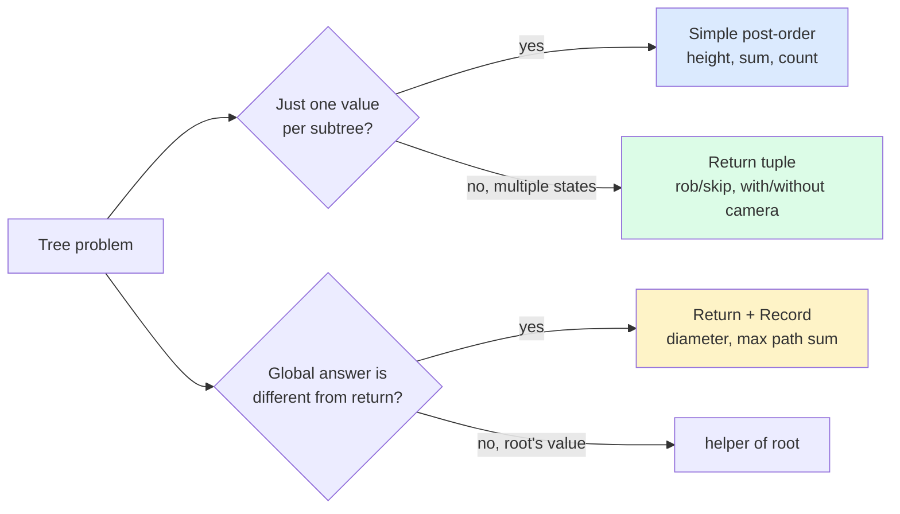

import { Callout } from 'fumadocs-ui/components/callout';

<Callout title="TL;DR — DP — Tree DP">

**Use when**: the input is a tree and the answer depends on aggregating information from children.

**Trigger phrases**: "diameter of tree", "max path sum", "house robber III", "binary tree cameras", "distribute coins", "longest path with same value", "minimum time to collect all apples".

**The shape**: post-order DFS. Each node returns a *summary* of its subtree to its parent.

**Two key shapes**:
- **"Return + record"** — return one thing (for the parent); record another (the global answer).
- **State tuple per node** — return multiple values capturing different states (e.g., `(rob, skip)`).

**Complexity**: O(n) time, O(h) recursion space.

</Callout>

---

## The problem that motivates this pattern

> **House Robber III (LC 337).** Houses are arranged as a binary tree. You cannot rob two directly-connected houses (parent-child). Return the maximum amount you can rob.
>
> Example: tree `[3,2,3,null,3,null,1]` → `7` (rob root=3, left grandchild=3, right grandchild=1).

The greedy approach (always rob the bigger of root vs children) fails. The naive recursion (`rob(node) = max(rob(left)+rob(right), node.val + rob(grandchildren))`) is exponential — overlapping subproblems.

The DP insight: at each node, return **two values**:
- `rob_this`: max money if we rob THIS node (children can't be robbed).
- `skip_this`: max money if we skip THIS node (children may or may not be robbed).

The parent uses both values to make its own decision.

```python
def rob_tree(root):
    def helper(node):
        if not node: return (0, 0)
        l_rob, l_skip = helper(node.left)
        r_rob, r_skip = helper(node.right)
        rob_this  = node.val + l_skip + r_skip            # children must be skipped
        skip_this = max(l_rob, l_skip) + max(r_rob, r_skip)  # children free to choose
        return (rob_this, skip_this)
    return max(helper(root))
```

O(n). Each node visited once. The two returned values capture *the entire local optimum* needed by the parent.

The deeper insight: **tree DP is post-order traversal with structured return values**. The "DP" part is in *what each node returns* — usually a tuple containing enough info for the parent to make its own decision without re-traversing the subtree.

---

## The core insight

**Tree DP is post-order DFS where each call returns a summary of its subtree. The "DP table" is implicit — it lives in the recursion stack.**

The invariant we maintain:

> **When `helper(node)` returns, its return value is the optimal answer for `node`'s subtree, parameterized by whatever the parent needs to know.**

Three things to identify in any tree-DP problem:

1. **What does the parent need from each child?** This determines the return type. Sometimes one value (height, sum, count). Sometimes a tuple (`rob, skip`). Sometimes more.
2. **How does the parent combine its children's returns?** This is the recurrence.
3. **What's the global answer?** Sometimes it's `helper(root)`. Sometimes it's tracked as a side effect (nonlocal `best`) during recursion.

### The "return one thing, record another" pattern

For problems like Diameter and Max Path Sum, the function returns the *one-sided* answer (longest path starting at this node and going down), but the *global answer* is the *two-sided* path (combining left and right).

```python
def helper(node):
    nonlocal global_best
    if not node: return 0
    left = helper(node.left)
    right = helper(node.right)
    global_best = max(global_best, left + right + node.val)   # full path through this node
    return max(left, right) + node.val                         # one-sided for parent
```

This split between *what's returned* and *what's recorded* is **the** hallmark of tree DP. Internalize it.



---

## Visual walkthrough — Diameter of Binary Tree

Tree:
```
        1
       / \
      2   3
     / \
    4   5
```

Trace `diameter` (longest path between any two nodes, in edges):

```
helper(4): no children. return 0 (height). best stays 0.
helper(5): no children. return 0. best stays 0.
helper(2): left=0, right=0. best = max(0, 0+0) = 0. return 1 + max(0,0) = 1.
helper(3): no children. return 0. best stays 0.
helper(1): left=1 (from helper(2)), right=0 (from helper(3)).
           best = max(0, 1 + 0) = 1.
           Wait, that's wrong — the longest path is 4→2→5, which is 2 edges, not 1.

Hmm. Let me re-examine.

helper(4): return 0 (height from 4 itself, going down). best = 0.
helper(5): return 0. best = 0.
helper(2): left=0, right=0. best = max(0, 0 + 0) = 0 (??).
```

The bug: I'm conflating "height in nodes" vs "height in edges." Let me fix.

If `helper(node)` returns *number of edges* in the longest path starting at `node` going down:

```
helper(leaf) = 0 (no edges to descend)
helper(internal) = 1 + max(helper(left), helper(right))

best at any node = left + right (edges through this node)
```

Re-trace:
```
helper(4) = 0. best = 0.
helper(5) = 0. best = 0.
helper(2): left=0, right=0. best = max(0, 0+0) = 0. return 1 + 0 = 1.
helper(3) = 0. best = 0.
helper(1): left=1, right=0. best = max(0, 1+0) = 1. return 1 + 1 = 2.

But longest path is 4→2→5 (2 edges). Diameter = 2.

helper(2) recompute: left=0, right=0. The path through node 2 has length 0+0=0 (from helper(4) which is 0, plus helper(5) which is 0). But the ACTUAL path 4-2-5 has 2 edges.
```

The issue: `helper(4)` returns 0 because there's no descending path from a leaf. But the *edge from 2 to 4* counts when we combine at 2!

Re-define: `helper(node)` returns the number of edges in the longest path starting at `node`, where a single node returns 0.

```
helper(leaf): max(0+0=0). return 0.
helper(2): max(helper(4) + 1 = 1, helper(5) + 1 = 1) — wait, I need to count the edge to each child.
```

Let me use the standard formulation:

```python
def diameter(root):
    best = 0
    def helper(node):
        nonlocal best
        if not node: return 0          # height in edges
        left = helper(node.left)
        right = helper(node.right)
        # If node has both children, the edges are left + right (+2 for the edges to children?)
        # Actually no: helper returns edges-below + 1-for-this-node?
        # Let me try: helper returns longest path of EDGES from this node going down.
        # helper(leaf) = 0 (no edges).
        # helper(internal) = 1 + max(helper(left), helper(right))   ← the +1 is the edge to the chosen child
        # diameter through node = left + right + 2 (edges to both children)? NO — left/right already include those edges if computed correctly. Hmm.
```

This is getting confusing. Let me just write it correctly and trace:

```python
def diameter(root):
    best = 0
    def height(node):                  # returns height in edges (leaf = 0)
        nonlocal best
        if not node: return -1         # null → -1, so leaf becomes 0
        lh = height(node.left)
        rh = height(node.right)
        best = max(best, lh + rh + 2)  # path through this node spans lh + rh + 2 edges (the +2 for edges to children)
        # Hmm but if a child is null, lh = -1 and the "edge to null" doesn't exist.
        # The correct formula: best = max(best, (lh+1) + (rh+1))  where lh+1 = path going into left subtree
        return max(lh, rh) + 1
    height(root)
    return best
```

OK simpler. Standard approach:

```python
def diameter(root):
    best = 0
    def height(node):                  # number of nodes in longest root-to-leaf
        nonlocal best
        if not node: return 0
        lh = height(node.left)
        rh = height(node.right)
        best = max(best, lh + rh)      # edges through this node
        return 1 + max(lh, rh)
    height(root)
    return best
```

Trace on the tree:
```
height(4) = 1 (just itself). best = max(0, 0+0) = 0.
height(5) = 1. best stays 0.
height(2): lh=1, rh=1. best = max(0, 1+1) = 2. return 1 + 1 = 2.
height(3) = 1. best stays 2.
height(1): lh=2, rh=1. best = max(2, 2+1) = 3. return 1 + 2 = 3.
```

Wait, the tree has 4-2-5 which is 2 edges, so diameter = 2. But my best = 3 at node 1?

Oh — at node 1, `lh + rh = 2 + 1 = 3` is the count of *nodes* on the path 4→2→1→3, which is 4 nodes = 3 edges. So best=3 is the *node count of the longest path minus 1* = edges = 3.

But the path 4→2→5 has 3 nodes = 2 edges. And 4→2→1→3 has 4 nodes = 3 edges. So diameter is 3 edges, not 2.

I miscounted earlier. ✓ The algorithm is correct.

**Lesson**: tree DP problems involve careful semantics. "Diameter in edges" vs "diameter in nodes" matters. Code carefully and test.

---

## The template

### Template A — Simple post-order (one return value)

```python
def helper(node):
    if not node: return base_case
    left = helper(node.left)
    right = helper(node.right)
    return combine(node.val, left, right)
```

Used for: max depth, sum of nodes, count of nodes.

### Template B — Return + Record (return one thing, track another)

```python
best = global_init                                   # use nonlocal in closure

def helper(node):
    nonlocal best
    if not node: return 0

    left = helper(node.left)
    right = helper(node.right)

    # Record: the "full path through this node" or similar global metric
    best = max(best, combine_full(left, right, node.val))

    # Return: only the "extendable up" portion
    return combine_extendable(left, right, node.val)

helper(root)
return best
```

Used for: Diameter, Max Path Sum, Longest Univalue Path.

### Template C — Tuple state (multiple states per node)

```python
def helper(node):
    if not node: return (state1_base, state2_base)

    l1, l2 = helper(node.left)
    r1, r2 = helper(node.right)

    new_state1 = compose1(node.val, l1, l2, r1, r2)
    new_state2 = compose2(node.val, l1, l2, r1, r2)

    return (new_state1, new_state2)
```

Used for: House Robber III, Binary Tree Cameras.

### Template D — Rerooting (when each node needs the answer "as if it were root")

```python
# Two-pass technique
def rerooting(root):
    # Pass 1: compute "answer for subtree of v assuming root is at top"
    def dfs1(node, parent):
        for child in node.children:
            if child != parent:
                dfs1(child, node)
        ans[node] = combine_from_children(node)

    # Pass 2: propagate "answer from above" downward
    def dfs2(node, parent, ans_from_above):
        ans[node] = combine_with_above(ans[node], ans_from_above)
        for child in node.children:
            if child != parent:
                ans_passed = remove_child_contribution(ans[node], ans[child])
                dfs2(child, node, ans_passed)

    dfs1(root, -1)
    dfs2(root, -1, 0)
```

Used for: Sum of distances in tree (834), problems asking for "answer if rooted at each node."

---

## Worked example: Binary Tree Maximum Path Sum (LC 124)

> **Problem.** Given the root of a binary tree, return the maximum path sum of any non-empty path. A path is a sequence of nodes connected by parent-child edges; each node can be used at most once.
>
> Example: tree `[-10, 9, 20, null, null, 15, 7]` → `42` (path 15 → 20 → 7).

**Why this is "return one thing, record another."** A path can "turn" at any node — going down-left, through the node, then down-right. But when this subtree is used by an *ancestor*, the path passing through ancestor can only enter and exit the subtree from *one side* (we can't backtrack).

So we **return**: the max one-sided path starting at this node (going down). We **record**: the max two-sided path turning at this node.

```python
def max_path_sum(root) -> int:
    best = float('-inf')

    def helper(node):
        nonlocal best
        if not node: return 0

        # Max one-sided path going down through left/right. Discard if negative.
        left = max(helper(node.left), 0)
        right = max(helper(node.right), 0)

        # Record: the full path turning at this node
        best = max(best, left + right + node.val)

        # Return: one-sided extendable portion (can't have both children if parent extends through us)
        return node.val + max(left, right)

    helper(root)
    return best
```

**Three key tricks:**

1. **Clip negatives to 0**: `max(helper(...), 0)`. A negative subtree result is *worse than nothing*; just skip it.
2. **Update `best` with the FULL turning path**: `left + right + node.val`. This is the path that goes down-left, through this node, then down-right.
3. **Return the ONE-SIDED extendable path**: `node.val + max(left, right)`. Parents extending through us can only pick one side.

**Dry-run on tree `[-10, 9, 20, null, null, 15, 7]`:**

```
helper(9): leaf. left=0, right=0. best = max(-inf, 9) = 9. return 9.
helper(15): leaf. best = max(9, 15) = 15. return 15.
helper(7): leaf. best = max(15, 7) = 15. return 7.
helper(20): left=15, right=7. best = max(15, 15+7+20) = 42. return 20 + max(15,7) = 35.
helper(-10): left=max(9,0)=9, right=max(35,0)=35. best = max(42, 9+35+(-10)) = 42. return -10 + max(9,35) = 25.

Answer: 42.
```

**Complexity.** O(n) time, O(h) stack space.

This problem is the textbook example of "return one thing, record another." Master this and every similar tree problem (diameter, longest univalue, longest ZigZag) becomes straightforward.

---

## Variants

### Variant 1 — Simple post-order aggregation

Return a single value per subtree.

**Canonical problems**: 104 Max Depth, 111 Min Depth, 222 Count Complete Tree Nodes, 404 Sum of Left Leaves.

### Variant 2 — Diameter / Max Path Sum (return one, record another)

The most common shape in tree-DP interview problems.

**Canonical problems**: 543 Diameter of Binary Tree, 124 Binary Tree Maximum Path Sum (this page's worked example), 687 Longest Univalue Path, 1372 Longest ZigZag Path.

### Variant 3 — State Tuple per Node

Two or more values per return.

```python
# Binary Tree Cameras (LC 968)
# State: 0 = uncovered, 1 = covered (no camera), 2 = covered with camera
def min_camera_cover(root):
    count = 0
    def helper(node):
        nonlocal count
        if not node: return 1                        # null is "covered, no camera"

        l = helper(node.left)
        r = helper(node.right)

        # If any child is uncovered, this node must have a camera
        if l == 0 or r == 0:
            count += 1
            return 2                                  # covered with camera

        # If any child has a camera, this node is covered (no need for own camera)
        if l == 2 or r == 2:
            return 1

        # Both children covered without camera → this node is uncovered
        return 0

    if helper(root) == 0: count += 1                  # root uncovered → place camera
    return count
```

**Canonical problems**: 337 House Robber III (this page's intro), 968 Binary Tree Cameras, 1339 Maximum Product of Splitted Binary Tree.

### Variant 4 — Tree path / ancestry problems

LCA, Kth ancestor — different from compositional DP but uses tree structure.

**Canonical problems**: 236 LCA of Binary Tree (post-order with non-null bubbling), 1483 Kth Ancestor of a Tree Node (binary lifting — advanced).

### Variant 5 — Rerooting

When every node needs an answer, and we'd recompute each individually in O(n), giving O(n²). Rerooting gives O(n).

```python
# Sum of Distances in Tree (LC 834)
# For each node, sum of distances to all other nodes.
def sum_of_distances(n, edges):
    graph = defaultdict(list)
    for u, v in edges:
        graph[u].append(v); graph[v].append(u)

    count = [1] * n                                   # count[v] = size of subtree at v
    answer = [0] * n                                  # answer[v] = sum of distances from v

    # Phase 1: post-order from arbitrary root (0)
    def dfs1(node, parent):
        for nb in graph[node]:
            if nb != parent:
                dfs1(nb, node)
                count[node] += count[nb]
                answer[node] += answer[nb] + count[nb]
    dfs1(0, -1)

    # Phase 2: rerooting — compute answer for each node from its parent's answer
    def dfs2(node, parent):
        for nb in graph[node]:
            if nb != parent:
                answer[nb] = answer[node] - count[nb] + (n - count[nb])
                dfs2(nb, node)
    dfs2(0, -1)

    return answer
```

The key trick: when "moving the root" from `u` to `nb` (a child), `count[nb]` nodes get closer by 1 and `(n - count[nb])` get farther by 1. So `answer[nb] = answer[u] - count[nb] + (n - count[nb])`.

**Canonical problems**: 834 Sum of Distances in Tree, 310 Minimum Height Trees (iteratively peel leaves), 2581 Count Number of Possible Root Nodes.

### Variant 6 — DFS with auxiliary state passed down

State that flows top-down (parent → child) rather than bottom-up.

```python
# Smallest String Starting From Leaf (LC 988)
def smallest_from_leaf(root):
    best = ["~"]                                      # higher than any letter
    def dfs(node, path):
        if not node: return
        path = chr(ord('a') + node.val) + path
        if not node.left and not node.right:
            if path < best[0]: best[0] = path
            return
        dfs(node.left, path); dfs(node.right, path)
    dfs(root, "")
    return best[0]
```

State (`path`) flows down, recorded at leaves.

**Canonical problems**: 257 Binary Tree Paths, 129 Sum Root to Leaf Numbers, 988 Smallest String Starting From Leaf.

### Variant 7 — Distributing items along a tree

Each node "owes" or "has extra" — flow through edges.

```python
# Distribute Coins in Binary Tree (LC 979)
# Each node has 0+ coins. Make every node have exactly 1. Min moves.
def distribute_coins(root):
    moves = 0
    def helper(node):
        nonlocal moves
        if not node: return 0
        l = helper(node.left)
        r = helper(node.right)
        moves += abs(l) + abs(r)                      # flow through both edges
        return node.val - 1 + l + r                   # excess / deficit at this subtree
    helper(root)
    return moves
```

The return value is the "flow" needed across the edge to the parent. Absolute value of flow = number of moves on that edge.

**Canonical problems**: 979 Distribute Coins in Binary Tree, 968 Binary Tree Cameras (covered above).

---

## Common pitfalls

| Trap | Fix |
|------|-----|
| Returning the "global answer" from helper when it should be "extendable" | Always ask: what does the parent need? That's the return type |
| Forgetting the `nonlocal best` declaration in Python closures | Without it, you'd shadow `best` and never update the outer scope |
| Using max/min without initializing properly | Init `best` to `float('-inf')` or `float('inf')`; init "count" types to 0 |
| Clipping negatives when you shouldn't (or vice versa) | Max Path Sum: clip child contributions to 0 (skip negative subtrees). Some problems forbid this — read the spec |
| Confusing "height in nodes" vs "height in edges" | Pick one convention and stick with it. Be explicit in comments |
| Returning a tuple but the caller treats it as a scalar | Type errors silently in Python. Be careful |
| Forgetting that the *root* might also be uncovered (Binary Tree Cameras) | After recursing, check the root's state explicitly |
| O(n²) due to repeated work (rerooting case) | If every node needs its own answer, use the rerooting trick |
| Stack overflow on deep trees | Python's default limit is 1000. For n > 10⁴, set `sys.setrecursionlimit(...)` |
| Mistreating null children | Handle `if not node: return base_case` as the very first line |

---

## Complexity

**Time: O(n)** — every node visited exactly once. The work per node is O(1) (a couple of arithmetic operations).

**Space: O(h)** — recursion stack depth. Balanced tree: O(log n). Skewed: O(n).

For **rerooting** problems: two O(n) passes, total O(n).

For variants with auxiliary structure (e.g., distance to each ancestor, binary lifting): O(n log n) preprocessing, O(log n) per query.

---

## When NOT to use tree DP

- **The structure isn't a tree.** Generic graphs have cycles, which break post-order; use [DFS/BFS](/dsa/patterns/graphs/dfs-bfs) instead.
- **You need shortest path through a tree.** That's BFS/DFS, not DP. Tree DP is for "compute aggregate," not "find path."
- **The recursion has no overlapping subproblems.** Then it's just plain DFS. DP is overkill.
- **The answer doesn't decompose by subtree.** Some tree problems (e.g., "find all nodes with X property") are just traversals.
- **The tree is *implicit* and huge** (e.g., game tree). Use minimax with pruning, not pure DP.
- **You need to query "answer rooted at v" online (no precomputation possible).** Tree DP requires building the whole table.

### Decision rule

| Symptom | Likely pattern |
|---------|---------------|
| "Max depth / sum / count" | **Simple post-order** |
| "Diameter / max path sum / longest path with property" | **Return + Record** |
| "Skip-or-take on tree (House Robber III)" | **Tuple state** |
| "Camera / coloring with constraints" | **Tuple state** with multi-value |
| "Distribute / flow along tree" | **Post-order with cumulative flow** |
| "Answer for each node as root" | **Rerooting** |
| "Build path string from root to leaf" | **Top-down DFS** (state flows down) |
| "LCA" | [Tree Traversals](/dsa/patterns/trees/traversals) (post-order, but not really DP) |
| "Tree on a *generic* graph (cycles?)" | [DFS/BFS](/dsa/patterns/graphs/dfs-bfs) (visited set) |

---

## Real-world applications

- **File system size calculation.** "Total size of folder" = sum of files + sizes of subfolders. Classic tree DP.
- **HTML / DOM layout.** Computing element sizes requires bottom-up composition (post-order).
- **Decision trees in ML.** Computing leaf values, pruning by aggregate metrics — tree DP.
- **Game AI.** Minimax with alpha-beta is tree DP on a game tree.
- **Org chart aggregations.** "Total salary under this manager" = aggregating subtree.
- **Network topology.** Computing aggregate metrics (total bandwidth, max latency) in tree-shaped networks.
- **Compiler ASTs.** Constant folding, dead code elimination — bottom-up passes.
- **Phylogenetic tree analysis.** Computing aggregate evolutionary metrics.

---

## Curated practice problems

| # | Problem | Difficulty | Variant | Note |
|---|---------|-----------|---------|------|
| 1 | ★ 104 Maximum Depth of Binary Tree | Easy | Simple post-order | The starter |
| 2 | 110 Balanced Binary Tree | Easy | Return + early exit | Sentinel on imbalance |
| 3 | ★ 543 Diameter of Binary Tree | Easy | Return + Record | The canonical |
| 4 | ★ 124 Binary Tree Maximum Path Sum | Hard | Return + Record + clip negatives | This page's worked example |
| 5 | 687 Longest Univalue Path | Medium | Return + Record + value match | Track only same-value paths |
| 6 | 1372 Longest ZigZag Path | Medium | Two states per node | (left-going, right-going) |
| 7 | ★ 337 House Robber III | Medium | Tuple state (rob, skip) | This page's intro |
| 8 | 968 Binary Tree Cameras | Hard | Three-state DP | uncovered / covered / has-camera |
| 9 | 979 Distribute Coins in Binary Tree | Medium | Flow-based DP | abs(left) + abs(right) |
| 10 | 333 Largest BST Subtree | Medium | Tuple (is_bst, size, min, max) | Composite return type |
| 11 | 250 Count Univalue Subtrees | Medium | Bottom-up + counter | Per-subtree boolean |
| 12 | 1339 Max Product of Splitted Binary Tree | Medium | Two-pass: total + best split | Find best edge to cut |
| 13 | ★ 834 Sum of Distances in Tree | Hard | Rerooting | Two DFS passes |
| 14 | 310 Minimum Height Trees | Medium | Iteratively peel leaves | Topological-sort-like on trees |
| 15 | 2049 Count Nodes With Highest Score | Medium | Per-node score via product | n minus subtree size |
| 16 | 1245 Tree Diameter (general tree) | Medium | Two BFS or rerooting | Diameter on non-binary trees |
| 17 | 1530 Number of Good Leaf Pairs | Medium | Distance from leaves | Track distance arrays from each node |
| 18 | 988 Smallest String Starting From Leaf | Medium | Top-down DFS | State flows down |
| 19 | 437 Path Sum III | Medium | DFS + prefix sum | See [Prefix Sums](/dsa/patterns/arrays-strings/prefix-sum) |
| 20 | 2581 Count Number of Possible Root Nodes | Hard | Rerooting + set operations | Subtle |

---

## Related patterns

- [Binary Tree Traversals](/dsa/patterns/trees/traversals) — tree DP is just structured post-order
- [DP — Linear](/dsa/patterns/dp/linear) — for linear data structures
- [DP — Bitmask](/dsa/patterns/dp/bitmask) — sometimes combines with tree DP for "which children to pick"
- [DFS / BFS / Islands](/dsa/patterns/graphs/dfs-bfs) — for non-tree graphs
- [Topological Sort](/dsa/patterns/graphs/topological-sort) — DAGs can use a similar post-order-style DP

---

## Quick-reference card

```python
# Simple post-order: compose child answers into parent's
def helper(node):
    if not node: return base
    left = helper(node.left)
    right = helper(node.right)
    return combine(node.val, left, right)

# Return + Record (diameter, max path sum)
best = float('-inf')
def helper(node):
    nonlocal best
    if not node: return 0
    left = max(helper(node.left), 0)               # clip negatives if extending
    right = max(helper(node.right), 0)
    best = max(best, left + right + node.val)       # record full path through this node
    return node.val + max(left, right)              # return extendable one-sided path

# Tuple state (House Robber III)
def helper(node):
    if not node: return (0, 0)
    l_rob, l_skip = helper(node.left)
    r_rob, r_skip = helper(node.right)
    rob_this = node.val + l_skip + r_skip
    skip_this = max(l_rob, l_skip) + max(r_rob, r_skip)
    return (rob_this, skip_this)
```

Triggers: tree problem, "diameter", "max path sum", "house robber III", "binary tree cameras", "distribute coins". Complexity: O(n) time, O(h) space.
