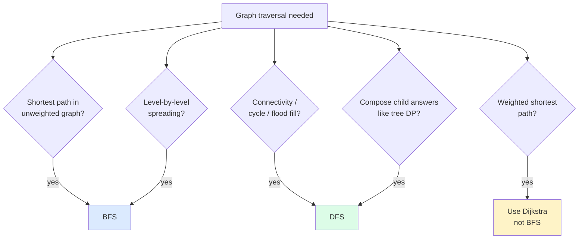

import { Callout } from 'fumadocs-ui/components/callout';

<Callout title="TL;DR — DFS / BFS / Islands">

**Use when**: you need to explore a graph (or 2D grid as implicit graph) — count connected components, find reachable nodes, shortest path in unweighted graphs, flood fill a region.

**Trigger phrases**: "connected components", "number of islands", "shortest path / fewest moves", "rotting oranges", "word ladder", "clone graph", "reachable", "surrounded regions".

**Two strategies, one mental model**:
- **DFS** — recursion or explicit stack. Goes as deep as possible before backtracking. Use for: connectivity, cycle detection, post-order composition, tree-like exploration.
- **BFS** — queue. Explores by distance from the source. Use for: shortest path in unweighted graph, level-by-level processing, multi-source spreading.

**Complexity**: O(V + E) for sparse graphs, O(V²) for dense adjacency-matrix representations.

</Callout>

---

## The problem that motivates this pattern

> **Number of Islands (LC 200).** Given an `m × n` binary grid where `'1'` is land and `'0'` is water, count the number of islands. An island is a maximal group of `'1'`s connected horizontally or vertically.
>
> Example:
> ```
> 11000
> 11000
> 00100
> 00011
> ```
> → 3 islands.

Naive brute force: not obvious. You'd have to compare every cell to every other to figure out which connected components exist. That's O((mn)²).

Insight: walk the grid cell by cell. When you find an unvisited `'1'`, **start a search** from it (DFS or BFS) and mark every connected land cell as visited. That whole search counts as **one island**. Repeat until every cell is checked.

```python
def num_islands(grid):
    if not grid: return 0
    m, n = len(grid), len(grid[0])
    count = 0

    def dfs(r, c):
        if r < 0 or r >= m or c < 0 or c >= n or grid[r][c] != '1':
            return
        grid[r][c] = '#'                              # mark as visited
        dfs(r+1, c); dfs(r-1, c); dfs(r, c+1); dfs(r, c-1)

    for r in range(m):
        for c in range(n):
            if grid[r][c] == '1':
                count += 1
                dfs(r, c)
    return count
```

O(mn). Each cell is visited at most once. **The double-loop is misleading — it doesn't make it O((mn)²)**. The outer loop scans for unvisited cells; the inner DFS marks them visited so the outer loop skips them next time.

This is the canonical 2D-grid-as-graph traversal. Once you see "grid of connected stuff," DFS or BFS is almost always the tool.

---

## The core insight

**Graphs (and 2D grids) are explored either by going *deep* (DFS) or by going *wide* (BFS). The structural choice depends on what you need from the traversal.**

### DFS — Depth-first

Recursion or explicit stack. When you arrive at a node, you commit fully to one path before backtracking.

The invariant:

> **When DFS returns from node X, every node reachable from X (within the same connected component) has been visited.**

This invariant is what makes DFS perfect for:
- **Connectivity** — does node X reach node Y? Run DFS from X; check if Y was visited.
- **Cycle detection** — track nodes "currently on the DFS stack"; revisiting one means a cycle.
- **Post-order composition** — see [Tree Traversals](/dsa/patterns/trees/traversals); the same idea works on graphs (assuming no cycles, or with a visited set).
- **Flood fill / coloring** — every reachable cell gets marked in one DFS call.

### BFS — Breadth-first

Queue. Explores nodes in order of distance (number of edges) from the source.

The invariant:

> **When BFS first visits node X, the path it took has the minimum number of edges from the source.**

This invariant is what makes BFS perfect for:
- **Shortest path in unweighted graphs** — first time you reach the destination, you've used the fewest edges.
- **Multi-source spreading** — start with multiple sources in the queue; everything spreads simultaneously (rotting oranges, walls and gates).
- **Level-by-level processing** — freeze queue size, process one layer at a time.

Notice: **BFS does NOT give shortest path in weighted graphs.** For that, you need [Dijkstra](/dsa/patterns/graphs/shortest-paths).



---

## Visual walkthrough — DFS on a grid

Trace **Number of Islands** on this grid:

```
1 1 0 0
1 1 0 0
0 0 1 0
0 0 0 1
```

```
Outer scan starts at (0,0). grid[0][0]='1' → count = 1, dfs(0,0).
  Mark (0,0)='#'. Visit (1,0)='1' → mark '#'. Visit (1,1)='1' → mark '#'.
    From (1,1), try (2,1)=0, (1,2)=0, etc. No further land.
  From (1,0), try (2,0)=0, (1,1)='#' visited. No further.
  From (0,0), try (0,1)='1' → mark '#'. (0,2)=0, etc. Visit (1,1)='#' visited. No more.
  DFS returns. Island 1 fully marked.

Outer scan continues. (0,1) is '#'. (0,2)..(0,3)=0. (1,0)..(1,1)='#'. (1,2)..(1,3)=0.
(2,0)..(2,1)=0. (2,2)='1' → count = 2, dfs(2,2). Marks (2,2). No neighbors.
(2,3)=0. (3,0)..(3,2)=0. (3,3)='1' → count = 3, dfs(3,3). Marks (3,3).

Result: 3.
```

Notice: **each cell is visited exactly twice** — once by the outer loop's scan, once by the DFS that touches it. Total: O(mn).

---

## Visual walkthrough — BFS spreading

Trace **Rotting Oranges (LC 994)** on:

```
2 1 1
1 1 0
0 1 1
```

`2` = rotten, `1` = fresh, `0` = empty. Each minute, every fresh orange adjacent to a rotten one becomes rotten. Return the minimum minutes for all oranges to rot, or `-1` if impossible.

**Multi-source BFS**: start with ALL rotten oranges in the queue at minute 0.

```
Minute 0:  Queue = [(0,0)] (the only rotten)
           Fresh count = 6

Minute 1:  Process (0,0). Its neighbors (0,1)=1 and (1,0)=1 become rotten.
           Queue for next minute = [(0,1), (1,0)]
           Fresh count = 4
           Grid: 2 2 1
                 2 1 0
                 0 1 1

Minute 2:  Process (0,1) → (0,2)=1 rots. Process (1,0) → (1,1)=1 rots.
           Queue next = [(0,2), (1,1)]
           Fresh count = 2

Minute 3:  Process (0,2) → no fresh neighbors. Process (1,1) → (2,1)=1 rots.
           Queue next = [(2,1)]
           Fresh count = 1

Minute 4:  Process (2,1) → (2,2)=1 rots.
           Queue next = [(2,2)]
           Fresh count = 0

Done. All rotten. Answer: 4.
```

The freeze-size trick (process all nodes at the current minute before incrementing) is what makes "minutes elapsed" come out correctly.

```python
from collections import deque

def oranges_rotting(grid):
    m, n = len(grid), len(grid[0])
    queue = deque()
    fresh = 0
    for r in range(m):
        for c in range(n):
            if grid[r][c] == 2: queue.append((r, c))
            elif grid[r][c] == 1: fresh += 1

    minutes = 0
    while queue and fresh > 0:
        size = len(queue)
        for _ in range(size):
            r, c = queue.popleft()
            for dr, dc in [(-1,0), (1,0), (0,-1), (0,1)]:
                nr, nc = r+dr, c+dc
                if 0 <= nr < m and 0 <= nc < n and grid[nr][nc] == 1:
                    grid[nr][nc] = 2
                    fresh -= 1
                    queue.append((nr, nc))
        minutes += 1

    return minutes if fresh == 0 else -1
```

---

## The template

### Template A — DFS on a graph

```python
def dfs(graph, start):
    visited = set()
    def visit(node):
        if node in visited: return
        visited.add(node)
        # process node here (pre-order)
        for neighbor in graph[node]:
            visit(neighbor)
        # process node here (post-order)
    visit(start)
```

Iterative version (when recursion depth is a concern):

```python
def dfs_iterative(graph, start):
    visited = {start}
    stack = [start]
    while stack:
        node = stack.pop()
        # process node
        for neighbor in graph[node]:
            if neighbor not in visited:
                visited.add(neighbor)
                stack.append(neighbor)
```

### Template B — BFS on a graph (shortest path / level order)

```python
from collections import deque

def bfs(graph, start, target):
    visited = {start}
    queue = deque([(start, 0)])                       # (node, distance)
    while queue:
        node, dist = queue.popleft()
        if node == target: return dist
        for neighbor in graph[node]:
            if neighbor not in visited:
                visited.add(neighbor)                  # mark when enqueued, not when popped
                queue.append((neighbor, dist + 1))
    return -1                                          # unreachable
```

**Critical detail**: mark `visited` when **enqueueing**, not when popping. Otherwise the same node gets queued multiple times before any of them get processed, blowing up runtime.

### Template C — 2D grid DFS (Number of Islands shape)

```python
DIRS = [(-1, 0), (1, 0), (0, -1), (0, 1)]              # 4-connectivity

def dfs_grid(grid, r, c):
    m, n = len(grid), len(grid[0])
    if r < 0 or r >= m or c < 0 or c >= n: return
    if grid[r][c] != '1': return
    grid[r][c] = '#'                                   # mark visited in place
    for dr, dc in DIRS:
        dfs_grid(grid, r + dr, c + dc)
```

For 8-connectivity (including diagonals), use 8 directions.

### Template D — 2D grid multi-source BFS

```python
def multi_source_bfs(grid, sources):
    m, n = len(grid), len(grid[0])
    queue = deque(sources)
    visited = set(sources)
    dist = 0
    while queue:
        for _ in range(len(queue)):
            r, c = queue.popleft()
            for dr, dc in DIRS:
                nr, nc = r+dr, c+dc
                if 0 <= nr < m and 0 <= nc < n and (nr, nc) not in visited:
                    visited.add((nr, nc))
                    queue.append((nr, nc))
        dist += 1
    return dist
```

The freeze-size trick gives you "distance from nearest source" naturally.

---

## Worked example: Word Ladder (LC 127)

> **Problem.** Given two words `begin` and `end` and a dictionary `wordList`, return the length of the shortest transformation sequence from `begin` to `end` such that:
> - Each adjacent pair differs by exactly one letter.
> - Each intermediate word must be in `wordList`.
>
> Example: `begin = "hit"`, `end = "cog"`, `wordList = ["hot","dot","dog","lot","log","cog"]` → `5` (hit → hot → dot → dog → cog).

**Why this is BFS.** "Shortest" + "unweighted edges" = BFS. Each word is a node; an edge connects two words that differ by one letter. We want the minimum number of edges from `begin` to `end`.

**The naive O(N²·L) approach**: build the full graph by comparing every pair of words. For 5000 words of length 10, that's 25M comparisons × 10 = 250M ops. Too slow.

**The trick — implicit graph via wildcards**: for each word in the dictionary, generate all "patterns" by replacing each letter with `*`. e.g., `"hot"` generates `"*ot"`, `"h*t"`, `"ho*"`. Index words by these patterns. To find neighbors of `"hot"`, look up its three patterns and grab everything else there. O(N·L²) total.

```python
from collections import defaultdict, deque

def ladder_length(begin: str, end: str, word_list: list[str]) -> int:
    if end not in word_list:
        return 0
    word_set = set(word_list)
    L = len(begin)

    # Build pattern index: "*ot" -> ["hot", "dot", "lot"]
    patterns = defaultdict(list)
    for word in word_set:
        for i in range(L):
            patterns[word[:i] + '*' + word[i+1:]].append(word)

    # BFS
    visited = {begin}
    queue = deque([(begin, 1)])                       # (word, steps_so_far)
    while queue:
        word, steps = queue.popleft()
        if word == end:
            return steps
        for i in range(L):
            pattern = word[:i] + '*' + word[i+1:]
            for neighbor in patterns[pattern]:
                if neighbor not in visited:
                    visited.add(neighbor)
                    queue.append((neighbor, steps + 1))
            patterns[pattern] = []                     # clear to avoid re-checking
    return 0
```

**Dry-run on the example:**

Patterns built:
- `*ot`: `hot, dot, lot`
- `h*t`: `hot`
- `ho*`: `hot`
- `d*t`: `dot`
- `do*`: `dot, dog`
- `l*t`: `lot`
- `lo*`: `lot, log`
- `*og`: `dog, log, cog`
- `d*g`: `dog`
- `l*g`: `log`
- `c*g`: `cog`
- `co*`: `cog`

BFS from `hit`:

| Step | Pop | Patterns of word | Neighbors found |
|------|-----|------------------|-----------------|
| 1 | `(hit, 1)` | `*it, h*t, hi*` | `hot` (via `h*t`) |
| 2 | `(hot, 2)` | `*ot, h*t, ho*` | `dot, lot` (via `*ot`) |
| 3 | `(dot, 3)` | `*ot, d*t, do*` | `dog` (via `do*`) |
| 4 | `(lot, 3)` | `*ot, l*t, lo*` | `log` (via `lo*`) |
| 5 | `(dog, 4)` | `*og, d*g, do*` | `cog, log` (`log` already visited) |
| 6 | `(log, 4)` | `*og, l*g, lo*` | already visited |
| 7 | `(cog, 5)` | matches `end` → return 5 ✓ |

**Complexity.** O(N·L²) — N words, L = length, L² patterns per word (each takes O(L) to build). Plus BFS itself is O(N·L) edges × O(L) for the work per visit.

---

## Variants

### Variant 1 — Connected Components / Number of Islands

The canonical 2D flood-fill. Outer scan; on unvisited land, run DFS/BFS to consume the whole island; count.

**Canonical problems**: 200 Number of Islands, 695 Max Area of Island, 463 Island Perimeter, 1254 Number of Closed Islands, 547 Number of Provinces (adjacency-matrix version).

### Variant 2 — Surrounded Regions / Boundary-anchored flood fill

Run DFS/BFS from the *boundary* to mark cells that can "escape." Anything not marked is fully surrounded.

```python
def solve(board):
    if not board: return
    m, n = len(board), len(board[0])
    def dfs(r, c):
        if r < 0 or r >= m or c < 0 or c >= n or board[r][c] != 'O':
            return
        board[r][c] = 'S'                              # safe (anchored to border)
        for dr, dc in DIRS: dfs(r+dr, c+dc)
    for r in range(m):
        dfs(r, 0); dfs(r, n-1)
    for c in range(n):
        dfs(0, c); dfs(m-1, c)
    for r in range(m):
        for c in range(n):
            board[r][c] = 'X' if board[r][c] == 'O' else ('O' if board[r][c] == 'S' else 'X')
```

**Canonical problems**: 130 Surrounded Regions, 1020 Number of Enclaves, 417 Pacific Atlantic Water Flow.

### Variant 3 — Shortest Path in Unweighted Graph (BFS)

The textbook BFS. Mark `visited` on enqueue.

**Canonical problems**: 127 Word Ladder (this page's worked example), 433 Minimum Genetic Mutation, 752 Open the Lock, 1129 Shortest Path with Alternating Colors.

### Variant 4 — Multi-Source BFS

Start the queue with multiple sources. Everything spreads in parallel.

**Canonical problems**: 994 Rotting Oranges, 542 01 Matrix (distance to nearest 0), 286 Walls and Gates, 1162 As Far from Land as Possible.

### Variant 5 — Cycle Detection

DFS with three colors: `WHITE` (unvisited), `GRAY` (on current path), `BLACK` (done). Revisiting a `GRAY` means a cycle.

```python
def has_cycle(graph, n):
    WHITE, GRAY, BLACK = 0, 1, 2
    color = [WHITE] * n
    def dfs(node):
        if color[node] == GRAY: return True            # back edge → cycle
        if color[node] == BLACK: return False
        color[node] = GRAY
        for nb in graph[node]:
            if dfs(nb): return True
        color[node] = BLACK
        return False
    return any(dfs(i) for i in range(n) if color[i] == WHITE)
```

**Canonical problems**: 207 Course Schedule (also see [Topological Sort](/dsa/patterns/graphs/topological-sort)), 261 Graph Valid Tree, 684 Redundant Connection (also see [Union-Find](/dsa/patterns/graphs/union-find)).

### Variant 6 — Bidirectional BFS

For shortest-path problems with a known target, BFS from both ends and meet in the middle. Cuts complexity from `O(b^d)` to `O(b^(d/2))`.

```python
def bidirectional_bfs(start, end, get_neighbors):
    if start == end: return 0
    front, back = {start}, {end}
    visited = {start, end}
    steps = 0
    while front and back:
        if len(front) > len(back): front, back = back, front
        steps += 1
        next_front = set()
        for node in front:
            for nb in get_neighbors(node):
                if nb in back: return steps
                if nb not in visited:
                    visited.add(nb)
                    next_front.add(nb)
        front = next_front
    return -1
```

Used in Word Ladder for big dictionaries, LinkedIn's degree-of-connection — see [LinkedIn Connections](/lld/case-studies/linkedin-connections).

### Variant 7 — Graph Clone

Pre-order DFS with a hash map `original_node → cloned_node`. Each node creates its clone first, then recurses to clone its neighbors.

```python
def clone_graph(node):
    if not node: return None
    clones = {}
    def dfs(n):
        if n in clones: return clones[n]
        clone = Node(n.val)
        clones[n] = clone
        clone.neighbors = [dfs(nb) for nb in n.neighbors]
        return clone
    return dfs(node)
```

**Canonical problems**: 133 Clone Graph, 138 Copy List with Random Pointer (linked-list variant).

### Variant 8 — Implicit Graph BFS

When the graph isn't materialized. Generate neighbors on the fly via a function.

**Canonical problems**: 752 Open the Lock, 773 Sliding Puzzle, 815 Bus Routes, 1376 Time Needed to Inform All Employees.

---

## Common pitfalls

| Trap | Fix |
|------|-----|
| Marking visited on dequeue (BFS) instead of on enqueue | Same node gets queued multiple times; runtime explodes. Always mark on enqueue. |
| Forgetting bounds check in 2D DFS | Causes IndexError or wrap-around. Always `0 <= r < m and 0 <= c < n`. |
| Using DFS for shortest path | DFS doesn't give shortest path; use BFS. DFS finds *a* path, not the shortest. |
| Stack overflow on deep grids (Python ~1000 limit) | Convert to iterative or `sys.setrecursionlimit(100000)`. |
| Mutating the grid in place when the spec says don't | Use a separate `visited` set. |
| Forgetting to use 4-direction vs 8-direction movement | Read the problem. 4-dir is default; some problems explicitly want diagonals. |
| Confusing "minimum moves" with "minimum cost" | BFS gives min moves (unweighted). For weighted, use [Dijkstra](/dsa/patterns/graphs/shortest-paths). |
| Multi-source BFS without initializing all sources | Push all rotten oranges (or all 0s, etc.) to the queue *before* starting the BFS loop. |
| Forgetting cycle detection state for directed graphs | Three colors needed (WHITE/GRAY/BLACK). A two-color visited set misses back edges. |
| Treating adjacency matrix as adjacency list | O(V²) per node iteration vs O(degree). For sparse graphs use adjacency list. |

---

## Complexity

**Time: O(V + E)** for adjacency-list-based graphs. Each vertex is visited once; each edge is traversed at most twice (once in each direction for undirected).

**Space: O(V)** for the visited set / queue / recursion stack.

For 2D grids of size `m × n` treated as graphs: O(mn) time (each cell is V; each edge to a neighbor is E, but there are only 4 edges per cell so E = O(V)).

For dense graphs represented as an adjacency matrix: O(V²) per traversal (you scan the full row for each node).

**Bidirectional BFS** cuts complexity to O(b^(d/2)) where b is branching factor and d is solution depth — huge for deep search trees.

---

## When NOT to use DFS / BFS

- **Weighted shortest path.** BFS only handles unweighted edges. Use [Dijkstra](/dsa/patterns/graphs/shortest-paths) for non-negative weights, Bellman-Ford for negative.
- **Dependency ordering.** While DFS does *find* one valid topological order, [Topological Sort](/dsa/patterns/graphs/topological-sort) is the more explicit pattern for ordering problems.
- **Dynamic connectivity (add edges over time, query connections).** [Union-Find](/dsa/patterns/graphs/union-find) is much faster — near-O(1) per operation amortized.
- **Pathfinding with a heuristic.** Use A* (Dijkstra + heuristic) — same skeleton but with a different priority.
- **Cycle detection in undirected graph during edge addition.** [Union-Find](/dsa/patterns/graphs/union-find) is cleaner — check if endpoints already connected.
- **The graph is too large to materialize.** Use iterative-deepening DFS, bidirectional BFS, or other space-efficient variants.

### Decision rule

| Symptom | Likely pattern |
|---------|---------------|
| "Count connected components / islands" | **DFS or BFS** (either works) |
| "Shortest path / fewest moves (unweighted)" | **BFS** |
| "Shortest path with weights" | [Dijkstra](/dsa/patterns/graphs/shortest-paths) |
| "Flood fill / boundary-anchored regions" | **DFS** (recursion-friendly) |
| "Spread simultaneously from multiple sources" | **Multi-source BFS** |
| "Cycle in directed graph" | **DFS with 3 colors** |
| "Cycle in undirected graph" | **DFS or Union-Find** |
| "Dependency / topological order" | [Topological Sort](/dsa/patterns/graphs/topological-sort) |
| "Clone a graph" | **DFS with hashmap of clones** |
| "Word ladder / state-space search" | **BFS** on implicit graph |
| "Dynamic connectivity" | [Union-Find](/dsa/patterns/graphs/union-find) |

---

## Real-world applications

- **Web crawlers.** Spider's traversal is a graph BFS over the link structure of the web.
- **Social network "people you may know."** BFS to 2nd/3rd-degree connections — see [LinkedIn Connections](/lld/case-studies/linkedin-connections).
- **Game AI pathfinding.** A* (a flavor of weighted BFS / Dijkstra) for NPC navigation.
- **Network routing.** BFS for hop count; Dijkstra for least-cost path.
- **Garbage collection (mark phase).** DFS or BFS from GC roots, marking every reachable object.
- **Compilers — dead code elimination.** Reachability analysis is DFS/BFS over the control-flow graph.
- **Cluster discovery in data analysis.** DBSCAN clustering uses BFS-like expansion from seed points.
- **Maze solving.** Both DFS (any path) and BFS (shortest path) work.

---

## Curated practice problems

| # | Problem | Difficulty | Variant | Note |
|---|---------|-----------|---------|------|
| 1 | ★ 200 Number of Islands | Medium | 2D flood fill | The canonical |
| 2 | 695 Max Area of Island | Medium | 2D flood fill + count | Track area during DFS |
| 3 | 547 Number of Provinces | Medium | Adjacency matrix DFS | Like 200 but with matrix not grid |
| 4 | 133 Clone Graph | Medium | DFS + hashmap | The clone pattern |
| 5 | ★ 994 Rotting Oranges | Medium | Multi-source BFS | This page's intro |
| 6 | 542 01 Matrix | Medium | Multi-source BFS | Distance to nearest 0 |
| 7 | 286 Walls and Gates | Medium | Multi-source BFS | Distance to nearest gate |
| 8 | ★ 127 Word Ladder | Hard | BFS on implicit graph | This page's worked example |
| 9 | 752 Open the Lock | Medium | BFS on state space | Implicit graph of 10000 states |
| 10 | 773 Sliding Puzzle | Hard | BFS on board states | Encode state as a string |
| 11 | ★ 130 Surrounded Regions | Medium | Boundary-anchored flood fill | Reverse-engineer escape |
| 12 | 417 Pacific Atlantic Water Flow | Medium | Two boundary BFS / DFS | Cells reachable from both oceans |
| 13 | 1971 Find if Path Exists in Graph | Easy | Plain DFS/BFS | The "is reachable" classic |
| 14 | 261 Graph Valid Tree | Medium | DFS for cycle + connectivity | Or Union-Find |
| 15 | 1376 Time to Inform All Employees | Medium | DFS post-order on tree-DAG | Max time among children |
| 16 | 815 Bus Routes | Hard | BFS on bus-route graph | Treat each route as a "supernode" |
| 17 | 980 Unique Paths III | Hard | DFS with backtracking | Count paths visiting all empty cells |

---

## Related patterns

- [Topological Sort](/dsa/patterns/graphs/topological-sort) — DFS-based ordering for DAGs
- [Union-Find](/dsa/patterns/graphs/union-find) — alternative for dynamic connectivity
- [Shortest Paths](/dsa/patterns/graphs/shortest-paths) — Dijkstra is BFS with a heap
- [Backtracking](/dsa/patterns/recursion/backtracking) — DFS that explicitly tracks the current path
- [Binary Tree Traversals](/dsa/patterns/trees/traversals) — DFS/BFS specialized to trees

---

## Quick-reference card

```python
DIRS = [(-1,0), (1,0), (0,-1), (0,1)]

# DFS on grid (recursive)
def dfs(r, c):
    if r<0 or r>=m or c<0 or c>=n or grid[r][c] != '1': return
    grid[r][c] = '#'
    for dr, dc in DIRS: dfs(r+dr, c+dc)

# BFS on grid (single source, level-aware)
from collections import deque
q = deque([(sr, sc)]); visited = {(sr, sc)}; steps = 0
while q:
    for _ in range(len(q)):
        r, c = q.popleft()
        for dr, dc in DIRS:
            nr, nc = r+dr, c+dc
            if (0<=nr<m and 0<=nc<n and (nr,nc) not in visited):
                visited.add((nr,nc)); q.append((nr,nc))
    steps += 1

# Multi-source BFS
q = deque(initial_sources); visited = set(initial_sources)
# ... same loop ...

# DFS on graph (cycle detection, 3-color)
WHITE, GRAY, BLACK = 0, 1, 2
color = [WHITE] * n
def dfs(u):
    if color[u] == GRAY: return True   # cycle
    if color[u] == BLACK: return False
    color[u] = GRAY
    for v in graph[u]:
        if dfs(v): return True
    color[u] = BLACK
    return False
```

Triggers: connected components, islands, shortest path (unweighted), flood fill, cycle, clone graph. Complexity: O(V + E).
