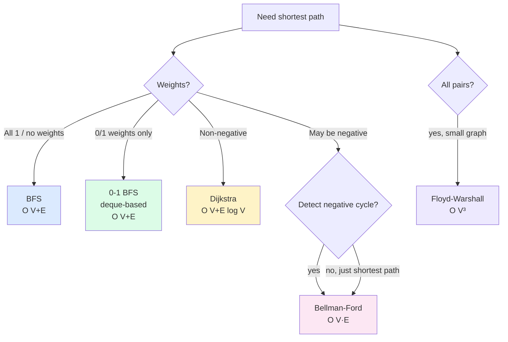

import { Callout } from 'fumadocs-ui/components/callout';

<Callout title="TL;DR — Shortest Paths">

**Use when**: you need the minimum-cost path in a weighted graph — single source to one or all other nodes.

**Trigger phrases**: "network delay time", "shortest path with weights", "cheapest flight", "minimum effort path", "minimum cost to reach", "swim in rising water".

**Three algorithms, picked by edge weights**:
- **BFS** — unweighted (or unit-weighted) graphs. O(V + E).
- **Dijkstra** — non-negative weights. Heap-based. O((V + E) log V).
- **Bellman-Ford** — may have negative edges; detects negative cycles. O(V · E).

**Plus**: Floyd-Warshall for all-pairs (O(V³)), 0-1 BFS for 0/1 weights (O(V + E) with a deque), A* with a heuristic.

</Callout>

---

## The problem that motivates this pattern

> **Network Delay Time (LC 743).** A signal is sent from node `k` in a directed graph with `n` nodes. Each edge `[u, v, w]` means it takes `w` time for the signal to travel from `u` to `v`. Return the time for all nodes to receive the signal, or `-1` if impossible.

This is "single-source shortest path" in disguise. We need:
1. The shortest path from `k` to *every* node.
2. The answer is the maximum of those distances (the slowest-arriving node).
3. If any node is unreachable, return `-1`.

Brute force: try all paths. Exponential.

The pattern: **maintain a `dist[]` array initialized to infinity. Process nodes in order of distance discovered so far. For each, "relax" outgoing edges — update neighbors' distances if going through this node is shorter.**

For non-negative weights, this is **Dijkstra's algorithm**. The trick is using a **min-heap** to always extract the closest unprocessed node next.

```python
import heapq
from collections import defaultdict

def network_delay_time(times, n, k):
    graph = defaultdict(list)
    for u, v, w in times:
        graph[u].append((v, w))

    dist = {i: float('inf') for i in range(1, n+1)}
    dist[k] = 0
    heap = [(0, k)]                                  # (distance, node)

    while heap:
        d, u = heapq.heappop(heap)
        if d > dist[u]: continue                     # stale entry
        for v, w in graph[u]:
            if dist[u] + w < dist[v]:
                dist[v] = dist[u] + w
                heapq.heappush(heap, (dist[v], v))

    max_dist = max(dist.values())
    return max_dist if max_dist < float('inf') else -1
```

O((V + E) log V). For each edge, we do at most one heap push (log V). For each pop, we process at most O(degree) edges.

The deeper insight: **shortest-path algorithms differ only in *which node to relax next*.** BFS pops the next node in arrival order. Dijkstra pops the closest. Bellman-Ford relaxes every edge V−1 times. The structure of the algorithm — relax outgoing edges, update dist — is the same.

---

## The core insight

**Pick the algorithm by your graph's edge weights:**



### Dijkstra — the greedy non-negative case

The invariant:

> **When a node `u` is popped from the heap, `dist[u]` is the final shortest distance from source to `u`.**

This invariant holds *only* if all weights are non-negative. With negative weights, a node could be popped, then a later edge with a negative weight could create a shorter path — too late to fix.

### Bellman-Ford — handle negatives

The invariant:

> **After `k` iterations of relaxing all edges, every node has its shortest distance using paths of *at most `k` edges*.**

V-1 iterations suffice (any shortest path uses at most V-1 edges). A Vth iteration that still updates distances indicates a negative cycle.

### BFS — unweighted

The invariant:

> **When BFS first visits a node, it does so via the path with the *fewest edges*.**

Since each edge contributes weight 1, fewest edges = shortest distance.

### 0-1 BFS — the elegant special case

When weights are only 0 or 1, you can use a **deque**: push to the *front* on weight-0 edges (no cost), to the *back* on weight-1 edges. The deque maintains the dist-monotonic invariant of Dijkstra without needing a heap. O(V + E).

---

## Visual walkthrough — Dijkstra

Trace Dijkstra on this graph from source `A`:

```
    A ──4──▶ B
    │        │
    1        2
    ▼        ▼
    C ──3──▶ D
    │        ▲
    5        1
    ▼        │
    E ───────┘
```

Adjacency: `A → B (4), A → C (1), B → D (2), C → D (3), C → E (5), E → D (1)`.

```
Initial:  dist = {A:0, B:∞, C:∞, D:∞, E:∞}
          heap = [(0, A)]

Step 1: pop (0, A).
  Relax A→B: dist[B] = 0+4 = 4. heap = [(4, B)].
  Relax A→C: dist[C] = 0+1 = 1. heap = [(1, C), (4, B)].

Step 2: pop (1, C).
  Relax C→D: dist[D] = 1+3 = 4. heap = [(4, B), (4, D)].
  Relax C→E: dist[E] = 1+5 = 6. heap = [(4, B), (4, D), (6, E)].

Step 3: pop (4, B).
  Relax B→D: 4+2 = 6 > dist[D]=4 → no update.

Step 4: pop (4, D).
  D has no outgoing edges.

Step 5: pop (6, E).
  Relax E→D: 6+1 = 7 > dist[D]=4 → no update.

Done. dist = {A:0, B:4, C:1, D:4, E:6}.
```

Note that **D was visited via C → D (4), not via the longer C → E → D (7)**. The heap naturally orders processing by current best distance, so the shorter path was found first.

---

## The template

### Template A — Dijkstra (non-negative weights)

```python
import heapq
from collections import defaultdict

def dijkstra(graph: dict, source: int) -> dict:
    """graph: dict mapping node → list of (neighbor, weight)
    Returns dict mapping node → shortest distance from source.
    """
    dist = defaultdict(lambda: float('inf'))
    dist[source] = 0
    heap = [(0, source)]                             # (distance, node)
    visited = set()

    while heap:
        d, u = heapq.heappop(heap)
        if u in visited: continue                    # stale entry, skip
        visited.add(u)
        for v, w in graph.get(u, []):
            new_dist = d + w
            if new_dist < dist[v]:
                dist[v] = new_dist
                heapq.heappush(heap, (new_dist, v))

    return dict(dist)
```

**Three slots:**

1. **Graph representation** — adjacency list (above) or matrix.
2. **What to track** — usually just `dist[]`. For path reconstruction, also track `parent[]`.
3. **Early exit** — if you only want the distance to a specific target, return as soon as you pop it.

### Template B — Bellman-Ford (handles negatives, detects neg-cycle)

```python
def bellman_ford(n, edges, source):
    """edges: list of (u, v, w). Returns (dist, has_negative_cycle)."""
    dist = [float('inf')] * n
    dist[source] = 0

    # Relax all edges V-1 times
    for _ in range(n - 1):
        updated = False
        for u, v, w in edges:
            if dist[u] + w < dist[v]:
                dist[v] = dist[u] + w
                updated = True
        if not updated: break                        # early termination

    # One more pass: any update means negative cycle
    for u, v, w in edges:
        if dist[u] + w < dist[v]:
            return dist, True                        # negative cycle reachable from source

    return dist, False
```

### Template C — BFS (unweighted)

```python
from collections import deque

def bfs_shortest(graph, source, target=None):
    dist = {source: 0}
    queue = deque([source])
    while queue:
        u = queue.popleft()
        if u == target: return dist[u]
        for v in graph[u]:
            if v not in dist:
                dist[v] = dist[u] + 1
                queue.append(v)
    return dist
```

See [DFS/BFS](/dsa/patterns/graphs/dfs-bfs) for more depth on BFS.

### Template D — 0-1 BFS (deque for 0/1 weights)

```python
from collections import deque

def zero_one_bfs(graph, source, target=None):
    dist = defaultdict(lambda: float('inf'))
    dist[source] = 0
    dq = deque([source])
    while dq:
        u = dq.popleft()
        for v, w in graph[u]:                        # w is 0 or 1
            if dist[u] + w < dist[v]:
                dist[v] = dist[u] + w
                if w == 0: dq.appendleft(v)          # front: same distance
                else:      dq.append(v)              # back: distance + 1
    return dist
```

**Canonical problems**: 1368 Minimum Cost to Make at Least One Valid Path in a Grid.

### Template E — Floyd-Warshall (all-pairs)

```python
def floyd_warshall(n, edges):
    INF = float('inf')
    dist = [[INF] * n for _ in range(n)]
    for i in range(n): dist[i][i] = 0
    for u, v, w in edges:
        dist[u][v] = w
    for k in range(n):                               # intermediate
        for i in range(n):
            for j in range(n):
                if dist[i][k] + dist[k][j] < dist[i][j]:
                    dist[i][j] = dist[i][k] + dist[k][j]
    return dist
```

O(V³). Only practical for V ≤ ~400.

---

## Worked example: Cheapest Flights Within K Stops (LC 787)

> **Problem.** A graph of `n` cities with flights `[from, to, price]`. Given `src`, `dst`, and an integer `k`, return the cheapest price from `src` to `dst` using at most `k` stops (i.e., at most `k+1` flights). Return `-1` if no such route exists.

**Why this is tricky.** Standard Dijkstra doesn't directly handle the "at most K stops" constraint. A node can be reached cheaply via many stops or expensively via few stops — and we need to consider both.

**The fix — augment the state.** Treat the state as `(node, stops_used)` instead of just `node`. Two algorithms work:

1. **Modified BFS / Bellman-Ford** — relax all edges `k+1` times. After `i` iterations, `dist[i][v]` = cheapest cost to reach `v` using at most `i` flights.
2. **Dijkstra on (node, stops_used)** — heap stores `(cost, node, stops_used)`. Skip if stops exceed `k+1`.

The Bellman-Ford-style approach is simpler:

```python
def find_cheapest_price(n: int, flights: list[list[int]], src: int, dst: int, k: int) -> int:
    INF = float('inf')
    # dist[v] = min cost to reach v so far
    dist = [INF] * n
    dist[src] = 0

    # At most k+1 edges allowed (k stops means k+1 flight legs)
    for _ in range(k + 1):
        new_dist = dist[:]                            # snapshot
        for u, v, w in flights:
            if dist[u] != INF and dist[u] + w < new_dist[v]:
                new_dist[v] = dist[u] + w
        dist = new_dist

    return dist[dst] if dist[dst] != INF else -1
```

**The `new_dist = dist[:]` snapshot is the key.** Without it, you might use an edge twice in a single iteration (path counted as a single hop when it's actually two). The snapshot ensures each iteration of the outer loop adds **at most one edge** to every path.

**Dry-run on `n = 4, flights = [[0,1,100], [1,2,100], [2,0,100], [1,3,600], [2,3,200]], src = 0, dst = 3, k = 1`:**

| Iter | Relaxations applied | dist (after) |
|------|---------------------|--------------|
| Initial | — | [0, ∞, ∞, ∞] |
| 1 (k=0, ≤1 edge) | 0→1: dist[1]=100 | [0, 100, ∞, ∞] |
| 2 (k=1, ≤2 edges) | 1→2: dist[2]=200; 1→3: dist[3]=700 | [0, 100, 200, 700] |

**Answer: 700** (via 0→1→3, two flights, one stop).

Note: the cheaper path 0→1→2→3 = 400 has *two stops*, exceeding `k=1`. Excluded correctly.

**Complexity.** O((k+1) · E). For k=n-1, that's O(V·E) — same as Bellman-Ford.

---

## Variants

### Variant 1 — Single-source shortest path (Dijkstra)

The canonical case. All weights non-negative, one source, all destinations.

**Canonical problems**: 743 Network Delay Time, 1631 Path With Minimum Effort, 1514 Path with Maximum Probability (Dijkstra with multiply instead of add — negate log).

### Variant 2 — Modified state (Dijkstra on tuples)

When the "node" in shortest path isn't just a graph node but a richer state — `(node, stops_used)`, `(node, parity)`, `(node, last_action)`.

**Canonical problems**: 787 Cheapest Flights Within K Stops (this page's worked example), 1928 Minimum Cost to Reach Destination in Time, 2045 Second Minimum Time to Reach Destination.

### Variant 3 — Multi-source Dijkstra

Push all sources into the heap at distance 0. Run normal Dijkstra. The result is "distance to nearest source."

**Canonical problems**: 1631 Path With Minimum Effort (variant with custom edge weight = absolute difference), 778 Swim in Rising Water (binary search OR Dijkstra with max-instead-of-sum).

### Variant 4 — BFS / 0-1 BFS

For unweighted or 0/1-weighted graphs, use simpler algorithms.

**Canonical problems**: 1091 Shortest Path in Binary Matrix (BFS), 1368 Minimum Cost to Make Path in Grid (0-1 BFS).

### Variant 5 — Bellman-Ford / Negative cycle detection

When the graph has negative edges or you need to detect negative cycles.

**Canonical problems**: 787 (Bellman-Ford-style works here too), 743 (alternative implementation).

### Variant 6 — Floyd-Warshall (all-pairs)

O(V³). Use when V is small and you need *all* pairwise distances.

**Canonical problems**: 1334 Find the City With the Smallest Number of Neighbors at a Threshold Distance, 743 (overkill for one source but valid).

### Variant 7 — Path reconstruction

Augment with a `parent[]` array. After Dijkstra, walk `parent[dst]` backward to source.

```python
parent = {source: None}
# ...
if new_dist < dist[v]:
    dist[v] = new_dist
    parent[v] = u
    heapq.heappush(heap, (new_dist, v))

# Reconstruct
path = []
cur = target
while cur is not None:
    path.append(cur)
    cur = parent[cur]
path.reverse()
```

### Variant 8 — A* search (with heuristic)

Dijkstra with a heuristic `h(node)` estimating distance to target. Push `(g + h, node)` where `g` is actual distance. If `h` is *admissible* (never overestimates), A* finds optimal path while exploring fewer nodes than Dijkstra.

```python
# A* template (same as Dijkstra, just with heuristic in priority)
heap = [(heuristic(source), 0, source)]
while heap:
    f, g, u = heapq.heappop(heap)
    if u == target: return g
    for v, w in graph[u]:
        new_g = g + w
        if new_g < dist[v]:
            dist[v] = new_g
            heapq.heappush(heap, (new_g + heuristic(v), new_g, v))
```

Used in game AI pathfinding, robotics, route planning. Manhattan distance is the classic admissible heuristic for grid problems.

---

## Common pitfalls

| Trap | Fix |
|------|-----|
| Using Dijkstra with negative weights | Wrong — use Bellman-Ford. Dijkstra's greedy assumption breaks |
| Forgetting to skip stale heap entries | `if d > dist[u]: continue` after popping |
| Marking visited too early in Dijkstra | Mark on *pop*, not on push (BFS marks on push; Dijkstra marks on pop) |
| Not handling unreachable nodes | After algorithm, check `dist[v] == INF` |
| Path reconstruction without parent[] | Augment with `parent[]` if you need the path, not just the distance |
| Modifying `dist` during iteration in Bellman-Ford | For "at most K edges," snapshot `dist` per iteration |
| Using Floyd-Warshall on a sparse graph with large V | O(V³) is wasteful — use V repeated Dijkstras instead |
| Returning float infinity as the answer | Convert to -1 or another sentinel before returning |
| Mistaking BFS distance for weighted shortest path | BFS gives min *hops*, not min *cost* |
| Using A* with an inadmissible heuristic | Might find a suboptimal path. Heuristic must never overestimate |

---

## Complexity

**Dijkstra (binary heap):** O((V + E) log V). Each node popped once (V pops); each edge causes at most one heap push (E pushes); each operation is O(log V).

**Dijkstra (Fibonacci heap):** O(E + V log V) — theoretical, rarely used in practice.

**Bellman-Ford:** O(V · E). V-1 iterations × E edges per iteration.

**BFS:** O(V + E). Each node and edge visited once.

**0-1 BFS:** O(V + E). Same as BFS but uses deque.

**Floyd-Warshall:** O(V³). All-pairs.

**A\*:** O(b^d) worst case where b = branching factor, d = depth. With good heuristic, much faster than Dijkstra.

---

## When NOT to use these

- **The graph is unweighted.** Don't reach for Dijkstra — BFS is simpler and just as fast for unit weights.
- **You need shortest path with **most** edges or with a path-length constraint.** Use augmented-state Dijkstra (track `(node, edges_used)`) or [DP](/dsa/patterns/dp/linear).
- **All-pairs on a sparse graph.** Floyd-Warshall is O(V³). Run Dijkstra from each source — O(V·(V+E) log V) is faster for sparse.
- **The graph is huge and you only need one source-target pair.** Bidirectional Dijkstra (or A* with a heuristic) is significantly faster in practice.
- **The graph is a DAG.** Just topological sort + DP — O(V+E). Much simpler than Dijkstra and handles negative weights.
- **You need *longest* path.** NP-hard in general graphs. In a DAG, topological sort + DP works.

### Decision rule

| Symptom | Likely algorithm |
|---------|-----------------|
| "Shortest path, unweighted" | **BFS** |
| "Shortest path, non-negative weights" | **Dijkstra** |
| "Shortest path, may have negatives" | **Bellman-Ford** |
| "Detect negative cycle" | **Bellman-Ford** |
| "All-pairs, small graph" | **Floyd-Warshall** |
| "Shortest path, 0/1 weights" | **0-1 BFS (deque)** |
| "At most K edges in path" | **Bellman-Ford-style** with K iterations |
| "Pathfinding with target known" | **A\*** with admissible heuristic |
| "Shortest path in DAG" | Topological sort + DP |
| "K-th shortest path" | Modified Dijkstra (Yen's algorithm) |

---

## Real-world applications

- **Google Maps / Waze / Uber routing.** Dijkstra (or A* with a contraction hierarchy) for driving directions. Tens of millions of nodes.
- **Network routing (BGP, OSPF).** OSPF uses Dijkstra (link-state routing).
- **Game AI pathfinding.** A* dominates. Most game engines have built-in A* implementations.
- **Robotics motion planning.** A*, RRT, etc.
- **Currency arbitrage detection.** Bellman-Ford on a graph where edges are exchange rates (negative log). A negative cycle = profit opportunity.
- **Critical-path analysis in project management.** Longest path in a DAG (topological sort + DP).
- **Phylogenetic trees in bioinformatics.** Shortest path in similarity graphs.
- **Network latency optimization.** "Minimum cost path" across an internal CDN topology.

---

## Curated practice problems

| # | Problem | Difficulty | Variant | Note |
|---|---------|-----------|---------|------|
| 1 | ★ 743 Network Delay Time | Medium | Single-source Dijkstra | The canonical |
| 2 | 1631 Path With Minimum Effort | Medium | Dijkstra with max-instead-of-sum | Edge cost = absolute diff |
| 3 | 1514 Path with Maximum Probability | Medium | Dijkstra with multiplication | Convert via -log |
| 4 | ★ 787 Cheapest Flights Within K Stops | Medium | Bellman-Ford OR augmented Dijkstra | This page's worked example |
| 5 | 1928 Min Cost to Reach Destination in Time | Hard | Dijkstra on (node, time) state | |
| 6 | 2045 Second Minimum Time to Reach Destination | Hard | Dijkstra tracking 1st and 2nd best | |
| 7 | ★ 1091 Shortest Path in Binary Matrix | Medium | BFS with 8 directions | 0-1 cells, unit edges |
| 8 | 1293 Shortest Path in Grid With Obstacles Elimination | Hard | BFS on (cell, obstacles_used) | Augmented state |
| 9 | 778 Swim in Rising Water | Hard | Dijkstra with max | Or binary search + BFS |
| 10 | 1368 Min Cost to Make Path | Hard | 0-1 BFS | Free edge in original direction |
| 11 | 1976 Number of Ways to Arrive at Destination | Medium | Dijkstra + path count DP | Track count of shortest paths |
| 12 | 1334 Find City With Smallest Reach | Medium | Floyd-Warshall | All-pairs |
| 13 | 882 Reachable Nodes In Subdivided Graph | Hard | Dijkstra with edge-fragment accounting | |
| 14 | 1786 Number of Restricted Paths From First to Last | Medium | Dijkstra from last + DP from first | Composition |
| 15 | 1102 Path With Maximum Minimum Value | Medium | Max-heap Dijkstra (variant) | Maximize the minimum edge |

---

## Related patterns

- [DFS / BFS / Islands](/dsa/patterns/graphs/dfs-bfs) — BFS is the unweighted shortest path
- [Heap / Top-K](/dsa/patterns/heaps/heap) — Dijkstra uses a heap as priority queue
- [Topological Sort](/dsa/patterns/graphs/topological-sort) — shortest path in DAGs uses topological + DP
- [Union-Find](/dsa/patterns/graphs/union-find) — Kruskal's MST is the connectivity analog (different problem, similar pattern)
- [Binary Search](/dsa/patterns/arrays-strings/binary-search) — "binary search on answer + reachability check" is sometimes faster than Dijkstra

---

## Quick-reference card

```python
import heapq

# Dijkstra (non-negative weights)
def dijkstra(graph, source):
    dist = {source: 0}
    heap = [(0, source)]
    while heap:
        d, u = heapq.heappop(heap)
        if d > dist.get(u, float('inf')): continue
        for v, w in graph.get(u, []):
            nd = d + w
            if nd < dist.get(v, float('inf')):
                dist[v] = nd
                heapq.heappush(heap, (nd, v))
    return dist

# Bellman-Ford (handles negatives, detects neg cycle)
def bellman_ford(n, edges, source):
    dist = [float('inf')] * n; dist[source] = 0
    for _ in range(n - 1):
        for u, v, w in edges:
            if dist[u] + w < dist[v]:
                dist[v] = dist[u] + w
    for u, v, w in edges:
        if dist[u] + w < dist[v]: return None         # neg cycle
    return dist

# 0-1 BFS
from collections import deque
dist = {source: 0}; dq = deque([source])
while dq:
    u = dq.popleft()
    for v, w in graph[u]:
        if dist[u] + w < dist.get(v, float('inf')):
            dist[v] = dist[u] + w
            if w == 0: dq.appendleft(v)
            else: dq.append(v)
```

Triggers: "shortest path", "minimum cost", "network delay", "cheapest flight", "minimum effort". Complexity: O((V+E) log V) for Dijkstra.
