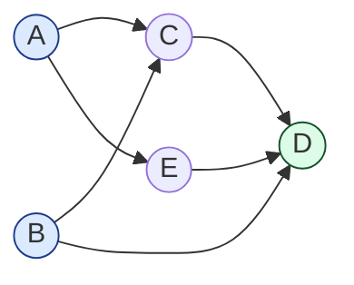

import { Callout } from 'fumadocs-ui/components/callout';

<Callout title="TL;DR — Topological Sort">

**Use when**: you have a directed acyclic graph (DAG) and need an order respecting dependencies — or you need to *check* whether such an order exists (cycle detection).

**Trigger phrases**: "course schedule", "build order", "task dependencies", "alien dictionary", "prerequisites", "compile order", "package install order", "DAG ordering".

**Two implementations** (both O(V + E)):
- **Kahn's algorithm** — BFS-style, uses in-degree counters. Detects cycles naturally (if any node has in-degree > 0 at the end, there's a cycle).
- **DFS post-order** — recursive, prepend to result on return. The reverse of post-order gives a valid topological order.

**Complexity**: O(V + E) for both.

</Callout>

---

## The problem that motivates this pattern

> **Course Schedule II (LC 210).** There are `n` courses labeled `0` to `n-1`. You're given `prerequisites[i] = [a, b]` meaning you must take `b` before `a`. Return any ordering you could take the courses in, or `[]` if impossible.

This is **not a search problem** — there's no "shortest" or "minimum." It's an *ordering* problem. The structure: a directed graph where an edge `b → a` means "b must come before a."

We need to produce a linear list that:
1. Includes every course exactly once.
2. For every edge `b → a`, `b` appears before `a`.

If a cycle exists, no such ordering is possible — return empty.

The brute-force search is exponential (try all `n!` orderings). The insight: **pick a course with no remaining prerequisites; do it; remove it from the graph; repeat.**

```python
from collections import deque, defaultdict

def find_order(n, prerequisites):
    graph = defaultdict(list)
    indegree = [0] * n
    for a, b in prerequisites:
        graph[b].append(a)
        indegree[a] += 1

    # Start with all courses having no prerequisites
    queue = deque(i for i in range(n) if indegree[i] == 0)
    order = []

    while queue:
        node = queue.popleft()
        order.append(node)
        for next_course in graph[node]:
            indegree[next_course] -= 1
            if indegree[next_course] == 0:
                queue.append(next_course)

    return order if len(order) == n else []
```

**O(V + E).** Each node is enqueued once; each edge contributes one decrement.

**The cycle detection falls out for free**: if any node remains with `indegree > 0` at the end, it's stuck inside a cycle. No ordering exists. Return empty.

That's the pattern: **topological sort isn't just an algorithm — it's the lens for any "dependencies → order" problem.**

---

## The core insight

**A topological order exists iff the graph is a DAG (no cycles). The algorithm both produces the order AND detects cycles in a single pass.**

### Kahn's algorithm — the "remove leaves" view

The invariant:

> **At every step, the queue contains exactly the nodes whose prerequisites have all been processed.**

Start by enqueueing all nodes with in-degree 0 (no prerequisites). Each time you pop one and "complete" it, decrement the in-degree of its successors; any that drop to 0 are now ready. If at the end you've completed every node, you have a valid order. If you couldn't (some nodes remain with in-degree > 0), there's a cycle.

### DFS post-order — the "prepend on return" view

Alternative invariant:

> **A node is fully processed (post-order) only after all its descendants are. Reverse post-order gives an order where every node precedes its dependents.**

Run DFS. When a node finishes (returns from recursion), prepend it to the answer. The reverse of finish-order is a valid topological order.

This is also how cycle detection works in DFS (3-color marking): a "gray-to-gray" back-edge means a cycle.

### Why both work

Both algorithms exploit the same fundamental property of DAGs: **a DAG has at least one node with in-degree 0**. Without that, every node has at least one prerequisite, forming a cycle.

Kahn's processes the "earliest" nodes first (BFS-like). DFS finds the "latest" nodes first (deepest descendants) and reverses. They yield different valid orderings — but both are valid.



For this DAG, two valid topological orders are `A, B, C, E, D` and `B, A, E, C, D`. Both respect every edge. (Kahn's would produce them based on tie-breaking among nodes with in-degree 0 at each step.)

---

## Visual walkthrough — Kahn's algorithm

Trace **Course Schedule II** on `n = 6, prerequisites = [[1,0], [2,0], [3,1], [3,2], [4,3], [5,4]]`.

```
Graph:
0 → 1 → 3 → 4 → 5
0 → 2 → 3

In-degrees:  [0, 1, 1, 2, 1, 1]
Queue (in-degree 0):  [0]
Order:  []

Step 1: pop 0. Order = [0].
  Decrement successors of 0: 1 (now 0), 2 (now 0).
  Queue: [1, 2]
  In-degrees: [-, 0, 0, 2, 1, 1]

Step 2: pop 1. Order = [0, 1].
  Decrement successors of 1: 3 (now 1).
  Queue: [2]
  In-degrees: [-, -, 0, 1, 1, 1]

Step 3: pop 2. Order = [0, 1, 2].
  Decrement successors of 2: 3 (now 0).
  Queue: [3]
  In-degrees: [-, -, -, 0, 1, 1]

Step 4: pop 3. Order = [0, 1, 2, 3].
  Decrement successors of 3: 4 (now 0).
  Queue: [4]

Step 5: pop 4. Order = [0, 1, 2, 3, 4].
  Decrement successors of 4: 5 (now 0).
  Queue: [5]

Step 6: pop 5. Order = [0, 1, 2, 3, 4, 5].
  Queue empty. Done.

len(order) == 6 == n → valid. Return [0, 1, 2, 3, 4, 5].
```

The algorithm finishes in 6 pops. **Each node is processed exactly once. Each edge is traversed exactly once (the decrement). Total: O(V + E).**

---

## Visual walkthrough — DFS post-order

Same graph. Run DFS from any unvisited node, mark colors, prepend on finish.

```
DFS(0):
  DFS(1):
    DFS(3):
      DFS(4):
        DFS(5):
          finish 5 → order = [5]
        finish 4 → order = [4, 5]
      finish 3 → order = [3, 4, 5]
    finish 1 → order = [1, 3, 4, 5]
  DFS(2):
    DFS(3): already BLACK, skip.
    finish 2 → order = [2, 1, 3, 4, 5]
  finish 0 → order = [0, 2, 1, 3, 4, 5]

Result: [0, 2, 1, 3, 4, 5]
```

A different valid order than Kahn's gave (Kahn's was `[0, 1, 2, 3, 4, 5]`). **Both are correct.** The choice of algorithm doesn't affect correctness, only the specific ordering produced.

---

## The template

### Template A — Kahn's algorithm (BFS-based)

```python
from collections import deque, defaultdict

def topological_sort(n: int, edges: list[tuple[int, int]]) -> list[int]:
    """Returns a topological order, or [] if a cycle exists.
    edges[i] = (a, b) means a must come before b (a → b).
    """
    graph = defaultdict(list)
    indegree = [0] * n
    for a, b in edges:
        graph[a].append(b)
        indegree[b] += 1

    queue = deque(i for i in range(n) if indegree[i] == 0)
    order = []

    while queue:
        node = queue.popleft()
        order.append(node)
        for neighbor in graph[node]:
            indegree[neighbor] -= 1
            if indegree[neighbor] == 0:
                queue.append(neighbor)

    return order if len(order) == n else []         # cycle if not all processed
```

**Three slots**:

1. **Edge direction** — be careful: `prerequisites = [a, b]` in LC usually means "take b before a," so edge is `b → a` (b is prerequisite of a). Read the spec.
2. **Cycle handling** — if `len(order) < n`, return empty list or raise.
3. **Multiple valid orders** — use a heap instead of a deque if you need lexicographic smallest order.

### Template B — DFS post-order

```python
def topological_sort_dfs(n: int, edges: list[tuple[int, int]]) -> list[int]:
    graph = defaultdict(list)
    for a, b in edges:
        graph[a].append(b)

    WHITE, GRAY, BLACK = 0, 1, 2
    color = [WHITE] * n
    order = []

    def dfs(node: int) -> bool:
        if color[node] == GRAY: return False          # cycle (back edge)
        if color[node] == BLACK: return True
        color[node] = GRAY
        for neighbor in graph[node]:
            if not dfs(neighbor): return False
        color[node] = BLACK
        order.append(node)                            # post-order
        return True

    for i in range(n):
        if color[i] == WHITE and not dfs(i):
            return []                                  # cycle detected

    return order[::-1]                                # reverse for topological order
```

The three-color invariant detects cycles. The post-order-then-reverse pattern produces the topological order.

### Template C — "Just detect a cycle"

If you only need cycle detection (not the order), Kahn's is simpler — check `len(processed) == n`.

```python
def has_cycle(n, edges):
    graph = defaultdict(list)
    indegree = [0] * n
    for a, b in edges:
        graph[a].append(b)
        indegree[b] += 1
    queue = deque(i for i in range(n) if indegree[i] == 0)
    processed = 0
    while queue:
        node = queue.popleft()
        processed += 1
        for nb in graph[node]:
            indegree[nb] -= 1
            if indegree[nb] == 0:
                queue.append(nb)
    return processed != n
```

This is what **Course Schedule (LC 207)** asks for — just yes/no.

---

## Worked example: Alien Dictionary (LC 269)

> **Problem.** Given a list of words sorted lexicographically in a foreign language with unknown alphabet ordering, derive any possible ordering of the alphabet's letters. Return `""` if no valid ordering exists.
>
> Example: `["wrt", "wrf", "er", "ett", "rftt"]` → `"wertf"` (one valid ordering).

**Why this is topological sort.** The unknown alphabet ordering is a *total order* on the letters. From the sorted word list, we can extract *pairwise constraints* between letters: comparing two adjacent words, the first differing character tells us "X comes before Y."

These constraints form a directed graph: edge `X → Y` means "X precedes Y." A valid alphabet order is a topological order of this graph.

**Three slots from the template**:

1. **Build the graph**: compare each pair of adjacent words; find the first differing character; add edge.
2. **Handle the edge case**: if word `w₁` is a prefix of `w₂` but `w₁` is longer (e.g., `["abc", "ab"]`), it violates lex order — return `""`.
3. **Topological sort**: Kahn's. If a cycle exists, return `""`.

```python
from collections import defaultdict, deque

def alien_order(words: list[str]) -> str:
    # Collect all distinct letters
    letters = set(''.join(words))
    graph = defaultdict(set)
    indegree = {c: 0 for c in letters}

    # Build edges from adjacent word pairs
    for w1, w2 in zip(words, words[1:]):
        # Edge case: w1 longer prefix of w2 invalid
        if len(w1) > len(w2) and w1.startswith(w2):
            return ""
        for c1, c2 in zip(w1, w2):
            if c1 != c2:
                if c2 not in graph[c1]:
                    graph[c1].add(c2)
                    indegree[c2] += 1
                break                                  # only first differing pair matters

    # Kahn's BFS
    queue = deque(c for c in letters if indegree[c] == 0)
    order = []
    while queue:
        c = queue.popleft()
        order.append(c)
        for nb in graph[c]:
            indegree[nb] -= 1
            if indegree[nb] == 0:
                queue.append(nb)

    return ''.join(order) if len(order) == len(letters) else ""
```

**Dry-run on `["wrt", "wrf", "er", "ett", "rftt"]`:**

Pairwise comparisons:
- `wrt` vs `wrf`: first diff at index 2 → edge `t → f`.
- `wrf` vs `er`: first diff at index 0 → edge `w → e`.
- `er` vs `ett`: first diff at index 1 → edge `r → t`.
- `ett` vs `rftt`: first diff at index 0 → edge `e → r`.

Graph:
- `t → f`
- `w → e`
- `r → t`
- `e → r`

In-degrees: `{w: 0, e: 1, r: 1, t: 1, f: 1}`.

Kahn's:
1. Queue = `[w]`. Pop `w`. Order = `[w]`. Decrement `e` to 0. Queue = `[e]`.
2. Pop `e`. Order = `[w, e]`. Decrement `r` to 0. Queue = `[r]`.
3. Pop `r`. Order = `[w, e, r]`. Decrement `t` to 0. Queue = `[t]`.
4. Pop `t`. Order = `[w, e, r, t]`. Decrement `f` to 0. Queue = `[f]`.
5. Pop `f`. Order = `[w, e, r, t, f]`. Done.

**Result: `"wertf"`** ✓.

**Complexity.** O(C + Σ|words|) where C is the alphabet size. The edge-building dominates for word-heavy inputs.

---

## Variants

### Variant 1 — Course Schedule (yes/no)

Just check whether a topological order exists.

**Canonical problems**: 207 Course Schedule (yes/no), 261 Graph Valid Tree (cycle + connectivity).

### Variant 2 — Course Schedule II (actual order)

Return the order, or `[]` on cycle.

**Canonical problems**: 210 Course Schedule II.

### Variant 3 — Alien Dictionary

Topological sort on an *inferred* graph from data.

**Canonical problems**: 269 Alien Dictionary (this page's worked example), 953 Verifying an Alien Dictionary (different — verify, don't construct).

### Variant 4 — Lexicographically smallest order

Use a **min-heap** instead of a deque so the smallest available node is processed first.

```python
import heapq
def smallest_topological_order(n, edges):
    # ... build graph and indegree ...
    heap = [i for i in range(n) if indegree[i] == 0]
    heapq.heapify(heap)
    order = []
    while heap:
        node = heapq.heappop(heap)
        order.append(node)
        for nb in graph[node]:
            indegree[nb] -= 1
            if indegree[nb] == 0:
                heapq.heappush(heap, nb)
    return order if len(order) == n else []
```

**Canonical problem**: 1203 Sort Items by Groups Respecting Dependencies.

### Variant 5 — Topological Sort on a DAG with multiple components

The basic templates handle this — they iterate over *all* nodes, not just those reachable from a single source. Just make sure you start DFS / Kahn's from every unvisited node.

### Variant 6 — Longest Path in DAG (DP on topological order)

Topological sort the graph, then process nodes in that order, accumulating `dp[v] = max(dp[u] + weight(u,v)) for u in predecessors(v)`.

This is the *only* O(V+E) shortest/longest path algorithm for DAGs with negative weights. For general graphs with negative weights, you'd need Bellman-Ford. See [Shortest Paths](/dsa/patterns/graphs/shortest-paths).

**Canonical problems**: 329 Longest Increasing Path in a Matrix (DFS + memoization, but topological sort works too), 1857 Largest Color Value in a Directed Graph.

### Variant 7 — Detect Cycle in Directed Graph (DFS 3-color)

Sometimes you only need cycle detection, not the order. DFS with WHITE/GRAY/BLACK colors:

```python
def has_cycle_directed(graph, n):
    WHITE, GRAY, BLACK = 0, 1, 2
    color = [WHITE] * n
    def dfs(u):
        if color[u] == GRAY: return True
        if color[u] == BLACK: return False
        color[u] = GRAY
        for v in graph[u]:
            if dfs(v): return True
        color[u] = BLACK
        return False
    return any(dfs(i) for i in range(n) if color[i] == WHITE)
```

A gray-to-gray edge is a **back edge** in DFS terminology — the signature of a cycle.

---

## Common pitfalls

| Trap | Fix |
|------|-----|
| Confusing edge direction | "Take a before b" → edge `a → b`. "a depends on b" → edge `b → a`. Read carefully |
| Forgetting to handle disconnected components | Iterate over all nodes, not just from one source |
| Returning early when queue is empty but not all processed | The "not all processed" case is the cycle case. Always check `len(order) == n` |
| Adding to in-degree before initializing in-degree array for all nodes | Initialize `indegree` for *all* nodes first, then iterate edges |
| Using `set()` for the graph then iterating order isn't deterministic | If reproducible output matters, use `sorted()` or a list |
| Decrementing in-degree before checking if it's 0 | The pattern is "decrement; if 0, enqueue" — both operations are needed |
| Off-by-one between "process n nodes" and "iterate n times" | Always count processed nodes; never assume loop iterations |
| Kahn's algorithm with duplicate edges | Use a `set` of (a, b) pairs first to dedupe, then build indegree |
| Forgetting that "alphabet" letters might not all appear | Initialize indegree for *every distinct character*, not just those in edges |
| DFS post-order without reversing | The result of post-order IS post-order. Topological order is *reverse* post-order |

---

## Complexity

**Time: O(V + E)** for both Kahn's and DFS.
- Kahn's: each node is enqueued once (V) and each edge causes one decrement (E).
- DFS: each node and edge is visited once.

**Space: O(V + E)** for the graph adjacency list, plus O(V) for the queue/recursion stack and visited markers.

For dense graphs in matrix form, building the adjacency list is O(V²); the traversal itself is then linear in the actual edges.

---

## When NOT to use topological sort

- **The graph has cycles by design.** Topological sort is meaningless on a cyclic graph. Use SCC (Strongly Connected Components) algorithms instead (Tarjan/Kosaraju) — out of scope here.
- **You need shortest path** (not just *an* order). For shortest path in a DAG, topological-sort first, then DP — but for general graphs, use [Dijkstra](/dsa/patterns/graphs/shortest-paths).
- **The graph is undirected.** Topological sort requires direction. For undirected cycle detection or component count, use [DFS/BFS](/dsa/patterns/graphs/dfs-bfs) or [Union-Find](/dsa/patterns/graphs/union-find).
- **You don't actually need an order, just to count something.** "How many valid orderings exist?" is a combinatorics question (often hard); topological sort returns one.
- **Dynamic dependency graph (edges added/removed online).** Recomputing topological sort each time is expensive. Use a different DS like dynamic connectivity or an incremental topological sort algorithm.

### Decision rule

| Symptom | Likely pattern |
|---------|---------------|
| "Order respecting prerequisites" | **Topological Sort** |
| "Can these tasks all complete? / valid schedule?" | **Topological Sort + cycle check** |
| "Cycle in directed graph?" | **DFS 3-color** or **Kahn's** |
| "Lexicographically smallest order" | **Kahn's with heap** |
| "Shortest path in DAG" | **Topological sort + DP** |
| "Cycle in undirected graph" | [Union-Find](/dsa/patterns/graphs/union-find) or DFS |
| "Connected components" | [DFS/BFS](/dsa/patterns/graphs/dfs-bfs) |
| "Reachable from source in DAG" | [DFS/BFS](/dsa/patterns/graphs/dfs-bfs) |

---

## Real-world applications

- **Build systems / package managers.** `make`, `npm`, `pip`, `cargo`, `bazel` — all do topological sort on dependency graphs to determine compile/install order.
- **Spreadsheet calculation.** When cell A depends on cell B, recompute B first. Excel and Google Sheets do topological sort on the cell dependency graph.
- **Database query optimizers.** Joins and operators form a DAG; topological order determines execution order.
- **Linker / loader.** Object files with symbol dependencies — the linker resolves them in topological order.
- **Task schedulers** (Airflow, Luigi, Dagster). Workflows are DAGs; tasks run in topological order with parallelism on nodes with no remaining dependencies.
- **CI/CD pipelines.** Stages with dependencies — `build → test → deploy` is a tiny topological order.
- **Course planning software.** Universities use it to verify and present valid course sequences.

---

## Curated practice problems

| # | Problem | Difficulty | Variant | Note |
|---|---------|-----------|---------|------|
| 1 | ★ 207 Course Schedule | Medium | Yes/no cycle check | The canonical |
| 2 | ★ 210 Course Schedule II | Medium | Return order | The canonical with output |
| 3 | 261 Graph Valid Tree | Medium | Cycle + connected | Cycle check on undirected — DFS or Union-Find |
| 4 | ★ 269 Alien Dictionary | Hard | Build graph from words | This page's worked example |
| 5 | 953 Verifying an Alien Dictionary | Easy | Given order, verify | Not topological sort — just pair-comparison |
| 6 | 444 Sequence Reconstruction | Medium | Verify uniqueness of order | Kahn's queue must always be size 1 |
| 7 | 1203 Sort Items by Groups | Hard | Two-level topological sort | Sort groups, then sort within groups |
| 8 | 310 Minimum Height Trees | Medium | Trim leaves iteratively | Kahn's-like on undirected (in-degree = 1) |
| 9 | 1136 Parallel Courses | Medium | Topological sort + level counting | Count "rounds" needed |
| 10 | 2050 Parallel Courses III | Hard | Topological sort + DP for time | Longest path through DAG |
| 11 | 329 Longest Increasing Path in Matrix | Hard | DFS + memo (implicit DAG) | Or topological-sort approach |
| 12 | 1857 Largest Color Value in Directed Graph | Hard | Toposort + DP | DP[v][c] = max count of color c reaching v |
| 13 | 802 Find Eventual Safe States | Medium | Reverse graph + topological sort | "Nodes that don't lead to cycles" |

---

## Related patterns

- [DFS / BFS / Islands](/dsa/patterns/graphs/dfs-bfs) — DFS is a building block of topological sort
- [Union-Find](/dsa/patterns/graphs/union-find) — alternative for *undirected* cycle / connectivity
- [Shortest Paths](/dsa/patterns/graphs/shortest-paths) — topological sort + DP gives O(V+E) shortest path on a DAG
- [DP — Tree DP](/dsa/patterns/dp/tree-dp) — DP on a tree is special-case DP on a DAG with topological order = post-order

---

## Quick-reference card

```python
from collections import deque, defaultdict

# Kahn's algorithm — returns order, or [] on cycle
def toposort(n, edges):                              # edges: list of (a, b) for a → b
    graph = defaultdict(list)
    indeg = [0] * n
    for a, b in edges:
        graph[a].append(b)
        indeg[b] += 1
    q = deque(i for i in range(n) if indeg[i] == 0)
    order = []
    while q:
        u = q.popleft()
        order.append(u)
        for v in graph[u]:
            indeg[v] -= 1
            if indeg[v] == 0: q.append(v)
    return order if len(order) == n else []

# DFS post-order
def toposort_dfs(n, edges):
    graph = defaultdict(list)
    for a, b in edges: graph[a].append(b)
    WHITE, GRAY, BLACK = 0, 1, 2
    color = [WHITE] * n; order = []
    def dfs(u):
        if color[u] == GRAY: return False
        if color[u] == BLACK: return True
        color[u] = GRAY
        for v in graph[u]:
            if not dfs(v): return False
        color[u] = BLACK
        order.append(u)
        return True
    for i in range(n):
        if color[i] == WHITE and not dfs(i): return []
    return order[::-1]
```

Triggers: "prerequisites", "build order", "course schedule", "alien dictionary", "cycle in directed graph". Complexity: O(V + E).
