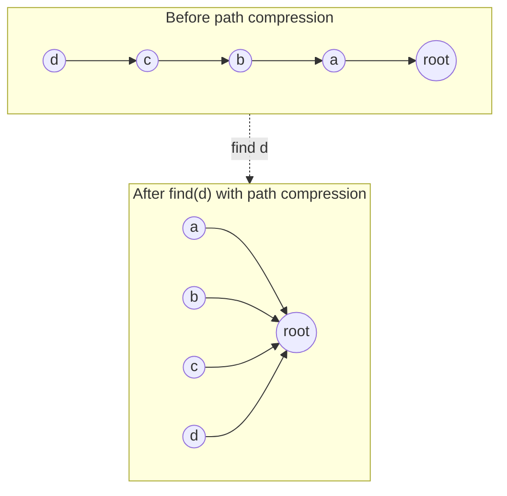

import { Callout } from 'fumadocs-ui/components/callout';

<Callout title="TL;DR — Union-Find">

**Use when**: you need to track and query *connectivity* as edges are added — "are X and Y in the same group?" repeated thousands of times.

**Trigger phrases**: "number of connected components", "redundant connection", "accounts merge", "graph valid tree", "satisfiability of equality equations", "Kruskal's MST", "earliest moment when everyone becomes friends".

**The data structure**: a forest. Each tree represents one component. The root identifies the component.

**Two optimizations** make it near-O(1) per op:
- **Path compression** — on `find`, flatten the path so future queries are direct.
- **Union by rank / size** — when merging, attach the smaller tree under the larger.

**Complexity**: O(α(n)) per operation amortized, where α is the inverse Ackermann function. For all practical n, α(n) ≤ 4. Effectively constant.

</Callout>

---

## The problem that motivates this pattern

> **Number of Provinces (LC 547).** There are `n` cities. `isConnected[i][j] = 1` means city `i` and `j` are directly connected. A province is a group of directly or indirectly connected cities. Return the number of provinces.

You can solve this with [DFS](/dsa/patterns/graphs/dfs-bfs): walk the adjacency matrix, find connected components, count them. O(n²).

But suppose the problem changes: **edges are added dynamically** — `addConnection(i, j)` — and at any moment you might be asked "how many provinces are there?" Running DFS from scratch on every query is O(n²) per query. Brutal.

Union-Find solves this: each operation is near-O(1) amortized. After processing all the edges, the answer is "how many distinct roots are there?"

```python
class UnionFind:
    def __init__(self, n):
        self.parent = list(range(n))
        self.rank = [0] * n
        self.count = n                              # number of components

    def find(self, x):
        while self.parent[x] != x:
            self.parent[x] = self.parent[self.parent[x]]  # path compression
            x = self.parent[x]
        return x

    def union(self, x, y):
        rx, ry = self.find(x), self.find(y)
        if rx == ry: return False                    # already in same set
        if self.rank[rx] < self.rank[ry]:
            rx, ry = ry, rx
        self.parent[ry] = rx
        if self.rank[rx] == self.rank[ry]:
            self.rank[rx] += 1
        self.count -= 1
        return True
```

For LC 547, just call `union(i, j)` for every connected pair, then read `count`. O(n² · α(n)) total. Effectively O(n²) — and the data structure remains usable for queries afterward.

The deeper power: **Union-Find lets you treat connectivity as an *online* relation, updating in real time as edges arrive.** That's a different shape than DFS/BFS, which assume the graph is fully built before traversal.

---

## The core insight

**Each set is a tree. The root is the set's "name." All operations reduce to finding the root.**

The invariant we maintain:

> **Two elements are in the same set iff they have the same root.**

That's it. From this single invariant:
- `find(x)` — walk from `x` up to the root via `parent` pointers.
- `union(x, y)` — find both roots; if different, make one the parent of the other (merging the trees).
- `connected(x, y)` — `find(x) == find(y)`.

Without optimizations, find takes O(h) where h is tree height. Worst case (degenerate chain): O(n) per op → O(n²) total. Bad.

**The two optimizations turn it into the fastest data structure ever invented for this problem:**

1. **Union by rank/size** — when merging two trees, attach the *shorter* one under the *taller*. This keeps the tree shape balanced. Worst case becomes O(log n) per find.

2. **Path compression** — during `find`, redirect every node on the path directly to the root. Future finds from any of those nodes are O(1).

Combined, they give the famous **amortized O(α(n))** complexity. α is the inverse Ackermann function, which is ≤ 4 for any n you'll ever see in practice. Effectively constant time per operation.



After one `find(d)`, every node on the path now points *directly* to the root. Future queries are O(1).

---

## Visual walkthrough

Let's trace Union-Find on `n = 6` with operations `union(0, 1), union(2, 3), union(0, 2), union(4, 5), connected(1, 3), connected(0, 5)`.

```
Initial:  parent = [0, 1, 2, 3, 4, 5]   (each node is its own root)
          rank   = [0, 0, 0, 0, 0, 0]
          components: {0}, {1}, {2}, {3}, {4}, {5}    count = 6

union(0, 1):
  find(0) = 0, find(1) = 1, different.
  Ranks equal. Attach 1 under 0. Increment rank[0].
  parent = [0, 0, 2, 3, 4, 5]
  rank   = [1, 0, 0, 0, 0, 0]
  components: {0, 1}, {2}, {3}, {4}, {5}    count = 5

union(2, 3):
  find(2) = 2, find(3) = 3, different.
  Attach 3 under 2. Increment rank[2].
  parent = [0, 0, 2, 2, 4, 5]
  rank   = [1, 0, 1, 0, 0, 0]
  components: {0, 1}, {2, 3}, {4}, {5}    count = 4

union(0, 2):
  find(0) = 0 (rank 1), find(2) = 2 (rank 1), different.
  Ranks equal. Attach 2 under 0. Increment rank[0].
  parent = [0, 0, 0, 2, 4, 5]
  rank   = [2, 0, 1, 0, 0, 0]
  components: {0, 1, 2, 3}, {4}, {5}    count = 3

union(4, 5):
  Attach 5 under 4.
  parent = [0, 0, 0, 2, 4, 4]
  components: {0, 1, 2, 3}, {4, 5}    count = 2

connected(1, 3):
  find(1) = (parent 0, root 0)
  find(3) walks: parent 2, parent 0 → root 0
    With path compression, parent[3] = 0 now.
  Same root → CONNECTED.
  parent = [0, 0, 0, 0, 4, 4]

connected(0, 5):
  find(0) = 0, find(5) = 4. Different → NOT CONNECTED.
```

Notice the magic at `connected(1, 3)`: the path-compressed find updated `parent[3]` directly to 0, making any future `find(3)` O(1).

---

## The template

### Template — The full class

```python
class UnionFind:
    def __init__(self, n: int):
        self.parent = list(range(n))
        self.rank = [0] * n
        self.count = n

    def find(self, x: int) -> int:
        # Iterative with path compression (parent → grandparent)
        while self.parent[x] != x:
            self.parent[x] = self.parent[self.parent[x]]   # path halving
            x = self.parent[x]
        return x

    def union(self, x: int, y: int) -> bool:
        rx, ry = self.find(x), self.find(y)
        if rx == ry:
            return False                                   # already same set
        # Union by rank: smaller rank attaches under larger
        if self.rank[rx] < self.rank[ry]:
            rx, ry = ry, rx
        self.parent[ry] = rx
        if self.rank[rx] == self.rank[ry]:
            self.rank[rx] += 1
        self.count -= 1
        return True

    def connected(self, x: int, y: int) -> bool:
        return self.find(x) == self.find(y)
```

**Memorize this class.** It's worth ~5 minutes to write from scratch in an interview, and it powers ~10 different problem types.

**Three slots:**

1. **What `find` does on path traversal** — path halving (above) or full path compression (recurse and rewrite parent). Both work.
2. **What `union` attaches by** — rank (tree height, classic) or size (number of nodes, sometimes useful when you want O(1) size queries).
3. **What you track on the side** — `count` of components, sizes, group properties. Customize as the problem requires.

### Template variant — Union by size

When you need O(1) "how big is this group?":

```python
class UnionFindBySize:
    def __init__(self, n):
        self.parent = list(range(n))
        self.size = [1] * n
        self.count = n

    def find(self, x):
        while self.parent[x] != x:
            self.parent[x] = self.parent[self.parent[x]]
            x = self.parent[x]
        return x

    def union(self, x, y):
        rx, ry = self.find(x), self.find(y)
        if rx == ry: return False
        if self.size[rx] < self.size[ry]:
            rx, ry = ry, rx
        self.parent[ry] = rx
        self.size[rx] += self.size[ry]
        self.count -= 1
        return True

    def size_of(self, x):
        return self.size[self.find(x)]
```

---

## Worked example: Redundant Connection (LC 684)

> **Problem.** A tree with `n` nodes and `n-1` edges is given as a graph. One extra edge has been added, forming a cycle. Find an edge that, if removed, would restore the tree property. Return the *last* such edge in the input order.
>
> Example: `edges = [[1,2],[1,3],[2,3]]` → `[2,3]` (removing it leaves a valid tree).

**Why this is Union-Find.** As we add edges one by one, the *first* edge that connects two already-connected nodes is the redundant one. With Union-Find, we can detect this in O(α(n)) per edge.

**What changes from the template.**

1. **Process edges in order.**
2. **Detect cycle on union failure**: if `union(u, v)` returns `False`, both endpoints were already in the same set — the new edge creates a cycle.
3. **Return that edge.**

```python
def find_redundant_connection(edges: list[list[int]]) -> list[int]:
    n = len(edges)
    uf = UnionFind(n + 1)                            # nodes are 1-indexed

    for u, v in edges:
        if not uf.union(u, v):
            return [u, v]                            # this edge closed the cycle
    return []                                         # unreachable per problem spec
```

**Dry-run on `[[1,2], [1,3], [2,3]]`:**

| Edge | find(u), find(v) | Same set? | Union? | Action |
|------|------------------|-----------|--------|--------|
| (1,2) | 1, 2 | no | success | parent[2] = 1 |
| (1,3) | 1, 3 | no | success | parent[3] = 1 |
| (2,3) | 1, 1 | YES | failure | **return [2, 3]** |

**Answer: `[2, 3]`** ✓.

**Complexity.** O(n · α(n)) ≈ O(n). Each edge: one union (two finds + possible parent update). Each operation is amortized O(α(n)) ≤ O(4).

**Why is this faster than DFS for cycle detection?** DFS on an undirected graph requires a parent-marker to avoid false cycles from "back to where I came from." It works, but it's O(V+E) for a one-shot check. Union-Find is O(α) per edge added, and it handles streaming naturally — as more edges come in, you just keep unioning.

---

## Variants

### Variant 1 — Count Connected Components

The most basic application. Maintain `count` field, decrement on every successful union.

**Canonical problems**: 547 Number of Provinces, 323 Number of Connected Components in an Undirected Graph, 1319 Number of Operations to Make Network Connected.

### Variant 2 — Cycle Detection in Undirected Graph

Walk through edges; on each, call `union`. If `union` returns `False`, you've found the cycle-creating edge.

**Canonical problems**: 684 Redundant Connection (this page's worked example), 261 Graph Valid Tree (no cycle AND fully connected), 685 Redundant Connection II (directed — trickier).

### Variant 3 — Accounts Merge / Group by Equivalence Relation

When you have many "equivalence" pairs (e.g., emails belong to same person), Union-Find merges them into groups.

```python
def accounts_merge(accounts):
    uf = UnionFind(len(accounts))
    email_to_idx = {}
    for i, account in enumerate(accounts):
        for email in account[1:]:
            if email in email_to_idx:
                uf.union(i, email_to_idx[email])
            else:
                email_to_idx[email] = i
    # Collect emails by root
    groups = defaultdict(list)
    for email, idx in email_to_idx.items():
        groups[uf.find(idx)].append(email)
    return [[accounts[root][0]] + sorted(emails) for root, emails in groups.items()]
```

**Canonical problems**: 721 Accounts Merge, 952 Largest Component Size by Common Factor, 1202 Smallest String With Swaps.

### Variant 4 — Kruskal's MST

Sort edges by weight; add each in turn; if it doesn't create a cycle (union returns True), keep it. Stop when you have `n-1` edges.

```python
def kruskal_mst(n, edges):                          # edges: list of (weight, u, v)
    edges.sort()
    uf = UnionFind(n)
    total = 0
    for w, u, v in edges:
        if uf.union(u, v):
            total += w
            if uf.count == 1: break                 # MST complete
    return total
```

**Canonical problems**: 1135 Connecting Cities with Minimum Cost, 1584 Min Cost to Connect All Points.

### Variant 5 — Offline Processing (sort queries by time)

For problems where edges/queries arrive in different orders, you can sometimes *re-sort* them so Union-Find sees them in a friendly order. Common in "earliest day when X happens" problems.

```python
# 1101 — The Earliest Moment When Everyone Become Friends
def earliest_acq(logs, n):
    logs.sort()
    uf = UnionFind(n)
    for t, a, b in logs:
        if uf.union(a, b) and uf.count == 1:
            return t
    return -1
```

**Canonical problems**: 1101 Earliest Moment When Everyone Become Friends, 1632 Rank Transform of a Matrix, 803 Bricks Falling When Hit (reverse the demolitions).

### Variant 6 — Weighted Union-Find (with per-edge weights)

Augment each node with a "weight relative to root." Useful for equality/ratio problems.

```python
# 399 Evaluate Division
class WeightedUF:
    def __init__(self):
        self.parent = {}
        self.weight = {}                            # weight from x to its parent

    def add(self, x):
        if x not in self.parent:
            self.parent[x] = x
            self.weight[x] = 1.0

    def find(self, x):
        if self.parent[x] != x:
            orig_parent = self.parent[x]
            self.parent[x] = self.find(orig_parent)
            self.weight[x] *= self.weight[orig_parent]
        return self.parent[x]

    def union(self, x, y, ratio):                   # x = ratio * y
        rx, ry = self.find(x), self.find(y)
        if rx == ry: return
        self.parent[rx] = ry
        self.weight[rx] = ratio * self.weight[y] / self.weight[x]
```

**Canonical problems**: 399 Evaluate Division, 990 Satisfiability of Equality Equations.

### Variant 7 — Union-Find on a 2D Grid (with coordinate-to-index encoding)

For 2D problems, encode `(r, c)` as `r * cols + c`.

```python
def encode(r, c, cols): return r * cols + c
```

Then run normal Union-Find. Useful for "number of islands when adding land one at a time."

**Canonical problems**: 305 Number of Islands II (online), 200 Number of Islands (DFS is easier here), 130 Surrounded Regions (Union-Find or DFS).

---

## Common pitfalls

| Trap | Fix |
|------|-----|
| Implementing `find` without path compression | Degenerates to O(n) per op in worst case. Always include path compression |
| Implementing `union` without rank or size | Can produce trees of height n. Always include the optimization |
| Recursive `find` blowing the stack on long chains | Iterative version (above) avoids this |
| Calling `union(parent[x], parent[y])` instead of `union(find(x), find(y))` | Wrong — parent isn't necessarily root. Always `find` first |
| Forgetting to decrement `count` on union | Component count becomes wrong |
| Using Union-Find on a *directed* graph for cycle detection | Doesn't work directly — DFS with 3-color is the right tool for directed cycles |
| Off-by-one in 1-indexed vs 0-indexed problems | Initialize `n+1` if problem is 1-indexed |
| Forgetting to add nodes that appear in edges but not by index | For problems with arbitrary keys (strings), use a dict-based Union-Find and add as you see |
| Returning the wrong edge in cycle detection | "Last edge that closes the cycle" — return immediately on union failure |
| Comparing endpoints' values instead of their roots | `connected(x, y)` is `find(x) == find(y)`, not `parent[x] == parent[y]` |

---

## Complexity

**Time per operation: O(α(n))** amortized, where α is the inverse Ackermann function. For n = 10⁸⁰, α(n) ≤ 4. **Effectively constant.**

**For m operations on n elements**: O(m · α(n)). The proof (Hopcroft-Ullman, then tightened by Tarjan) is non-trivial — but the result is famous as one of the few non-trivial data-structure complexities in CS.

**Space: O(n)** for parent and rank/size arrays.

**Without path compression**: O(log n) per op with union by rank.
**Without union by rank**: O(log n) per op with path compression.
**Without either**: O(n) per op worst case.

In practice, Union-Find is the fastest known algorithm for dynamic connectivity. There's no real alternative.

---

## When NOT to use Union-Find

- **You need to *remove* edges (split components).** Union-Find supports merging, not splitting. For dynamic decomposition, use Link-Cut trees (advanced) or maintain the structure differently.
- **The graph is fully built and you just want one connectivity check.** A single DFS/BFS is simpler. Union-Find shines when you have *many* queries.
- **You need shortest paths.** Union-Find tracks connectivity, not distances. Use [BFS / Dijkstra](/dsa/patterns/graphs/shortest-paths).
- **The graph is directed.** Union-Find doesn't preserve direction. For directed cycle detection, use DFS with 3-color marking.
- **You need to enumerate all elements in a group.** Union-Find tells you "which group" but doesn't directly give "members of group." Maintain a separate `group_root → set` map if needed.
- **You need to query specific path lengths inside a tree.** Union-Find flattens the tree via path compression, destroying that information.

### Decision rule

| Symptom | Likely pattern |
|---------|---------------|
| "Connected components" | [DFS/BFS](/dsa/patterns/graphs/dfs-bfs) (offline) OR **Union-Find** (online) |
| "Streaming connectivity queries" | **Union-Find** |
| "Cycle in undirected graph" | **Union-Find** (cycle on `union` failure) |
| "Cycle in directed graph" | DFS with 3-color (not Union-Find) |
| "Minimum spanning tree" | **Kruskal (Union-Find)** or Prim (heap) |
| "Accounts merge / equivalence groups" | **Union-Find** |
| "Equality / ratio equations" | **Weighted Union-Find** |
| "Earliest moment when X happens" | **Union-Find** + sort by time |
| "Dynamic split (remove edges)" | NOT Union-Find — use Link-Cut tree or offline approach |

---

## Real-world applications

- **Kruskal's MST in network design.** Building a fiber-optic backbone connecting cities at minimum cost — Kruskal's with Union-Find.
- **Image segmentation.** Region-growing algorithms in computer vision merge adjacent pixels into segments using Union-Find.
- **Spell-checker / synonym groups.** When a user's dictionary marks "color" and "colour" as equivalent, the structure under the hood is Union-Find.
- **Type inference (Hindley-Milner).** Unifying type variables uses a Union-Find structure.
- **Maze generation.** Many algorithms (Wilson's, Aldous-Broder) use Union-Find to detect when adding a wall-removal would create a cycle.
- **Friend-of-friend in social networks.** "Are these two users connected by any chain?" — Union-Find on the friendship graph.
- **Percolation in physics.** "Does liquid percolate through this lattice?" is exactly a Union-Find question on a grid.

---

## Curated practice problems

| # | Problem | Difficulty | Variant | Note |
|---|---------|-----------|---------|------|
| 1 | ★ 547 Number of Provinces | Medium | Count components | The canonical |
| 2 | 323 Number of Connected Components | Medium | Count components | Same shape |
| 3 | 1319 Minimum Number of Operations to Connect Network | Medium | Components + redundant edges | Need (components - 1) reroutings |
| 4 | ★ 684 Redundant Connection | Medium | Cycle detection | This page's worked example |
| 5 | 685 Redundant Connection II | Hard | Directed cycle | Twist: 3 cases to consider |
| 6 | 261 Graph Valid Tree | Medium | No cycle + connected | Two conditions |
| 7 | ★ 721 Accounts Merge | Medium | Equivalence groups | Merge accounts by email |
| 8 | 952 Largest Component Size by Common Factor | Hard | Factor-based unions | Sieve + Union-Find |
| 9 | ★ 1135 Connecting Cities with Min Cost | Medium | Kruskal's MST | Sort edges, union |
| 10 | 1584 Min Cost to Connect All Points | Medium | MST on complete graph | Brute-force edges + Kruskal |
| 11 | 1101 Earliest Moment Everyone Become Friends | Medium | Sort by time | Until count = 1 |
| 12 | 399 Evaluate Division | Medium | Weighted Union-Find | Ratios as weights |
| 13 | 990 Satisfiability of Equality Equations | Medium | Two-pass: equalities then check inequalities | Classic UF |
| 14 | 305 Number of Islands II | Hard | 2D online Union-Find | Adds land one at a time |
| 15 | 803 Bricks Falling When Hit | Hard | Reverse the demolitions | Counter-intuitive: union in reverse |

---

## Related patterns

- [DFS / BFS / Islands](/dsa/patterns/graphs/dfs-bfs) — alternative for offline connectivity queries
- [Topological Sort](/dsa/patterns/graphs/topological-sort) — for *directed* graphs, complement to Union-Find's undirected focus
- [Shortest Paths](/dsa/patterns/graphs/shortest-paths) — Kruskal's MST uses Union-Find; Prim's uses a heap
- [LinkedIn Connections](/lld/case-studies/linkedin-connections) — uses BFS, but the social-graph-component problem is naturally Union-Find

---

## Quick-reference card

```python
class UnionFind:
    def __init__(self, n):
        self.parent = list(range(n))
        self.rank = [0] * n
        self.count = n

    def find(self, x):
        while self.parent[x] != x:
            self.parent[x] = self.parent[self.parent[x]]    # path compression
            x = self.parent[x]
        return x

    def union(self, x, y):
        rx, ry = self.find(x), self.find(y)
        if rx == ry: return False
        if self.rank[rx] < self.rank[ry]: rx, ry = ry, rx
        self.parent[ry] = rx
        if self.rank[rx] == self.rank[ry]: self.rank[rx] += 1
        self.count -= 1
        return True

    def connected(self, x, y):
        return self.find(x) == self.find(y)
```

Triggers: "connected components", "redundant connection", "accounts merge", "Kruskal MST", "satisfiability of equations". Complexity: O(α(n)) ≈ O(1) amortized.
