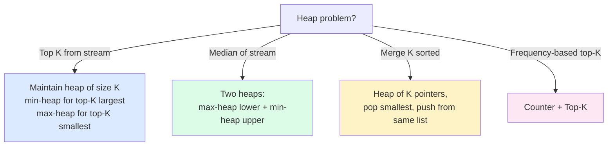

import { Callout } from 'fumadocs-ui/components/callout';

<Callout title="TL;DR — Heap">

**Use when**: you need the **K best** out of a stream, the **median** of a running stream, or **K-way merging** of sorted lists.

**Trigger phrases**: "kth largest", "kth smallest", "top K frequent", "median of data stream", "merge k sorted lists", "find K closest points", "schedule with cooldown".

**Three variants**:
- **Top-K** — maintain a heap of size K while streaming.
- **Two Heaps** — for running median (a max-heap of lower half + min-heap of upper half).
- **K-way Merge** — merge K sorted streams via a heap of "next-element-from-each-list".

**Complexity**: O(n log K) for Top-K, O(log n) per insert + O(1) for median lookup, O(N log K) for K-way merge of N total elements.

</Callout>

---

## The problem that motivates this pattern

> **Kth Largest Element in an Array (LC 215).** Given an unsorted array `nums` and an integer `k`, return the kth largest element. Don't actually sort the whole thing.

Naive: sort. O(n log n). Fine if k is comparable to n; wasteful if k = 1 (you only need *one* number, why sort all n?).

Better: **maintain a min-heap of size k**. Walk through nums; for each element, push it; if the heap exceeds size k, pop the smallest. At the end, the heap contains the k largest elements; the heap's minimum is the kth largest.

```python
import heapq

def kth_largest(nums, k):
    heap = []
    for x in nums:
        heapq.heappush(heap, x)
        if len(heap) > k:
            heapq.heappop(heap)
    return heap[0]                                  # the smallest of the top-k = kth largest
```

**O(n log k)**. For k = 5 and n = 10⁶, that's ~10⁶ × 3 ≈ 3 × 10⁶ ops instead of 10⁶ × 20 = 2 × 10⁷ — about 7× faster than sorting, with O(k) extra space instead of O(n).

The deeper insight: **a heap lets you maintain "the K best so far" using O(K) space and O(log K) per update**. As soon as a problem has "top K," "best K," "smallest K," or "Kth element" — reach for a heap.

---

## The core insight

**A heap is a tree with one property: parent ≤ children (min-heap) or parent ≥ children (max-heap). Nothing else.**

That single invariant gives you:
- **O(1) access to the min (max)** — it's the root.
- **O(log n) insert** — push to end, sift up.
- **O(log n) remove-min** — replace root with last, sift down.

The heap doesn't give you sorted iteration cheaply (the second-smallest could be either child of the root). For sorted iteration, use a sorted array or BST.

The invariant we maintain for top-K:

> **At every step, the heap contains the K largest (smallest) elements of the prefix processed so far.**

For two-heaps (running median):

> **The max-heap holds the lower half; the min-heap holds the upper half. Sizes differ by at most 1.**

For K-way merge:

> **The heap holds one element per source list — the next unmerged item from each.**

All three flavors share the underlying primitive (a heap), but the *invariant they maintain* differs. Pick the right invariant; the code falls out.



---

## Visual walkthrough — Top-K Largest

Find the **3rd largest** in `[3, 1, 5, 12, 2, 11]` using a **min-heap of size 3**.

```
Heap (min-heap of size <= 3):

Process 3:   heap = [3]
Process 1:   heap = [1, 3]
Process 5:   heap = [1, 3, 5]            ← size 3
Process 12:  push 12 → [1, 3, 5, 12]; size 4, pop 1
             heap = [3, 5, 12]            ← top 3 so far: {3, 5, 12}
Process 2:   push 2 → [2, 5, 12, 3]; size 4, pop 2
             heap = [3, 5, 12]
Process 11:  push 11 → [3, 5, 12, 11]; size 4, pop 3
             heap = [5, 11, 12]

Final: heap[0] = 5 → 3rd largest is 5.
```

Verify: sorted descending = `[12, 11, 5, 3, 2, 1]`. 3rd largest = `5`. ✓

The min-heap holds **exactly the top-K largest seen so far**. The root (smallest of the top-K) is the answer. This works because once the heap is full, *only values larger than the current min can possibly be in the top K*.

---

## Visual walkthrough — Running Median (Two Heaps)

Process stream `[2, 3, 4, 1, 5]`. Maintain `lower` (max-heap) and `upper` (min-heap).

```
Add 2:
  lower = [2]                  upper = []
  median = 2.0

Add 3:
  3 > 2, push to upper.
  lower = [2]                  upper = [3]
  median = (2 + 3) / 2 = 2.5

Add 4:
  4 > 3, push to upper.
  upper = [3, 4], size 2; lower = [2], size 1 → upper too large.
  Move min(upper) = 3 to lower.
  lower = [3, 2]               upper = [4]
  median = 3 (lower's max)

Add 1:
  1 < 3, push to lower.
  lower = [3, 2, 1], size 3; upper = [4], size 1 → lower too large.
  Move max(lower) = 3 to upper.
  lower = [2, 1]               upper = [3, 4]
  median = (2 + 3) / 2 = 2.5

Add 5:
  5 > 3, push to upper.
  upper = [3, 4, 5], size 3; lower size 2 → upper too large.
  Move min(upper) = 3 to lower.
  lower = [3, 2, 1]            upper = [4, 5]
  median = 3 (lower's max)
```

After all five, the running medians were: `2, 2.5, 3, 2.5, 3`.

The invariant: `lower` always has the smaller half (size ≥ `upper`); `upper` has the larger half. To find the median: if total is odd, return `lower.max`; if even, average `lower.max` and `upper.min`.

---

## The template

### Template A — Top-K (min-heap of size K for top-K largest)

```python
import heapq

def top_k_largest(stream, k):
    heap = []
    for x in stream:
        heapq.heappush(heap, x)
        if len(heap) > k:
            heapq.heappop(heap)                     # evict the smallest
    return heap                                       # the k largest, in heap order
```

For **top-K smallest**, swap min-heap for max-heap by negating values:

```python
def top_k_smallest(stream, k):
    heap = []                                         # store negated values in a min-heap = max-heap
    for x in stream:
        heapq.heappush(heap, -x)
        if len(heap) > k:
            heapq.heappop(heap)
    return [-v for v in heap]
```

### Template B — Two Heaps (running median)

```python
class MedianFinder:
    def __init__(self):
        self.lower = []                              # max-heap (negate)
        self.upper = []                              # min-heap

    def add(self, num):
        if not self.lower or num <= -self.lower[0]:
            heapq.heappush(self.lower, -num)
        else:
            heapq.heappush(self.upper, num)
        # Rebalance
        if len(self.lower) > len(self.upper) + 1:
            heapq.heappush(self.upper, -heapq.heappop(self.lower))
        elif len(self.upper) > len(self.lower):
            heapq.heappush(self.lower, -heapq.heappop(self.upper))

    def median(self):
        if len(self.lower) > len(self.upper):
            return -self.lower[0]
        return (-self.lower[0] + self.upper[0]) / 2
```

The *two operations* are add + median. Add is O(log n), median is O(1).

### Template C — K-way Merge

```python
import heapq

def merge_k_sorted(lists):
    heap = []
    for i, lst in enumerate(lists):
        if lst:
            heapq.heappush(heap, (lst[0], i, 0))    # (val, list_id, idx_in_list)

    result = []
    while heap:
        val, list_id, idx = heapq.heappop(heap)
        result.append(val)
        next_idx = idx + 1
        if next_idx < len(lists[list_id]):
            heapq.heappush(heap, (lists[list_id][next_idx], list_id, next_idx))
    return result
```

The `(val, list_id, idx)` tuple is the standard pattern: when we pop the smallest, we know which list it came from, and we push the next element from that same list.

### Template D — Custom comparator

In Python, heaps use natural ordering. For custom comparisons, wrap in a tuple where the first element is the key:

```python
# "K closest points to origin" — by Euclidean distance
heapq.heappush(heap, (dist_sq, point))

# Or use a class with __lt__
class Item:
    def __init__(self, key, val):
        self.key = key; self.val = val
    def __lt__(self, other):
        return self.key < other.key
```

---

## Worked example: Find K Closest Points to Origin (LC 973)

> **Problem.** Given an array of points `[xi, yi]` and an integer `k`, return the `k` closest points to the origin `(0, 0)` (by Euclidean distance).

**Why this is top-K.** We want the K *smallest* by distance from the origin. A max-heap of size K is the natural fit: if the new point is closer than the max of the heap, swap them.

**What changes from the template.**

1. **Compare by distance.** We don't need actual sqrt — squared distance preserves ordering.
2. **Use a max-heap** (since we want the K *smallest*). In Python, negate the distance.
3. **Cap at size K** by popping when it exceeds.

```python
import heapq

def k_closest(points: list[list[int]], k: int) -> list[list[int]]:
    heap = []                                       # max-heap of (-dist_sq, point)
    for x, y in points:
        d2 = x * x + y * y
        heapq.heappush(heap, (-d2, [x, y]))
        if len(heap) > k:
            heapq.heappop(heap)                      # discard the farthest
    return [point for _, point in heap]
```

**Dry-run on `points = [[3,3],[5,-1],[-2,4]], k = 2`:**

Distances squared: `(3,3) → 18`, `(5,-1) → 26`, `(-2,4) → 20`.

| Step | Push | Heap (max-heap, max at top) | Pop? |
|------|------|------|------|
| 1 | (3,3) d²=18 | [(-18, [3,3])] | no |
| 2 | (5,-1) d²=26 | [(-26, [5,-1]), (-18, [3,3])] (in heap order) | no |
| 3 | (-2,4) d²=20 | push then size 3 > 2, pop max-by-neg-dist = (5,-1) | yes |

Final heap holds `(3,3)` and `(-2,4)`. **Answer:** these two points. ✓

**Complexity.** O(n log k) — n pushes, each O(log k), with O(k) extra space.

**Alternative**: quickselect for O(n) average time. But quickselect is harder to get right and has O(n²) worst case. Heap is the safe, predictable choice.

---

## Variants

### Variant 1 — Top-K largest / smallest

The canonical case. Min-heap of size K for largest; max-heap for smallest.

**Canonical problems**: 215 Kth Largest Element, 973 K Closest Points to Origin (this page's worked example), 703 Kth Largest in a Stream, 658 Find K Closest Elements (uses binary search + two-pointer; heap is alternative).

### Variant 2 — Top-K Frequent (count + heap)

Step 1: Counter to get frequencies. Step 2: heap of size K by frequency.

```python
from collections import Counter

def top_k_frequent(nums, k):
    counts = Counter(nums)
    heap = []
    for val, freq in counts.items():
        heapq.heappush(heap, (freq, val))
        if len(heap) > k:
            heapq.heappop(heap)
    return [val for _, val in heap]
```

Bucket sort (counts by frequency) gives O(n) for this if frequencies are bounded by n.

**Canonical problems**: 347 Top K Frequent Elements, 692 Top K Frequent Words, 451 Sort Characters by Frequency.

### Variant 3 — Two Heaps (running median, sliding median)

Two heaps maintain a balanced split.

**Canonical problems**: 295 Find Median from Data Stream, 480 Sliding Window Median (also needs "remove arbitrary element from heap" — usually done with lazy deletion + a hashmap).

### Variant 4 — K-way Merge

Heap of `(val, list_id, idx)` for merging K sorted lists.

**Canonical problems**: 23 Merge K Sorted Lists, 378 Kth Smallest in a Sorted Matrix (heap of next-from-row), 632 Smallest Range Covering K Lists, 373 Find K Pairs with Smallest Sums.

### Variant 5 — Dijkstra & Prim (heap-backed shortest path / MST)

A heap of `(distance_so_far, node)`. Pop the closest unvisited node. See [Shortest Paths](/dsa/patterns/graphs/shortest-paths).

**Canonical problems**: 743 Network Delay Time, 1631 Path With Minimum Effort, 787 Cheapest Flights Within K Stops.

### Variant 6 — Scheduling with cooldown (max-heap by frequency)

The "task scheduler" pattern: pull the most-frequent unfinished task, decrement its count, requeue with a delay.

```python
from collections import Counter
import heapq

def least_interval(tasks, n):
    counts = Counter(tasks)
    heap = [-c for c in counts.values()]
    heapq.heapify(heap)
    queue = []                                      # (ready_time, count)
    time = 0
    while heap or queue:
        time += 1
        if heap:
            c = heapq.heappop(heap) + 1
            if c < 0:
                queue.append((time + n, c))
        if queue and queue[0][0] == time:
            heapq.heappush(heap, queue.pop(0)[1])
    return time
```

**Canonical problems**: 621 Task Scheduler, 767 Reorganize String, 358 Rearrange String K Distance Apart, 1834 Single-Threaded CPU.

### Variant 7 — Heap with lazy deletion

Heaps don't support O(log n) deletion of arbitrary elements. Workaround: keep a separate "to-delete" set; when popping, skip elements in the set.

```python
heap = []                                            # all pushes
deleted = set()                                      # entries to skip

def peek():
    while heap and heap[0] in deleted:
        heapq.heappop(heap)
    return heap[0]

def delete(x):
    deleted.add(x)                                   # lazy
```

Used for sliding-window median (LC 480), some priority-queue problems with cancellations.

---

## Common pitfalls

| Trap | Fix |
|------|-----|
| Using a min-heap when you need a max-heap | In Python, negate values. In Java, use `Collections.reverseOrder()` |
| Forgetting heap size cap → O(n log n) instead of O(n log k) | After every push, `if len(heap) > k: heappop(heap)` |
| Using heap for sorted iteration | Heap gives O(1) access to ONE extreme. Sorted iteration is O(n log n). Use a sorted list/BST instead |
| Modifying a heap element's value in place | Heaps don't notice. You must remove + reinsert (or use lazy deletion) |
| Treating heap[0] like a "sorted first" element after operations | After `heappush/heappop`, `heap[0]` is the min — but `heap[1]` is NOT necessarily the 2nd smallest |
| Custom comparator that's not a total order | Python `heapq` will give weird results; ensure `(a < b) ⟺ !(b < a)` |
| Two-heaps median: lopsided sizes | After every add, rebalance — sizes differ by at most 1 |
| K-way merge using a flat sort | Defeats the "already sorted" structure; uses O(N log N) instead of O(N log K) |
| Heap of mutable objects (Python) | If you mutate a pushed object, the heap invariant breaks; push immutable tuples |

---

## Complexity

**Heap operations:**
- `heappush(heap, x)` — O(log n)
- `heappop(heap)` — O(log n)
- `heap[0]` (peek) — O(1)
- `heapify(list)` — O(n) (Floyd's algorithm; faster than n pushes!)
- arbitrary delete — O(n) naively, O(log n) with index map (`heapdict`)

**Top-K:** O(n log k) time, O(k) space.

**Two heaps:** O(log n) per add, O(1) per median query.

**K-way merge:** O(N log K) total, where N = sum of all list lengths.

**Heap-sort:** O(n log n) time, O(1) extra (in-place). Rarely beats quicksort in practice due to cache locality.

---

## When NOT to use a heap

- **You need sorted iteration, not just the extremes.** Use a sorted array, TreeMap, or `SortedList` (Python `sortedcontainers`).
- **You need to update arbitrary elements.** Heaps don't support O(log n) decrease-key without an auxiliary index. For Dijkstra in dense graphs, a Fibonacci heap is theoretically faster but rarely used in practice (use lazy deletion instead).
- **You need the Kth element of a static array AND you can afford O(n) average.** Use quickselect — O(n) average.
- **You only need the global min/max.** Use a single variable — no heap overhead.
- **K is close to n.** At K = n, top-K is just sorting — use that.
- **You need a sliding window aggregate where deletion order matches insertion order.** Use a [Monotonic Deque](/dsa/patterns/stacks-queues/monotonic-stack) — O(1) amortized vs O(log n).

### Decision rule

| Symptom | Likely pattern |
|---------|---------------|
| "Top K / Kth largest / Kth smallest" | **Heap of size K** |
| "Top K frequent" | **Counter + Heap** |
| "Median of running stream" | **Two heaps** |
| "Merge K sorted lists" | **K-way merge with heap** |
| "K closest points / K cheapest flights" | **Top-K** (max-heap of K best so far) |
| "Schedule with cooldown" | **Max-heap of remaining frequencies** |
| "Sliding window MAX (not Kth)" | [Monotonic Deque](/dsa/patterns/stacks-queues/monotonic-stack) — faster |
| "Sorted iteration" | Sorted array / BST / `SortedList` — not heap |
| "Dijkstra / Prim / A*" | **Heap** as priority queue |

---

## Real-world applications

- **Operating system process schedulers.** Priority queues with task priorities.
- **Event-driven simulation.** Maintain "next event to process" by timestamp — heap of events.
- **Network packet schedulers.** QoS systems use priority queues to give high-priority traffic precedence.
- **Top-K analytics in databases.** "Top 10 most-active users by revenue" — heap-based on streaming aggregation.
- **A* search in pathfinding.** Priority queue over `(f-score, node)` for game AI, navigation, robot planning.
- **Huffman coding (data compression).** Repeatedly merge two least-frequent symbols — repeated `heappop` + `heappush`.
- **Online aggregation engines.** Druid, Pinot, ClickHouse all use heap-based top-K data structures.

---

## Curated practice problems

| # | Problem | Difficulty | Variant | Note |
|---|---------|-----------|---------|------|
| 1 | ★ 215 Kth Largest Element in Array | Medium | Min-heap of size K | The canonical |
| 2 | ★ 347 Top K Frequent Elements | Medium | Counter + heap | Or bucket sort O(n) |
| 3 | 692 Top K Frequent Words | Medium | Counter + heap with tiebreak | Lex order for ties |
| 4 | 451 Sort Characters by Frequency | Medium | Counter + heap | Or bucket sort |
| 5 | ★ 973 K Closest Points to Origin | Medium | Max-heap of K | This page's worked example |
| 6 | 703 Kth Largest in a Stream | Easy | Streaming top-K | Constant K, stream-incremental |
| 7 | ★ 295 Find Median from Data Stream | Hard | Two heaps | The canonical two-heap |
| 8 | 480 Sliding Window Median | Hard | Two heaps + lazy deletion | Or `SortedList` |
| 9 | ★ 23 Merge K Sorted Lists | Hard | K-way merge | This pattern's other canonical |
| 10 | 378 Kth Smallest in Sorted Matrix | Medium | K-way merge OR binary search on answer | Both work |
| 11 | 632 Smallest Range Covering K Lists | Hard | K-way merge + range tracking | Maintain max while popping min |
| 12 | 373 Find K Pairs with Smallest Sums | Medium | K-way merge | Heap of (sum, idx1, idx2) |
| 13 | ★ 621 Task Scheduler | Medium | Max-heap by frequency | With cooldown queue |
| 14 | 767 Reorganize String | Medium | Same pattern as 621 | Rebuild from frequency heap |
| 15 | 502 IPO | Hard | Two heaps (one for capital, one for profit) | Sort by capital, heap by profit |

---

## Related patterns

- [Sliding Window](/dsa/patterns/arrays-strings/sliding-window) — for window max/min, deque is faster than heap
- [Monotonic Stack / Deque](/dsa/patterns/stacks-queues/monotonic-stack) — alternative for sliding window aggregates
- [Hashing](/dsa/patterns/arrays-strings/hashing) — Counter for frequency-based heap problems
- [Binary Search](/dsa/patterns/arrays-strings/binary-search) — alternative for Kth-smallest-in-matrix
- [Shortest Paths](/dsa/patterns/graphs/shortest-paths) — Dijkstra uses a heap
- [Linked List](/dsa/patterns/linked-list/linked-list) — Merge K Sorted Lists is a heap problem on LLs

---

## Quick-reference card

```python
import heapq

# Top-K largest (min-heap of size K)
heap = []
for x in stream:
    heapq.heappush(heap, x)
    if len(heap) > k: heapq.heappop(heap)
# heap[0] = kth largest

# Top-K smallest (max-heap = negate)
for x in stream:
    heapq.heappush(heap, -x)
    if len(heap) > k: heapq.heappop(heap)

# Two heaps for median
lower, upper = [], []                # max-heap (negated), min-heap
def add(num):
    if not lower or num <= -lower[0]: heapq.heappush(lower, -num)
    else: heapq.heappush(upper, num)
    if len(lower) > len(upper) + 1: heapq.heappush(upper, -heapq.heappop(lower))
    elif len(upper) > len(lower): heapq.heappush(lower, -heapq.heappop(upper))

# K-way merge
heap = [(lst[0], i, 0) for i, lst in enumerate(lists) if lst]
heapq.heapify(heap)
result = []
while heap:
    val, lid, idx = heapq.heappop(heap)
    result.append(val)
    if idx + 1 < len(lists[lid]):
        heapq.heappush(heap, (lists[lid][idx+1], lid, idx+1))
```

Triggers: "top K", "kth element", "median", "merge K sorted", "scheduling with cooldown". Complexity: O(n log k).
