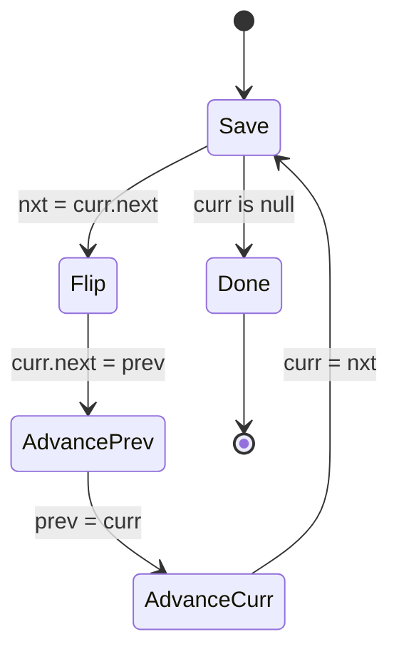

import { Callout } from 'fumadocs-ui/components/callout';

<Callout title="TL;DR — Linked List Manipulation">

**Use when**: the input is a linked list and the answer requires rearranging or analyzing it via pointer surgery.

**Trigger phrases**: "reverse linked list", "merge two sorted lists", "middle of the linked list", "linked list cycle", "intersection of two lists", "reorder list", "k groups".

**Four canonical operations** (compose them to solve any LL problem):
1. **Reverse** — flip pointer direction in O(n), O(1) space.
2. **Merge** — interleave two sorted lists with a dummy head.
3. **Fast & Slow** — find middle, detect cycle (Floyd's).
4. **Dummy head** — eliminates edge-case code for empty list / head deletion.

**Complexity**: O(n) time, O(1) extra space.

</Callout>

---

## The problem that motivates this pattern

> **Reverse Linked List (LC 206).** Given the head of a singly linked list, reverse the list and return the new head.

Naive: copy to an array, reverse the array, rebuild a new list. O(n) time but O(n) extra space — and now you have a new list, not the same one mutated.

The right approach: rewire pointers in place. At each node, flip the `next` pointer to point backward instead of forward. To do this without losing track of the rest of the list, hold three pointers — `prev`, `curr`, `next` — and walk forward.

```
Before:  null   1 → 2 → 3 → 4 → 5
                ↑
              curr (prev = null)

After 1: null ← 1   2 → 3 → 4 → 5
                ↑   ↑
              prev curr

After 2: null ← 1 ← 2   3 → 4 → 5
                    ↑   ↑
                  prev curr

...

End:     null ← 1 ← 2 ← 3 ← 4 ← 5
                              ↑
                            prev (new head)
```

```python
def reverse_list(head):
    prev = None
    curr = head
    while curr:
        nxt = curr.next        # save
        curr.next = prev       # flip
        prev = curr            # advance prev
        curr = nxt             # advance curr
    return prev
```

**Three pointers, four lines of body, O(1) extra space.** This is the single most-asked LL operation — and you'll *compose* it inside fancier problems (Reverse Nodes in K-Group, Palindrome Linked List, Reorder List).

That's the pattern: **linked-list problems aren't single algorithms — they're compositions of four canonical operations.**

---

## The core insight

**Three primitives + one technique unlock almost every linked-list problem.**

### Primitive 1: Reverse a sub-range

The reversal template above generalizes: reverse from `start` to `end` (exclusive), return new head and new tail. This is the workhorse for K-group reversal, palindrome check, reordering.

### Primitive 2: Merge two sorted lists

Two pointers, a dummy head, take the smaller `next` at each step. Sort the relative order without allocating.

### Primitive 3: Fast & slow pointers

One pointer moves twice as fast as the other. After `n` steps, fast is at index `2n`, slow at `n`. When fast hits the end, slow is at the **middle**. If there's a cycle, fast laps slow inside it.

### Technique: dummy head node

Allocate a sentinel `dummy → head`. Now you have a node *before* the real head, and you never need special cases for "the head is being deleted/modified." At the end, return `dummy.next`.

The invariant you should be able to state for *any* pointer-rewiring task:

> **At every step, no node is lost (still reachable from the in-progress structure) and no node has a dangling `next` pointing into the unprocessed part.**

That's it. Every bug in linked-list code is a violation of this invariant.



The "save → flip → advance" rhythm. Once you internalize it, you write reversals without thinking.

---

## Visual walkthrough — Find the Middle

Trace **Fast & Slow** on a list with `n = 5`: `1 → 2 → 3 → 4 → 5`.

```
Start:   slow=1, fast=1
         1 → 2 → 3 → 4 → 5
         ↑↑
        slow,fast

Step 1:  slow → 2, fast → 3
         1 → 2 → 3 → 4 → 5
             ↑   ↑
            slow fast

Step 2:  slow → 3, fast → 5
         1 → 2 → 3 → 4 → 5
                 ↑       ↑
                slow    fast

Step 3:  fast.next is null → stop.
         slow = 3 → THE MIDDLE.
```

```python
def middle(head):
    slow = fast = head
    while fast and fast.next:
        slow = slow.next
        fast = fast.next.next
    return slow                            # for even n, returns the 2nd of the two middles
```

For even `n`, fast hits null while slow is at the second middle. To return the *first* middle for even `n`, change the loop to `while fast.next and fast.next.next`.

For **cycle detection**, the rhythm is the same but you check `slow == fast` after each pair of moves. If they meet, there's a cycle. If fast hits null, there isn't.

---

## The template

### Template A — Reverse (in place, three pointers)

```python
def reverse(head):
    prev, curr = None, head
    while curr:
        nxt = curr.next
        curr.next = prev
        prev = curr
        curr = nxt
    return prev
```

### Template B — Reverse a sub-range (return new head & new tail)

```python
def reverse_segment(head, k):
    """Reverse first k nodes; return (new_head, tail-of-reversed, rest)"""
    prev, curr = None, head
    for _ in range(k):
        if not curr: return None, None, None         # not enough nodes
        nxt = curr.next
        curr.next = prev
        prev = curr
        curr = nxt
    return prev, head, curr                          # new head, old head=tail, rest
```

Used in K-group reversal, partial reversals.

### Template C — Merge two sorted lists with a dummy head

```python
def merge(l1, l2):
    dummy = ListNode(0)                              # sentinel
    tail = dummy
    while l1 and l2:
        if l1.val <= l2.val:
            tail.next = l1
            l1 = l1.next
        else:
            tail.next = l2
            l2 = l2.next
        tail = tail.next
    tail.next = l1 or l2                             # attach remainder
    return dummy.next
```

The dummy head trick: no special case for "first node." Always have a `tail` and append to `tail.next`.

### Template D — Fast & Slow

```python
def middle(head):
    slow = fast = head
    while fast and fast.next:
        slow = slow.next
        fast = fast.next.next
    return slow

def has_cycle(head):
    slow = fast = head
    while fast and fast.next:
        slow = slow.next
        fast = fast.next.next
        if slow == fast: return True
    return False

def cycle_start(head):
    # Phase 1: find meeting point
    slow = fast = head
    while fast and fast.next:
        slow = slow.next
        fast = fast.next.next
        if slow == fast: break
    else:
        return None                                  # no cycle
    # Phase 2: reset slow; both advance one step at a time
    slow = head
    while slow != fast:
        slow = slow.next
        fast = fast.next
    return slow
```

The cycle-start proof: when slow and fast first meet inside the cycle, slow has moved `n` steps, fast has moved `2n` (where `n` is the meeting distance from head). The cycle length `L` divides `n` (because fast caught up to slow by lapping). Resetting slow to head and moving both one step lands them at the cycle entry. (Full proof: see [cp-algorithms](https://cp-algorithms.com/others/tortoise_and_hare.html).)

---

## Worked example: Reorder List (LC 143)

> **Problem.** Given a linked list `L0 → L1 → ... → Ln-1 → Ln`, reorder it to `L0 → Ln → L1 → Ln-1 → L2 → Ln-2 → ...`. Do it in place; don't modify node values.
>
> Example: `1 → 2 → 3 → 4 → 5` → `1 → 5 → 2 → 4 → 3`.

**Why this composes the four primitives.** The naive approach (use a deque or array) is O(n) space. To do it in O(1) space, observe:

1. **Find the middle** (fast & slow).
2. **Reverse the second half.**
3. **Merge** the two halves alternately.

That's three of the four primitives. The dummy-head technique isn't needed here because we're not modifying the head.

```python
def reorder_list(head):
    if not head or not head.next:
        return

    # 1. Find the middle (first middle for even-length list)
    slow, fast = head, head
    while fast.next and fast.next.next:
        slow = slow.next
        fast = fast.next.next
    # slow is now the last node of the first half

    # 2. Reverse the second half
    second = slow.next
    slow.next = None                               # split the list

    prev, curr = None, second
    while curr:
        nxt = curr.next
        curr.next = prev
        prev = curr
        curr = nxt
    second = prev                                   # new head of reversed second half

    # 3. Merge alternately
    first = head
    while second:
        t1, t2 = first.next, second.next
        first.next = second
        second.next = t1
        first = t1
        second = t2
```

**Dry-run on `1 → 2 → 3 → 4 → 5`:**

1. Find middle: slow lands at node `3`. First half = `1 → 2 → 3`. Second half = `4 → 5`. Split: `3.next = None`.
2. Reverse second half: `4 → 5` becomes `5 → 4`.
3. Merge:
   - `first=1, second=5`. Save `t1=2, t2=4`. Wire: `1.next=5, 5.next=2`. List is now `1 → 5 → 2 → 3`. Advance: `first=2, second=4`.
   - `first=2, second=4`. Save `t1=3, t2=None`. Wire: `2.next=4, 4.next=3`. List is now `1 → 5 → 2 → 4 → 3`. Advance: `first=3, second=None`. Exit.

**Result: `1 → 5 → 2 → 4 → 3` ✓.**

**Complexity.** O(n) time (three linear passes), O(1) extra space.

This is the textbook example of LL pattern composition. Each step is a primitive. The art is recognizing that the problem decomposes that way.

---

## Variants

### Variant 1 — Reverse the whole list

The base case. Template A above.

**Canonical problems**: 206 Reverse Linked List, 234 Palindrome Linked List (reverse second half, then compare).

### Variant 2 — Reverse a sub-range / K-group

Use template B as a sub-routine. Reverse `k` at a time, splicing the reversed segment between the previous group's tail and the next group's head.

```python
def reverse_k_group(head, k):
    dummy = ListNode(0, head)
    group_prev = dummy

    while True:
        # Find the k-th node from group_prev
        kth = group_prev
        for _ in range(k):
            kth = kth.next
            if not kth: return dummy.next       # fewer than k nodes left

        group_next = kth.next
        # Reverse [group_prev.next, kth]
        prev, curr = group_next, group_prev.next
        while curr != group_next:
            nxt = curr.next
            curr.next = prev
            prev = curr
            curr = nxt
        # Splice
        tmp = group_prev.next
        group_prev.next = kth
        group_prev = tmp
```

**Canonical problems**: 25 Reverse Nodes in k-Group, 92 Reverse Linked List II (between positions `m` and `n`), 24 Swap Nodes in Pairs (k=2 special case).

### Variant 3 — Merge two (or K) sorted lists

Template C for two lists. For K lists, use a heap of (val, list-id) and pop the smallest each time — see [Heap](/dsa/patterns/heaps/heap).

**Canonical problems**: 21 Merge Two Sorted Lists, 23 Merge K Sorted Lists, 148 Sort List (mergesort on a linked list — divide via fast/slow, merge via template C).

### Variant 4 — Fast & Slow (Floyd's)

Find middle, detect cycle, find cycle start. Template D.

**Canonical problems**: 876 Middle of the Linked List, 141 Linked List Cycle, 142 Linked List Cycle II, 287 Find the Duplicate Number (treat array as implicit linked list).

### Variant 5 — Two-pass: find length, then do something at position

If you need "the Kth node from the end," you can either fast-and-slow with a gap of K, or count length then walk to `length - k`.

```python
def remove_nth_from_end(head, n):
    dummy = ListNode(0, head)
    fast = slow = dummy
    for _ in range(n):
        fast = fast.next
    while fast.next:
        slow = slow.next
        fast = fast.next
    slow.next = slow.next.next
    return dummy.next
```

**Canonical problems**: 19 Remove Nth Node From End, 61 Rotate List (find length, then rotate).

### Variant 6 — Composed (Reorder, Palindrome, etc.)

The worked example above (Reorder List) is the canonical. Palindrome Linked List is essentially the same — find middle, reverse second half, compare halves.

**Canonical problems**: 143 Reorder List, 234 Palindrome Linked List.

### Variant 7 — Two-list intersection / merge point

Two pointers, each walking through its own list; when one hits the end, switch to the other list. They meet at the intersection (if any) in O(m + n) — beautiful O(1)-space trick.

```python
def get_intersection(a, b):
    pa, pb = a, b
    while pa is not pb:
        pa = pa.next if pa else b
        pb = pb.next if pb else a
    return pa                              # node, or None if no intersection
```

**Canonical problem**: 160 Intersection of Two Linked Lists.

### Variant 8 — Random pointer / deep copy

Use a hash map `original → copy` to translate `random` pointers after a first pass that creates copies.

**Canonical problem**: 138 Copy List with Random Pointer.

---

## Common pitfalls

| Trap | Fix |
|------|-----|
| Losing the rest of the list when flipping `curr.next` | Always save `nxt = curr.next` *before* the flip |
| Forgetting the dummy head, then writing special cases for empty/head-modify | Use `dummy = ListNode(0, head); return dummy.next` — eliminates edge cases |
| Off-by-one in fast/slow — wrong "middle" for even-length lists | Be explicit: which middle do you want? Adjust loop condition |
| Forgetting to null-terminate after splitting | `slow.next = None` before reversing the second half, or you'll create a cycle |
| Cycle detection: writing `while fast.next.next` without checking `fast.next` first | Always `while fast and fast.next` |
| Forgetting `if not head` early return | LL problems often need an empty-list guard |
| Returning `head` instead of `dummy.next` when you used a dummy | The dummy is *before* the new head; return its `next` |
| Mutating node values when the problem says "don't" | "Reorder list" requires pointer surgery, not val swaps |
| In K-group reversal, splicing in the wrong direction | Draw it on paper before coding. The splice has 3-4 pointer updates and order matters |

---

## Complexity

**Time: O(n)** for almost every LL operation. Each node is visited a constant number of times.

**Space: O(1)** auxiliary. This is the pattern's superpower — pointer surgery lets you rearrange a list of any size with constant extra memory.

Exceptions:
- Mergesort on a linked list is **O(log n)** stack space.
- Random-pointer deep copy is **O(n)** auxiliary (the hash map).
- K-way merge uses **O(K)** for the heap.

---

## When NOT to use these techniques

- **The data structure is an array, not a linked list.** Reverse-in-place on an array is just a two-pointer swap. Merge sorted arrays uses the same idea but with index pointers, not node pointers.
- **You need random access.** Linked lists are O(n) to index. If the problem demands `arr[k]` for varying `k`, convert to an array or use a different structure.
- **You need O(1) length.** Linked lists don't store length. If you need it, count once (O(n)) — but ideally restructure the algorithm to not need it (fast/slow can give you "middle" without knowing length).
- **The problem is really about values, not nodes.** "Sum of all nodes" doesn't need pointer surgery — just traverse and sum.
- **You need to insert/delete near the middle frequently.** Singly linked lists give O(1) at known nodes, but O(n) to *find* the node. For middle-heavy ops, use a deque or a tree.

### Decision rule

| Symptom | Likely pattern |
|---------|---------------|
| "Reverse the list / a sub-range / in K-groups" | **Reverse template** |
| "Merge two sorted lists" | **Merge with dummy head** |
| "Merge K sorted lists" | [Heap](/dsa/patterns/heaps/heap) of (val, list-id) |
| "Middle of the list" | **Fast & Slow** |
| "Cycle detection / cycle start" | **Floyd's** (see [Two Pointers](/dsa/patterns/arrays-strings/two-pointers)) |
| "Nth from end" | **Two pointers, gap of N** |
| "Palindrome / Reorder list" | **Compose: find middle + reverse + merge** |
| "Two-list intersection" | **Two-pointer switch** |
| "Copy with random pointer" | **Hash map original → copy** |
| "Sort linked list" | **Mergesort (fast/slow split + merge)** |

---

## Real-world applications

- **Memory allocators.** Free lists in malloc/free implementations are linked lists; insertion/removal at known nodes is O(1).
- **LRU cache implementation.** A doubly linked list + hash map gives O(1) get/put — see [LRU/LFU Cache](/lld/case-studies/cache-lru-lfu).
- **OS process scheduling.** Run-queue, wait-queue — linked lists of process control blocks.
- **Music/video playlists.** Doubly linked lists for prev/next navigation.
- **Browser history / undo stack.** Doubly linked list of states; "Back" walks backward, "Forward" walks the next pointer.
- **Garbage collectors.** Mark-and-sweep collectors traverse linked allocation lists to find live objects.

---

## Curated practice problems

| # | Problem | Difficulty | Variant | Note |
|---|---------|-----------|---------|------|
| 1 | ★ 206 Reverse Linked List | Easy | Reverse | The canonical |
| 2 | 92 Reverse Linked List II | Medium | Reverse sub-range | Reverse positions m to n |
| 3 | ★ 21 Merge Two Sorted Lists | Easy | Merge + dummy | The canonical merge |
| 4 | 23 Merge K Sorted Lists | Hard | Heap of pointers | See [Heap](/dsa/patterns/heaps/heap) |
| 5 | ★ 876 Middle of the Linked List | Easy | Fast & Slow | The canonical middle |
| 6 | ★ 141 Linked List Cycle | Easy | Floyd's | The canonical cycle detect |
| 7 | 142 Linked List Cycle II | Medium | Floyd's, find start | Two-phase trick |
| 8 | 19 Remove Nth Node From End | Medium | Two-pointer w/ gap | + dummy head for n=length case |
| 9 | 160 Intersection of Two Linked Lists | Easy | Two-pointer switch | The trick: switch heads on null |
| 10 | ★ 143 Reorder List | Medium | Compose middle+reverse+merge | This page's worked example |
| 11 | 234 Palindrome Linked List | Easy | Middle + reverse second half | Compare in place |
| 12 | 25 Reverse Nodes in k-Group | Hard | Reverse sub-range | Splice groups carefully |
| 13 | 24 Swap Nodes in Pairs | Medium | K-group with k=2 | Simpler special case |
| 14 | 138 Copy List with Random Pointer | Medium | Hash map original→copy | Two passes |
| 15 | 148 Sort List | Medium | Mergesort | Recursive split (fast/slow) + merge |

---

## Related patterns

- [Two Pointers](/dsa/patterns/arrays-strings/two-pointers) — Floyd's is the LL specialization of fast/slow
- [Heap](/dsa/patterns/heaps/heap) — merge K sorted lists uses a heap
- [Hashing](/dsa/patterns/arrays-strings/hashing) — copy-with-random-pointer uses a hash map
- [LRU/LFU Cache](/lld/case-studies/cache-lru-lfu) — uses doubly linked list + hash map (LLD case study)

---

## Quick-reference card

```python
# Reverse
prev, curr = None, head
while curr:
    nxt, curr.next = curr.next, prev
    prev, curr = curr, nxt

# Merge two sorted
dummy = ListNode(); tail = dummy
while l1 and l2:
    if l1.val <= l2.val: tail.next, l1 = l1, l1.next
    else: tail.next, l2 = l2, l2.next
    tail = tail.next
tail.next = l1 or l2
return dummy.next

# Middle / cycle (Floyd's)
slow = fast = head
while fast and fast.next:
    slow, fast = slow.next, fast.next.next
    # if slow == fast: return cycle detected

# Nth from end
fast = slow = dummy
for _ in range(n): fast = fast.next
while fast.next: slow, fast = slow.next, fast.next
```

Triggers: reverse, merge, middle, cycle, K-th from end. Complexity: O(n), O(1) space.
