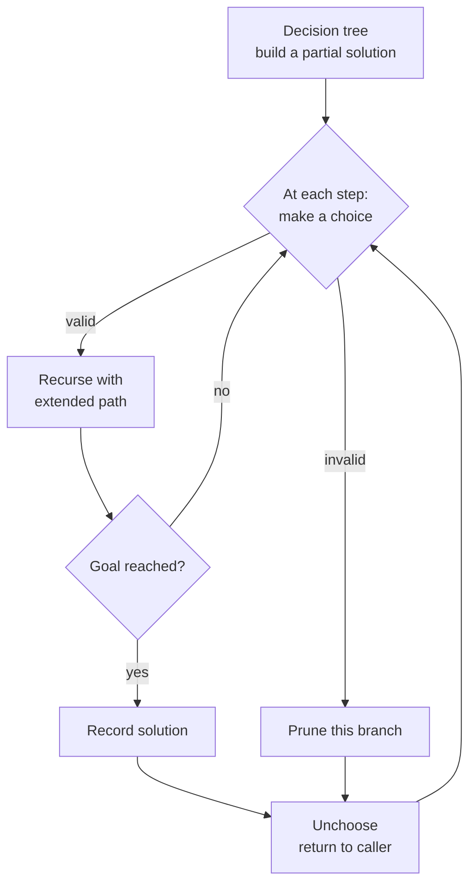

import { Callout } from 'fumadocs-ui/components/callout';

<Callout title="TL;DR — Backtracking">

**Use when**: you need to enumerate or count **all** configurations satisfying some constraint — subsets, permutations, combinations, partitions, paths, board placements.

**Trigger phrases**: "find all subsets", "all permutations", "all combinations summing to target", "N-Queens", "word search", "valid parentheses", "restore IP addresses", "Sudoku solver", "palindrome partitioning".

**The skeleton**: `choose → recurse → unchoose`. Build a partial solution; recurse to extend it; on return, undo the choice so the parent can try the next branch.

**Two flavors**: *exhaustive* (collect all solutions) and *pruned* (cut branches that can't lead to a valid solution — N-Queens, Sudoku).

**Complexity**: Often O(b^d · path_work) where b = branching factor, d = depth. Exponential by nature, but pruning makes it tractable.

</Callout>

---

## The problem that motivates this pattern

> **Subsets (LC 78).** Given an integer array `nums` of unique elements, return all possible subsets (the power set).
>
> Example: `nums = [1, 2, 3]` → `[[], [1], [2], [1,2], [3], [1,3], [2,3], [1,2,3]]`.

Brute force: iterate from `0` to `2^n - 1`, treat each binary number's bits as "include this element or not." Works but feels hacky.

The **recursive** approach is more flexible and generalizes to permutations, combinations, and N-Queens. At each index, we make a *choice*: include this element in the current subset, or don't. Recurse on the rest. After the recursion, *undo* the choice so we can try the other branch.

```python
def subsets(nums):
    result = []
    path = []

    def backtrack(start):
        result.append(path[:])                        # record the current path

        for i in range(start, len(nums)):
            path.append(nums[i])                      # choose
            backtrack(i + 1)                          # recurse
            path.pop()                                # unchoose

    backtrack(0)
    return result
```

That's it. **Three lines of "interesting" code** (choose, recurse, unchoose). The pattern generalizes to every enumeration problem you'll encounter.

The deeper insight: **backtracking is DFS on the *decision tree* of partial solutions**. Each level of the tree corresponds to a single decision (include/exclude, place/don't-place). When we return from a recursive call, we've explored the entire subtree; the unchoose step lets us try a different decision at this level.

---

## The core insight

**Every backtracking problem fits one template: `choose → recurse → unchoose`. The art is naming the *state* and the *decision*.**

The invariant:

> **At every node in the recursion tree, `path` represents a valid partial solution. After recursing and returning, `path` is restored to its state before the recursion.**

This invariant is what lets us share the same `path` list across the entire recursion — no need to copy on every call. The undo step is mandatory; **without it, sibling branches see stale state**.

Backtracking has three universal slots:

1. **State** — what we're building (a `path` list, a board, a set of used elements).
2. **Choices** — at each step, what options are available.
3. **Terminal condition** — when to record a complete solution (or prune an invalid one).



The recursion tree is the diagram of the algorithm. Drawing it on paper for a 3-element input is the fastest way to understand why backtracking works.

---

## Visual walkthrough — Subsets of `[1, 2, 3]`

```
                    []
                  / | \
                 1  2  3
                /|  |
               2 3  3
               |
               3

Tree (rendered as nested calls):

backtrack(start=0, path=[])              → record []
  choose 1, path=[1]
    backtrack(start=1, path=[1])         → record [1]
      choose 2, path=[1,2]
        backtrack(start=2, path=[1,2])   → record [1,2]
          choose 3, path=[1,2,3]
            backtrack(start=3, path=[1,2,3]) → record [1,2,3]
          unchoose 3
        unchoose 2
      choose 3, path=[1,3]
        backtrack(start=3, path=[1,3])   → record [1,3]
      unchoose 3
    unchoose 1
  choose 2, path=[2]
    backtrack(start=2, path=[2])         → record [2]
      choose 3, path=[2,3]
        backtrack(...)                    → record [2,3]
      unchoose 3
    unchoose 2
  choose 3, path=[3]
    backtrack(start=3, path=[3])         → record [3]
    unchoose 3
```

The `start` parameter prevents revisiting earlier elements — each subset is generated **once**, not as a permutation. Pop the `path` after every recursive call. Always.

**Why does this enumerate every subset?** The recursion tree has 2^n leaves (each element is either in the current path or not — 2 choices × n levels). Each call records *exactly one subset* — the current path. So we record 2^n subsets total. ✓

---

## The template

### Template A — Subsets (decisions don't reorder)

```python
def subsets(nums):
    result = []
    path = []

    def backtrack(start):
        result.append(path[:])                        # record this path

        for i in range(start, len(nums)):
            path.append(nums[i])                      # choose
            backtrack(i + 1)                          # recurse (i+1: no reuse)
            path.pop()                                # unchoose

    backtrack(0)
    return result
```

### Template B — Permutations (use every element, in any order)

```python
def permutations(nums):
    result = []
    path = []
    used = [False] * len(nums)

    def backtrack():
        if len(path) == len(nums):
            result.append(path[:])
            return

        for i in range(len(nums)):
            if used[i]: continue                      # already in path
            path.append(nums[i])
            used[i] = True
            backtrack()
            path.pop()                                # unchoose
            used[i] = False

    backtrack()
    return result
```

### Template C — Combinations (k of n)

```python
def combinations(n, k):
    result = []
    path = []

    def backtrack(start):
        if len(path) == k:
            result.append(path[:])
            return

        for i in range(start, n + 1):                 # 1-indexed
            path.append(i)
            backtrack(i + 1)
            path.pop()

    backtrack(1)
    return result
```

### Template D — Constraint satisfaction (N-Queens style)

```python
def n_queens(n):
    result = []
    cols = set()
    diag1 = set()                                     # row - col
    diag2 = set()                                     # row + col
    board = [-1] * n

    def backtrack(row):
        if row == n:
            result.append(board[:])
            return

        for col in range(n):
            if col in cols or row - col in diag1 or row + col in diag2:
                continue                              # prune
            cols.add(col); diag1.add(row - col); diag2.add(row + col)
            board[row] = col
            backtrack(row + 1)
            cols.remove(col); diag1.remove(row - col); diag2.remove(row + col)

    backtrack(0)
    return result
```

The **pruning** (the `if col in cols ...` check) is what makes N-Queens tractable. Without it: 8^8 = 16M positions. With pruning: ~2000 nodes explored for n=8.

### Universal skeleton

```python
def backtrack(state):
    if is_goal(state):
        record(state)
        return

    for choice in available_choices(state):
        if not is_valid(choice, state): continue      # prune
        apply(choice, state)
        backtrack(state)
        undo(choice, state)                           # MANDATORY
```

Memorize this. Every backtracking problem reduces to filling in `is_goal`, `available_choices`, `is_valid`, `apply`, `undo`.

---

## Worked example: Word Search (LC 79)

> **Problem.** Given an `m × n` grid of characters and a string `word`, return `True` if `word` can be constructed from sequentially adjacent cells (horizontally or vertically), with no cell used more than once.
>
> Example: board = `[["A","B","C","E"],["S","F","C","S"],["A","D","E","E"]]`, word = `"ABCCED"` → `True`.

**Why this is backtracking.** We're looking for *any* path through the board spelling out the word. At each step, we have up to 4 choices (neighbors). If a choice doesn't pan out, we need to undo it and try a different direction. Classic choose/recurse/unchoose.

**What changes from the template.** Three slots:

1. **State**: current position `(r, c)` and how many characters of `word` we've matched.
2. **Choices**: 4 neighbors (up, down, left, right).
3. **Pruning**: skip cells that don't match the next character; skip already-visited cells.
4. **Undo**: when backtracking, restore the cell so other paths can use it.

```python
def exist(board: list[list[str]], word: str) -> bool:
    m, n = len(board), len(board[0])

    def dfs(r, c, i):
        if i == len(word):
            return True                                # all chars matched
        if r < 0 or r >= m or c < 0 or c >= n:
            return False
        if board[r][c] != word[i]:
            return False

        # Choose: mark cell as visited (temporarily)
        original = board[r][c]
        board[r][c] = '#'

        # Recurse: try all 4 directions
        found = (dfs(r+1, c, i+1) or
                 dfs(r-1, c, i+1) or
                 dfs(r, c+1, i+1) or
                 dfs(r, c-1, i+1))

        # Undo: restore the cell
        board[r][c] = original

        return found

    for r in range(m):
        for c in range(n):
            if dfs(r, c, 0):
                return True
    return False
```

**Dry-run on `word = "ABCCED"`, starting at `(0, 0) = 'A'`:**

```
dfs(0, 0, 0): board[0][0]='A' matches word[0]='A'. Mark '#'. Try neighbors.
  dfs(1, 0, 1): 'S' != 'B'. Return False.
  dfs(-1, 0, 1): out of bounds. False.
  dfs(0, 1, 1): 'B' matches word[1]. Mark '#'. Try neighbors.
    dfs(1, 1, 2): 'F' != 'C'. False.
    dfs(0, 2, 2): 'C' matches. Mark. Try neighbors.
      dfs(1, 2, 3): 'C' matches. Mark. Try neighbors.
        dfs(2, 2, 4): 'E' matches. Mark. Try neighbors.
          dfs(2, 1, 5): 'D' matches. word fully consumed → True!
```

Backtracks all the way up, returning True. ✓

**The undo (`board[r][c] = original`)** is what makes this work. Without it, a failed branch would leave `'#'` markers in the grid and other branches couldn't use those cells.

**Complexity.** Time: O(m · n · 4^L) where L = word length. Each DFS call explores up to 4 branches; depth bounded by L. The outer m·n is for trying every starting cell. Space: O(L) recursion depth.

---

## Variants

### Variant 1 — Subsets (power set)

The canonical template A. Every element is either in or out.

**Canonical problems**: 78 Subsets, 90 Subsets II (with duplicates — sort + skip), 491 Increasing Subsequences.

### Variant 2 — Permutations (use every element, any order)

Template B. Track `used[]` to avoid reusing elements in the same path.

**Canonical problems**: 46 Permutations, 47 Permutations II (with duplicates — sort + skip-if-prev-not-used).

### Variant 3 — Combinations (k of n)

Template C. Like subsets but only collect paths of length `k`.

**Canonical problems**: 77 Combinations, 39 Combination Sum (with reuse), 40 Combination Sum II (no reuse), 216 Combination Sum III.

### Variant 4 — Partition into substrings

Each call decides where to "cut" the next substring. Recurse on the remainder.

```python
# Palindrome Partitioning (LC 131)
def partition(s):
    result = []
    path = []
    def backtrack(start):
        if start == len(s):
            result.append(path[:])
            return
        for end in range(start + 1, len(s) + 1):
            sub = s[start:end]
            if sub == sub[::-1]:                      # palindrome
                path.append(sub)
                backtrack(end)
                path.pop()
    backtrack(0)
    return result
```

**Canonical problems**: 131 Palindrome Partitioning, 93 Restore IP Addresses, 282 Expression Add Operators, 1593 Split a String Into the Max Number of Unique Substrings.

### Variant 5 — Constraint Satisfaction (N-Queens, Sudoku)

Template D. Heavy pruning is what makes them solvable.

**Canonical problems**: 51 N-Queens, 52 N-Queens II (count only), 37 Sudoku Solver, 36 Valid Sudoku (just validation, no backtracking needed).

### Variant 6 — Grid / Maze with backtracking

DFS with explicit undo on the grid. Different from regular DFS because cells get *restored*.

**Canonical problems**: 79 Word Search (this page's worked example), 980 Unique Paths III (visit all empty cells), 489 Robot Room Cleaner (online maze exploration).

### Variant 7 — Generate strings / sequences

Recurse with a partial string; build character by character.

```python
# Generate Parentheses (LC 22)
def generate_parentheses(n):
    result = []
    def backtrack(s, open_count, close_count):
        if len(s) == 2 * n:
            result.append(s)
            return
        if open_count < n:
            backtrack(s + '(', open_count + 1, close_count)
        if close_count < open_count:
            backtrack(s + ')', open_count, close_count + 1)
    backtrack('', 0, 0)
    return result
```

Note: strings are immutable in Python, so we don't need explicit undo — the recursion's stack handles it. This is the "implicit unchoose" variant.

**Canonical problems**: 22 Generate Parentheses, 17 Letter Combinations of a Phone Number, 320 Generalized Abbreviation.

### Variant 8 — Backtracking + memoization (turns into DP)

When the recursion tree has *overlapping subproblems*, memoize. This converts the algorithm from exponential to polynomial — and you've slid from backtracking into [DP](/dsa/patterns/dp/linear).

```python
# Word Break (LC 139) — backtracking with memo
def word_break(s, words):
    word_set = set(words)
    @cache
    def can_break(start):
        if start == len(s): return True
        for end in range(start + 1, len(s) + 1):
            if s[start:end] in word_set and can_break(end):
                return True
        return False
    return can_break(0)
```

This is technically DP — but the *structure* is backtracking with caching. The bridge between the two patterns.

---

## Common pitfalls

| Trap | Fix |
|------|-----|
| Forgetting to undo (no `path.pop()`) | The single most common bug. Always undo before returning to the caller |
| Recording `path` directly instead of `path[:]` | Python lists are mutable; `result.append(path)` records a reference that changes |
| Not deduplicating when input has duplicates | For 90 Subsets II / 47 Permutations II: sort first, then skip duplicates at the same level |
| Reusing the same element in combination problems | Use `start` (template A) or `used[]` (template B). Don't iterate from `0` for combos |
| Pruning too late | Check feasibility *before* recursing, not inside the recursion. Saves entire subtrees |
| Returning `path` from backtrack instead of `True/False` | Backtracking usually mutates shared state and returns booleans/None |
| Forgetting to handle the empty / base case | Both at the start (record/return) and within constraints |
| Stack overflow on deep recursion | Python's default limit is 1000. For tree depth ≥ 1000, use `sys.setrecursionlimit` or iterative |
| Using lists where sets would speed up "is this used?" check | `used in path` is O(n). `used in used_set` is O(1) |
| Iterating the full set when `start` should bound the loop | Reduces branching from b^n to b^k where k is depth |

---

## Complexity

**Time** depends on the recursion-tree shape:

- **Subsets** (LC 78): 2^n leaves × O(n) to copy each → O(2^n · n).
- **Permutations** (LC 46): n! leaves × O(n) to copy → O(n! · n).
- **Combinations** (LC 77): C(n, k) leaves → O(C(n, k) · k).
- **N-Queens** (LC 51): in practice ~O(n!), but with pruning much less.
- **Word Search** (LC 79): O(m · n · 4^L).

**Space**: O(d) where d is recursion depth. For most problems this is O(n).

The exponential nature is intrinsic. **The art is reducing the constant factor through pruning** — early-exit when partial solutions can't possibly extend to valid solutions.

---

## When NOT to use backtracking

- **Counting is the goal, not enumeration.** Use [DP](/dsa/patterns/dp/linear) — much faster, polynomial time.
- **Optimization (minimize / maximize) with overlapping subproblems.** DP, again. Backtracking explores all paths; DP shares work.
- **The problem has a closed-form combinatorial answer.** "Number of ways to choose k of n" is `C(n, k)` — don't enumerate.
- **The branching factor × depth makes the search infeasible.** A problem with 50 binary decisions = 2^50 ≈ 10^15. Even with pruning, won't finish.
- **The problem is really just "find one valid solution."** Sometimes greedy or BFS works without exhaustive enumeration.
- **The constraint is too loose to prune effectively.** N-Queens prunes ~99% of the tree; if your problem can't prune, backtracking is just brute force.

### Decision rule

| Symptom | Likely pattern |
|---------|---------------|
| "Find ALL X (subsets, permutations, combinations, paths)" | **Backtracking** |
| "Count all X / number of ways" | [DP](/dsa/patterns/dp/linear) |
| "Find any one X" | DFS / BFS / Backtracking with early return |
| "Optimal X with overlapping subproblems" | [DP](/dsa/patterns/dp/linear) |
| "Constraint satisfaction (N-Queens, Sudoku)" | **Backtracking with pruning** |
| "Generate all valid strings of length n" | **Backtracking** with character-by-character building |
| "Partition string into satisfying parts" | **Backtracking** with cut points |
| "Word Search / maze with no revisit" | **Backtracking** with grid undo |

---

## Real-world applications

- **SAT / constraint solvers.** Z3, MiniSAT, and other SAT solvers use backtracking with sophisticated learning (DPLL with clause learning).
- **Type inference / type checking.** Programming language type systems often use backtracking to unify type variables.
- **Cryptography brute-force (with pruning).** Password cracking with rules, attempted key combinations.
- **Game tree search.** Chess engines, Go AI, poker — minimax with alpha-beta pruning is backtracking + scoring.
- **Compiler test case generation.** QuickCheck / Hypothesis use backtracking to find minimal failing inputs (shrinkers).
- **Scheduling / timetabling.** University course schedules, exam timetables — backtracking with constraint propagation.
- **Resource allocation puzzles.** "Place N tasks on M workers such that ..." — backtracking with pruning.
- **DNA assembly.** Some assemblers use backtracking to resolve repeats.

---

## Curated practice problems

| # | Problem | Difficulty | Variant | Note |
|---|---------|-----------|---------|------|
| 1 | ★ 78 Subsets | Medium | Power set | The canonical |
| 2 | 90 Subsets II | Medium | With duplicates | Sort + skip-same-at-level |
| 3 | ★ 46 Permutations | Medium | All orderings | The canonical |
| 4 | 47 Permutations II | Medium | With duplicates | Sort + `used[i-1]` skip |
| 5 | 77 Combinations | Medium | k of n | Bound `start` and len |
| 6 | ★ 39 Combination Sum | Medium | Target sum with reuse | `start = i` (not i+1) |
| 7 | 40 Combination Sum II | Medium | Target sum, no reuse | `start = i + 1`, skip dups |
| 8 | 216 Combination Sum III | Medium | k of 1-9 summing to n | Bounded backtrack |
| 9 | ★ 22 Generate Parentheses | Medium | String generation | Implicit unchoose |
| 10 | 17 Letter Combinations of a Phone Number | Medium | Cartesian product | Backtrack per digit |
| 11 | ★ 79 Word Search | Medium | Grid backtracking | This page's worked example |
| 12 | 212 Word Search II | Hard | Trie + backtracking | See [Trie](/dsa/patterns/trees/trie) |
| 13 | ★ 51 N-Queens | Hard | Constraint satisfaction | Column + diag pruning |
| 14 | 52 N-Queens II | Hard | Count solutions | Same as 51, just count |
| 15 | 37 Sudoku Solver | Hard | Constraint satisfaction | Aggressive pruning |
| 16 | 131 Palindrome Partitioning | Medium | String partition | Try each cut point |
| 17 | 93 Restore IP Addresses | Medium | String partition into 4 parts | Bounded by segment length |
| 18 | 980 Unique Paths III | Hard | Grid, visit all empty | Counter for non-obstacle cells |
| 19 | 282 Expression Add Operators | Hard | Insert operators between digits | Track current/previous expr |
| 20 | 698 Partition to K Equal Sum Subsets | Medium | Backtrack with bitmask | Can also be DP+bitmask |

---

## Related patterns

- [DFS / BFS / Islands](/dsa/patterns/graphs/dfs-bfs) — backtracking is DFS with explicit choose/unchoose
- [Trie](/dsa/patterns/trees/trie) — Word Search II uses Trie + backtracking
- [DP — Linear](/dsa/patterns/dp/linear) — when subproblems overlap, memoize and you're in DP territory
- [DP — Bitmask](/dsa/patterns/dp/bitmask) — when state is "subset of used elements," bitmask DP is the structured form
- [Binary Tree Traversals](/dsa/patterns/trees/traversals) — pre-order DFS with path tracking is essentially backtracking on a tree

---

## Quick-reference card

```python
# Universal skeleton
def backtrack(state):
    if is_goal(state):
        record(state)
        return
    for choice in choices(state):
        if not valid(choice, state): continue        # prune
        apply(choice, state)
        backtrack(state)
        undo(choice, state)                          # MANDATORY

# Subsets
def subsets(nums):
    result, path = [], []
    def bt(start):
        result.append(path[:])
        for i in range(start, len(nums)):
            path.append(nums[i])
            bt(i + 1)
            path.pop()
    bt(0)
    return result

# Permutations
def perms(nums):
    result, path = [], []
    used = [False] * len(nums)
    def bt():
        if len(path) == len(nums):
            result.append(path[:]); return
        for i in range(len(nums)):
            if used[i]: continue
            used[i] = True; path.append(nums[i])
            bt()
            path.pop(); used[i] = False
    bt()
    return result
```

Triggers: "all subsets/permutations/combinations", "N-Queens", "word search", "valid parentheses", "partition string". Complexity: O(b^d).
