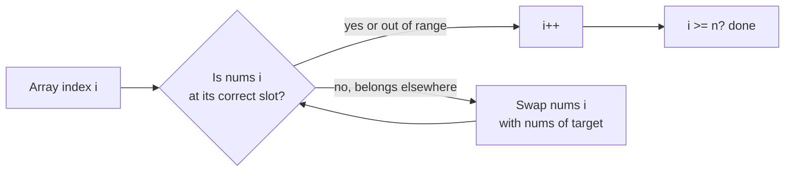

import { Callout } from 'fumadocs-ui/components/callout';

<Callout title="TL;DR — Cyclic Sort">

**Use when**: the array contains numbers from a small known range (typically `[1..n]` or `[0..n-1]`) and you need to find missing, duplicate, or misplaced values in O(n) time AND O(1) extra space.

**Trigger phrases**: "array contains numbers from 1 to n", "missing number", "find the duplicate", "first missing positive", "find all numbers that appeared twice".

**The mechanism**: walk the array; if `nums[i]` doesn't belong at index `i`, swap it to its correct index. Continue until each index is satisfied.

**Complexity**: O(n) time, O(1) extra space. Each value is moved at most once.

</Callout>

---

## The problem that motivates this pattern

> **Missing Number (LC 268).** Given an array containing `n` distinct numbers from the range `[0..n]`, return the one that is missing.
>
> Example: `nums = [3, 0, 1]`, `n = 3` → missing is `2`.

Naive: sort, then scan. O(n log n).

Hash-set approach: build a set, scan from `0` to `n`. O(n) time but **O(n) extra space**.

Sum trick: expected sum is `n(n+1)/2`; actual sum is `sum(nums)`. Difference = missing. O(n) time, O(1) space. Elegant — but breaks for problems involving *multiple* missing or duplicate numbers.

**Cyclic sort solves the general case**: O(n) time, O(1) extra space, and naturally handles duplicates, multiple missing, and "first missing positive."

The idea: **put `nums[i]` at index `nums[i]`** (or `nums[i] - 1` for 1-indexed). After one pass, every index either holds its expected value or reveals what's missing.

```python
def missing_number(nums):
    n = len(nums)
    i = 0
    while i < n:
        if nums[i] < n and nums[i] != i:
            nums[nums[i]], nums[i] = nums[i], nums[nums[i]]
        else:
            i += 1
    for j in range(n):
        if nums[j] != j:
            return j
    return n
```

O(n). Each value is swapped at most once (after it lands at its correct index, it never moves again). The double-loop *looks* O(n²) but the amortized cost is O(n) — at most n swaps total across the whole `while`.

The deeper insight: **cyclic sort is the rare in-place trick that gives O(n) time AND O(1) space for a class of problems normally solved with hash sets**. When the trigger ("array contains 1..n" or similar) appears, this is the answer.

---

## The core insight

**When the array is supposed to contain a known range, you can use the array's own indices as the hash table.**

The invariant we maintain:

> **After processing index `i`, the value at index `i` is either the correct one (`i` for 0-indexed, `i+1` for 1-indexed) or one that "belongs elsewhere but its target slot already contains the right value."**

After one full pass, every index either holds the expected value or contains a "wrong" value because the expected one is missing/duplicated.

Why this is O(n): **each value is moved to its correct slot at most once**. After it's there, no further swap involves it. The total swap count across the entire algorithm is bounded by `n`.

Cyclic sort is a *specific* algorithm for a *specific* shape of problem. Unlike sorting (which doesn't care about the range), cyclic sort exploits the range information to avoid comparisons entirely.



The key: we **don't increment `i` after a swap**. We re-check whether the *new* `nums[i]` is now correct. Only after `nums[i]` is settled (correct or out-of-range) do we move on.

---

## Visual walkthrough

Trace cyclic sort on `nums = [3, 1, 5, 4, 2]` (1-indexed: each value `v` should be at index `v - 1`).

```
Initial:  i=0, nums = [3, 1, 5, 4, 2]
  nums[0]=3 should be at index 2. Swap nums[0] ↔ nums[2].
  nums = [5, 1, 3, 4, 2]
  Don't increment i. Check nums[0] again.

  nums[0]=5 should be at index 4. Swap nums[0] ↔ nums[4].
  nums = [2, 1, 3, 4, 5]

  nums[0]=2 should be at index 1. Swap nums[0] ↔ nums[1].
  nums = [1, 2, 3, 4, 5]

  nums[0]=1 is at index 0 ✓. Increment i.

i=1: nums[1]=2, at index 1 ✓. i++
i=2: nums[2]=3, at index 2 ✓. i++
i=3: nums[3]=4, at index 3 ✓. i++
i=4: nums[4]=5, at index 4 ✓. i++

Done. nums = [1, 2, 3, 4, 5].
```

In 3 swaps, the array is sorted. **Each value moved exactly once to its final position.**

The pattern carries through for problems where the array *isn't* a permutation — the misplaced index after the pass reveals what's missing.

---

## The template

### Template — Cyclic sort for 1..n

```python
def cyclic_sort(nums):
    """Sorts nums in place. Assumes values in [1..n]."""
    i = 0
    while i < len(nums):
        # Where should nums[i] go? (1-indexed → index = nums[i] - 1)
        target = nums[i] - 1
        if 0 <= target < len(nums) and nums[i] != nums[target]:
            nums[i], nums[target] = nums[target], nums[i]
        else:
            i += 1
```

**Three slots:**

1. **Target index formula** — `nums[i] - 1` for 1-indexed; `nums[i]` for 0-indexed.
2. **Bounds check** — skip values outside the expected range (e.g., negatives, zeros).
3. **Duplicate guard** — if `nums[target]` already equals `nums[i]`, swapping is a no-op and would infinite-loop. Skip with `nums[i] != nums[target]`.

### After the cyclic sort, scan to find the answer

The scan depends on what the problem asks:

```python
# Missing number (0..n range): find index where nums[i] != i (or n if all match)
def missing_number(nums):
    cyclic_sort_zero_indexed(nums)
    for i in range(len(nums)):
        if nums[i] != i: return i
    return len(nums)

# All missing numbers (1..n): collect indices where nums[i] != i+1
def find_disappeared(nums):
    cyclic_sort_one_indexed(nums)
    return [i + 1 for i in range(len(nums)) if nums[i] != i + 1]

# All duplicates: same scan, but value at "wrong" index IS the duplicate
def find_duplicates(nums):
    cyclic_sort_one_indexed(nums)
    return [nums[i] for i in range(len(nums)) if nums[i] != i + 1]

# First missing positive: same scan; first wrong index is the answer
def first_missing_positive(nums):
    cyclic_sort_one_indexed(nums, skip_invalid=True)
    for i in range(len(nums)):
        if nums[i] != i + 1: return i + 1
    return len(nums) + 1
```

The same setup phase, different scan phase. **Memorize the setup; the scan is problem-specific.**

---

## Worked example: First Missing Positive (LC 41)

> **Problem.** Given an unsorted integer array `nums`, return the smallest missing positive integer. The algorithm must run in O(n) time and use O(1) extra space.
>
> Example: `nums = [3, 4, -1, 1]` → `2` (since 1 is present, 2 is the smallest missing positive).

**Why this is cyclic sort.** O(n) time AND O(1) space rules out sorting and hash sets. The trick: the answer is *guaranteed* to be in the range `[1, n+1]`. (Why? Because the array has only `n` elements; even if they're all present positives starting from 1, the answer is at most `n+1`.)

Use cyclic sort to place each positive value `v ∈ [1..n]` at index `v - 1`. Ignore negatives, zeros, and values > n (they can't affect the answer). After one pass, scan for the first index `i` where `nums[i] != i + 1` — that's the answer.

```python
def first_missing_positive(nums: list[int]) -> int:
    n = len(nums)
    i = 0
    while i < n:
        # Where should nums[i] go?
        target = nums[i] - 1
        # Valid range AND not already in correct position AND not duplicate
        if 0 <= target < n and nums[i] != nums[target]:
            nums[i], nums[target] = nums[target], nums[i]
        else:
            i += 1

    for j in range(n):
        if nums[j] != j + 1:
            return j + 1
    return n + 1
```

**Dry-run on `[3, 4, -1, 1]`:**

```
n = 4

i=0: nums[0]=3, target=2. nums[2]=-1, not equal. Swap.
     nums = [-1, 4, 3, 1]

i=0: nums[0]=-1, target=-2. Out of range. Skip. i++

i=1: nums[1]=4, target=3. nums[3]=1, not equal. Swap.
     nums = [-1, 1, 3, 4]

i=1: nums[1]=1, target=0. nums[0]=-1, not equal. Swap.
     nums = [1, -1, 3, 4]

i=1: nums[1]=-1, target=-2. Out of range. Skip. i++

i=2: nums[2]=3, target=2. nums[2]=3, already correct. Skip. i++
i=3: nums[3]=4, target=3. Already correct. Skip. i++

Done. Final array: [1, -1, 3, 4].

Scan:
  j=0: nums[0]=1 == j+1=1 ✓
  j=1: nums[1]=-1 ≠ j+1=2 → return 2.
```

**Answer: 2** ✓.

**Why is this O(n)?** Each swap either:
1. Places a value at its correct slot (one swap per value max), OR
2. Sends an out-of-range value somewhere (where it'll be skipped).

Across the entire algorithm, swaps are bounded by `n`. The outer `while` runs at most `2n` times. Total: O(n).

**Why O(1) space?** The algorithm mutates the input array; no auxiliary data structures.

This problem is famously the gateway to recognizing cyclic sort. Once you've solved it, you've internalized the pattern.

---

## Variants

### Variant 1 — Cyclic Sort (the base case)

The pure version: given an array of 1..n, sort it in O(n) time. Used as a stepping stone for the other variants.

**Canonical problem**: Grokking's "Cyclic Sort" — not on LeetCode as a direct problem but underlies all the others.

### Variant 2 — Missing Number (single missing in 0..n)

Sort cyclically; first index where `nums[i] != i` is the answer.

**Canonical problem**: 268 Missing Number.

### Variant 3 — Find All Missing Numbers (1..n range)

Collect every index where the wrong value sits — the indices reveal the missing values.

**Canonical problem**: 448 Find All Numbers Disappeared in an Array.

### Variant 4 — Find Duplicate (Floyd's vs cyclic sort)

For "exactly one duplicate" in 1..n, both Floyd's cycle detection ([Two Pointers](/dsa/patterns/arrays-strings/two-pointers)) and cyclic sort work. Floyd's preserves the array; cyclic sort doesn't.

**Canonical problem**: 287 Find the Duplicate Number.

### Variant 5 — Find All Duplicates

Cyclic sort; when a value would swap into a slot already holding the correct value, *it's a duplicate*. Collect these.

**Canonical problem**: 442 Find All Duplicates in an Array.

### Variant 6 — First Missing Positive

The hardest one. Range is `[1..n+1]`; values outside `[1..n]` are skipped. See the worked example.

**Canonical problem**: 41 First Missing Positive.

### Variant 7 — Find the Corrupt Pair (one missing + one duplicated)

Combination: after cyclic sort, the misplaced index reveals both the missing and duplicated values.

**Canonical problem**: 645 Set Mismatch.

### Variant 8 — Find the Smallest Missing from a Sorted Array

For *sorted* arrays, [Binary Search](/dsa/patterns/arrays-strings/binary-search) is faster than cyclic sort.

**Canonical problem**: 1539 Kth Missing Positive Number (binary search).

---

## Common pitfalls

| Trap | Fix |
|------|-----|
| Incrementing `i` after a swap | Don't. Re-check `nums[i]` — it might still be wrong after the swap |
| Forgetting bounds check on target | A value of -5 in a length-4 array would swap with `nums[-6]` (IndexError or wraparound). Always `if 0 <= target < n` |
| Infinite loop on duplicates | If `nums[i] == nums[target]`, skip — otherwise you'd swap forever |
| 1-indexed vs 0-indexed confusion | Range `[1..n]` → target = `nums[i] - 1`. Range `[0..n-1]` → target = `nums[i]`. Be explicit |
| Using cyclic sort on data with values outside the expected range | The bounds check handles this — out-of-range values stay in place and are flagged during the scan |
| Mutating the input when the caller expects it preserved | If the API contract requires preservation, use a copy or a different algorithm (Floyd's, XOR trick) |
| Assuming O(n²) because of the nested loop | The total work is O(n) amortized — each value moves once. Trust the math |
| Off-by-one in the scan | Range `[1..n]` → return `j + 1`; range `[0..n]` → return `j` |

---

## Complexity

**Time: O(n)** amortized. The `while` loop's iterations are bounded by:
- The number of values that get swapped (≤ n total swaps).
- The number of times we increment `i` (= n).

So total iterations ≤ 2n = O(n).

**Space: O(1)** — only the index `i` and the swap operation. The input array is mutated in place.

The space efficiency is what makes this pattern *special*. Most array problems trade space for time; cyclic sort gives you both.

---

## When NOT to use cyclic sort

- **The array's values aren't in a known small range.** Cyclic sort needs the values to map to indices. Random integers? Use sorting or hash sets.
- **You can't mutate the input.** If the array must be preserved, this pattern is off-limits.
- **You need stability or comparison-based properties.** Cyclic sort is a "sorting" algorithm only by coincidence — it doesn't compare values, it places them.
- **The range is much larger than `n`.** If `n = 100` but values are in `[1..10^9]`, the index trick can't apply. Use sorting or hashing.
- **You need partial sorts or top-K.** Cyclic sort gives you the *full* sorted array; if you only need top-K, use a heap.
- **You need to find missing numbers in a *sorted* array.** Binary search is asymptotically better here.

### Decision rule

| Symptom | Likely pattern |
|---------|---------------|
| "Array contains 1..n / 0..n, find missing/duplicate" | **Cyclic Sort** |
| "First missing positive" | **Cyclic Sort** |
| "Find all numbers that appeared twice" | **Cyclic Sort** |
| "Find duplicate, can't modify array" | [Floyd's Tortoise & Hare](/dsa/patterns/arrays-strings/two-pointers) |
| "XOR-based single missing" | [Bit Manipulation](/dsa/patterns/bit/bit-manipulation) |
| "Random integers, find duplicates" | [Hashing](/dsa/patterns/arrays-strings/hashing) |
| "Find missing in *sorted* array" | [Binary Search](/dsa/patterns/arrays-strings/binary-search) |

---

## Real-world applications

- **Slot assignment / seat arrangement.** Putting items in their canonical slots in O(n) with O(1) memory.
- **In-place bucket sort.** When values map cleanly to a small index range, this is essentially what cyclic sort does.
- **Data validation pipelines.** Verifying that an ID sequence has no gaps or duplicates without using extra memory.
- **Low-memory embedded systems.** When RAM is precious, in-place algorithms like cyclic sort are favored over hash-set approaches.
- **GPU / SIMD algorithms.** Some parallel scan algorithms have a similar "place at known index" character.
- **Histogram construction.** Building a frequency map *implicitly* by moving values to their indexed slots.

---

## Curated practice problems

| # | Problem | Difficulty | Variant | Note |
|---|---------|-----------|---------|------|
| 1 | ★ 268 Missing Number | Easy | Single missing in 0..n | Or XOR / sum trick |
| 2 | 448 Find All Numbers Disappeared in Array | Easy | All missing in 1..n | Or negate-mark variant |
| 3 | ★ 287 Find the Duplicate Number | Medium | Single duplicate | Cyclic OR Floyd's |
| 4 | 442 Find All Duplicates in Array | Medium | All duplicates | Or negate-mark variant |
| 5 | ★ 41 First Missing Positive | Hard | Range [1..n+1] | This page's worked example |
| 6 | 645 Set Mismatch | Easy | One missing + one duplicate | Both come out of one pass |
| 7 | 765 Couples Holding Hands | Hard | Cyclic-sort variant | Each "couple" is at indices `2i, 2i+1` |

This is the pattern's *full* problem set on LeetCode — about 7 problems. The pattern is narrow but high-ROI: every one of these is hard to solve in O(n) time AND O(1) space without it.

---

## Related patterns

- [Two Pointers](/dsa/patterns/arrays-strings/two-pointers) — Floyd's is the alternative for "find duplicate" without mutation
- [Bit Manipulation](/dsa/patterns/bit/bit-manipulation) — XOR trick handles "single missing in pair" elegantly
- [Hashing](/dsa/patterns/arrays-strings/hashing) — the alternative when you have memory to spare
- [Binary Search](/dsa/patterns/arrays-strings/binary-search) — for sorted input

---

## Quick-reference card

```python
# Cyclic sort for 1..n (sorts in place)
def cyclic_sort(nums):
    i = 0
    while i < len(nums):
        target = nums[i] - 1                          # 1-indexed → 0-indexed
        if 0 <= target < len(nums) and nums[i] != nums[target]:
            nums[i], nums[target] = nums[target], nums[i]
        else:
            i += 1

# After sort, the scan tells you the answer:
# - Missing: indices where nums[i] != i + 1
# - Duplicates: VALUES at those indices
# - First missing positive: first such index + 1
```

Triggers: "array contains 1..n", "missing number", "find duplicate", "first missing positive". Complexity: O(n) time, O(1) space.
