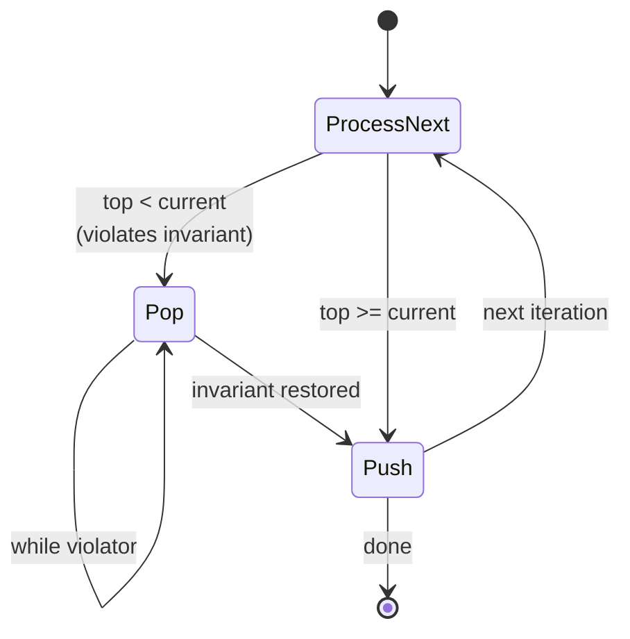
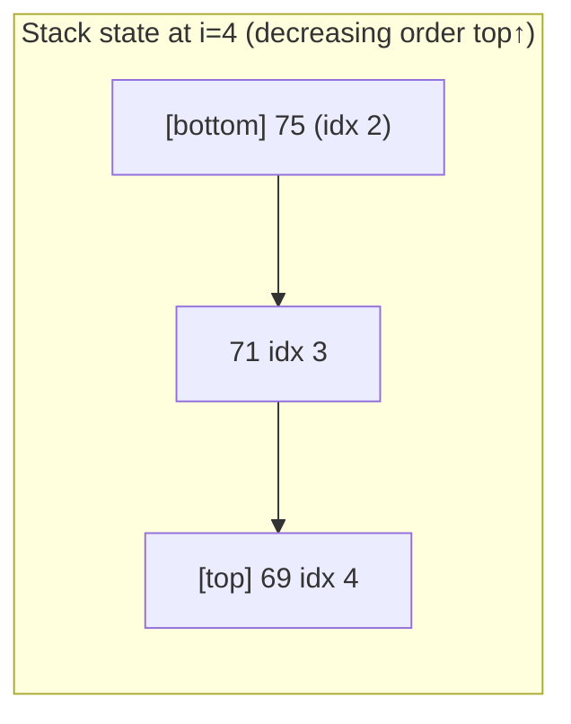

import { Callout } from 'fumadocs-ui/components/callout';

<Callout title="TL;DR — Monotonic Stack / Deque">

**Use when**: you need to answer "what's the next/previous greater/smaller element?" for every position, OR "max/min over every K-sized window."

**Trigger phrases**: "next greater element", "next smaller", "stock span", "daily temperatures", "largest rectangle", "sliding window maximum", "trap rain water", "remove K digits".

**Two structures, one principle**:
- **Monotonic stack** — when the answer involves all subarrays (no left-side eviction).
- **Monotonic deque** — when the answer is over a sliding window (need to evict from the left).

**Complexity**: O(n) amortized — each element is pushed and popped at most once.

</Callout>

---

## The problem that motivates this pattern

> **Daily Temperatures (LC 739).** Given an array of daily temperatures, return an array `answer` where `answer[i]` is the number of days you have to wait *after day i* to get a warmer temperature. If no future warmer day exists, `answer[i] = 0`. Example: `[73,74,75,71,69,72,76,73]` → `[1,1,4,2,1,1,0,0]`.

Brute force: for each `i`, scan forward to find the next index `j` with `temps[j] > temps[i]`. O(n²) worst case.

The wasted work: when you're scanning forward from index 0 to find a warmer day, you pass through index 1, 2, 3, etc. For each of those indices, you'll later scan forward *again* — re-examining values you already saw.

**The fix**: walk through the array once. Maintain a **stack of indices waiting for their answer**. When you see a new temperature `t`, pop every index whose temperature is less than `t` — they've just found their warmer day. Push the current index. Each index is pushed once and popped once. **Amortized O(n)**.

```python
def daily_temperatures(temps):
    n = len(temps)
    ans = [0] * n
    stack = []                                # indices, temps decreasing top→bottom
    for i, t in enumerate(temps):
        while stack and temps[stack[-1]] < t:
            j = stack.pop()
            ans[j] = i - j                    # j's answer found
        stack.append(i)
    return ans
```

The stack contains indices whose values are in **decreasing order top-to-bottom** (or increasing bottom-to-top — same thing). When a bigger value arrives, all the smaller values in the stack get resolved at once.

**That's monotonic stack.** It's a single invariant — *keep the stack ordered* — and the algorithm falls out.

---

## The core insight

**A monotonic stack is a stack with a maintained ordering invariant; pushing a "violator" pops elements until the order is restored.**

For "next greater element" problems, the invariant is:

> **The stack holds indices whose values are strictly decreasing from bottom to top (or non-increasing for "≥" variants).**

For "next smaller element," flip the comparison — the stack stays increasing.

Why does this work? Imagine you're scanning left-to-right. At any point, some earlier indices are still "waiting" for their answer. They're waiting because no later value yet beat them. The stack stores exactly these waiters. When a new value arrives, it satisfies all waiters whose value it exceeds — those are exactly the ones at the top of the stack (since they're smaller). Pop them; record their answer.

The same insight works **right-to-left** too — sometimes more naturally for "previous greater" problems.

For sliding-window max problems, the stack becomes a **deque** because we also need to evict elements that have fallen out of the window (from the left). The monotonic invariant is the same; the eviction is what's new.



---

## Visual walkthrough

Trace **Daily Temperatures** on `temps = [73, 74, 75, 71, 69, 72, 76]`.

```
i=0, t=73:
  stack empty, push 0
  stack = [0]              (temps at stack: [73])

i=1, t=74:
  temps[0]=73 < 74 → pop 0, ans[0] = 1-0 = 1
  push 1
  stack = [1]              (temps: [74])

i=2, t=75:
  temps[1]=74 < 75 → pop 1, ans[1] = 2-1 = 1
  push 2
  stack = [2]              (temps: [75])

i=3, t=71:
  temps[2]=75 >= 71, no pop. Push 3.
  stack = [2, 3]           (temps: [75, 71])  ← decreasing top↑

i=4, t=69:
  temps[3]=71 >= 69, no pop. Push 4.
  stack = [2, 3, 4]        (temps: [75, 71, 69])

i=5, t=72:
  temps[4]=69 < 72 → pop 4, ans[4] = 5-4 = 1
  temps[3]=71 < 72 → pop 3, ans[3] = 5-3 = 2
  temps[2]=75 >= 72, stop. Push 5.
  stack = [2, 5]           (temps: [75, 72])

i=6, t=76:
  temps[5]=72 < 76 → pop 5, ans[5] = 6-5 = 1
  temps[2]=75 < 76 → pop 2, ans[2] = 6-2 = 4
  stack empty. Push 6.
  stack = [6]              (temps: [76])

Done. Anything still on the stack gets ans = 0.
  ans[6] stays 0.

Final: [1, 1, 4, 2, 1, 1, 0]
```

Notice: at index 5, two indices got resolved at once. At index 6, two more. **The total pop count across all iterations is ≤ n.** That's the amortization that makes the algorithm O(n) despite the nested `while`.



---

## The template

### Template A — Monotonic stack (next/previous greater/smaller)

```python
def next_greater(arr):
    n = len(arr)
    ans = [-1] * n                       # default: no greater element
    stack = []                            # indices, values DECREASING top↑

    for i in range(n):
        while stack and arr[stack[-1]] < arr[i]:
            j = stack.pop()
            ans[j] = i                    # or i - j, or arr[i] — depends on problem
        stack.append(i)

    return ans
```

**The four slots:**

1. **Direction** — left-to-right (for "next") or right-to-left (for "previous"). Both are valid.
2. **Comparison** — `<` for "next greater", `>` for "next smaller". Use `<=` / `>=` for strict variants.
3. **Default value** — what `ans[j]` should be if no resolution is ever found (often `-1` or `0` or `n`).
4. **What to record** — the index `i`, the value `arr[i]`, or the distance `i - j`. Read the problem.

### Template B — Monotonic deque (sliding window max/min)

```python
from collections import deque

def sliding_window_max(arr, k):
    dq = deque()                          # indices, values DECREASING from front
    ans = []

    for i, x in enumerate(arr):
        # 1. Evict expired (out of window)
        while dq and dq[0] <= i - k:
            dq.popleft()

        # 2. Maintain monotonicity from the back
        while dq and arr[dq[-1]] < x:
            dq.pop()

        # 3. Add current
        dq.append(i)

        # 4. Record window max (front of deque)
        if i >= k - 1:
            ans.append(arr[dq[0]])

    return ans
```

**The deque has two ends doing different jobs:**

- **Back** — push/pop new arrivals while maintaining monotonicity.
- **Front** — evict expired indices (those that have left the window).

The max of the window is always at the front (the index with the largest value, given the invariant). It's *always* O(1) to query.

---

## Worked example: Largest Rectangle in Histogram (LC 84)

> **Problem.** Given `n` histograms of heights `heights[i]`, find the largest rectangle that fits entirely under the histograms. Example: `[2, 1, 5, 6, 2, 3]` → `10` (the rectangle of width 2 × height 5 over bars at indices 2 and 3).

**Why this is monotonic stack.** For each bar `i`, we want to know: how far left and how far right can we extend a rectangle of height `heights[i]`? The answer is: until we hit a shorter bar on either side. So we need **previous-smaller-element** and **next-smaller-element** for every index. Both are monotonic-stack problems.

**The trick that makes this one nice**: a single left-to-right pass can compute both. When we pop index `j` from the stack at position `i`:
- The bar that's still under `j` on the stack (the new top, if any) is `j`'s previous-smaller.
- The current index `i` is `j`'s next-smaller (because we popped `j` precisely because `heights[i]` was smaller).

So we have everything needed to compute `j`'s maximal rectangle the moment it gets popped.

```python
def largest_rectangle(heights: list[int]) -> int:
    stack = []                                # indices with INCREASING heights top↑
    best = 0
    heights = heights + [0]                   # sentinel to flush remaining stack

    for i, h in enumerate(heights):
        while stack and heights[stack[-1]] > h:
            j = stack.pop()
            # j's height is heights[j]
            # left boundary: stack[-1] (or -1 if empty)
            # right boundary: i (exclusive)
            left = stack[-1] if stack else -1
            width = i - left - 1
            best = max(best, heights[j] * width)
        stack.append(i)

    return best
```

**Dry-run on `[2, 1, 5, 6, 2, 3, 0]` (last 0 is sentinel):**

| i | h | Stack before | Pops & areas | Stack after |
|---|---|---|---|---|
| 0 | 2 | [] | — | [0] |
| 1 | 1 | [0] | pop 0: h=2, width = 1-(-1)-1 = 1, area = 2 | [1] |
| 2 | 5 | [1] | — | [1,2] |
| 3 | 6 | [1,2] | — | [1,2,3] |
| 4 | 2 | [1,2,3] | pop 3: h=6, width = 4-2-1 = 1, area=6; pop 2: h=5, width = 4-1-1 = 2, area=10 | [1,4] |
| 5 | 3 | [1,4] | — | [1,4,5] |
| 6 | 0 | [1,4,5] | pop 5: h=3, width = 6-4-1 = 1, area=3; pop 4: h=2, width = 6-1-1 = 4, area=8; pop 1: h=1, width = 6-(-1)-1 = 6, area=6 | [6] |

Max area: **10** ✓.

**Why does the stack stay increasing?** Because every time we see a value smaller than the top, we *pop* until the invariant holds again. So at any moment, the stack is strictly increasing top-to-bottom (the bottom is the smallest).

**Why the sentinel 0?** To flush the stack at the end. Without it, bars that never get popped (the ones that are still increasing all the way to `n-1`) never get measured. The sentinel forces them all out.

**Complexity.** O(n) — each index is pushed and popped exactly once. O(n) space for the stack.

---

## Variants

### Variant 1 — Next/Previous Greater Element

The base case. Walk forward, pop smaller, push current. Returns next-greater for each index.

For *previous* greater: walk backward (right to left) using the same stack logic.

**Canonical problems**: 496 Next Greater Element I, 503 Next Greater Element II (circular array — process the array twice), 739 Daily Temperatures (this page's intro), 1019 Next Greater Node in Linked List.

### Variant 2 — Next Smaller Element

Flip `<` to `>`. The stack stays *increasing* top-to-bottom instead of decreasing.

**Canonical problems**: 901 Online Stock Span (counts how many days back to a higher price), 84 Largest Rectangle in Histogram (this page's worked example), 85 Maximal Rectangle (apply 84 to each row).

### Variant 3 — Stack with running info (max, min, custom)

The stack can store *(index, value, additional_info)* tuples. Useful when the "answer" requires more than just an index.

```python
# Stock Span — for each day, count how many previous days had a price ≤ current
def stock_span(prices):
    stack = []                              # (price, span)
    ans = []
    for p in prices:
        span = 1
        while stack and stack[-1][0] <= p:
            span += stack.pop()[1]
        stack.append((p, span))
        ans.append(span)
    return ans
```

**Canonical problems**: 901 Online Stock Span, 402 Remove K Digits, 316 Remove Duplicate Letters, 1856 Maximum Subarray Min-Product.

### Variant 4 — "Largest rectangle" family

Use monotonic stack to find left/right boundaries simultaneously.

**Canonical problems**: 84 Largest Rectangle in Histogram, 85 Maximal Rectangle, 1504 Count Submatrices With All Ones.

### Variant 5 — Trapping Rain Water (monotonic stack approach)

Different from the two-pointer approach. Use a *decreasing* stack of heights; when a higher bar arrives, pop and compute trapped water between the new bar and the bar two below in the stack.

```python
def trap(heights):
    stack, water = [], 0
    for i, h in enumerate(heights):
        while stack and heights[stack[-1]] < h:
            bottom = stack.pop()
            if not stack: break
            left = stack[-1]
            width = i - left - 1
            bounded_height = min(heights[left], h) - heights[bottom]
            water += width * bounded_height
        stack.append(i)
    return water
```

**Canonical problem**: 42 Trapping Rain Water (two-pointer is simpler; stack is the more general approach).

### Variant 6 — Sliding Window Maximum (Monotonic Deque)

The deque variant. Used when the answer needs eviction from the left.

```python
from collections import deque
def max_sliding_window(nums, k):
    dq, ans = deque(), []
    for i, x in enumerate(nums):
        while dq and dq[0] <= i - k: dq.popleft()
        while dq and nums[dq[-1]] < x: dq.pop()
        dq.append(i)
        if i >= k - 1: ans.append(nums[dq[0]])
    return ans
```

**Canonical problems**: 239 Sliding Window Maximum, 1438 Longest Continuous Subarray With Abs Diff ≤ Limit (needs both max and min deques), 1696 Jump Game VI (DP + monotonic deque).

### Variant 7 — Lexicographic optimization ("remove K digits", "next permutation")

Use a monotonic stack to *build* an optimal sequence by popping locally suboptimal choices.

```python
# Remove K Digits — make smallest number by removing exactly k digits
def remove_k_digits(num, k):
    stack = []
    for d in num:
        while stack and stack[-1] > d and k > 0:
            stack.pop()
            k -= 1
        stack.append(d)
    # Remove leftover from end if k > 0
    stack = stack[:-k] if k > 0 else stack
    return ''.join(stack).lstrip('0') or '0'
```

**Canonical problems**: 402 Remove K Digits, 316 Remove Duplicate Letters, 1081 Smallest Subsequence of Distinct Characters, 321 Create Maximum Number.

---

## Common pitfalls

| Trap | Fix |
|------|-----|
| Forgetting the sentinel at the end | Many problems require a final flush; append `0` (or `inf`) to force a clean stack |
| Using `<` when you need `<=` (or vice versa) | "Equal" cases matter: "Next strictly greater" uses `<`; "Next ≥" uses `<=`. Test on duplicates |
| Confusing index stack vs value stack | Most templates store *indices*, so you can compute distances. Don't lose track |
| Off-by-one on width calculation in histogram | Width when popping `j` at index `i` with stack-top `left`: `i - left - 1`, not `i - left` |
| Using a list as a deque (popping from front is O(n)) | Use `collections.deque` in Python. In Java, `ArrayDeque` |
| Sliding window deque: forgetting to evict expired | The `while dq and dq[0] <= i - k: dq.popleft()` check is mandatory |
| Mixing monotonic stack with prefix-sum/sliding-window logic | They compose, but you need to think carefully — see [Sum of Subarray Minimums](https://leetcode.com/problems/sum-of-subarray-minimums/) |
| Forgetting to update the answer when popping vs. when pushing | "Next greater" updates *on pop* (the popped element just found its answer) |
| Stack stays empty at end and `left = -1` causes a width bug | Always handle the "empty stack" edge case (use `-1` as left sentinel) |

---

## Complexity

**Time: O(n) amortized.** The outer loop is O(n). The inner `while` looks scary but each element is pushed once and popped at most once across the whole algorithm. Total work is bounded by 2n.

**Space: O(n)** for the stack/deque (worst case: a strictly monotonic input never pops anything).

The amortized argument is the key intuition that separates monotonic-stack masters from "yeah I sort of know this." Each element pays for one push and one pop — and the pops are charged to *future iterations*, not the current one.

---

## When NOT to use monotonic stack/deque

- **You need to query the K-th greatest, not just THE greatest.** Use a heap (or sorted multiset). Monotonic stack only tracks the *frontier*.
- **The "greater" relation isn't transitive in your data.** Monotonic stack relies on comparisons being consistent. For custom comparators that aren't a total order, it can give wrong answers.
- **You need access to non-front elements of the window.** Monotonic deque only exposes the front (the max/min). For "second-largest in window," combine two deques or use a heap.
- **The problem is "max of all subarrays of any size."** That's not the same as "max of all K-sized windows." For all subarrays, you need [DP](/dsa/patterns/dp/linear) or different math.
- **The constraint is non-monotonic.** If a smaller value can sometimes *unblock* a larger one, the stack invariant fails. Reframe the problem first.

### Decision rule

| Symptom | Likely pattern |
|---------|---------------|
| "Next/previous greater/smaller element" | **Monotonic Stack** |
| "Daily temperatures / stock span" | **Monotonic Stack** |
| "Largest rectangle / maximal rectangle" | **Monotonic Stack** (find boundaries) |
| "Trap rain water" | **Two Pointers** or **Monotonic Stack** |
| "Max/min of every K-sized window" | **Monotonic Deque** |
| "K-th largest in window" | [Heap](/dsa/patterns/heaps/heap) (not monotonic) |
| "Remove K digits to minimize" | **Monotonic Stack** (lex optimization) |
| "Number of subarrays with min/max = X" | **Monotonic Stack** (count contributions) |
| "Max of all subarrays of any size" | [DP](/dsa/patterns/dp/linear) or [Sliding Window](/dsa/patterns/arrays-strings/sliding-window) |

---

## Real-world applications

- **Stack-based virtual machines.** JVM, CPython, WebAssembly — all use stacks for expression evaluation. Operator-precedence parsing uses a *monotonic-ish* stack of operators.
- **Histogram analysis in image processing.** Computing the largest "valid region" under a function profile is exactly the LC 84 algorithm — used in document layout and OCR.
- **Stock-market analytics.** The "stock span" indicator is computed in real-time using a monotonic stack over recent prices.
- **Compiler / static analysis.** Many liveness analyses use monotonic-stack-like sweeps over the control-flow graph in topological order.
- **Network monitoring.** Sliding-window max latency over the last K seconds — computed in real-time with a monotonic deque.
- **Trading systems.** "Highest bid in the last N milliseconds" — monotonic deque.

---

## Curated practice problems

| # | Problem | Difficulty | Variant | Note |
|---|---------|-----------|---------|------|
| 1 | ★ 739 Daily Temperatures | Medium | Next greater | The canonical intro problem |
| 2 | 496 Next Greater Element I | Easy | Next greater | Simpler form |
| 3 | 503 Next Greater Element II | Medium | Circular | Process the array twice (mod n) |
| 4 | 901 Online Stock Span | Medium | Stack with span | Track count, not just index |
| 5 | ★ 84 Largest Rectangle in Histogram | Hard | Find both boundaries | This page's worked example |
| 6 | 85 Maximal Rectangle | Hard | Apply 84 to each row | Histogram per row |
| 7 | 42 Trapping Rain Water | Hard | Stack OR two pointers | Two valid approaches |
| 8 | ★ 239 Sliding Window Maximum | Hard | Monotonic deque | The canonical deque problem |
| 9 | 1438 Longest Subarray w/ Abs Diff ≤ K | Medium | Two deques | Min and max deques together |
| 10 | 1696 Jump Game VI | Medium | DP + monotonic deque | Combines two patterns |
| 11 | ★ 402 Remove K Digits | Medium | Lex optimization | Pop while > current, careful with k |
| 12 | 316 Remove Duplicate Letters | Medium | Lex + last-occurrence | Skip if not last occurrence |
| 13 | 1081 Smallest Subsequence of Distinct Characters | Medium | Same as 316 | Duplicate problem |
| 14 | 907 Sum of Subarray Minimums | Medium | Contribution counting | Each element contributes (left_dist × right_dist) |
| 15 | 1856 Maximum Subarray Min-Product | Hard | Combine stack + prefix sum | Multi-pattern composition |

---

## Related patterns

- [Sliding Window](/dsa/patterns/arrays-strings/sliding-window) — composes with monotonic deque for window aggregates
- [Two Pointers](/dsa/patterns/arrays-strings/two-pointers) — alternative for Trap Rain Water
- [Heap](/dsa/patterns/heaps/heap) — when you need K-th greatest (not just THE greatest)
- [Prefix Sums](/dsa/patterns/arrays-strings/prefix-sum) — combines with monotonic stack for subarray-product problems
- [DP — Linear](/dsa/patterns/dp/linear) — for "max subarray sum" — Jump Game VI uses both

---

## Quick-reference card

```python
# Next greater element
stack, ans = [], [-1] * n
for i, x in enumerate(arr):
    while stack and arr[stack[-1]] < x:
        ans[stack.pop()] = i
    stack.append(i)

# Largest rectangle in histogram (with sentinel)
stack, best = [], 0
for i, h in enumerate(heights + [0]):
    while stack and heights[stack[-1]] > h:
        j = stack.pop()
        left = stack[-1] if stack else -1
        best = max(best, heights[j] * (i - left - 1))
    stack.append(i)

# Sliding window max
from collections import deque
dq, ans = deque(), []
for i, x in enumerate(nums):
    while dq and dq[0] <= i - k: dq.popleft()
    while dq and nums[dq[-1]] < x: dq.pop()
    dq.append(i)
    if i >= k - 1: ans.append(nums[dq[0]])
```

Triggers: next/prev greater, sliding window max, largest rectangle, remove K digits. Complexity: O(n) amortized.
