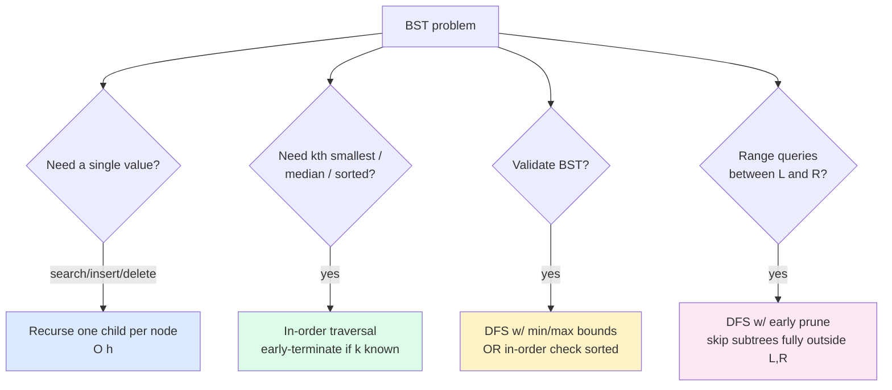

import { Callout } from 'fumadocs-ui/components/callout';

<Callout title="TL;DR — BST Properties">

**Use when**: the tree is a Binary Search Tree — i.e., every node's left subtree contains only smaller values and the right subtree only larger.

**Trigger phrases**: "validate BST", "kth smallest in BST", "BST search/insert/delete", "convert BST to sorted DLL", "recover BST", "LCA of BST".

**Three super-powers**:
1. **O(h) lookup** — at each node, recurse into exactly one child.
2. **In-order = sorted** — the universal trick for "kth smallest", "median", "range sum".
3. **Predecessor/successor in O(h)** — useful for delete and "closest value" problems.

**Complexity**: O(h) per operation. Balanced: O(log n). Skewed: O(n).

</Callout>

---

## The problem that motivates this pattern

> **Kth Smallest Element in a BST (LC 230).** Given the root of a binary search tree and an integer `k`, return the kth smallest value (1-indexed) in the tree.

Naive on a non-BST tree: collect all values into an array, sort, take `arr[k-1]`. O(n log n).

Naive that **uses the BST property poorly**: do an in-order traversal collecting all values, return `arr[k-1]`. Better — O(n) — but we collect everything when we only need k.

The right approach: do an in-order traversal **early-terminating** as soon as we've visited `k` nodes. Average case O(h + k); worst case O(n).

```python
def kth_smallest(root, k):
    stack = []
    while root or stack:
        while root:                                  # go all the way left
            stack.append(root)
            root = root.left
        root = stack.pop()
        k -= 1
        if k == 0: return root.val
        root = root.right
```

**That's the BST trick: in-order gives you sorted order; combine with early termination for O(h+k).** For balanced trees and small `k`, that's a massive win over collecting everything.

The deeper insight: **BSTs aren't a different traversal pattern — they're the same patterns as binary trees, but with the in-order invariant providing extra information.** Many problems that look hard on a general tree are *easy* on a BST.

---

## The core insight

**A BST is a tree whose in-order traversal is sorted.** That's the whole property. Everything else follows.

The invariant:

> **For every node X, `max(X.left subtree) < X.val < min(X.right subtree)`.**

From this single property, three super-powers emerge:

1. **O(h) search.** When looking for value `v`, at each node compare with `v`: if equal, found; if less, go right; if greater, go left. You eliminate half the tree at every step (in a balanced tree).

2. **In-order = sorted.** A direct corollary of the invariant. This makes "kth smallest," "kth largest," "median," "in-order successor," and "convert BST to sorted DLL" trivial.

3. **Predecessor/successor in O(h).** The successor of node X is the leftmost node in X's right subtree (or, if no right subtree, the nearest ancestor where X is in the left subtree). Predecessor is the mirror. Used in delete operations.



---

## Visual walkthrough — Search

Find `7` in this BST:

```
            8
          /   \
         3     10
        / \      \
       1   6     14
          / \    /
         4   7  13
```

```
Start at 8. 7 < 8 → go LEFT.
At 3.      7 > 3 → go RIGHT.
At 6.      7 > 6 → go RIGHT.
At 7.      7 == 7 → FOUND.
```

Four comparisons. In an unsorted tree, the worst case is O(n). In this BST, we eliminated about half the tree at each step — O(h).

---

## Visual walkthrough — In-order on a BST

Same tree. In-order traversal: `left subtree → root → right subtree`, recursively.

```
in_order(8):
  in_order(3):
    in_order(1):
      visit 1
    visit 3
    in_order(6):
      in_order(4): visit 4
      visit 6
      in_order(7): visit 7
  visit 8
  in_order(10):
    visit 10
    in_order(14):
      in_order(13): visit 13
      visit 14

Sequence: 1, 3, 4, 6, 7, 8, 10, 13, 14
```

Sorted. **Always sorted, for any BST.** This is the property that turns "find median," "find rank," and "convert to sorted array" from hard problems into trivial ones.

---

## The template

### Template A — BST search/insert/delete (one child per node)

```python
def search(root, target):
    if not root or root.val == target:
        return root
    if target < root.val:
        return search(root.left, target)
    return search(root.right, target)

def insert(root, val):
    if not root: return TreeNode(val)
    if val < root.val: root.left = insert(root.left, val)
    else:              root.right = insert(root.right, val)
    return root

def delete(root, val):
    if not root: return None
    if val < root.val:
        root.left = delete(root.left, val)
    elif val > root.val:
        root.right = delete(root.right, val)
    else:                                            # found the node to delete
        if not root.left:  return root.right
        if not root.right: return root.left
        # Two children: replace with in-order successor (leftmost in right subtree)
        succ = root.right
        while succ.left: succ = succ.left
        root.val = succ.val
        root.right = delete(root.right, succ.val)
    return root
```

**Three slots:**
1. **Decision direction** — left or right based on comparison.
2. **Termination** — null or match.
3. **Delete's two-child case** — replace with successor (or predecessor — either works).

### Template B — In-order traversal of a BST (sorted iteration)

```python
def in_order(root):
    stack, cur = [], root
    while cur or stack:
        while cur:
            stack.append(cur)
            cur = cur.left
        cur = stack.pop()
        yield cur.val                                # or process
        cur = cur.right
```

The iterative version lets you stop after k yields — used for "kth smallest."

### Template C — Validate BST with min/max bounds

```python
def is_valid_bst(root, lo=float('-inf'), hi=float('inf')):
    if not root: return True
    if not (lo < root.val < hi): return False
    return (is_valid_bst(root.left, lo, root.val)
            and is_valid_bst(root.right, root.val, hi))
```

Pass tighter bounds as we recurse. **Don't** just check `node.left.val < node.val < node.right.val` — that's wrong (it allows `3` in the right subtree of `5` even if it's deeper).

### Template D — LCA of BST

```python
def lca_bst(root, p, q):
    while root:
        if p.val < root.val and q.val < root.val:
            root = root.left
        elif p.val > root.val and q.val > root.val:
            root = root.right
        else:
            return root                              # split point — they diverge here
```

For BST LCA, you don't need to recurse into both subtrees (as in general trees). The first node where `p` and `q` are on different sides is the LCA.

---

## Worked example: Validate Binary Search Tree (LC 98)

> **Problem.** Given the root of a binary tree, determine if it is a valid BST. A valid BST has every left subtree's values strictly less than the node and every right subtree's values strictly greater.
>
> Example:
> ```
>     5
>    / \
>   1   4    ← INVALID (4 should be > 5)
>      / \
>     3   6
> ```

**Why the naive check fails.** A natural-but-wrong approach is to check, at each node, that `node.left.val < node.val < node.right.val`. This is too local. In the example above, every parent-child pair is valid (1 < 5, 3 < 4 < 6, 4 < 5 with 4 to the right of 5 but the right side... wait, 4 IS the right child of 5, and 4 < 5 — that violates the BST property *globally* because every right-subtree value must be > root, not just the immediate right child).

The fix: **carry min/max bounds down the recursion**. At each node, ensure its value lies strictly within the bounds inherited from above. When recursing left, the new upper bound is the current value. When recursing right, the new lower bound is the current value.

```python
def is_valid_bst(root) -> bool:
    def helper(node, lo, hi):
        if not node:
            return True
        if not (lo < node.val < hi):
            return False
        return (helper(node.left, lo, node.val)
                and helper(node.right, node.val, hi))
    return helper(root, float('-inf'), float('inf'))
```

**Dry-run on the example:**

| Call | (lo, hi) | node.val | Check passes? | Recurse |
|------|----------|----------|---------------|---------|
| helper(5, -inf, inf) | -inf, inf | 5 | yes | (1, -inf, 5), (4, 5, inf) |
| helper(1, -inf, 5) | -inf, 5 | 1 | yes | both null → True |
| helper(4, 5, inf) | 5, inf | 4 | **NO** (4 not > 5) | return False |
| | | | | bubbles up → final answer False ✓ |

**Alternative**: in-order check. Run an in-order traversal and verify that each value is strictly greater than the previous.

```python
def is_valid_bst_inorder(root):
    prev = [float('-inf')]
    def in_order(node):
        if not node: return True
        if not in_order(node.left): return False
        if node.val <= prev[0]: return False
        prev[0] = node.val
        return in_order(node.right)
    return in_order(root)
```

Both work; min/max bounds are more idiomatic.

**Complexity.** O(n) time — every node visited once. O(h) recursion depth.

---

## Variants

### Variant 1 — Search/insert/delete

Single-child descent guided by comparison. Delete is the tricky one — two-children case uses the in-order successor.

**Canonical problems**: 700 Search in BST, 701 Insert into BST, 450 Delete Node in BST.

### Variant 2 — Kth smallest / largest

In-order traversal with a counter. Stop early when you've visited k nodes.

**Canonical problems**: 230 Kth Smallest in BST, "Kth Largest" (reverse in-order: right → root → left).

### Variant 3 — Validate BST

Min/max bounds (template C) or in-order check.

**Canonical problems**: 98 Validate BST, 333 Largest BST Subtree (return `(is_bst, count, min, max)` tuple).

### Variant 4 — Range / Closest value problems

Use BST property to prune subtrees. To find values in `[L, R]`, skip the left subtree if `node.val < L` and the right subtree if `node.val > R`.

```python
def range_sum_bst(root, L, R):
    if not root: return 0
    if root.val < L: return range_sum_bst(root.right, L, R)        # skip left
    if root.val > R: return range_sum_bst(root.left, L, R)         # skip right
    return root.val + range_sum_bst(root.left, L, R) + range_sum_bst(root.right, L, R)
```

**Canonical problems**: 938 Range Sum of BST, 270 Closest Value in BST, 272 Closest BST Values K, 938 Range Sum.

### Variant 5 — Convert / Construct BST

**Sorted array → BST:** recurse on midpoint as root, build left from `arr[:mid]`, right from `arr[mid+1:]`. Produces a balanced BST.

**BST → sorted DLL:** in-order traversal, rewire pointers. Subtle.

**Canonical problems**: 108 Sorted Array to BST, 109 Sorted List to BST, 426 Convert BST to Doubly Linked List, 1008 Construct BST from Preorder.

### Variant 6 — Recover BST (two nodes swapped)

Run in-order; find the two "out of order" pairs; swap them.

```python
def recover_tree(root):
    first = second = prev = None
    def in_order(node):
        nonlocal first, second, prev
        if not node: return
        in_order(node.left)
        if prev and prev.val > node.val:
            if not first: first = prev
            second = node
        prev = node
        in_order(node.right)
    in_order(root)
    first.val, second.val = second.val, first.val
```

**Canonical problem**: 99 Recover BST.

### Variant 7 — LCA of BST (no recursion needed)

Walk down the tree: when `p` and `q` diverge (one less, one greater), the current node is the LCA.

**Canonical problems**: 235 LCA of BST, 1644 LCA of Binary Tree II (handle null `p` or `q`).

---

## Common pitfalls

| Trap | Fix |
|------|-----|
| Validating BST with only local parent-child checks | Use min/max bounds or in-order — local checks miss far-descendants |
| Using `<=` vs `<` in BST definition | Most LC problems require *strict* — no duplicates. Check the spec |
| Forgetting that BST operations are O(h), not O(log n), in the worst case | Worst case is a skewed tree → O(n). Mention this to interviewers |
| Recursing into both subtrees when only one is needed | BST gives you a direction; pick one |
| Deleting two-child node by replacing root.val but not deleting the successor | Step 2: recursively delete the successor from the right subtree |
| Confusing in-order with pre-order | In-order: L → root → R. Pre-order: root → L → R. Only in-order is sorted for BSTs |
| Building unbalanced BST and being surprised it's slow | If you insert sorted data into a vanilla BST, you get a linked list. Use a balanced BST (AVL, Red-Black) for production |
| Floating-point comparisons for BST values | If values are floats, equality is dicey — use a tolerance or convert to int |

---

## Complexity

**Time: O(h)** per single-node operation (search, insert, delete, find predecessor/successor).

For a **balanced** BST: O(log n).
For a **skewed** BST (worst case): O(n).

**Space: O(h)** recursion. Same balanced vs skewed asymmetry.

For *all-element* operations (in-order traversal, range scan): O(n) time.

**Self-balancing BSTs** (AVL, Red-Black, Treap, Splay) maintain h = O(log n) automatically. In interviews, you rarely need to implement these — just mention them. In production, `std::map`, `TreeMap`, `SortedDict` are typically Red-Black trees.

---

## When NOT to use BST patterns

- **The tree isn't a BST.** You can't use the in-order=sorted trick on a general binary tree — see [Binary Tree Traversals](/dsa/patterns/trees/traversals).
- **You need O(log n) guaranteed.** Vanilla BST is O(h) worst case = O(n). Use a self-balancing BST or a sorted array with binary search.
- **Frequent insertions of sorted data.** Builds a degenerate skewed tree. Either shuffle the input first, or use a self-balancing structure.
- **You only need "is it in the set?" with no order queries.** Use a hash set — O(1) vs O(log n).
- **The data isn't comparable.** BSTs require a total ordering. For arbitrary objects, you need a comparator or hash-based structure.
- **You need range queries with updates frequently** (not just reads). A balanced BST handles this; a [Segment Tree](https://en.wikipedia.org/wiki/Segment_tree) or BIT is often more efficient.

### Decision rule

| Symptom | Likely pattern |
|---------|---------------|
| "Sorted output from a BST" | **In-order traversal** |
| "Kth smallest/largest" | **In-order with early stop** |
| "Validate BST" | **Min/max bounds** |
| "Search/insert/delete in BST" | **Recurse one child per node** |
| "LCA of BST" | **Walk down until paths diverge** (no recursion needed) |
| "Range sum / closest value in BST" | **DFS with subtree pruning** |
| "Recover BST" | **In-order, find two misplaced nodes** |
| "Build balanced BST from sorted data" | **Recurse on midpoint as root** |
| "Hash-set equivalent" | Plain hash set is faster — only use BST when you need order |

---

## Real-world applications

- **Database B-trees / B+-trees.** Generalizations of BSTs with higher fan-out, used by every database for indexed lookup.
- **Filesystem extent trees.** ext4, NTFS, btrfs all use B-tree variants to index file blocks.
- **Standard-library ordered maps.** `std::map` / `std::set` (C++), `TreeMap` / `TreeSet` (Java), `SortedDict` (Python via `sortedcontainers`) — all Red-Black trees.
- **Priority queues with ordered iteration.** When you need both heap-like priority and sorted iteration, a balanced BST works (a plain heap doesn't give sorted iteration cheaply).
- **Time-series indexes.** Storing events by timestamp for fast range queries — sorted-set or interval-tree.
- **Auction systems.** "Highest bid below my offer" — predecessor query, perfect BST application.

---

## Curated practice problems

| # | Problem | Difficulty | Variant | Note |
|---|---------|-----------|---------|------|
| 1 | 700 Search in BST | Easy | Search | Three-line classic |
| 2 | 701 Insert into BST | Medium | Insert | Recursive descent |
| 3 | 450 Delete Node in BST | Medium | Delete | Two-children: use in-order successor |
| 4 | ★ 98 Validate Binary Search Tree | Medium | Min/max bounds | This page's worked example |
| 5 | 99 Recover Binary Search Tree | Medium | In-order, find misplaced | Two-pass: identify, swap |
| 6 | ★ 230 Kth Smallest Element in BST | Medium | In-order early-stop | Stack-based iteration |
| 7 | 173 Binary Search Tree Iterator | Medium | Stateful in-order | Iterator class with stack |
| 8 | ★ 235 Lowest Common Ancestor of BST | Easy | Diverge point | No recursion needed |
| 9 | 938 Range Sum of BST | Easy | Prune subtrees | Skip outside [L, R] |
| 10 | 270 Closest Value in BST | Easy | Descend tracking best | Single-pass |
| 11 | 272 Closest BST Values K | Hard | In-order + sliding window | Or two stacks |
| 12 | 108 Convert Sorted Array to BST | Easy | Recurse on midpoint | Build balanced |
| 13 | 109 Convert Sorted List to BST | Medium | Recurse on middle (fast/slow) | Or in-order trick |
| 14 | 426 Convert BST to Sorted DLL | Medium | In-order with prev pointer | Rewire during traversal |
| 15 | 1008 Construct BST from Preorder | Medium | Stack + bound | Or recursive with upper bound |

---

## Related patterns

- [Binary Tree Traversals](/dsa/patterns/trees/traversals) — BSTs are binary trees with an extra property; the traversal templates apply directly
- [Trie](/dsa/patterns/trees/trie) — another specialized tree, but indexed by character not by ordering
- [Heap](/dsa/patterns/heaps/heap) — different ordering property (parent vs children); heaps don't give sorted iteration cheaply
- [Binary Search](/dsa/patterns/arrays-strings/binary-search) — BST search is exactly binary search, but on a pointer structure instead of an array

---

## Quick-reference card

```python
# Search
def search(root, t):
    while root and root.val != t:
        root = root.left if t < root.val else root.right
    return root

# In-order iterator (lazy, can early-stop)
stack, cur = [], root
while cur or stack:
    while cur: stack.append(cur); cur = cur.left
    cur = stack.pop()
    yield cur.val                       # this gives sorted order
    cur = cur.right

# Validate
def valid(node, lo=-inf, hi=inf):
    if not node: return True
    if not (lo < node.val < hi): return False
    return valid(node.left, lo, node.val) and valid(node.right, node.val, hi)

# LCA
while root:
    if p.val < root.val > q.val: root = root.left
    elif p.val > root.val < q.val: root = root.right
    else: return root
```

Triggers: BST, sorted iteration, range queries, "kth smallest in BST". Complexity: O(h) per op.
