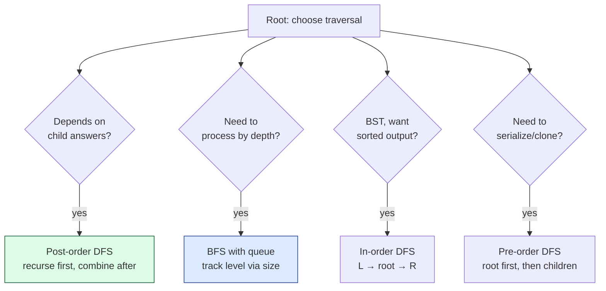
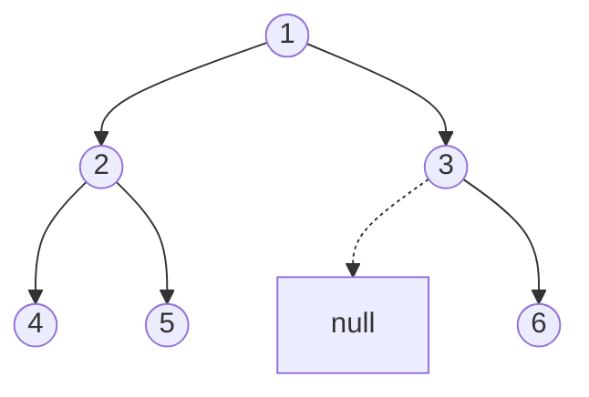

import { Callout } from 'fumadocs-ui/components/callout';

<Callout title="TL;DR — Binary Tree Traversals">

**Use when**: anything on a binary tree — count, sum, validate, transform, compare, serialize.

**Trigger phrases**: "max depth", "level order", "validate BST", "lowest common ancestor", "diameter of binary tree", "path sum", "serialize / deserialize".

**Four traversals**:
- **Pre-order** (`root → left → right`) — useful for serialization, cloning.
- **In-order** (`left → root → right`) — gives sorted output for BSTs.
- **Post-order** (`left → right → root`) — the workhorse: compose child answers into parent. Used by ~70% of tree-DP problems.
- **BFS / Level-order** — when the answer depends on depth or you process layer by layer.

**Complexity**: O(n) time. Space O(h) for DFS (recursion stack), O(w) for BFS (queue), where h = height, w = max width.

</Callout>

---

## The problem that motivates this pattern

> **Maximum Depth of Binary Tree (LC 104).** Given the root of a binary tree, return its maximum depth (the number of nodes along the longest path from root to leaf).

You could try a BFS counting levels. That works. But there's a more elegant approach: **recursively ask each child for its depth, take the max, add 1 for the current node.**

```python
def max_depth(root):
    if not root:
        return 0
    return 1 + max(max_depth(root.left), max_depth(root.right))
```

Three lines. That's it. And it generalizes to almost every tree problem:

- *Sum of nodes* → recurse on children, add their sums, add own value.
- *Diameter* → recurse, get heights, track max `left_height + right_height + 1`.
- *Validate BST* → recurse with min/max bounds, propagate.
- *Lowest Common Ancestor* → recurse, return non-null match.

The pattern: **post-order traversal lets you compose child answers into a parent answer.** This is the structural principle behind most tree problems.

That's the magic. **You stop writing trees as "loops with stacks" and start writing them as recursive compositions.** The recursion *is* the algorithm.

---

## The core insight

**Tree problems have two flavors: depth-bounded (DFS) and breadth-bounded (BFS). The choice depends on what the problem asks.**

### DFS — Post-order is the workhorse

For most tree problems, the answer at the current node *requires the answers from its children*. You can only compute the current answer **after** recursing into children. That's post-order: `left → right → root`.

The invariant of every post-order tree algorithm:

> **By the time we process node X, we have already computed the answer for every node in X's subtree.**

Once you internalize that, problems like "diameter," "max path sum," "house robber on tree," "longest univalue path" all have nearly identical shapes — recurse, get child answers, compose.

### BFS — When depth matters

For "minimum depth," "level order traversal," "right-side view," "rotting oranges," "minimum number of mutations" — you need to process the tree **layer by layer**. BFS with a queue does this naturally.

The invariant of BFS:

> **At every iteration of the outer loop, the queue contains exactly the nodes at the next depth to be processed.**

### In-order — BST's secret weapon

For BSTs, in-order traversal yields nodes in sorted order. This is the *one* situation where you'd reach for in-order specifically.



---

## Visual walkthrough

Consider this tree:

```
        1
       / \
      2   3
     / \   \
    4   5   6
```

The four traversals visit nodes in different orders:

| Traversal | Order | Visit sequence |
|-----------|-------|---------------|
| **Pre-order** | root → left → right | 1, 2, 4, 5, 3, 6 |
| **In-order** | left → root → right | 4, 2, 5, 1, 3, 6 |
| **Post-order** | left → right → root | 4, 5, 2, 6, 3, 1 |
| **BFS (level-order)** | layer by layer | 1, 2, 3, 4, 5, 6 |



The key intuition: **pre-order writes the parent first** (used for serialization, where you need to know the root before its subtrees). **Post-order writes the parent last** (used when the parent's value depends on what's below). **In-order interleaves** (used when ordering matters, as in BSTs).

---

## The template

### Template A — Recursive DFS (all three orderings)

```python
def dfs(node):
    if not node:
        return

    # PRE-ORDER processing (do something with node first)
    process_preorder(node)

    dfs(node.left)

    # IN-ORDER processing (do something between children)
    process_inorder(node)

    dfs(node.right)

    # POST-ORDER processing (do something after both children)
    process_postorder(node)
```

In practice, you write only one of the three blocks depending on the problem.

### Template B — Post-order with composition (the workhorse)

```python
def solve(root):
    def helper(node):
        if not node:
            return base_case                            # e.g., 0, -inf, None

        left = helper(node.left)
        right = helper(node.right)

        # Compose: compute answer for the subtree rooted at node
        return combine(node.val, left, right)

    return helper(root)
```

This is the shape **70% of tree problems** follow. The "interesting" parts of any given problem are:

1. **base_case** — what to return for null nodes (usually `0`, `inf`, `-inf`, or `None`).
2. **combine** — how the current node's value plus its children's results form the subtree's answer.

That's it. Everything from `max_depth` to `diameter` to `path sum III` is variations on `combine`.

### Template C — BFS / Level-order

```python
from collections import deque

def bfs(root):
    if not root: return []
    q = deque([root])
    result = []

    while q:
        level_size = len(q)                             # freeze size BEFORE the inner loop
        level = []
        for _ in range(level_size):
            node = q.popleft()
            level.append(node.val)
            if node.left:  q.append(node.left)
            if node.right: q.append(node.right)
        result.append(level)

    return result
```

The **freeze-the-level-size trick** is what makes BFS work for layer-aware problems. Before the inner loop, capture `len(q)`. Process exactly that many nodes — those are the current level. The new nodes added during processing form the *next* level.

### Template D — Iterative DFS with explicit stack

```python
def iterative_dfs(root):
    if not root: return
    stack = [root]
    while stack:
        node = stack.pop()
        process(node)
        if node.right: stack.append(node.right)         # push right first
        if node.left:  stack.append(node.left)          # so left is popped first → pre-order
```

For iterative in-order / post-order, you need state tracking (which child you've already processed). Most interviewers accept recursive DFS — only reach for iterative when stack depth is a worry (n > 10⁴).

---

## Worked example: Diameter of Binary Tree (LC 543)

> **Problem.** Given the root of a binary tree, return the length of the longest path between any two nodes. The path may or may not pass through the root. Length is measured in number of *edges*.
>
> Example: tree `1 → {2 → {4, 5}, 3}` has diameter 3 (path `4 → 2 → 5` has 2 edges; path `4 → 2 → 1 → 3` has 3 edges).

**Why this is post-order.** At each node, the *longest path passing through that node* is `left_height + right_height`. The overall diameter is the max of these across all nodes. We can compute both with a single post-order DFS.

**What changes from the template.**

1. **What we return**: the *height* of the subtree (used by the parent). NOT the diameter.
2. **What we track separately**: a "max so far" — updated at each node by `left + right`. Since this is *not* what we return, we keep it as a closure variable or class member.

```python
def diameter_of_binary_tree(root) -> int:
    best = 0

    def height(node):
        nonlocal best
        if not node:
            return 0
        left = height(node.left)
        right = height(node.right)
        best = max(best, left + right)                  # update the answer here
        return 1 + max(left, right)                     # return height for the parent

    height(root)
    return best
```

**Dry-run on the tree above (`1 → {2 → {4, 5}, 3}`):**

| Call | left | right | best update | Returns (height) |
|------|------|-------|-------------|------------------|
| `height(4)` | 0 | 0 | best = 0 | 1 |
| `height(5)` | 0 | 0 | best = 0 | 1 |
| `height(2)` | 1 | 1 | best = max(0, 2) = 2 | 2 |
| `height(3)` | 0 | 0 | best = 2 | 1 |
| `height(1)` | 2 | 1 | best = max(2, 3) = 3 | 3 |

**Answer: 3** ✓.

**The key insight** — and the part most people miss the first time — is that **what you return up the recursion is different from what you record in the answer**. The function returns *height* (needed by the parent), but the *answer* is the max of `left + right` ever seen.

This split — *propagate one thing, record another* — is the heart of tree DP. You'll see it again in:

- **Max Path Sum (LC 124):** return max single-path-down; record max path including current as turning point.
- **Longest Univalue Path (LC 687):** return max same-value-path-down; record max combining left and right.
- **House Robber III (LC 337):** return `(rob_this, skip_this)` tuple; the answer is the max at root.

**Complexity.** O(n) time — each node visited once. O(h) stack space, where h is tree height. Balanced: O(log n). Worst case (skewed): O(n).

---

## Variants

### Variant 1 — Pure post-order composition

The "return + record" pattern. Most tree-DP-flavored problems.

**Canonical problems**: 104 Maximum Depth, 543 Diameter, 124 Maximum Path Sum, 687 Longest Univalue Path, 337 House Robber III, 968 Binary Tree Cameras, 1372 Longest ZigZag.

### Variant 2 — Pre-order (top-down, propagate state down)

When the answer at each node depends on *its ancestors' info* (a depth, a running path sum, a min/max bound).

```python
# Path Sum: does a root-to-leaf path sum to target?
def has_path_sum(root, target):
    if not root: return False
    if not root.left and not root.right:
        return target == root.val
    return (has_path_sum(root.left, target - root.val)
            or has_path_sum(root.right, target - root.val))
```

Pre-order shape: process the current node first (subtract from `target`), then recurse.

**Canonical problems**: 112 Path Sum, 113 Path Sum II, 257 Binary Tree Paths, 1448 Count Good Nodes, 988 Smallest String Starting From Leaf.

### Variant 3 — In-order (BST sorted scan)

In-order on a BST is the canonical sorted traversal.

```python
# Kth smallest in BST
def kth_smallest(root, k):
    count = 0
    answer = None
    def in_order(node):
        nonlocal count, answer
        if not node or answer is not None: return
        in_order(node.left)
        count += 1
        if count == k:
            answer = node.val
            return
        in_order(node.right)
    in_order(root)
    return answer
```

**Canonical problems**: 94 Binary Tree Inorder Traversal, 230 Kth Smallest in BST, 98 Validate BST (in-order should be strictly increasing), 99 Recover BST.

### Variant 4 — Level-order BFS

When depth or layer matters.

```python
# Right side view of a tree
def right_side_view(root):
    if not root: return []
    q, ans = deque([root]), []
    while q:
        size = len(q)
        for i in range(size):
            node = q.popleft()
            if i == size - 1: ans.append(node.val)      # last in the level
            if node.left:  q.append(node.left)
            if node.right: q.append(node.right)
    return ans
```

**Canonical problems**: 102 Level Order Traversal, 107 Level Order Bottom-Up, 199 Right Side View, 637 Average of Levels, 116 Populating Next Right Pointers, 111 Minimum Depth (BFS finds first leaf).

### Variant 5 — DFS with multiple returns (tuples)

When you need to propagate *more than one piece of state* up the tree.

```python
# House Robber III — return (rob_this, skip_this)
def rob_tree(root):
    def helper(node):
        if not node: return (0, 0)
        l_rob, l_skip = helper(node.left)
        r_rob, r_skip = helper(node.right)
        rob_this  = node.val + l_skip + r_skip
        skip_this = max(l_rob, l_skip) + max(r_rob, r_skip)
        return (rob_this, skip_this)
    return max(helper(root))
```

**Canonical problems**: 337 House Robber III, 968 Binary Tree Cameras (state: (uncovered, covered-w-camera, covered-without-camera)), 124 Max Path Sum.

### Variant 6 — Serialize / deserialize

Use pre-order with explicit null markers.

```python
def serialize(root):
    parts = []
    def dfs(node):
        if not node:
            parts.append('#')
            return
        parts.append(str(node.val))
        dfs(node.left)
        dfs(node.right)
    dfs(root)
    return ','.join(parts)
```

**Canonical problems**: 297 Serialize and Deserialize Binary Tree, 449 Serialize BST.

### Variant 7 — Lowest Common Ancestor (LCA)

Post-order. Return non-null when either child finds the target.

```python
def lowest_common_ancestor(root, p, q):
    if not root or root == p or root == q:
        return root
    left = lowest_common_ancestor(root.left, p, q)
    right = lowest_common_ancestor(root.right, p, q)
    if left and right: return root                       # split at this node
    return left or right
```

**Canonical problems**: 236 LCA of Binary Tree, 235 LCA of BST (use BST property — simpler), 1644 LCA of Binary Tree II.

### Variant 8 — Bottom-up "boolean answer" propagation

For problems like "is this a valid BST" / "is this balanced", recurse and return `(is_valid, height)` or sentinel-on-failure.

```python
def is_balanced(root):
    def helper(node):
        if not node: return (True, 0)
        lb, lh = helper(node.left)
        if not lb: return (False, 0)
        rb, rh = helper(node.right)
        if not rb: return (False, 0)
        balanced = abs(lh - rh) <= 1
        return (balanced, 1 + max(lh, rh))
    return helper(root)[0]
```

**Canonical problems**: 110 Balanced Binary Tree, 98 Validate BST (with min/max bounds).

---

## Common pitfalls

| Trap | Fix |
|------|-----|
| Confusing what to return vs what to record | Return what the parent *needs*. Record the global answer separately (often `nonlocal best`) |
| Picking pre-order for a post-order problem | If the answer needs child info, you can't compute it before recursing. Use post-order |
| BFS with `for x in queue` instead of freezing size | Freezing `level_size = len(q)` BEFORE the inner loop is mandatory for layer separation |
| Forgetting null guards | Always `if not node: return base_case` as line 1 of recursive helpers |
| Returning the wrong base case | `0` for sum, `inf` for min, `-inf` for max, `None` for "no answer" |
| Mixing up "depth" (root-to-node, increasing) vs "height" (node-to-leaf, increasing) | Depth is computed top-down (pre-order); height is computed bottom-up (post-order) |
| In-order on a non-BST and expecting sorted output | In-order yields sorted output ONLY for BSTs |
| Stack overflow on a skewed tree | Worst case h = n. For n > 10⁴, switch to iterative or Morris traversal (O(1) space) |
| Mutating the tree when problem says "don't" | Many tree problems are read-only; never reassign `node.val` or `node.left` |

---

## Complexity

**Time: O(n)** — every node visited a constant number of times.

**Space:**
- **DFS recursive**: O(h) stack. Balanced tree: O(log n). Skewed: O(n).
- **BFS**: O(w) — max width of the tree. For a complete binary tree, w = n/2.
- **Morris traversal**: O(1) extra space — uses tree mutation to thread back-pointers; clever but rare in interviews.

For deep trees (n = 10⁵, all left-children), Python's default recursion limit (1000) will explode. Use `sys.setrecursionlimit(...)` or convert to iterative. In Java, expect stack overflow above ~10⁴ depth.

---

## When NOT to use these traversals

- **The tree is so large it doesn't fit in memory.** Process it streaming (one subtree at a time) or via an external algorithm.
- **The problem isn't really tree-shaped.** Multiple parents → it's a DAG; use [Topological Sort](/dsa/patterns/graphs/topological-sort) or [DFS/BFS](/dsa/patterns/graphs/dfs-bfs).
- **You need O(1)-space and the tree is huge.** Morris traversal (advanced, mutates tree temporarily) is the only way without explicit stack/queue.
- **You need to find an exact path** (not just compute over subtrees). Pre-order with backtracking, recording the path explicitly.
- **The "tree" is implicit** (e.g., game tree, recursion tree). Use Backtracking instead — see [Backtracking](/dsa/patterns/recursion/backtracking).
- **You need range queries on the tree.** Heavy-light decomposition / Euler tour + segment tree. Advanced; rarely asked.

### Decision rule

| Symptom | Likely traversal |
|---------|-----------------|
| "Max depth / height / sum" | **Post-order DFS** |
| "Diameter / longest path through any node" | **Post-order DFS** (return + record) |
| "Level by level / by depth" | **BFS** |
| "Right/left side view" | **BFS** (last/first per level) |
| "Min depth" | **BFS** (first leaf) |
| "Validate BST" | **In-order** (or post-order with min/max bounds) |
| "Kth smallest in BST" | **In-order** |
| "Serialize / clone / deep copy" | **Pre-order** |
| "LCA" | **Post-order** |
| "Path with property" | **Pre-order** with backtracking |

---

## Real-world applications

- **File system operations.** "Compute folder size" = post-order sum. "Print directory tree" = pre-order with indentation.
- **Compiler ASTs.** Type inference and constant folding are post-order. Code generation is pre-order.
- **DOM / virtual DOM traversal.** React's reconciliation algorithm walks component trees in a specific order.
- **HTML rendering.** Browsers do a pre-order walk to build the DOM, then in-order/post-order passes for layout.
- **Decision trees / expression trees.** Evaluation is post-order. Pretty-printing is in-order with parentheses.
- **Game AI (minimax).** A game tree walked depth-first with alpha-beta pruning is a tree-DFS.

---

## Curated practice problems

| # | Problem | Difficulty | Variant | Note |
|---|---------|-----------|---------|------|
| 1 | ★ 104 Maximum Depth of Binary Tree | Easy | Post-order | Three-line classic |
| 2 | 226 Invert Binary Tree | Easy | Any DFS | Swap children, recurse |
| 3 | 100 Same Tree | Easy | Pre-order | Compare structure + values |
| 4 | 101 Symmetric Tree | Easy | DFS with two pointers | Mirror traversal |
| 5 | ★ 543 Diameter of Binary Tree | Easy | Post-order, return + record | This page's worked example |
| 6 | 110 Balanced Binary Tree | Easy | Post-order, bool + height | Sentinel on imbalance |
| 7 | ★ 124 Maximum Path Sum | Hard | Post-order, return + record | The textbook hard tree problem |
| 8 | 687 Longest Univalue Path | Medium | Same shape as 124 | Path of same-value nodes |
| 9 | ★ 102 Level Order Traversal | Medium | BFS | The canonical BFS |
| 10 | 107 Level Order Bottom-Up | Easy | BFS + reverse | Or use a stack of levels |
| 11 | 199 Right Side View | Medium | BFS, last per level | Or DFS prioritizing right |
| 12 | 116 Populating Next Right Pointers | Medium | BFS with O(1) extra space | Use existing next pointers |
| 13 | ★ 236 Lowest Common Ancestor | Medium | Post-order | Return non-null where p/q found |
| 14 | 235 LCA of BST | Easy | Use BST property | No recursion needed |
| 15 | 297 Serialize and Deserialize | Hard | Pre-order + null markers | Comma-separated, then parse |
| 16 | 112 Path Sum | Easy | Pre-order with running sum | Subtract on descent |
| 17 | 113 Path Sum II | Medium | Pre-order with path | Backtracking append/pop |
| 18 | 337 House Robber III | Medium | Post-order with tuple | (rob, skip) state |
| 19 | 968 Binary Tree Cameras | Hard | Post-order with state machine | Three states per node |
| 20 | 437 Path Sum III | Medium | Pre-order + prefix-sum hashmap | DFS with running sum |

---

## Related patterns

- [BST Properties](/dsa/patterns/trees/bst) — in-order on a BST is the workhorse
- [Trie](/dsa/patterns/trees/trie) — a tree variant for character-based lookup
- [DP — Tree DP](/dsa/patterns/dp/tree-dp) — post-order traversal IS tree DP
- [DFS / BFS / Islands](/dsa/patterns/graphs/dfs-bfs) — graph generalizations (just with visited-set)
- [Backtracking](/dsa/patterns/recursion/backtracking) — pre-order with path tracking

---

## Quick-reference card

```python
# Post-order (the workhorse — compose child answers)
def helper(node):
    if not node: return base_case
    left = helper(node.left)
    right = helper(node.right)
    return combine(node.val, left, right)

# Pre-order with running state
def dfs(node, state):
    if not node: return
    state = update(state, node.val)
    if check(state): record(...)
    dfs(node.left, state)
    dfs(node.right, state)

# Level-order BFS (freeze size!)
q = deque([root])
while q:
    size = len(q)
    for _ in range(size):
        node = q.popleft()
        # process node
        if node.left:  q.append(node.left)
        if node.right: q.append(node.right)

# In-order (BST → sorted)
def in_order(node):
    if not node: return
    in_order(node.left); visit(node); in_order(node.right)
```

Triggers: tree problems, "depth", "level order", "validate", "diameter", "LCA". Complexity: O(n) time, O(h) or O(w) space.
