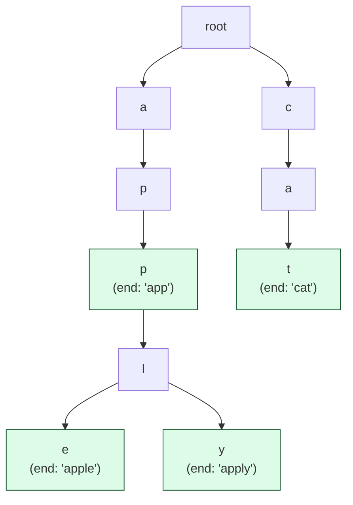

import { Callout } from 'fumadocs-ui/components/callout';

<Callout title="TL;DR — Trie">

**Use when**: many strings share prefixes and you need to query by prefix, OR you need to check word membership in O(word length).

**Trigger phrases**: "implement trie", "word search", "auto-complete", "longest common prefix", "longest word in dictionary", "design dictionary with wildcard", "stream of characters".

**The data structure**: a tree where each edge is labeled with a character. A path from root to a marked node spells out a word. Sibling-prefixed words share the same path.

**Complexity**: O(L) per insert, search, prefix lookup — where L is the word length. *Independent of how many words are in the trie.*

</Callout>

---

## The problem that motivates this pattern

> **Implement Trie (Prefix Tree) (LC 208).** Implement a class with three methods: `insert(word)`, `search(word)` (exact match), `startsWith(prefix)` (does any word start with this prefix).

You could use a hash set. `insert` and `search` are O(1). But what about `startsWith("pre")`? A hash set doesn't support prefix queries — you'd have to scan every word, O(N · L). Brutal for autocomplete on a dictionary of millions of words.

A trie shines here. Walk character-by-character from the root, following edges that match each character of the query. Operations are O(L) — **completely independent of how many words are stored**.

```python
class Trie:
    def __init__(self):
        self.children = {}                            # char → Trie
        self.is_end = False

    def insert(self, word):
        node = self
        for c in word:
            if c not in node.children:
                node.children[c] = Trie()
            node = node.children[c]
        node.is_end = True

    def search(self, word):
        node = self._walk(word)
        return node is not None and node.is_end

    def starts_with(self, prefix):
        return self._walk(prefix) is not None

    def _walk(self, s):
        node = self
        for c in s:
            if c not in node.children: return None
            node = node.children[c]
        return node
```

That's it. **O(L) per operation, regardless of how many words you've inserted.** Insert "apple", "app", "application", "apply" — all share the prefix `"app"`, so storage is roughly proportional to *total unique character paths*, not to the sum of word lengths.

This is why tries dominate autocomplete: searching "pre" finds every word starting with "pre" by walking 3 nodes and then enumerating descendants. Hash maps can't do this.

---

## The core insight

**A trie compresses shared prefixes into shared structure. Operations are O(word length), not O(dictionary size).**

The invariant we maintain:

> **Every word stored in the trie corresponds to a path from the root to some node marked `is_end = True`. Sibling words share their common prefix.**

```
After inserting "app", "apple", "apply":

         (root)
           │
           a
           │
           p
           │
           p ← is_end (for "app")
          / \
         l   l
         │   │
         e   y ← is_end (for "apply")
         │
        end (for "apple") ← is_end
```

The path `a → p → p` is *shared* across all three words. This is why:
- **Memory** scales with unique character paths, not with sum of word lengths.
- **Prefix queries** are trivially fast — walk to the prefix node, then descend.
- **Sorted enumeration** is automatic — depth-first traversal yields words in lexicographic order.

The trade: each node stores a child map (often a hash map or fixed-size array of 26). That's typically more memory than a hash set of strings for *random* words. The trie wins when prefixes are *highly shared* — exactly the autocomplete and word-puzzle scenarios.



---

## Visual walkthrough — insert and search

Trace inserting `"app", "apple", "ape"` then searching `"apply"`.

```
Initial: root = {}, is_end = False

Insert "app":
  walk 'a' → not in children, create. node = root.a
  walk 'p' → create. node = root.a.p
  walk 'p' → create. node = root.a.p.p
  mark is_end = True
  Tree: root → a → p → p(end)

Insert "apple":
  walk 'a' → exists. node = root.a
  walk 'p' → exists. node = root.a.p
  walk 'p' → exists. node = root.a.p.p (is_end already!)
  walk 'l' → create. node = root.a.p.p.l
  walk 'e' → create. node = root.a.p.p.l.e
  mark is_end = True
  Tree: root → a → p → p(end) → l → e(end)

Insert "ape":
  walk 'a' → exists.
  walk 'p' → exists.
  walk 'e' → not in children of root.a.p, create.
  mark is_end = True
  Tree: root → a → p → { p(end) → l → e(end), e(end) }

Search "apply":
  walk 'a' → exists. walk 'p' → exists. walk 'p' → exists.
  walk 'l' → exists. walk 'y' → NOT in children. return False.

Search "app":
  walk 'a', 'p', 'p'. Final node has is_end = True. return True.

startsWith "ap":
  walk 'a', 'p'. Reached node successfully. return True (regardless of is_end).
```

Note the difference between `search` and `startsWith`: both walk to a node; only `search` requires the node to be marked `is_end`.

---

## The template

### Template A — Trie with dict (the dynamic version)

```python
class TrieNode:
    def __init__(self):
        self.children = {}                            # char → TrieNode
        self.is_end = False

class Trie:
    def __init__(self):
        self.root = TrieNode()

    def insert(self, word: str) -> None:
        node = self.root
        for c in word:
            if c not in node.children:
                node.children[c] = TrieNode()
            node = node.children[c]
        node.is_end = True

    def search(self, word: str) -> bool:
        node = self._walk(word)
        return node is not None and node.is_end

    def starts_with(self, prefix: str) -> bool:
        return self._walk(prefix) is not None

    def _walk(self, s: str):
        node = self.root
        for c in s:
            if c not in node.children: return None
            node = node.children[c]
        return node
```

### Template B — Trie with fixed-size array (faster for known alphabets)

```python
class TrieNode:
    __slots__ = ['children', 'is_end']
    def __init__(self):
        self.children = [None] * 26                   # for lowercase a-z
        self.is_end = False

    def child_idx(self, c):
        return ord(c) - ord('a')
```

The array is faster (O(1) lookup, no hashing) and uses less memory per node — but only works if the alphabet is small and fixed. For Unicode or arbitrary characters, use the dict version.

### Template C — Trie with word storage (for "longest match" problems)

```python
class TrieNode:
    def __init__(self):
        self.children = {}
        self.word = None                              # store full word at terminal nodes

# Insert:
node.word = word  # at the final node instead of just is_end = True
```

Useful when you want to *return* the matching word, not just say yes/no. Used in Word Search II.

### Template D — Trie with wildcard support (`.` matches any)

```python
def search_with_dots(self, word):
    return self._search_helper(self.root, word, 0)

def _search_helper(self, node, word, i):
    if i == len(word):
        return node.is_end
    c = word[i]
    if c == '.':
        return any(self._search_helper(child, word, i + 1)
                   for child in node.children.values())
    if c not in node.children: return False
    return self._search_helper(node.children[c], word, i + 1)
```

Used in 211 Design Add and Search Words Data Structure.

---

## Worked example: Word Search II (LC 212)

> **Problem.** Given an `m × n` board of letters and a list of words, return all words found on the board. A word is found if it can be constructed from sequentially adjacent (horizontally/vertically) cells, with no cell used twice.
>
> Example: board = `[["o","a","a","n"],["e","t","a","e"],["i","h","k","r"],["i","f","l","v"]]`, words = `["oath","pea","eat","rain"]` → `["eat", "oath"]`.

**The naive approach.** For each word, run DFS from every cell to check if the word can be traced. O(W · M · N · 4^L) where W = number of words, L = max word length. Too slow.

**The trie insight.** Insert all words into a trie. Now do **one DFS from each cell, walking the trie in parallel**. At each cell, only continue if the trie has a matching child. When you hit a node marked `word`, record that word. The trie *prunes* the DFS aggressively — many words share prefixes, so a single DFS handles them collectively.

This drops complexity to **O(M · N · 4^L)** — independent of the number of words (within memory limits).

```python
def find_words(board: list[list[str]], words: list[str]) -> list[str]:
    # Build trie
    root = {}
    for w in words:
        node = root
        for c in w:
            node = node.setdefault(c, {})
        node['#'] = w                                 # terminal marker holds the word

    m, n = len(board), len(board[0])
    found = set()

    def dfs(r, c, node):
        ch = board[r][c]
        if ch not in node:
            return
        next_node = node[ch]
        if '#' in next_node:
            found.add(next_node['#'])
            del next_node['#']                        # prevent duplicate adds

        board[r][c] = '*'                              # mark visited
        for dr, dc in [(-1,0),(1,0),(0,-1),(0,1)]:
            nr, nc = r+dr, c+dc
            if 0 <= nr < m and 0 <= nc < n and board[nr][nc] != '*':
                dfs(nr, nc, next_node)
        board[r][c] = ch                               # restore

    for r in range(m):
        for c in range(n):
            dfs(r, c, root)

    return list(found)
```

**Why the trie crushes the naive approach.** The trie lets us **explore the board once** and check all words in parallel via shared prefixes. If two words share the prefix "ea", DFS only walks the path once. The terminal markers tell us *which* words are completed, even mid-traversal.

**Two optimizations** (in code above):
- `del next_node['#']` after a word is found prevents adding duplicates and slightly prunes the trie.
- Marking visited in-place (`board[r][c] = '*'`) avoids a separate visited set.

**Dry-run conceptually**: starting from `(1,1)='t'`. Trie path: `t` → not in root (since words start with 'o', 'p', 'e', 'r'). Skip. Try `(1,0)='e'`. Trie has `e` (from "eat"). DFS continues looking for 'a' next, then 't'. Found "eat". And so on for `(0,0)='o'` which finds "oath".

**Complexity.** Time: O(M · N · 4^L) where L = max word length. Space: O(total length of all words) for the trie.

---

## Variants

### Variant 1 — Basic Trie (insert / search / startsWith)

The canonical implementation. Template A.

**Canonical problems**: 208 Implement Trie, 1804 Implement Trie II (with prefix count and word count).

### Variant 2 — Wildcard Trie

Support `.` matching any single character. Template D — recursive DFS into all children on `.`.

**Canonical problem**: 211 Design Add and Search Words Data Structure.

### Variant 3 — Trie + DFS for board search

The "find all words from a dictionary on a board" pattern. Template C.

**Canonical problems**: 212 Word Search II (this page's worked example), 79 Word Search (single word — DFS without trie is simpler).

### Variant 4 — Replace Words / Longest Prefix Match

Find the shortest prefix in the dictionary that matches a given word, OR the longest word in the dictionary that is a prefix of the given word.

```python
def replace_word(word, trie):
    node = trie
    for i, c in enumerate(word):
        if c not in node.children: return word
        node = node.children[c]
        if node.is_end: return word[:i+1]              # found a root
    return word
```

**Canonical problems**: 648 Replace Words, 1268 Search Suggestions System, 720 Longest Word in Dictionary.

### Variant 5 — Compressed / Radix Trie

When most nodes have only one child, collapse chains. Used in production routers (IP address tries, where memory matters) and many key-value stores.

For interviews, just mention it exists — the implementation is more complex.

### Variant 6 — Bit Trie (Binary Trie)

For integers represented in binary. Each node has at most 2 children (bit 0 and bit 1). Used for:
- "Find maximum XOR of two numbers" — bit trie lets you greedily pick opposite bits.
- IP routing.

```python
class BitTrie:
    def __init__(self):
        self.children = [None, None]

    def insert(self, num):
        node = self
        for i in range(31, -1, -1):                   # MSB first
            bit = (num >> i) & 1
            if node.children[bit] is None:
                node.children[bit] = BitTrie()
            node = node.children[bit]

    def max_xor_with(self, num):
        node, result = self, 0
        for i in range(31, -1, -1):
            bit = (num >> i) & 1
            want = 1 - bit                            # opposite for max XOR
            if node.children[want]:
                result |= (1 << i)
                node = node.children[want]
            else:
                node = node.children[bit]
        return result
```

**Canonical problems**: 421 Maximum XOR of Two Numbers in an Array, 1707 Maximum XOR With an Element From Array.

### Variant 7 — Streaming Trie

Implement a class that processes characters one-at-a-time and returns whether any complete word has been "spelled out" by recent characters.

**Canonical problem**: 1032 Stream of Characters (reverse the words; insert into trie; on each new char, walk back from current position to check matches).

### Variant 8 — Suffix Trie / Aho-Corasick

For multi-pattern string matching. Mostly competitive programming territory — rare in FAANG interviews. Mentioned for completeness.

---

## Common pitfalls

| Trap | Fix |
|------|-----|
| Confusing `search` (exact match) with `startsWith` (prefix) | `search` requires `is_end`; `startsWith` doesn't |
| Using a `set` thinking it's just as good for prefix queries | Sets don't support prefix lookup in O(L). Use a trie |
| Forgetting `is_end` and getting false positives | E.g., if "apple" is inserted, searching "app" should return False unless "app" was also inserted |
| Using `{}` as default for children but mutating during iteration | Standard Python pitfall — iterate over `list(node.children.items())` if mutating |
| Recursion depth on long words (~10⁴) | Use iterative `_walk` for the common operations; reserve recursion for wildcard/DFS |
| Mutating the trie during DFS (e.g., Word Search II) without restoring | Either deep-copy or restore on backtrack |
| Storing the entire word at every node (instead of just at terminals) | Wastes memory. Only mark terminals |
| Forgetting to handle empty string | Some problems want `""` to count as a valid prefix of everything |
| Slow performance from `dict.get()` vs direct lookup | Direct lookup `node.children[c]` is faster than `node.children.get(c)` for hot paths |
| Memory blowup on a huge dictionary | Use fixed-size arrays if alphabet is small; consider radix trie for production |

---

## Complexity

**Per operation (insert / search / startsWith):** O(L) where L is the word length. *Independent of the number of words in the trie.*

**Space:** O(total characters across all words) worst case. With shared prefixes, it's much less in practice.

**For a 200k-word English dictionary**: ~1-2 MB of trie. Tiny. Used in production by every major search engine and code editor.

---

## When NOT to use a Trie

- **You don't need prefix queries.** If you only need exact match, a hash set is simpler and faster (no tree overhead).
- **The alphabet is huge and unbounded.** Each node has an entry per child character. For Unicode with no structure, memory blows up. Use a hash map of full strings instead.
- **Memory is *more* constrained than time.** A hash set uses less memory for *random* strings (no prefix overlap to compress).
- **You need range queries on the keys** (e.g., "all words between 'apple' and 'banana'"). Use a balanced BST or sorted array.
- **You need fuzzy matching with arbitrary edits.** A trie supports wildcards efficiently but not "within 2 edits." Use BK-tree or Levenshtein automaton.

### Decision rule

| Symptom | Likely pattern |
|---------|---------------|
| "Implement Trie / autocomplete / prefix search" | **Trie** |
| "Word search on a board with a dictionary" | **Trie + DFS** |
| "Wildcard / dot-pattern search" | **Trie with recursive DFS on dots** |
| "Replace word with shortest matching prefix" | **Trie + walk-until-end** |
| "Longest common prefix of N strings" | **Trie** (or horizontal scan — both O(L)) |
| "Maximum XOR pair" | **Binary Trie** |
| "Stream of characters → match dictionary" | **Reverse-trie of words** |
| "Exact match only, no prefix" | Hash set (not trie) |
| "Range / sorted queries on strings" | BST / sorted array |

---

## Real-world applications

- **Autocomplete / autosuggest.** Google search, IDE code completion, mobile keyboards — all use tries (often compressed radix tries).
- **IP routing.** Routing tables use compressed bit tries to find the longest matching prefix for an incoming packet's destination IP.
- **Spell checkers.** Dictionary + trie + edit-distance traversal for "did you mean?" suggestions.
- **Search engine query suggestions.** Trie of past queries with frequency at terminals.
- **DNS resolution.** Hierarchical structure naturally mirrors trie depth.
- **Bioinformatics — DNA matching.** Suffix arrays and tries are foundational for genome assembly and read alignment.
- **Word games.** Scrabble, Boggle, Word Hunt — dictionary lookups during play use a trie for speed.

---

## Curated practice problems

| # | Problem | Difficulty | Variant | Note |
|---|---------|-----------|---------|------|
| 1 | ★ 208 Implement Trie | Medium | Basic | The canonical |
| 2 | 1804 Implement Trie II (Prefix Tree) | Medium | + countWordsStartingWith / + erase | Adds counters per node |
| 3 | ★ 211 Add and Search Words | Medium | Wildcard | Recursive DFS on dots |
| 4 | ★ 212 Word Search II | Hard | Trie + DFS on board | This page's worked example |
| 5 | 648 Replace Words | Medium | Walk-until-end | Find shortest prefix |
| 6 | 1268 Search Suggestions System | Medium | Trie + DFS for top-3 | Sort and prune at each node |
| 7 | 720 Longest Word in Dictionary | Medium | All prefixes must exist | BFS or DFS through trie |
| 8 | 14 Longest Common Prefix | Easy | Trie or horizontal scan | Trie is overkill but works |
| 9 | 421 Maximum XOR of Two Numbers | Medium | Binary Trie | Greedy bit selection |
| 10 | 1707 Max XOR With Element ≤ M | Hard | Binary Trie + offline queries | |
| 11 | 1032 Stream of Characters | Hard | Reverse-trie + walk back | Each char appends to recent buffer |
| 12 | 745 Prefix and Suffix Search | Hard | Combined trie keys | Index as suffix#prefix |
| 13 | 642 Design Search Autocomplete | Hard | Trie with frequency + top-K | Heap or sort at terminals |
| 14 | 425 Word Squares | Hard | Trie + backtracking | Match column prefixes |

---

## Related patterns

- [DFS / BFS / Islands](/dsa/patterns/graphs/dfs-bfs) — Word Search II composes Trie + DFS
- [Binary Tree Traversals](/dsa/patterns/trees/traversals) — Trie is a tree; traversal patterns apply
- [Hashing](/dsa/patterns/arrays-strings/hashing) — alternative when you don't need prefix queries
- [Backtracking](/dsa/patterns/recursion/backtracking) — Trie + backtracking is the pattern for board-search puzzles

---

## Quick-reference card

```python
# Trie with dict-based children
class Trie:
    def __init__(self):
        self.root = {}                                # nested dicts

    def insert(self, word):
        node = self.root
        for c in word:
            node = node.setdefault(c, {})
        node['#'] = True                              # terminal marker

    def search(self, word):
        node = self.root
        for c in word:
            if c not in node: return False
            node = node[c]
        return '#' in node

    def starts_with(self, prefix):
        node = self.root
        for c in prefix:
            if c not in node: return False
            node = node[c]
        return True

# Binary trie for max XOR
def insert_num(root, num):
    node = root
    for i in range(31, -1, -1):
        bit = (num >> i) & 1
        node = node.setdefault(bit, {})

def max_xor(root, num):
    node, result = root, 0
    for i in range(31, -1, -1):
        bit = (num >> i) & 1
        want = 1 - bit
        if want in node:
            result |= (1 << i); node = node[want]
        else:
            node = node[bit]
    return result
```

Triggers: "implement trie", "autocomplete", "word search II", "wildcard search", "max XOR pair". Complexity: O(L) per op.
