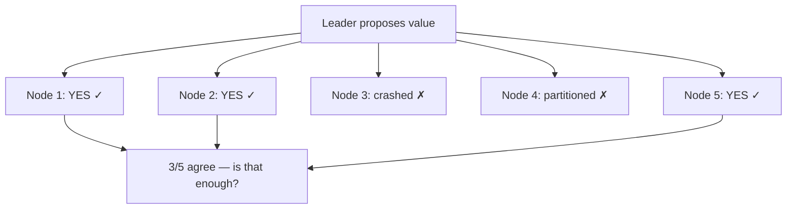
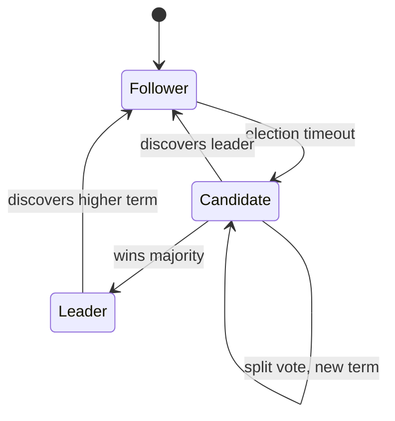
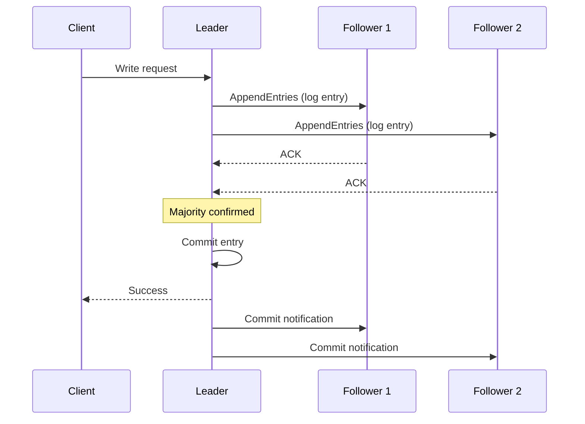
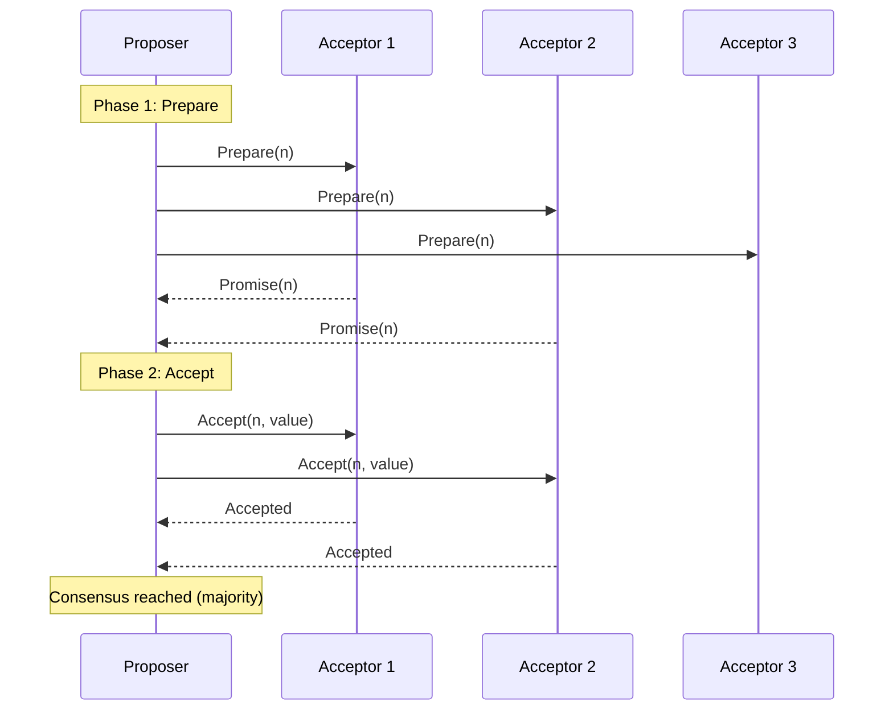

## What is Distributed Consensus?

**Distributed Consensus** is the process of getting multiple nodes to agree on a single value or decision, even in the presence of failures. It's the foundation of reliable distributed systems.

---

## Why Consensus is Hard



Challenges:
- Nodes can crash at any time
- Messages can be lost, delayed, or reordered
- Network partitions split the cluster

---

## Key Properties

| **Property** | **Meaning** |
|-------------|------------|
| Agreement | All correct nodes decide the same value |
| Validity | Decided value was proposed by some node |
| Termination | All correct nodes eventually decide |
| Integrity | Each node decides at most once |

---

## Raft Consensus

Raft is designed to be **understandable**. It breaks consensus into three sub-problems.

### Leader Election



### Normal Operation



### Log Replication

```
Leader Log:   [1:SET x=1] [2:SET y=2] [3:SET x=3]
Follower 1:   [1:SET x=1] [2:SET y=2] [3:SET x=3] ✓
Follower 2:   [1:SET x=1] [2:SET y=2]              (catching up)
```

Followers replicate the leader's log in order. Committed entries are never lost.

---

## Paxos

The original consensus algorithm. More general but harder to understand.

### Roles

| **Role** | **Function** |
|---------|-------------|
| Proposer | Proposes values |
| Acceptor | Votes on proposals |
| Learner | Learns decided values |

### Two Phases



---

## Raft vs Paxos

| **Aspect** | **Raft** | **Paxos** |
|-----------|---------|----------|
| Understandability | Designed to be simple | Notoriously complex |
| Leader | Strong leader required | Optional |
| Log ordering | Strict sequential | Flexible |
| Implementation | Many production systems | Fewer implementations |
| Performance | Good for most cases | Better in some edge cases |

---

## Real-World Usage

| **System** | **Algorithm** | **Used For** |
|-----------|--------------|-------------|
| etcd | Raft | Kubernetes state, config |
| CockroachDB | Raft | Distributed SQL |
| Consul | Raft | Service discovery |
| Google Spanner | Paxos | Global SQL database |
| Apache ZooKeeper | ZAB (Paxos-like) | Coordination |

---

## Quorum Requirements

```
Cluster size: 2f + 1 nodes
Tolerates: f failures

3 nodes → tolerates 1 failure
5 nodes → tolerates 2 failures
7 nodes → tolerates 3 failures
```

| **Cluster Size** | **Majority** | **Failures Tolerated** |
|-----------------|-------------|----------------------|
| 3 | 2 | 1 |
| 5 | 3 | 2 |
| 7 | 4 | 3 |

---

## Interview Tips

- Explain why consensus is hard (FLP impossibility)
- Know Raft's three sub-problems: leader election, log replication, safety
- Understand quorum: majority of 2f+1 nodes
- Compare Raft vs Paxos (Raft is simpler)
- Give examples: etcd, CockroachDB, ZooKeeper
