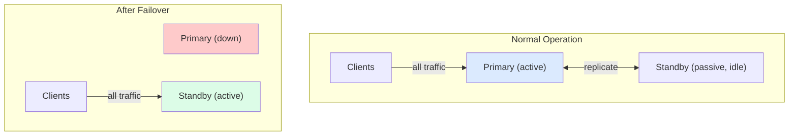
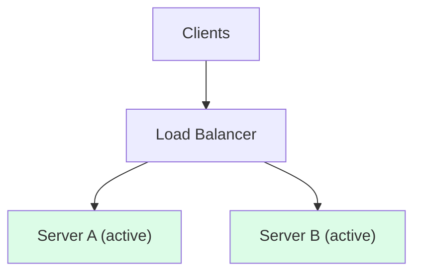
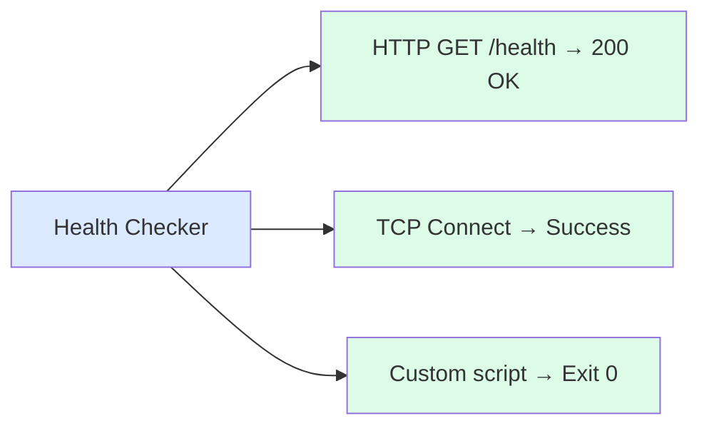
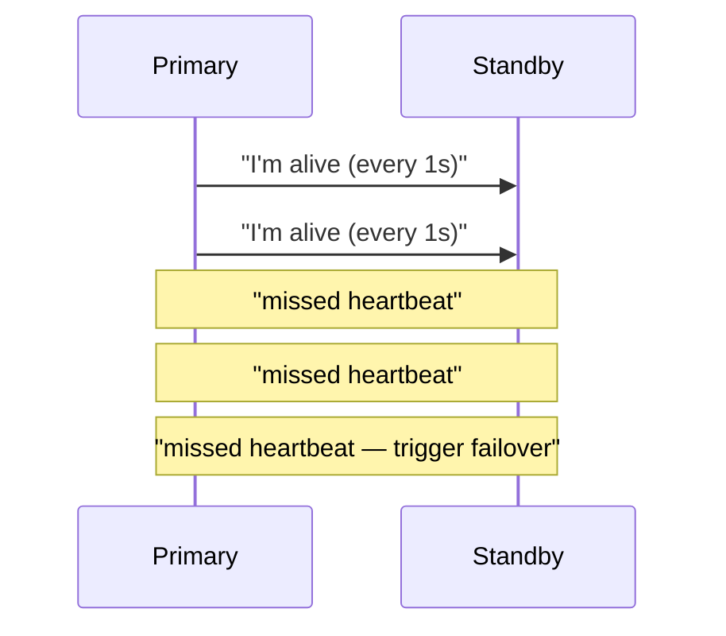
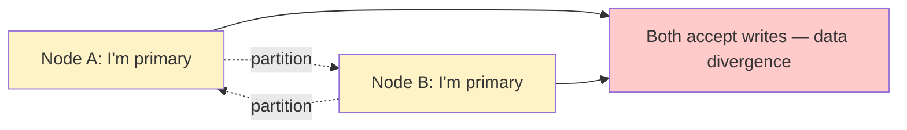
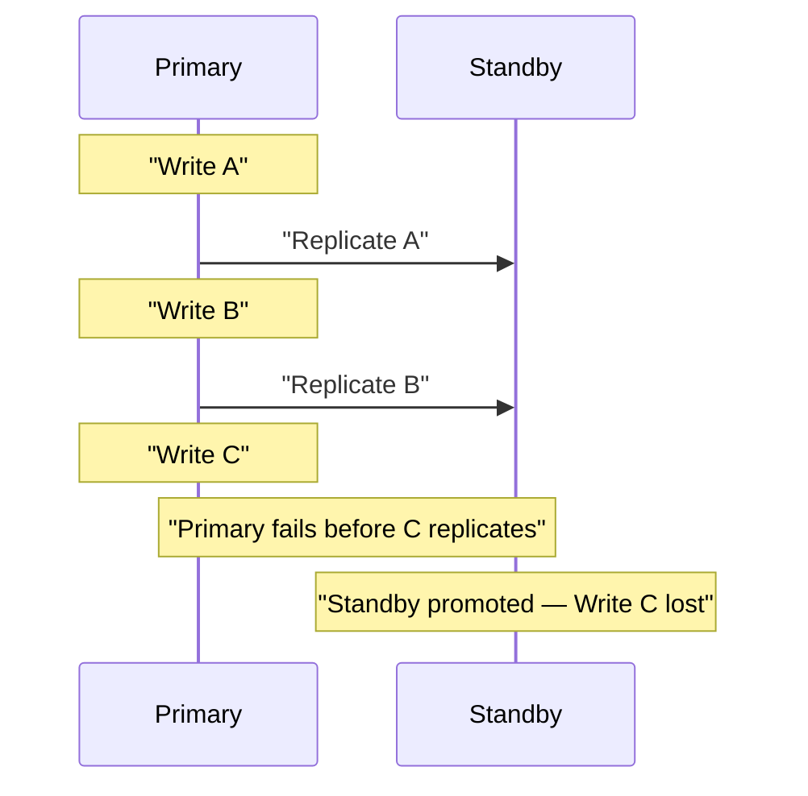
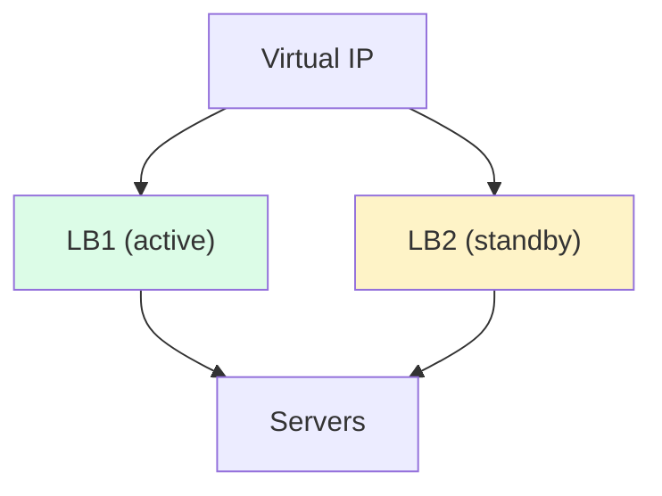
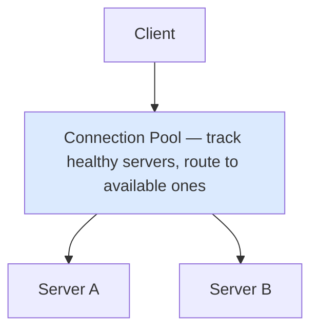

## What is Failover?

**Failover** is the process of automatically switching to a backup system when the primary system fails. It's a critical mechanism for achieving high availability in distributed systems.

---

## Failover Strategies

### Active-Passive (Cold/Warm Standby)

One server handles all traffic while others wait in standby.



| **Variant** | **Description** | **Recovery Time** |
|------------|-----------------|-------------------|
| Cold standby | Standby not running, starts on failure | Minutes |
| Warm standby | Standby running, needs data sync | Seconds |
| Hot standby | Standby synchronized, ready instantly | Sub-second |

### Active-Active (Hot-Hot)

Multiple servers handle traffic simultaneously.



| **Aspect** | **Active-Passive** | **Active-Active** |
|-----------|-------------------|-------------------|
| Resource utilization | Low (standby idle) | High (all active) |
| Failover time | Higher | Near-zero |
| Complexity | Lower | Higher |
| Cost efficiency | Lower | Higher |
| Data consistency | Simpler | More complex |

---

## Failover Components

### Health Checks

Detect when systems fail:



Types of health checks:
- **Liveness**: Is the process running?
- **Readiness**: Can it handle requests?
- **Deep health**: Are dependencies healthy?

### Heartbeats

Continuous signals indicating system health:



### Leader Election

Determine which node takes over:

```
1. Primary fails
2. Standbys detect failure
3. Election begins (Raft, ZooKeeper, etc.)
4. One standby becomes new primary
5. Remaining standbys follow new primary
```

---

## Failover Challenges

### Split-Brain

Both nodes think they're primary:



**Solutions**:
- **Quorum**: Majority needed to be primary
- **Fencing**: STONITH (Shoot The Other Node In The Head)
- **Lease-based**: Primary holds time-limited lease

### Data Loss

Standby may not have latest data:



**Solutions**:
- **Synchronous replication**: Wait for standby ACK
- **Semi-synchronous**: Wait for at least one standby
- **Async with minimal loss**: Accept some data loss

### Failback

Returning to the original primary:

```
1. Original primary recovers
2. Sync data from current primary
3. Coordinate switch back
4. Original primary becomes active
```

Considerations:
- Is failback necessary?
- Manual vs automatic failback
- Data synchronization before switch

---

## Implementation Patterns

### Database Failover


On primary failure:
- Replica 1 promoted to primary
- Replica 2 follows new primary
- Application reconnects

### Load Balancer Failover



LB1 fails → LB2 claims Virtual IP

### Application Failover



---

## Real-World Examples

### AWS RDS Multi-AZ

- Synchronous replication to standby
- Automatic failover on primary failure
- DNS endpoint updated automatically
- ~60-120 seconds failover time

### Redis Sentinel

- Monitors Redis primary and replicas
- Automatic failover with leader election
- Client notification of topology changes

### Kubernetes

- Pod health checks (liveness/readiness)
- Automatic pod restart on failure
- ReplicaSet maintains desired count
- Service routes around failed pods

---

## Best Practices

1. **Test failover regularly**: Don't wait for production failure
2. **Automate recovery**: Manual intervention is slow
3. **Monitor failover metrics**: Time to detect, time to recover
4. **Document runbooks**: Know what to do when automation fails
5. **Consider blast radius**: Isolate failures to minimize impact

---

## Interview Tips

- **Know the types**: Active-passive vs active-active trade-offs
- **Discuss challenges**: Split-brain, data loss, failback
- **Mention tools**: ZooKeeper, etcd, Consul for coordination
- **Give examples**: AWS RDS, Redis Sentinel, Kubernetes
- **Health checks**: Explain liveness vs readiness

---

## Summary

Failover is essential for high availability:

| **Strategy** | **Best For** | **Trade-off** |
|-------------|-------------|---------------|
| Cold standby | Cost-sensitive | Longer recovery |
| Warm standby | Balance | Medium complexity |
| Hot standby | Critical systems | Higher cost |
| Active-active | Maximum availability | Highest complexity |

Choose based on your availability requirements, budget, and operational capability.
