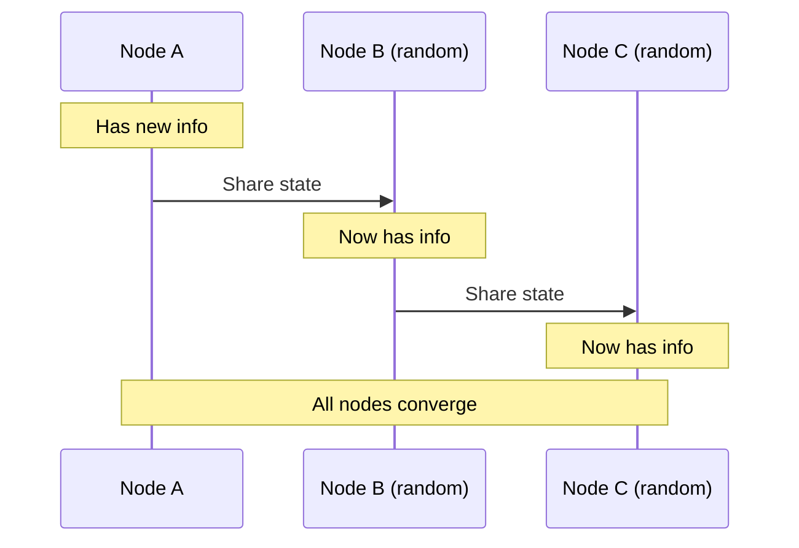
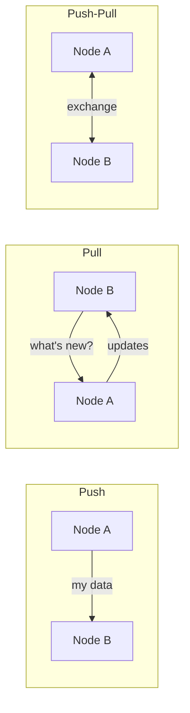
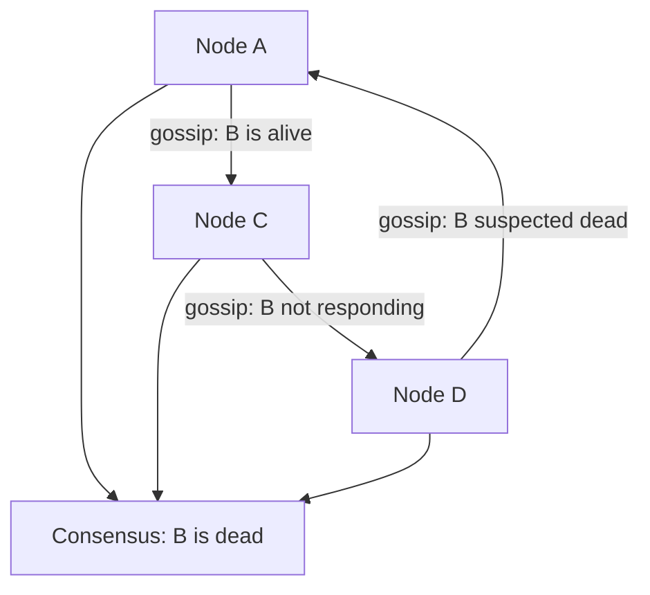

## What is Gossip Protocol?

The **Gossip Protocol** (or epidemic protocol) is a peer-to-peer communication mechanism where nodes periodically exchange state information with random peers. Like rumors spreading in a group, information eventually reaches all nodes.

---

## How It Works



Each round, every node:
1. Selects a random peer
2. Exchanges state information
3. Merges received state with local state

---

## Dissemination Styles

| **Style** | **How** | **Use Case** |
|----------|---------|-------------|
| Push | Send my updates to peer | Fast initial spread |
| Pull | Ask peer for their updates | Catching up |
| Push-Pull | Exchange updates both ways | Most efficient |



---

## Convergence Speed

With N nodes and push-pull gossip:

```
Rounds to reach all nodes ≈ O(log N)

Example:
100 nodes   → ~7 rounds
1,000 nodes → ~10 rounds
10,000 nodes → ~14 rounds
```

Information spreads **exponentially** — like a virus.

---

## Use Cases

### Failure Detection



Nodes share heartbeat counters. If a node's counter stops incrementing across multiple gossip rounds, it's marked as failed.

### Membership Management

Track which nodes are in the cluster:

| **Event** | **Gossip Action** |
|----------|------------------|
| Node joins | Spreads join announcement |
| Node leaves | Spreads leave announcement |
| Node fails | Failure detection via heartbeats |

### Data Dissemination

Spread configuration updates, schema changes, or routing tables without a central coordinator.

---

## Gossip in Real Systems

| **System** | **Uses Gossip For** |
|-----------|-------------------|
| Cassandra | Cluster membership, failure detection |
| DynamoDB | Ring membership, reachability |
| Consul | Membership (Serf protocol) |
| Redis Cluster | Node discovery, failover |
| CockroachDB | Node liveness, range metadata |

---

## Properties

| **Property** | **Value** |
|-------------|----------|
| Consistency | Eventual |
| Scalability | O(log N) convergence |
| Fault tolerance | No single point of failure |
| Bandwidth | O(N) per round |
| Reliability | Probabilistic (not guaranteed) |

---

## Trade-offs

| **Pros** | **Cons** |
|---------|---------|
| Decentralized (no coordinator) | Eventual consistency only |
| Scalable to thousands of nodes | Bandwidth grows with cluster size |
| Tolerates network partitions | Non-deterministic convergence |
| Simple to implement | Redundant message delivery |

---

## Interview Tips

- Explain the rumor-spreading analogy
- Know convergence speed: O(log N) rounds
- Discuss push vs pull vs push-pull
- Give examples: Cassandra, Consul, DynamoDB
- Compare with broadcast (gossip is more scalable)
