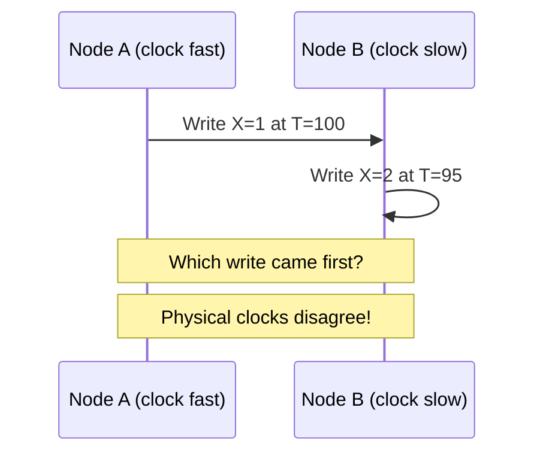
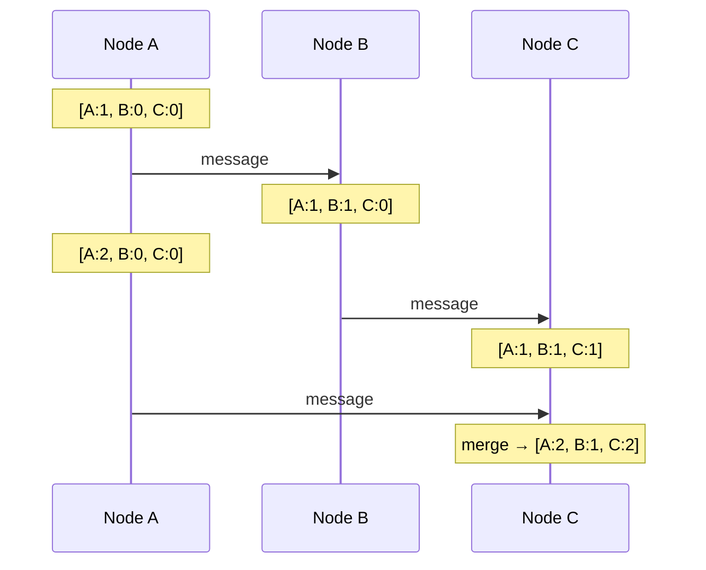
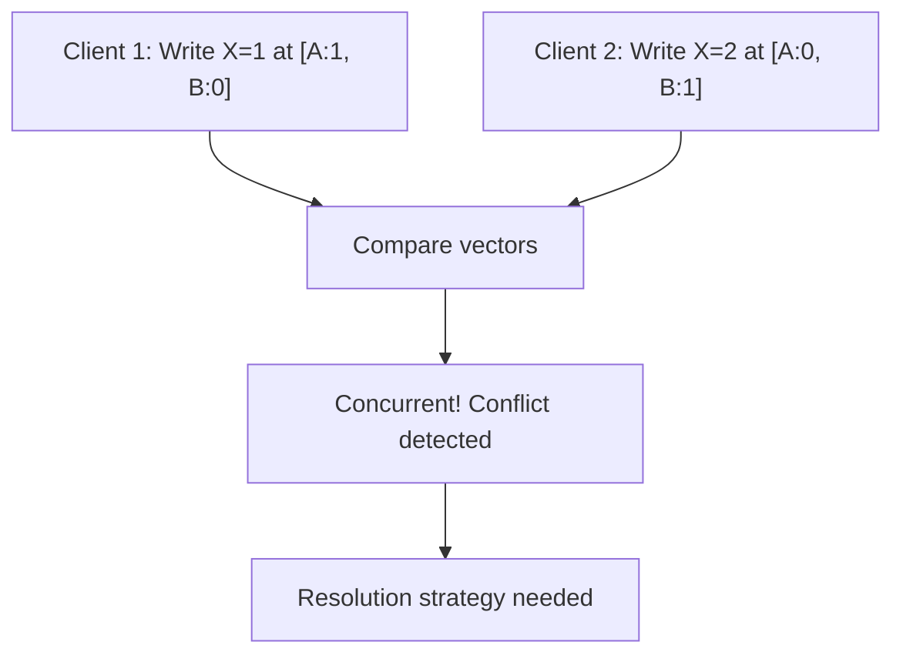

## What are Vector Clocks?

**Vector Clocks** are a mechanism for tracking causality and detecting concurrent events in distributed systems. Each node maintains a vector of logical timestamps — one entry per node in the system.

---

## The Problem with Physical Clocks



Physical clocks drift and can't reliably determine event ordering across nodes.

---

## How Vector Clocks Work

Each node maintains a vector: `[A:count, B:count, C:count]`

### Rules

1. **Before sending**: Increment own entry
2. **On receive**: Merge vectors (take max of each entry), then increment own entry

### Example



---

## Comparing Events

Given vectors V1 and V2:

| **Relationship** | **Condition** | **Meaning** |
|-----------------|--------------|------------|
| V1 &lt; V2 | All entries in V1 ≤ V2, at least one strictly less | V1 happened before V2 |
| V1 &gt; V2 | All entries in V1 ≥ V2, at least one strictly greater | V1 happened after V2 |
| V1 ‖ V2 | Neither ≤ nor ≥ | Concurrent (conflict!) |

### Example

```
Event X: [A:2, B:1, C:0]
Event Y: [A:1, B:2, C:0]

X[A]=2 > Y[A]=1, but X[B]=1 < Y[B]=2
→ Neither dominates → Concurrent!
→ Application must resolve conflict
```

---

## Conflict Detection



### Resolution Strategies

| **Strategy** | **How** | **Used By** |
|-------------|---------|------------|
| Last-Write-Wins | Use wall clock as tiebreaker | Cassandra |
| Keep both | Return siblings to client | Riak |
| Application logic | Domain-specific merge | Shopping carts |
| CRDTs | Auto-mergeable data types | Redis, Riak |

---

## Vector Clocks vs Lamport Clocks

| **Aspect** | **Lamport Clock** | **Vector Clock** |
|-----------|------------------|-----------------|
| Structure | Single counter | Vector of counters |
| Detect causality | If L(a) < L(b), maybe a→b | If V(a) < V(b), definitely a→b |
| Detect concurrency | Cannot | Can |
| Space | O(1) | O(N) per event |

Lamport clocks tell you "a might have happened before b." Vector clocks tell you "a definitely happened before b" or "a and b are concurrent."

---

## Real-World Usage

| **System** | **How Used** |
|-----------|-------------|
| DynamoDB | Detects conflicting writes |
| Riak | Sibling detection and resolution |
| Voldemort | Conflict detection |
| CockroachDB | Hybrid logical clocks (related) |

---

## Limitations

| **Issue** | **Mitigation** |
|----------|---------------|
| Vector grows with nodes | Use dotted version vectors |
| Space overhead O(N) | Prune old entries |
| Complex merge logic | Use CRDTs instead |
| Clock comparison cost | Optimize for common case |

---

## Interview Tips

- Explain why physical clocks fail in distributed systems
- Know the increment and merge rules
- Demonstrate how to detect concurrent events
- Compare with Lamport clocks (vector clocks detect concurrency)
- Mention use in DynamoDB and Riak
