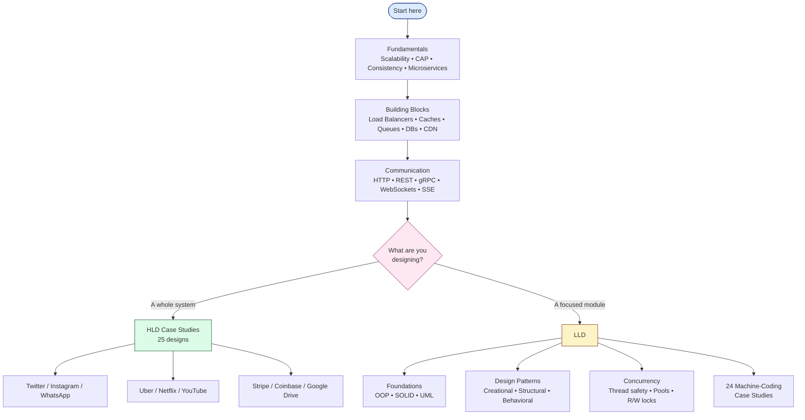
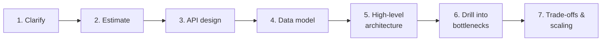

import { Cards, Card } from 'fumadocs-ui/components/card';

A practical, opinionated guide to system design — for interviews, architecture work, and building real systems.

---

## Pick Your Path

<Cards>
  <Card title="System Design" href="/sd/fundamentals/what-is-system-design" description="Fundamentals, components, communication, security, observability" />
  <Card title="HLD Case Studies" href="/hld" description="25 real-world architectures: Twitter, Uber, Netflix, Stripe, ..." />
  <Card title="LLD & Patterns" href="/lld" description="OOP, 22 design patterns, concurrency, 24 machine-coding case studies" />
</Cards>

---

## How the Sections Fit Together

---

## Three Tracks

<Cards>
  <Card title="Beginner — start with fundamentals" href="/sd/fundamentals/what-is-system-design" description="What is system design → scalability → CAP → consistency → microservices" />
  <Card title="Interview prep — drill case studies" href="/hld/url-shortener" description="Pick a case study a day. URL shortener → Twitter → Uber → Stripe." />
  <Card title="Engineer on the job — pattern reference" href="/lld" description="Look up the right pattern for the problem in front of you." />
</Cards>

---

## What You Get

### System Design (HLD building blocks)

[Fundamentals](/sd/fundamentals/what-is-system-design) — what system design is, how to approach a problem, and the math (estimates, capacity planning). Theory: CAP, PACELC, consistency models, distributed consensus, gossip, vector clocks.

[Building Blocks](/sd/building-blocks/load-balancer) — load balancers, reverse proxies, caches (cache-aside, write-through, write-behind), CDN, message queues, pub/sub, sharding, consistent hashing, bloom filters, rate limiting, distributed locking, leader election.

[Architecture](/sd/architecture/api-gateway) — API gateways, BFF, service discovery, service mesh.

[Communication](/sd/communication/http) — HTTP, REST, GraphQL, gRPC, WebSockets, SSE, webhooks.

[Design Patterns (HLD)](/sd/design-patterns/circuit-breaker) — circuit breaker, bulkhead, retry, idempotency, saga, CQRS, event sourcing, strangler fig.

[Observability](/sd/observability/logging) and [Security](/sd/security/authentication).

### HLD Case Studies — 25 designs

Real architectures with diagrams, data models, and trade-offs:

- **Foundational**: [URL Shortener](/hld/url-shortener), [Pastebin](/hld/pastebin), [Rate Limiter](/hld/rate-limiter), [Typeahead](/hld/typeahead), [Web Crawler](/hld/web-crawler)
- **Social & Messaging**: [Twitter](/hld/twitter), [Instagram](/hld/instagram), [WhatsApp](/hld/whatsapp), [Slack](/hld/slack), [News Feed](/hld/news-feed), [Notification System](/hld/notification-system)
- **Streaming & Video**: [Netflix](/hld/netflix), [YouTube](/hld/youtube)
- **Marketplace & Logistics**: [Uber](/hld/uber), [Amazon](/hld/amazon)
- **Fintech**: [Stripe](/hld/stripe), [Coinbase](/hld/coinbase)
- **Storage & Collaboration**: [Google Docs](/hld/google-docs), [Google Drive](/hld/google-drive), [Dropbox Sign](/hld/dropbox-sign)
- **Gaming & Booking**: [Chess.com](/hld/chess-com), [LeetCode](/hld/leetcode), [Ticket Booking](/hld/ticket-booking)

### LLD & Patterns

[Foundations](/lld/foundations/solid) — OOP principles, SOLID, UML diagrams, DRY/KISS/YAGNI, composition vs inheritance, coupling & cohesion.

**22 GoF Patterns**, organized by intent:

- **[Creational](/lld/patterns/creational/singleton)** — Singleton, Factory, Abstract Factory, Builder, Prototype
- **[Structural](/lld/patterns/structural/adapter)** — Adapter, Bridge, Composite, Decorator, Facade, Flyweight, Proxy
- **[Behavioral](/lld/patterns/behavioral/strategy)** — Strategy, Observer, Command, State, Chain of Responsibility, Template Method, Iterator, Mediator, Visitor, Memento

[Concurrency](/lld/concurrency/thread-safety) — thread safety, producer-consumer, read-write locks, thread pools.

**24 Machine-Coding Case Studies** — interview-ready designs with class diagrams, code, and pattern usage:

- **Games & Puzzles**: [Tic-Tac-Toe](/lld/case-studies/tic-tac-toe), [Snake & Ladder](/lld/case-studies/snake-and-ladder), [Chess](/lld/case-studies/chess-game)
- **Booking & Reservation**: [Movie Booking](/lld/case-studies/movie-booking), [Hotel Booking](/lld/case-studies/hotel-booking), [Car Rental](/lld/case-studies/car-rental), [Meeting Scheduler](/lld/case-studies/meeting-scheduler), [Airline Management](/lld/case-studies/airline-management)
- **Devices & Systems**: [Parking Lot](/lld/case-studies/parking-lot), [Elevator](/lld/case-studies/elevator-system), [Vending Machine](/lld/case-studies/vending-machine), [ATM System](/lld/case-studies/atm-system), [Traffic Signal](/lld/case-studies/traffic-signal)
- **Apps & Services**: [Splitwise](/lld/case-studies/splitwise), [Food Delivery](/lld/case-studies/food-delivery), [LinkedIn Connections](/lld/case-studies/linkedin-connections), [Stack Overflow](/lld/case-studies/stack-overflow), [Online Shopping Cart](/lld/case-studies/online-shopping-cart), [Library Management](/lld/case-studies/library-management)
- **Infrastructure**: [Logger](/lld/case-studies/logger), [LRU/LFU Cache](/lld/case-studies/cache-lru-lfu), [Rate Limiter (LLD)](/lld/case-studies/rate-limiter-lld), [File System](/lld/case-studies/file-system), [Inventory Management](/lld/case-studies/inventory-management)

---

## Approach Cheat Sheet

For any system-design question, start here:

1. **Clarify** — functional + non-functional requirements. Don't assume.
2. **Estimate** — QPS, storage, bandwidth. Numbers shape everything else.
3. **API design** — name the operations and their request/response shapes.
4. **Data model** — what's stored, where, and how it's keyed.
5. **High-level architecture** — boxes and arrows.
6. **Drill into bottlenecks** — caching, sharding, async processing.
7. **Trade-offs** — every decision has a cost; name it.

For LLD interviews: clarify → identify entities → relationships → pick patterns deliberately → handle concurrency → discuss extensibility.

---

## Tips

- **Don't memorize** — understand the trade-offs. The same component fits one problem and breaks another.
- **Estimate first** — back-of-envelope numbers prevent over-engineering small systems and under-engineering large ones.
- **Name your patterns** — "we use a circuit breaker because the downstream is flaky" is sharper than "we add error handling".
- **Practice writing**, not just reading — pick a case study, draw it from scratch, *then* compare.
