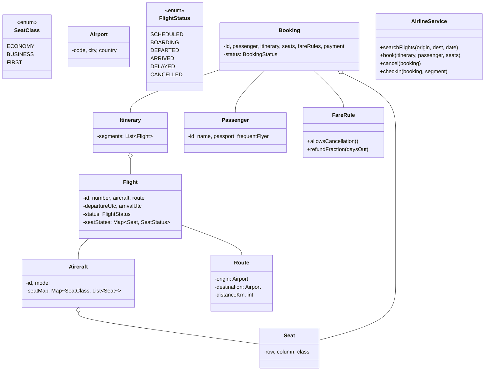
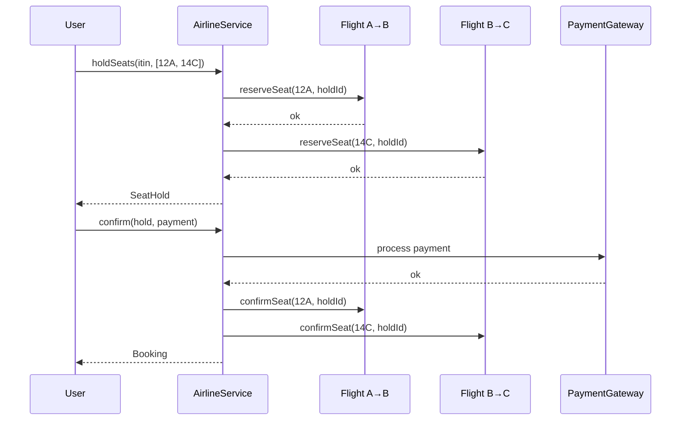

## Problem Statement

Design an airline reservation system supporting:
- Flight schedules across cities
- Aircraft and seat layouts (multi-class: economy, business, first)
- Search by route + date
- Booking with seat selection
- Multi-leg itineraries (with layovers)
- Cancellation and refund per fare rules
- Check-in and boarding

---

## Requirements

### Functional
- Aircraft types with seat maps (config per class)
- Flights = (aircraft, route, departure, arrival)
- Search by origin / destination / date / class
- Multi-leg itineraries with connections
- Book a seat for a passenger; validate availability
- Cancel / refund / change
- Online check-in within window

### Non-Functional
- No double-booking on a (flight, seat) pair
- Concurrent search and booking
- Audit trail
- Eventual consistency in search index OK

---

## Class Diagram



---

## Aircraft & Seat Map

```java
public enum SeatClass { ECONOMY, BUSINESS, FIRST }

public class Seat {
    public final String id;            // "12A"
    public final int row;
    public final char column;          // 'A', 'B', ...
    public final SeatClass seatClass;

    public Seat(int row, char col, SeatClass cls) {
        this.id = row + String.valueOf(col);
        this.row = row; this.column = col; this.seatClass = cls;
    }
}

public class Aircraft {
    private final String id;
    private final String model;
    private final List<Seat> seats;

    public List<Seat> seatsByClass(SeatClass cls) {
        return seats.stream().filter(s -> s.seatClass == cls).toList();
    }
}
```

A `Boeing 787` is its own `Aircraft` with a fixed seat map. Different aircraft of the same model could have slightly different layouts.

---

## Flight & Per-Flight Seat State

```java
public enum SeatStatus { AVAILABLE, HELD, BOOKED, BLOCKED }

public class Flight {
    private final String id;
    private final String number;
    private final Aircraft aircraft;
    private final Route route;
    private final ZonedDateTime departure;
    private final ZonedDateTime arrival;
    private FlightStatus status = FlightStatus.SCHEDULED;

    private final ConcurrentMap<String, SeatStateHolder> seatStates = new ConcurrentHashMap<>();

    public Flight(Aircraft aircraft, Route route, ZonedDateTime dep, ZonedDateTime arr) {
        this.id = UUID.randomUUID().toString();
        this.number = generateNumber();
        this.aircraft = aircraft;
        this.route = route;
        this.departure = dep;
        this.arrival = arr;
        for (Seat s : aircraft.getAllSeats()) {
            seatStates.put(s.id, new SeatStateHolder());
        }
    }

    public synchronized boolean reserveSeat(String seatId, String holdId) {
        SeatStateHolder h = seatStates.get(seatId);
        if (h == null || h.status != SeatStatus.AVAILABLE) return false;
        h.status = SeatStatus.HELD;
        h.holdId = holdId;
        return true;
    }

    public synchronized void confirmSeat(String seatId, String holdId) {
        SeatStateHolder h = seatStates.get(seatId);
        if (h == null || !holdId.equals(h.holdId)) throw new IllegalStateException();
        h.status = SeatStatus.BOOKED;
    }

    public synchronized void releaseSeat(String seatId, String holdId) {
        SeatStateHolder h = seatStates.get(seatId);
        if (h != null && holdId.equals(h.holdId)) {
            h.status = SeatStatus.AVAILABLE;
            h.holdId = null;
        }
    }

    public List<Seat> availableSeats(SeatClass cls) {
        return aircraft.seatsByClass(cls).stream()
            .filter(s -> seatStates.get(s.id).status == SeatStatus.AVAILABLE)
            .toList();
    }

    private static class SeatStateHolder {
        SeatStatus status = SeatStatus.AVAILABLE;
        String holdId;
    }
}
```

---

## Search (Multi-Leg)

```java
public class FlightSearch {
    private final FlightRepository flights;
    private final int MAX_LAYOVERS = 2;

    public List<Itinerary> search(Airport origin, Airport dest,
                                   LocalDate date, SeatClass cls) {
        List<Itinerary> result = new ArrayList<>();
        // Direct flights
        for (Flight f : flights.findByRouteAndDate(origin, dest, date)) {
            if (hasAvailability(f, cls)) result.add(new Itinerary(List.of(f)));
        }
        // 1-stop
        for (Airport hub : possibleHubs()) {
            if (hub.equals(origin) || hub.equals(dest)) continue;
            for (Flight leg1 : flights.findByRouteAndDate(origin, hub, date)) {
                for (Flight leg2 : flights.findByRouteAfter(hub, dest, leg1.getArrival())) {
                    if (validConnection(leg1, leg2)
                            && hasAvailability(leg1, cls)
                            && hasAvailability(leg2, cls)) {
                        result.add(new Itinerary(List.of(leg1, leg2)));
                    }
                }
            }
        }
        return result;
    }

    private boolean validConnection(Flight a, Flight b) {
        Duration layover = Duration.between(a.getArrival(), b.getDeparture());
        return layover.compareTo(Duration.ofMinutes(45)) >= 0
            && layover.compareTo(Duration.ofHours(8)) <= 0;
    }
}
```

For real airlines, this search becomes a **graph problem** — Dijkstra or BFS over a flight graph with edges per scheduled flight. Indexing services like AmadeusGDS pre-compute results.

---

## Booking with Atomic Multi-Seat Reservation

```java
public class AirlineService {
    private static final Duration HOLD_TTL = Duration.ofMinutes(10);
    private final Map<String, SeatHold> holds = new ConcurrentHashMap<>();

    public SeatHold holdSeats(Itinerary itin, List<String> seatIds) {
        String holdId = UUID.randomUUID().toString();
        if (itin.segments().size() != seatIds.size())
            throw new IllegalArgumentException("seat per segment");

        // Phase 1: reserve all
        List<Pair<Flight, String>> acquired = new ArrayList<>();
        for (int i = 0; i < itin.segments().size(); i++) {
            Flight f = itin.segments().get(i);
            String sid = seatIds.get(i);
            if (!f.reserveSeat(sid, holdId)) {
                // Rollback
                for (Pair<Flight, String> p : acquired) p.left.releaseSeat(p.right, holdId);
                throw new SeatUnavailableException();
            }
            acquired.add(new Pair<>(f, sid));
        }

        SeatHold hold = new SeatHold(holdId, itin, seatIds, HOLD_TTL);
        holds.put(holdId, hold);
        return hold;
    }

    public Booking confirm(SeatHold hold, Passenger p, Payment payment) {
        if (hold.isExpired()) throw new HoldExpiredException();
        // Process payment
        payment.process();
        // Confirm all seats
        for (int i = 0; i < hold.itinerary.segments().size(); i++) {
            Flight f = hold.itinerary.segments().get(i);
            f.confirmSeat(hold.seatIds.get(i), hold.id);
        }
        Booking b = new Booking(p, hold.itinerary, hold.seatIds, payment);
        holds.remove(hold.id);
        return b;
    }
}
```

Multi-leg booking is **all-or-nothing** — if any leg's seat fails, release all.

---

## Cancellation (Strategy)

```java
public interface FareRule {
    boolean allowsCancellation();
    double refundFraction(Duration timeUntilDeparture);
}

public class FlexibleFare implements FareRule {
    public boolean allowsCancellation() { return true; }
    public double refundFraction(Duration t) { return 1.0; }     // full refund anytime
}

public class StandardFare implements FareRule {
    public boolean allowsCancellation() { return true; }
    public double refundFraction(Duration t) {
        if (t.toDays() > 7) return 0.8;
        if (t.toHours() > 24) return 0.5;
        return 0.0;
    }
}

public class NonRefundableFare implements FareRule {
    public boolean allowsCancellation() { return true; }
    public double refundFraction(Duration t) { return 0.0; }
}
```

---

## Sequence: Book Multi-Leg Flight



---

## Check-in

```java
public class CheckInService {
    public BoardingPass checkIn(Booking b, Flight segment) {
        Duration timeToDeparture = Duration.between(Instant.now(), segment.getDeparture().toInstant());
        if (timeToDeparture.compareTo(Duration.ofHours(24)) > 0) {
            throw new CheckInWindowNotOpenException();
        }
        if (timeToDeparture.compareTo(Duration.ofMinutes(45)) < 0) {
            throw new CheckInClosedException();
        }
        return new BoardingPass(b.getPassenger(), segment, b.seatFor(segment));
    }
}
```

---

## Edge Cases

| **Case** | **Handling** |
|---------|-------------|
| Hold expires mid-payment | Release all seats; user retries |
| Multi-leg with one cancelled flight | Auto-rebook on next available; or refund |
| Overbooking (intentional) | Compensate bumped passenger; airlines often overbook 5% |
| Time zone confusion | Always store UTC; render in local TZ at display |
| Layover too short | Search filters out connections < 45 min |
| Aircraft swap (different seat map) | Reseat passengers, attempt to preserve class |
| No-show | Hold seat through departure; later mark missed |

---

## Design Patterns Used

| **Pattern** | **Where** |
|------------|-----------|
| **State** | `FlightStatus`, `SeatStatus`, `BookingStatus` |
| **Strategy** | Fare rules (refund policy), search algorithm |
| **Facade** | `AirlineService` |
| **Repository** | Flights, bookings, passengers |
| **Observer** | Notify passenger of delays / changes |
| **Builder** | Itinerary construction |
| **Composite** | `Itinerary` is a list of `Flight` segments — uniform treatment |

---

## Interview Tips

- Distinguish the static **seat map** (per aircraft type) from per-flight **seat state** (which seats are booked on this specific flight). Same plane → many flights → independent seat states.
- Multi-leg booking must be **atomic** — all legs reserved, or none.
- Bring up **idempotent payment** (same as movie booking) and **hold TTL** for mid-checkout protection.
- Mention **GDS** (Global Distribution Systems like Amadeus / Sabre) — that's how real airlines do flight inventory, and it's worth knowing the term.
- For overbooking, mention the airline industry deliberately overbooks ~5% — it's a real strategy, not a bug.
