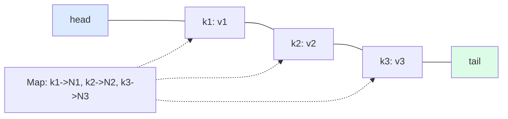

## Problem Statement

Design a thread-safe in-memory key-value cache that:
- Has a fixed capacity
- Supports `get(key)` and `put(key, value)` in O(1)
- Evicts based on a configurable policy (LRU, LFU)
- Optional TTL per entry

---

## Requirements

### Functional
- Bounded capacity
- O(1) `get` and `put`
- LRU and LFU eviction
- TTL support
- Stats (hit ratio, eviction count)

### Non-Functional
- Thread-safe
- Low memory overhead per entry
- Predictable latency

---

## API

```java
public interface Cache<K, V> {
    V get(K key);
    void put(K key, V value);
    void remove(K key);
    int size();
    int capacity();
}
```

---

## LRU: Doubly-Linked List + HashMap

The classic O(1) trick: each node lives in **both** a `HashMap` (for O(1) lookup) and a **doubly-linked list** (for O(1) reorder/evict).



**Convention:** head = most-recently-used; tail = least-recently-used (eviction candidate).

```java
public class LRUCache<K, V> implements Cache<K, V> {
    private static class Node<K, V> {
        K key; V value;
        Node<K, V> prev, next;
        Node(K k, V v) { this.key = k; this.value = v; }
    }

    private final int capacity;
    private final Map<K, Node<K, V>> map = new HashMap<>();
    private final Node<K, V> head = new Node<>(null, null);   // sentinel
    private final Node<K, V> tail = new Node<>(null, null);   // sentinel

    public LRUCache(int capacity) {
        if (capacity <= 0) throw new IllegalArgumentException();
        this.capacity = capacity;
        head.next = tail;
        tail.prev = head;
    }

    @Override
    public synchronized V get(K key) {
        Node<K, V> n = map.get(key);
        if (n == null) return null;
        moveToHead(n);
        return n.value;
    }

    @Override
    public synchronized void put(K key, V value) {
        Node<K, V> n = map.get(key);
        if (n != null) {
            n.value = value;
            moveToHead(n);
            return;
        }
        if (map.size() == capacity) {
            Node<K, V> lru = tail.prev;
            removeNode(lru);
            map.remove(lru.key);
        }
        Node<K, V> fresh = new Node<>(key, value);
        addToHead(fresh);
        map.put(key, fresh);
    }

    private void addToHead(Node<K, V> n) {
        n.prev = head;
        n.next = head.next;
        head.next.prev = n;
        head.next = n;
    }

    private void removeNode(Node<K, V> n) {
        n.prev.next = n.next;
        n.next.prev = n.prev;
    }

    private void moveToHead(Node<K, V> n) {
        removeNode(n);
        addToHead(n);
    }
}
```

Sentinel head/tail nodes simplify edge cases (no null checks for empty list).

---

## LFU: HashMap + Frequency Buckets

LFU evicts the least-frequently-used. The trick is breaking ties by **recency** within the same frequency, and finding the min frequency in O(1).

Structure:
- `keyToValueAndFreq`: map from key to (value, current frequency)
- `freqToKeys`: map from frequency to a doubly-linked set of keys (LRU order within the frequency)
- `minFreq`: smallest frequency currently used

```java
public class LFUCache<K, V> implements Cache<K, V> {
    private final int capacity;
    private int minFreq = 0;
    private final Map<K, Entry<V>> store = new HashMap<>();
    private final Map<Integer, LinkedHashSet<K>> freqBuckets = new HashMap<>();

    private static class Entry<V> {
        V value; int freq;
        Entry(V v) { this.value = v; this.freq = 1; }
    }

    public LFUCache(int capacity) { this.capacity = capacity; }

    @Override
    public synchronized V get(K key) {
        Entry<V> e = store.get(key);
        if (e == null) return null;
        bumpFreq(key, e);
        return e.value;
    }

    @Override
    public synchronized void put(K key, V value) {
        if (capacity <= 0) return;
        Entry<V> e = store.get(key);
        if (e != null) {
            e.value = value;
            bumpFreq(key, e);
            return;
        }
        if (store.size() == capacity) {
            // Evict least-frequent, oldest in that frequency
            LinkedHashSet<K> bucket = freqBuckets.get(minFreq);
            K victim = bucket.iterator().next();
            bucket.remove(victim);
            store.remove(victim);
            if (bucket.isEmpty()) freqBuckets.remove(minFreq);
        }
        store.put(key, new Entry<>(value));
        freqBuckets.computeIfAbsent(1, k -> new LinkedHashSet<>()).add(key);
        minFreq = 1;
    }

    private void bumpFreq(K key, Entry<V> e) {
        LinkedHashSet<K> oldBucket = freqBuckets.get(e.freq);
        oldBucket.remove(key);
        if (oldBucket.isEmpty()) {
            freqBuckets.remove(e.freq);
            if (e.freq == minFreq) minFreq++;
        }
        e.freq++;
        freqBuckets.computeIfAbsent(e.freq, k -> new LinkedHashSet<>()).add(key);
    }
}
```

`LinkedHashSet` gives both O(1) membership *and* insertion-order iteration — perfect for "oldest in this frequency."

---

## Cache as Strategy

```java
public interface EvictionPolicy<K> {
    void onAccess(K key);
    void onInsert(K key);
    K victim();
}

public class GenericCache<K, V> {
    private final int capacity;
    private final Map<K, V> store = new HashMap<>();
    private final EvictionPolicy<K> policy;

    public GenericCache(int cap, EvictionPolicy<K> p) {
        this.capacity = cap; this.policy = p;
    }

    public V get(K key) {
        V v = store.get(key);
        if (v != null) policy.onAccess(key);
        return v;
    }

    public void put(K key, V value) {
        if (store.size() == capacity && !store.containsKey(key)) {
            K victim = policy.victim();
            store.remove(victim);
        }
        store.put(key, value);
        policy.onInsert(key);
    }
}
```

Swap policy implementations for LRU, LFU, FIFO, ARC, etc.

---

## TTL Support

Wrap entries with expiry timestamps, check on access:

```java
public class TTLCache<K, V> implements Cache<K, V> {
    private static class Stamped<V> {
        final V value; final long expiresAtMs;
        Stamped(V v, long exp) { this.value = v; this.expiresAtMs = exp; }
    }

    private final Cache<K, Stamped<V>> backing;

    public V get(K key) {
        Stamped<V> s = backing.get(key);
        if (s == null) return null;
        if (System.currentTimeMillis() > s.expiresAtMs) {
            backing.remove(key);
            return null;
        }
        return s.value;
    }

    public void put(K key, V value, long ttlMs) {
        backing.put(key, new Stamped<>(value, System.currentTimeMillis() + ttlMs));
    }
}
```

For active expiration (not just on access), run a periodic scan or use a `DelayQueue` of expiry events.

---

## Concurrency

Three approaches:

| **Approach** | **Pro** | **Con** |
|-------------|---------|---------|
| `synchronized` on every method | Simple | One global lock = bottleneck |
| `ConcurrentHashMap` + striped locks | Better throughput | Complex eviction |
| Sharded cache (N independent caches) | Near-linear scaling | Eviction not globally optimal |

For high-throughput production use, see Caffeine — it uses a clever "buffer + drainer" pattern to avoid lock contention on the access list.

---

## Stats

```java
public class CacheStats {
    private final AtomicLong hits = new AtomicLong();
    private final AtomicLong misses = new AtomicLong();
    private final AtomicLong evictions = new AtomicLong();

    public void recordHit() { hits.incrementAndGet(); }
    public void recordMiss() { misses.incrementAndGet(); }
    public void recordEviction() { evictions.incrementAndGet(); }

    public double hitRate() {
        long h = hits.get(), m = misses.get();
        return h + m == 0 ? 0 : (double) h / (h + m);
    }
}
```

---

## Real-world Examples

| **System** | **Usage** |
|-----------|-----------|
| Java's `LinkedHashMap` (with `removeEldestEntry`) | Quick LRU |
| Caffeine (Java) | Production-grade, near-Window-LFU |
| Guava `Cache` | Predecessor to Caffeine |
| Redis | Server-side; configurable eviction (`allkeys-lru`, `allkeys-lfu`, ...) |
| Memcached | LRU |
| OS page cache | Approximated LRU (clock algorithm) |

---

## Design Patterns Used

| **Pattern** | **Where** |
|------------|-----------|
| **Strategy** | `EvictionPolicy` swappable |
| **Decorator** | `TTLCache` wraps any `Cache` |
| **Singleton** | One cache instance per app context |
| **Observer** | Listeners on eviction (write-behind cache) |

---

## Interview Tips

- Lead with **doubly-linked list + HashMap** for LRU — interviewers expect it.
- For LFU, the **frequency-buckets** trick is the right answer; don't reach for sorted data structures.
- Mention `LinkedHashMap` shortcut: extend with `removeEldestEntry` for a 5-line LRU.
- Discuss thread safety: a single `synchronized` is fine for interviews; mention striping for production.
- For TTL, distinguish active vs lazy expiration.
